# 第八章：Node.js 对 ASP.NET 开发者的意义

JavaScript 已经成为一种不仅运行在客户端，也运行在服务器端的流行语言之一。**Node.js** 使 JavaScript 能够运行在服务器端，并提供非阻塞 I/O、一个事件驱动的模型，这使得它更加轻量级、可伸缩和高效。如今，它在执行实时操作、开发业务应用程序、数据库操作等方面得到了更广泛的应用。**Node.js** 上的 JavaScript 可以与运行在 IIS 上的 ASP.NET 或其他网络服务器相关联。

# **Node.js** 简介

**Node.js** 是一个使用 JavaScript 构建服务器端应用程序的强大平台。**Node.js** 本身不是用 JavaScript 编写的，但它提供了一个运行 JavaScript 代码的运行时环境。它允许在服务器端运行 JavaScript 代码，提供基于 Google V8 JavaScript 引擎的运行时，这是一个用 C++编写的开源 JavaScript 引擎，由 Google Chrome 使用，用于在 V8 即时编译器执行时将 JavaScript 代码编译成机器代码。

**Node.js** 工作在单线程上；与其他创建每个请求单独线程的服务器端技术不同，**Node.js** 使用事件回调系统，通过单线程处理请求。如果多个请求同时到达，它们必须等待线程可用，然后才能获取它。在错误情况下，**Node.js** 不会抛出错误，这是避免错误冒泡和单线程中断的一个基本技术。如果在处理请求时出现任何错误，**Node.js** 会在响应本身中发送错误日志，通过回调参数。这使得主线程能够传播错误并延迟响应。**Node.js** 适合编写网络应用程序。它包括 HTTP 请求、其他网络通信任务，以及使用 Web Sockets 进行实时客户端/服务器通信。

## **Node.js** 网络服务器请求处理

**Node.js** 网络服务器维护一个有限的线程池来处理客户端请求。当请求到达服务器时，**Node.js** 网络服务器把这个请求放入一个事件队列中。然后事件循环组件——它在一个无限循环中工作——在空闲时处理这个请求。这个事件循环组件是单线程的，如果请求涉及到如文件系统访问、数据库访问等的 I/O 阻塞操作，它会检查内部线程池中的线程可用性，并将请求分配给可用线程。否则，它会一次性处理请求并将响应发送回客户端。当内部线程完成了 I/O 阻塞请求，它会首先将响应发送回事件循环，然后事件循环再将响应发送回客户端。

## **Node.js** 与.NET 的比较

**ASP.NET** 和**Node.js** 都是服务器端技术。下面的图表展示了**Node.js** 与.NET 的比较：

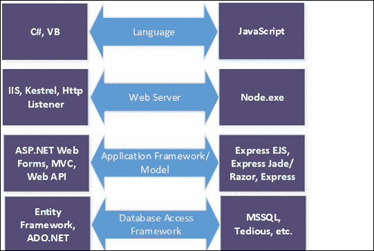

## NPM

**Node 包管理器**（**NPM**）是用于安装 Node 模块的 Node.js 包管理器。Node.js 提供了一种编写 JavaScript 模块的方法，借助 NPM，我们可以在其他应用程序中添加和使用这些模块。在使用 ASP.NET Core 时，我们已经在使用一些模块，例如使用 Gulp 和 Grunt 压缩 CSS 和 JavaScript 文件，以及执行复制和合并操作。`package.json` 文件是包含有关应用程序和项目中使用的 Node 模块的元数据信息的配置文件。以下是 `package.json` 文件的示例截图：

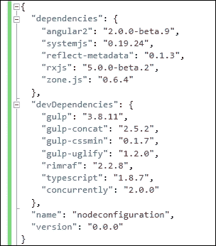

可以通过执行以下命令来安装依赖项：

```js
npm install NAME_OF_THE_PACKAGE –save

```

示例：

```js
npm install gulp –save

```

`--save` 用于更新 `package.json` 的依赖项部分并添加下载的包。

# 安装 Node.js

Visual Studio 为使用 Node.js 开发程序提供了强大的支持。要在 Windows 平台上配置 Node.js 开发环境，请从 [`nodejs.org`](http://nodejs.org) 下载并安装 Node.js。根据平台不同，可用的安装程序各不相同，如下面的截图所示：

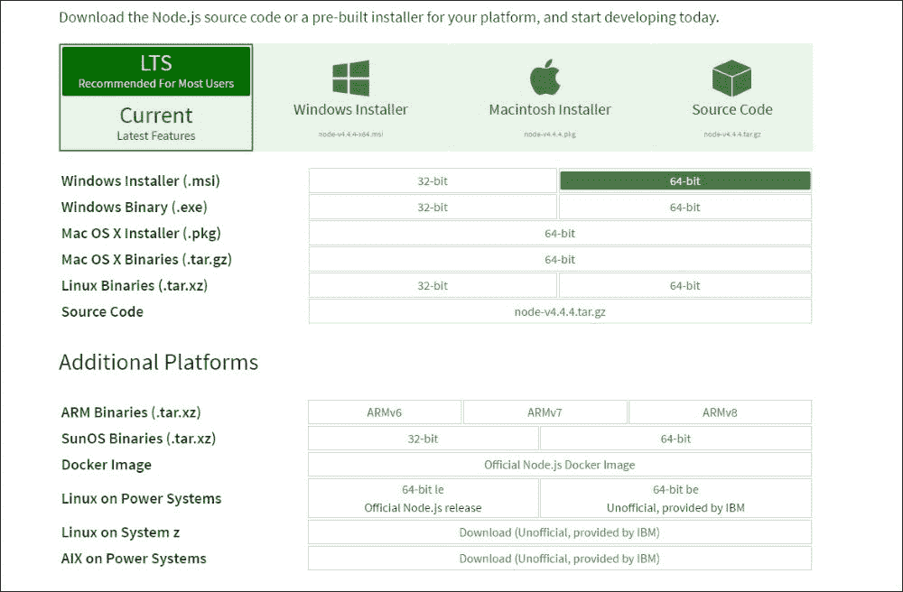

对于 Windows，我们将下载 64 位的 Windows 安装程序，该程序下载`.msi`包并通过一些简单的向导屏幕引导您。您会注意到 Node.js 安装程序包含一个运行 Node 程序的运行时和 NPM，以便在您的程序中引用其他 Node 模块。以下截图展示了这一点：

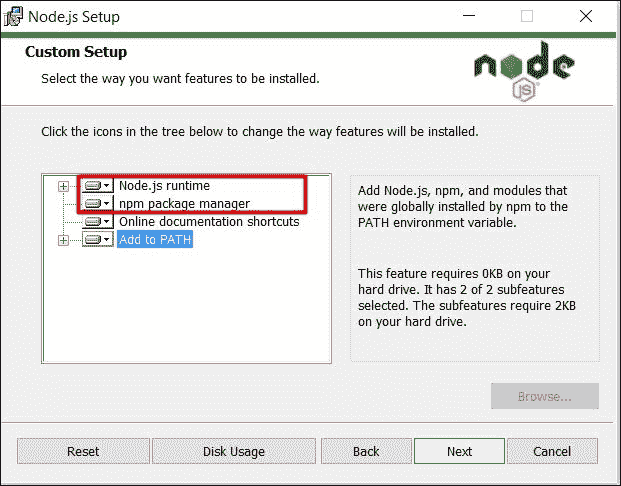

`npm` 和 `node` 这样的命令已经添加到了环境路径中，我们可以直接从命令提示符执行这些命令。因此，如果我们打开命令提示符并输入 `node`，它将给出 Node 提示符，允许你即兴编写 JavaScript 代码并执行，如下面的截图所示：

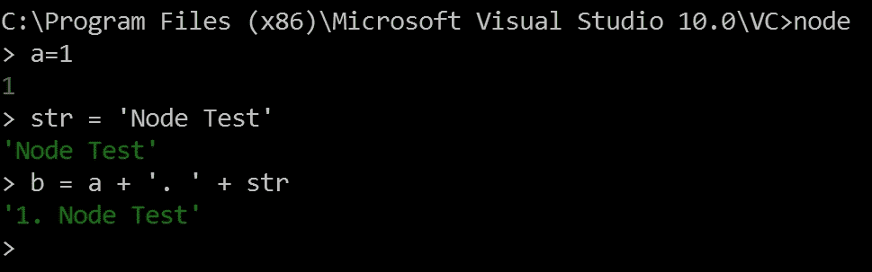

另外，我们还可以通过调用`node javascriptfile.js`来运行`.js`文件。

以下是一个名为`example1.js`的示例文件，该文件用于计算数组中定义的数字之和：

```js
console.log("NodeJs example");

var numbers= [100,20,29,96,55];

var sum=0;
for(i=0; i< numbers.length; i++)
{
 sum += numbers[i];
}
console.log("total sum is "+ sum);

```

以下是输出结果：

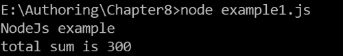

# 使用 Node.js 与 Visual Studio 2015

市场上有很多支持 Node.js 工具的集成开发环境（IDE）。像 Visual Studio Code、Sublime、Komodo 和 Node Eclipse 这样的 IDE 都是流行的 Node.js 工作环境，但实际上，大多数 .NET 开发人员更习惯并熟悉使用 Visual Studio IDE。因此，在本章中，我们将使用 Visual Studio 2015 社区版。

可以在 Visual Studio 2015 中通过安装其扩展来安装 Node.js 模板。可以从 Visual Studio 菜单选项 **工具** | **扩展和更新** 中安装扩展：

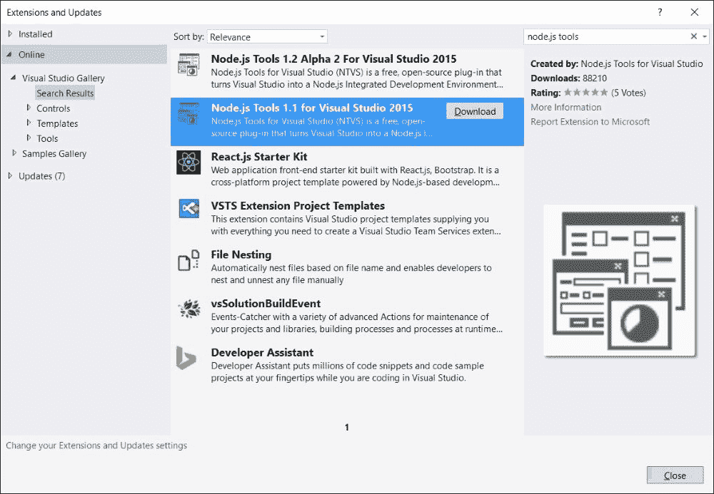

这个 Node.js 扩展安装了各种模板，用于开始使用 Node.js 开发应用程序。有一个模板是使用空白 Node.js 控制台应用程序模板开发控制台应用程序，有一个使用 Node.js express 模板开发 web 应用程序等等：

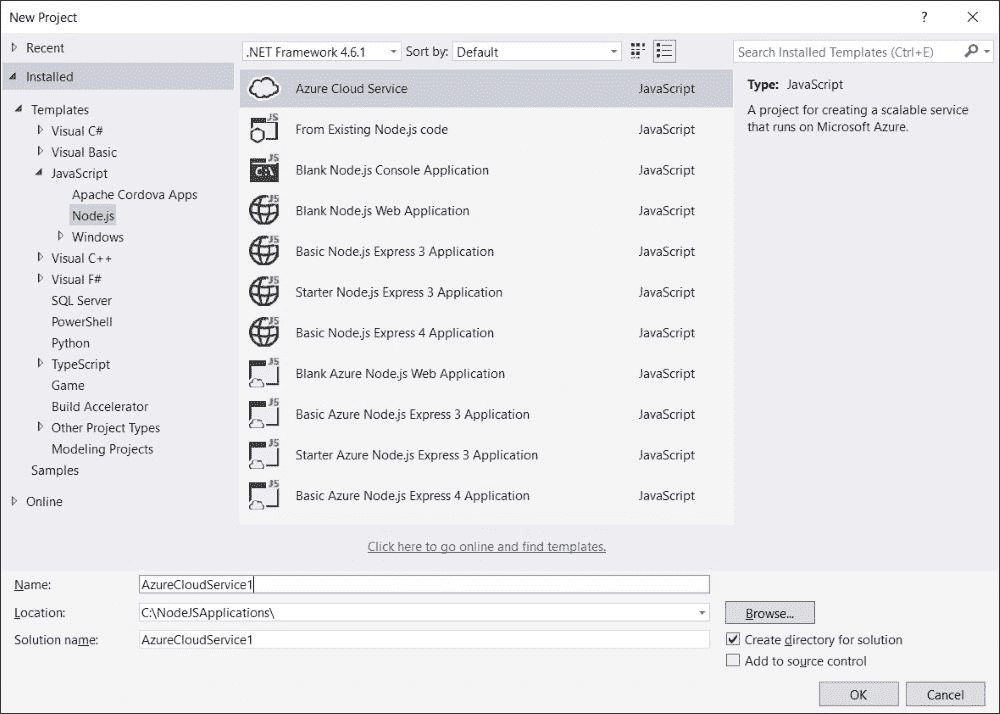

使用这些模板的基本优势是节省手动配置事物的时间，这些模板通过提供基本的项目结构来帮助开发者立即启动 Node.js 应用程序。

让我们先创建一个基本的控制台应用程序模板。基本的控制台应用程序有一个`npm`文件夹，包含 node 包，`package.json`包含元数据信息和其他配置属性，还有`app.js`，其中包含实际的 JavaScript 代码：

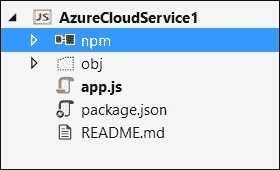

这个 Node.js 扩展提供了一个方便的功能，通过在`npm`文件夹上右键点击并选择**安装新的 npm 包**选项，即可添加 Node 模块，如下面的屏幕截图所示：

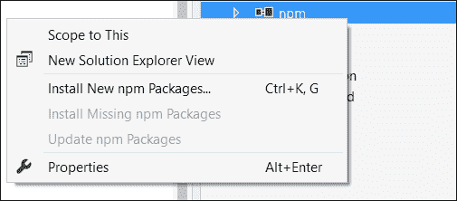

选择这个选项后，Visual Studio 会打开一个窗口，帮助搜索任何 node 包，并几点击添加到你的应用程序中：

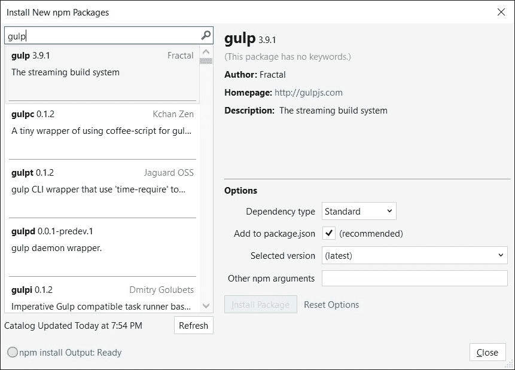

前面的图表展示了可以通过这个选项添加的`Gulp`包的版本。

**交互式窗口**是 Visual Studio 中的另一个好功能，它打开了一个集成在 Visual Studio 标签中的命令提示符，你可以立即编写 JavaScript 代码并执行命令，如下面的屏幕截图所示：

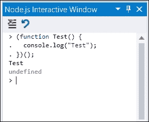

使用 Visual Studio 还有其他几个好处：你可以使用 Git 或 TFS 版本库，在 JavaScript 文件上调试你的代码并设置断点等等。针对 Node.js 的 Visual Studio 特定项目文件称为`.njsproj`，位于你项目的主文件夹中。

## 使用 Node.js 的简单控制台应用程序

一个 Node.js 应用程序由一个或多个提供特定功能的 JavaScript 文件组成。在一个 JavaScript 文件中写入成千上万行代码在实际中是不可能的，而且也会增加可维护性问题。在 Node.js 中，我们可以创建多个 JavaScript 文件，并通过`require`和`export`对象使用它们，这些对象是 Common JS 模块系统的组成部分：

```js
export: used to export variables, functions and objects 

//exportexample.js
module.exports.greeting = "Hello World";

require: To use the objects resides in different JavaScript files using require object. 

//consumerexample.js – referencing through file
var obj = require('./exportexample.js');
```

另外，我们也可以调用`require`而不指定`.js`文件扩展名，它会自动加载特定路径上存在的文件。如果该路径对应于一个文件夹，所有 JavaScript 文件都将被加载：

```js
//consumerexample.js – referencing through file
var obj= require('./exportexample');
```

当应用程序启动时，定义在`package.json`中的是主要入口点。在下面的屏幕截图中，`app.js`是主入口文件，首先被 Node.js 加载并执行：

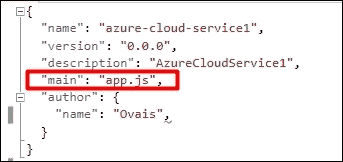

让我们实现一个基本示例，有两个文件，分别是`app.js`（主入口）和`cars.js`，并返回`car`对象的几个属性，例如`name`、`model`和`engine`。首先，创建一个控制台应用程序项目并添加一个`cars.js`文件。

以下是`cars.js`的代码：

```js
module.exports.cars = [
{name:"Honda Accord" , model:"2016", engine: "V6"}, 
{name:"BMW X6", model:"2015", engine: "V8"}, 
{name:"Mercedez Benz",model:"2016", engine:"V12"}
];
```

通过`module.exports`，我们可以导出任何对象。无论是变量、函数还是 JSON 对象，都可以通过这个方法导出。此外，导出的对象可以通过`app.js`中的`require`对象使用，如下面的代码所示：

```js
var cars = require('./cars.js');
console.log(cars);
```

以下是输出：

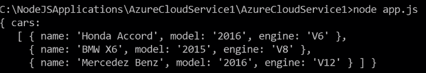

前面的代码显示了`cars.js`文件中定义的 JSON 输出。为了初始化`cars`对象，并遍历列表中定义的汽车项目，我们需要将其作为函数导出，并通过`this`关键字定义它。通过`this`指定它将使列表从我们在`app.js`文件中创建的`cars`对象中访问。

以下是`cars.js`的修改版本：

```js
module.exports = function () {
  this.carsList =   
  [
    { name: "Honda Accord" , model: "2016", engine: "V6" }, 
    { name: "BMW X6", model: "2015", engine: "V8" }, 
    { name: "Mercedez Benz", model: "2016", engine: "V12" }
  ];
};
```

下面是初始化`cars`对象并遍历列表的`app.js`文件的修改版本：

```js
var cars = require('./cars.js');
var c = new cars();
var carsList = c.carsList;
for (i = 0; i < carsList.length; i++) { 
  console.log(carsList[i].name);
}
```

## 使用 Node.js 的 Web 应用程序

有各种 Node.js Web 框架可供选择。像 Express 和 Hapi.js 这样的框架是强大的框架，具有不同的架构和设计。在本节中，我们将使用 Express 框架，这是 Node.js 中最广泛使用的 Web 框架之一，用于 Web 和移动应用程序，并提供应用程序框架模型以开发 Web **Application Programming Interfaces**（**APIs**）。

## 创建空白 Node.js 应用程序

```js
listen() method that actually listens for the incoming requests, and sends the response using the res.end() method. Alternatively, we can also specify the content we are returning using the res.write() method. Here is the more simplified version of the same code, to understand how the pieces fit together:
```

```js
//Initialized http object
var http = require('http');

//declared port
var port = process.env.port || 1337;

//Initialized http server object and use res.write() to send actual response content
var httpServer= http.createServer(function (req, res) {
    res.writeHead(200, { 'Content-Type': 'text/plain' });
    res.write('Hello World\n');
    res.end();
});

//listening for incoming request
httpServer.listen(port);
```

## 在 Node.js 中使用 Express 框架的 Web 应用程序

在任何编程语言中，框架的一个重要好处是减少开发 Web 应用程序所需的努力。框架扮演着处理请求的重要角色，例如加载特定的视图、将模型注入视图等。与 ASP.NET 一样，我们有两种 Web 应用程序框架，ASP.NET Web Forms 和 ASP.NET MVC，Node.js 提供 Express EJS、Jade 以及许多其他 Web 应用程序框架来构建健壮的 Web 应用程序。

### 将简单的 Node.js 扩展以使用 Express

使用 Node.js 的 Visual Studio 扩展，你可以获得所有模板来开始使用 Express 3.0 和 Express 4.0 应用程序框架。Express 4.0 是最新的版本，有一些新功能和改进。我们可以使用引导大多数配置级别工作的模板，但为了获得更多清晰度，我们将扩展前面创建的简单 Node.js 示例，并使用 Express 框架在其上开发一个简单的 Web 应用程序。

要使用`Express`，我们必须使用 NPM 添加其包依赖，如下面的截图所示：

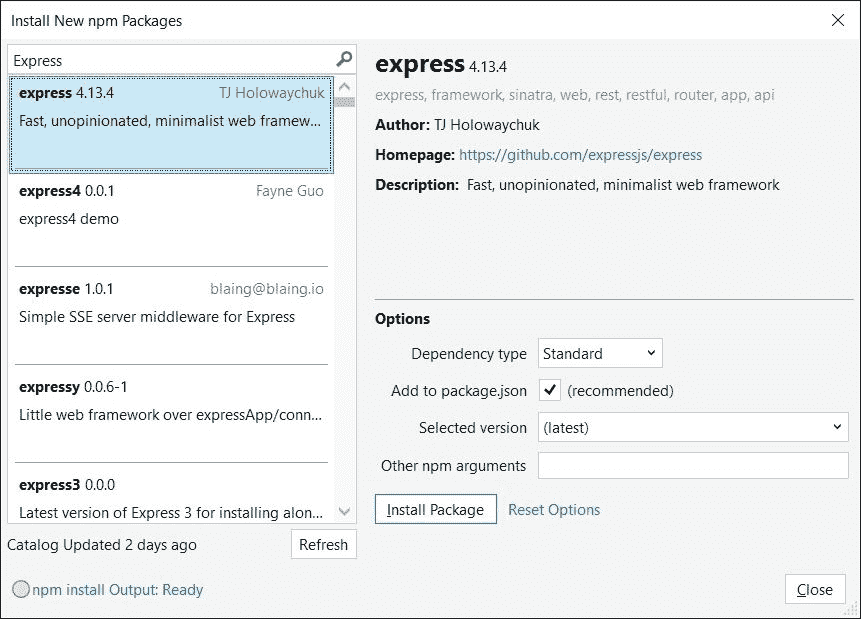

一旦添加了 Express 包，您可以添加以下代码片段来启动 Express 应用程序：

```js
//Initialized http object
var http = require('http');

//adding express dependency
var express = require('express');

//creating express application
var expressApp = express();

//Configuring root call where '/' represents root path of the URL
expressApp.get("/", function (req, res) {
    res.send("<html><body><div>Hello World</div></body></html>");
});

//declared port
var port = process.env.port || 1337;

//Initialized http server object and use res.write() to send actual response content
var httpServer = http.createServer(expressApp);

//listening for incoming request
httpServer.listen(port);
```

这是一个简单的`Hello World`示例，返回 HTML 内容。现在，在我们要返回特定视图而不是静态 HTML 内容的情况下，我们可以通过使用 Express 视图引擎来实现，接下来将讨论这一点。

### Express 视图引擎

Express 拥有多种视图引擎，尽管 Jade 和 EJS 是最广泛使用的。我们将逐一了解这些差异是什么。

#### EJS 视图引擎

在 EJS 视图引擎中，视图是 HTML 页面，模型属性可以使用脚本片段`<% %>`绑定。

为了开始使用 EJS，我们需要通过 Visual Studio 中的 NPM 包管理器选项添加 EJS 包，或者通过执行`npm install ejs –save`命令来添加：

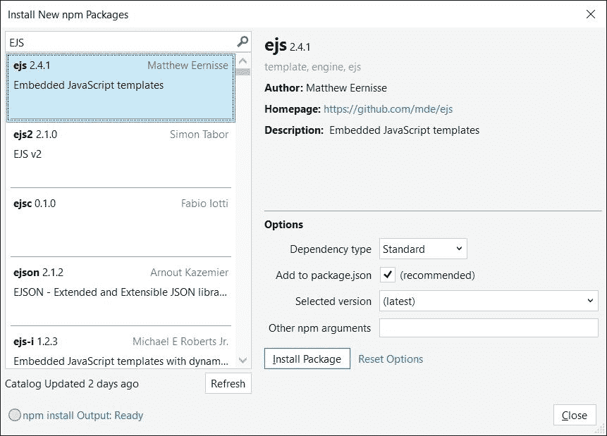

添加此代码后，我们可以将视图引擎设置为`ejs`，如下面的代码片段所示：

```js
//Initialized http object
var http = require('http');

//adding express dependency
var express = require('express');

//creating express application
var expressApp = express();

//Set jade for Node.js application
expressApp.set('view engine', 'ejs') 
```

通过调用响应对象的`render()`方法设置`ejs`视图的路径，如下所示：

```js
//Configuring root call where '/' represents root path of the URL
expressApp.get("/", function (req, res) {
    res.render("ejsviews/home/index");
});
```

在`home`文件夹中添加`index.ejs`文件。所有视图都应该存放在根`Views`文件夹下，否则当应用程序运行时它们不会被加载。因此，应该在`Views`文件夹下定义`ejsviews`文件夹，在`ejsviews`文件夹下定义`home`，如下面的屏幕截图所示：

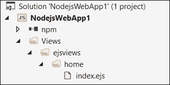

以下是在应用程序启动时将被渲染的 EJS 视图的内容：

```js
<html>
 <body>
  <div> <h1> This is EJS View </h1> </div>
 </body>
</html>
```

在`ejsserver.js`文件的底部添加创建服务器并监听端口号`1337`的代码：

```js
//declared port
var port = process.env.port || 1337;

//Initialized http server object and use res.write() to send actual response content
var httpServer = http.createServer(expressApp);

//listening for incoming request
httpServer.listen(port);
```

当应用程序运行时，`index.ejs`将被加载并渲染以下所示的 HTML 内容：


我们也可以通过 JSON 对象的形式传递模型。假设我们需要传递应用程序名称和描述；我们可以在调用响应对象的`render()`方法时传递这些值，如下所示：

```js
//Configuring root call where '/' represents root path of the URL
expressApp.get("/", function (req, res) {
    res.render("ejsviews/home/index", { appName: "EJSDemo", message: "This is our first EJS view engine example!" });
});
```

在`index.ejs`中，我们可以使用脚本片段将这些值与 HTML 控件绑定：

```js
<html>
 <body>
   <h1> <%= appName %> </h1>
  <p> <%= message %></p>
 </body>
</html>
```

EJS 还支持包含静态内容的布局页面，比如网页应用的头部和底部。因此，开发者不需要在每一页上都重新定义主要的布局内容，我们可以将其集中管理，就像我们在 ASP.NET MVC 中使用`_layout.cshtml`和 ASP.NET web forms 中的`Site.master`一样。

为了使用主页面，我们需要再添加一个包，称为`ejs-local`。此包可以通过 Visual Studio 中的 NPM 包管理器窗口添加，或者通过运行`npm install ejs-local --save`命令来添加：

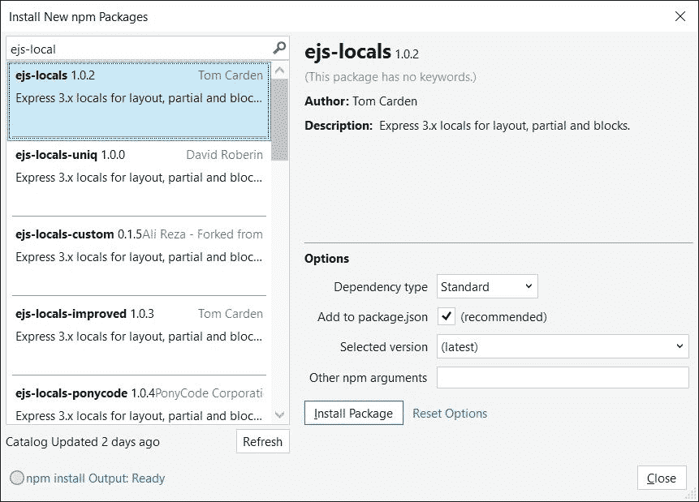

在添加此包后，我们可以添加`ejs-locals`，如下所示。必须在设置视图引擎之前设置它：

```js
//Initialized http object
var http = require('http');

//adding express dependency
var express = require('express');
var ejsLocal = require('ejs-locals');
//creating express application
var expressApp = express();

//Add engine that supports master pages
app.engine('ejs', ejsLocal);
```

在同一个`ejsviews`文件夹中添加`layout.ejs`页面，并指定 HTML 内容：

```js
<html>
<head>
  <title> <%= appName %> </title>
</head>
<body>
  <%= body %>
</body>
</html>
```

```js
index.ejs file:
```

```js
<% layout('../layout.ejs') -%>
<h1><%= appName %></h1>
<p> <%= message %></p>
```

以下输出生成：

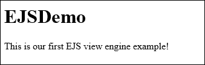

#### Jade 视图引擎

Jade 视图引擎是另一个 Node.js 视图引擎，其语法与我们之前在 EJS 中看到的有很大不同。当我们定义视图时，需要先通过 NPM 安装 Jade 视图引擎。我们可以在 Visual Studio 的 NPM 包管理器中安装，或者通过运行 `npm install jade –save` 命令：

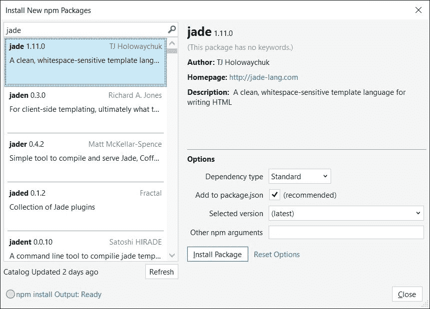

安装后，它将在 `package.json` 的依赖项部分添加 Jade 包。我们将从在 `app.js` 文件（Node.js 项目的入口点）中设置 Jade 视图引擎开始。

以下是在 `app.js` 中设置 Jade 视图引擎的代码：

```js
//adding express dependency
var express = require('express');

//creating express application
var expressApp = express();

//Set jade for Node.js application
expressApp.set('view engine', 'jade');
```

你会注意到我们没有通过 `require` 对象指定 Jade 引用。这是因为当 Express 框架被加载时，它将自动注册 Jade 的依赖项。以下代码片段加载了 Jade 视图：

```js
//Configuring root call where '/' represents root path of the URL
expressApp.get("/", function (req, res) {
res.render("home/index", 
{ 
appName: "JadeDemo",   
message: "This is our first Jade view engine example!"
}
);
});
```

Jade 视图语法通常与 HTML 不同，所有视图扩展名都应该是 `.jade`。在前面的代码中，我们指向了 `index.jade`，其中不需要显式指定 Jade。`Index.jade` 应该位于 `views/home` 文件夹下。让我们创建一个名为 `views` 的文件夹，然后在里面创建一个名为 `home` 的文件夹。添加一个新的 Jade 文件并将其命名为 `index.jade`。以下代码显示了 `appName` 和 `message` 在 HTML 元素中：

```js
doctype
html
    body
        h1= appName
        p= message
```

使用 Jade 语法，你不需要定义完整的 HTML 标签，你只需通过它们的名称指定，后面跟着分配给它们的值。例如，在前面的示例中，我们通过响应 `render()` 方法传递的 JSON 对象设置了 `appName` 和 `message` 的值。然而，HTML 元素支持许多更多的属性，如设置控件宽度、字体颜色、字体样式等。在后面的章节中，我们将了解如何在 Jade 中实现这一点。

等于（`=`）操作符只有在您绑定到注入到视图中的任何值时才需要。如果您想要指定一个硬编码的静态值，那么可以很容易地不使用等于操作符来设置，如下面的代码所示：

```js
doctype
html
    body
        h1 Jade App
        p This is Jade View
```

以下是一些使用 Jade 语法处理 HTML 特定场景的示例：

| 属性 | Jade | HTML |
| --- | --- | --- |
| 文本框 |

```js
input(type='text' name='txtName')
```

|

```js
<input type='text' name='txtName'/>
```

|

| 锚点标签 |
| --- |

```js
a(href='microsoft.com') Microsoft
```

|

```js
<a href="microsoft.com">Microsoft</a>
```

|

| 复选框 |
| --- |

```js
input(type='checkbox', checked)
```

|

```js
<input type="checkbox" checked="checked"/>
```

|

| 带样式属性的锚点 |
| --- |

```js
a(style = {color: 'green', background: 'black'})
```

|

```js
<a style="color:green;background:black"></a>
```

|

| 链接按钮 |
| --- |

```js
input(type='button' name='btn')
```

|

```js
<input type="button" name="btn"/>
```

|

你可以在 [`jade-lang.com/`](http://jade-lang.com/) 了解更多关于 Jade 语言的信息。

Jade 的框架也支持布局页面。布局页面包含网站的静态信息，这些信息大部分位于页眉、页脚或侧边栏中，而实际内容根据请求的页面而变化。在 ASP.Net Web 表单中，我们使用`<asp:ContentPlaceHolder>`标签定义主页面，该页面将渲染页面的内容引用到该主页面。在 ASP.NET MVC 中，这可以通过使用 Razor `@RenderBody`元素来实现。在 Jade 中，我们可以使用`block`关键字后跟块的名称来定义内容块。例如，以下是的`layout.jade`，其中包含`block contentBlock`声明，其中`block`表示子页面的内容渲染位置，`contentBlock`是要在子页面中定义的块的名称。在单个视图中也可以定义多个块。

以下是布局页面的内容：

```js
doctype html
html
  head
    title Jade App
  body
  block contentBlock
```

布局页面可以使用`extends`关键字后跟布局页面名称与`layout`页面一起使用。Jade 视图引擎会自动搜索具有该名称的页面，如果找到，则搜索块名称并在该位置放置内容。以下是使用布局页面`layout.jade`的子页面`index.jade`：

```js
extends layout
block contentBlock
        h1= appName
        p= message
```

输出将会如下所示：


#### Express 应用程序中的路由

我们已经学习了 EJS 和 Jade 视图引擎的基本知识。两者都提供类似的功能，但语法不同。在前面的示例中，我们发送了一个响应，指向一个特定的页面，在客户端渲染内容。

Express 框架提供了与 HTTP 方法相对应的多个方法，如`get`、`post`、`put`、`delete`等。我们可以使用`get`方法来获取一些内容，`post`来创建一个记录，`put`来更新，等等。页面可以位于`Views`文件夹内的任何地方，但是路由实际上定义了当在特定的 URL 路径上请求时必须加载哪个页面。

让我们在`Views/ejsviews/home`文件夹内创建一个名为`about.ejs`的 EJS 页面。

路由可以通过 Express 应用程序对象来定义，如下面的代码所示：

```js
expressApp.get("/About", function (req, res) {
    res.render("ejsviews/home/about");
});
```

当用户浏览到`http://localhost/About`时，会显示**关于**页面。

# 中间件

Node.js Express 还提供了一个特殊的路由方法`all()`，它没有映射到任何 HTTP 方法。但是，它用于在路径上加载中间件，而不管请求的 HTTP 方法是什么。例如，对`http://localhost/middlewareexample`进行 HTTP `GET`和`POST`请求将会执行下面代码中显示的相同的`all()`方法：

```js
expressApp.all('/middlewareexample', function (req, res) {
    console.log('Accessing the secret1 section ...');
});
```

就像在 .NET 中一样，我们有 OWIN 中间件可以链接到请求管道。同样，Node.js Express 中间件也可以链接，并且可以通过稍微修改函数签名来调用下一个中间件。以下是修改后的版本，在响应对象之后添加了 `next` 参数，为特定请求路径定义管道中的下一个中间件的处理器：

```js
expressApp.all('/middlewareexample', function (req, res, next) {
    console.log('Accessing the secret1 section ...');
    next();
});
```

例如，假设我们有两个中间件，第一个中间件只是将信息输出到控制台窗口，而第二个中间件则将 HTML 内容返回给客户端。以下是包含这两个中间件的 EJS 视图引擎的 `server.js` 文件：

```js
//Initialized http object
var http = require('http');
//adding express dependency
var express = require('express');

//creating express application
var expressApp = express();

expressApp.all('/middlewareexample', function (req, res, next) {
    console.log('Middleware executed now calling next middleware in the pipeline');
    next(); // pass control to the next handler
});
expressApp.all('/middlewareexample', function (req, res) {
    res.send("<html><body><div>Middleware executed</div></body></html>");    
});

//declared port
var port = process.env.port || 1337;

//Initialized http server object and use res.write() to send actual response content
var httpServer = http.createServer(expressApp);

//listening for incoming request
httpServer.listen(port);
```

现在当我们访问 URL 路径 `http://localhost/middlewareexample` 时，消息将在控制台打印，并在浏览器中呈现 HTML 内容：

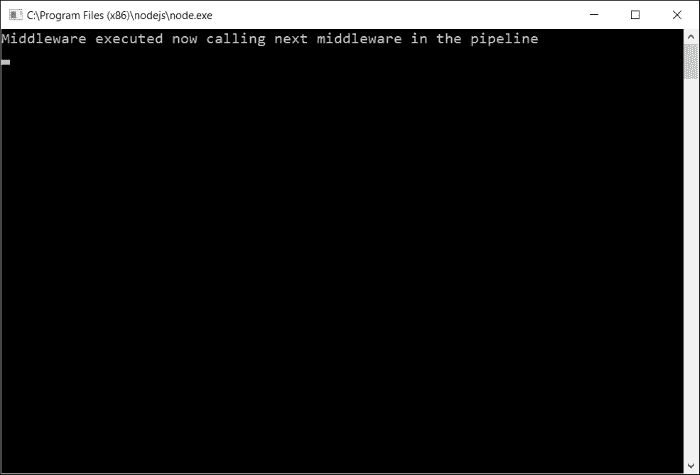

以下是将在浏览器中呈现的 HTML 内容：


# MVC 与 Express 框架

几乎每个应用程序都由无数页面组成，而在主 `server.js` 中定义所有逻辑和路由既不实际也不易维护。在本节中，我们将了解如何使用 Express 框架实现 **模型-视图-控制器**（**MVC**）模式。我们将开发一个简单的应用程序，以了解如何创建控制器和数据服务，以及如何使用 Express 框架加载视图并注入模型。

## 模型-视图-控制器模式

模型-视图-控制器（MVC）是一种用于分离应用程序关注点的软件架构模式。模型表示包含属性以持有信息的实体，而控制器则用于将模型注入视图并加载视图。控制器还用于将模型存储在数据库中，而视图是呈现由控制器注入的模型的页面，并在需要时使用它。

### 创建控制器

我们将从创建一个简单的 `homeController` 开始，以渲染主页。让我们扩展上述开发的 EJS 视图引擎示例，并在项目的根目录下创建一个 `Controllers` 文件夹。在 `Controllers` 文件夹内，创建一个 `HomeController.js` 文件，并将以下代码片段放在那里：

```js
(function (homeController) {
    homeController.load = function (expressApp) {
        expressApp.get('/', function (req, res) {
            res.render("ejsviews/home/index", {appName: "EJS Application", message:"EJS MVC Implementation"})
        });
    };
})(module.exports);
```

在前面的代码中，有一个匿名 JavaScript 函数，它接受 `module.export` 对象，并在执行时将其绑定到 `homeController`。以这种方式实现的基本优点是，定义在 `homeController` 对象中的每个方法或属性都将可导出并可供调用对象访问。在前面的示例中，我们定义了一个 `load()` 方法，它定义了根路径（`/`）的路由并返回 **Index** 页面给客户端。

在主 `ejsserver.js` 文件中，我们可以使用控制器，如以下代码所示，通过使用 `require` 对象：

```js
//Initialized http object
var http = require('http');

//adding express dependency
var express = require('express');

//adding ejs locals
var ejsLocal = require('ejs-locals');

//creating express application
var expressApp = express();

//Add engine that supports master pages
expressApp.engine('ejs', ejsLocal);

//Set jade for Node.js application
expressApp.set('view engine', 'ejs');

//Initializing HomeController
var homeController = require('./Controllers/HomeContoller.js');
homeController.load(expressApp);

//declared port
var port = process.env.port || 1337;

//Initialized http server object and use res.write() to send actual response content
var httpServer = http.createServer(expressApp);

//listening for incoming request
httpServer.listen(port);
```

在前面的代码中，我们使用 `require` 对象添加了 `HomeController` 对象，并调用 `load()` 方法来定义路由，使得当网站运行时能够导航到索引页面。

### 创建数据服务

每个商业应用程序都涉及大量的 CRUD（创建、读取、更新、删除）操作。为了更好的设计，这些操作可以分别实现在数据服务对象中，所以如果多个控制器想要使用同一个服务，它们可以重复使用而不需要重复编写相同的代码。在本节中，我们将创建一个名为 `DataServices` 的文件夹，位于应用程序的根目录下，并在其中创建 `ProductService.js`。以下是 `ProductService.js` 的代码，它返回产品数组：

```js
(function(data){
    data.getProducts = function () {
        return [{
                name: 'Product1',
                price: 200,
            }, 
            {
                name: 'Product2',
                price: 500
            },
            {
                name: 'Product3',
                price: 1000
            }
        ];
    };
})(module.exports);
```

我们可以通过 `require` 对象在 `HomeController` 中使用这个 `ProductService`：

```js
(function (homeController) {
    var productService = require('../DataServices/ProductService');

    homeController.load = function (expressApp) {
        expressApp.get('/', function (req, res) {
            var products = productService.getProducts();
            res.render("ejsviews/home/index", { appName: "EJS Application", message: "EJS MVC Implementation", data: products });
        });
    };
})(module.exports);
```

以下是 `index.ejs` 文件，它遍历产品并显示产品名称和价格：

```js
<% layout('../layout.ejs') -%>
<h1><%= appName %></h1>

<p> <%= message %></p>

<div>

 <% data.forEach(function(product) { %>
   <li><%= product.name %> - <%= product.price %></li>
 <% }); %>

</div>
```

最后，输出结果如下：

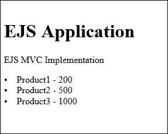

# 在 Node.js 中访问 Microsoft SQL 服务器

Node.js 提供了不同的数据库驱动，可以作为 node 包添加。有 MongoDB 驱动、Microsoft SQL Server 驱动等等。我们将使用 Node.js 的 MS SQL 驱动来连接 Microsoft SQL 服务器数据库。要安装 `mssql`，您可以运行 `npm install mssql –save` 命令，或者从 NPM 包管理器窗口中添加，如下面的截图所示：

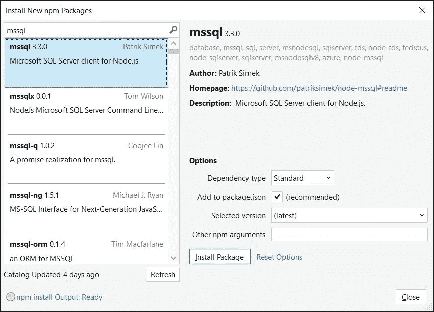

### 提示

使用 MSSQL 驱动时，对于相应的 SQL 服务器实例应启用 TCP/IP。

## 从 Microsoft SQL 服务器数据库中读取记录

在 `DataService.js` 文件中，我们将添加 `getProducts()` 方法，它从 SQL Server 数据库加载产品列表。

以下是 `getProducts()` 方法，它接受回调函数，所以一旦从数据库中获取了产品列表，它就会在调用者的回调函数中传递：

```js
(function(data){
data.getRecords = function (callbackFn) {
        //loaded SQL object
        var sql = require('mssql');

        //database configuration attributes to connect
        var config = {
            user: 'sa',
            password: '123',
            server: 'ovais-pc', // You can use 'localhost\\instance' to connect to named instance 
            database: 'products'
        }

        var products = null;
        //Connect to SQL Server returns a promise and on successfull connection executing a query using Request object
        sql.connect(config).then(function () {
            new sql.Request().query('select * from products', function (err, recordset) {      
                callbackFn(recordset);        
            });
        });

     };
})(module.exports);
```

在前面的代码中，我们使用 `require` 对象初始化了 `sql` 对象。`Config` 变量包含连接属性，如 `username`、`password`、`server` 和 `database`。在调用 `sql connect()` 方法时传递这个属性。`Connect()` 方法返回一个 `then()` 承诺，通过它我们可以使用 `sql.Request()` 方法发起 SQL 查询请求。如果请求成功，我们将在 `recordset` 对象中获取结果集，并通过其回调函数返回给调用者。

以下是修改后的 `HomeController.js` 文件，它调用 `DataService` 的 `getRecords()` 方法，并将检索到的产品列表作为模型传递给索引视图：

```js
(function (homeController) {
    var productService = require('../DataServices/ProductService');

    homeController.load = function (expressApp) {
        expressApp.get('/', function (req, res) {
            var products = productService.getRecords(function (products) {
                console.dir(products);
                res.render("ejsviews/home/index", { appName: "EJS Application", message: "EJS MVC Implementation", data: products });
            });
        });
    };
})(module.exports);
```

以下是 `index.js` 文件，它遍历产品列表并显示产品名称和价格：

```js
<% layout('../layout.ejs') -%>
<h1><%= appName %></h1>
<p> <%= message %></p>

<table>
<th> 
<td> Product Name </td>
<td> Description </td>
<td> Price </td>
</th>
 <% data.forEach(function(product) { %>
  <tr> <td><%= product.Name %> </td> <td> <%= product.Description %> </td><td> <%= product.Price %> </td></tr>
 <% }); %>
</table>
```

## 在 Microsoft SQL 服务器数据库中创建记录

要在数据库中创建记录，我们可以定义 HTML 表单标签内的 HTML 输入元素，并在表单提交时通过在`HomeController.js`文件中定义`post`方法来发送 POST 请求：当表单提交时，可以使用`request.body`对象检索值。这是一个解析器，它解析 DOM 并创建一个包含表单标签下的元素的列表。我们可以像`req.body.txtName`这样访问它，其中`txtName`是 HTML 输入元素，`req`是请求对象。

Express 4.0 将`body-parser`对象解耦为一个单独的包，可以使用`npm install body-parser –save`命令单独下载，或者通过 NPM 包管理器窗口，如下面的屏幕截图所示：

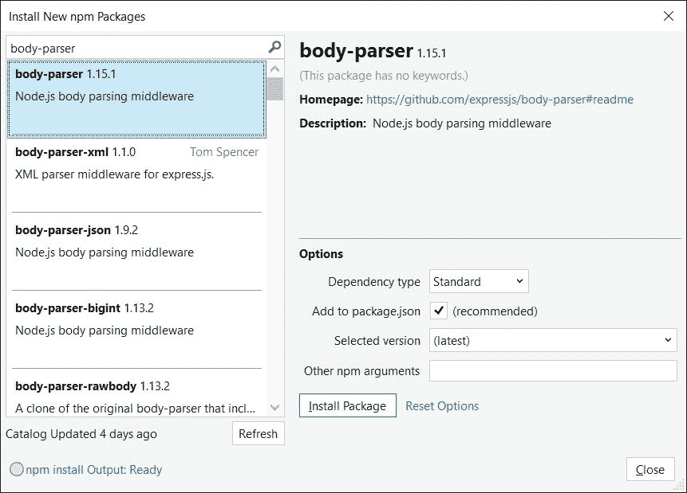

在你的主`ejsserver.js`文件中，使用`require`对象添加`body-parser`，并通过调用`expressApp,use()`方法将其传递给`expressApp`对象：

```js
var bodyParser = require('body-parser');

expressApp.use(new bodyParser());
```

一旦添加了这些内容，我们就可以修改`HomeController.js`，并定义一个`POST`方法，一旦表单提交，该方法将被调用：

```js
    expressApp.post('/', function (req, res) {
            console.log(req.body.txtName);
           productService.saveProduct(req.body.txtName, req.body.txtDescription, req.body.txtPrice, function (result) {
                res.send("Record saved successfully");
            });
        });
```

```js
DataService.js file:
```

```js
data.saveProduct = function (name, description, price, callbackFn) {

        //loaded SQL object
        var sql = require('mssql');

        //database configuration attributes to connect
        var config = {
            user: 'sa',
            password: '123',
            server: 'ovais-pc', // You can use 'localhost\\instance' to connect to named instance 
            database: 'products'
        }

        //Connect to SQL Server returns a promise and on successfull connection executing a query using Request object
        sql.connect(config).then(function () {
            new sql.Request().query("INSERT into products (Name, Description, Price) values('"+ name +"', '"+ description+"',"+ price+")", function (err, recordset) {
                callbackFn(recordset);
            });
       });

    };
```

最后，这是包含`Name`、`Description`和`Price`字段的表单的`Index.ejs`视图：

```js
<form method="post">
<table>
<tr>
  <td> Product Name: </td>
  <td> <input type='text' name='txtName'  /> </td>
</tr>
<tr>
  <td> Description: </td>
  <td><input type='text' name='txtDescription'  /></td>
</tr>
<tr>
  <td> Price: </td>
  <td><input type='number' name='txtPrice' /></td>

</tr>
<tr>
<td> &nbsp; </td>
<td><input type="submit" value="Save" /> </td>
</tr>
</table>
</form>
```

要了解关于`mssql`节点包的更多信息，请使用这个链接：[`www.npmjs.com/package/mssql`](https://www.npmjs.com/package/mssql)。

# 总结

本章介绍了 Node.js 的基础知识以及如何使用它们来开发使用 JavaScript 的服务器端应用程序。我们了解到了两种视图引擎，EJS 和 Jade，以及如何使用它们。我们还学习了如何使用控制器和服务来实现 MVC 模式。最后，我们通过查看访问 Microsoft SQL 服务器数据库的示例，来了解如何执行数据库上的增删改查操作。在下一章中，我们将关注在大型应用程序中使用 JavaScript 的最佳实践。
