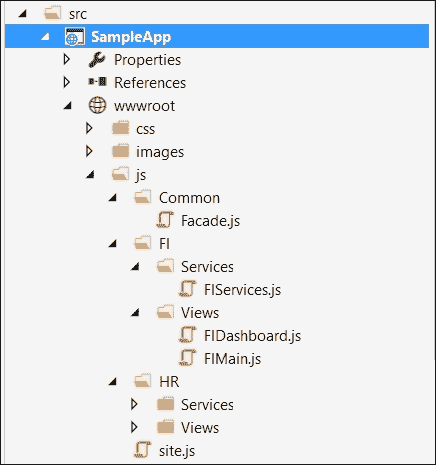
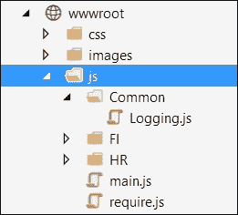
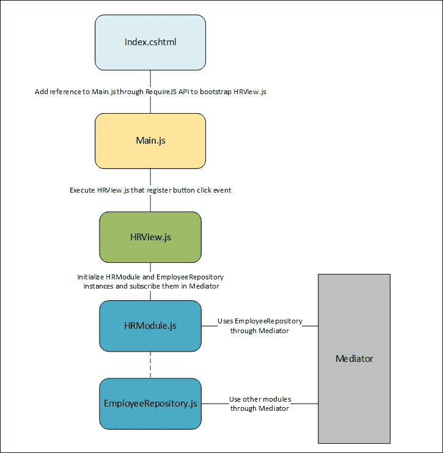
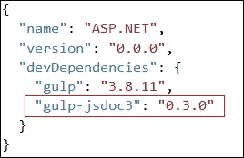
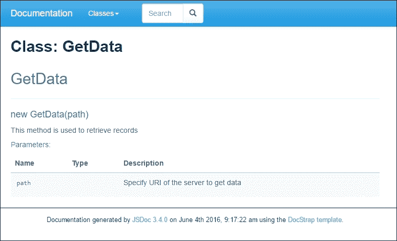
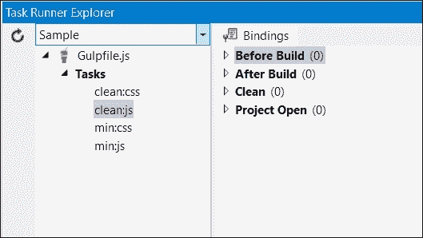
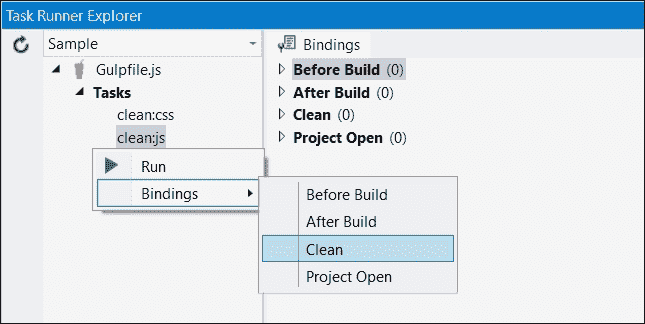

# 第九章：使用 JavaScript 进行大规模项目

大型网络应用项目由多个模块组成。随着各种 JavaScript 框架的开发不断进步和提升，开发者在应用程序的展示或前端层频繁使用 JavaScript，而服务器端操作只在需要时执行。例如，当从服务器保存或读取数据，或进行其他数据库或后端操作时，向服务器发送 HTTP 请求，返回纯 JSON 对象并更新 DOM 元素。随着这些发展，应用程序的大部分前端代码都位于客户端。然而，当 JavaScript 最初被开发时，它的目标是用于执行一些基本操作，比如更新 DOM 元素或显示确认对话框等相对操作。JavaScript 代码主要存在于页面本身的`<script>`脚本标签中。然而，大规模应用程序包含许多代码行，在设计和架构前端时需要适当的关注。在本章中，我们将讨论一些概念和最佳实践，以帮助使应用程序前端更具可扩展性和可维护性。

# 在行动之前先思考

大规模应用通常包含许多 JavaScript 文件，合理地组织这些文件可以提高可见性。像 AngularJS、EmberJS 这样的 JavaScript 框架已经提供了适当的组织和指导，用于定义控制器、工厂和其他对象，同时也提供了使用它们的最佳实践。这些框架非常流行，并且已经符合了更高可扩展性和可维护性的需求。然而，在某些情况下，我们可能想严格依赖纯 JavaScript 文件，并为特定需求开发自己的自定义框架。为了认可这些情况，行业内已经采用了某些最佳实践，这些实践使得基于 JavaScript 的前端更加可维护和可扩展。

当我们在大型应用程序上工作时，我们需要思考应用程序的范围是什么。我们需要考虑应用程序如何容易地被扩展，以及如何快速地实现其他模块或功能。如果任何模块失败，它会影响应用程序的行为还是导致其他模块崩溃？例如，如果我们正在使用某个第三方 JavaScript 库，该库修改了它们某些方法签名。在这种情况下，如果我们在应用程序的每个地方都频繁使用第三方库，我们就必须在每个点上修改方法，而且不仅更改，而且测试也可能是一个繁琐的过程。另一方面，如果已经实现了一些 Facade 或包装器，那么我们只需要在一个地方进行更改，而不是到处更新。因此，设计应用程序架构或框架是一个深思熟虑的过程，但它使应用程序更加健壮和健康。

# 开发高度可扩展和可维护的应用程序

以下是我们应该考虑的因素，以创建高度可扩展和可维护的基于 JavaScript 的 Web 应用程序。

## 模块化

在大型的应用程序中，将所有内容写入一个 JavaScript 文件是不好的做法。尽管如此，即使你为不同的模块分离了不同的 JavaScript 文件，并通过脚本`<script>`标签引用它们，这也会使全局命名空间膨胀。应该进行适当的结构化，以将 JavaScript 文件保存在单独的模块文件夹中。例如，一个 ERP 应用程序包括几个模块。我们可以为每个模块创建单独的文件夹，并使用特定的 JavaScript 文件为特定的视图或页面提供某些功能。然而，公共文件可以存放在公共文件夹中。

以下是一个根据 ERP 模块来组织 JavaScript 文件的示例项目结构。每个模块都有一个`service`文件夹，其中包含一些用于服务器端读或写操作的文件，以及一个`Views`文件夹，用于在数据加载或任何控件事件触发后操作特定视图的 DOM 元素。`common`文件夹可能包含所有其他模块都会使用的助手工具和函数。例如，在控制台日志消息，或在服务器端发送 HTTP 请求，这些功能可以定义在公共 JavaScript 文件中，并且它们可以被服务或视图 JavaScript 文件使用：



在前面的结构中，`Services`文件夹可以包含与调用某些 Web API 或 Web 服务执行数据库的**创建**、**检索**、**更新**、**和删除**（**CRUD**）操作相关的函数，而像`FIMain.js`这样的视图文件包含页面特定的函数。

为了保持 HTML 页面的整洁，将 JavaScript 文件与 HTML 页面分开是一个更好的方法。所以在之前的截图中，`FIMain.js`包含了与主页面对应的 JavaScript 函数，而`FIDashboard.js`包含了与仪表板页面对应的 JavaScript 函数，依此类推。

这些文件可以通过`<script>`脚本标签简单地添加，但在 JavaScript 世界中，直接在页面上添加 JavaScript 文件是不好的做法。模块可以通过实现模块模式在 JavaScript 中定义。然而，大多数开发者更愿意使用 RequireJS API 来定义模块，以使模块加载更简单，并提供更好的变量和函数定义范围。它与 CommonJS 系统等效，但由于其异步行为而受到推荐。它以异步方式加载 JavaScript 模块，使页面加载周期更快。

### 实现模块模式

模块模式是用于创建松耦合架构和使 JavaScript 代码片段独立于其他模块的最流行的设计模式。

模块就像.NET 类一样，可以有私有、受保护和使用公开的属性和方法，并为开发者提供控制，只暴露其他类需要的属性和方法。

在 JavaScript 中，模块模式可以通过**立即执行函数表达式**（**IIFE**）实现，该表达式立即执行并返回一个闭包。闭包实际上隐藏了私有变量和方法，并返回一个只包含公共方法和变量的对象，供其他模块访问。

以下是暴露了`logMessage()`方法的`Logger`模块，该方法调用一个私有`formatMessage()`方法来附加日期，并返回格式化后的消息，然后将其打印在浏览器的**控制台**窗口上：

```js
<script>
  var Logger= (function () {

    //private method
    var formatMessage = function (message) {
      return message + " logged at: " + new Date();
    }

    return {
      //public method
      logMessage: function (message) {
        console.log(formatMessage(message));
      }
    };

  })();

  Logger.logMessage("hello world");
</script>
```

在前面的代码中，`logMessage()`方法返回一个通过`Logger`命名空间调用的对象。

模块可以包含多个方法和属性，为了实现这种情况，让我们修改前面的示例，再添加一个显示警告消息的方法和一个访问日志名称的属性，并通过对象字面量语法暴露它们。对象字面量是另一种表示将方法和属性作为名称值对分离并用逗号分隔的绑定方式，提供了更清晰的表示。以下是修改后的代码：

```js
<script> 
  var Logger= (function () {
    //private variable
    var loggerName = "AppLogger";

    //private method
    var formatMessage = function (message) {
      return message + " logged at: " + new Date();
    }

    //private method
    var logMessage= function (message){
      console.log(formatMessage(message));
    }

    //private method
    var showAlert = function(message){
      alert(formatMessage(message));
    }

    return {

      //public methods and variable
      logConsoleMessage: logMessage,
      showAlertMessage: showAlert,
      loggerName: loggerName
    };

  })();

  Logger.logConsoleMessage("Hello World");
  Logger.showAlertMessage("Hello World");
  console.log(Logger.loggerName);
</script>
```

在前面的代码中，`logMessage()`和`showAlert()`将通过`logConsoleMessage()`和`showAlertMessage()`方法进行访问。

### 使用 RequireJS 对 JavaScript 代码进行模块化

RequireJS 中的模块是模块模式的扩展，其好处是不需要全局变量来引用其他模块。RequireJS 是一个 JavaScript API，用于定义模块并在需要时异步加载它们。它异步下载 JavaScript 文件，并减少整个页面加载的时间。

#### 使用 RequireJS API 创建模块

在 RequireJS 中，可以通过`define()`方法创建模块，并使用`require()`方法加载。RequireJS 提供了两种语法风格来定义模块，如下所示：

+   **使用 CommonJS 风格定义模块**：以下是在 CommonJS 风格中定义模块的代码片段：

    ```js
    define(function (require, exports, module) {
      //require to use any existing module
      var utility = require('utility');

      //exports to export values
      exports.example ="Common JS";

      //module to export values 
      module.exports.name = "Large scale applications";

      module.exports.showMessage = function (message) {
        alert(utility.formatMessage(message));
      }
    });
    ```

    前面的 CommonJS 风格语法使用了 RequireJS API 的`define()`方法，该方法接受一个函数。此函数接受三个参数：`require`、`exports`和`module`。后两个参数`exports`和`module`是可选的。但是，它们必须按照相同的顺序定义。如果你不使用`require`，只想通过`exports`对象导出一些功能，那么需要提供`require`参数。`require`参数用于导入使用`exports`或`module.exports`在其他模块中导出的模块。在前面的代码中，我们通过在调用`require`方法时指定`utility.js`文件的路径，添加了`utility`模块的依赖。添加任何依赖时，我们只需要指定路径以及 JavaScript 文件的名称，而不需要`.js`文件扩展名。文件由 RequireJS API 自动识别。我们可以通过`exports`或`module.exports`适当地导出其他模块需要使用的任何函数或变量。

+   **在 AMD 风格中定义模块**：以下是在 AMD 风格语法中定义模块的代码片段：

    ```js
    define(['utility'], function (utility) {
      return {
        example: "AMD",
        name: "Large scale applications",
        showMessage: function () {
          alert(utility.formatMessage(message));
        }
      }

    });
    ```

    AMD 风格语法将依赖项数组作为第一个参数。要使用 AMD 风格语法加载模块依赖项，你必须将它们定义在一个数组中。第二个参数接受`function`参数，它取模块名称，映射到依赖项数组中定义的模块，以便在函数体中使用。要导出变量或方法，我们可以通过对象字面量语法进行导出。

#### 启动 RequireJS

让我们通过一个简单的例子来了解如何在 ASP.NET 应用程序中使用 RequireJS。要在 ASP.NET Core 应用程序中使用 RequireJS API，你必须下载并将在`wwwroot/js`文件夹中放置`Require.js`文件。在下面的例子中，我们将编写一个`logging`模块，其中包含一些方法，如写入控制台、显示警告以及向服务器写入。

让我们在`wwwroot/js/common`文件夹中创建一个`Logging.js`文件，并写入以下代码：

```js
define(function () {
  return {
    showMessage: function (message) {
      alert(message);
    },
    writeToConsole: function (message) {
      console.log(message);
    },
    writeToServer: function (message) {
      //write to server by doing some Ajax request
      var xhr = new XMLHttpRequest();
      xhttp.open("POST", "http://localhost:8081/Logging?message="+message, true);
      xhttp.send();
    }
  }
});
```

以下是`Index.cshtml`页面的代码，当页面加载时会显示一个警告消息：

```js
<script src="img/require.js"></script>
<script>
  (function () {
    require(["js/common/logging"], function(logging){
      logging.showMessage("demo");
    });
  })();
</script>
```

我们还可以将前面的函数包装在`main.js`文件中，并通过脚本`<script>`标签启动它。有一个特殊的属性称为`data-main`，它是由 RequireJS 用作应用程序的入口点。

以下是位于`wwwroot/JS`文件夹中的`main.js`代码。因为`main.js`位于`wwwroot/js`文件夹中，所以路径将是`common/logging`：

```js
//Main.js
require(["common/logging"], function(logging){
  logging.showMessage("demo");
});
```

最后，我们可以使用脚本标签启动`main.js`，如下面的代码所示：

```js
<script data-main="~/js/main.js" src="img/require.js"></script>
```

以下是一个包含`Common`文件夹的示例项目结构，以存储常见的 JavaScript 文件；而`FI`和`HR`文件夹用于模块特定的 JavaScript 文件：



假设我们想要修改之前的例子，并在按钮的`click`事件上从输入控件传递消息。这可以通过为特定页面开发一个`view`模块并在其中注入`logging`模块来实现。

以下是要包含`input`和`button`元素的 HTML 标记：

```js
<div id="myCarousel" class="carousel slide" data-ride="carousel" data-interval="6000">
  <input type="text" id="txtMessage" />
  <button id="btnSendMessage" >Send Message</button>
</div>
```

下面的`view.js`文件通过读取`txtMessage`元素的值来调用`logging`模块的`sendMessage()`方法：

```js
define(['common/logging'], function(logging) {
  $('#btnSendMessage').on('click', function(e) {
    sendMessage();
    e.preventDefault();
  });
  function sendMessage(){
    var message= document.getElementById('txtMessage').value;
    logging.showMessage(message);
  }
  return {
    sendMessage: sendMessage
  };
});
```

当按钮被点击时，将显示一个警告消息。

## 事件驱动的消息传递

在前一部分，我们为 JavaScript 文件启用了模块化支持并将它们转换为模块。在大型应用程序中，我们不能仅仅依赖于在其他模块中注入模块，我们可能需要一些灵活性，通过某种发布/订阅模式调用某些模块的事件。我们已经在第七章中看到了发布/订阅模式，该模式维护一个注册事件（指向某些回调函数）的集中式列表，并通过发布者对象调用这些事件。这种模式在使模块之间的事件驱动消息传递变得非常实用，但还有一种更好的模式，即中介者模式，它是发布/订阅模式的一个超集。中介者模式更好，因为它允许发布者或中介者访问订阅对象的其他事件/方法，并允许中介者决定需要调用哪个方法或事件。

### 为模块之间的通信实现中介者模式

中介者将对象封装在集中式列表中并调用它们的方法。这个列表将所有对象（或模块）放在中央位置，从而允许它们之间改进的通信。

让我们通过一个实现中介者模式的实际例子来了解。中介者作为一个集中控制的对象，模块可以进行订阅或取消订阅。它提供了抽象方法，任何源订阅模块都可以调用这些方法与目标订阅模块进行通信。中介者持有一个集中式字典对象，根据某些键（或通常是名称）持有订阅对象，并根据订阅者传递的模块名称调用目标模块方法。在下面的例子中，我们有了`MediatorCore`（中介者）、`EmployeeRepository`（订阅者）和`HRModule`（订阅者）对象。我们将使用 RequireJS API 将 JavaScript 文件转换为模块。

下面的`MediatorCore` JavaScript 文件：

```js
//MediatorCore.js
define(function () {
  return {

    mediator: function () {
      this.modules = [];

      //To subscribe module
      this.subscribe = function (module) {
        //Check if module exist or initialize array
        this.modules[module.moduleName] = this.modules[module.moduleName] || [];

        //Add the module object based on its module name
        this.modules[module.moduleName].push(module);
        module.mediator = this;
      },

      this.unsubscribe = function (module) {
        //Loop through the array and remove the module
        if (this.modules[module.moduleName]) {
          for (i = 0; i < this.modules[module.moduleName].length; i++) {
            if (this.modules[module.moduleName][i] === module) {
              this.modules[module.moduleName].splice(i, 1);
              break;
            }
          }
        }
      },

      /* To call the getRecords method of specific module based on module name */
      this.getRecords = function (moduleName) {
        if (this.modules[moduleName]) {
          //get the module based on module name
          var fromModule = this.modules[moduleName][0];
          return fromModule.getRecords();
        }
      },

      /* To call the insertRecord method of specific module based on module name */
      this.insertRecord = function (record, moduleName) {
        if (this.modules[moduleName]) {
          //get the module based on module name
          var fromModule = this.modules[moduleName][0];
          fromModule.insertRecord(record);
        }
      },

      /* To call the deleteRecord method of specific module based on module name */
      this.deleteRecord = function (record, moduleName) {
        if (this.modules[moduleName]) {
          //get the module based on module name
          var fromModule = this.modules[moduleName][0];
          fromModule.deleteRecord(record);

        }
      },

      /* To call the updateRecord method of specific module based on module name */
      this.updateRecord = function (record, moduleName) {
        if (this.modules[moduleName]) {
          //get the module based on module name
          var fromModule = this.modules[moduleName][0];
          fromModule.updateRecord(record);

        }
      }

    }
  }
});
```

```js
EmployeeRepository that contains the concrete implementation of the abstract methods defined in the mediator:
```

```js
//EmployeeRepository.js
define(function () {
  return {

    //Concrete Implementation of Mediator Interface
    EmployeeRepository: function (uniqueName) {
      this.moduleName = uniqueName;
      //this reference will be used just in case to call some other module methods
      this.mediator = null;

      //Concrete Implementation of getRecords method
      this.getRecords = function () {
        //Call some service to get records

        //Sample text to return data when getRecords method will be invoked
        return "This are test records";

      },
      //Concrete Implementation of insertRecord method
      this.insertRecord = function (record) {
        console.log("saving record");
        //Call some service to save record.
      },

      //Concrete Implementation of deleteRecord method
      this.deleteRecord = function (record) {
        console.log("deleting record");
        //Call some service to delete record
      }

      //Concrete Implementation of updateRecord method
      this.updateRecord = function (record) {
        console.log("updating record");
        //Call some service to delete record
      }

    }
  }
});
```

`EmployeeRepository`在初始化时接收一个名称参数，并定义了一个中介变量，该变量在注册中介时可以设置。这样提供的目的是，如果`EmployeeRepository`想要调用其他模块或订阅模块的仓库，就可以这样做。我们可以创建多个仓库，例如为`HRModule`创建`RecruitmentRepository`和`AppraisalRepository`，并在需要时使用它们。

以下是`HRModule`的代码，通过中介调用`EmployeeRepository`：

```js
//HRModule.js
define(function () {
  return {
    HRModule: function (uniqueName) {
      this.moduleName = uniqueName;
      this.mediator = null;
      this.repository = "EmployeeRepository";

      this.getRecords = function () {
        return this.mediator.getRecords(this.repository);
      },

      this.insertRecord = function (record) {
        this.mediator.insertRecord(record, this.repository);
      },

      this.deleteRecord = function (record) {
        this.mediator.deleteRecord(record, this.repository);
      }

      this.updateRecord = function (record) {
        this.mediator.updateRecord(record, this.repository);
      }

    }
  }
});
```

现在，我们将注册`HRModule`和`EmployeeRepository`到中介，并调用`HRModule`方法以执行 CRUD 操作。

以下是`HRView.js`的代码，用于捕获表单上按钮的`click`事件，并在按钮被点击时调用`getRecords()`方法：

```js
//HRView.js
define(['hr/mediatorcore','hr/employeerepository','hr/hrmodule'], function (mediatorCore, employeeRepository, hrModule) {
  $('#btnGetRecords').on('click', function (e) {
    getRecords();
    e.preventDefault();
  });
  function getRecords() {
    var mediator = new mediatorCore.mediator();
    var empModule = new hrModule.HRModule("EmployeeModule");
    mediator.subscribe(empModule);

    var empRepo = new employeeRepository.EmployeeRepository("EmployeeRepository");
    mediator.subscribe(empRepo);

    alert("Records: "+ empModule.getRecords());
  }
  return {
    getRecords: getRecords
  };
});
```

以下是使用 RequireJS API 引导`HRView.js`文件的`main.js`文件：

```js
//main.js
require(["./hrview"], function(hr){
});
```

最后，我们可以在 ASP.NET 的`Index.cshtml`页面上使用上述`Main.js`模块，如下所示：

```js
//Index.cshtml

@{
  ViewData["Title"] = "Home Page";
}
<script data-main="js/main.js"  src="img/require.js"></script>

<div id="myCarousel" class="carousel slide" data-ride="carousel" data-interval="6000">
  <input type="text" id="txtMessage" />
  <button id="btnGetRecords" >Send Message</button>
</div>
```

以下是显示模块如何相互通信的逻辑图：



## 封装复杂代码

开发高度可扩展和可维护应用程序的另一个核心原则是使用包装器，并将复杂代码封装到更简单的接口中。这可以通过实现一个外观模式来完成。

外观模式（Facade Pattern）用于简化复杂代码，通过暴露一个方法并隐藏所有复杂代码在 Facade 对象内部。例如，有多种方法和 API 可用于执行 Ajaxified 操作。可以使用一个普通的`XmlHttpRequest`对象发出 Ajax 请求，或者使用 jQuery，使用`$.post()`和`$.get()`方法非常容易。在 AngularJS 中，可以使用其自己的`http`对象来调用服务等等。这些类型的操作可以通过封装，在内部 API 更改时，或者当你决定使用另一个更好的 API 时受益；修改工作量远小于更改所有使用过的地方。使用外观模式，你只需要在 Facade 对象中修改一次，并节省在所有使用过的地方更新它的时间。

使用外观模式的另一个优点是，它通过将一串代码封装到一个简单的方法中，减少了开发工作量，并使消费者容易使用。外观模式通过最小化调用特定功能所需的代码行数，减少了开发工作量。要了解更多关于外观模式的信息，请参考第七章，《JavaScript 设计模式》。

## 生成文档

适当的文档可以提高你的应用程序的可维护性，并使开发者在需要时或定制应用程序时更容易参考。市场上有很多文档生成器可供选择。JSDoc 和 YUIDoc 是非常流行的 JavaScript 文档生成器，但在本节中，我们将使用 JSDoc3，它不仅可以生成文档，还可以为你的自定义 JavaScript 模块启用 intellisense，以便在开发过程中提供便利。

JSDoc 是一个类似于 JavaDoc 和 PHPDoc 的 API。可以直接在 JavaScript 代码中添加注释。它还通过 JSDoc 工具提供了文档网站的生成。

### 在 ASP.NET Core 中安装 JSDoc3

JSDoc3 可以作为一个 Node 包添加，我们还可以使用 Gulp 任务运行器来生成文档。要将 JSDoc3 添加到你的 ASP.NET Core 项目中，你可以首先在由 Node 使用的`package.json`文件中添加一个条目。这个条目必须在开发依赖项中完成：



前一张截图中定义的第一个开发依赖是 Gulp，它用于创建任务，而`gulp-jsdoc3`是实际的文档生成器，当你运行那个任务时，它会生成 HTML 网站。

任务可以定义如下：

```js
/// <binding Clean='clean' />
"use strict";

var gulp = require("gulp"),
jsdoc = require("gulp-jsdoc3");

var paths = {
  webroot: "./wwwroot/"
};

paths.appJs = paths.webroot + "app/**/*.js";

gulp.task("generatedoc", function (cb) {
  gulp.src(['Readme.md', paths.appJs], { read: false })
  .pipe(jsdoc(cb));
});
```

```js
generatedoc, in which we are reading the files placed at wwwroot/app/**/*.js and generating documentation. The jsdoc object takes the configuration defaults to generate documentation. To pass the default configuration attributes, we can just specify the cb parameter injected in the function level by Gulp. When you run this generatedoc task from the task runner in Visual Studio, it will add a docs folder at the root path of your web application project. As in ASP.NET Core, we already know that all static content should reside in the wwwroot folder, and to access it from browser, simply drag and drop this folder in the wwwroot folder and access it by running your website.
```

#### 添加注释

为了生成文档，我们需要用注释注释我们的代码。提供的注释越多，生成的文档就会越好。注释可以通过`/**`作为开始标签和`*/`作为结束标签来添加：

```js
/** This method is used to send HTTP Get Request **/
function GetData(path) {
  $.get(path, function (data) {
    return data;
  })
}
```

如果函数是构造函数，你可以在注释中指定`@constructor`，以便向读者传达更多意义：

```js
/** This method is used to send HTTP Get Request
   @constructor
*/
function GetData(path) {
  $.get(path, function (data) {
    return data;
  })
}
```

函数接收参数，这可以通过在注释中使用`@param`来表示。以下是同一个函数，它接收某个服务的实际路径作为参数来检索记录：

```js
/** This method is used to send HTTP Get Request 
  @constructor
  @param path – Specify URI of the resource that returns data
*/
function GetData(path) {
  $.get(path, function (data) {
    return data;
  })
}
```

当你运行你的应用程序时，它将按如下方式显示文档：



我们已经看到了使用 JSDoc3 生成文档是多么简单。这不仅有助于理解代码，而且在开发过程中通过提供 intellisense，也有助于开发者。要了解更多关于 JSDoc3 的信息，请参考[`usejsdoc.org/`](http://usejsdoc.org/)。

## 部署优化

```js
gulp, gulp-concat, gulp-cssmin, and gulp-uglify. The following is the description of each module:
```

| ``` |
| --- |
| ``` |
| ``` |
| ``` |
| ``` |
| ``` |

以下是可以用于压缩 JavaScript 和 CSS 文件的示例`gulpfile.js`：

```js
/// <binding Clean='clean' />
"use strict";

//Adding references of gulp modules
var gulp = require("gulp"),
rimraf = require("rimraf"),
concat = require("gulp-concat"),
cssmin = require("gulp-cssmin"),
uglify = require("gulp-uglify");

//define root path where all JavaScript and CSS files reside
var paths = {
  webroot: "./wwwroot/"
};

/* Path where all the non-minified JavaScript file resides. JS is the folder and ** is used to handle for sub folders */
paths.js = paths.webroot + "js/**/*.js";

/* Path where all the minified JavaScript file resides. JS is the folder and ** is used to handle for sub folders */
paths.minJs = paths.webroot + "js/**/*.min.js";

/* Path where all the non-minified CSS file resides. Css is the main folder and ** is used to handle for sub folder */
paths.css = paths.webroot + "css/**/*.css";

/* Path where all the minified CSS file resides. Css is the main folder and ** is used to handle for sub folder */
paths.minCss = paths.webroot + "css/**/*.min.css";

/* New JavaScript file site.min.js that contains all the compressed and merged JavaScript files*/
paths.concatJsDest = paths.webroot + "js/site.min.js";

/* New CSS file site.min.css that will contain all the compressed and merged CSS files */
paths.concatCssDest = paths.webroot + "css/site.min.css";

//to delete site.min.js file
gulp.task("clean:js", function (cb) {
  rimraf(paths.concatJsDest, cb);
});

//to delete site.min.css file
gulp.task("clean:css", function (cb) {
  rimraf(paths.concatCssDest, cb);
});

/* To merge, compress and place the JavaScript files into one single file site.min.js */
gulp.task("min:js", function () {
  return gulp.src([paths.js, "!" + paths.minJs], { base: "." })
  .pipe(concat(paths.concatJsDest))
  .pipe(uglify())
  .pipe(gulp.dest("."));
});

/* to merge, compress and place the CSS files into one single file site.min.css */
gulp.task("min:css", function () {
  return gulp.src([paths.css, "!" + paths.minCss])
  .pipe(concat(paths.concatCssDest))
  .pipe(cssmin())
  .pipe(gulp.dest("."));
});
```

```js
`clean:js`: This removes the `site.min.js` file`clean:css`: This removes the `site.min.css` file`min:js`: This merges all the files specified in `paths.js` and `paths.minJs`, minifies them using `uglify()`, and finally creates the `site.main.js` file`min:css`: This merges all the files specified in `paths.css` and `paths.minCss`, minifies them using `cssmin()`, and finally creates the `site.main.css` file
```

在 Visual Studio 2015 中，你可以使用**任务运行器浏览器**运行这些任务，并将它们与`build`事件绑定：



以下是你可以为特定`build`事件关联的选项：



前一个屏幕截图显示了将`clean:js`任务与**清理**构建事件绑定的步骤。因此，无论何时你清理你的项目，它都会运行`clean:js`并删除`site.min.js`文件。

# 总结

在本章中，我们讨论了几个关于如何结构化基于 JavaScript 的项目并将其划分为模块以提高可扩展性和可维护性的概念。我们还看到了如何有效地使用中介者模式（mediator pattern）来提供模块间的通信。文档也扮演着重要的角色并增加了可维护性，我们使用了 JSDoc3，这是最流行的 JavaScript 文档 API 之一，它帮助开发者参考并理解 JavaScript 的功能。最后，我们讨论了如何通过将 JavaScript 文件压缩和合并成一个最小化的 JavaScript 文件来优化应用程序的加载时间以提高性能。在下一章中，我们将讨论如何测试和调试 JavaScript 应用程序以及可用的工具，以便有效地解决问题。
