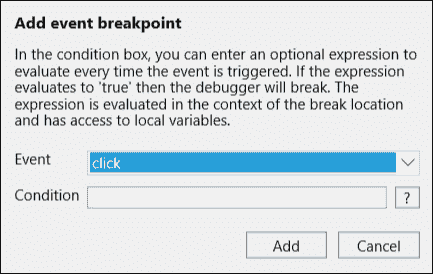

# 第十章：测试和调试 JavaScript

在每一个软件生命周期中，测试和调试都扮演着重要的角色。彻底的测试可以使软件无懈可击，而优秀的调试技术不仅可以帮助解决问题，还能帮助准确地识别并修复问题。

测试是创建任何健壮应用程序的核心本质。然而，应用程序为了达到特定的目标，采用了不同的实践和框架，根据应用程序的性质，架构也会有所不同。因此，有时对于开发者来说，测试客户端代码会变得困难，例如，如果一个应用程序在其页面中包含一些 JavaScript 代码，如内联事件处理程序，这会使它与页面紧密耦合。另一方面，即使将 JavaScript 代码模块化，也会带来一些测试套件限制，并使应用程序的测试过程更难以执行。

调试是查找和修复应用程序错误的过程。它是软件开发中最重要的核心技能之一。如果开发者能够熟练掌握调试工具并了解调试的方方面面，他们就可以快速识别根本原因并开始修复错误。调试是任何软件开发生命周期中的基本过程。无论应用程序是复杂的还是简单的，调试都起着重要的作用，以追踪和修正错误。通过设置断点并逐阶段地执行程序流，调试可以帮助开发者中断程序执行并识别程序流程。此外，几乎所有的调试工具都提供其他有用的信息，例如观察程序中正在使用的变量或对象的状态，并在调试生命周期的每个阶段观察它们。

# 测试 JavaScript 代码

通常，网络应用程序会经历不同类型的测试，例如**用户界面**（**UI**）测试，通过向表单输入某些内容并验证应用程序的行为来检查 UI 的功能。这种类型的测试主要是手动完成或通过自动化测试工具完成。另一种测试类型是**压力测试**，主要用于检查应用程序的性能，通过对应用程序施加一些负载来进行。简单地说，它可以是登录应用程序的许多用户或通过自动化例程执行某些操作的示例，以测试应用程序的行为。还有几种其他类型的测试，但确保应用程序功能并验证应用程序是否符合要求的最重要的测试类型是单元测试。在本节中，我们将讨论使用 Jasmine（一个流行的 JavaScript 单元测试框架）对 JavaScript 代码进行单元测试，并使用 Karma 和 Grunt 在 ASP.NET 应用程序中使用 Visual Studio 2015 IDE 执行测试用例。

## 单元测试

单元测试是一种测试模块中个别单元的方法，包括相关的数据和程序，以验证应用程序的功能符合要求。单元测试由开发者完成，它允许开发者测试应用程序的每个用例，以确保它满足需求并按预期工作。

单元测试的基本优势在于，它将应用程序的每个部分分离成更小的单元，并帮助开发者在开发周期初期集中精力和识别错误。单元测试是任何应用程序承受的第一次测试，它允许测试人员和开发人员在**用户验收测试**（**UAT**）阶段发布应用程序。

### 编写单元测试

为了测试 JavaScript 代码，有许多测试套件可供选择。最受欢迎的是 Jasmine，Mocha 和 QUnit。在本章中，我们将使用 Jasmine 与 Karma 和 Grunt 一起使用。

#### Jasmine

Jasmine 是一个用于测试 JavaScript 代码的行为驱动开发框架。它提供了一些函数，如`it()`，`describe()`，`expect()`等，以编写 JavaScript 代码的测试脚本。这个框架的基本优势在于它非常容易理解，并帮助用非常简单的代码行编写测试 JavaScript 代码。

例如，考虑以下 JavaScript 代码，它计算作为参数传递的两个数字的和：

```js
(function () {
  var addTwoNumbers = function (x, y) {
    return x+y;
  };

})();
```

前面函数的测试用例将类似于以下内容：

```js
describe('Calculator', function () {
  it('Results will be 20 for 10 + 10', function () {
    expect(addTwoNumbers(10,10)).toBe(20);
  });
});
```

#### Karma

Karma 是一个可以与 Jasmine、Mocha 等其他测试框架集成的 JavaScript 测试运行器。它通过提供一个模拟的测试环境并加载执行测试 JavaScript 代码的浏览器，来执行通过 Jasmine 或其他测试框架定义的测试用例。Karma 配置文件被称为`Karma.config.js`。一旦执行测试，结果将显示在控制台窗口中。

#### Grunt

Grunt 相当于 Gulp。它用于执行任务，如 CSS 文件或 JavaScript 文件的压缩，多个 JavaScript 文件的合并和合并等。Grunt 有数百个插件可用于自动化特定任务。与前面章节中使用的 Gulp 不同，我们将使用 Grunt，看看它与 Karma（测试运行器）和 Jasmine（测试套件）一起提供了什么。Grunt 和 Gulp 都是知名的开发任务运行器。在这里使用 Grunt 的原因是为了了解另一个同样知名且受 Visual Studio 2015 支持的 JavaScript 任务运行器，并讨论它提供以使用 Karma 和 Jasmine 进行测试的包。

### 使用 Jasmine、Karma 和 Grunt 开发单元测试

在本节中，我们将开发一个简单的单元测试，以展示如何在 ASP.NET Core 应用程序中使用 Jasmine、Karma 和 Grunt 框架进行单元测试。首先，从 Visual Studio 2015 创建一个 ASP.NET Core 应用程序。

#### 添加包

打开你 ASP.NET Core 应用程序中的`package.json`文件，添加如`grunt`、`grunt-karma`、`karma`、`karma-phantomjs-launcher`、`karma-jasmine`、`karma-spec-reporter`和`karma-cli`等包，如下所示：


以下表格显示了每个包的描述：

| 包名称 | 描述 |
| --- | --- |
| `grunt` | 这配置和运行任务 |
| `grunt-karma` | 这是用于 Karma 测试运行器的 Grunt 插件 |
| `karma` | 这是 JavaScript 的测试运行器 |
| `karma-phantomjs-launcher` | 这是 Karma 插件，用于启动 PhantomJS 浏览器 |
| `karma-jasmine` | 这是 Karma 插件，用于 Jasmine 测试套件 |
| `karma-spec-reporter` | 这是 Karma 插件，用于将测试结果报告到控制台 |
| `karma-cli` | 这是 Karma 命令行界面 |

#### 添加 Grunt 文件

在你的 ASP.NET 应用程序中添加`Gruntfile.js`以定义 Grunt 任务。`Gruntfile.js`是所有任务配置的主文件。在 Visual Studio 的**任务运行器浏览器**窗口中可以看到配置的任务。

##### 添加 Karma 规格说明

`Gruntfile.js`文件提供了主要的`initConfig()`方法，在 Grunt 加载时调用。这是定义 Karma 规格说明的起点。

以下是在`initConfig()`方法内定义的 Karma 规格说明：

```js
grunt.initConfig({
  karma: {
    unit: {
      options: {
        frameworks: ['jasmine'],
        singleRun: true,
        browsers: ['PhantomJS'],
        files: [
          './wwwroot/js/**/*.js',
          './wwwroot/tests/**/*.test.js'

        ]
      }
    }
  }
});
```

在前面的脚本中，我们首先指定了一个 Karma 的目标平台。在`karma`内部，我们将指定用于运行单元测试的单元。在`unit`内部，我们可以定义一些配置属性，如`frameworks`、`singleRun`、`browsers`和`files`：

+   `frameworks`：这是一个我们要使用的测试框架数组。在这个练习中，我们使用了 Jasmine。然而，也可以使用其他框架，如 Mocha 和 QUnit。

    ### 提示

    请注意，在使用 Karma 中的任何框架时，必须使用**Node 包管理器**（**NPM**）单独安装该框架的附加插件/库。

+   `singleRun`：如果这个设置为`true`，Karma 将开始捕获配置的浏览器并在这些浏览器上执行测试。测试完成后，它会顺利退出。

+   `browsers`：这是一个用逗号分隔的值定义多个浏览器的数组。在我们的示例中使用了 PhantomJS，它是一个无头浏览器，在后台运行测试。Karma 支持其他浏览器，如 Chrome、Firefox、IE 和 Safari，这些可以通过这个属性进行配置。

+   `files`: 这里包含所有的测试文件、源文件和依赖。例如，如果我们正在测试脚本中使用 jQuery，或者原始源代码，我们也可以添加这个库的路径。在前面的配置中，我们使用了通配符来加载`js`文件夹下定义的所有源文件，以及`tests`文件夹下带有`test.js`后缀的测试文件。

Karma 配置中还可以使用更多的属性，可以在这里参考：

[`karma-runner.github.io/0.13/config/configuration-file.html`](http://karma-runner.github.io/0.13/config/configuration-file.html)

##### 加载 npm 任务

为了加载 Karma 测试运行工具，我们需要在`Gruntfile.js`中指定它，在前面的配置之后，如下所示：

```js
grunt.loadNpmTasks('grunt-karma');
```

##### 注册任务

最后，我们将向注册任务中添加 Grunt 任务。第一个参数是任务名称，它将出现在 Visual Studio 中的**任务运行器资源管理器**中，第二个参数接受一个数组以执行多个任务：

```js
grunt.registerTask('test', ['karma']);
```

#### 源 JavaScript 文件

在这个例子中，我们有一个`product.js`文件，它包含一个`saveProduct()`方法，该方法将在点击**保存**按钮的事件上被调用。

将此文件添加到`wwwroot/js`文件夹路径中：

```js
window.product = window.product || {};

(function () {
  var saveProduct = function () {
    var prodCode = document.getElementById('txtProdCode').value;
    var prodUnitPrice = document.getElementById('txtProdUnitPrice').value;
    var prodExpiry = document.getElementById('txtProdExpiry').value;
    var prodQuantity = document.getElementById('txtProdQuantity').value;
    var totalPrice = prodUnitPrice * prodQuantity;
    document.getElementById('totalAmount').innerHTML = totalPrice;
  };

  window.product.init = function () {
    document.getElementById('save').addEventListener('click', saveProduct);
  };

})();
```

```js
saveProduct() method that reads the HTML elements and calculates the total price based on the quantity and unit price entered. On the page initialization, we will register the Save button's click event handler that calls the saveProduct() method and calculate the total price.
```

### 提示

建议将你的 JavaScript 代码与 HTML 标记分开。

### 添加单元测试脚本文件

在这里，我们将在`wwwroot/tests`文件夹下添加另一个 JavaScript 文件，并将其命名为`product.test.js`。在编写测试时，可以添加`*.test.js`后缀以使其唯一标识，并将其与源 JavaScript 文件分开。

以下是`product.test.js`的代码：

```js
describe('Product', function () {

  // inject the HTML fixture for the tests
  beforeEach(function () {
    var fixture = '<div id="fixture">'+
      '<input id="txtProdCode" type="text">' +
      '<input id="txtProdExpiry" type="text">' +
      '<input id="txtProdUnitPrice" type="text">' +
      '<input id="txtProdQuantity" type="text">' +
      '<input id="save" type="button" value="Save">' +
      'Total Amount: <span id="totalAmount" /></div>';

    document.body.insertAdjacentHTML(
      'afterbegin',
      fixture);
  });

  // remove the html fixture from the DOM
  afterEach(function () {
    document.body.removeChild(document.getElementById('fixture'));
  });

  // call the init function of calculator to register DOM elements
  beforeEach(function () {
    window.product.init();
  });

  it('Expected result should be 0 if the Unit price is not valid', function () {
    document.getElementById('txtProdUnitPrice').value = 'a';
    document.getElementById('txtProdQuantity').value = 2;
    document.getElementById('save').click();
    expect(document.getElementById('totalAmount').innerHTML).toBe('0');
  });

  it('Expected result should be 0 if the Product Quantity is not valid', function () {
    document.getElementById('txtProdUnitPrice').value = 30;
    document.getElementById('txtProdQuantity').value = 'zero';
    document.getElementById('save').click();
    expect(document.getElementById('totalAmount').innerHTML).toBe('0');
  });

});
```

Jasmine 框架提供了一些特定的关键字来定义在特定条件下运行的特定块，如下所示：

+   `describe()`：这是一个全局 Jasmine 函数，包含两个参数：字符串和函数。字符串是要测试的功能名称。函数包含实际实现 Jasmine 套件的代码，并包含单元测试的逻辑。

+   `it()`：在这里，通过调用全局 Jasmine 函数`it()`定义规格。这也需要字符串和函数，其中它包含实际的单元测试名称和函数块包含实际的代码逻辑以及预期结果。

+   `expect()`：可以使用`expect()`函数指定`it()`函数内定义的某些值的预期结果。这还与一个匹配函数（如`toBe()`或`not.toBe()`）相链式调用，以匹配或取消匹配预期值。

在.NET 中，它等效于**准备**、**行动**和**断言**模式。在这里，准备用于初始化对象并设置传递给测试方法的数据的值。行动模式实际调用测试方法，断言验证测试方法如预期行为。

### 运行测试任务

运行这些任务很简单，它可以通过 Visual Studio 2015 中的**任务运行器**窗口运行。以下是显示`Gruntfile.js`中定义的任务的**任务运行器**窗口截图：


当我们运行测试任务时，它会显示类似以下输出：


在我们的`product.test.js`测试脚本中，有两个任务。一个是检查传递字符串值到两个元素中的一个（如`txtProdUnitPrice`和`txtProdQuantity`）是否会返回`0`。由于我们的`product.js`文件没有处理这个条件，它会给出一个错误。

为了解决这个问题，我们将修改我们的`product.js`，并添加这两行以处理此逻辑，检查值是否为数字：

```js
prodUnitPrice = isNaN(prodUnitPrice) ? 0 : prodUnitPrice;
prodQuantity = isNaN(prodQuantity) ? 0 : prodQuantity;
```

现在，当我们再次运行我们的测试时，我们将得到以下输出：


在前一个示例中，我们在`product.test.js`文件的`beforeEach()`函数内定义了 HTML 标记。对于简单的应用程序，重新定义 HTML 标记作为测试用例并使用它们来执行测试可能不是一个繁琐的过程。然而，大多数 Web 应用程序都使用一些客户端框架，如 Knockout、AngularJS 等，这些框架将 HTML 视图中的控件绑定到 ViewModel，这个 ViewModel 负责读取或写入控件值。

在以下示例中，我们将使用实现 Model-View-ViewModel 模式的 Knockout JavaScript 库，并了解如何以这种方式编写单元测试。

### 使用 Knockout 实现模型-视图-视图模型并运行测试

**模型-视图-视图模型**（**MVVM**）是构建用户界面的设计模式。它分为三部分，如下面的图所示：


这三个部分如下所述：

+   **模型**：这包含调用后端服务并通过与持久存储通信来保存或检索数据的后台逻辑。

+   **视图模型**：这包含视图特定的操作和数据。它表示与视图元素绑定的视图模型。例如，包含一些 HTML 元素的表单将有一个 ViewModel，这是一个包含一些要与这些控件绑定数据的属性的对象。

+   **视图**：这是用户与之交互的用户界面。它显示来自 ViewModel 的信息，在 ViewModel 上引发事件，并在 ViewModel 更改时更新它。

让我们使用**Knockout** JavaScript 库按照以下步骤实现 MVVM 模式。

#### 添加 Knockout 包

首先，让我们通过`bower.json`在你的 ASP.NET Core 应用程序中添加 Knockout.js。可以通过在`bower.json`文件的依赖项部分添加条目来实现，Visual Studio 会自动下载包并将其放置在`wwwroot/lib/knockout`文件夹中。

以下语句可以在`bower.json`文件中添加：

```js
"knockout": "3.4.0",
```

#### 添加 ProductViewModel

`ProductViewModel`包含产品代码、单价、数量、到期日和总金额等属性。以下是`ProductViewModel.js`的代码片段：

```js
var ProductViewModel = function () {

  this.prodCode = ko.observable('');
  this.prodUnitPrice = ko.observable(0);
  this.prodQuantity = ko.observable(0);
  this.prodExpiry = ko.observable('');
  this.prodTotalAmount =0;

  ko.applyBindings(this);

  this.saveProduct=function(){
    var unitPrice = this.prodUnitPrice();
    var quantity = this.prodQuantity();
    var total = unitPrice * quantity;
    this.prodTotalAmount = total;

    //call some service to save product
  }

};
```

```js
ProductViewModel class that contains a few properties, each property is assigned to ko.observable().
```

`ko`基本上是提供一种补充方式的 Knockout 对象，将对象模型与视图链接起来，其中`ko.observable()`是一个 Knockout 函数，使 Model 属性变得可观察并与视图数据同步。这意味着当 ViewModel 属性值发生变化时，视图也会更新；当控件值被修改时，ViewModel 属性也会更新。

```js
0 in the following statement will set the control value 0 when the control binding is done:
```

```js
this.prodUnitPrice = ko.observable(0)
```

`ko.applyBindings()`实际上激活 Knockout 以执行 Model 属性与 View 元素的绑定。

#### 添加产品视图

Knockout 提供了一种非常合适的方式来将 ViewModel 属性绑定到控件元素上。绑定包括两部分，名称和值，由冒号分隔。为了将 ViewModel 与输入元素绑定，我们可以使用 data-bind 属性，并指定值名称后跟`:`和 ViewModel 的属性名称。每个控件都有一组特定的属性，可以根据需要进行元素绑定。

例如，以下是如何使用文本名称将`span`元素绑定到视图模型属性的示例：

```js
Product code is: <span data-bind="text: prodCode"></span>
```

以下是产品视图的修改版本：

```js
<body>
  <div>
    <label> Product Code: </label>
    <input type="text" data-bind="value: prodCode" />
  </div>
  <div>
    <label> Product Unit Price: </label>
    <input type="text" data-bind="value: prodUnitPrice" />
  </div>
  <div>
    <label> Product Expiry: </label>
    <input type="text" data-bind="value: prodExpiry" />
  </div>
  <div>
    <label> Product Quantity: </label>
    <input type="text" data-bind="value: prodQuantity" />
  </div>
  <div>
    <input id="btnSaveProduct" type="button" value="Save Product" />
  </div>
  <script src="img/knockout.js"></script>
  <script src="img/ProductViewModel.js"></script>
  <script>
    (function () {
      var prod = new ProductViewModel();
      document.getElementById("btnSaveProduct").onclick = function () { prod.saveProduct(); };
    })();
  </script>
</body>
```

这就是我们在产品视图中配置 Knockout 所需的所有内容。当点击`btnSaveProduct`按钮时，它会计算总金额并调用产品服务以保存记录。

#### 修改测试配置

以下是之前创建的`Gruntfile.js`的修改版本。我们在`files`数组中添加了`ProductViewModel.js`和 Knockout 依赖项：

```js
/*
This file in the main entry point for defining grunt tasks and using grunt plugins.
*/
module.exports = function (grunt) {
  grunt.initConfig({
    karma: {
      unit: {
        options: {
          frameworks: ['jasmine'],
          singleRun: true,
          browsers: ['PhantomJS'],
          files: [
            './wwwroot/lib/knockout/dist/knockout.js',
            './wwwroot/js/ProductViewModel.js',
            './wwwroot/test/**/product.test.js'
          ]
        }
      }
    }
  });

  grunt.loadNpmTasks('grunt-karma');
  grunt.registerTask('test', ['karma']);
};
```

#### 修改产品测试脚本

由于我们不直接依赖 HTML 视图，因此可以通过产品视图模型来测试我们的单元测试用例。以下是未定义任何固定装置的 `product.test.js` 修改版本：

```js
describe('Product', function () {

  it('Expected Total Amount should be 600', function () {
    var product = new ProductViewModel();
    product.prodQuantity(3);
    product.prodUnitPrice(200);
    product.saveProduct();
    expect(product.prodTotalAmount).toBe(600);
  });
});
```

当运行测试时，将生成以下输出：


# 调试 JavaScript

客户端浏览器上运行 JavaScript，几乎所有浏览器，如 Internet Explorer、Microsoft Edge、Chrome 和 Firefox，都提供集成的 JavaScript 调试器和**开发者工具**窗口。使用 Visual Studio，我们还可以通过将 Internet Explorer 设置为默认浏览器来调试 JavaScript 代码。Chrome 默认不支持，但通过某些步骤可以实现。

## 2015 年 Visual Studio 中的调试选项

Visual Studio 提供了某些相当不错的功能来调试 JavaScript 和解决错误。在 Visual Studio 中，只有与 Internet Explorer 一起使用时才能调试 JavaScript。通过以调试模式启动应用程序，然后在 JavaScript 代码中放置一些断点来开始调试。当达到断点时，我们可以使用在调试 C# 和 VB.NET 代码时已经熟悉的 Visual Studio 中的所有调试选项，例如单步进入 (*F11*)，单步跳过 (*F10*)，单步退出 (*Shift* + *F11*)，条件断点，以及观察变量，所有这些选项都适用于 JavaScript 代码。

### 使用 Internet Explorer 在 Visual Studio 中进行调试

在 Visual Studio 中，可以为特定的网络应用程序项目设置默认浏览器，方法是选择**网络浏览器 (Internet Explorer)** | **Internet Explorer** 选项，如下面的屏幕截图所示：


## 使用 Google Chrome 在 Visual Studio 中进行调试

2015 年的 Visual Studio 不提供用于调试 JavaScript 应用程序的默认支持，除了与 Internet Explorer 一起使用的情况。作为 Node.js 的技术基础与 Google Chrome 相同（都基于 V8 引擎），因此没有缺点。

要在 Visual Studio 中使用 Chrome 开始调试，我们必须使用远程调试器参数运行 Google 的 `chrome.exe` 文件。以下命令会使用远程调试运行 Google Chrome，并且可以从 Visual Studio 指向相同的 Chrome 实例进行附加：

```js
chrome.exe – remote-debugging-port=9222

```

`9222` 是 Visual Studio 在附加到其进程时默认连接的端口。

从 Visual Studio 出发，您可以通过按下 *Ctrl* + *Alt* + *P*，或者通过在菜单栏中选择**调试** | **附加到进程**来附加进程，然后选择 Chrome 实例。

## 开发者工具

```js
The fourth pane is the Call stack and Breakpoints. Call stack shows the chain of function calls that are executed and it is helpful to understand the code-execution flow. For example, if an A() method calls a B() method, and the B() method calls a C() method, it shows the complete flow of execution from the A() method to the C() method.
```

**断点** 选项卡显示脚本中使用的所有断点列表，用户可以通过启用或禁用、删除或添加新事件来管理这些断点：


只有当**F12 开发者工具**窗口被打开时，调试才能开始，并且可以通过菜单栏的**…** | **F12 开发者工具**窗口选项或按*F12*键来打开。窗口打开后，你可以在 JavaScript 代码上设置断点并对页面执行特定操作。

以下表格展示了调试工具栏中一些重要的选项：

| 图标 | 选项 | 快捷键 | 描述 |
| --- | --- | --- | --- |
|  | 继续 | *F5* 或 *F8* | 这将释放断点模式，并继续到下一个断点。 |
|  | 断点 | *Ctrl* + *Shift* + *B* | 这将在下一条语句处设置断点。 |
|  | 步进 | *F11* | 这将步进到被调用函数或下一条语句。 |
|  | 单步跳过 | *F10* | 这将跳过被调用函数或下一条语句。 |
|  | 步出 | *Shift* + *F11* | 这将跳出当前函数，进入调用函数。 |
|  | 在新工作者创建时断点 | *Ctrl* + *Shift* + *W* | 这将在新 web 工作者创建时设置断点。 |
|  | 异常控制 | *Ctrl* + *Shift* + *E* | 这可用于在所有异常或未处理的异常处设置断点。默认情况下，它设置为忽略异常。 |
|  | 断开调试器 |   | 这将断开调试器，不再运行断点。 |
|  | 只调试我的代码 | *Ctrl* + *J* | 这将忽略调试第三方库。 |
|  | 美丽打印 | *Ctrl* + *Shift* + *P* | 这将搜索 JavaScript 块的压缩版本并使其可读。 |
|  | 单词换行 | *Alt* + *W* | 这将根据内容窗体大小调整句子。 |

微软 Edge 提供了以下五种断点类型：

+   标准

+   条件

+   跟踪点

+   XHR

+   事件

### 标准断点

这些断点可以通过简单地从脚本代码中选择语句来设置：


### 条件断点

这类断点在满足特定条件或变量达到特定状态时会被触发。例如，我们可以在循环内的语句使用这个，当计数器达到 10 的值时中断执行。

可以通过点击现有断点并从**上下文**菜单选择**条件…** 来设置：


此选项将打开**条件断点**窗口，条件可以设置如下截图所示：


一旦设置了条件，图标将变为

### 跟踪点

跟踪点用于在语句通过时在控制台写消息，跟踪点是通过点击以下选项设置的：**从**上下文菜单中点击**插入跟踪点**


一旦设置了跟踪点，图标将发生变化，如下：


当语句执行时，它将在控制台窗口上打印如下截图中的消息：


### 事件

微软 Edge 提供了从**断点**面板注册事件跟踪点和断点的选项。事件可以是鼠标事件、键盘事件或定时器事件。这项功能在大型或复杂的网络应用程序中大量使用，在这些应用程序中，不知道确切的断点位置。在某些情况下，当事件处理程序在多个地方指定时，此功能更有用。例如，如果一个页面包含 5 个按钮控件，我们需要在任何一个按钮引发点击事件时中断执行，我们只需通过断点事件指定鼠标点击事件；每当任何按钮事件被引发时，断点将被执行并聚焦于该语句。

#### 添加事件跟踪点

用户可以使用以下选项添加事件跟踪点：


以下窗口显示了当鼠标点击时事件跟踪点的注册情况：


#### 添加事件断点

用户可以使用以下选项添加事件断点：


以下窗口显示了当鼠标点击时事件断点的注册情况：



### XHR

与事件类似，XHR 事件也可以从浏览器的**断点**面板中注册。当从 JavaScript 代码中发起任何 Ajax 请求时，这些事件将被触发。用户可以从以下截图中的图标注册 XHR 事件：


一旦我们点击这个事件，它就会被添加到**断点**窗口中，如下截图所示：


## 调试 TypeScript

在第五章 *使用 Angular 2 和 Web API 开发 ASP.NET 应用程序*中，我们已经讨论了 TypeScript 以及它如何转换成最终在浏览器上运行的 JavaScript 代码。开发人员用 TypeScript 编写代码，但在浏览器上运行的是生成的 JavaScript 文件。当 TypeScript 文件被转换成一个 JavaScript 文件时，会生成一个映射文件，其扩展名为`*.map.js`。这个文件包含了有关实际 TypeScript 文件和生成的 JavaScript 文件的信息。不仅如此，生成的 JavaScript 文件还包含了一个关于映射文件的条目，这个条目实际上告诉浏览器通过读取映射文件来加载相应的源 TypeScript 文件。

当 TypeScript 文件被转换成 JavaScript 文件时，每个生成的 JavaScript 文件都包含以下条目：

```js
//# sourceMappingURL=http://localhost:12144/todosapp/apps/createTodo.component.js.map
```

这可以通过`TSConfig.json`文件中的`sourceMap`属性进行配置。如果`sourceMap`属性为`true`，它将生成映射文件，并在生成的 JavaScript 文件中创建一个条目。另外，在 ASP.NET Core 应用程序中工作的时候，所有的静态文件都必须放在`wwwroot`文件夹中。所以，为了调试 TypeScript，所有相应的 TypeScript (`.ts`) 文件必须移动到`wwwroot`文件夹下的任何文件夹中，这样就可以通过浏览器访问了。

这里是有调试器窗口，它显示左侧的 TypeScript 文件列表和右上角的图标，可以切换源文件和编译后的 JavaScript 版本：


## 所有浏览器都支持`debugger`关键字

我们也可以通过`debugger`关键字显式地在某个点上中断控制。如果没有设置断点，但是指定了`debugger`关键字，调试将启用并中断执行。它可以从代码中设置，如下面的屏幕截图所示：


# 总结

在本章中，我们讨论了如何测试和调试 JavaScript 应用程序。对于测试 JavaScript 应用程序，我们讨论了可以轻松与 Karma（一个测试运行器）集成的 Jasmine 测试套件，它还可以与 Grunt 一起使用，从 Visual Studio **任务运行器浏览器**窗口执行。我们还讨论了 MVVM 模式的基础知识以及如何使用 Knockout JavaScript 库来实现它。然后我们将测试用例修改为与视图模型一起工作。对于调试，我们讨论了使用 Visual Studio 调试 JavaScript 的一些技巧和技术，以及 Microsoft Edge 通过**开发者工具**窗口提供的内容，以使调试变得容易。最后，我们还学习了有关基本主题的知识，例如 Microsoft Edge 如何启用对 TypeScript 文件的调试以及实现此目的所需的配置。
