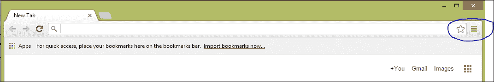
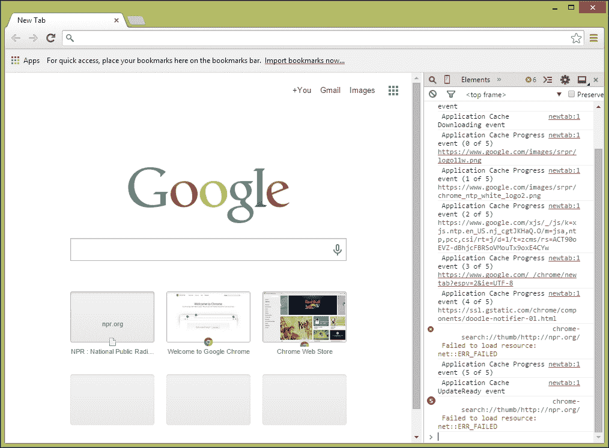

# 第一章 客户端读写 JSON

在本章中，我们将介绍以下菜谱：

+   在 JavaScript 中读写 JSON

+   在 C++ 中读写 JSON

+   在 C# 中读写 JSON

+   在 Java 中读写 JSON

+   在 Perl 中读写 JSON

+   在 Python 中读写 JSON

除了在 Python 中读写 JSON 之外，我们首先向您展示 JSON 格式的简要回顾，以帮助为本书后续内容奠定基础。

# 简介

**JSON** 代表 **JavaScript Object Notation**（JavaScript 对象表示法）。它是一种开放标准，用于将数据表示为带值的属性。最初来源于 JavaScript 语法（因此得名）用于作为更冗长和结构化的 **Extensible Markup Language**（**XML**）的替代，在网页应用程序中使用，现在它被用于许多独立和网络应用程序中的数据序列化和传输。

JSON 提供了在客户端和服务器之间封装数据的理想方式。在本章中，你将学习如何在章节开始时指定的语言中使用 JSON。

这些语言通常用于客户端开发，这正是我们将要关注的内容。我们将在第二章中更多地了解服务器端语言，*服务器端读写 JSON*。

让我们来看一下由 web API 返回的 JSON 数据，该 API 的网址是 [`www.aprs.fi`](http://www.aprs.fi)，我对其进行了少许修改以使示例更清晰（在后面的第四章中，*使用 JSON 在 jQuery 和 AngularJS 的 AJAX 应用程序中*，你将学习如何使用网络浏览器和 JavaScript 自己获取这些数据）：

```js
{
  "command":"get",
  "result":"ok",
  "what":"loc",
  "found":2,
  "entries":[
    {
      "class":"a",
      "name":"KF6GPE",
      "type":"l",
      "time":"1399371514",
      "lasttime":"1418597513",
      "lat":37.17667,
      "lng":-122.14650,
      "symbol":"\/-",
      "srccall":"KF6GPE",
    },
    {
      "class":"a",
      "name":"KF6GPE-7",
      "type":"l",
      "time":"1418591475",
      "lasttime":"1418591475",
      "lat":37.17633,
      "lng":-122.14583,
      "symbol":"\\K",
      "srccall":"KF6GPE-7",
    }
  ]
}
```

### 提示

**下载示例代码**

你可以从 [`www.packtpub.com`](http://www.packtpub.com) 下载你购买的所有 Packt Publishing 书籍的示例代码文件。如果你在其他地方购买了这本书，你可以访问 [`www.packtpub.com/support`](http://www.packtpub.com/support) 并注册，以电子邮件方式直接接收这些文件。

这个例子有几个需要注意的地方：

+   数据组织成属性和值，每个属性由冒号分隔。（注意，JSON 文档也可以是一个单独的值，比如字符串、浮点数、整数或布尔值。）

+   属性作为双引号括起来的字符串出现在冒号的左侧。

+   值位于冒号的右侧，可以是以下内容：

    +   字符串（用双引号括起来的，例如 `KF6GPE`

    +   数字（整数或浮点数），例如 `2` 或 `37.17667`

    +   数组（由逗号分隔的值，包含在方括号中），例如 `entries` 的值

    +   由更多属性和值组成的全局对象，例如 `entries` 值中的两个数组值

    +   另外（虽然这个例子没有显示），布尔值 `true` 和 `false`

+   请注意，许多其他类型的值，如日期/时间对或单个字符，JSON 是不支持的。

+   虽然这个例子不完全清楚，但空格是无关紧要的。例如，没有必要将每一对都放在单独的一行上，缩进是完全任意的。

JSON 的属性名-属性值属性，以及嵌套值和表示数组的能力，赋予了 JSON 很大的灵活性。你可以使用 JSON 表示很多常见的对象，包括大多数不包含大量二进制数据的对象（有关如何使用 JavaScript 和 JSON 表示二进制数据的思路，请参见第八章，*使用 JSON 进行二进制数据传输*）。这包括原始值（自文档化，因为每个值都伴随着一个属性），具有简单值的平面对象，包括地图，以及简单或复杂对象的数组。

JSON 的自文档化特性使其成为数据传输的理想选择，即便它不支持 XML 中可能找到的注释。它所具有的纯文本特性使其在网络上使用诸如`gzip`这样的流行压缩方案进行压缩变得容易，而且与更冗长的 XML 相比，它的格式对人类阅读更为友好。

### 提示

请注意，JSON 文档本质上是一种树结构，因此，它不支持循环数据结构，比如图，其中节点指向数据结构中的另一个节点。

如果你使用编程语言的本地区域表示创建此类数据结构，并尝试将其转换为 JSON，你会得到一个错误。

# 在 JavaScript 中读写 JSON

JSON 最初是一种在 Web 服务器和 JavaScript 之间传输数据的手段，因此让我们从一个简单的代码片段开始，该代码片段在 Web 浏览器中使用 JavaScript 读写 JSON。我们将在第四章，*使用 JSON 在 AJAX 应用程序中与 jQuery 和 AngularJS 一起使用*中展示一个使用 AJAX 和 JSON 的 Web 应用程序的全部内容；以下是如何从 JSON 获取 JavaScript 对象以及如何从 JavaScript 对象创建 JSON 字符串。

## 准备就绪

你需要一种方法来编辑 JavaScript 并在浏览器中运行它。在本例中，以及本书中的几乎所有示例，我们将使用 Google Chrome 来完成这个任务。你可以在[`www.google.com/chrome/browser`](https://www.google.com/chrome/browser)下载 Google Chrome。一旦你安装了 Google Chrome，你希望通过点击右侧的**定制和控制 Doodle Chrome**图标来激活 JavaScript 控制台，它看起来像这样：



然后，你需要前往**更多工具 | JavaScript 控制台**。你应该能在网页的侧面看到一个 JavaScript 控制台，就像这样：



如果你喜欢使用快捷键，你也可以在 Windows 和 Linux 上使用*Ctrl* + *Shift* + *J*，或者在 Macintosh 上使用*control* + *option* + *J*。

从这里开始，你可以在右下角输入 JavaScript 代码并按下*Enter*键（在 Mac OS X 系统上为*return*键）来执行 JavaScript。

## 如何做到...

现代网页浏览器，如 Chrome，在 JavaScript 运行时定义了一个 JSON 对象，该对象可以将包含 JSON 的字符串数据转换为 JavaScript 对象，反之亦然。这是一个简单的示例：

```js
>var json = '{"call":"KF6GPE","type":"l","time":
"1399371514","lasttime":"1418597513","lat":37.17667,"lng":
-122.14650,"result" : "ok" }';
<- "{ "call":"KF6GPE","type":"l","time":"1399371514",
"lasttime":"1418597513","lat":37.17667,"lng":-122.14650,
"result" : "ok" }"
>var object = JSON.parse(json);
<- Object {call:"KF6GPE",type:"l",time:"1399371514",
lasttime:"1418597513",lat:37.17667, lng:-122.14650,result: "ok"}
> object.result
<- "ok"
>var newJson = JSON.stringify(object);
<- "{ "call":"KF6GPE","type":"l","time":"1399371514",
"lasttime":"1418597513","lat": 37.17667,"lng": -122.14650,
"result" : "ok" }"
```

### 注意

在此及随后的 JavaScript 示例中，你在 JavaScript 控制台输入的文本前面有一个`>`符号，而 JavaScript 控制台打印的内容是以`<-`符号开头的。

## 它是如何工作的...

Chrome 和其他现代网页浏览器定义了`JSON`对象，该对象具有将包含 JSON 的字符串和 JavaScript 对象之间相互转换的方法。

在前一个示例中，我们首先将`json`变量的值设置为一个包含一个名为`result`的属性的简单 JSON 表达式，其值为`ok`。JavaScript 解释器返回变量`json`的结果值。

下一行使用了`JSON`对象的`parse`方法，将`json`引用的 JSON 字符串转换为 JavaScript 对象：

```js
>var object = JSON.parse(json);
<- Object { call:"KF6GPE", type:"l", time:"1399371514", lasttime:"1418597513", lat:37.17667, lng:-122.14650, result: "ok"}
```

然后，你可以像访问任何其他 JavaScript 对象一样访问对象中的任何一个值；毕竟，它就是一个对象：

```js
> object.result;
<- "ok"
```

最后，如果你需要将一个对象转换成 JSON 格式，你可以使用`JSON`对象的`stringify`方法来实现：

```js
>var newJson = JSON.stringify(object);
<- "{ "call":"KF6GPE","type":"l","time":"1399371514",
"lasttime":"1418597513","lat": 37.17667,"lng": -122.14650,
"result" : "ok" }"
```

## 还有更多内容...

关于这些方法，你应该知道两件事情。首先，如果传递给 parse 的 JSON 格式不正确，或者根本不是 JSON，它会抛出一个异常：

```js
>JSON.parse('{"result" = "ok" }')
<- VM465:2 Uncaught SyntaxError: Unexpected token =
```

错误信息不是很有帮助，但如果你在调试由不完全符合规范且未经调试的 JSON 编码器发送的 JSON，这总比没有强。

第二，非常旧的网页浏览器可能没有包含这些方法的 JSON 对象。在这种情况下，你可以使用 JavaScript 函数`eval`，在将 JSON 用括号括起来后再对其进行处理，像这样：

```js
>eval('('+json+')')
<- Object {result: "ok"}
```

`eval`函数评估你传递给它的 JavaScript 字符串，而 JSON 表示实际上只是 JavaScript 的一个子集。然而，尽管理论上你可以避免使用`eval`，但有几个原因建议你这么做。首先，它通常比`JSON`对象提供的方法慢。其次，它不安全；你传递的字符串可能包含恶意的 JavaScript，这可能会导致你的 JavaScript 应用程序崩溃或被其他方式破坏，这绝不是轻视的威胁。尽可能使用`JSON`对象。第三，你可以使用`parse`和`stringify`方法来处理简单值，比如布尔值、数字和字符串；你不仅仅限于前一个示例中的键值对。如果我只想传递一个布尔值（比如"交易成功！"），我可能会直接写如下内容：

```js
var jsonSuccess = 'true';
<- "true"
> var flag = JSON.parse(jsonSuccess);
```

最后，值得指出的是，JSON 的`parse`和`stringify`方法都接受一个可选的替换函数，该函数在序列化或反序列化被序列化或反序列化的对象中的每个键和值时被调用。你可以使用这个函数在 JSON 被解析时进行实时数据转换；例如，你可以使用它将日期字符串表示和自纪元开始以来午夜的秒数之间进行转换，或者纠正字符串的大小写。我可以在以下代码中使用替换函数进行转换，使调用字段小写：

```js
> var object = JSON.parse(json, function(k, v) {
  if ( k == 'call') return v.toLowerCase();
});
<- Object { call:"kf6gpe", type:"l", time:"1399371514",
lasttime:"1418597513", lat:37.17667, lng:-122.14650, result: "ok"}
```

你还可以返回`undefined`以从结果中移除一个项目；为了从生成的 JSON 中省略类型字段，我可以执行以下操作：

```js
> var newJson = JSON.stringify(object, function (k, v) {
  if k == 'type') return undefined;
});
<- "{ "call":"KF6GPE","time":"1399371514","lasttime":
"1418597513","lat": 37.17667,"lng": -122.14650, "result" : "ok" 
}"
```

# 在 C++中读写 JSON

C++是一种早在 JSON 出现之前就存在的语言，但对于许多项目来说仍然相关。C++中没有对 JSON 的原生支持，但有许多库提供了对 JSON 工作的支持。或许最广泛使用的是**JsonCpp**，可在 GitHub 上找到[`github.com/open-source-parsers/jsoncpp`](https://github.com/open-source-parsers/jsoncpp)。它的许可证为 MIT 许可证或如果你愿意的话为公共领域，所以它的使用几乎没有限制。

## 准备

要使用 JsonCpp，你首先需要前往网站下载包含整个库的压缩文件。一旦你这么做，你需要将其与你的应用程序源代码集成。

你将它在应用程序源代码中集成的方法因平台而异，但一般过程是这样的：

1.  使用网站上的说明创建库的合并源和头文件。为此，你需要下载 JsonCpp 并安装 Python 2.6 或更高版本。从 JsonCpp 的顶级目录运行`python amalgamate.py`。

1.  在任何你想使用 JsonCpp 库的文件中包含`dist/json/json.h`头文件。

1.  在你的项目 Makefile 或构建系统中包含源文件`dist/jsoncpp.cpp`。

一旦你这样做，你应该在任何包含`json/json.h`头文件的文件中访问 JsonCpp 接口。

## 如何进行操作...

下面是一个简单的 C++应用程序，它使用 JsonCpp 将包含一些简单 JSON 的`std::string`和 JSON 对象之间进行转换：

```js
#include <string>
#include <iostream>
#include "json/json.h"

using namespace std;

int main(int argc, _TCHAR* argv[])
{
  Json::Reader reader;
  Json::Value root;

  string json = "{\"call\": \"KF6GPE\",\"type\":\"l\",\"time\":
  \"1399371514\",\"lasttime\":\"1418597513\",\"lat\": 37.17667,
  \"lng\": -122.14650,\"result\":\"ok\"}";

  bool parseSuccess = reader.parse(json, root, false);

  if (parseSuccess)
  {
    const Json::Value resultValue = root["result"];
    cout << "Result is " << resultValue.asString() << "\n";
  }

  Json::StyledWriter styledWriter;
  Json::FastWriter fastWriter;
  Json::Value newValue;
  newValue["result"] = "ok";

  cout << styledWriter.write(newValue) << "\n";
  cout << fastWriter.write(newValue) << "\n";

  return 0;
}
```

## 它是如何工作的...

这个例子开始于包含必要的包含文件，包括定义 JsonCpp 接口的`json/json.h`。我们明确引用`std`命名空间以简化问题，尽管对于`Json`命名空间，其中 JsonCpp 定义了所有其接口，不要这样做。

JsonCpp 实现定义了 `Json::Reader` 和 `Json::Writer`，分别指定 JSON 读取器和写入器的接口。实践中，`Json::Reader` 接口也是 JSON 类的实现，可以读取 JSON，将其值返回为 `Json::Value`。`Json::Writer` 变量只是定义了一个接口；你可能需要使用其子类，如 `Json::FastWriter` 或 `Json::StyledWriter`，从 `Json::Value` 对象创建 JSON。

前一个列表首先定义了 `Json::Reader` 和 `Json::Value`；我们将使用读取器读取我们接下来定义的 JSON，并将其值存储在 `Json::Value` 变量 `root` 中。（假设你的 C++ 应用程序会从其他来源获取 JSON，比如网络服务或本地文件。）

解析 JSON 只需调用读取器的 `parse` 函数，将 JSON 和将要写入 JSON 值的 `Json::Value` 传递给它。它返回一个布尔值，如果 JSON 解析成功，则为 `true`。

`Json::Value` 类将 JSON 对象表示为树；个别值通过原始 JSON 的属性名称来引用，这些值是这些键的值，可以通过诸如 `asString` 之类的方法访问，该方法将对象的值作为本地 C++ 类型返回。`Json::Value` 这些方法包括以下内容：

+   `asString`, 它返回 `std::string`。

+   `asInt`, 它返回 `Int`。

+   `asUInt`, 它返回 `UInt`。

+   `asInt64`, 它返回 `Int64`。

+   `asFloat`, 它返回 `float`。

+   `asDouble`, 它返回 `double`。

+   `asBool`, 它返回 `bool`。

此外，这个类还提供了 `operator[]`，让你访问数组元素。

你可以 also 查询一个 `Json::Value` 对象，使用这些方法之一来确定它的类型：

+   `isNull`, 如果值是 `null` 则返回 `true`。

+   `isBool`, 如果值是 `bool` 类型则返回 `true`。

+   `isInt`, 如果值是 `Int` 则返回 `true`。

+   `isUInt`, 如果值是 `UInt` 则返回 `true`。

+   `isIntegral`, 如果值是整数则返回 `true`。

+   `isDouble`, 如果值是 `double` 则返回 `true`。

+   `isNumeric`, 如果值是数字则返回 `true`。

+   `isString`, 如果值是字符串则返回 `true`。

+   `isArray`, 如果值是一个数组则返回 `true`。

+   `isObject`, 如果值是另一个 JSON 对象（你可以使用另一个 `Json::Value` 值对其进行分解）则返回 `true`。

无论如何，我们的代码使用 `asString` 来获取作为 `result` 属性的 `std::string` 值，并将其写入控制台。

代码然后定义了`Json::StyledWriter`和`Json::FastWriter`来创建一些格式化的 JSON 和未格式化的 JSON 字符串，以及一个`Json::Value`对象来包含我们的新 JSON。赋值给 JSON 值很简单，因为它用适当的实现覆盖了`operator[]`和`operator[]=`方法，以将标准 C++类型转换为 JSON 对象。因此，以下代码创建了一个带有`result`属性和`ok`值的单个 JSON 属性/值对（尽管这段代码没有显示，但你可以通过将 JSON 对象分配给其他 JSON 对象来创建 JSON 属性值树）：

```js
newValue["result"] = "ok";
```

我们首先使用`StyledWriter`，然后使用`FastWriter`来编码`newValue`中的 JSON 值，将每个字符串写入控制台。

当然，你也可以将单个值传递给 JsonCpp；如果你只是想传递一个双精度数，没有理由不执行以下代码。

```js
Json::Reader reader;
Json::Value piValue;

string json = "3.1415";
bool parseSuccess = reader.parse(json, piValue, false);
  double pi = piValue.asDouble();
```

## 也请参阅

对于 JsonCpp 的文档，你可以从[`www.stack.nl/~dimitri/doxygen/`](http://www.stack.nl/~dimitri/doxygen/)安装 doxygen，并将其运行在 JsonCpp 主要分布的`doc`文件夹上。

还有其他针对 C++的 JSON 转换实现。要查看完整的列表，请参阅[`json.org/`](http://json.org/)上的列表。

# 在 C#中读写 JSON

C#是一种常见的客户端语言，用于编写丰富应用程序的客户端实现，以及运行在 ASP.NET 上的 Web 服务的客户端实现。.NET 库在 System.Web.Extensions 程序集中包括 JSON 序列化和反序列化。

## 准备

这个例子使用了 System.Web.Extensions 程序集中的内置 JSON 序列化和反序列化器，这是许多可用的.NET 库之一。如果你安装了最近版本的 Visual Studio（请参阅[`www.visualstudio.com/en-us/downloads/visual-studio-2015-downloads-vs.aspx`](https://www.visualstudio.com/en-us/downloads/visual-studio-2015-downloads-vs.aspx)），它应该是可以使用的。要使用这个程序集，你所需要做的就是在 Visual Studio 中通过右键点击你的项目中的**引用**项，选择**添加引用**，然后在**框架程序集**列表中滚动到底部找到**System.Web.Extensions**。

## 如何做到...

这是一个简单的应用程序，它反序列化了一些 JSON，作为属性-对象对的字典：

```js
using System;
using System.Collections.Generic;
using System.Web.Script.Serialization;

namespace JSONExample
{
    public class SimpleResult
    {
        public string result;
    }

    class Program
    {
        static void Main(string[] args)
        {
            JavaScriptSerializer serializer = 
            new System.Web.Script.Serialization.
            JavaScriptSerializer();

            string json = @"{ ""call"":""KF6GPE"",""type"":
""l"",""time"":""1399371514"",""lasttime"":""1418597513"",
""lat"": 37.17667,""lng\": -122.14650,""result"": ""ok"" }";

dynamic result = serializer.DeserializeObject(json);
            foreach (KeyValuePair<string, object> entry in result)
            {
                var key = entry.Key;
                var value = entry.Value as string;
Console.WriteLine(String.Format("{0} : {1}", 
key, value));
            }
            Console.WriteLine(serializer.Serialize(result));

            var anotherResult = new SimpleResult { result="ok" };
            Console.WriteLine(serializer.Serialize(
            anotherResult));
        }
    }
}
```

## 它是如何工作的...

System.Web.Extensions 程序集提供了`System.Web.Script.Serialization`名称空间中的`JavaScriptSerializer`类。这段代码首先定义了一个简单的类`SimpleResult`，我们将在示例中将其编码为 JSON。

`Main`方法首先定义了一个`JavaScriptSerializer`实例，然后定义了一个包含我们 JSON 的`string`。解析 JSON 只需调用`JavaScriptSerializer`实例的`DeserializeObject`方法，该方法根据传递的 JSON 在运行时确定返回对象的类型。

### 提示

你也可以使用`DeserializeObject`以类型安全的方式解析 JSON，然后返回对象的类型与传递给方法的类型匹配。我将在第七章*使用 JSON 进行类型安全操作*中向你展示如何做到这一点。

`DeserializeObject`返回一个键值对的`Dictionary`；键是 JSON 中的属性，值是表示这些属性值的对象。在我们示例中，我们简单地遍历字典中的键和值，并打印出来。因为我们知道 JSON 中值的类型，所以我们可以使用 C#的`as`关键字将其转换为适当的类型（在这个例子中是`string`）；如果不是`string`，我们将收到`null`值。你可以使用`as`或 C#的类型推导来确定 JSON 中未知对象的类型，这使得解析缺乏严格语义的 JSON 变得容易。

`JavaScriptSerializer`类还包括一个`Serialize`方法；你可以将其作为属性-值对的字典传递，就像我们对反序列化结果所做的那样，或者你可以将其作为 C#类的实例传递。如果你将其作为类传递，它将尝试通过内省类字段和值来序列化类。

## 还有更多...

微软提供的 JSON 实现对于许多目的来说已经足够了，但不一定最适合你的应用程序。其他开发者实现了更好的版本，这些版本通常使用与微软实现相同的接口。一个不错的选择是 Newtonsoft 的 Json.NET，你可以从[`json.codeplex.com/`](http://json.codeplex.com/)或者从 Visual Studio 的 NuGet 获取。它支持更广泛的.NET 平台（包括 Windows Phone），LINQ 查询，对 JSON 的 XPath-like 查询，并且比微软实现更快。使用它与使用微软实现类似：从 Web 或 NuGet 安装包，将程序集引用添加到你的应用程序中，然后使用`NewtonSoft.Json`命名空间中的`JsonSerializer`类。它定义了与微软实现相同的`SerializeObject`和`DeserializeObject`方法，使得切换到这个库变得容易。*Json.NET*的作者*James Newton-King*将其置于 MIT 许可下。

与其他语言一样，你也可以在反序列化和序列化过程中传递原始类型。例如，在评估以下代码后，动态变量`piResult`将包含一个浮点数，3.14：

```js
string piJson = "3.14";
dynamic piResult = serializer.DeserializeObject(piJson);
```

## 也参见

如我之前所暗示的，你可以以一种类型安全的方式进行操作；我们将在第七章*使用 JSON 进行类型安全操作*中讨论更多内容。你将通过使用泛型方法`DeserializeObject<>`，传入你想要反序列化的类型变量来实现。

# 在 Java 中读写 JSON

Java，像 C++一样，早于 JSON。甲骨文目前正致力于为 Java 添加 JSON 支持，但与此同时，网上有多个提供 JSON 支持的实现。与本章前面看到的 C++实现类似，你可以使用第三方库将 JSON 和 Java 之间进行转换；在这个例子中，作为一个 Java 归档（JAR）文件，其实现通常将 JSON 对象表示为命名的对象的树。

也许最好的 JSON 解析 Java 实现是 Gson，可以从谷歌的[`code.google.com/p/google-gson/`](http://code.google.com/p/google-gson/)获取，在 Apache 许可证 2.0 下发布。

## 准备开始

首先，你需要获取 Gson；你可以通过使用以下命令，用 SVN 通过 HTTP 进行只读检出仓库来完成这个操作：

```js
svn checkout http://google-gson.googlecode.com/svn/trunk/google-gson-read-only

```

当然，这假设你已经安装了一个 Java 开发工具包（[`www.oracle.com/technetwork/java/javase/downloads/index.html`](http://www.oracle.com/technetwork/java/javase/downloads/index.html)）和 SVN（Windows 上的 TortoiseSVN 是一个好的客户端，可在[`tortoisesvn.net/downloads.html`](http://tortoisesvn.net/downloads.html)获得）。许多 Java IDE 包括对 SVN 的支持。

一旦你检查了代码，按照随附的说明构建吉森 JAR 文件，并将 JAR 文件添加到你的项目中。

## 如何做到…

开始之前，你需要创建一个`com.google.gson.Gson`对象。这个类定义了你将用来在 JSON 和 Java 之间转换的接口：

```js
Gson gson = new com.google.gson.Gson(); 
String json = "{\"call\": \"KF6GPE\", \"type\": \"l\", \"time\":
\"1399371514\", \"lasttime\": \"1418597513\", \"lat\": 37.17667,
\"lng\": -122.14650,\"result\":\"ok\"}";
com.google.gson.JsonObject result = gson.fromJson(json, 
JsonElement.class).getAsJsonObject(); 
```

`JsonObject`类定义了包含 JSON 对象的顶级对象；你使用它的`get`和`add`方法来获取和设置属性，像这样：

```js
JsonElement result = result.get("result").getAsString();
```

吉森库使用`JsonElement`类来封装单个 JSON 值；它有以下方法，可以让您将`JsonElement`中的值作为普通的 Java 类型获取：

+   `getAsBoolean`，返回值为`Boolean`

+   `getAsByte`，返回值为`byte`

+   `getAsCharacter`，返回值为`char`

+   `getAsDouble`，返回值为`double`

+   `getAsFloat`，返回值为`float`

+   `getAsInt`，返回值为`int`

+   `getAsJsonArray`，返回值为`JsonArray`

+   `getAsJsonObject`，返回值为`JsonObject`

+   `getAsLong`，返回值为`long`

+   `getAsShort`，返回值为`short`

+   `getAsString`，返回值为`String`

你也可以使用以下方法之一了解`JsonElement`中的类型：

+   `isJsonArray`，如果元素是一个对象数组则返回`true`

+   `isJsonNull`，如果元素为 null 则返回`true`

+   `isJsonObject`，如果元素是一个复合对象（另一个 JSON 树）而不是单个类型则返回`true`

+   `isJsonPrimitive`，如果元素是基本类型，如数字或字符串，则返回`true`

## 还有更多…

你也可以直接将类的实例转换为 JSON，像这样编写代码：

```js
public class SimpleResult {
    public String result;
}

// Elsewhere in your code…
Gson gson = new com.google.gson.Gson(); 
SimpleResult result = new SimpleResult;
result.result = "ok";
String json = gson.toJson(result);	
```

这定义了一个`SimpleResult`类，我们用它来创建一个实例，然后使用`Gson`对象实例将转换为包含 JSON 的字符串，使用`Gson`方法的`toJson`。

最后，因为`JsonElement`封装了一个单独的值，你也可以处理表示为 JSON 的简单值，比如这样：

```js
Gson gson = new com.google.gson.Gson(); 
String piJson = "3.14";
double result = gson.fromJson(piJson, 
JsonElement.class).getAsDouble(); 
```

这会将 JSON 中的原始值`3.14`转换为 Java `double`。

## 也见

与 C#示例类似，你可以直接从 JSON 转换为普通的旧 Java 对象（POJO），并以类型安全的方式进行转换。你将在第七章 *以类型安全的方式使用 JSON*中看到如何做到这一点。

还有其他针对 Java 的 JSON 转换实现。要获取完整列表，请查看[`json.org/`](http://json.org/)上的列表。

# 在 Perl 中读写 JSON。

Perl 早于 JSON，尽管 CPAN 有一个很好的 JSON 转换实现，即综合 Perl 存档网络（Comprehensive Perl Archive Network）。

## 如何做到...

首先，从 CPAN 下载 JSON 模块并安装它。通常，你会下载文件，解压它，然后在已经配置了 Perl 和 make 的系统上运行以下代码：

```js
perl Makefile.PL 
make 
make install
```

这是一个简单示例：

```js
use JSON;
use Data::Dumper;
my $json = '{ "call":"KF6GPE","type":"l","time":"1399371514",
"lasttime":"1418597513","lat": 37.17667,"lng": -122.14650,
"result" : "ok" }';
my %result = decode_json($json);
print Dumper(result);
print encode_json(%result);
```

让我们来看看 JSON 模块提供的接口。

## 它是如何工作的...

CPAN 模块定义了`decode_json`和`encode_json`方法来分别解码和编码 JSON。这些方法在 Perl 对象（如字面值和关联数组）和包含 JSON 的字符串之间进行相互转换。

代码首先导入了 JSON 和`Data::Dumper`模块。接下来，它定义了一个单一字符串`$json`，其中包含我们要解析的 JSON。

有了 JSON 中的`$json`，我们定义`%result`为包含 JSON 中定义的对象的关联数组，并在下一行倾倒散列中的值。

最后，我们将散列重新编码为 JSON，并将结果输出到终端。

## 也见

要获取更多信息并下载 JSON CPAN 模块，请访问[`metacpan.org/pod/JSON`](https://metacpan.org/pod/JSON)。

# 在 Python 中读写 JSON。

从 Python 2.6 开始，Python 就拥有对 JSON 的本地支持，通过`json`模块。使用该模块就像使用`import`语句导入模块一样简单，然后通过它定义的`json`对象访问编码器和解码器。

## 准备好了

只需在源代码中输入以下内容，就可以引用 JSON 功能：

```js
import json
```

## 如何做到...

以下是从 Python 解释器中的一个简单示例：

```js
>>> import json
>>>json = '{ "call":"KF6GPE","type":"l","time":"1399371514",
"lasttime":"1418597513","lat": 37.17667,"lng": -122.14650,
"result" : "ok" }'
u'{"call":"KF6GPE","type":"l","time":"1399371514",
"lasttime":"1418597513","lat": 37.17667,"lng": -122.14650,
"result": "ok" }'
>>>result = json.loads(json)
{u'call':u'KF6GPE',u'type':u'l',u'time':u'1399371514',
u'lasttime':u'1418597513',u'lat': 37.17667,u'lng': -122.14650,u'result': u'ok'}
>>> result['result']
u'ok'
>>> print json.dumps(result)
{"call":"KF6GPE","type":"l","time":"1399371514",
"lasttime":"1418597513","lat": 37.17667,"lng": -122.14650,
"result":"ok"}
>>> print json.dumps(result, 
...                  indent=4)
{
"call":"KF6GPE",
"type":"l",
"time":"1399371514",
"lasttime":"1418597513",
"lat": 37.17667,
"lng": -122.14650,
    "result": "ok"
}
```

让我们更深入地看看`loads`和`dumps`。

## 它是如何工作的...

**Python** 语言通过其对象层次结构对关联数组提供了很好的支持。`json` 模块提供了一个 `json` 对象以及 `loads` 和 `dumps` 方法，这些方法可将文本字符串中的 JSON 转换为关联数组，反之亦然。如果你熟悉 Python 的 `marshal` 和 `pickle` 模块，这个接口是相似的；你使用 `loads` 方法从其 JSON 表示中获取 Python 对象，使用 `dumps` 方法将一个对象转换为其 JSON 等价物。

之前的列表正是这样做。它定义了一个变量 `j` 来包含我们的 JSON 数据，然后使用 `json.loads` 获得一个 Python 对象 `result`。JSON 中的字段作为命名的对象在生成的 Python 对象中是可访问的。（注意我们不能将我们的 JSON 字符串命名为 `json`，因为这会遮蔽模块接口的定义。）

要转换为 JSON，我们使用 `json.dumps` 方法。默认情况下，`dumps` 创建一个紧凑的、机器可读的 JSON 版本，最小化空白；这最适合用于网络传输或文件存储。当你在调试你的 JSON 时，使用缩进和分隔符周围的一些空白来美化打印它是有帮助的；你可以使用可选的 `indent` 和 `separators` 参数来实现。`indent` 参数指定了每个嵌套对象在字符串中应缩进的空格数，而 `separators` 参数指定了每个对象之间以及每个属性和值之间的分隔符。

## 另见

关于 `json` 模块的更多文档，请参阅 Python 文档中的 [`docs.python.org/2/library/json.html`](https://docs.python.org/2/library/json.html)。
