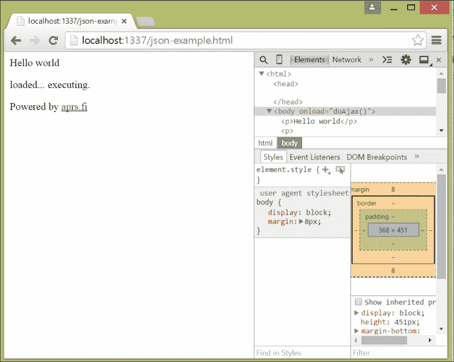

# 第三章：使用 JSON 的简单 AJAX 应用程序

在本章中，我们将探讨 JSON 在提供比旧网页更好的响应性的异步 JavaScript 和 XML（AJAX）应用程序中所扮演的角色，这些应用程序通过动态按需加载网页的片段来实现。

在本章中，您将找到以下食谱：

+   创建`XMLHttpRequest`对象

+   为数据发起异步请求

+   将 JSON 发送到你的 Web 服务器

+   使用 Node.js 接受 JSON

+   获取异步请求的进度

+   解析返回的 JSON

+   使用 Node.js 发起 Web 服务请求

# 引言

AJAX 是一组用于网络开发的客户端技术，用于创建异步网络应用程序——能够从不同的服务器获取内容的网络页面，一旦加载了基本内容。AJAX 中的“X”代表 XML，但今天的 AJAX 应用程序通常使用 JSON 来封装客户端和服务器之间的数据。

AJAX 的基础组件实际上 quite old，可以追溯到 1998 年由 Microsoft 在 Internet Explorer 中引入的 ActiveX 组件。

然而，这项技术实际上在 2005 年得到了广泛的应用，当时*杰西·加勒特*（Jesse Garrett）撰写了一篇题为《Ajax:一种新的网络应用程序方法》的文章。2006 年 4 月，万维网联盟发布了`XMLHttpRequest`对象的第一个草案标准，这是当今所有现代浏览器中所有 AJAX 应用程序的底层对象。

在本章中，我们将构建一个简单的 AJAX 应用程序，该程序通过**自动数据包报告系统**（**APRS**）网络返回一个业余无线电台报告的纬度和经度，这些数据由[`www.aprs.fi/`](http://www.aprs.fi/)网站进行缓存，这是一个在业余无线电台社区中广受欢迎的网站。我们将使用 HTML 和 JavaScript 为 Google Chrome 和 Internet Explorer 构建客户端，并使用 Node.js 构建服务器端。

### 提示

首先，请确保你按照第二章，*在服务器上读写 JSON*，中的*使用 Node.js 读写 JSON*部分安装了 Node.js。你还需要安装 Node.js 的 request 模块。在安装 Node.js 后，通过命令提示符运行`npm install request`来实现。

## 设置服务器

我们将从一个骨架服务器开始。为你的 node 应用程序创建一个目录，并将以下内容保存到`json-encoder.js`中：

```js
var http = require('http');
var fs = require('fs');
var url = require('url');

http.createServer(function(req, res) {
if (req.method == 'POST') {
  console.log('POST');
  var body = '';
  req.on('data', function(data) {
    body += data;
  });
  req.on('end', function() {     
    res.writeHead(200, 
     {'Content-Type': 'application/json'});
    res.end("null");
    });
  } 
  elseif (req.method == 'GET')
  {
    console.log('GET');
    var urlParts = url.parse(req.url);
    if (urlParts.pathname == "/favicon.ico")
    {
      res.end("");
      return;
    }

    res.writeHead(200, {'Content-Type': 'text/plain'});

    var html = fs.readFileSync('./public' + urlParts.pathname);
    res.writeHead(200, {'Content-Type': 'text/html'});
    res.end(html); 
    return;    
  }
}).listen(1337, 'localhost');
console.log('Server running at http://127.0.0.1:1337');
```

这段代码处理两种 HTTP 请求：`POST` 请求和 `GET` 请求。它首先分配了 `http`、`filesystem` 和 `url` 操作对象，然后在本地的 `1337` 端口上注册了一个 HTTP 服务器。它的服务器根据请求类型进行切换。对于 `POST` 请求，它目前返回一个空的 JSON 体，忽略其传入的内容。对于 `GET` 请求，它尝试从当前工作目录下面的 `public` 子目录中加载 URL 指示的文件，并将其作为 HTML 文档返回给客户端。如果传入的请求是针对 favicon 的，它将忽略该请求。

这个服务器很原始但足以满足我们的需求。如果你对学习更多关于 Node.js 的内容感兴趣，你可能会想为以下目的扩展它：

+   正确确定返回文档的 MIME 类型，并根据文档的 MIME 类型发送适当的 `Content-Type` 头部。

+   如果找不到给定的文档，不要抛出异常并杀死服务器，而是返回一个 404 页面未找到错误。

我们将在本章中扩展服务器端的 JavaScript。

## 设置客户端页面

在 `json-encoder.js` 中创建一个子目录，并将其命名为 `public`。在这个目录中，创建一个包含以下 HTML 的 HTML 文件，并将其命名为 `json-example.html`：

```js
<!DOCTYPE html>
<html>
<head>

</head>
<body onload="doAjax()">

<p>Hello world</p>
<p>
<div id="debug"></div>
</p>
<p>
<div id="json"></div>
</p>
<p>
<div id="result"></div>
</p>

<p>Powered by <a href="http://www.aprs.fi">aprs.fi</a></p>

<script type="text/javascript">
var debug = document.getElementById('debug');

function doAjax() {
  document.getElementById("result").innerHTML = 
    "loaded... executing.";
}
</script>
</body>
</html>
```

这是一个包含三个 `div` 标签的简单 HTML 文档，我们将从异步请求中填充这些标签的数据：`debug` 用于显示调试信息；`json` 用于显示原始 JSON；`result` 用于显示实际结果，这将显示从解析 JSON 的 JavaScript 对象中获取的格式化数据。页面底部有一个脚本 `doAjax`，浏览器在加载所有 HTML 后通过 `body` 标签的 `onload` 属性调用它。

在 Chrome 中使用开发者工具激活加载网页，你应该看到类似这样的内容：



我们将在本章中扩展 HTML。

# 创建 XMLHttpRequest 对象

所有现代网络浏览器都提供了一个 `XMLHttpRequest` 类，你可以在代码中实例化它，你可以使用它发出异步调用以通过 HTTP 获取内容。你将在客户端的 JavaScript 中使用 `new` 操作符创建一个或多个这样的实例。

## 如何进行...

你希望在 JavaScript 页面加载后尽早创建这个类的实例，如下面的代码所示：

```js
function doAjax() {
var xmlhttp;
if (window.XMLHttpRequest)
  {
    // code for IE7+, Firefox, Chrome, Opera, Safari
    xmlhttp=new XMLHttpRequest();
  }
}
```

## 它是如何工作的…

上述代码测试了根级别的 JavaScript `window` 对象是否具有 `XMLHttpRequest` 类，如果浏览器定义了该类，则为我们创建了该类的实例，以便在制作异步请求时使用。

## 参见

如果你正在使用一个非常旧的 Internet Explorer 版本，你可能需要使用一个 `Microsoft.XMLHTTP` ActiveX 对象。在这种情况下，`window.XMLHttpRequest` 的测试将失败。

# 制作数据异步请求

您使用创建的`XMLHttpRequest`类的实例来请求数据。您可以使用任何 HTTP 方法来请求数据；通常您会使用 GET 或 POST。GET 很好，如果您不需要传递任何参数，或者如果参数已编码在服务 URL 中；POST 是必要的，如果您需要将 JSON 作为服务器端脚本的参数提交给服务器。

## 如何做到...

继续增强我们的客户端页面脚本`doAjax`函数，以下是如何发起异步请求，修改之前的示例：

```js
function doAjax() {
  var xmlhttp;
  if (window.XMLHttpRequest)
  {
    // code for IE7+, Firefox, Chrome, Opera, Safari
    xmlhttp=newXMLHttpRequest();

    xmlhttp.open("POST","/", true);
    xmlhttp.send("");
  }
}
```

## 它是如何工作的…

`XMLHttpRequest`类有两个用于发起请求的方法：`open`和`send`。您使用`open`方法来开始发出请求的过程，如果需要发送数据（例如，与`POST`请求一起）供服务器处理，则使用`send`方法。

`open`方法接受三个参数：HTTP 方法、URL（相对于包含脚本的页面）和一个布尔值，指示请求是否应为同步（由值`false`表示）或异步（由值`true`表示）。在前面的代码中，我们向 web 服务器的根提交了一个`POST`请求，并请求浏览器以异步方式处理请求，因此页面将被渲染，用户可以与页面交互。

`send`方法接受一个参数，一个包含您希望发送给服务器的数据的字符串。在这个例子中，我们不发送任何东西；我们将使用这个方法来发送我们的参数的 JSON。

## 也见

这个菜谱与下一个菜谱*向你的 web 服务器发送 JSON*非常相关，我们在其中实际上创建了一个 JavaScript 对象，将其字符串化，并使用`send`方法发送它。

# 向你的 web 服务器发送 JSON

有些 AJAX 请求只需要从 URL 获取数据。这种情况下，服务器为所有客户端更新一个对象，或者当一个对象的 URL 唯一地标识该对象时（在设计使用**代表性状态转移**（**REST**）的服务时很常见）。其他时候，您可能希望将 JavaScript 数据传递给服务器，例如当您有一个复杂的查询需要服务器处理时。为此，创建您的 JavaScript 对象，然后将其字符串化，并将包含 JSON 的字符串传递给`XMLHttpRequest`对象的`send`方法。

## 如何做到...

省略创建`XMLHttpRequest`对象的代码，您使用以下代码向服务器发送 JSON：

```js
function doAjax() {
  // … create XMLHTTPObject as before

    var request = { 
    call: "kf6gpe-7"
  };

xmlhttp.open("POST","/", true);
xmlhttp.setRequestHeader("Content-Type","application/json");
xmlhttp.send(JSON.stringify(request));
}
```

请注意，我们这里使用了一个 HTTP `POST`请求，它将 JSON 文档作为 HTTP 对象主体提交给服务器。

## 它是如何工作的…

这段代码创建了一个具有单个字段：call 的 JavaScript 对象请求。call 字段的值设置为我们寻找的车站，服务器在处理请求时会使用它。

当你向服务器传递数据时，你应该正确设置 Content-Type 头，HTTP 使用这个头来指示服务器正在传输的数据类型。JSON 的 MIME 类型是 application/json；然而，一些网络应用程序开发者选择了其他表示形式，如`text/x-json`、`text/x-javascript`、`text/javascript`或`application/x-javascript`。除非你有充分的理由（想想服务器上无法修复的遗留代码），否则你应该使用`application/json`。你通过使用`setRequestHeader`方法设置一个请求头来自定义内容类型。这个方法有两个参数：要设置的头的名称及其值。请注意，头名称是大小写敏感的！

一旦设置了请求头，最后要做的就是调用`send`并传递字符串化的 JavaScript 对象。我们在前面的示例的最后一行这样做。

# 使用 Node.js 接受 JSON

不同的网络服务器系统以不同的方式接受客户端提交的数据。话说回来，在大多数情况下，你按片读取来自客户端的数据，一旦 POST 请求完成，就将其作为一批数据处理。以下是使用 Node.js 进行处理的方法。

## 如何做到这一点...

在我们的案例中，我们通过 HTTP `POST`请求接受客户端提交的 JSON。为此，我们需要从客户端读取数据，将其汇总成字符串，当所有数据到达服务器时，将数据从 JSON 字符串转换为 JavaScript 对象。在 json-encoder.js 中，我们将其修改为如下所示：

```js
 // … beginning of script is the same as in the introduction
    if (req.method == 'POST') {
 console.log('POST');
 var body = '';
 req.on('data', function(data) {
 body += data;
 });
 req.on('end', function() { 
 var json = JSON.parse(body);
 json.result = 'OK';
 res.writeHead(200, 
 {'Content-Type': 'application/json'});

 res.end(JSON.stringify(json));
 });
  }
  // and script continues with the GET if statement and code
```

## 它是如何工作的…

前面的代码扩展了本章介绍中的服务器端 Node.js 脚本。这段代码首先检查`POST`请求方法。如果我们收到一个`POST`请求，我们创建一个空字符串`body`来包含请求的主体。Node.js 是事件驱动的；为了从`POST`请求中读取数据，我们向请求添加了一个`'data'`事件处理程序，该处理程序将新读取的数据连接到变量`body`所引用的值。

在某个时刻，`POST`请求结束，这导致请求引发`'end'`事件。我们为这个事件注册一个事件处理程序，该处理程序使用`JSON.parse`解析传入的 JSON。然后，我们在结果对象中设置一个额外的字段，即结果字段，并将其值设为**'** `OK`**'**。最后，我们使用`writeHead`和`end`方法分别设置内容类型头和向客户端写入代表该对象的 JSON。

## 也请参阅

如引言中所建议，你如何在服务器上读取已提交的数据很大程度上取决于服务器环境和服务器端脚本语言。如果你以前没做过这件事，去一个搜索引擎，比如 Bing 或 Google，是很有必要的。一旦你这样做，准备好取出的字符串数据，并在你的服务器端脚本语言中使用其中一个食谱将其转换为对象，这个食谱来自第二章，*阅读和编写服务器端的 JSON*。

# 获取异步请求的进度

我们的请求相当轻量级，但这种情况在你的应用程序中并不总是如此。此外，在移动网络应用程序中，特别是在移动设备可能进入和退出网络覆盖并遭受暂时性网络中断时，进度的监控尤为重要。一个健壮的应用程序将测试进度状态和错误，并重试重要的请求。

`XMLHttpRequest`对象提供了事件，用于通知你有关待处理请求的进度。这些事件如下：

+   `load`: 此事件在你打开一个连接后立即执行。

+   `loadstart`: 此事件在加载开始时执行。

+   `progress`: 此事件在加载过程中定期执行。

+   `error`: 在发生网络错误的情况下执行此事件。

+   `abort`: 在网络交易被取消的情况下执行此事件（例如，用户导航离开发出请求的页面）。

## 如何实现...

对于这些事件中的每一个，你都希望注册一个以某种方式处理事件的函数。例如，`error`处理程序应该通知用户发生了错误，而`abort`处理程序应该在请求被放弃的情况下清理任何客户端数据。

以下是一个如何实现此功能的示例，它报告了这些事件的调试信息；这将是我们的示例 HTML 文件底部`<script>`标签中的内容：

```js
// Add the following functions to the script in the HTML…
function progress(evt){
  debug.innerHTML += "'progress' called...<...<br/>";/>";
}

function abort(evt){
  debug.innerHTML += "'abort' called...<br />";
}

function error(evt){
  debug.innerHTML += "'error' called...<br />";
}

function load(evt){
  debug.innerHTML += "'load' called...<br />";
}

function loadstart(evt){
  debug.innerHTML += "'loadstart' called<br />;
}

function doAjax() {
  // create xmlhttp object as usual

  var request = { 
    call: "kf6gpe-7"
  };

 xmlhttp.addEventListener("loadstart", loadstart, false);
 xmlhttp.addEventListener("progress", progress, false); 
 xmlhttp.addEventListener("load", load, false);
 xmlhttp.addEventListener("abort", abort, false);
 xmlhttp.addEventListener("error", error, false);

  // issue request in the usual way…
}
```

## 如何工作...

`XMLHttpRequest`对象提供了`addEventListener`方法，你可以用它来注册对象在特定事件发生时应该调用的函数。向这个方法传递事件名称、要在事件上执行的函数（或闭包）以及是否应该捕获事件（通常不捕获）的布尔值。在前面的示例中，我们对每个事件调用该方法，传递我们编写来处理事件的函数。我们的每个函数只是记录了事件在 HTML 内容中的 debug div 中已接收的事实。

## 还有更多...

`XMLHttpResult`对象定义了一个属性`onreadystatechange`，你可以向其分配一个函数，该对象在请求运行期间会定期调用此函数。下一个食谱，《解析返回的 JSON》描述了如何使用此功能来监控请求的状态。

这些事件的行为在不同的浏览器之间以及浏览器版本之间都有所不同。例如，微软 Internet Explorer 的早期版本（版本 9 之前）根本不支持这些事件。如果你的网页应用程序要在多个浏览器上运行，特别是如果它们是不同版本的情况下，你应该采取最低公倍数的方法来处理这些事件。

## 另见

由于对这些事件的支持因浏览器和浏览器版本而异，因此在使用这些事件方面使用像 jQuery 或 AngularJS 这样的 JavaScript 框架确实很有帮助。这些框架抽象了特定的浏览器差异。第四章讨论了使用这些框架进行 AJAX 的方法。

请参阅第四章中的*使用 jQuery 和 AngularJS 获取异步请求的进度*和*使用 AngularJS 获取异步请求的进度*，了解响应这些事件的浏览器无关方法。

# 解析返回的 JSON 数据

一旦服务器返回结果，你需要一种方法从 `XMLHttpRequest` 对象中获取该结果，并将结果从字符串转换为 JavaScript 对象。

## 如何做到...

`XMLHttpRequest` 对象定义了 `onreadystatechange` 属性，你将一个函数分配给它，这个函数在整个请求的生命周期中定期被调用。以下是完整的 `doAjax` 函数，包括分配给这个属性的一个函数，用于监视请求的完成情况：

```js
function doAjax() {
  var xmlhttp;
  xmlhttp = new XMLHttpRequest();

  var request = { 
    call: "kf6gpe-7"
  };

  xmlhttp.addEventListener("loadstart", loadstart, false);
  xmlhttp.addEventListener("progress", progress, false);  
  xmlhttp.addEventListener("load", load, false);
  xmlhttp.addEventListener("abort", abort, false);
  xmlhttp.addEventListener("error", error, false);

 xmlhttp.onreadystatechange = function() {
 if (xmlhttp.readyState == 4 &&xmlhttp.status == 200)
 {
 var result = JSON.parse(xmlhttp.responseText);
 document.getElementById("json").innerHTML = 
 xmlhttp.responseText;
 document.getElementById("result").innerHTML = result.call + ":" 
+ result.lat + ", " + result.lng;
 }
 };

xmlhttp.open("POST","/", true);
xmlhttp.setRequestHeader("Content-type","application/json");
xmlhttp.send(JSON.stringify(request));
}
```

## 它是如何工作的…

在添加了各种事件监听器之后，我们将一个函数分配给 `onreadystatechange` 属性。每当请求对象的状态发生变化时，这个函数就会被调用；每次调用时，我们测试请求对象的 `readyState` 字段及其状态。`readyState` 字段表示请求的状态；我们关注的状态是 4，它表示请求已完成。一旦请求完成，我们可以在请求的 `status` 字段中找到请求的 HTTP 状态；HTTP 状态码 200 表示从服务器读取内容的成功状态。

一旦我们得到 `readyState` 4 和 HTTP 状态 200，我们定义了一个新变量 `result` 作为由服务器返回的 JSON 解析后的对象，该对象可从请求的 `responseText` 字段中获得。你可以随意处理结果对象；我们将 JSON 复制到 `jsondiv`，这样你就可以看到 JSON 并在创建 `resultdiv` 的内容时读取 JavaScript 对象的几个字段。

## 还有更多...

`XMLHttpRequest` 类定义了以下就绪状态：

+   0 表示请求尚未初始化

+   1 表示请求已设置

+   2 表示请求已发送

+   3 表示请求正在进行中

+   4 表示请求已完成

在实际应用中，你通常应该只使用最后一个值，并用事件进行其他进度报告。

HTTP 结果代码在 HTTP 请求的注释中定义，互联网 RFC 2616；您对此感兴趣的部分位于[`www.w3.org/Protocols/rfc2616/rfc2616-sec10.html`](http://www.w3.org/Protocols/rfc2616/rfc2616-sec10.html)。200 系列的结果表示事务成功；您如何处理其他通知将取决于您 Web 应用程序的业务逻辑。

最终的 Node.js 服务器看起来像这样：

```js
var http = require('http');
var fs = require('fs');
var url = require('url');
var request = require("request");

console.log("Starting");

http.createServer(function(req, res) {
  if (req.method == 'POST') {
    console.log('POST');
    var body = '';
    req.on('data', function(data) {
      body += data;
    });
    req.on('end', function() {         
      var json = JSON.parse(body);
      var apiKey = "<<key>>";
      var serviceUrl = "http://api.aprs.fi/api/get?name=" + 
      json.call + "&what=loc&apikey=" + apiKey + "&format=json"; 
      request(serviceUrl, function(error, response, body) {
        var bodyObject = JSON.parse(body);
        if (bodyObject.entries.length>0)
        {
          json.call = bodyObject.entries[0].name;
          json.lat = bodyObject.entries[0].lat;
          json.lng = bodyObject.entries[0].lng;
          json.result = "OK";
        }
        else
        {
          json.result = "ERROR";
        }
        res.writeHead(200, {'Content-Type': 'application/json'});
        res.end(JSON.stringify(json));
      });
    });
  } 
  elseif (req.method == 'GET') 
  {
    console.log('GET');
    var urlParts = url.parse(req.url);
    if (urlParts.pathname == "/favicon.ico")
    {
      res.end("");
      return;
    }
    res.writeHead(200, {'Content-Type': 'text/plain'});
    var html = fs.readFileSync('./public' + urlParts.pathname);
    res.writeHead(200, {'Content-Type': 'text/html'});
    res.end(html); 
    return;    
  }
}).listen(1337, 'localhost');
console.log('Server running at http://localhost:1337');
```

# 使用 Node.js 发出 Web 服务请求

到目前为止，我们的服务器对`POST`请求的响应不做太多事情；它所做的就是返回“OK”并将客户端的 JSON 返回给客户端。通常，您的服务器需要对您提供的 JSON 做些事情，例如，进行 Web 或数据库查询，或者执行计算。我们的示例查询位于[`www.aprs.fi/`](http://www.aprs.fi/)的 Web 服务 JSON 端点，让您了解如何使用 Node.js 进行服务器到服务器的 Web 服务请求。

## 准备

如果您想亲自运行示例，首先需要去[`www.aprs.fi`](http://www.aprs.fi)注册一个账户，并获得一个 API 密钥。按照页面上的链接进行操作，并将随后的示例中的文本`"—key-"`替换为您的 API 密钥。

## 如何做到...

我们的 Node.js 代码将构建一个包含我们感兴趣的车站标识符和我们的 API 密钥的 URL，并代表客户端发出额外的 HTTP 请求。它看起来像这样：

```js
var request = require('server');

///...

if (req.method == 'POST') {
  console.log('POST');
  var body = '';
  req.on('data', function(data) {
    body += data;
  });
  req.on('end', function() {     
     var json = JSON.parse(body);
 var apiKey = "—key-";
 var serviceUrl = "http://api.aprs.fi/api/get?name=" + 
 json.call + 
 "&what=loc&apikey=" + apiKey + 
 "&format=json";

 request(serviceUrl, function(error, response, body) {
 var bodyObject = JSON.parse(body);
 if (bodyObject.entries.length>0)
 {
 json.call = bodyObject.entries[0].name;
 json.lat = bodyObject.entries[0].lat;
 json.lng = bodyObject.entries[0].lng;
 json.result = "OK";
 }
 else
 {
 json.result = "ERROR";
        }
        res.writeHead(200, 
          {'Content-Type': 'application/json'});

        res.end(JSON.stringify(json));
      });
    });
  } 
  elseif (req.method == 'GET')
  {
    // …Original GET handling code here…
  }
}).listen(1337, 'localhost');
console.log('Server running at http://127.0.0.1:1337');
```

## 它是如何工作的…

在将客户端 JSON 转换为 JavaScript 对象后，代码创建了一个包含请求车站标识符、API 密钥以及我们想要为结果获取 JSON 的 Web 请求 URL。然后我们使用`request`方法向该 URL 发出简单的`GET`请求，并传递一个 Node.js 将在请求成功时调用的函数。

Node.js 用错误指示器、包含 HTTP 响应详情的响应对象以及请求返回的正文调用我们的回调函数。在此示例中，我们假设成功以节省篇幅，并使用`JSON.parse`将结果正文从 JSON 转换为 JavaScript 对象。结果对象是一个类似于您在*介绍*部分看到的第一章，*在客户端读写 JSON*中的 JavaScript 对象。它有一个 entries 数组，有零个或多个记录，指示记录中的`lat`和`lng`字段中每个车站的位置。我们提取返回的第一个结果并将相关数据复制到我们将返回给原始客户端的 JavaScript 对象中。

## 还有更多...

大多数服务器端框架提供了各种修改 Web 服务请求语义的方法，包括指定头部和发出请求时使用的 HTTP 方法。Node.js 的请求模块也不例外。

首先，请求方法可以接受一个 JavaScript 对象，而不是一个 URL，其中有多个字段允许您自定义请求。如果您传递一个对象，您应该将请求应发送到的 URL 放在 URI 或 URL 属性中。您还可以指定以下内容：

+   要使用的 HTTP 方法，通过 method 参数传入

+   要发送的 HTTP 头，作为具有每个头属性-值对的 JavaScript 对象，在 attribute headers 中传入每个头

+   对于`PATCH`、`POST`和`PUT`方法请求，要传递给客户端的正文，在 body 属性中传入

+   超时时间，在超时属性中以毫秒为单位表示等待多长时间

+   是否对响应进行 gzip 压缩，通过设置 gzip 属性为`true`来指示

还有其他选项可供选择。详情请参阅 Node.js 文档，网址为[`nodejs.org/api/index.html`](https://nodejs.org/api/index.html)。

## 另见

Node.js 请求模块的文档在 GitHub 上，网址为[`github.com/request/request`](https://github.com/request/request)
