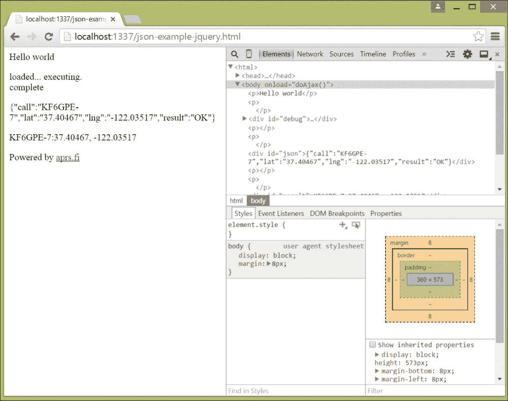
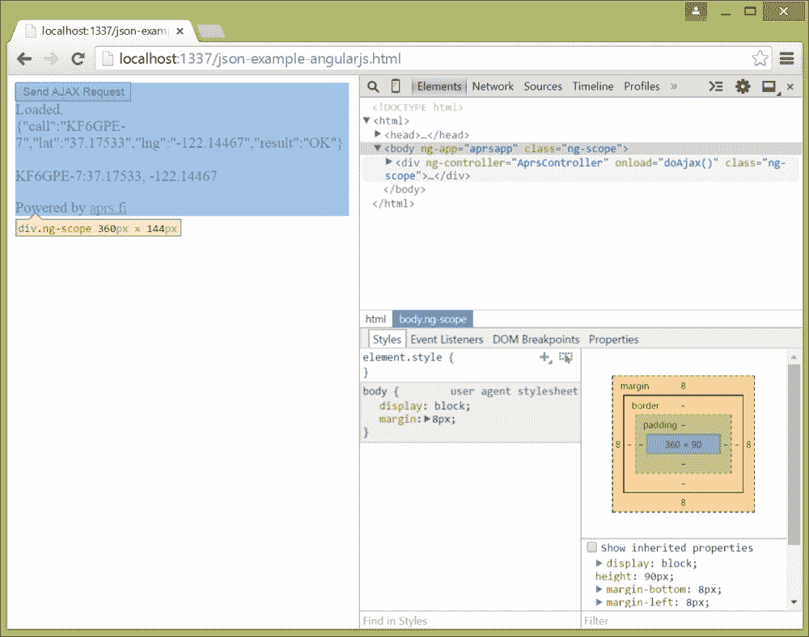

# 第四章．使用 jQuery 和 AngularJS 在 AJAX 应用程序中使用 JSON

在本章中，我们将探讨 JSON 在提供比旧网页更好的响应性的异步 JavaScript 和 XML（AJAX）应用程序中所起的作用。在本章中，您将找到以下食谱：

+   在您的网页中添加 jQuery 依赖关系

+   使用 jQuery 请求 JSON 内容

+   使用 jQuery 将 JSON 发送到您的网络服务器

+   使用 jQuery 获取请求的进度

+   使用 jQuery 解析返回的 JSON

+   在您的网页中添加 AngularJS 依赖关系

+   使用 AngularJS 请求 JSON 内容

+   使用 AngularJS 将 JSON 发送到您的网络服务器

+   使用 AngularJS 获取请求的进度

+   使用 AngularJS 解析返回的 JSON

# 简介

在上一章中，您看到了展示如何使用`XMLHttpRequest`来制作交换 JSON 的 AJAX 请求的食谱。在实际中，处理不同浏览器中的所有特殊情况使得这项工作变得繁琐且容易出错。幸运的是，大多数客户端 JavaScript 框架为您包装了这个对象，为您提供了一种与浏览器无关的方法来做同样的事情。通常，这个界面也更容易使用——正如您即将看到的，在 AngularJS 的情况下，您不需要做任何特别的事情就可以使用 JSON 在对象之间移动；该框架甚至为您处理 JSON 的序列化和反序列化！

both AngularJS 和 jQuery 都是使开发网络应用程序更简单的客户端 JavaScript 框架。jQuery 是第一个也是最受欢迎的框架之一；AngularJS 是较新的，并且具有提供使用**模型-视图-控制器**（**MVC**）范式的额外优势，使您的代码结构更加清晰。

### 提示

MVC 是一种设计模式，可以追溯到几十年以前，最初是在 20 世纪 70 年代的 Smalltalk 中引入的。这种模式将您的代码分为三个不同的部分：模型，包含用户想要操作的数据；视图，显示模型的内容；控制器，接受事件并在接受的事件发生时更改模型。

在本章中，我们将使用我们在上一章的食谱中基于的 Node.js 服务器，并扩展支持提供客户端 JavaScript 以及 HTML。以下是本节的代码，逐步分解如下：

```js
var http = require('http');
var fs = require('fs');
var url = require('url');
var request = require("request");
```

这四行包括了我们的服务器需要的接口——处理 HTTP 服务器模块、文件系统模块、URL 解析模块以及一个简单的模块来发送 HTTP 请求。

接下来，我们记录服务器启动的情况，并创建一个 HTTP 服务器，它用一个函数回调接受所有请求：

```js
console.log("Starting");
http.createServer(function(req, res) {
```

我们的服务器处理两种类型的请求：`POST`请求和`GET`请求。`POST`请求处理程序需要读取被发送到服务器的传入数据，我们通过将其与一个最初为空的`body`缓冲区连接起来来实现：

```js
  if (req.method == 'POST') {
    console.log('POST');
    var body = '';
    req.on('data', function(data) {
      body += data;
    });
```

我们注册了一个函数，当 Node.js 完成 HTTP POST 请求时会调用它，该函数解析 JSON 并对远程服务器发起`GET`请求以获取我们的数据，模拟中间件服务器可能会执行的操作：

```js
    req.on('end', function() {         
      var json = JSON.parse(body);

      var apiKey = " --- api key here --- ";
      var serviceUrl = "http://api.aprs.fi/api/get?name=" + 
        json.call + "&what=loc&apikey=" + apiKey + "&format=json";
```

这个请求本身有一个回调，它解析来自远程服务器的传入 JSON，在结果条目属性中查找数组的第一个元素，并构造一个 JSON 对象以返回给 Web 客户端。如果我们没有得到有效的响应，我们设置一个错误值，以便客户端可以对错误做些什么。我们通过将 JavaScript 对象转换为 JSON 并将其写入客户端来返回这个：

```js
      request(serviceUrl, function(error, response, body) {
        var bodyObject = JSON.parse(body);
        if (bodyObject.entries.length>0)
        {
          json.call = bodyObject.entries[0].name;
          json.lat = bodyObject.entries[0].lat;
          json.lng = bodyObject.entries[0].lng;
          json.result = "OK";
        }
        else
        {
          json.result = "ERROR";
        }
        res.writeHead(200, {'Content-Type': 'application/json'});
        res.end(JSON.stringify(json));
      });
    });
  } 
```

如果我们处理的不是`POST`请求，那它可能是一个`GET`请求。以下是上一章的新代码。我们需要确定传入的 URL 是否表示要获取的内容是 HTML 文件（其扩展名为`.html`或`.htm`）还是 JavaScript 文件（其扩展名为`.js`）。首先，我们检查是否正在请求一个 favicon；Chrome 总是这样做，我们只是返回一个空的对象体。假设请求的不是 favicon，我们检查传入的 URL 如何结束，以便我们可以写出适当的内容类型头（text/html 或 application/json）。如果不是这些，我们假设是纯文本，并发送一个 text/plain 内容类型头：

```js
  else if (req.method == 'GET') 
  {
    console.log('GET');
    var urlParts = url.parse(req.url);
    if (urlParts.pathname == "/favicon.ico")
    {
      res.end("");
      return;
    }

    if (urlParts.pathname.lastIndexOf(".html") == 
          urlParts.pathname.length - 5 ||
        urlParts.pathname.lastIndexOf(".htm") == 
          urlParts.pathname.length - 4)
    {
      res.writeHead(200, {'Content-Type': 'text/html'});
    }
    else if (urlParts.pathname.lastIndexOf(".js") == 
      urlParts.pathname.length - 3)
    {
      res.writeHead(200, {'Content-Type': 'application/json'});
    }
    else
    {
      res.writeHead(200, {'Content-Type': 'text/plain'});            
    }
```

接下来，我们从 Node.js 服务器源下面的公共目录中读取内容并返回给客户端：

```js
    var c = fs.readFileSync('./public' + urlParts.pathname);
    res.end(c); 
    return;    
  }
```

最后，这个大函数作为监听 HTTP 服务器注册在本地主机的端`1337`上，我们记录服务器已启动：

```js
}).listen(1337, 'localhost');
console.log('Server running at http://localhost:1337');
```

### 提示

一个真正的服务器可能不应该通过查看传入的 URL 来猜测返回数据的 MIME 类型，而应该实际上嗅探出去的数据并做出关于 MIME 类型的决定。有一个 Node.js 模块 magic 可以做到这一点；如果您稍微不那么偏执，可以使用磁盘上的文件名后缀，并希望内容提供商正确地命名文件。

这就是服务器的内容，您可以在随书附带的样本 ZIP 文件中找到它。

# 向您的网页添加 jQuery 依赖

jQuery 是一个流行的客户端框架，用于 AJAX 应用程序，它为您提供了浏览器无关的支持，用于搜索和操作**文档对象模型**（**DOM**）和**层叠样式表**（**CSS**），执行 AJAX 查询，以及包括几个可以使用 CSS 样式的 HTML 控件。您需要在您的页面中包含 jQuery 的源代码，要么通过指向 jQuery 内容分发网络（CDN）上的发布版本，要么通过访问[`www.jquery.com`](http://www.jquery.com)并下载框架的副本，以便与您自己的应用程序一起使用。

## 如何做到这一点...

您需要通过开始一个新的 json-example.html 文件来包含 jQuery 库，像这样：

```js
<!doctype HTML>
<html>
<head>
  <script type="text/javascript"
    src="img/jquery-1.11.2.min.js"></script>
</head>
```

## 它是如何工作的…

这两行包含了两个包含从 jquery.com CDN 获取的 jQuery 客户端库压缩版本的脚本。这可能正是你在生产应用程序中想要做的事情；压缩的 jQuery 实现比完整的库要小，所以客户端下载更快，使用 CDN 上的版本提供的性能可能比你自己能提供的性能还要快，除非你在像 Amazon Web Services 或 Microsoft Azure 这样的主要云服务提供商上托管多个服务器。

## 还有更多…

如果你不想包含压缩版本——这通常在你深入开发周期并希望调试代码时发生——你可以从你的服务器上提供标准版本。只需从[`www.jquery.com/`](http://www.jquery.com/)下载必要的文件，并从你的服务器上提供它们。

jQuery 有两个版本：1.x 版本，支持较老的浏览器，包括 Microsoft Internet Explorer 6 及以上版本，而 2.x 版本至少需要 Microsoft Internet Explorer 9。我们的示例将使用 jQuery 1.x，但不用担心；我们讨论的 API 在 jQuery 2.x 中也是一样的。

## 参见

前往[`www.jquery.com`](http://www.jquery.com)下载 jQuery 或了解更多关于它的信息。如果你正在寻找一个 JavaScript 框架，也许值得查看 jQuery 学习中心在[`learn.jquery.com/`](http://learn.jquery.com/)的内容，或者也许可以看看 Packt Publishing 的书籍，《学习 jQuery – 第四版》，作者是 Jonathan Chaffer 和 Karl Swedberg。

# 使用 jQuery 请求 JSON 内容

jQuery 定义了变量`$`，暴露了你想要与界面做的所有方法的接口。（有一种方法可以重命名该变量，比如说如果你正在与其他使用相同变量的 JavaScript 环境一起工作，但我建议不要这样做）。`$`暴露的方法之一是`ajax`方法，你可以用它来发起 AJAX 查询。让我们来看看它是如何做到的。

## 如何做到…

这是一个整页的 AJAX 请求。AJAX 代码是粗体的：

```js
<!doctype HTML>
<html>
<head>
<script  type="text/javascript"
  src="img/"></script>
</head>
<body>

<p>Hello world</p>
<p>
  <div id="debug"></div>
</p>
<p>
  <div id="json"></div>
</p>
<p>
  <div id="result"></div>
</p>

<p>Powered by <a href="http://www.aprs.fi">aprs.fi</a></p>

<script>
$(function () {
 $('#debug').html("loaded... executing.");

 var request = { 
 call: "kf6gpe-7"
 };

 $.ajax({
 type: "POST",
 url: "/",
 dataType:"json"  });
});

</script>
</body>
</html>
```

这个例子中的 HTML 很简单。它包含了 jQuery 模块，然后为 AJAX 请求定义了三个`div`区域，在请求完成后更新。让我们更详细地看看 JavaScript 函数`doAjax`。

## 它是如何工作的…

`doAjax`函数，在页面加载完成后调用，首先将名为`debug`的`div`的 HTML 内容设置为文本"`loaded… executing.`"。`$()`语法是 jQuery 用来在 DOM 中查找项目的语法；你可以通过在名称前加上`#`（哈希）符号来找到项目，就像 CSS 选择器一样。返回的值不是实际的 DOM 元素，而是一个包含简单方法如`html`以获取或设置项目 HTML 内容的 jQuery 类，该类包装了 DOM 元素。

接下来，我们定义一个 JSON 对象，其中包含我们请求的详细信息，就像前章的食谱中所做的那样。它有一个属性，`call`，包含我们感兴趣的站的呼号。

接下来，我们调用$的`ajax`方法，传递一个具有我们请求语义的 JavaScript 对象。它应该包含以下字段：

+   `type`字段，表示请求的 HTTP 方法（如`POST`或`GET`）。

+   `url`字段，表示请求应提交的 URL。

+   `data`字段，包含要发送到服务器的请求（如果有）的字符串数据。我们将在下一个食谱中看到它的使用。

+   `dataType`字段，表示你期望从服务器获得的数据类型；一个可选字段，可以是`xml`、`json`、`script`或`html`。

## 参见 also

好奇的读者应该查阅 jQuery `ajax`方法文档，该文档可在[`api.jquery.com/jQuery.ajax/`](http://api.jquery.com/jQuery.ajax/)找到。

# 使用 jQuery 将 JSON 发送到你的网络服务器

使用 jQuery 将 JSON 发送到你的服务器是很容易的。只需获取 JSON 格式的数据，并使用`ajax`方法参数的`data`字段指定它。

## 如何做到…

让我们再次看看`doAjax`，这次修改以发送我们的 JSON 请求：

```js
function doAjax() {
  $('#debug').html("loaded... executing.");

  var request = { 
    call: "kf6gpe-7"
  };

  $.ajax({
    type: "POST",
    url: "/",
    data: JSON.stringify(request),
    dataType:"json"
  });
}

</script>
</body>
</html>
```

## 它是如何工作的…

上一列表中的魔法行被突出显示；它是传递给`ajax`方法的参数中的以下行：

```js
    data: JSON.stringify(request),
```

当然，我们使用`JSON.stringify`将 JavaScript 对象编码为 JSON，然后将其分配给 data 字段。

# 使用 jQuery 获取请求进度的方法

jQuery 以一种与平台无关的方式抽象化了底层`XMLHttpRequest`对象的各个进度报告机制，赋予您确定您的请求是否成功或失败的能力。您通过注册函数来实现，这些函数将在发生错误或结果成功加载时由 jQuery AJAX 处理程序调用。

## 如何做到…

下面是`doAjax`重写以支持在失败时获取通知的代码，无论事件成功还是失败：

```js
function doAjax() {
  $('#debug').html("loaded... executing.");

  var request = { 
    call: "kf6gpe-7"
  };

  $.ajax({
    type: "POST",
    url: "/",
    data: JSON.stringify(request),
    dataType:"json",
  })
 .fail(function() {
 $('#debug').append("<br/>failed");
 })
 .always(function() {
 $('#debug').append("<br/>complete");
 });
}
```

这里的新方法是`fail`和`always`方法。

## 它是如何工作的…

jQuery 使用一种称为*链式调用*的模式，其中大多数方法返回一个实例，您可以对该实例应用其他方法。因此，像`fail`和`always`这样的方法在同一个对象上操作，并返回相同的对象，该对象使用链式调用封装了`$.ajax`方法调用的返回值，使得代码更易读、更易写。在`$.ajax`的情况下，返回的是一个 jQuery `XMLHttpRequest`对象的实例，其字段是浏览器返回的`XMLHttpRequest`对象的超集。

在这里，我在`$.ajax`的返回值上设置了两个事件处理程序：一个是用于失败情况的，即请求因某些原因失败；另一个是用于始终情况的。请注意，由于链式调用的存在，我可以将这些处理程序颠倒过来，将始终情况的处理程序放在前面，将失败情况的处理程序放在后面。究竟哪个在前完全取决于你的个人喜好。

`always`和`failure`方法都接受一个函数，该函数可以接受多达三个参数。在这种情况下，我没有使用任何可用的参数，只是将一些文本添加到具有`id`为 debug 的`div`区域的 HTML 中。当请求成功完成时，jQuery 将`failure`事件处理程序传递给 jQuery `XMLHttpRequest`对象，以及与失败相关的文本状态消息和错误代码，而将`always`方法传递给错误情况下的这些参数，或者传递给数据、文本状态消息和 jQuery `XMLHttpRequest`对象。

## 还有更多…

如果你愿意，你可以在`$.ajax`的初始 JavaScript 对象参数的名为 error 的属性中指定失败事件处理程序作为一个函数。同样，你也可以在初始 JavaScript 对象的名为`complete`的属性中指定始终事件处理程序作为一个函数。虽然这样可以将在一个地方放置所有代码，但我个人认为这样更难读，因为缩进可能会很快变得难以控制。

# 使用 jQuery 解析返回的 JSON

最后，是时候看看如何从服务器获取返回的 JSON 并使用它了。你会通过在`$.ajax`上注册一个事件处理程序来接收结果的 JavaScript 对象，jQuery 会为你从 JSON 中很乐意地反序列化这个对象。

## 如何做到…

为了从 AJAX 请求中获取结果，我们需要在 jQuery `XMLHttpRequest`对象的`done`事件上添加一个事件处理程序，如下所示：

```js
function doAjax() {
  $('#debug').html("loaded... executing.");

  var request = { 
    call: "kf6gpe-7"
  };

  $.ajax({
    type: "POST",
    url: "/",
    data: JSON.stringify(request),
    dataType:"json",
  })
  .fail(function() {
    $('#debug').html( $('#debug').html() + "<br/>failed");
  })
  .always(function() {
    $('#debug').html( $('#debug').html() + "<br/>complete");
  })
 .done(function(result) {
 $('#json').html(JSON.stringify(result));
 $('#result').html(result.call + ":" + 
 result.lat + ", " + result.lng);
 });
}
```

## 它是如何工作的…

jQuery 在请求成功完成时调用`done`事件处理程序，并将结果数据作为参数传递。因为我们已经在对`$.ajax`的初始调用中指定了数据类型为`json`，jQuery 很乐意使用`JSON.parse`来解析返回值，并传递我们感兴趣的 JavaScript 对象，从而省去了我们自己的`parse`调用。

我们的`done`事件处理程序做两件事：它将对象的字符串化 JSON（由浏览器串行化，而不是服务器返回）放入 ID 为`json`的`div`字段中，并将结果`div`更新为从结果数据中获取的电台呼号、纬度和经度。这样我们就得到了一个看起来像这样的网页：



## 还有更多…

如果你愿意，可以通过将事件处理程序作为初始请求的`success`字段传递给`$.ajax`来注册事件处理程序。像`fail`和`always`一样，我更喜欢使用链式调用来显式设置它，因为我认为这样更易读。

# 向你的网页添加 AngularJS 依赖项

就像其他的 JavaScript 框架一样，您需要在您的 HTML 中包含 AngularJS。正如您在本节中将要看到的，为了设置还需要做一些其他不同的事情。首先，确保您创建了一个新的 HTML 文件，比如`json-example-angular.html`。

## 如何做到…

以下是我们的应用程序的完整 HTML：

```js
<!doctype HTML>
<html>
  <head>
  </head>

<body ng-app="aprsapp">
  <div ng-controller="AprsController">
    <button ng-click="doAjax()">Send AJAX Request</button>
    <div>{{debug}}</div>
    <div>{{json}}</div>
	 <br/>
        <div>{{message}}<div>
  </div>

  <p>Powered by <a href="http://www.aprs.fi">aprs.fi</a></p>
<script type="text/javascript"
src="img/angular.min.js"></script>
<script src="img/json-example-angularjs.js"></script>
</body>
</html>
```

让我们更仔细地看看这个 HTML，看看有什么不同。

## 它是如何工作的…

首先，请注意`body`标签具有`ng-app`属性，其设置为`aprsapp`。AngularJS 应用程序被赋予了定义好的名称，你在实现应用程序逻辑的 JavaScript 中引用这些名称。

接下来，请注意包含我们 UI 的`div`区域具有`ng-controller`属性，它标识了负责处理该 UI 部分事件的具体控制器模块。我们马上就会看到它是如何与 JavaScript 相链接的。在那个`div`中有其他`div`区域，其内容包含在双括号中，定义了一个文档模板，Angular.js 为您填充。这是 AngularJS 中的一个变量；在控制器加载时，HTML 中的这些变量将被控制器设置的内容所替换。每个都是一个*模型*，包含要显示的数据。

最后，我们需要包含 AngularJS 模块本身以及我们的 JavaScript。在使用 AngularJS 时，习惯上将您的应用程序的 JavaScript 保存在单独的文件中，因为这有助于您强制执行良好的应用程序外观（包含在您的 HTML 和 CSS 中）和实现（包含在您的 JavaScript 中）之间的分离。

现在，让我们看看我们页面的 JavaScript 骨架，我们将其放在`json-examnple-angular.js`文件中：

```js
var app = angular.module("aprsapp", []);

app.controller("AprsController", , ["$scope",
  function($scope) {
  $scope.json = "";
  $scope.message = "Loaded..."; 
}]);
```

这段代码定义了一个单独的 AngularJS 应用程序，名为`aprsapp`。请注意，这个名字必须与您 body 标签中`ng-app`属性的名称相匹配。代码然后为应用程序注册了一个控制器，名为`AprsController`。控制器是一个函数，至少有一个参数，即控制器的范围，您在那里定义您的数据模型和其他变量。在我们的控制器范围内，我们设置了两个模型的初始值：`json`和`message`。

## 参见 also

要开始使用 AngularJS，请查看其网站[`angularjs.org`](https://angularjs.org)，或者由*Rodrigo Branas*编写、*Packt Publishing*出版的*AngularJS Essentials*一书。

# 使用 AngularJS 请求 JSON 内容

Angular 定义了一个核心对象`$http`，您使用它对远程服务器进行 HTTP 请求。当你初始化它的时候，它会传递给你的控制器。

## 如何做到…

让我们扩展我们的控制器，以添加对`$http`对象的引用并使用它来发送请求：

```js
var app = angular.module("aprsapp", []);

app.controller("AprsController", ["$scope", "$http",
function($scope, $http) {
  $scope.json = "";
  $scope.message = "Loaded..."; 
  $scope.doAjax = function()
  {
    $scope.debug = "Fetching...";    
    $scope.json= "";
    $scope.message = "";

    var promise = $http({
      url: "/", 
      method: "POST",
    });
  };
}]);
```

在这里，我们在我们的范围内定义了一个函数`doAjax`，它将执行异步 HTTP 请求。它更新了我们的模型，使`debug`模型包含一个状态消息，而`json`和`message`模型为空字符串。让我们更详细地看看`$http`对象。

## 它是如何工作的…

查看控制器定义函数，你可以看到我们不仅传递了控制器的范围，还传递了`$http`对象。它定义了一个函数，接受一个参数，一个定义 HTTP 请求参数的 JavaScript 对象。在我们的示例中，我们通过将`method`字段设置为`POST`并将`url`字段设置为`/`，请求向服务器的根发送一个`POST`请求。

`$http`方法的参数可以包括这些属性：

+   `method`属性，指示要使用的 HTTP 方法。

+   `url`属性，指示方法应该发送到的 URL。

+   `params`属性是一个字符串或对象的映射，用于发送到服务器；如果值不是字符串，它将被编码为 JSON（关于这一点将在下一个食谱中详细介绍）；`params`属性被附加到 URL 上。

+   `data`属性，是要发送到远程服务器的数据。

+   `headers`属性，是一个要发送到远程服务器的标题和标题值的映射。

+   `timeout`属性，指示等待响应的时间长度。

`$http()`方法返回一个*承诺*，当你成功发送数据时，你会在这个对象上调用其他方法来注册事件处理程序来检测错误和处理数据。（我们将在食谱《使用 AngularJS 获取请求进度》和《使用 AngularJS 解析返回的 JSON》中进一步讨论承诺。）

## 还有更多...

`$http`对象还定义了单独的方法`get`、`post`、`put`、`delete`和`patch`，用于发出适当的 HTTP 请求。如果你愿意，你可以使用它们代替`$http()`方法，省略`method`属性。像`$http()`一样，它们都返回一个承诺。

## 参见

有关`$http()`方法和 AngularJS 对 AJAX 的支持的文档，请参阅[`docs.angularjs.org/api/ng/service/$http`](https://docs.angularjs.org/api/ng/service/$http)。

# 使用 AngularJS 向你的 Web 服务器发送 JSON

使用 AngularJS 发送 JSON 就像在`$http()`方法调用中提供`data`属性一样简单。AngularJS 甚至会为你编码对象为 JSON。

## 如何做到这一点...

像以前一样，我们将发起一个 AJAX 请求。这次，我们包含了一个`data`属性：

```js
var app = angular.module("aprsapp", []);

app.controller("AprsController", ["$scope", "$http",
function($scope, $http) {
  $scope.json = "";
  $scope.message = "Loaded..."; 
  $scope.doAjax = function()
  {
    $scope.debug = "Fetching...";    
    $scope.json= "";
    $scope.message = "";
 var request = { 
 call: "kf6gpe-7"
 };
    var promise = $http({
      url: "/", 
      method: "POST",
 data: request
    });
  };
}]);
```

## 它是如何工作的…

我们像过去例子中一样定义 JavaScript 对象请求，单个调用属性包含我们感兴趣的站的呼号。通过将这个值作为数据属性传递给`$http()`的参数，AngularJS 将对象转换为 JSON 并发送给服务器。

## 还有更多...

如果你使用`$http.post()`这样的方法，将数据作为第二个参数传递，像这样：

```js
$http.post("/", request);
```

你还可以通过第三个参数传递一个可选的配置参数。这样的配置对象将包含我在前一个食谱中描述的请求对象的属性。

# 使用 AngularJS 获取请求进度

`$http()`方法返回一个承诺，这是您确定请求状态的方式。它定义了方法，您可以将 JavaScript 函数传递给这些方法，当底层网络事务状态改变时，这些函数作为事件处理程序运行。

## 如何做到…

返回的承诺定义了`success`和`error`方法，这些方法需要事件处理程序。要使用它们，我们编写以下代码：

```js
var app = angular.module("aprsapp", []);

app.controller("AprsController", ["$scope", "$http",
function($scope, $http) {
  $scope.json = "";
  $scope.message = "Loaded..."; 
  $scope.doAjax = function()
  {
    $scope.debug = "Fetching...";    
    $scope.json= "";
    $scope.message = "";
    var request = { 
      call: "kf6gpe-7"
    };
    var promise = $http({
      url:"/", 
      method: "POST",
      data: request
    });
    promise.success(function(result, status, headers, config) {
      // handle success here
    });
    promise.error(function(data, status, headers, config) {
      alert("AJAX failed!");
    });
}]);
```

## 它是如何工作的…

在成功时，AngularJS 使用`success`方法调用您注册的承诺函数，并传递结果数据、HTTP 状态、HTTP 头和与请求关联的配置。在这里，您将处理网络事务的结果，我们将在下一个菜谱中更详细地讨论。在任何类型的失败时，AngularJS 都会调用您用`error`方法注册的回调，并传递相同的数据显示。

请注意`success`和`error`方法又返回了承诺，所以如果您愿意，可以链接这些请求。

# 使用 AngularJS 解析返回的 JSON

使用 AngularJS 处理返回的数据很容易，因为它为您解析返回的 JSON，并将结果对象传递给您注册的事件处理程序。

## 如何做到…

以下是我们的 AngularJS 应用程序完整的客户端代码。`success`承诺的回调只是用我们从结果中获取的对象字段更新模型：

```js
var app = angular.module("aprsapp", []);

app.controller("AprsController", function($scope, $http) {
  $scope.json = "";
  $scope.message = "Loaded..."; 
  $scope.doAjax = function()
  {
    $scope.debug = "Fetching...";    
    $scope.json= "";
    $scope.message = "";
    var request = { 
      call: "kf6gpe-7"
    };

    var promise = $http({
      url:"/", 
      method: "POST",
      data: request
    });
    promise.success(function(result, status, headers, config) {
      $scope.debug = "Loaded.";    
      $scope.json = result;
      $scope.message = result.call + ":" + result.lat + ", " + 
        result.lng;
    });
    promise.error(function(data, status, headers) {
      alert("AJAX failed!");
    });
}]);
```

## 它是如何工作的…

由于 AngularJS 处理 JSON 解析，因此在填充消息模型中的文本时，我们可以直接反引用的返回 JSON 中的值。注意，我们还可以将 JSON 模型分配给结果对象，当显示此对象时，它将显示结果对象本身的 JSON。

如果您在 Chrome 中加载 HTML 和 JavaScript 并按下调用`doAjax`的按钮，您应该会看到类似这样的内容：


