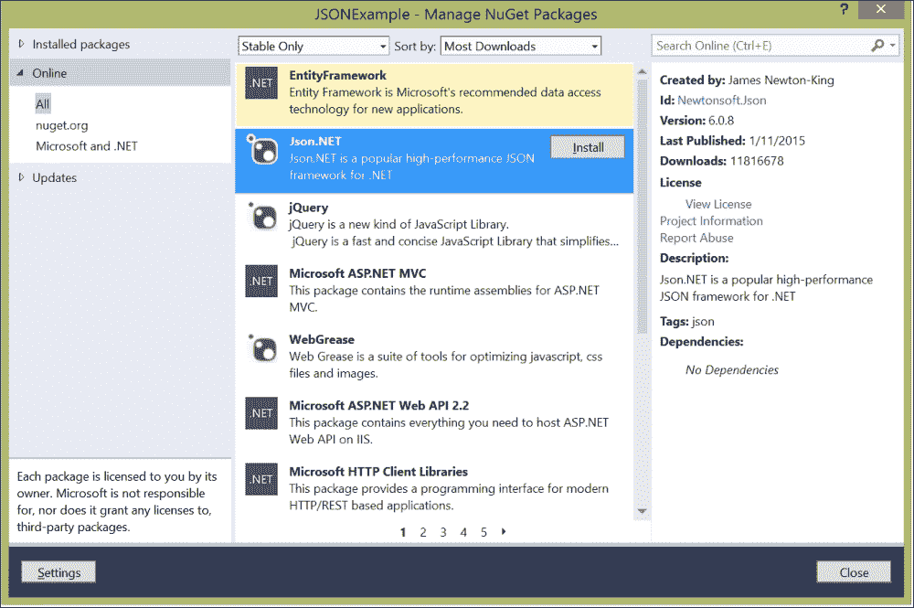
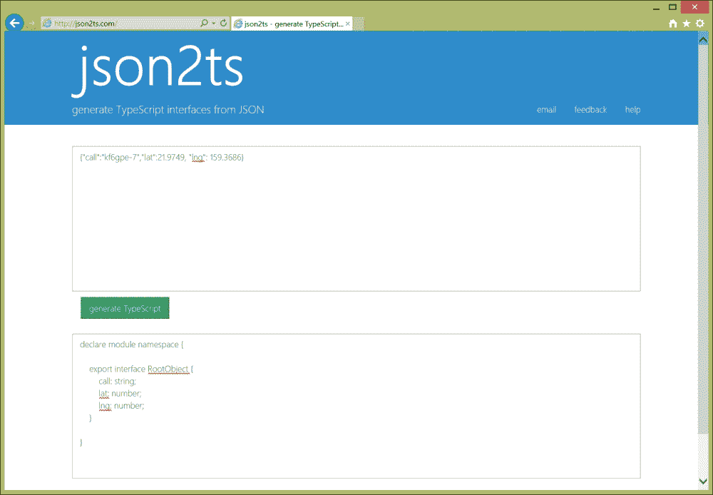

# 第七章．以类型安全的方式使用 JSON

在本章中，我们将在第一章，*在客户端读写 JSON*的食谱基础上，向您展示如何使用 C#、Java 和 TypeScript 在您的应用程序中使用强类型。您将找到以下食谱：

+   如何使用 Json.NET 反序列化对象

+   如何使用 Json.NET 处理日期和时间对象

+   如何使用 gson 为 Java 反序列化对象

+   如何使用 Node.js 与 TypeScript

+   如何使用 TypeScript 注解简单类型

+   如何使用 TypeScript 声明接口

+   如何使用 TypeScript 声明带有接口的类

+   使用 json2ts 从您的 JSON 生成 TypeScript 接口

# 简介

有些人说强类型是弱智的标志，但事实是，编程语言中的强类型可以帮助你避免一整类错误，其中你错误地假设一个对象实际上属于另一种类型。像 C#和 Java 这样的语言提供强类型正是出于这个原因。

幸运的是，C#和 Java 的 JSON 序列化器支持强类型，一旦您弄清楚了对象表示，只想将 JSON 映射到您已经定义的类的实例时，这尤其方便。在第一章中，*在客户端读写 JSON*，您看到了如何将 C#或 Java 类转换为 JSON，以及如何将 JSON 转换为未命名的对象；在本章中，我们使用 Json.NET 对 C#和 gson 对 Java 将 JSON 转换为您应用程序中定义的类的实例。

最后，我们来看看 TypeScript，这是 JavaScript 的一个扩展，提供了类型在编译时的检查，编译成普通的 JavaScript 以供与 Node.js 和浏览器一起使用。我们将查看如何为 Node.js 安装 TypeScript 编译器，如何使用 TypeScript 注解类型和接口，以及如何使用 Timmy Kokke 的网页自动从 JSON 对象生成 TypeScript 接口。

# 如何使用 Json.NET 反序列化对象

在本食谱中，我们将向您展示如何使用 Newtonsoft 的 Json.NET 将 JSON 反序列化为类的实例。我们将使用 Json.NET，这是我们在第一章，*在客户端读写 JSON*中提到的，因为尽管这适用于现有的.NET JSON 序列化器，但我还想要您了解关于 Json.NET 的其他内容，我们将在接下来的两个食谱中讨论。

## 准备阶段

首先，您需要确保您的项目中有一个对 Json.NET 的引用。最简单的方法是使用 NuGet；启动 NuGet，搜索 Json.NET，然后点击**安装**，如下面的屏幕截图所示：



你还需要在需要这些类的任何文件中，在文件的顶部使用`using`指令引用`Newonsoft.Json`命名空间：

```js
usingNewtonsoft.Json;
```

## 如何做到…

下面是一个示例，提供了简单类的实现，将 JSON 字符串转换为此类的实例，然后将实例转换回 JSON：

```js
using System;
usingNewtonsoft.Json;

namespaceJSONExample
{

  public class Record
  {
    public string call;
    public double lat;
    public double lng;
  }

  class Program
  {
    static void Main(string[] args)
      {
        String json = @"{ 'call': 'kf6gpe-9', 
        'lat': 21.9749, 'lng': 159.3686 }";

        var result = JsonConvert.DeserializeObject<Record>(
          json, newJsonSerializerSettings
            {
        MissingMemberHandling = MissingMemberHandling.Error
          });
        Console.Write(JsonConvert.SerializeObject(result));

        return;
        }
  }
}
```

## 如何工作…

为了以类型安全的方式反序列化 JSON，我们需要有一个与我们的 JSON 具有相同字段的类。在第一行定义的`Record`类这样做，定义了`call`、`lat`和`lng`字段。

`Newtonsoft.Json`命名空间提供了`JsonConvert`类，带有静态方法`SerializeObject`和`DeserializeObject`。`DeserializeObject`是一个泛型方法，接受应返回的对象的类型作为类型参数，以及 JSON 解析的 JSON 和可选参数指示 JSON 解析的选项。我们传递`MissingMemberHandling`属性作为设置，用枚举值`Error`表示，如果字段缺失，解析器应抛出异常。在解析类之后，我们再次将其转换为 JSON，并将结果 JSON 写入控制台。

## 还有更多…

如果你跳过传递`MissingMember`选项或传递`Ignore`（默认值），你可以在 JSON 中的字段名与你的类之间存在不匹配，这可能不是你进行类型安全转换所想要的。你还可以传递`NullValueHandling`字段，其值为`Include`或`Ignore`。如果为`Include`，包含具有空值的字段；如果为`Ignore`，则忽略具有空值的字段。

## 请参阅

Json.NET 的完整文档在[`www.newtonsoft.com/json/help/html/Introduction.htm`](http://www.newtonsoft.com/json/help/html/Introduction.htm)。

使用.NET 序列化器也可以进行类型安全的 JSON 支持；语法相似。有关示例，请参阅[JavaScriptSerializer 类](https://msdn.microsoft.com/en-us/library/system.web.script.serialization.javascriptserializer(v=vs.110).aspx)的文档。

# 使用 Json.NET 处理日期和时间对象

JSON 中的日期对人们来说是个问题，因为 JavaScript 的日期是从纪元开始以来的毫秒数，这通常对人们来说是难以阅读的。不同的 JSON 解析器处理方式不同；Json.NET 有一个很好的`IsoDateTimeConverter`，它将日期和时间格式化为 ISO 格式，使得在其他平台（除了 JavaScript）上进行调试或解析时人类可读。你也可以通过创建新的转换器对象并使用转换器对象将一个值类型转换为另一个值类型，将此方法扩展到转换 JSON 属性中的任何格式化数据。

## 如何做到…

只需在调用`JsonConvert.Serialize`时包含一个新的`IsoDateTimeConverter`对象，像这样：

```js
string json = JsonConvert.SerializeObject(p, 
newIsoDateTimeConverter());
```

## 如何工作…

这导致序列器调用`IsoDateTimeConverter`实例，以任何日期和时间对象实例化，返回如下的 ISO 字符串：

```js
2015-07-29T08:00:00
```

## 还有更多…

请注意，这可以被 Json.NET 解析，但不是 JavaScript；在 JavaScript 中，您希望使用像这样的函数：

```js
Function isoDateReviver(value) {
  if (typeof value === 'string') {
  var a = /^(\d{4})-(\d{2})-(\d{2})T(\d{2}):(\d{2}):(\d{2}(?:\.\d*)?)(?:([\+-])(\d{2})\:(\d{2}))?Z?$/
  .exec(value);
  if (a) {
     var utcMilliseconds = Date.UTC(+a[1], 
          +a[2] - 1, 
          +a[3], 
          +a[4], 
          +a[5], 
          +a[6]);
        return new Date(utcMilliseconds);
    }
  }
return value;
}
```

第三行的相当复杂的正则表达式匹配 ISO 格式的日期，提取每个字段。如果正则表达式找到匹配项，它将提取每个日期字段，然后使用`Date`类的 UTC 方法创建新的日期。

### 提示

请注意，整个正则表达式——`/`字符之间的所有内容——应该位于同一行，且没有空格。然而，这个页面有点长！

## 另见

关于 Json.NET 如何处理日期和时间的更多信息，请参阅[`www.newtonsoft.com/json/help/html/SerializeDateFormatHandling.htm`](http://www.newtonsoft.com/json/help/html/SerializeDateFormatHandling.htm)上的文档和示例。

# 使用 gson 为 Java 反序列化对象

与 Json.NET 一样，gson 提供了一种指定您要反序列化的 JSON 对象目标类的方法。实际上，这正是您在第一章*客户端的 JSON 读写*中使用的食谱*读写 JSON*中使用的相同方法。

## 准备中

您需要将 gson JAR 文件包含在您的应用程序中，就像任何其他外部 API 一样。

## 如何做到…

您使用的方法与使用 gson 进行类型不安全的 JSON 解析时使用的`fromJson`方法相同，只是您将类对象作为第二个参数传递给 gson，像这样：

```js
// Assuming we have a class Record that looks like this:
/*
class Record {
  private String call;
  private float lat;
  private float lng;
    // public API would access these fields
}
*/

Gson gson = new com.google.gson.Gson(); 
String json = "{ \"call\": \"kf6gpe-9\", 
\"lat\": 21.9749, \"lng\": 159.3686 }";
Record result = gson.fromJson(json, Record.class);
```

## 如何工作…

`fromGson`方法总是接受一个 Java 类；在第一章*客户端的 JSON 读写*中，我们要反序列化的类是`JsonElement`，它处理 JSON 的一般动态性。在本食谱的示例中，我们直接转换为一个简单的 Java 对象，我们的应用程序可以使用，而无需使用 gson 提供的`JsonElement`的反引用和类型转换接口。

## 还有更多…

gson 库也可以处理嵌套类型和数组。您还可以通过将字段声明为`transient`来隐藏字段，使其不被序列化或反序列化，这是有意义的，因为瞬态字段不会被序列化。

## 另见

gson 及其支持反序列化类实例的文档在[`sites.google.com/site/gson/gson-user-guide#TOC-Object-Examples`](https://sites.google.com/site/gson/gson-user-guide#TOC-Object-Examples)。

# 如何使用 TypeScript 与 Node.js

使用 TypeScript 与 Visual Studio 配合使用很容易；它是 Visual Studio 2013 Update 2 之后的任何版本的 Visual Studio 安装的一部分。为 Node.js 获取 TypeScript 编译器同样简单——只需一个`npm install`。

## 如何做到…

在带有`npm`的命令行中，运行以下命令：

```js
npm install –g typescript

```

`npm`选项`–g`告诉`npm`将 TypeScript 编译器全局安装，这样它就可以供你写的每一个 Node.js 应用程序使用了。一旦你运行这个命令，`npm`就会下载并为你所在的平台安装 TypeScript 编译器的二进制文件。

## 更多内容…

一旦你运行这个命令来安装编译器，你就可以在命令行上使用 TypeScript 编译器`tsc`了。用`tsc`编译一个文件和写源代码并保存为一个以`.ts`结尾的文件一样简单，然后在该文件上运行`tsc`。例如，假设以下 TypeScript 代码保存在名为`hello.ts`的文件中：

```js
function greeter(person: string) {
  return "Hello, " + person;
}

var user: string = "Ray";

console.log(greeter(user));
```

在命令行运行`tschello.ts`会生成以下的 JavaScript 代码：

```js
function greeter(person) {
  return "Hello, " + person;
}

var user = "Ray";

console.log(greeter(user));
```

试试看！

正如我们在下一节所看到的，`greeter`的函数声明包含了一个 TypeScript 注解；它声明参数`person`为`string`。在`hello.ts`的底部添加以下一行：

```js
console.log(greeter(2));
```

现在，再次运行`tschello.ts`命令；你会得到一个错误，像这样的一个：

```js
C:\Users\rarischp\Documents\node.js\typescript\hello.ts(8,13): error TS2082: Supplied parameters do not match any signature of call target:
        Could not apply type 'string' to argument 1 which is of type 'number'.
C:\Users\rarischp\Documents\node.js\typescript\hello.ts(8,13): error TS2087: Could not select overload for 'call' expression.
```

这个错误表明我试图用错误类型的值调用`greeter`，传了一个数字给期望字符串的`greeter`。在下一个菜谱中，我们将查看 TypeScript 支持为简单类型提供的哪些类型注解。

## 参见 also

TypeScript 的官方网站，包括教程和参考文档，位于[`www.typescriptlang.org/`](http://www.typescriptlang.org/)。

# 如何使用 TypeScript 注解简单类型

TypeScript 中的类型注解是简单地附加在变量或函数后面的冒号和装饰器。支持与 JavaScript 相同的原始类型，以及我们接下来要讨论的声明接口和类。

## 如何做到…

以下是一个简单的变量声明和两个函数声明的例子：

```js
function greeter(person: string): string {
  return "Hello, " + person;
}

function circumference(radius: number) : number {
  var pi: number = 3.141592654;
  return 2 * pi * radius;
}

var user: string = "Ray";

console.log(greeter(user));
console.log("You need " + 
circumference(2) + 
  " meters of fence for your dog.");
```

这个例子展示了如何注解函数和变量。

## 它是如何工作的…

变量——作为独立变量或函数参数——使用冒号后跟类型进行装饰。例如，第一个函数`greeter`接受一个参数`person`，必须是字符串。第二个函数`circumference`接受一个半径，必须是数字，并在其作用域中声明了一个变量`pi`，必须是数字并且有值`3.141592654`。

你像在 JavaScript 中一样以正常方式声明函数，然后在函数名后面加上类型注解，再次使用冒号和类型。所以，`greeter`返回一个字符串，`circumference`返回一个数字。

## 更多内容…

TypeScript 定义了以下基本类型装饰器，它们映射到其底层的 JavaScript 类型：

+   `array`：这是一个复合类型。例如，你可以像下面这样写一个字符串列表：

    ```js
    var list:string[] = [ "one", "two", "three"];
    ```

+   `boolean`：这个类型装饰器可以包含`true`和`false`这两个值。

+   `number`：这个类型装饰器类似于 JavaScript 本身，可以是任何浮点数。

+   `string`：这个类型装饰器是字符串。

+   `enum`：枚举，使用`enum`关键字编写，像这样：

    ```js
    enumColor { Red = 1, Green, Blue };
    var c : Color = Color.Blue;
    ```

+   `any`：这个类型表示变量可以是任何类型。

+   `void`：这个类型表示值没有类型。你将使用`void`来表示一个不返回任何内容的函数。

## 参见

要查看 TypeScript 类型的列表，请参阅 TypeScript 手册中的[TypeScript 类型](http://www.typescriptlang.org/Handbook)。

# 如何使用 TypeScript 声明接口

接口*定义了事物的行为，而没有定义实现*。在 TypeScript 中，接口通过描述它所拥有的字段来命名一个复杂类型。这被称为结构子类型化。

## 如何做到…

声明接口有点像声明一个结构或类；你在接口中定义字段，每个字段都有自己的类型，像这样：

```js
interface Record {
  call: string;
  lat: number;
  lng: number;
}

Function printLocation(r: Record) {
  console.log(r.call + ': ' + r.lat + ', ' + r.lng);
}

var myObj = {call: 'kf6gpe-7', lat: 21.9749, lng: 159.3686};

printLocation(myObj);
```

## 它是如何工作的…

在 TypeScript 中，`interface`关键字定义了一个接口；如我前面所提到的，接口包含它声明的字段和它们的类型。在这个列表中，我定义了一个普通的 JavaScript 对象`myObj`，然后调用了我之前定义的接受一个`Record`的函数`printLocation`。当用`myObj`调用`printLocation`时，TypeScript 编译器检查字段和类型，只有当对象符合接口时，才允许调用`printLocation`。

## 还有更多…

小心！TypeScript 只能提供编译时类型检查。你认为下面的代码会做什么呢？

```js
interface Record {
  call: string;
  lat: number;
  lng: number;
}

Function printLocation(r: Record) {
  console.log(r.call + ': ' + r.lat + ', ' + r.lng);
}

var myObj = {call: 'kf6gpe-7', lat: 21.9749, lng: 159.3686};
printLocation(myObj);

var json = '{"call":"kf6gpe-7","lat":21.9749}';
var myOtherObj = JSON.parse(json);
printLocation(myOtherObj);
```

首先，这个代码用`tsc`编译是没有问题的。当你用 node 运行它时，你会看到以下内容：

```js
kf6gpe-7: 21.9749, 159.3686
kf6gpe-7: 21.9749, undefined
```

发生了什么？TypeScript 编译器不会为你的代码添加运行时类型检查，所以你不能对一个非字面创建的运行时对象强加一个接口。在这个例子中，因为 JSON 中缺少了`lng`字段，函数无法打印它，而是打印了`undefined`的值。

这并不意味着你不应该使用 TypeScript 与 JSON 一起使用，然而。类型注解对所有代码的读者都有用，无论是编译器还是人。你可以使用类型注解来表明你作为开发者的意图，并且代码的读者可以更好地理解你所写的代码的设计和限制。

## 参见

关于接口的更多信息，请参阅 TypeScript 文档中的[接口](http://www.typescriptlang.org/Handbook#interfaces)部分。

# 如何使用 TypeScript 声明带有接口的类

接口让你可以指定行为而不指定实现；类让你可以将实现细节封装在一个接口后面。TypeScript 类可以封装字段或方法，就像其他语言中的类一样。

## 如何做到…

下面是一个我们的记录结构示例，这次作为一个带有接口的类：

```js
class RecordInterface {
  call: string;
  lat: number;
  lng: number;

  constructor(c: string, la: number, lo: number) {}
  printLocation() {}

}

class Record implements RecordInterface {
  call: string;
  lat: number;
  lng: number;

  constructor(c: string, la: number, lo: number) {
    this.call = c;
    this.lat = la;
    this.lng = lo;
  }

  printLocation() {
    console.log(this.call + ': ' + this.lat + ', ' + this.lng);
  }
}

var myObj : Record = new Record('kf6gpe-7', 21.9749, 159.3686);

myObj.printLocation();
```

## 它是如何工作的…

再次，`interface`关键字定义了一个接口，正如前一部分所展示的。你之前没见过的`class`关键字实现了一个类；可选的`implements`关键字表明这个类实现了接口`RecordInterface`。

请注意，实现接口的类必须具有与接口规定的相同的所有字段和方法；否则，它不符合接口的要求。因此，我们的`Record`类包括了`call`、`lat`和`lng`字段，类型与接口中的相同，以及构造方法和`printLocation`方法。

构造方法是一种特殊的方法，当你使用`new`创建类的新实例时会被调用。请注意，与常规对象不同，创建类的正确方式是使用构造函数，而不是仅仅将它们构建为字段和值的集合。我们在列表的倒数第二行这样做，将构造函数参数作为函数参数传递给类构造函数。

## 参见

你可以用类做很多事情，包括定义继承和创建公有和私有的字段和方法。关于 TypeScript 中类的更多信息，请参阅[`www.typescriptlang.org/Handbook#classes`](http://www.typescriptlang.org/Handbook#classes)的文档。

# 使用 json2ts 从你的 JSON 生成 TypeScript 接口

这个最后的食谱更像是一个提示而不是一个食谱；如果你有一些使用其他编程语言开发或手工编写的 JSON，你可以通过使用 Timmy Kokke 的 json2ts 网站轻松地为包含 JSON 的对象创建一个 TypeScript 接口。

## 如何做到…

只需访问[`json2ts.com`](http://json2ts.com)，将你的 JSON 代码粘贴到出现的文本框中，然后点击生成 TypeScript 按钮。你会看到一个新文本框出现，展示了 TypeScript 接口的定义，你可以将这个定义保存为一个文件，并在你的 TypeScript 应用程序中包含它。

## 它是如何工作的…

下面的图表展示了一个简单的例子：



你可以将这个 TypeScript 保存为一个自己的文件，一个`definition`文件，后缀为`.d.ts`，然后使用`import`关键字包含模块，像这样：

```js
import module = require('module');
```
