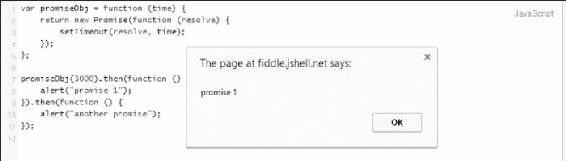

# 第三章：承诺的链式调用

承诺（promises）最重要的特性之一是能够链式调用和管理异步操作的序列。在前一章中，我们学习了承诺 API 的详细信息以及它是如何工作的；特别地，我们看到了`then`方法是如何工作的。我们还了解了当前浏览器对承诺的支持情况以及实现和扩展 JavaScript 承诺的库。在本章中，我们将涵盖以下主题：

+   如何在异步 JavaScript 中实现链式调用

+   使用承诺实现链式调用

+   从回调地狱转换为组织良好的承诺链

# 前所未有的链式调用

如前两章所学习，承诺倾向于将同步编程的力量带入异步函数中。承诺的这种能力包括同步函数的两个关键特性：

+   一个返回值的函数

+   一个抛出异常的函数

这些特性的重要性在于，它们可以用来将一个函数返回的值直接传递给另一个函数——而且不仅仅是一次；这可以转化为将这些函数一个接一个地链式调用的能力，其中这个链中元素之间的绑定关系是每个操作的承诺返回值。现在，第二个特性所暗示的内容非常重要，因为抛出异常可以让我们首先检测到过程是否失败；其次，它允许我们通过任何在链中处理捕获的函数来捕获这些异常，并帮助我们避免在这些问题被这些链式函数丢失。

那么，这在异步世界中是如何体现的呢？

首先，在异步世界中，一个人不能简单地返回值，因为这些值还没有及时准备好。同样，我们也不能抛出异常，基本上是因为没有人在那里接住这些被抛出的异常。因此，开发者们为了解决这个问题，退而求其次地使用了嵌套回调。这让他们能够用带有返回值的函数进行链式调用，但这以可维护性、可读性和额外的代码行数为代价。当代码行数增加，嵌套回调深度增加时，代码在需要编辑或出现错误时变得更加难以维护和调试。此外，嵌套回调对可读性产生负面影响，开发者需要折叠和展开括号以跟踪代码，从而知道回调函数从哪里开始，到哪里结束。

此外，在嵌套回调中捕获错误非常吃力，开发人员需要手动将错误逐层上传递。这种异步编程中的折磨闻名，被称为*回调地狱*；这通常会导致代码看起来像下面的伪代码一样：

```js
function shout(shoutTxt, callbackFunct) {
    alert(shoutTxt);
    callbackFunct("b");
}

shout('First Shout!', function (a) {
    if (a == "a"){
        alert("hey, there is an error!");
    }
    else {
        shout('Shout Again!', function (a) {
            shout('Third shout!', function (a) {
                a = "c";
                if (a == "c") {
                    shout('I am inside the third shout!', function (a) {
                        alert("hey, I can " + a.toString());
                    });
                } else {
                    shout('I am still inside the third shout!', function (a) {
                        alert("Alright I am tired");
                    });
                }
            });
        });
    }
});
```

在前一个例子中，你会注意到`function`和`});`在看似代码金字塔中广泛存在，考虑到我们甚至没有包括错误处理代码。之前的例子在小型规模上展示了*回调地狱*的样子。我们还可以观察到，在 JavaScript 编程中非常流行的嵌套回调——可能会无控制地增长成纠缠在一起且难以维护的代码。所以想象一下，在更复杂的场景中代码会是什么样子。

然而，开发者可以实施一些补救措施，以使嵌套回调更具可读性和可维护性。这些补救措施包括在回调参数中使用命名函数而不是匿名函数。另一个解决方案是将代码分解成更小的块，通过将执行特定任务的代码放入单独的模块中，然后将该模块插入到应用程序代码的其他位置。然而，这些补救措施更多的是一个变通方法，而不是一种标准做法；此外，这些变通方法仍然不足以完全解决异步操作链式调用的概念。

另一方面，Promise 在更多意义上以*开箱即用*的方式提供了我们在同步编程中拥有的功能组合，与 JavaScript 中的异步编程相比。

为什么这么说？因为规范指出，一个 Promise 必须提供一个`then`方法。不仅如此；规范还要求`then`函数，或任何具有合规实现的任何其他函数，应返回一个 Promise。返回的 Promise 如果被满足，则包含一个值；如果被拒绝，则包含一个异常。因此，`then`可以利用返回的 Promise 与另一个`then`函数结合，以组合一个链式调用的链，其中第一个操作的结果将传递给下一个操作，依此类推。此外，这个链在任何时刻都可以被一个拒绝切断，这可以被链中的任何声明异常处理代码的操作处理；换句话说，错误会自动通过该链冒泡上去。

### 提示

一些 Promise 的爱好者认为，Promise 的链式调用是新标准中最棒的部分。

在 JavaScript 编程中，当我们需要执行多个异步操作的场景下，链式调用非常重要。这些场景包括一个操作的工作依赖于前一个操作的结果。此外，可能第一个操作需要在返回结果之前处理一些代码，然后才能将其传递给下一个操作。记住，所有这些都应该在不阻塞其他线程的情况下进行，尤其是 UI 线程。因此，我们需要一种简单、标准的机制来链式这些异步操作，这正是 Promise 提供的内容。

当涉及到链式承诺时，链可以深入到我们想要的程度，因为`then`总是返回一个承诺。然而，如果我们进行如`promise.then(onFullfilled)`的调用，需要注意的是`onFulfilled`函数只能在承诺完成其过程后调用，以承诺的值为第一个参数。因此，如果我们在一个`then`内部返回一个简单值并将其链接到另一个`then`，下一个`then`将以该简单值为参数调用。如果我们想在第一个`then`中返回一个承诺，那么接下来的`then`将不得不等待返回的承诺，并且只有在那个承诺被解决或完成后才会被调用或执行。

让我们通过实际操作来看看这一点。以下是一个非常基础的示例代码，演示了链式承诺：

```js
var promiseObj = function (time) {
    return new Promise(function (resolve) {
        setTimeout(resolve, time);
    });
};

promiseObj(3000).then(function () {
    alert("promise 1");
}).then(function () {
    alert("another promise");
});
```

脚本非常直接，你可以在任何开发环境中编写它，甚至可以在 JSFiddle.net 等在线代码编辑器中编写。首先，通过定义一个`promiseObj`对象来创建一个承诺。这个对象是一个函数，一次接收一个参数，并返回一个新的承诺。

### 提示

请记住，目前并非所有浏览器都支持承诺（promises），正如我们在第二章《承诺 API 及其兼容性》中学到的那样，*承诺 API 及其兼容性*。为了做到这一点，你需要在一个兼容的浏览器中运行或测试 jsFiddle 中的代码。参考这一章节来检查兼容的浏览器。

我们使用`new Promise`来构造承诺。构造函数接受一个匿名函数，该函数将执行工作。这个函数传递一个`resolve`参数，该参数将满足承诺。在这个构造函数内部，我们调用`resolve`参数来执行一个`setTimeout`函数，除了将在给定时间后执行的函数外，还有一个`time`参数。因此，`setTimeout`将解决承诺。

代码的第二部分是发生链式的地方。我们首先调用我们刚刚创建的`promiseObj`；由于它会返回一个承诺，我们可以对它调用`then`。根据定义，`promiseObj`接受传递给`setTimeout`函数的`time`参数（以毫秒为单位）。在这里，我们传递了`3000`（3 秒），并在其中简单地调用了一个`alert()`函数，该函数将在屏幕上弹出，如下面的屏幕截图所示：



现在，由于`then`返回一个承诺，我们可以链式调用另一个`then`；这将在承诺解决后执行，并依次执行一个`alert()`函数。虽然上一个例子非常基础，但它展示了我们如何轻松地使用承诺链式异步操作。

让我们尝试将前面看到的嵌套回调示例转换为承诺的链式调用。为了说明目的，我将添加一个 HTML 元素`div`，在承诺传播时用内容填充它。

HTML 部分如下：

```js
<div id="log"></div>
```

JavaScript 部分如下：

```js
var log = document.getElementById('log'); 
var shout = new Promise(function (resolve) {
    log.insertAdjacentHTML('beforeend', '(<small>Promise started </small>)<br/>');
    window.setTimeout( 
    function () {
        resolve('First Shout!'); // fulfill the promise !
    }, 2000);
});

shout.then(function (val) {
    log.insertAdjacentHTML('beforeend', val + '  (<small>Promise fulfilled</small>)<br/>');
    var newVal = 'Shout Again!';
    return newVal;
}).then(function (val) {
    log.insertAdjacentHTML('beforeend', val + ' (<small>Promise fulfilled</small>)<br/>');
    var newVal2 = "Third shout, you're out!";
    return newVal2;}).then(function (val) {
    log.insertAdjacentHTML('beforeend', val + ' (<small>Promise fulfilled</small>)<br/>');
    return val;
});
```

在 HTML 中，我们只有一个带有 ID 为 log 的空`div`元素。在 JavaScript 中，我们首先声明一个名为`log`的变量来持有`div`元素。然后，我们构建一个新的 promise，并将其分配给一个名为`shout`的变量。在这个 promise 对象内部，我们添加了文本以强调我们刚刚开始了 promise。我们承诺的是等待 2 秒（2000 毫秒）后的`shoutText`字符串。再次，我们使用了`window.setTimeout`函数来模拟一个需要一些时间才能完成的异步操作。它在给定时间后通过解决它来满足 promise。

接下来，我们使用`then`方法调用`shout`，在其中定义了当 promise 被满足时它会做什么。在第一个`then`方法中，我们简单地将包含`shoutText`值的`val`参数传递给`log.insertAdjacentHTML`函数。这将在包含文本`Promise fulfilled`的`div`元素的旁边显示该值，字体较小。接着，我们定义了一个新变量`newVal`，给它赋值为`Shout Again!`，然后返回它。继续前进，第二个`then`也显示了从前一个 promise 调用返回的值。我们还定义了一个新变量，给它赋了一个文本值，然后返回它。最后一个`then`调用只是将`val`的值（此时等于`newVal2`）添加到`div`元素的内容中。请注意，`val`持有由 promise 从一次操作传递到下一次操作链中返回的值的内容。

### 提示

这个例子也可以在 JSFiddle.net 上进行测试。

## 顺序链式调用

我们不仅可以将异步操作与 promise 串联，还可以以一种方式将它们串联，使它们按照顺序执行这些操作。正如我们在本章中早些时候所学习的那样，如果一个`then`操作返回一个值，那么随后的`then`将以该值调用，除非第一个`then`返回一个 promise；如果这样，随后的`then`将等待返回的 promise，并且只有在那个 promise 得到满足或拒绝时才会被调用。这个规则允许我们以这样的方式排队这些异步操作，使得每个操作将等待前一个操作完成，从而按顺序运行。让我们看一个更好地解释这个的例子。在这个例子中，我们有一个名为`getData`的函数，它接受一个 JSON 文件并从那个 JSON 文件中获取数据。第一个 JSON 文件有类别，对于每个类别，我们需要按顺序获取每个类别的项目。让我们使用以下代码来完成这个：

```js
getData(jsonCategoryUrl).then(function(data) {
//get the items per category 1 
getItemsPerCategory(data.categories[0]).then(function(items) 
{
        //items are retrieved here
});
  return getData (data.categories[0]); //return category 1
}).then(function(category1) {
   alert("We now have category 1", category1);
//return category 2
return getData (data.categories[1]); 
}).then(function(category2) {
alert("We now have category 2", category2);
//return category 3
return getData (data.categories[2]); 
});
```

之前的代码示例通过`jsonCategoryUrl`函数异步调用来获取一系列分类；之后，我们通过传递`data.categories[0]`参数来请求这些分类中的第一个，然后将第一个分类传递给下一个`then`调用。在这些链式承诺的第二链接中，我们通过传递`data.categories[1]`参数获取第二个分类，并将其传递给最后的`then`调用，反过来又获取第三个分类，`data.categories[2]`。这个例子向我们展示了，如果我们需要一个链式操作，其中一环依赖于或需要等待前一个承诺的结果，我们如何在链式承诺中排队进行异步操作。

这种功能确实使承诺从常规回调模式中脱颖而出。我们可以通过创建一个简短的方法来获取分类，从而优化之前的代码，如下面的代码所示：

```js
//declare categorypromise varvar catPromise;
function getCategory(i) {
//if catPromise have no value get Data else just populate it from value of catPromise.

  catPromise = catPromise || getData(jsonCategoryUrl); 
  return catPromise.then(function(category) {
      //get the items under that category
      return getData(category.Items[i]);
  })
}
getCategory(0).then(function(items) {
alert(items);
    return getCategory(1);
}).then(function(items) {
   alert(items);
});
```

在之前的代码示例中，我们首先声明了一个名为`catPromise`的变量来保存承诺的分类。接下来，我们声明了一个名为`getCategory(i)`的函数，它将`i`的值作为参数；在这个函数内部，我们将`catPromise`设置为通过`getData(jsonCategoryUrl)`函数获取的 JSON 数据；然而，通过使用`||`（或）运算符，我们首先检查`catPromise`对象是否有值，这样我们就不需要再次获取分类的 JSON 文件，只需一次即可。当我们用值`0`调用`getCategory`时，它会获取第一个分类；之后，它会用`getCategory(1)`获取下一个分类，并将其传递给最后的`then`调用。这样，在我们调用`getCategory`之前，我们不会下载分类的 JSON 文件；然而，无论我们再次调用`getCategory`函数多少次，我们都不会需要重新下载分类的 JSON 文件；相反，我们会重复使用它，因为它将在操作序列中再次被调用。由于`getCategory`函数返回另一个承诺对象，它允许你实现承诺流水线，其中第一个操作的结果被传递给随后的一个操作。此外，这个示例展示的重要特性是，如果传递给`then`的函数返回一个新的承诺，那么`then`返回的承诺将不会被履行，直到那个函数返回的承诺被履行，从而在承诺的链中排队进行异步操作。

在此之前，示例清楚地展示了承诺是如何解决传统回调模型及其所生成的金字塔代码的。

# 摘要

承诺是一种很好地解决异步操作复杂性的方法。承诺在 JavaScript 中为异步操作的轻松链式提供了一种很好的机制。它们允许你以比回调模式更好的方式来管理这些操作的序列。

在下一章中，我们将学习如何在承诺中处理错误，了解如何使用承诺来管理异常，并且回顾一些在承诺中处理异步操作过程中出现的错误的例子。
