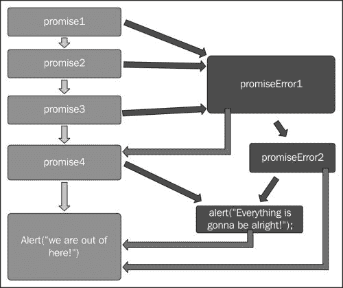

# 第四章：错误处理

像任何编程语言一样，错误和异常是必然会出现的；为了确保代码流畅运行和更容易调试，我们需要抛出和捕获这些异常。用异步 JavaScript 编程处理错误可能很繁琐。然而，承诺为我们提供了一个处理错误的伟大机制，我们将在本章探索。在前一章中，我们学习了异步操作的链式调用。我们还看到了如何从回调地狱转变为更易读和可维护的承诺链。在本章中，我们将涵盖以下主题：

+   承诺中的异常和错误处理

+   如何使用`then`和`catch`方法处理承诺中的错误

# 异常与承诺

在异步 JavaScript 编程中处理异常没有标准或公认的机制，这主要是因为这些异常发生在未来，而且无法确定一个被拒绝的承诺最终是否会得到处理。此外，在异步世界中，我们并不能简单地抛出异常，因为当它们还没有准备好时，没有人去捕获这些错误。因此，为了解决这个问题，创造了一些替代方案。处理错误和异常的常见技术涉及将这些异常手动传递给嵌套回调的链。另一方面，承诺提供了内置的错误处理和冒泡功能。它们通过声明你的函数应该返回一个如果失败则被拒绝的承诺来实现这一点。

在第一章中，我们学习了*JavaScript 承诺 - 我为什么要关心？*的内容，了解到一个承诺可以存在于三种不同的状态：等待中、已兑现和已拒绝。拒绝状态的要求如下：

+   承诺必须不会改变到任何其他状态（等待中或已兑现）

+   承诺必须有一个被拒绝的理由，并且这个理由在承诺内部不能改变

这两个拒绝状态的要求允许错误处理，更重要的是错误组合，即承诺被拒绝的原因会自动沿着承诺链使用`then`方法冒泡上来。承诺允许错误沿着代码链传播，类似于同步异常。此外，它还提供了一种更简洁的方式来处理异步中的错误。

通常，在使用回调方法的异步编程中，我们需要将我们认为不安全的代码块包裹在一个`try` catch 块中。以下代码示例展示了这一点：

```js
try {
    return JSON.parse("json"); //this will cause an error
} catch (error) {
    alert("I have an error with the following details: \n" + error);
}
```

前面的代码示例显示了一个意图提示错误的脚本块。在这个代码块中，我们将`return JSON.parse("json");`包裹在`try`...`catch`块中，并故意通过传递一个无效的 JSON 参数来引起错误。JavaScript 函数`JSON.parse()`用于将 JSON 文本转换为 JavaScript 对象。在我们的例子中，它将尝试解析文本`json`并抛出错误。我们将捕获这个异常，并显示带有该错误详情的警告框。

如果我们把这个脚本运行在一个 HTML 页面或者在线 JavaScript 编辑器中，结果将是一个包含以下消息的警告框：

**我有一个带有以下详情的错误：**

**SyntaxError: Unexpected token j**

我们可以通过这个公共 jsFiddle URL 浏览代码：[`jsfiddle.net/RamiSarieddine/mj6hs0xu/`](http://jsfiddle.net/RamiSarieddine/mj6hs0xu/)

正如我们迄今为止所看到的，promises 要么被满足要么被拒绝，如果 promise 中发生错误。当一个 promise 被拒绝时，它与同步代码中抛出异常类似。一个带有`then`函数的标准 promise 取两个参数`onFulfilled`和`onRejected`，如下面的代码所示：

```js
promise.then(onFulfilled, onRejected)
```

`onRejected`参数是一个将作为错误处理器的函数，当 promise 失败时将被调用。当 promise 中发生错误或异常时，这意味着 promise 被拒绝，并会将引发的错误提供给`onRejected`错误处理程序。当我们调用`onRejected`时，有两个考虑因素，可以总结如下列表，假设我们有一个简单的`promise.then(onFulfilled, onRejected)`：

+   `onRejected`只能在 promise 被拒绝后调用，以其拒绝原因作为其第一个参数

+   `onRejected`必须不会被多次调用

第二个考虑非常直接。`onRejected`函数不会在同一个 promise 上调用多次。第一个考虑断言，如果一个 promise 被拒绝，`onRejected`将不会被调用。

尽管如此，拒绝也隐式地发生，以及在 promise 的构造函数回调中抛出错误的情况。以下代码示例说明了这一点：

```js
var promiseTest = new Promise(function (resolve) {
    // JSON.parse will throw an error because of invalid JSON
    // so this indirectly rejects
    resolve(JSON.parse("json"));
});

promiseTest.then(function (data) {
    alert("It worked!" + data);
}, function (error) { //error handler
    alert(" I have failed you: " + error);
});
```

在前面的代码中，我们定义了一个新的 promise 叫做`promiseTest`，并在那个 promise 上调用`then`。这个 promise 在其构造函数回调中所做的全部事情是解决`JSON.parse()`，我们故意向其传递了一个无效的参数以引起错误。现在，这将在构造函数中抛出一个错误，当我们用`then`方法调用 promise 时，它将间接导致拒绝。如果我们只有一个`onFullfilled`处理程序，我们就无法捕获这个错误。异常将作为拒绝的参数提出，其值为`error`。我们在`promiseTest.then()`的参数中提供了一个`error`处理程序；因此，我们可以捕获并处理这个错误。

您可以通过在[`jsfiddle.net/RamiSarieddine/x2Latjg6/`](http://jsfiddle.net/RamiSarieddine/x2Latjg6/)这个公共 Fiddle 上测试这个示例代码。

### 提示

由于错误会自动冒泡并变成拒绝，因此在 promise 构造函数回调中处理所有与 promise 相关的任务变得非常方便；如果在那里出现任何错误，当调用 promise 时，它将被捕获。

# 使用 promise 处理错误

正如我们所看到的，promise 在异步编程中提供了更丰富的错误处理机制。尽管 Promises/A+规格只处理一个方法，即`.then(onFulfilled, onRejected)`，并没有提供其他方法，但`.then()`的规格为 promise 的互操作性奠定了基础，因此，扩展了包括错误处理在内的 promise 功能。

我们可能会在兼容 Promises/A+的 JavaScript 库中遇到几个错误处理的实现。其中一些扩展包括`catch()`方法，它是建立在基本的`then()`函数之上的。任何人都可以通过以下代码扩展 promise 对象来编写一个`catch()`方法，并将其包含在他们的脚本中：

```js
Promise.prototype.catch = function(onRejected) {
    return this.then(null, onRejected);
};
```

在前一个代码示例中，我们定义了一个名为`catch`的方法，它扩展了当前的`this.then`方法，通过执行`onRejected`处理器并忽略`then`的`onFulfilled`处理器参数来返回一个被拒绝的 promise。在使用中，`catch()`方法将如下所示：

```js
var promiseTest = new Promise(function (resolve) {
    resolve(JSON.parse("json"));
});

promiseTest.then(function (data) {
    alert("It worked: " + data)
}).catch(function(error) {
  alert("I have Failed you! " + error);
});
```

`catch()`函数使我们能够用一个更易读的函数替换错误处理程序，提供更简洁的错误处理方法。

从之前的代码示例中我们可以得出，`catch()`并没有什么独特之处，它只是`then(null, function)`函数的糖衣。此外，Promise/A+规格的一位作者，Brian Cavalier，是这样说的：`catch()`只是`then()`的受限子集。但是，它是否使代码在一般意义上，尤其是在错误处理上更加可读呢？ECMAScript 6.0 将`catch()`作为 promise 规格的必需品，正如我之前所说，现在大多数流行实现都包括了它。

然而，在`then()`和`catch()`的实现之间有一个需要注意的地方，因为`then()`有时会有些误导。为了更好地理解它，来看以下这个例子：

```js
promise.then(handler1, handler2);

promise.then(handler1).catch(handler2);
```

这两行代码包括了`promise`、`then`和`catch`方法，带有两个处理器：`handler1`和`handler2`。这两个调用是不等价的——如果`handler1`中出现错误，第一行不会调用`handler2`。这是因为，如果 promise 被满足，将调用`handler1`，如果 promise 被拒绝，将调用`handler2`。但是，如果`handler1`抛出`error`，`handler2`将不会被调用。

同时，在第二行中，如果任何一个承诺被拒绝或者`handler1`抛出异常，`handler2`将被调用。由于`catch()`仅仅是`then(null, handler)`的糖衣，第二行与以下内容相同，这可以使这个谜题更清晰：

```js
promise.then(handler1).then(null, handler2);
```

前两行代码中不等价的原因是`then()`的工作方式。`then(handler1, handler2)`方法为承诺注册了两个并行的处理程序，这样要么调用`handler1`，要么调用`handler2`，但永远不会两者都调用。另一方面，如果使用`then(handler1).catch(handler2)`，则如果`handler1`拒绝，两个处理程序/函数都将被调用，因为它们代表承诺链中的两个独立步骤。只有当我们有`catch`作为`then`的等价物时，承诺拒绝才会带着拒绝回调转移到后续的`then`方法。

虽然这在一开始看起来可能并不是非常直观，但在提供关于异步编程更容易理解的推理方面非常重要，它使得拒绝承诺变得与同步编程中抛出异常非常相似。在同步世界中，异常不允许执行紧跟在`throw`块后面的代码和最近的`catch`块内的代码，因此`try`块内发生的错误直接转移到`catch`块。

### 注意

`Catch()`函数对于应用程序开发者来说更佳，正如我们所学的，因为它有更好的可读性和直观的错误处理流程，而`promise.then(handler1, handler2)`通常在实现承诺时内部使用。

错误处理机制允许我们编写以安全方式执行任务的函数。让我们来看一个包含使用`catch()`进行错误处理的承诺链，并看看它在流程图中的翻译：

```js
promise1.then(function () {
    return promise2();
}).then(function () {
    return promise3();
}).catch (function (error) {
    return promiseError1();
}).then(function () {
    return promise4();
}, function (error) {
    return promiseError2();
}).catch (function (error) {
    alert("Everything is gonna be alright!");
}).then(function () {
    alert("We are out of here!");
}); 
```

前述承诺链和错误链对应的流程图将如下所示：



绿色的框表示将会被满足的部分；被染成红色的框代表如果承诺被拒绝时的错误处理程序。我们可以通过线条跟随流程，了解哪个被满足，哪个被拒绝，并与之前的代码示例进行比较，以获得关于承诺链中错误如何传播的更好视觉概念。

# 总结

JavaScript 的承诺（promises）提供了一种标准化的错误处理方法，其实现的基础存在于 `then` 方法的规格说明中，该方法可以扩展生成如 `catch` 之类的方法，使得代码更加易读且直观。`then` 函数有两个强大的参数：`onFulfilled` 和 `onRejected`。这些函数参数允许我们处理来自已完成的承诺操作返回的值以及承诺被拒绝时返回的错误。在下一章中，我们将介绍 WinJS 库；我们将学习该库中的承诺对象以及如何在 Windows 开发中使用它。
