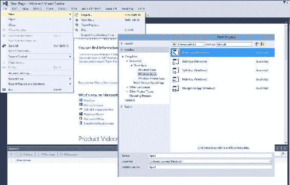

# 第五章．WinJS 中的承诺

承诺有各种框架的各种实现，所有这些都共享一个共同的基底；这就是承诺的概念。实际上，所有承诺库都以不同的形式提供了一个共同特性，以使使用 JavaScript 进行异步编程更容易、更好。WinJS，Windows 的 JavaScript 库，是具有自己承诺实现的库之一，我们将在本章中探讨。在前一章中，我们学习了在承诺操作期间处理的异常。我们还看到了 JavaScript 承诺配备的强大错误处理机制。此外，我们还学习了如何使用`then`和`catch`方法处理错误。在本章中，我们将涵盖以下主题：

+   介绍 WinJS 命名空间

+   WinJS 中的承诺对象详细说明

+   在 Windows 应用程序开发中使用 WinJS.Promise 的基本示例

# 介绍 WinJS

WinJS 代表 Windows 库 for JavaScript，是由微软开发的 JavaScript 库，最近被开源。这个库旨在允许开发者为 Windows 8（使用 HTML5 和 JavaScript）构建一等和本地质量的 Windows Store 应用程序，如 Skype 和音乐应用程序。它是用 XAML 和 C#，VB.Net 或 C++编程本地应用程序的第二选择。这种选择允许网页开发者利用他们的知识和技能构建商店应用程序。WinJS 库更像是一个综合工具包。它不仅提供了一个丰富的命名空间，而且还包括以下功能：

+   通过 Windows 运行时（WinRT）访问设备硬件

+   提供经过精心设计的 UI 控件，如 ListView、FlipView 和语义缩放，与页面控件一同使用

+   提供了一个坚实的基础，如承诺和数据绑定

此外，WinJS 可以与其他库和框架一起使用在独立的解决方案中。

WinJS 自其创建以来已经发展了很多。最初是专为 Windows Store 应用程序设计的平台，现在支持网页浏览器和其他设备，试图成为跨平台。这一尝试在最新的 WinJS 2.1 版本中得到了巩固，该版本支持 Windows Phone 8.1，现在 WinJS 也用于 Xbox One 应用程序。此外，它现在准备覆盖其他非微软浏览器和设备上的网站和网络应用程序。

### 注意

开源的 WinJS 现在托管在 GitHub 上，通过[`github.com/winjs/winjs/`](https://github.com/winjs/winjs/)，社区成员可以查看库并为其源代码做出贡献。

所有 WinJS 库函数都定义在一个名为 WinJS 的命名空间下。WinJS 命名空间为 JavaScript 提供了特殊功能，包括承诺对象和`xhr`函数。它包括三种成员对象：属性、函数

对象包括以下两个成员：

+   `ErrorFromName`：这只是一个错误对象。

+   承诺对象：这是我们本章讨论的重点。与本书中一直在讨论的承诺对象类似，它基本上提供了一种将工作分配给尚未存在的值的技巧。它为与作为异步暴露的 API 的交互提供了一个抽象机制。

属性包括以下内容：

+   `validation`：这个属性包含一个设置器，用于显示验证过程的结果

函数包括以下三个成员：

+   `log`：这个函数记录输出，并将其写入 Visual Studio 中的 JavaScript 控制台。这个函数可以通过自定义实现扩展，或者使用`WinJS.Utilities.startLog`将其记录到 JavaScript 控制台。

+   `strictProcessing`：这个函数不再需要，因为严格处理默认总是开启的。由于不再需要这个函数，它已被宣布为过时。

+   `xhr`：这个函数只是将`XMLHttpRequest`的调用包装在一个承诺中。

这就总结了 WinJS 命名空间从高层次的视图；WinJS 的代码在`base.js`文件中找到。

# 解释 WinJS.Promise 对象

这个对象是 WinJS 库最重要的方面之一，promise 实例与我们对异步 API 所做的任何事情都有关联。让我们深入了解这个对象的具体细节。就解剖学而言，promise 对象包括以下三种成员类型。

## 构造函数

在 WinJS 的构造函数级别，使用`WinJS.Class.define`函数创建一个类。在这个第一个参数是一个充当构造函数的函数。现在，在`Promise`类的案例中，它使用`WinJS.Class.derive`函数从名为`PromiseStateMachine`的基本类派生，第二个参数是构造函数。在这两种情况下，构造函数可以被命名为任何东西；另外，它们也可以是匿名的。然而，`WinJS.Promise`构造函数的描述与对象描述本身相同。`WinJS.Promise`构造函数接受两个函数参数：`init`和`onCancel`。

当我们声明一个新的承诺对象时，我们需要两个参数：`init`和`onCancel`。这两个参数都是函数。语法如下：

```js
var promiseObj = new WinJS.Promise(init, onCancel);
```

`init`参数是可选的。`init`函数在初始化或构建承诺对象时调用，这包括承诺对象实际要表示的工作的实质性实现。这个实现可以是异步的或同步的，这取决于所需工作的范围和性质。

### 提示

在这里需要注意的是，`init`函数中编写的代码默认并不会使其成为异步。为了确保代码异步运行，我们必须使用异步 API，如 Windows 运行时的异步 API、`setTimeout`、`setImmediate`和`requestAnimationFrame`。

`init`函数在此参数中使用，接受以下三个参数：

+   `completeDispatch`: 当`init`内部的操作已完成时，将调用此参数，从而传递该操作的结果。`init`代码应在操作完成后调用此参数，将操作的结果作为一个参数传递。

+   `errorDispatch`: 当该操作中发生错误时，会调用这个参数，因此，承诺获得错误状态。由于这是一个错误，`errorDispatch`的参数应该是`WinJS.Promise.ErrorFromName`的一个实例。

+   `progressDispatch`: 在操作进行期间，此参数将定期调用。这个函数的参数将包含中间结果。如果承诺中的操作需要支持进度，则使用此参数。

`onCancel`参数是承诺构造函数的第二个参数。这个函数可以被承诺的消费者用来取消任何未完成的工作。然而，在 WinJS 中，承诺并没有义务提供或支持取消。

## 事件

在承诺对象成员类型的列表中，接下来是`Events`。目前，承诺对象有一个名为`onerror`的事件。正如这个名字所示，这个事件发生在承诺处理过程中发生错误时。此外，无论是否在其他地方处理此事件，`onerror`事件都会在任何一个承诺中引发运行时错误。错误处理程序有助于调试，可以用来设置断点和提供错误日志。然而，它最终只能提供关于导致错误的代码或输入的见解和详细信息。这个`onerror`事件提供了一个通用的错误处理机制。在代码中，添加一个通用错误处理程序看起来像如下：

```js
WinJS.Promise.onerror = errorHandler;

function errorHandler(event) {
     // get generic error handling info
     var exc = event.detail.exception;
     var promiseErrored = event.detail.promise;
}
```

代码示例的第一行仅仅是将`errorHandler`函数附加到承诺对象的`onerror`事件。接下来，我们定义了`errorHandler`函数，它接受一个参数`event`；函数所做的就是在这个示例中从事件中检索信息，例如`exception`和`promise`。然后，我们将这些值赋给变量。参数`event`是事件处理程序的`CustomEvent`类型参数；通常它是一个包含有关事件信息的对象。

## 方法

承诺对象的最后一种成员类型是`Methods`，目前`WinJS.Promise`有以下六个方法：

+   `addEventListener`: 这个方法简单地将事件监听器附加到 promise 上。它有三个参数：`eventType`，这是事件的字符串类型名称；`listener`，当事件触发时要调用的函数；`capture`是一个布尔值，用于启用或禁用捕获。这个方法没有返回值，其基本语法如下所示：

    ```js
    promise.addEventListener(eventType, listener, capture);
    ```

+   `removeEventListener`: 这个方法从控件中取出事件监听器。在语法上，它与`addEventListener`方法相似，如下面的代码行所示：

    ```js
    promise.removeEventListener(eventType, listener, capture);
    ```

+   `Cancel`: 这个方法尝试取消 promise。在 promise 支持取消并且尚未完成的情况下，这将导致 promise 进入错误状态，值为 Error("Canceled")。它没有参数和返回值。其基本语法如下所示：

    ```js
    promise.cancel();
    ```

+   `dispatchEvent`: 这个方法简单地分发和触发一个具有指定类型和属性的事件。它有两个参数，并根据是否在事件上调用`preventDefault`返回一个布尔值。这个方法的参数是字符串值类型，包含事件的名称和`eventDetails`，这是一个包含要附加到事件对象的一组额外属性的对象。这个方法的基本语法如下所示：

    ```js
    promise.dispatchEvent(type, eventDetails);
    ```

+   `Then`: 这是 promise 对象最重要的方法。它接受三个函数类型的参数，允许我们在 promise 完成时指定要执行的工作：promise 值已经完成；当 promise 触发错误时将要执行的错误处理，并且未能完成一个值；最后，在 promise 过程中处理工作进度的最后工作。`then`的返回值是一个包含执行`onComplete`函数结果的 promise。在其基本形式中，`then`方法将具有以下语法：

    ```js
    promise.then(onComplete, onError, onProgress);
    ```

    `then`方法的三个参数是函数类型。这些如下所示：

    +   `onComplete`: 当 promise 成功完成并带有值完成时，将调用此处理器。值将作为单个参数传递。`onComplete`返回的值成为`then`方法返回的 promise 的完成值。在执行此函数期间出现错误或异常的情况下，`then`返回的 promise 将进入错误状态。

    +   `onError`: 当 promise 失败并带有错误完成时，将调用此处理器；`onError`返回的值将成为`then`方法返回的 promise 的值。在这里，错误将作为参数传递，而不是像在`onComplete`函数中那样传递值。

    +   `onProgress`: 如果我们需要报告 promise 操作的进度，就使用这个处理器。它有一个参数，是进度数据。请注意，WinJS 中的 promise 不必支持进度。

+   `Done`方法，类似于`Then`，也允许我们在 promise 被解决时指定需要执行的操作，在 promise 失败时的错误处理，以及过程中的进度报告。此外，这个函数将抛出任何本应从`then`返回的错误，作为 promise 在错误状态下的值。与返回一个 promise 的`then`不同，`Done`不返回一个值。这个方法的基本语法如下面的代码行所示：

    ```js
    promise.done(onComplete, onError, onProgress);
    ```

正如我们从前面的代码语法中看到的，`promise.done`在参数上与`promise.then`相似，因为它有函数参数：`onComplete`、`onError`和`onProgress`，实际上它们的行为和作用与`Then`方法中的对应部分是一样的。

`then`和`done`之间有一些区别；最明显的区别是返回值。如前所述，`then`方法返回 promise，而`done`没有返回值，这对 WinJS 承诺的链式调用有直接影响。以下列表总结了这些区别：

+   **在链式调用中**：`Then`允许链式调用多个`then`函数，因为它返回一个 promise。而与`done`相比，我们不能链式调用多个`done`方法，因为它不返回一个值；更具体地说，它返回`undefined`。因此，`done`必须是最终的调用。例如，我们可以有`.then().then().then().then()`等等，而与`done`一起则是`.then().then().done()`。

+   **在错误处理中**：如果没有为`done`提供错误处理程序并且发生了错误（换句话说，就是一个未处理的异常），将抛出一个异常到事件循环中，允许我们在`window.onerror`事件中捕获它，但不在`try`/`catch`块内。因此，`done`函数向调用方法保证抛出任何在该方法内未处理的错误。而与`then`相比，那些产生的未处理异常被默默地捕获并作为 promise 状态的一部分进行遍历，`then`不抛出异常，而是返回一个处于错误状态的 promise。

了解这两个方法之间的区别对于使用它们是至关重要的。然而，对于这两种方法，建议采用扁平化的 promise 链而不是嵌套的链，因为 promise 链的格式使它们更容易阅读，也更容易处理错误。例如，以下样本代码是更可取的：

```js
asyncFunct()
    .then(function () { return asyncFunct1(); })
    .then(function () { return asyncFunct2(); })
    .done(function () { theEnd(); });
```

以下被标记为*不要*之一：

```js
//not very neat!
asyncFunct().then(function () {
    asyncFunct1().then(function () {
            asyncFunct2().done(function () { theEnd(); });
    })
});
```

### 注意

我们链式调用 Windows 运行时（WinRT）返回 promise 的方法，这与链式调用 WinJS 承诺是一样的。

请注意，WinJS 中的承诺符合 CommonJS Promises/A 提案中定义的承诺，并且在本稿撰写之时，WinJS 承诺尚未针对新的 Promises/A+规范进行测试。这对 Windows 应用开发没有影响，因为应用在商店中运行。在浏览器中，WinJS 承诺与 A+承诺之间可能产生的主要区别是，WinJS 承诺不保证承诺的回调函数将异步执行。例如，如果我们用回调函数`a`调用`promise.then(a)`，我们无法确定`a`将以异步还是同步方式调用。而在 Promises/A+规范中，回调函数`a`总是异步调用。这是必须的。规范的作者解释说，不确保异步回调会使承诺更难以推理和调试。尽管如此，正如我之前在章节中提到的，WinJS 本身现在是一个开源项目，托管在 GitHub 上，社区成员和任何感兴趣的人都可以下载 WinJS，构建并将其与 Promises/A+兼容性测试套件进行测试。

接下来，让我们看看如何在 Windows 应用开发中使用 WinJS 的承诺。

## 使用 WinJS 承诺

我们在 Web 上利用承诺来使 UI 更具响应性，并避免通过异步执行工作来阻塞 UI 线程。同样，我们使用 WinJS 承诺以异步处理工作，从而使 Windows 应用的 UI 线程可用于响应用户输入。我们还允许在从服务器和数据库异步获取所需内容的同时，应用程序布局和静态项目正确并及时地加载。为此，WinJS 和 Windows 运行时中的异步 API 以承诺的形式在 JavaScript 中暴露。

让我们来看一个承诺的基本示例。为了跟随并复制以下示例，我们将需要 Visual Studio（ express 版本即可）。我们需要首先创建一个基本的 Windows 应用，类型为 JavaScript。为此，我们需要从 Visual Studio 顶部菜单中选择**文件** | **新建** | **项目**，这将弹出一个包含项目类型的窗口。在那里，我们需要选择**JavaScript** | **商店应用** | **Windows 应用**，这将为我们列出可用的不同 JavaScript Windows 应用模板。对于这个例子，我们可以选择**空白应用**，这是一个单页 Windows 应用的项目，没有预定义的控制或布局。随意命名应用程序，然后单击**确定**。以下屏幕截图说明了所采取的步骤：



现在，我们有一个空的 Windows 应用，可以向其中添加一些代码。为此，我们需要导航到`default.html`页面并对其进行修改。打开该页面，并在`body`元素中插入一个`input`元素和一个`div`元素以显示一些结果，按照以下语法进行操作：

```js
<body>
    <p>Content goes here</p>
    <br/>
    <div>
        <input id="urlInput" />
    </div>
 <br/><br/>
    <div id="resultDiv">The result will show here</div>
</body>
```

接下来，我们需要在`input`元素的更改处理程序上附加一些代码，以便在`input`元素的值发生变化时我们可以做一些工作。我们可以通过使用`addEventListener`方法并将其作为`WinJS.Utilities.ready`函数的一部分来实现这一点。在这个函数内部添加事件监听器将允许我们附加的更改处理程序在 DOM 通过`DOMContentLoaded`事件加载后直接调用，这将在页面代码被解析后且所有资源尚未加载之前发生。

导航到位于`js`文件夹内的`default.js`文件。在那里，我们需要在`app.onactivated`事件处理器的末尾添加以下代码：

```js
WinJS.Utilities.ready(function () {
    Var inpt = document.getElementById("urlInput");
    inpt.addEventListener("change", onChangeHandler);
  }, false);
```

在前面的代码中，我们在`WinJS.Utilities.ready`中添加了一个匿名函数代码。在那个匿名函数中，我们首先从 DOM 中获取那个`input`元素，将其分配给一个名为`inpt`的变量，然后在该`inpt`变量上调用`addEventListener`方法，将名为`onChangeHandler`的函数添加到变化事件中。

最后一步将是编写`onChangeHandler`函数的代码。在该函数中，我们将调用`WinJS.xhr`方法，该方法基本上将`XMLHttpRequest`的调用包装起来并暴露为一个承诺。我们可以使用这个方法进行跨域请求和内部网络请求。我们将用户在`input`元素中输入的 URL 传递给`xhr`参数，并相应地更新`resultDiv`元素的结果。`Xhr`是一个异步函数，返回一个承诺；因此，我们可以在这个函数上调用承诺对象的`then`或`done`方法来更新 UI。对于这个例子，我们将调用`then`方法，该方法在`xhr`函数成功完成`XmlHttpRequest`或引发一个错误时被调用。`Then`可以接受三个参数，分别为成功、错误或进度，正如我们在定义中看到的那样。然而，对于这个基本例子，我们将看到如何添加`onCompleted`函数。这个成功处理程序将通过将`resultDiv`元素的背景颜色设置为蓝色并将内部文本设置为`Hooray!`来对`resultDiv`元素应用一些更改。

`onChangeHandler`函数的语法将如下所示：

```js
function onChangeHandler(e) {
            var input = e.target;
            var resDiv = document.getElementById("resultDiv");

            WinJS.xhr({ url: e.target.value }).then(function onCompleted(result) {
                if (result.status === 200) {
                    resDiv.style.backgroundColor = "blue";
                    resDiv.innerText = "Hooray!";
                }
            });
        }}
```

让我们分析一下之前的代码示例。我们首先从`e`参数中获取`input`元素，我们将`resultDiv`元素赋值给变量`resDiv`，然后我们调用`WinJS.xhr`，并传递给它从目标中获取的`input`元素的值。这个值包含了我们在文本框中输入的 URL。接下来，我们在`xhr`函数上调用`then`，并将成功处理程序`onCompleted`传递给`then`，其中包含结果作为参数。这里的成果代表了 HTTP 请求。如果请求的状态是 200，这是 HTTP 请求中的成功状态，我们将对`resultDiv`应用更改。

现在如果我们运行该应用程序，在文本框中输入 URL 后，我们将得到以下结果：


如何在获取结果时报告进度？为了这样做，我们需要在`xhr`函数的`then`调用中编写进度处理程序。我们将把背景颜色改为绿色，直到请求完成并调用`onCompleted`处理程序，这将把背景颜色改为蓝色。我们将修改代码，包括以下代码的进度处理程序：

```js
function onChangeHandler(e) {
    var input = e.target;
    var resDiv = document.getElementById("resultDiv");
    WinJS.xhr({ url: e.target.value }).then(function onCompleted(result) {
        if (result.status === 200) {
            resDiv.style.backgroundColor = "blue";
            resDiv.innerText = "Hooray!";
        }
    }, function myfunction() {
//no error handling here; just passing an empty parameter
    }, function progress(result) { //handle progress here
        if (result.status != 200) {
            resDiv.style.backgroundColor = "green";
        }
    });
}
```

在之前的代码示例中，我们添加了一个空的错误处理程序和一个进度处理程序，作为匿名函数`function progress(result)`，它将检查请求状态是否不是 200，这意味着它还不是成功状态，并把背景颜色设置为绿色。现在我们运行应用程序，并在文本框中输入 URL，我们会注意到`div`元素的背景颜色在一秒左右变为绿色，然后变为蓝色，并更新文本为 Hooray!。

现在，WinJS promises 也可以在浏览器中使用，因为产品团队已经使一些 WinJS 功能能够在 Web 上运行。您可以通过[`try.buildwinjs.com/`](http://try.buildwinjs.com/)上的新在线编辑器查看 WinJS 的实际效果。在任何浏览器中，我们都可以查看和编辑代码，玩转 WinJS，并实时查看结果。

# 摘要

WinJS 提供了一个强大的 promises 实现，我们可以用它来包装任何操作，并有效地利用异步编程为使用 JavaScript 的 Windows 应用提供支持。

在下一章，也是最后一章中，我们将总结前几章中学到的 JavaScript promises 知识，并付诸实践比迄今为止所看到的更成熟的代码示例。
