# 第一章．从 JavaScript 视角看规模化

JavaScript 应用程序正在变得更大。这是因为我们可以用这门语言做更多的事情——比大多数人想象的还要多。毕竟，JavaScript 被设想为激活其他静态网页的手段。一种填充 HTML 空白的手段。年复一年，越来越多的网站开始开发 JavaScript 代码以提高其页面的功能性。

尽管某些语言特色让人感到挫败，但 JavaScript 的流行度已经达到了临界质量——今天它成为了 GitHub 上最受欢迎的编程语言([`githut.info/`](http://githut.info/)). 从那时起，网站开始看起来更像是在用户桌面上安装的应用程序。库和框架如雨后春笋般涌现。为什么？因为前端 JavaScript 应用程序很大且复杂。

在当今的前端开发职业中，我们有大量的工具可供选择。JavaScript 语言已经发展到了可以独立使用的程度；它越来越不依赖于库来执行最基本和最基础的编程任务。这尤其适用于 ECMAScript 规范的下一版，其中添加到语言中的构造部分解决了困扰开发者多年的问题。当然，这并不否定应用程序框架的必要性。前端开发环境和其支持的网络标准离完美还远，但它们正在改善。

长期以来在前端开发领域缺失的一环是架构。由于实施内容的复杂性，前端架构近年来变得普遍。复杂的工具允许前端开发者设计一种能够与我们要解决的问题一起扩展的架构。这本书的核心就是可扩展的 JavaScript 架构。但扩展到什么程度呢？这并不是传统计算领域中的扩展问题，在那里你需要在一个分布式服务器环境中处理更多的负载。前端扩展提出了它自己独特的挑战和约束。本章将定义 JavaScript 架构面临的一些扩展问题。

# 影响者规模化

我们并不是仅仅因为能够扩展就扩展我们的软件系统。虽然可扩展性常常被吹嘘，但这些主张需要付诸实践。为了这样做，可扩展软件必须有它的理由。如果没有扩展的必要，那么简单地构建一个不可扩展的系统既简单又经济。把为处理各种扩展问题而构建的东西放入一个不需要扩展的上下文中，这只会让人感到笨拙。特别是对于最终用户来说。

因此，作为 JavaScript 开发者和架构师，我们需要承认并理解那些需要可扩展性的影响因素。虽然并非所有 JavaScript 应用程序都需要扩展，但这并不总是绝对的。例如，很难说我们知道这个系统不会以任何有意义的方式需要扩展，因此我们不要投入时间和精力使其具有可扩展性。除非我们正在开发一个一次性的系统，否则总会对增长和成功有所期待。

在光谱的另一端，JavaScript 应用程序并非天生就是成熟的可扩展系统。它们随着时间成长，在此过程中积累可扩展的属性。影响因子是那些从事 JavaScript 项目工作的有效工具。我们不希望从构思阶段就开始过度工程化，也不希望构建的东西过早地被早期决策所束缚，限制其扩展能力。

## 扩展的需求

扩展软件是一个反应性事件。考虑影响因子有助于我们主动为这些扩展事件做准备。在其他系统中，比如 Web 应用程序后端，这些扩展事件可能是短暂的峰值，并且通常会自动处理。例如，由于更多用户发出更多请求而增加了负载。负载均衡器介入，平均地将负载分配到后端服务器上。在极端情况下，当需要时系统可能会自动提供新的后端资源，并在不再需要时销毁它们。

前端发生的扩展事件并非如此。实际上，通常发生的扩展事件发生的时间更长，且更复杂。JavaScript 应用程序的独特之处在于，它们可用的唯一硬件资源就是运行它们的浏览器中的资源。它们从后端获取数据，这可能扩展得很好，但这不是我们关心的。随着我们的软件的增长，成功执行某事的必要副作用是我们需要注意可扩展性的影响因子。

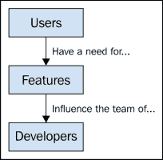

前面的图表向我们展示了从上至下的影响因子图表，从用户开始，他们要求我们的软件实现功能。根据功能的各种方面，比如它们的大小以及它们与其他功能的关系，这影响了负责功能开发的开发团队。随着影响因子的扩大，这种影响也在增长。

## 增长的用户基础

我们不仅仅为一位用户构建应用。如果是这样，那就没有扩大努力的必要。虽然我们所构建的东西可能是基于一位用户代表的 requirements，但我们的软件服务于许多用户。我们需要预见我们应用发展过程中的不断增长的客户基础。尽管我们可能根据应用的性质设定活跃用户数量的目标，例如，通过使用像[`www.alexa.com/`](http://www.alexa.com/)这样的工具来参考类似应用。例如，如果我们的应用面向公众互联网，我们希望有很多注册用户。另一方面，我们可能会针对私有安装，在那里，系统中的用户加入速度可能会慢一些。但在后一种情况下，我们仍然希望部署数量增加，从而使使用我们软件的总人数增加。

与我们的前端互动的用户数量是影响扩展性的最大因素。每增加一个用户，以及随着各种架构视角的加入，增长是呈指数级的。如果你从自上而下的角度来看，用户掌握着主动权。归根结底，我们的应用是为了服务他们。我们越能有效地扩展 JavaScript 代码，我们就越能取悦更多用户。

## 构建新特性

成功的软件，尤其是拥有庞大用户基础的软件，最明显的副作用可能是为了保持用户满意度而必须添加的新特性。随着系统用户的增长，功能集合也在不断增加。尽管新特性显而易见，但这个方面常常被项目忽视。我们知道新特性正在路上，然而，却很少思考无休止的新特性如何妨碍我们扩大努力的规模。

当软件还处于起步阶段时，这种情况尤其棘手。开发软件的组织会不遗余力地吸引新用户。在初期这样做似乎没有太大后果，因为副作用有限。没有很多成熟的功能，没有庞大的开发团队，也不太可能因为破坏了用户依赖的某项功能而惹恼现有用户。当这些因素不存在时，我们更容易灵活地推出新特性，让现有和潜在用户眼花缭乱。但我们如何迫使自己关注这些早期设计决策？我们如何确保自己不会不必要地限制我们扩展软件支持更多特性的能力？

正如我们将在本书中看到的那样，新功能的开发以及现有功能的增强是可扩展的 JavaScript 架构持续面临的问题。我们不应该只关注我们软件市场营销文献中列出的功能数量。我们还需要考虑特定功能的复杂性，各个功能之间的通用性，以及每个功能有多少活动部分。从顶层视角来看，用户是第一层，每个功能是下一层，从那里开始，它会扩展到巨大的复杂性。

让一个功能变得复杂不仅仅是单个用户的问题。相反，是一群都需要同一个功能才能有效使用我们的软件的用户。从那里开始，我们必须开始考虑人物角色，或者职责，以及哪些职责对哪些角色可用。这种组织结构的需求在游戏进行到很晚之后才会变得明显；在我们做出决定使引入基于角色的功能交付变得困难之后。而且，根据我们的软件是如何部署的，我们可能需要支持各种独特的用例。例如，如果我们有多个大型组织作为客户，每个组织都有自己的部署，他们很可能对用户结构有自己的独特限制。这是具有挑战性的，我们的架构需要支持许多组织的不同需求，如果我们想要扩展。

## 雇佣更多的开发者

将这些功能变为现实需要精通 JavaScript 的开发人员，他们知道自己在做什么，如果我们有幸，我们能够雇佣他们组成一个团队。团队的建设不是自动发生的。在团队成员开始积极依赖彼此输出一些精彩的代码之前，需要建立一定程度的信任和尊重。一旦开始发生这种情况，我们就处于良好的状态。再次从我们扩展的影响者的顶层视角来看，我们交付的功能可以直接影响我们团队的士气。维持一种平衡基本上是不可能的，但至少我们可以接近它。功能太多，开发者太少，会导致团队成员之间产生持续的不安全感。当没有机会交付预期中的东西时，尝试就没有多大意义了。另一方面，如果你有太多的开发者，由于功能有限，导致沟通成本过高，很难定义责任。当没有共享的责任理解时，事情开始崩溃。

实际上，处理想要开发的功能却缺乏足够的开发者要比处理开发者过多要容易。当 feature 开发负担很重时，退一步思考—"如果我们有更多开发者，我们会怎么做 differently?" 这个问题通常会被忽略。我们去招聘更多的开发者，他们到来之后，让大家都惊讶的是，features 的吞吐量并没有立即得到改善。这就是为什么拥有一个开放的开发生态文化很重要，在那里，没有人会问愚蠢的问题，责任定义明确。

没有一种正确的团队结构或开发方法论。开发团队需要致力于解决我们试图交付的软件所面临的问题。最大的挑战无疑是功能的数量、大小和复杂性。因此，在组建团队时，我们需要考虑这个问题，以及在团队扩充时也是如此。尤其是后者，因为软件还处于初期阶段时我们所使用的团队结构，可能不适合功能扩展时我们所面临的挑战。

# 架构视角

前一部分内容是对影响 JavaScript 应用程序扩展性的因素的采样。从顶部开始，每一个影响因素都会影响它下面的影响因素。我们的用户数量和性质是我们首先要考虑的影响因素，这对我们开发的功能数量和性质有直接影响。进一步地，开发团队的规模和结构也受到这些功能的影响。我们的任务是将这些扩展性的影响因素，转化为从架构视角考虑的因素：

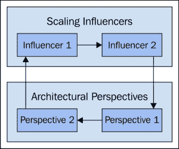

扩展性影响了我们的架构视角。我们的架构反过来又决定了对扩展性影响因素的响应。这个过程是迭代和无休止的，贯穿我们软件的整个生命周期。

# 浏览器是一个独特的环境

在传统意义上的扩展性在浏览器环境中实际上并不真正有效。当后端服务因需求过载而无法应对时，常见的做法是“堆砌更多硬件”来解决问题。当然，说起来容易做起来难，但与 20 年前相比，如今扩展我们的数据服务要容易得多。当今的软件系统都是设计为可扩展的。如果后端服务总是可用且总是有响应，这对我们的前端应用程序是有帮助的，但这只是我们面临的问题中的一部分。

我们不能给运行我们代码的网络浏览器增加更多硬件；鉴于这一点，我们算法的时间和空间复杂性很重要。桌面应用程序通常有一组运行软件的系统要求，比如操作系统版本、最小内存、最小 CPU 等。如果我们在我们 JavaScript 应用程序中宣传这些要求，我们的用户基础会大幅减少，可能会引发一些仇恨邮件。

期望基于浏览器的网络应用程序简洁且快速，这是一种新兴现象。也许，这在一定程度上是由于我们面临的竞争。有很多膨胀的应用程序 out there，无论它们是在浏览器中使用还是在本地下载，用户都知道膨胀的感觉是什么，通常会避开：

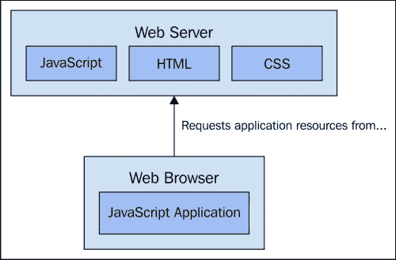

JavaScript 应用程序需要许多资源，所有这些资源都有不同的类型；这些资源都由浏览器代表应用程序获取。

增加我们麻烦的一个事实是，我们正在使用一个设计用来下载和显示超文本、点击链接并重复的平台。现在我们做的是同样的事情，只不过是用完整的应用程序。多页面应用程序正逐渐被单页面应用程序所取代。说到这里，应用程序仍然被当作一个网页来处理。尽管如此，我们正处在巨大的变革之中。浏览器是一个完全可行的网络平台，JavaScript 语言正在成熟，还有许多 W3C 规范正在制定中；它们帮助我们的 JavaScript 更像一个应用程序，而不是一个文档。请看下面的图表：

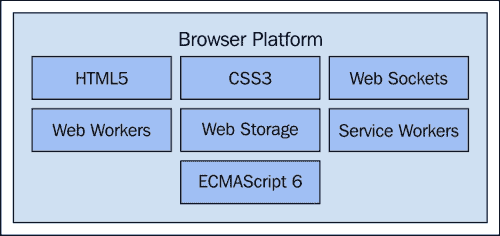

网络平台中发现的技术的样本

我们使用架构视角来评估我们提出的任何架构设计。这是一种强大的技术，通过不同的镜头检查我们的设计。JavaScript 架构也不例外，尤其是对于那些可扩展的架构。JavaScript 架构与其他环境架构的区别在于我们有独特的视角。浏览器环境要求我们以不同的方式思考设计、构建和部署应用程序。在浏览器中运行的任何东西本质上都是短暂的，这改变了我们多年来认为理所当然的软件设计实践。此外，我们花在编码架构上的时间比画图更多。等到我们画出任何东西时，它已经被另一个规范或工具所取代。

## 组件设计

在架构层面，组件是我们工作的主要构建块。这些可能是具有多级抽象的高级组件。或者，它们可能是我们正在使用的框架暴露的内容，因为许多这些工具都提供它们自己的“组件”概念。在本书中，组件位于中间位置——不是太抽象，也不是太具体实现。这里的想法是我们需要对我们的应用程序组成进行深思熟虑，而无需过于担心具体实现。

当我们首次着手构建一个考虑可扩展性的 JavaScript 应用程序时，组件的组成开始成形。组件如何组合是我们扩展的关键限制因素，因为它们设定了标准。组件实现模式以保持一致性，正确地获得这些模式非常重要：

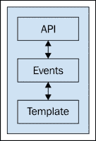

组件具有内部结构。这种组合的复杂性取决于考虑中的组件类型。

正如我们将看到的，我们各种组件的设计与其他视角中我们做出的权衡紧密相关。这是件好事，因为它意味着如果我们关注所需的扩展特性，我们可以回顾并调整组件的设计以满足这些特性。

## 组件通信

组件不会在浏览器中单独存在。组件一直在相互通信。我们有多种通信技术可供选择。组件通信可能简单到方法调用，也可能复杂到异步发布-订阅事件系统。我们采取的架构方法取决于我们更具体的目标。组件的挑战在于，我们通常在开始实现应用程序之后才知道理想的通信机制是什么。我们必须确保我们可以调整所选的通信路径：

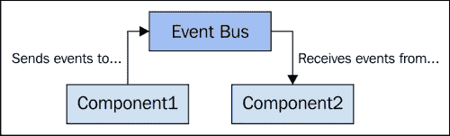

组件通信机制使组件解耦，实现可扩展的结构。

我们很少为组件实现自己的通信机制。既然有许多工具可以为我们解决至少部分问题，何必如此呢。很可能，我们最终会得到一种混合了现有通信工具和我们自己实现特定内容的混合物。重要的是，组件通信机制是其自身的视角，可以独立于组件本身进行设计。

## 加载时间

JavaScript 应用程序总是在加载一些东西。最大的挑战是应用程序本身，在用户可以执行任何操作之前，它需要加载所有必要的静态资源。然后还有应用程序数据。这需要在某个时刻加载，通常按需加载，并导致用户体验到的整体延迟。加载时间是一个重要的视角，因为它极大地影响到我们产品整体质量的感知。

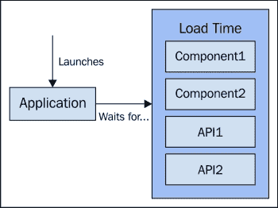

初始加载是用户的第一次印象，大多数组件都在这里初始化；要让初始加载速度快，而不牺牲其他方面的性能，是非常困难的。

在这里，我们可以做很多事情来抵消用户等待事物加载的负面体验。这包括利用 Web 规范，使我们能够将应用程序及其使用的服务作为可在 Web 浏览器平台上安装的组件来处理。当然，这些想法都还处于初级阶段，但随着它们和我们的应用程序一起成熟，值得考虑。

## 响应性

我们架构性能视角的第二部分关注的是响应性。也就是说，在一切加载完成后，我们响应用户输入需要多长时间？虽然这个问题与从后端加载资源的问题不同，但它们仍然密切相关。通常，用户操作会触发 API 请求，我们用来处理这些工作流程的技术影响用户感知的响应性。

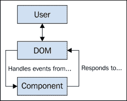

用户感知到的响应性受到我们组件对 DOM 事件响应所需时间的影响；在 DOM 事件初始发生和我们最终通过更新 DOM 来通知用户之间，很多事情都有可能发生。

由于必要的 API 交互，用户感知的响应性很重要。虽然我们无法使 API 更快，但我们可以采取措施确保用户总是从 UI 获得反馈，并且反馈是即时的。然后，还有简单地在 UI 中导航的响应性，例如使用已经加载的缓存数据。除了其他架构视角外，所有视角都与我们的 JavaScript 代码性能紧密相关，最终，也与用户感知的响应性相关。这个视角对我们组件设计和它们选择的通信路径的合理性进行检查。

## 可寻址性

仅仅因为我们正在构建单页应用程序，并不意味着我们不再关心可寻址的 URI。这或许是 Web 的巅峰之作——指向我们想要资源的唯一标识符。我们将它们粘贴到浏览器地址栏中，然后见证奇迹发生。我们的应用程序肯定有可寻址的资源，我们只是以不同的方式指向它们。不是后端 Web 服务器解析的 URI，在那里页面被构建并发送回浏览器，而是我们的本地 JavaScript 代码理解 URI：

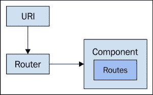

组件监听路由器的路由事件并相应地响应。变化的浏览器 URI 触发这些事件。

通常，这些 URI 将映射到 API 资源。当用户在我们的应用程序中点击这些 URI 时，我们会将 URI 翻译成另一个用于请求后端数据的 URI。我们用来管理这些应用程序 URI 的组件称为路由器，有许多框架和库带有基本的路由器实现。我们可能会使用其中的一个。

地址可访问性视角在我们的架构中扮演着重要角色，因为确保我们应用的各个方面都有可访问的统一资源标识符（URI）会复杂化我们的设计。然而，如果我们聪明地处理，它也可以让事情变得更容易。我们的组件可以使用 URI，就像用户使用链接一样。

## 可配置性

软件很少能直接按照你的需求来工作。高度可配置的软件系统被认为是好的软件系统。前端配置是一个挑战，因为配置有多个维度，更不用说存储这些配置选项的问题了。可配置组件的默认值也是一个问题——它们从哪里来？例如，是否有设置默认语言，直到用户更改它？像往常一样，我们前端的不同部署需要这些设置的不同默认值：

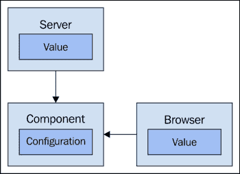

组件配置值可以来自后端服务器，或者来自网页浏览器。默认值必须存在于某个地方。

我们软件的每个可配置方面都会复杂其设计。更不用说性能开销和潜在的错误。因此，可配置性是一个大问题，花时间讨论不同利益相关者认为的可配置性价值是值得的。根据我们部署的性质，用户可能重视配置的可移植性。这意味着他们的值需要存储在后台，在他们的账户设置中。显然，这样的决定对后台设计有影响，有时最好采用不需要修改后台服务的做法。

# 做出架构性权衡

如果我们想构建可扩展的东西，我们必须从我们架构的各种角度考虑很多问题。我们不可能同时从每个角度获得我们需要的所有东西。这就是我们为什么要做出架构性权衡——我们用一个设计方面换取另一个更受欢迎的方面。

## 定义你的常量

在我们开始做出权衡之前，明确指出哪些是不能交易的非常重要。我们的设计中有哪些方面对于实现扩展至关重要，以至于它们必须保持不变？例如，一个常数可能是特定页面渲染的实体数量，或者是函数调用**间接性**的最大级别。这些架构常数不应该有很多，但它们确实存在。最好是我们保持它们范围狭窄且数量有限。如果我们有太多不能违反或更改以适应我们需求的严格设计原则，我们将无法轻松适应规模变化的驱动因素。

在考虑到扩展影响因素的不确定性时，是否有意义坚持永远不变的设计原则呢？是有意义的，但仅当这些原则出现并变得明显时。所以这可能不是一个一开始就需要遵循的原则，尽管我们通常至少会有一两个一开始就需要遵循的原则。这些原则的发现可能源于代码的早期重构，或我们软件的后期成功。无论如何，我们今后使用的常数必须是明确并得到所有相关人员的一致同意。

## 性能对于开发便捷性的影响

性能瓶颈需要被修复，或者在可能的情况下避免。一些性能瓶颈很明显，并对用户体验产生可观察的影响。这些需要立即修复，因为这意味着我们的代码由于某些原因没有实现扩展，甚至可能指向一个更大的设计问题。

其他性能问题相对较小。通常开发者会运行针对代码的基准测试，尽一切可能改善性能。这种方法扩展性不佳，因为这些对最终用户不可见的较小性能瓶颈修复起来耗时较长。如果我们的应用程序规模合理，有多个开发者参与开发，如果每个人都修复小的性能问题，我们将无法跟上功能开发的速度。

这些微优化将特定的解决方案引入我们的代码中，对其他开发者来说并不是很容易阅读。另一方面，如果我们对这些微小的低效之处视而不见，我们就能保持代码的清洁，从而使其更易于处理。在可能的情况下，用更好的代码质量换取优化的性能。这从多个方面提高了我们扩展的能力。

## 性能的可配置性

拥有几乎每个方面都可配置的通用组件是件好事。然而，这种组件设计方法是以性能为代价的。在最开始，组件还很少时，这种代价可能不明显，但随着我们软件在功能上的扩展，组件的数量增加，配置选项的数量也随之增加。根据每个组件的大小（其复杂性、配置选项的数量等）性能退化的潜力呈指数增长。看看下面的图表：

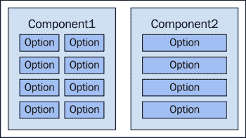

左边的组件的配置选项是右边组件的两倍。它也更难使用和维护。

只要没有性能问题影响到我们的用户，我们可以保留我们的配置选项。只需记住，为了消除性能瓶颈，我们可能不得不移除某些选项。配置的可变性不太可能成为我们性能问题的主要来源。随着我们的扩展和添加新特性，我们很容易过分追求。我们会在事后的回顾中意识到，在设计时我们创造了我们认为会有帮助的配置选项，但最终成了负担。如果没有实际的配置选项好处，就把可配置性换成性能。

## 替代性的性能

与配置的可变性相关的问题就是替代性。我们的用户界面表现良好，但随着用户基础的增长和更多特性的添加，我们会发现某些组件不能轻易地被其他组件替代。这可能是发展问题，我们希望设计一个新的组件来替换预先存在的某个组件。或者也许我们需要在运行时替换组件。

我们替换组件的能力主要取决于组件通信模型。如果新的组件能够像现有的组件一样发送/接收消息/事件，那么它就是一个相对直接的替代。然而，我们软件的许多方面并不是可替代的。为了性能，可能甚至没有可替换的组件。

随着我们的扩展，我们可能需要将更大的组件重构为更小、可替换的组件。这样做，我们引入了新的间接级别，以及性能损失。权衡小的性能损失，以获得有助于我们架构扩展的其他方面的可替代性。

## 地址可寻性的开发便利性

在我们的应用程序中为资源分配可寻址的 URI 确实使实现功能变得更加困难。我们实际上需要为应用程序暴露的每个资源都分配 URI 吗？可能不是。然而，为了保持一致性，几乎为每个资源分配 URI 是有意义的。如果我们没有一个一致且易于遵循的路由和 URI 生成方案，我们更有可能跳过为某些资源实现 URI。

几乎总是比省略 URI 更好，为应用中的每个资源分配 URI，更糟糕的是，根本不支持可寻址资源。URI 使我们的应用表现得像网络上的其他应用；所有用户的大本营。例如，也许 URI 生成和路由是我们应用中任何事物的常数——一个不可能发生的权衡。在几乎所有情况下，权衡开发便捷性与可寻址性。关于 URI 的开发便捷性问题可以在软件成熟时更深入地解决。

## 维护性对性能的影响

软件中功能开发的便捷性归根结底是开发团队及其扩展影响因素。例如，我们可能面临因预算原因招聘初级开发人员的压力。这种方法扩展的好坏取决于我们的代码。当我们关注性能时，我们可能会引入各种令人望而生畏的代码，相对缺乏经验的开发者将难以接受。显然，这阻碍了新功能开发的便捷性，如果困难，耗时更长。这显然不符合客户需求。

开发者不必总是为理解我们为解决代码特定区域的性能瓶颈所采取的非正统方法而挣扎。我们当然可以通过编写可理解的优质代码来帮助解决这个问题。也许甚至是文档。但我们不会不劳而获；如果我们想要支持团队整体在扩展过程中的发展，我们需要在短期内为培训和指导付出生产力代价。

在关键的、经常使用且不经常修改的代码路径上，权衡开发便捷性与性能。我们无法总是逃避性能所需的可憎之处，但如果隐藏得当，我们将会因为更常见的代码易于理解和自解释而受益。例如，低级 JavaScript 库表现良好，具有易于使用的连贯 API。但你如果看看一些底层代码，它们并不美观。那是我们收获——让其他人维护因性能原因而丑陋的代码。

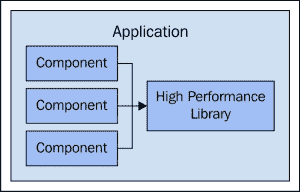

左侧的我们的组件遵循一致且易读的编码风格；它们都使用右侧的高性能库，从而在隔离难以阅读和理解的优化代码的同时，为我们的应用提供性能。

## 为了维护性而减少功能

当其他方法都失败时，我们需要退一步，全面审视我们应用的功能集。我们的架构能支持它们全部吗？有更好的替代方案吗？放弃我们投入了无数小时的架构几乎是没有意义的——但这种情况确实会发生。然而，大多数时候，我们会被要求引入一组具有挑战性的特性，这些特性违反了我们的一项或多项架构常数。

当这种情况发生时，我们正在破坏已经存在的稳定特性，或者我们在应用程序中引入了质量较差的东西。这两种情况都不好，而且与利益相关者合作找出必须去掉的内容是值得的，即使这会花费时间、让人头痛和咒骂。

如果我们花时间通过做出取舍来确定我们的架构，我们应该有一个站得住脚的理由，说明为什么我们的软件不能支持数百个特性。

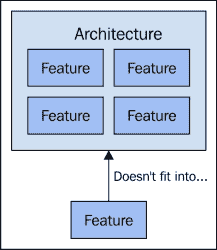

当一个架构达到极限时，我们无法继续扩展。关键是要理解那个临界点在哪里，这样我们才能更好地理解和与利益相关者沟通它。

## 利用框架

框架的存在是为了帮助我们使用一套连贯的模式来实现我们的架构。市面上有许多不同的框架，选择哪个框架取决于个人喜好和我们的设计需求。例如，某个 JavaScript 应用框架提供了大量的开箱即用功能，而另一个框架虽然功能更多，但我们可能并不需要其中大部分。

JavaScript 应用框架在大小和复杂性上各不相同。一些框架附带了完整的工具，而一些更倾向于机制而非政策。这些框架没有一个是为我们特定的应用而设计的。任何框架声称的能力都需要打折扣。框架宣传的功能适用于一般情况，而且非常简单。将其应用于我们架构的上下文是完全不同的。

话说回来，我们当然可以使用我们喜欢的某个框架作为设计过程的输入。如果我们真的很喜欢这个工具，而且我们的团队有使用它的经验，我们可以让它影响我们的设计决策。只要我们明白框架不会自动响应扩展影响因素——这部分取决于我们。

### 小贴士

花时间研究我们项目要使用的框架是值得的，因为选择错误的框架是一个代价高昂的错误。我们通常在实现了许多功能之后才意识到我们应该选择其他方案。最终结果是大量的重写、重规划、重培训和重文档化。更不用说第一次实现时浪费的时间。明智地选择你的框架，并警惕框架耦合。

# 框架与库的比较

既然有一个拥有我们所需一切的单体框架，为什么还要使用小型库的混合呢？库是我们的工具，如果它们满足我们架构的需求，那么当然可以使用它们。一些开发者因为低级工具带来的依赖性混乱而避开低级工具。实际上，即使我们利用的是涵盖一切的框架，这种情况也会发生。

归根结底，框架和库之间的区别对我们来说并不重要。创建一个第三方依赖噩梦不会很好地扩展。同样，独家使用一个工具并维护大量我们自己编写的代码也不会扩展得好。关键在于找到在依赖其他项目和自己重新发明轮子之间合适的平衡点。

## 一致地实现模式

我们用来帮助实现架构的工具，通过暴露出 JavaScript 应用程序中常见的模式来实现这一点。并且它们是一致地这样做。由于不断增加的功能集，我们的应用程序规模也在增长，我们可以一次又一次地使用相同的框架组件。框架还促进了我们自己实现的一致性模式。如果我们查看任何框架的内部实现，我们都会看到它有自己的通用组件；这些组件被扩展来为我们提供可用的组件。

## 性能是内置的

开源框架拥有最多的开发者查看代码，以及最多的项目在生产中使用该框架。它们从用户社区获得大量反馈，包括性能改进。第三方工具有正确的关注点，因为它们很可能是给定应用程序中使用最多的代码。将所有的性能结果都留给浏览器供应商和 JavaScript 库是不明智的。利用我们经常使用的组件背后的性能是明智的。

## 利用社区智慧

成功的 JavaScript 框架周围都有强大的社区支持。这比拥有健壮的文档更有效，因为我们可以随时提出问题。很可能，在我们自己的项目中，有人正在尝试做类似的事情，并且使用的是与我们相同的框架。开源项目就像一个知识引擎；即使我们需要的确切答案还没有出来，我们通常可以通过社区的智慧找到足够的信息来自行解决问题。

## 框架无法开箱即扩展

说一个框架比另一个框架扩展得更好是没有根据的。将**TODO**应用程序作为衡量框架扩展能力的一个基准几乎没有用处。我们编写 TODO 应用程序是为了熟悉框架，以及它与其他框架的比较。如果我们不确定哪个框架符合我们的风格，TODO 应用程序是一个不错的开始。

我们的目标是实现能够响应影响因素而良好扩展的东西。这些因素是独特且事先未知的。我们所能做的是预测未来可能遭遇的缩放影响因素。基于这些可能的影响因素以及我们正在构建的应用程序的性质，有些框架比其他框架更适合。框架帮助我们扩展，但它们不会为我们扩展。

# 总结

扩展 JavaScript 应用程序并不像扩展其他类型的应用程序那样。尽管我们可以使用 JavaScript 创建大规模的后端服务，但我们的关注点是在浏览器中与用户交互的应用程序的扩展。在产生一个可扩展架构的决策过程中，有一些指导我们决策过程的影响因素。

我们回顾了其中一些影响因素，以及它们自上而下流动的方式，为前端 JavaScript 开发创造了独特的挑战。我们研究了用户更多、功能更多、开发者更多所带来的影响；我们可以看到有很多需要考虑的东西。虽然浏览器正在成为一个强大的平台，我们将我们的应用程序交付给它，但它仍然具有其他平台不具备的限制。

设计和实现一个可扩展的 JavaScript 应用程序需要有一个架构。软件最终必须完成的事情只是设计的一个输入。缩放影响因素也很关键。从那里开始，我们解决考虑中的架构的不同视角。诸如组件组合和响应性等事情在我们的讨论中涉及到扩展时就会发挥作用。这些都是我们架构受到缩放影响因素影响的可观察方面。

随着这些缩放因子的随时间变化，我们使用架构视角作为工具来修改我们的设计，或产品以适应缩放挑战。下一章的重点将放在更详细地研究这些缩放影响因素。理解它们并制定出一个检查清单，将使我们能够实施一个能够响应这些事件的 JavaScript。
