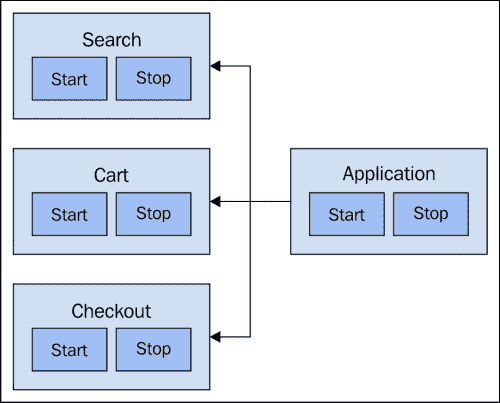
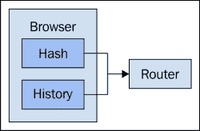
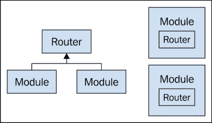
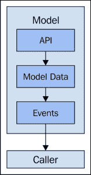
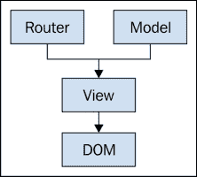
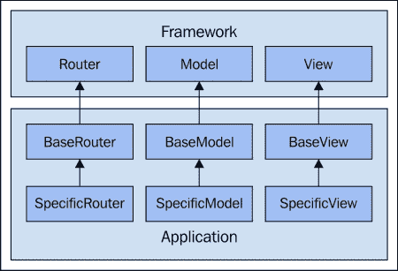
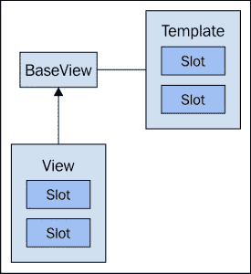
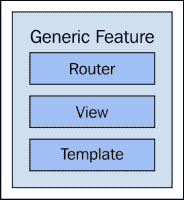
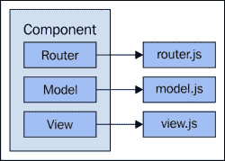

# 第三章： 组件组合

大规模的 JavaScript 应用程序可以看作是一系列相互通信的组件。本章的重点在于这些组件的组合，而下一章我们将探讨这些组件是如何彼此通信的。组合是一个很大的主题，也是与可扩展的 JavaScript 代码相关的。当我们开始考虑我们组件的组合时，我们会开始注意到我们设计中的一些缺陷；限制了我们根据影响者进行扩展的局限性。

组件的组合不是随机的——有一些在 JavaScript 组件中普遍存在的模式。我们将从本章开始探讨一些这些通用的组件类型，它们封装了在每个网络应用程序中都能找到的常见模式。理解组件实现模式对于以可扩展的方式扩展这些通用组件至关重要。

从纯粹的技术角度来看，正确地组合我们的组件是一回事，轻松地将这些组件映射到功能上是另一回事。对我们已经实现的组件来说，同样的挑战也成立。我们编写代码的方式需要提供一定程度的透明度，这样在运行时和设计时分解我们的组件并理解它们在做什么是可行的。

最后，我们将探讨将业务逻辑与我们的组件解耦的想法。这并不是什么新想法——关注分离已经存在很长时间了。JavaScript 应用程序的挑战在于它涉及很多东西——很难清楚地将与业务逻辑相关的其他实现关注区分开来。我们组织源代码的方式（相对于使用它们的组件）可以对我们的扩展能力产生巨大的影响。

# 通用组件类型

在当今这个时代，没有人会不借助库、框架或两者就着手构建大规模的 JavaScript 应用程序，这是极不可能的。让我们将这些统称为工具，因为我们更关心使用帮助我们扩展的工具，而不是工具之间的优劣。归根结底，开发团队需要决定哪种工具最适合我们正在构建的应用程序，个人喜好暂且不论。

选择我们使用的工具的指导因素是它们提供的组件类型以及它们的能力。例如，一个较大的网络框架可能拥有我们需要的所有通用组件。另一方面，一个函数式编程实用库可能提供我们需要的很多底层功能。如何将这些事物组合成一个可扩展的、连贯的功能，由我们来决定。

想法是找到暴露我们需要的组件的通用实现的工具。通常，我们会扩展这些组件，构建我们应用程序特有的特定功能。本节将介绍在一个大规模 JavaScript 应用程序中我们最需要的典型组件。

## 模块

几乎每种编程语言都以一种形式或另一种形式存在模块。除了 JavaScript。不过这几乎是不正确的——在撰写本文时，ECMAScript 6 处于最终草案状态，引入了模块的概念。然而，如今市场上已经有了一些工具，可以让我们在不依赖`script`标签的情况下模块化代码。大规模的 JavaScript 代码仍然是一件相对较新的事情。像`script`标签这样的东西并不是为模块代码和依赖管理这类问题而设计的。

RequireJS 可能是最受欢迎的模块加载器和依赖解析器。我们需要一个库只是为了将模块加载到我们的前端应用程序中，这反映了涉及的复杂性。例如，当考虑到网络延迟和竞争条件时，模块依赖关系并不是一件简单的事情。

另一个选择是使用像**Browserify**这样的转换器。这种方法越来越受欢迎，因为它允许我们使用 CommonJS 格式声明我们的模块。这种格式被 NodeJS 使用，即将到来的 ECMAScript 模块规范与 CommonJS 比与 AMD 更接近。优点是我们今天编写的代码与后端 JavaScript 代码的兼容性更好，也适应未来。

一些框架，如 Angular 或 Marionette，有自己的关于模块的想法——尽管是更抽象的想法。

这些模块更多的是关于组织我们的代码，而不是巧妙地将代码从服务器传输到浏览器。这类模块甚至可能更好地映射到框架的其他功能。例如，如果有一个中心化的应用程序实例用来管理我们的模块，框架可能提供一种从应用程序管理模块的手段。请看下面的图表：



使用模块作为构建块的全局应用程序组件。模块可以很小，只包含一个功能，也可以很大，包含几个功能

这让我们能在模块级别执行更高级的任务（例如禁用模块或使用参数配置它们）。本质上，模块代表特性。它们是一种允许我们将关于给定特性的某些东西封装起来的包装机制。模块帮助我们对应用程序进行模块化处理，通过为我们的特性添加高级操作，将特性视为构建模块。没有模块，我们就找不到这种有意义的处理方式。

模块的组成根据声明模块的机制不同而有所不同。一个模块可能是简单的，提供一个命名空间，从中可以导出对象。如果我们使用特定的框架模块风味，它可能会有更多内容。例如自动事件生命周期，或者执行** boilerplate** 设置任务的方法。

无论如何划分，可扩展 JavaScript 中的模块是创建更大块状结构的方法，也是处理复杂依赖关系的方法：

```js
// main.js
// Imports a log() function from the util.js model.
import log from 'util.js';
log('Initializing...');

// util.js
// Exports a basic console.log() wrapper function.
'use strict';

export default function log(message) {
    if (console) {
        console.log(message);
    }
}
```

虽然使用模块大小的构建块来构建大型应用程序更容易，但是将模块从应用程序中抽离并独立工作也更简单。如果我们的应用程序是单块的，或者我们的模块太多且过于细粒度，我们很难从代码中切除问题区域，或者测试进行中的工作。我们的组件可能独立运行得很好。然而，它可能在系统的其他地方产生负面影响。如果我们能够一次抽离一个拼图块，而不需要太多的努力，我们可以扩展故障排除过程。

## 路由器

任何大型 JavaScript 应用程序都有大量的可能的 URI。URI 是用户正在查看的页面的地址。用户可以通过点击链接导航到这个资源，或者他们可能会被我们的代码自动带到一个新的 URI，也许是对某些用户操作的响应。网络一直依赖于 URI，在大规模 JavaScript 应用程序出现之前就已经如此。URI 指向资源，而资源可以是几乎任何东西。应用程序越大，资源越多，潜在的 URI 也越多。

路由器组件是我们在前端使用的工具，用于监听 URI 变化事件并相应地响应。我们不再依赖后端 web 服务器解析 URI 并返回新内容。大多数网站仍然这样做，但在构建应用程序时，这种方法有几个缺点：



浏览器在 URI 发生变化时触发事件，路由器组件响应这些变化。URI 变化可以由历史 API 触发，或者由`location.hash`触发。

主要问题是我们希望 UI 是可移动的，也就是说，我们希望能够将其部署在任何后端，并且一切都能正常工作。由于我们不在后端组装 URI 的标记，所以在后端解析 URI 也没有意义。

我们声明性地在路由器组件中指定所有的 URI 模式。我们通常将这些称为**路由**。把路由想象成一张蓝图，而 URI 则是该蓝图的一个实例。这意味着当路由器接收到一个 URI 时，它可以将其与一个路由相关联。这就是路由器组件的责任。这在小型应用中很简单，但当我们谈论规模时，对路由器设计进行进一步的思考是必要的。

作为起点，我们必须考虑我们想要使用的 URI 机制。这两个选择基本上是监听哈希变化事件，或者利用历史 API。使用哈希-感叹号 URI 可能是最简单的方法。另一方面，现代浏览器都支持的`history` API 允许我们格式化不带哈希-感叹号的 URI——它们看起来像真正的 URI。我们正在使用的框架中的路由器组件可能只支持其中之一，从而简化了决策。一些支持这两种 URI 方法，在这种情况下，我们需要决定哪一种最适合我们的应用程序。

关于我们架构中路由的下一个考虑因素是如何响应路由变化。通常有两种方法。第一种是声明性地将路由绑定到回调函数。当路由器没有很多路由时，这是理想的。第二种方法是在路由被激活时触发事件。这意味着没有直接绑定到路由器上。相反，其他组件监听此类事件。当有大量路由时，这种方法有益，因为路由器不知道组件，只知道路由。

下面是一个显示路由器组件监听路由事件的示例：

```js
// router.js

import Events from 'events.js'

// A router is a type of event broker, it
// can trigger routes, and listen to route
// changes.
export default class Router extends Events {

    // If a route configuration object is passed,
    // then we iterate over it, calling listen()
    // on each route name. This is translating from
    // route specs to event listeners.
    constructor(routes) {
        super();

        if (routes != null) {
            for (let key of Object.keys(routes)) {
                this.listen(key, routes[key]);
            }
        }
    }

    // This is called when the caller is ready to start
    // responding to route events. We listen to the
    // "onhashchange" window event. We manually call
    // our handler here to process the current route.
    start() {
        window.addEventListener('hashchange',
            this.onHashChange.bind(this));

        this.onHashChange();
    }

    // When there's a route change, we translate this into
    // a triggered event. Remember, this router is also an
    // event broker. The event name is the current URI.
    onHashChange() {
        this.trigger(location.hash, location.hash);
    }

};

// Creates a router instance, and uses two different
// approaches to listening to routes.
//
// The first is by passing configuration to the Router.
// The key is the actual route, and the value is the
// callback function.
//
// The second uses the listen() method of the router,
// where the event name is the actual route, and the
// callback function is called when the route is activated.
//
// Nothing is triggered until the start() method is called,
// which gives us an opportunity to set everything up. For
// example, the callback functions that respond to routes
// might require something to be configured before they can
// run.

import Router from 'router.js'

function logRoute(route) {
    console.log('${route} activated');
}

var router = new Router({
    '#route1': logRoute
});

router.listen('#route2', logRoute);

router.start();
```

### 注意

为了运行这些示例，有些必要的代码被省略了。例如，`events.js`模块包含在本书的代码包中，它与示例不是那么相关。

为了节省空间，代码示例避免了使用特定的框架和库。实际上，我们不会自己编写路由器或事件 API——我们的框架已经做到了。我们 instead 使用纯 ES6 JavaScript，以说明与扩展我们的应用程序相关的要点。

当我们谈论路由时，我们还将考虑是否想要全局的、单块的路由器、每个模块的路由器，或其他组件。拥有单块路由器的缺点是，当它变得足够大时，它变得难以扩展，因为我们在不断添加功能和路由。优点是所有路由都在一个地方声明。单块路由器仍然可以触发所有组件可以监听的事件。

每个模块的路由方法涉及多个路由实例。例如，如果我们的应用程序有五个组件，每个都有自己的路由器。这种方法的优势是模块完全自包含。任何与这个模块合作的人都不需要查看其他地方来弄清楚它响应哪些路由。采用这种方法，我们还可以使路由定义与响应它们的函数之间的耦合更紧密，这可能意味着代码更简单。这种方法的缺点是我们失去了将所有路由声明在中央位置的集中性。请看下面的图表：



左边的路由器是全局的——所有模块都使用相同的实例来响应 URI 事件。右边的模块有自己的路由器。这些实例包含特定于模块的配置，而不是整个应用程序的配置。

根据我们所使用的框架的功能，路由器组件可能支持也可能不支持多个路由器实例。可能只有一个回调函数每条路由来实现。我们对路由器事件可能还有些不清楚的细微差别。

## 模型/集合

应用程序与之交互的 API 暴露实体。一旦这些实体被传输到浏览器，我们将存储这些实体的模型。集合是一组相关实体，通常是相同类型的。

我们使用的工具可能提供通用模型和/或集合组件，也可能有类似但名称不同的东西。建模 API 数据的目标是对 API 实体的大致模拟。这可能像将模型存储为普通的 JavaScript 对象，将集合存储为数组一样简单。

将 API 实体简单地存储在数组中的对象中的挑战在于，然后另一个组件负责与 API 通信，在数据变化时触发事件，并执行数据转换。我们希望在需要时能够使其他组件能够转换集合和模型，以履行他们的职责。但我们不想有重复的代码，最好是我们能够封装像转换，API 调用和事件生命周期这样的常见事物。看看下一个图表：



模型封装与 API 的交互，解析数据，以及在数据变化时触发事件。这使得模型外的代码更简单。

隐藏 API 数据如何加载到浏览器中，或者我们如何发出命令的细节，有助于我们在成长过程中扩展我们的应用程序。随着向 API 添加更多实体，我们代码的复杂性也在增长。我们可以通过将 API 交互限制在我们的模型和集合组件中来限制这种复杂性。

### 提示

**下载示例代码**

您可以从[`www.packtpub.com`](http://www.packtpub.com)下载您购买的所有 Pact Publishing 书籍的示例代码文件。如果您在其他地方购买了这本书，您可以访问[`www.packtpub.com/support`](http://www.packtpub.com/support)并注册，以便将文件直接通过电子邮件发送给您。

我们在模型和集合上面临的另一个可扩展性问题就是它们在大局中的位置。也就是说，我们的应用程序实际上只是一个由较小组件组成的大型组件。我们的模型和集合很好地映射到我们的 API，但不一定映射到功能。API 实体比特定功能更通用，通常被几个功能使用。这让我们提出了一个问题——我们的模型和集合应该放入哪个组件中？

下面是一个具体视图扩展通用视图的例子。相同的模型可以传递给两者：

```js
// A super simple model class.
class Model {
    constructor(first, last, age) {
        this.first = first;
        this.last = last;
        this.age = age;
    }
}

// The base view, with a name method that
// generates some output.
class BaseView {
    name() {
        return '${this.model.first} ${this.model.last}';
    }
}

// Extends BaseView with a constructor that accepts
// a model and stores a reference to it.
class GenericModelView extends BaseView {
    constructor(model) {
        super();
        this.model = model;
    }
}

// Extends GenericModelView with specific constructor
// arguments.
class SpecificModelView extends BaseView {
    constructor(first, last, age) {
        super();
        this.model = new Model(...arguments);
    }
}

var properties = [ 'Terri', 'Hodges', 41 ];

// Make sure the data is the same in both views.
// The name() method should return the same result...
console.log('generic view',
    new GenericModelView(new Model(...properties)).name());
console.log('specific view',
    new SpecificModelView(...properties).name());
```

一方面，组件可以完全与它们所使用的模型和集合相通用。另一方面，一些组件对于它们的要求是具体的——它们可以直接实例化它们的集合。在运行时配置通用组件与特定模型和集合只会对我们有利，当组件真正通用，并且在多个地方使用时。否则，我们不妨将模型封装在使用它们的组件内部。选择正确的方法有助于我们实现规模扩展。因为，我们并非所有的组件都完全通用或完全具体。

## 控制器/视图

根据我们使用的框架和团队遵循的设计模式，控制器和视图可以表示不同的事物。MV*模式和风格变化实在太多了，无法在规模上提供有意义的区分。微小的差异相对于类似但不同的 MV*方法有相应的取舍。对于我们讨论大规模 JavaScript 代码的目的，我们将它们视为同一类型的组件。如果我们决定在我们的实现中分离这两个概念，本节中的想法将适用于这两种类型。

让我们暂时使用“视图”这个术语，知道我们从概念上涵盖了视图和控制器。这些组件与其他几种组件类型交互，包括路由器、模型或集合以及模板，这些将在下一节中讨论。当发生某些事情时，用户需要被告知。视图的工作是更新 DOM。

这可能只是改变 DOM 元素的一个属性，或者涉及到渲染一个新的模板：



一个视图组件在路由和模型事件响应中更新 DOM

一个视图可以在多种事件发生时更新 DOM。路由可能已经改变。模型可能已经被更新。或者更直接一点，比如视图组件上的方法调用。更新 DOM 并不像人们想象的那么简单。我们需要考虑性能问题——当我们的视图被事件淹没时会发生什么？我们需要考虑延迟问题——这个 JavaScript 调用堆栈会运行多久，在停止并实际允许 DOM 渲染之前？

我们的视图的另一个职责是响应 DOM 事件。这些通常是由用户与我们的 UI 交互触发的。交互可能从我们的视图开始和结束。例如，根据用户输入或我们的某个模型的状态，我们可能会用一条消息更新 DOM。或者如果事件处理程序被**去抖**（debounced），我们可能会什么都不做。

防抖函数将多个调用合并成一个。例如，在 10 毫秒内调用`foo()` 20 次可能只会导致`foo()`的实现被调用一次。要了解更详细的解释，请查看：[`drupalmotion.com/article/debounce-and-throttle-visual-explanation`](http://drupalmotion.com/article/debounce-and-throttle-visual-explanation)。大多数情况下，DOM 事件被转换成其他东西，要么是一个方法调用，要么是另一个事件。例如，我们可能会调用模型的一个方法，或者转换一个集合。大多数情况下的最终结果是我们通过更新 DOM 来提供反馈。

这可以直接完成，也可以间接完成。在直接更新 DOM 的情况下，扩展起来很简单。而在间接更新，或者通过副作用更新的情况下，扩展变得更具挑战性。这是因为随着应用程序拥有更多的活动部件，形成原因和效果的心理地图变得越来越困难。

以下是一个示例，显示了一个视图监听 DOM 事件和模型事件。

```js
import Events from 'events.js';

// A basic model. It extending "Events" so it
// can listen to events triggered by other components.
class Model extends Events {
    constructor(enabled) {
        super();
        this.enabled = !!enabled;
    }

    // Setters and getters for the "enabled" property.
    // Setting it also triggers an event. So other components
    // can listen to the "enabled" event.
    set enabled(enabled) {
        this._enabled = enabled;
        this.trigger('enabled', enabled);
    }

    get enabled() {
        return this._enabled;
    }
}

// A view component that takes a model and a DOM element
// as arguments.
class View {
    constructor(element, model) {

        // When the model triggers the "enabled" event,
        // we adjust the DOM.
        model.listen('enabled', (enabled) => {
            element.setAttribute('disabled', !enabled);
        });

        // Set the state of the model when the element is
        // clicked. This will trigger the listener above.
        element.addEventListener('click', () => {
            model.enabled = false;
        });
    }
}

new View(document.getElementById('set'), new Model());
```

所有这些复杂性的好处是我们实际上得到了一些可重用的代码。视图对于它监听的模型或路由器是如何更新的是不关心的。它在意的只是特定组件上的特定事件。这实际上对我们有帮助，因为它减少了我们需要实现的特殊情况处理量。

在运行时生成的 DOM 结构，由于渲染所有我们的视图而产生，也需要考虑。例如，如果我们查看一些顶级 DOM 节点，它们内部有嵌套结构。正是这些顶级节点构成了我们布局的骨架。也许这是由主应用程序视图渲染的，而我们的每个视图都有与其的子关系。或者层次结构可能比这更深。我们正在使用的工具很可能有处理这些父子关系的机制。然而，请注意，庞大的视图层次结构难以扩展。

## 模板

模板引擎曾经主要存在于后端框架中。现在这种情况越来越少见，这要归功于前端可用的复杂模板渲染库。在大型 JavaScript 应用程序中，我们很少与后端服务讨论 UI 特定的事情。我们不会说，“这是一个 URL，为我渲染 HTML”。趋势是赋予我们的 JavaScript 组件一定程度的自主权——让他们渲染自己的标记。

组件标记与渲染它们的组件耦合是一件好事。这意味着我们可以轻松地判断 DOM 中的标记是如何生成的。然后我们可以诊断问题，调整大型应用程序的设计。

模板有助于为我们每个组件建立关注点的分离。在浏览器中渲染的标记主要来自模板。这使得标记特定的代码不会出现在我们的 JavaScript 中。前端模板引擎不仅仅是字符串替换的工具；它们通常还有其他工具来帮助我们减少要编写的样板 JavaScript 代码量。例如，我们可以在标记中嵌入条件语句和 for-each 循环，这取决于它们是否适合。

## 特定于应用程序的组件

我们迄今为止讨论的组件类型对于实现可扩展的 JavaScript 代码非常有用，但它们也非常通用。在实现过程中，我们不可避免地会遇到障碍——我们遵循的组件组合模式将不适用于某些功能。这时，我们应该退后一步，考虑可能需要向我们的架构中添加一种新类型的组件。

例如，考虑小部件的概念。这些都是主要关注呈现和用户交互的通用组件。假设我们的许多视图都在使用完全相同的 DOM 元素和完全相同的事件处理程序。在应用程序中的每个视图中重复它们是没有意义的。如果我们将其提取为公共组件，是不是会更好？一个视图可能过于复杂，所以也许我们需要一种新类型的小部件组件？

有时我们会为了组件化而创建组件。例如，我们可能会有一个组件，它将路由器、视图、模型/集合和模板组件粘合在一起，形成一个协调一致的单元。模块部分解决了这个问题，但它们并不总是足够。有时我们缺少一点编导，以便我们的组件进行通信。我们在下一章讨论通信组件。

# 扩展通用组件

我们经常在开发过程的后期发现，我们依赖的组件缺少我们需要的东西。如果我们使用的基组件设计得很好，那么我们可以扩展它，插入我们需要的新的属性或功能。在本节中，我们将通过一些场景，了解在应用程序中使用的一些常见的通用组件。

如果我们想要扩展我们的代码，我们需要尽可能利用这些基本组件。我们可能也希望在某个时候开始扩展我们自己的基本组件。有些工具比其他工具更好地促进通过实现这种特殊行为来扩展机制。

## 识别共同的数据和功能

在考虑扩展特定类型的组件之前，考虑所有组件类型中常见的属性和功能是有价值的。其中一些东西一开始就会很明显，而其他的则不那么明显。我们能否扩展在很大程度上取决于我们能否识别出组件之间的共性。

如果我们有一个全局应用程序实例，这在大型 JavaScript 应用程序中很常见，全局值和功能可以放在那里。然而，随着更多共同事物的发现，这可能会随着时间的推移变得不受控制。另一种方法可能是拥有几个全局模块，而不仅仅是一个单一的应用程序实例。或者两者都有。但从可理解性的角度来看，这种方法并不适用：



理想的组件层次结构不应超过三级。最高级别通常位于我们应用程序依赖的框架中

作为一个经验法则，我们应该避免在任何给定组件上扩展超过三级。例如，从我们正在使用的工具中扩展出通用视图组件的通用版本。这包括我们应用程序中每个视图实例都需要的属性和功能。这只是一个两级的层次结构，易于管理。这意味着如果任何给定组件需要扩展我们的通用视图，它可以在不复杂化事物的情况下做到这一点。三级应该是任何给定类型的最大扩展层次结构深度。这足以避免不必要的全局数据，超出这个范围会因为层次结构不易理解而出现扩展问题。

## 扩展路由组件

我们的应用程序可能只需要一个单一的路由器实例。即使在这种情况下，我们可能仍然需要重写通用路由器的某些扩展点。在有多个路由器实例的情况下，肯定会有我们不想重复的共同属性和功能。例如，如果我们应用程序中的每个路由都遵循相同的模式，只有细微的差别，我们可以在基础路由器中实现工具以避免重复代码。

除了声明路由外，当给定路由被激活时，还会发生事件。根据我们应用程序的架构，需要发生不同的事情。也许有些事情总是需要发生，无论哪个路由被激活。这就是扩展路由以提供我们自己的功能变得方便的地方。例如，我们必须验证给定路由的权限。对于我们来说，通过个别组件来处理这个问题并没有多大意义，因为这样在复杂的访问控制规则和大量路由的情况下，无法很好地扩展。

## 扩展模型/集合

我们的模型和集合，无论它们具体的实现方式如何，都将彼此共享一些共同属性-尤其是如果它们针对同一个 API，这通常是常见情况。给定模型或集合的具体内容围绕 API 端点、返回的数据和可采取的可能行动展开。我们可能会为所有实体 targeting 相同的基 API 路径，并且所有实体都有一些共享属性。与其在每一个模型或集合实例中重复自己，不如抽象出共同的属性。

除了在我们模型和集合之间共享属性，我们还可以共享通用行为。例如，某个给定的模型可能没有足够的数据来实现某个特性。也许这些数据可以通过转换模型得到。这类转换可能是通用的，并且可以抽象到基础模型或集合中。这真的取决于我们正在实现的特性的类型以及它们之间的相互一致性。如果我们发展迅速，并且有很多关于"非传统"特性的请求，那么我们更有可能在需要这些一次性更改的模型或集合的视图中实现数据转换。

大多数框架都处理了执行 XHR 请求以获取我们的数据或执行操作的细微差别。不幸的是，这还不是整个故事，因为我们的特性很少与单个 API 实体一对一映射。更有可能的是，我们将有一个需要多个相关集合和一个转换集合的特性。这种操作可以迅速变得复杂，因为我们必须处理多个 XHR 请求。

我们可能会使用承诺（promises）来同步这些请求的取回，然后在获得所有必要的来源后执行数据转换。

以下是一个示例，显示一个特定模型扩展通用模型，以提供新的取回行为：

```js
// The base fetch() implementation of a model, sets
// some property values, and resolves the promise.
class BaseModel {
    fetch() {
        return new Promise((resolve, reject) => {
            this.id = 1;
            this.name = 'foo';
            resolve(this);
        });
    }
}

// Extends BaseModel with a specific implementation
// of fetch().
class SpecificModel extends BaseModel {

    // Overrides the base fetch() method. Returns
    // a promise with combines the original
    // implementation and result of calling fetchSettings().
    fetch() {
        return Promise.all([
            super.fetch(),
            this.fetchSettings()
        ]);
    }

    // Returns a new Promise instance. Also sets a new
    // model property.
    fetchSettings() {
        return new Promise((resolve, reject) => {
            this.enabled = true;
            resolve(this);
        });
    }
}

// Make sure the properties are all in place, as expected,
// after the fetch() call completes.
new SpecificModel().fetch().then((result) => {
    var [ model ] = result;
    console.assert(model.id === 1, 'id');
    console.assert(model.name === 'foo');
    console.assert(model.enabled, 'enabled');
    console.log('fetched');
});
```

## 扩展控制器/视图

当我们在一个基础模型或基础集合中，常常会发现我们的控制器或视图之间有共享的属性。这是因为控制器和视图的职责就是渲染模型或集合数据。例如，如果同一个视图反复渲染相同的模型属性，我们可能可以把这部分内容移到一个基础视图中，然后从这个基础上扩展。那些重复的部分可能就在模板本身。这意味着我们可能需要考虑在基础视图中加入一个基础模板，如图所示。扩展这个基础视图的视图会继承这个基础模板。

根据我们可用的库或框架，以这种方式扩展模板可能并不可行。或者我们特性的性质可能使得这种实现变得困难。例如，可能没有通用的基础模板，但可能有很多更小的视图和模板可以插入到更大的组件中：



扩展基础视图的视图可以填充基础视图的模板，同时继承其他基础视图的功能

我们的视图还需要响应用户交互。它们可能会直接响应，或者将事件传递给组件层次结构的上层。无论哪种情况，如果我们的特性在某种程度上是一致的，我们都会希望把一些通用的 DOM 事件处理抽象到一个通用的基础视图中。这对于扩展我们的应用程序非常有帮助，因为当我们添加更多特性时，DOM 事件处理代码的增加量被最小化。

# 将特性映射到组件

现在我们已经了解了最常见的 JavaScript 组件以及我们希望在应用程序中使用它们时的扩展方式，是时候考虑如何将这些组件粘合在一起了。一个单独的路由器没什么用。一个独立的模型、模板或控制器也是如此。相反，我们想要这些东西一起工作，形成一个实现我们应用程序中特性的连贯单位。

为此，我们必须将我们的特性映射到组件上。我们也不能随意地进行这种映射——我们需要思考我们的特性中哪些是通用的，以及它们有哪些独特之处。这些特性属性将指导我们在生产可扩展性产品时的设计决策。

## 通用特性

组件组合最重要的方面可能是一致性和可重用性。在考虑我们应用程序面临的可扩展性影响时，我们会列出一个所有组件必须具备的特性的清单：比如用户管理、访问控制以及其他我们应用程序特有的特性。这还包括其他架构视角（在本书的剩余部分会有更深入的探讨），它们构成了我们通用特性的核心：



由我们框架中的其他通用组件组成的通用组件

我们应用程序中每个特性的通用方面都相当于一份蓝图。它们指导我们在构建更大的模块时如何组合。这些通用特性考虑到了帮助我们扩展的建筑因素。如果我们能将这些因素编码为聚合组件的一部分，我们将在扩展应用程序时更加得心应手。

使这项设计任务具有挑战性的是，我们必须从可扩展性架构的角度以及特性完整性的角度来考虑这些通用组件。如果每个特性都表现得一样，那就没问题了。如果每个特性都遵循一个相同的模式，那么在扩展时，天空就是极限。

但是 100%一致的特性功能是一种错觉，这一点对于 JavaScript 程序员来说比对于用户更加明显。这种模式之所以会崩溃，是出于必要的考虑。重要的是以一种可扩展的方式来应对这种崩溃。这就是为什么成功的 JavaScript 应用程序会不断地重新审视我们特性的通用方面，以确保它们反映现实。

## 特定特性

当需要实现某种不符合模式的功能时，我们面临的是一个可扩展性挑战。我们必须进行调整，并考虑向我们的架构引入此类功能所带来的后果。当模式被打破时，我们的架构需要改变。这不是一件坏事——这是必要的。我们扩展以适应这些新功能的能力的限制，在于我们现有特性的通用方面。这意味着我们不能对通用特性组件过于僵化。如果我们过于苛求，我们就是在为自己设置失败的局面。

在做出任何由于奇特功能而导致的草率建筑决策之前，想想具体的扩展后果。例如，新功能是否真的重要，它使用不同的布局，并需要与所有其他功能组件不同的模板？JavaScript 扩展艺术的状态是围绕找到我们组件组合要遵循的几种基本蓝图。其他一切都取决于在如何进行上的讨论。

# 分解组件

组件组合是一种创建秩序的活动；把小的部分组合成大的行为。在开发过程中，我们经常需要朝着相反的方向努力。即使开发完成后，我们也可以通过分解代码，观察它在不同上下文中运行来了解组件如何工作。组件分解意味着我们能够把系统拆开，以一种结构化的方式检查各个部分。

## 维护和调试组件

在应用程序开发的过程中，我们的组件积累了越来越多的抽象。我们这样做是为了更好地支持一个功能的需求，同时支持某些有助于我们扩展的建筑属性。问题在于，随着抽象的积累，我们失去了对组件运行情况的透明度。这不仅对于诊断和修复问题至关重要，而且也关系到代码学习的难易程度。

例如，如果有很多间接调用，程序员就需要花更长的时间来追踪原因到效果。在追踪代码上浪费的时间，降低了我们从开发角度扩展的能力。我们面临着两个相反的问题。首先，我们需要抽象来解决现实世界的功能需求和建筑约束。其次，由于缺乏透明度，我们无法掌握自己的代码。

下面是一个示例，展示了渲染组件和特性组件。特性使用的渲染器很容易被替代：

```js
// A Renderer instance takes a renderer function
// as an argument. The render() method returns the
// result of calling the function.
class Renderer {
    constructor(renderer) {
        this.renderer = renderer;
    }

    render() {
        return this.renderer ? this.renderer(this) : '';
    }
}

// A feature defines an output pattern. It accepts
// header, content, and footer arguments. These are
// Renderer instances.
class Feature {
    constructor(header, content, footer) {
        this.header = header;
        this.content = content;
        this.footer = footer;
    }

    // Renders the sections of the view. Each section
    // either has a renderer, or it doesn't. Either way,
    // content is returned.
    render() {
        var header = this.header ?
                '${this.header.render()}\n' : '',
            content = this.content ?
                '${this.content.render()}\n' : '',
            footer = this.footer ?
                this.footer.render() : '';

        return '${header}${content}${footer}';
    }
}

// Constructs a new feature with renderers for three sections.
var feature = new Feature(
    new Renderer(() => { return 'Header'; }),
    new Renderer(() => { return 'Content'; }),
    new Renderer(() => { return 'Footer'; })
);

console.log(feature.render());

// Remove the header section completely, replace the footer
// section with a new renderer, and check the result.
delete feature.header;
feature.footer = new Renderer(() => { return 'Test Footer'; });

console.log(feature.render());
```

一个可以帮助我们应对这两种相反的扩展影响因素的策略是可替代性。特别是我们组件或子组件可以多么容易地被其他东西替代。这应该是非常容易实现的。所以在我们引入层层抽象之前，我们需要考虑一下复杂组件能否很容易地被简单组件替代。这可以帮助程序员学习代码，也有助于调试。

例如，如果我们能够将一个复杂的组件从系统中取出来，用一个虚拟组件来替代，我们就可以简化调试过程。组件替换后错误消失，我们找到了有问题的组件。否则，我们可以排除一个组件，继续在其他地方寻找。

## 重构复杂组件

当然，说到比做到容易，尤其是面对截止日期时，实现组件的可替代性。一旦无法轻松用其他组件替换组件，是时候考虑重构我们的代码了。至少是那些使得可替代性变得不可行的部分。找到正确的封装级别和正确的透明度级别，这是一个平衡的行为。

在更细粒度的层次上，替代也有帮助。例如，假设一个视图方法又长又复杂。如果在执行该方法的过程中有几个阶段，我们想运行一些自定义内容，我们做不到。把一个单一的方法重构成几个方法会更好，每个都可以被覆盖。

# 可插拔的业务逻辑

并非我们所有的业务逻辑都需要在我们的组件内部，与外部世界隔离。相反，如果我们能将业务逻辑写成一组函数，那就更好了。从理论上讲，这为我们提供了关注点分离。组件在那里处理帮助我们扩展的具体架构问题，而业务逻辑可以插入到任何组件中。实际上，将业务逻辑从组件中分离出来并不简单。

## 扩展与配置

当我们构建组件时，可以采取两种方法。作为一个起点，我们有库和框架提供的工具。从那里，我们可以继续扩展这些工具，随着我们深入到特性的更深层次，变得更加具体。或者，我们可以为组件实例提供配置值。这些指导组件如何行为。

扩展那些本来需要配置的东西的优势在于，调用者不需要担心它们。如果我们能通过使用这种方法来解决问题，那就更好了，因为它会导致更简单的代码-尤其是使用组件的代码。另一方面，我们可能会有通用的功能组件，如果它们支持这个配置或那个配置选项，可以用于特定目的。这种方法的优势在于使用更简单的组件层次结构，以及更少的总体组件。

有时保持组件尽可能通用，在其可理解范围内，会更好。这样，当我们需要为特定功能使用通用组件时，我们就可以使用它，而无需重新定义我们的层次结构。当然，这会让调用该组件的复杂性增加，因为他们需要为其提供配置值。

这一切都是我们，即我们应用程序的 JavaScript 架构师，需要权衡的。我们是希望封装一切，配置一切，还是希望在这两者之间找到平衡？

## 无状态的业务逻辑

在函数式编程中，函数没有副作用。在某些语言中，这一特性被强制执行，在 JavaScript 中则不是。然而，我们仍然可以在 JavaScript 中实现无副作用的函数。如果一个函数接受参数，并且总是根据这些参数返回相同的输出，那么可以说这个函数是无状态的。它不依赖于组件的状态，也不会改变组件的状态。它只是计算一个值。

如果我们能建立一个以这种方式实现的业务逻辑库，我们就能设计出非常灵活的组件。我们不是直接在组件中实现这些逻辑，而是将行为传递给组件。这样，不同的组件就可以利用相同的无状态业务逻辑函数。

找到可以以这种方式实现的正确函数是一个棘手的问题，因为一开始就实现这些并不是一个好主意。相反，随着我们应用程序开发的迭代进行，我们可以使用这种策略来重构代码，将其转化为任何可以使用它们的组件共享的通用无状态函数。这导致以集中方式实现业务逻辑，并且组件小、通用，在各种上下文中可重用。

# 组织组件代码

除了以帮助我们的应用程序扩展的方式组合我们的组件外，我们还需要考虑我们源代码模块的结构。当我们刚开始一个项目时，我们的源代码文件往往很好地映射到客户浏览器中运行的内容。随着时间的推移，当我们积累更多功能和组件时，早期关于如何组织我们的源代码树的决定可能会稀释这种强烈的映射。

当我们追踪运行时行为到源代码时，涉及的心理努力越少越好。我们可以通过这种方式扩展到更稳定的功能，因为我们的精力更多地集中在当天的设计问题上——那些直接提供客户价值的事情：



图显示了将组件部分映射到其实现工件的图

在我们的架构背景下，代码组织的另一个方面是我们的隔离特定代码的能力。我们应该将我们的代码看作是我们的运行时组件，它们是自给自足的单元，我们可以开启或关闭它们。也就是说，我们应该能够找到给定组件所需的全部源代码文件，而无需四处寻找。如果一个组件需要，比如说，10 个源代码文件——JavaScript、HTML 和 CSS——那么理想情况下，这些都应该在同一个目录中找到。

当然，例外是所有组件都共享的通用基础功能。这些功能应该尽可能地靠近表面，这样很容易追踪我们的组件依赖关系；它们都指向层次结构的顶部。当我们的组件依赖关系到处都是时，扩展依赖图是一个挑战。

# 总结

本章向我们介绍了组件组合的概念。组件是可扩展的 JavaScript 应用程序的构建块。我们可能会遇到的常见组件包括模块、模型/集合、控制器/视图和模板等。尽管这些模式帮助我们实现了一定程度的一致性，但它们本身并不足以使我们的代码在各种缩放影响因素下运行良好。这就是为什么我们需要扩展这些组件，提供我们自己的通用实现，以便应用程序的具体功能可以进一步扩展和使用。

根据我们应用程序遇到的各种缩放因素，获取组件中通用功能的方法可能会有所不同。一种方法是不断扩展组件层次结构，并保持一切被封装和隐藏在外界之外。另一种方法是在创建组件时将逻辑和属性插入其中。后者的代价是使用这些组件的代码复杂度增加。

我们以查看如何组织源代码来结束本章，以便其结构更好地反映我们逻辑组件设计的情况。这有助于我们扩展开发工作，并将一个组件的代码与其他组件的代码隔离。在下一章中，我们将更详细地研究组件之间的空间。拥有独立站立的精心制作的组件是一回事，实现可扩展的组件通信是另一回事。
