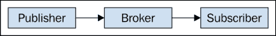
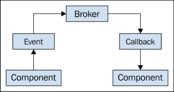
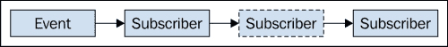
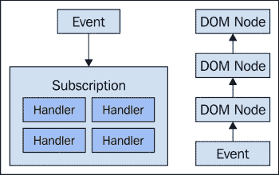
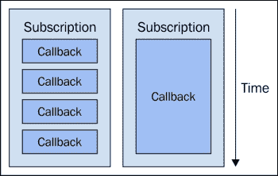
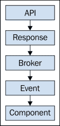
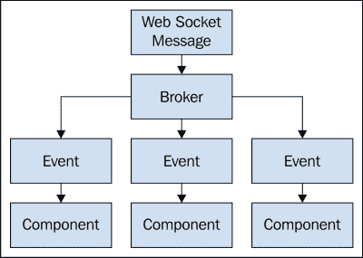
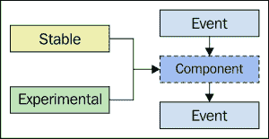
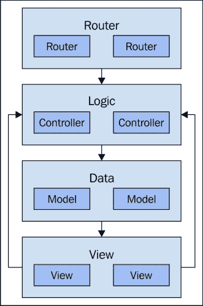

# 第四章：组件通信和职责

上一章重点讨论了组件的*是什么*——它们由什么组成以及*为什么*。这一章则专注于我们 JavaScript 组件之间的粘合剂——*如何*。如果我们设计的组件有特定的目的，那么它们需要与其他组件通信来实现更大的行为。例如，一个路由组件不太可能更新 DOM 或与 API 通信。我们有擅长这些任务的组件，所以其他组件可以通过与它们通信来请求它们执行这些任务。

我们将从探讨前端开发中常见的通信模型开始这一章。我们不太可能为组件间通信开发自己的框架，因为已经有许多健壮的库已经实现了这一点。从 JavaScript 扩展的角度来看，我们更感兴趣的是我们应用程序中选择的通信模型如何阻止我们扩展，以及可以采取什么措施。

给定组件的责任影响它与我们的组件以及我们无法控制的服务的通信，比如后端 API 和 DOM API。一旦我们开始实现我们应用程序的组件，层次开始显现出来，如果明确指出，这些对于可视化通信流程很有用。这允许我们预见到未来组件通信扩展问题。

# 通信模型

有多种通信模型我们可以用来实现组件间的通信。最简单的就是方法调用，或者函数调用。这种方法最直接，实现起来也最容易。然而，一个直接调用另一个方法组件之间也有很强的耦合关系。这种耦合关系无法扩展到几个组件以上。

相反，我们需要在组件之间建立一个间接层；一种从一个组件到另一个组件调解通信的东西。这有助于我们扩展组件间的通信，因为我们不再直接与其他组件通信。相反，我们依赖我们的通信机制来完成消息传递。这种通信机制的两种流行模型是消息传递和事件触发。让我们比较一下这两种方法。

## 消息传递模型

消息传递通信模型在 JavaScript 应用程序中非常普遍。例如，消息可以从一台机器上的一个进程传递到另一个进程；它们可以从一台主机传递到另一台主机，或者在同一个进程中传递。尽管消息传递有些抽象，但它仍然是一个相当低层次的概念——有很大的解释空间。它是在两个通信组件之间提供高级抽象的机制。

例如，**发布-订阅**是消息传递通信模型的一个更具体类型。实现这些消息的机制通常称为经纪人。一个组件将订阅特定主题的消息，而其他组件将在该主题上发布消息。关键的设计特点是组件之间彼此不知晓。这促进了组件之间的松耦合，当组件很多时，有助于我们进行扩展。



这展示了一个使用经纪人将发布消息传递给订阅者的发布-订阅模型。

另一种消息传递抽象是**命令-响应**。在这里，一个组件向另一个组件发出命令并获取一个响应。在这个场景中，耦合度稍微紧了一些，因为调用者是针对一个特定的组件来执行命令。

然而，这仍然比直接命令调用更受欢迎，因为我们仍然可以轻松地替代调用者和接收者。

## 事件模型

我们经常听说用户界面代码是事件驱动的，也就是说，某个事件发生，导致 UI 重新渲染一个部分。或者，用户在 UI 上执行某些操作，触发一个事件，我们的代码必须解释并对其采取行动。从通信的角度来看，UI 只是一堆声明性的视觉元素；被触发的事件以及响应这些事件的回调函数。

这就是为什么发布-订阅模型非常适合 UI 开发。我们开发的大多数组件将触发一种或多种事件类型，而其他组件将订阅这种事件类型并在其触发时运行代码。在较高层次上，大多数组件之间的通信方式就是这样——通过事件，这实际上就是发布-订阅。

从事件和触发机制的角度来说，而不是消息和发布-订阅机制，是有道理的，因为这更符合 JavaScript 开发者的熟悉术语。例如，那里有 DOM 及其整个事件系统。它们是与 Ajax 调用和`Promise`对象相关联的异步事件，然后还有我们应用程序利用的框架自定义的事件系统。



事件是由一个组件触发的，而另一个监听该事件的组件执行回调；这个过程是由事件经纪人机制组织的。

毋庸置疑，所有通过我们的应用程序组件触发事件的独立事件系统使得难以心理上把握给定动作实际发生了什么。这确实是一个扩展问题，本章的各种部分将深入探讨使我们能够扩展组件通信的解决方案。

# 通信数据架构

事件数据并非是不可透明的—它包含着我们的回调函数用来做出决策的数据。有时，这些数据是不必要的，可以被回调函数安全地忽略。然而，我们不想一开始就决定后来添加的某些回调函数不需要这些数据。这是我们帮助通信机制扩展的东西—在正确的地方提供正确的数据。

数据不仅需要准备好供每个回调函数消费，而且需要有一个可预测的结构。我们将探讨建立事件名称本身以及传递给处理程序函数的数据的命名约定的方法。通过确保所需的事件数据存在且不太可能被误解，我们可以使组件间的通信更加透明，从而更具扩展性。

## 命名约定

提出有意义的名称是困难的，尤其是当有很多东西需要命名，就像事件一样。一方面，我们希望事件名称具有含义。这有助于我们扩展，因为仅仅通过查看事件名称和其他什么也不做，就能找到意义。另一方面，如果我们试图给事件名称加载过多的意义，那么快速解读事件名称的好处就会丧失。

拥有良好、简短且有意义的事件名称的主要关注点是那些处理这些事件的开发者。想法是，当他们的代码在反应事件时，他们可以快速地构建出一个事件流程的心理地图。请注意，这只是有助于整体可扩展事件架构的众多小实践之一，但无论如何它都是重要的。

例如，我们可能有一个基本事件类型，以及该事件的更具体版本。我们可以有这些基本事件类型的几个，还有几个更具体的实例来覆盖更直接的场景。如果我们的事件名称和类型过于具体，这意味着我们实际上无法重用它们。这也意味着开发者需要处理更多的事件。

## 数据格式

除了事件名称本身，还有事件载荷。这应该总是包含有关触发的事件的数据，以及可能有关触发它们的组件的数据。关于事件数据最重要的记忆点是，它应该总是包含与订阅这些类型事件的处理程序相关的数据。通常，回调函数可能会根据事件数据中的某个属性的状态决定什么都不做，忽略该事件。

例如，如果在每个回调函数中我们都要对组件进行查找，只是为了获取做出决策或执行进一步操作所需的数据，那么这实际上并不是可扩展的。当然，猜测需要什么数据并不容易。如果我们知道这些数据，我们就可以直接调用函数，省去一开始就需要事件触发机制的麻烦。这个想法是为了松耦合，但同时也要提供可预测的数据。

以下是事件数据可能的样子的一个简化示例：

```js
var eventData = {
    type: 'app.click',
    timestamp: new Date(),
    target: 'button.next'
};
```

在尝试确定触发事件时与给定事件相关的数据时，一个有用的练习是思考在处理程序内部可以导出什么，以及处理程序几乎永远不需要什么。例如，不建议计算事件数据，然后到处传递。如果处理程序可以计算它，它应该承担这个责任。如果我们开始看到重复的代码，那么这就是另一个故事，是时候开始考虑常见的事件数据了。

## 常见数据

事件数据将始终包含触发事件的组件的数据—可能是对组件本身的引用。这是一个不错的选择，因为我们今天所知道的一切就是事件被触发了—我们不知道随后的回调函数会想要对这一事件做什么。所以，只要不造成混淆或误导，给我们的回调函数传递很多数据是好的。

所以，如果我们知道同一类型的组件将始终触发相同类型的事件，我们可以相应地设计我们的回调，期望同样的数据总是存在。我们可以使事件数据更加通用，并向回调函数提供有关事件本身的数据。例如，有像时间戳、事件状态等东西—这些与组件无关，而与事件有关。

以下是一个示例，展示了定义所有扩展它的事件的常见数据的基本事件：

```js
// click-event.js
// All instances will have "type" and "timestamp"
// properties, plus any passed-in properties. What's
// important is that anything using "ClickEvent"
// knows that "type" and "timestamp" will always be
// there.
export default class ClickEvent {

    constructor(properties) {
        this.type = 'app.click';
        this.timestamp = new Date();
        Object.assign(this, properties);
    }

};

// main.js
import ClickEvent from 'click-event.js';

// Create a new "ClickEvent" and pass it some properties.
// We can override some of the standard properties,
// and pass it new ones.
var clickEvent = new ClickEvent({
    type: 'app.button.click',
    target: 'button.next',
    moduleState: 'enabled'
});

console.log(clickEvent);
```

再次，不要一开始就试图在数据重用上表现得很聪明。让重复发生，然后处理它。更好的方法是创建一个基本事件结构，这样一旦找到重复的属性，就很容易将它们移到公共结构中。

# 可追踪的组件通信

大型 JavaScript 应用程序最大的挑战之一是保持一个关于事件开始和结束的心理模型，换句话说，就是追踪事件在我们组件中的流动。不可追踪的代码使我们的软件的可扩展性面临风险，因为我们无法预测给定事件发生后会发生什么。

在开发过程中，我们可以使用多种策略来减轻确定事件流程的痛苦，甚至可能修改设计来简化事情。简洁性是可以扩展的，我们无法简化我们不理解的事物。

## 订阅事件

发布-订阅消息模型的一个好处是我们可以介入并添加一个新的订阅。这意味着如果我们不确定某事如何工作，我们可以从各个角度向问题抛出事件回调函数，直到我们更好地了解实际发生的情况。这是一个黑客工具，支持黑客攻击我们软件的工具帮助我们扩展，因为我们在赋予开发者自行解决问题的权力。如果某件事不清晰，当代码容易受到攻击时，他们更有可能自己找出答案。



在特定点或按特定顺序订阅事件可以改变事件的生命周期。拥有这种能力很重要，但如果过度使用，会导致不必要的复杂性。

在极端情况下，我们甚至可能需要使用这种订阅方法来修复生产系统中的某个故障。例如，假设一个回调函数能够停止一个事件的执行，取消任何进一步的处理程序的运行。在我们的代码中触发的事件具有这些类型的入口点是件好事。

## 全局日志事件

响应触发事件的回调函数可以在内部记录消息。然而，有时我们需要从事件机制本身的角度进行日志记录。例如，如果我们正在处理一些复杂的代码，我们需要知道我们的回调函数相对于其他回调函数何时被调用。事件触发机制应该有一个选项来处理生命周期日志。

这意味着对于任何触发的事件，我们可以看到关于该事件的日志信息，与响应事件的代码无关。我们将这些称为元事件——关于事件的事件。例如，回调运行之前的触发时间、回调运行之后的触发时间以及没有更多回调时的触发时间。这为我们在回调中实现的日志记录提供了一些急需的上下文，以追踪我们的代码。

下面是一个启用了日志的事件代理的示例：

```js
// events.js
// A simple event broker.
export default class Events {

    // Accepts a "log()" function when created,
    // used when triggering events.
    constructor(log) {
        this.log = log;
        this.listeners = {};
    }

    // Calls all functions listening to event "name", passing
    // "data" to each. If the "log()" function was provided to
    // the broker when created, then it logs BEFORE each callback
    // is called, and AFTER.
    trigger(name, data) {
        if (name in this.listeners) {
            var log = this.log;
            return this.listeners[name].map(function(callback) {
                log && console.log('BEFORE', name);

                var result = callback(Object.assign({
                    name: name
                }, data));

                log && console.log('AFTER', name);

                return result;
            });
        }
    }
};

// main.js
import Events from 'events.js';

// Two event callback functions that log
// data. The second one is async because it
// uses "setTimeout()".
function callbackFirst(data) {
    console.log('CALLBACK', data.name);
}

function callbackLast(data) {
    setTimeout(function() {
        console.log('CALLBACK', data.name);
    }, 500);
}

var broker = new Events(true);

broker.listen('first', callbackFirst);
broker.listen('last', callbackLast);

broker.trigger('first');
broker.trigger('last');

//
// BEFORE first
// CALLBACK first
// AFTER first
// BEFORE last
// AFTER last
// CALLBACK last
//
// Notice how we can trace the event broker
// invocation? Also note that "CALLBACK last"
// is obviously async because it's not in between
// "BEFORE last" and "AFTER last".
```

## 事件生命周期

不同的事件触发机制具有不同的事件生命周期，理解每个机制如何工作以及如何控制它们是值得的。我们从查看 DOM 事件开始。我们 UI 中的 DOM 节点形成了一棵树结构，任何一个节点都可以触发一个 DOM 事件。如果这个事件有直接附着在触发节点上的处理函数，它们将被执行。然后，事件将向上传播，重复寻找处理函数的过程，然后继续向上直到达到文档节点。

我们的处理函数实际上可以改变 DOM 事件的默认传播行为。

例如，如果我们不想让 DOM 树中更高层次的处理程序运行，较低层次的处理程序可以阻止事件的传播。



对比不同框架中的组件事件系统的事件处理方法，以及由浏览器处理的字符串事件（DOM 事件）。

我们需要关注的另一个重要的事件触发机制是我们正在使用的框架。JavaScript 作为一种语言，没有通用的事件触发系统，只有针对 DOM 树、Ajax 调用和 Promise 对象的专用系统。内部这些都是在使用相同的任务队列；它们只是以使它们看起来是独立系统的方式暴露出来。这就是我们正在使用的框架介入并提供必要抽象的地方。这类事件分发器相当简单；给定事件的订阅者按 FIFO 顺序执行。其中一些事件系统支持更高级的生命周期选项，在本节中讨论，如全局事件日志和早期事件终止。

# 通信开销

直接在组件上调用方法的一个优点是，涉及的开销非常小。当所有组件间的通信都通过事件触发机制来中介时，至少会有一点点开销。实际上，这种间接开销几乎注意不到；是其他开销因素可能导致可扩展性问题。

在这一节中，我们将探讨事件触发频率、回调执行以及回调复杂度。这三个因素都可能使得软件性能下降到无法使用的地步。

## 事件频率

当我们的软件只有少数几个组件时，事件频率有一个基本限制。事件频率可能迅速变成问题的是当有很多组件，其中一些对事件做出响应。这意味着，如果用户在快速而高效地做某事，或者有多个 Ajax 响应同时到达，我们需要一种防止这些事件阻塞 DOM 的方法。

JavaScript 的一个挑战是它是单线程的。有 web workers，但那些远远超出了本书的范围，因为它们引入了一个全新的架构问题类别。假设用户在一秒内点击了四次某物。在正常情况下，这对我们的事件系统来说不是什么大问题。但是，假设在他们这样做的同时有一个昂贵的 Ajax 响应处理程序正在运行。最终，UI 将变得无响应。

为了避免 UI 变得无响应，我们可以对事件进行节流。这意味着对回调执行的频率加以限制。所以，不是一完成一个就进行下一个，而是完成一个后，休息几毫秒再进行下一个。这样节流的好处是，它给了待处理的 DOM 更新或者待处理的 DOM 事件回调函数运行的机会。缺点是，长运行的更新或其他代码可能会对我们的事件生命周期产生负面影响。

下面是一个示例，展示了事件代理对触发的事件进行节流到特定时间频率的例子：

```js
// events.js
// The event broker. Sets sets the threshold
// for event triggering frequency to 100
// milliseconds.
export default class Events {

    constructor() {
        this.last = null;
        this.threshold = 100;
        this.size = 0;
        this.listeners = {};
    }

    // Triggers the event, but only if the it meets the
    // frequency threshold.
    trigger(name, data) {
        var now = +new Date();

        // If we're passed the wait threshold, or we've never
        // triggered an event, we can call "_trigger()", where
        // the event callback functions are processed.
        if (this.last === null || now - this.last > this.threshold) {
            this._trigger(name, data);
            this.last = now;
        // Otherwise, we've triggered something recently, and we
        // need to set a timeout. The "size" multiplier is
        // for spreading out the lineup of triggers.
        } else {
            this.size ++;
            setTimeout(() => {
                this._trigger(name, data);
                this.size --;
            }, this.threshold * this.size || 1);
        }
    }

    // This is the actual triggering mechanism, called by
    // "trigger()" after it checks the frequency threshold.
    _trigger(name, data) {
        if (name in this.listeners) {
            return this.listeners[name].map(function(callback) {
                return callback(Object.assign({
                    name: name
                }, data));
                return result;
            });
        }
    }

};

//main.js
import Events from 'events.js';

function callback(data) {
    console.log('CALLBACK', new Date().getTime());
}

var broker = new Events(true);

broker.listen('throttled', callback);

var counter = 5;

// Trigger events in a tight loop. This will
// cause the broker to throttle the callback
// processing.
while (counter--) {
    broker.trigger('throttled');
}
//
// CALLBACK 1427840290681
// CALLBACK 1427840290786
// CALLBACK 1427840290886
// CALLBACK 1427840290987
// CALLBACK 1427840291086
//
// Notice how the logged timestamps in each
// callback are spread out?
```

## 回调执行时间

虽然事件触发机制在一定程度上可以控制回调函数何时执行，但我们并不一定能控制回调会花费多少时间完成。从事件系统的角度来看，每个回调函数都是一个运行到完成的单线程小黑盒——这是 JavaScript 的单线程特性所决定的。如果一个具有破坏性的回调函数被抛给事件机制，我们如何知道哪个回调出了问题，以便于我们可以诊断和修复它？

解决这个问题有两种技术可以采用。如章节前面所提到的，事件触发机制应该有一个简单的方法来开启全局事件日志。从那里，我们可以推算出任何给定回调运行的时间，假设我们有开始和完成的时间戳。但这并不是强制回调时间的最有效方法。

另一种技术是在给定回调函数开始运行时设置一个超时函数。当超时函数运行，比如说一秒后，它会检查相同的回调是否仍在运行。如果是，它可以明确地抛出一个异常。这样，当回调执行时间过长时，系统会明确地失败。

这种方法还有一个问题——如果回调卡在一个紧密循环中怎么办？我们的监控回调将永远没有机会运行。



比较执行时间短的回调和执行时间长的回调，后者更新 DOM 或处理排队 DOM 事件的灵活性不大

## 回调复杂性

当所有其他方法都失败时，我们作为大型 JavaScript 应用程序的架构师，需要确保事件处理器的复杂性处于适当水平。过多的复杂性意味着潜在的性能瓶颈和 UI 冻结——这是不好的用户体验。如果回调函数太细粒度，或者事件本身也是，我们仍然会面临性能问题，因为事件触发机制本身增加了开销——需要处理更多的回调意味着更多的开销。

大多数支持组件间通信的 JavaScript 框架中找到的事件系统的灵活性是一件好事。框架默认会触发它认为重要的事件。这些可以被忽略，而对我们没有可观测的性能损失。然而，它们也允许我们根据需要触发我们自己的事件。所以如果我们发现过了一段时间，我们过度细化了我们的事件，我们可以稍微回退一些。

一旦我们掌握了应用程序中合适的事件粒度，我们可以调整我们的回调函数以反映这一点。我们甚至可以开始以这样的方式编写我们的小回调函数，使它们可以用来组合提供更粗粒度功能的高级函数。

以下是一个显示触发其他事件的事件回调函数以及监听这些事件的更专注的函数的示例：

```js
import Events from 'events.js';

// These callbacks trigger "logic" events. This
// small indirection keeps our logic decoupled
// from event handlers that might have to perform
// other boilerplate activities.
function callbackFirst(data) {
    data.broker.trigger('logic', {
        value: 'from first callback'
    });
}

function callbackSecond(data) {
    data.broker.trigger('logic', {
        value: 'from second callback'
    });
}

var broker = new Events();

broker.listen('click', callbackFirst);
broker.listen('click', callbackSecond);

// The "logic" callback is small, and focused. It
// doesn't have to worry about things like DOM
// access or fetching network resources.
broker.listen('logic', (data) => {
    console.log(data.name, data.value);
});

broker.trigger('click');
//
// logic from first callback
// logic from second callback
```

# 通信责任区域

当我们思考 JavaScript 组件通信时，查看外部世界以及我们的应用程序与之接触的边缘是有帮助的。到目前为止，我们主要关注的是组件间的通信——我们的组件是如何与同一 JavaScript 应用程序中的其他组件进行交流的？组件间的通信并不会自发产生，也不会就此结束。可扩展的 JavaScript 代码需要考虑流入和流出应用程序的事件。

## 后端 API

明显的起点是后端 API，因为它定义了我们应用程序的领域。前端实际上只是 API 最终真相的伪装。当然，它不仅仅是那样，但 API 数据最终确实限制了我们应用程序可以和不可以做的事情。

在组件和责任方面，思考哪些组件负责与后端直接通信是有帮助的。当应用程序需要数据时，这些组件将启动 API 对话，获取数据，并在到达时让我知道，这样我就可以将其转交给另一个组件。实际上，与直接与 API 通信的组件相关的组件间通信还是相当多的。

例如，假设我们有一个集合组件，为了填充它，我们必须调用一个方法。集合知道它需要填充自己，或者为自己创建吗？更有可能是其他组件启动了集合的创建，然后要求它从 API 中获取一些数据。虽然我们知道这个发起组件不会直接与 API 交谈，但我们还知道它在通信中扮演着重要的角色。

当扩展到许多组件时，考虑这一点很重要，因为它们都应该遵循一个可预测的模式。



前端的事件经纪人，直接或间接地将 API 响应及其数据转换为组件可以订阅的事件

## WebSocket 更新

WebSocket 连接在 Web 应用程序中消除了长轮询的需要。现在它们被更频繁地使用，因为浏览器对这项技术有强烈的支持。为后端服务器支持 WebSocket 连接也有很多库。具有挑战性的部分是账本记录，它允许我们检测到变化并通过发送消息通知相关会话。

抛开后端复杂性，WebSocket 确实在前端解决了很多软实时更新问题。WebSocket 是与后端的双向通信通道，但它们真正闪耀的地方在于接收更新，即某个模型改变了状态。

这允许我们的任何组件在数据来自此模型时重新渲染自己。

挑战的部分是，在任何给定的前端会话中，我们只允许有一个 WebSocket 连接。这意味着我们的处理程序函数需要弄清楚如何处理这些消息。您可能还记得，在章节开头，当我们讨论事件数据，以及事件名称的意义和它们数据结构的软实时更新时。WebSocket 消息事件是为什么这很重要的一个好例子。我们需要弄清楚如何处理它，我们收到的 WebSocket 消息类型会有很多变化。

### 注意

由于 WebSocket 连接是状态的，它们可能会断开。这意味着我们将不得不面对实现重新连接断开 Socket 连接的额外挑战。

让一个回调函数处理所有这些 WebSocket 消息的处理，甚至到 DOM，这是一个糟糕的主意。一种方法可能是拥有多个处理程序，每个处理程序针对每种特定的 WebSocket 更新类型。这将很快变得无法控制，因为会有很多回调函数需要运行，从责任上讲，很多组件将不得不与 WebSocket 连接紧密耦合。

如果组件不在乎更新数据是否来自 WebSocket 连接呢？它关心的只是数据发生了变化。也许我们需要为关心数据变化的组件引入一种新类型的事件。然后，我们的 WebSocket 处理程序只需要将消息转换为这些类型的事件。这是一种可扩展的 WebSocket 通信方法，因为我们可以完全移除 WebSocket，而实际上不会影响系统的很多部分。



事件将一种 WebSocket 消息转换为实体特定的事件，因此只有感兴趣的组件需要订阅

## 更新 DOM

我们的组件需要与 DOM 交互。这是不言而喻的——它是在浏览器中运行的 Web 应用程序。认真考虑一下与 DOM 交互的组件和那些不交互的组件是值得的。这些通常是**视图**组件，因为它们将我们应用程序的数据转换为用户可以在他们的浏览器窗口中查看的内容。

这些类型的组件实际上更难以扩展，主要是因为它们事件流的双向性质。增加这一挑战的是，当对一些新代码应该放在哪里有疑问时，通常会放在视图中。然后，当我们的视图过载时，我们开始在控制器或工具中放置代码，谁知道还会放在哪里。必须有更好的方法。

让我们花一分钟考虑视图事件通信。首先，有传入事件。这些事件告诉视图我们的数据发生了什么，它应该更新 DOM。顺从地，它就这样做了。这种方法实际上非常可靠，当视图监听一个组件的事件时，它工作得很好。随着我们的应用程序扩展以适应更多功能和改进，我们的视图必须开始自己找出答案。当视图更愚蠢时，它们会工作得更好。

例如，最初负责在数据事件响应中渲染一个元素的视图现在必须做更多的事情。在完成这件事之后，它需要计算一些派生值，并更新另一个元素。这样使视图“更智能”的过程逐渐失控，直到我们无法再扩展。

从通信的角度来看，我们希望将视图视为数据与 DOM 的简单一对一绑定。如果这个原则从未被违反，那么当数据发生变化时，我们更容易预测会发生什么，因为我们知道哪些视图会监听这些数据，以及它们绑定的 DOM 元素。

现在让我们来看一下另一个方向上的绑定——监听 DOM 的变化。在这里，挑战再次出现，我们倾向于使我们的视图变得智能。当输入数据出现问题时，我们会在 DOM 事件触发的视图事件处理程序中加载本应在其他地方完成的责任。当视图更愚蠢时，它们会工作得更好。它们应该将 DOM 事件转换为任何其他组件都可以监听的应用特定事件，就像我们对待 WebSocket 消息事件一样。那些实际启动某些业务流程的“更智能”的组件并不关心动作的原因是否来自 DOM。这有助于我们通过创建更少的通用组件来扩展，这些组件实际上并不做太多的事情。

# 松耦合通信

当组件间的通信耦合度较低时，在遇到需要扩展的影响因素时，我们可以更容易地进行适应。首先，一个良好的事件驱动的组件间通信设计使我们能够移动组件。我们可以移除一个有故障或表现不佳的组件，并将其替换为另一个。不能这样替换组件意味着我们将不得不在原地修复组件；这对于软件交付来说风险更大，从开发角度来看，这也是一个扩展瓶颈。

松耦合的组件间通信的另一个好处是，当出错时，我们可以隔离有问题的组件。我们可以防止一个组件中发生的异常影响到其他组件的状态，当用户尝试做其他事情时，这会导致更多的问题。像这样隔离问题有助于我们扩展响应以修复有问题的组件。

## 替换组件

根据给定组件触发和响应的事件，我们应该能够轻松地将组件替换为不同版本。我们仍然需要弄清楚组件的内部工作原理，因为很可能我们并不想完全改变它。但这是更容易的部分——实现组件的难点在于将它们相互连接。可扩展的组件实现意味着使这种连接尽可能易于接近和一致。

那么，组件可替代性为什么如此重要呢？我们会认为，由几个相互连接的组件组成的稳定代码不需要频繁更改，如果需要更改的话。从这种观点来看，当然可替代性被降低了——如果你不使用它，为什么还要担心呢？这种思维方式的问题在于，如果我们认真对待扩展 JavaScript 代码的规模，我们不能对一些组件应用原则而忽视其他组件。

实际上，对稳定代码重构的抵触并不一定是一件好事。例如，如果我们有一些新想法，这些想法可能需要我们对稳定组件进行重构，那么这种抵触实际上可能会阻碍我们。我们所有组件之间的可替代性为我们带来的好处是在实施新想法时具有可扩展性。如果通过替换稳定组件并引入新实现来实验很容易，那么我们更有可能将改进的设计理念融入到产品中。

替换组件不仅仅是设计时的活动。我们可以引入可变性，其中将有许多可能填充空白组件的可能性，然后在运行时选择正确的组件。这种灵活性意味着我们可以轻松扩展功能，以考虑规模影响因素，例如新的用户角色。

一些角色获得一个组件，其他角色获得一个不同但兼容的组件，或者根本不获得组件。关键是要支持这种灵活性。



只要组件遵循相同的通信协议，通常是通过事件触发和处理，开发实验性技术就会更容易。

## 处理意外事件

松耦合的组件有助于我们扩展处理有缺陷组件的能力，主要因为当我们能够将问题根源隔离到单个组件时，我们可以快速定位问题并修复它。此外，在有缺陷的组件在生产环境中运行的情况下，在我们实施并交付修复方案时，我们可以限制负面影响的范围。

缺陷是会发生的——我们需要接受这一点并为此设计。当缺陷发生时，我们希望从中学习，以便将来不再重复。由于我们的时间表很紧，需要尽早和频繁地发布，因此缺陷可能会遗漏。这些都是我们未测试过的边缘情况，或者是单元测试中遗漏的独特编程错误。无论如何，我们需要设计我们的组件故障模式以考虑这些情况。

隔离有缺陷的组件的一种方法可能是将任何事件回调函数包裹在 try/catch 中。如果发生任何意外异常，我们的回调只需通知事件系统有关组件处于错误状态。这给了其他处理程序一个恢复它们状态的机会。如果在事件回调管道中有故障组件，我们可以安全地向用户显示一个关于特定操作无法工作的错误。由于其他组件都处于良好的状态，得益于不良组件的通知，用户可以安全地使用其他功能。

下面是一个显示能够捕获回调函数错误的事件经纪人的示例：

```js
// events.js
export default class Events {

    constructor() {
        this.listeners = {};
    }

    // Triggers an event...
    trigger(name, data) {
        if (!(name in this.listeners)) {
            return;
        }

        // We need this to keep track of the error state.
        var error = false,
            mapped;

        mapped = this.listeners[name].map((callback) => {
            // If the previous callback caused an error,
            // we don't run any more callbacks. The values
            // in the mapped output will be "undefined".
            if (error) {
                return;
            }

            var result;

            // Catch any exceptions thrown by the callback function,
            // and the result object sets "error" to true.
            try {
                result = callback(Object.assign({
                    name: name,
                    broker: this
                }, data));
            } catch (err) {
                result = { error: true };
            }

            // The callbacks can throw an exception, or just return
            // an object with the "error" property set to true. The
            // outcome is the same - we stop processing callbacks.
            if (result && result.error) {
                error = true;
            }

            return result;
        });

        // Something went wrong, so we let other components know
        // by triggering an error variant of the event.
        if (error) {
            this.trigger('${name}:error');
        }
    }

}

// main.js
import Events from 'events.js';

// Callback fails by returning an error object.
function callbackError(data) {
    console.log('callback:', 'going to return an error');
    return { error: true };
}

// Callback fails by throwing an exception.
function callbackException(data) {
    console.log('callback:', 'going to raise an exception');
    throw Error;
}

var broker = new Events();

// Listens to both the regular events (the happy path),
// and the error variants.
broker.listen('shouldFail', callbackError);
broker.listen('shouldFail:error', () => {
    console.error('error returned from callback');
});

broker.listen('shouldThrow', callbackException);
broker.listen('shouldThrow:error', () => {
    console.error('exception thrown from callback');
});

broker.trigger('shouldFail');
broker.trigger('shouldThrow');
// callback: going to return an error
// error returned from callback
// callback: going to raise an exception
// exception thrown from callback
```

# 组件层

在任何足够大的 JavaScript 应用程序中，都存在一个门槛，即通信组件的数量呈现出扩展问题。主要瓶颈是我们创造的复杂性以及我们理解复杂性的能力。为了对抗这种复杂性，我们可以引入层次。这些是帮助我们视觉上理解运行时发生情况的抽象分类概念。

## 事件流方向

当我们用层次设计时，首先揭示我们代码的是关于事件流方向组件间通信的复杂性。例如，假设我们的应用程序有三个层次。顶层关注路由和其他进入 UI 的入口点。中间层有数据和业务逻辑分散其中。底层是我们的视图所在。这些层中有多少组件并不重要；虽然这是一个因素，但它是次要的。从这种观点来看重要的是穿越其他层的箭头类型。

例如，考虑到上述的三层架构，我们可能会注意到最直接的层连接是在路由器和数据/业务逻辑层之间。这是因为事件流主要是单向的：从上到下，从路由器到其下方的层。从那里开始，模型和控制器组件之间可能有一些通信，但最终事件流仍然向下移动。

在数据/逻辑层和视图层之间，通信箭头开始看起来双向且令人困惑。这是因为代码中的事件流也是双向且令人困惑的。这不是可扩展的，因为我们不能轻易地掌握我们触发的事件的效应。使用分层设计方法的好处是找出一种消除双向事件流的方法。这可能意味着引入一个间接层，负责在源和目标之间调解事件。

如果我们巧妙地这样做，额外的移动部件会给我们的层次图带来清晰而不是杂乱，性能影响可以忽略不计。



组件层之间可识别的事件流向对可扩展性有巨大的影响

## 映射到开发者职责

层次结构是一种辅助工具，而不是正式架构规范的产物。这意味着我们可以将它们用于可能有助于我们的任何事情。不同的人群可能会有他们自己的层次结构，用于理解复杂性的目的。然而，如果整个开发团队遵循相同的层次结构，并且它们被保持得非常简单，那么这将更有用。超过四个或五个层次就失去了使用它们的初衷。

开发者可以使用层次结构作为自我组织的手段。他们理解架构，并且有即将到来的迭代的任务。比如说我们有两个开发者正在处理同一个功能。他们可以使用我们组件架构的层次结构来规划他们的实现，并避免相互干扰。当有一个更大的参考点，比如一个层次结构时，事情就会无缝地汇集在一起。

## 在心中绘制代码地图

即使没有图表，只要知道我们正在查看的组件代码属于特定的层次，就能帮助我们心中绘制出它在做什么以及它对系统其他部分的影响。知道我们正在工作的层次在我们编码时会给我们一个潜意识上下文——我们知道哪些组件是我们的邻居，以及当我们的事件跨越层次边界时会发生什么。

在层次结构的背景下，新组件与现有组件相比，在设计问题上会有明显的不足，以及它们层与层之间的通信模式。这些层次的存在，以及它们被所有开发者频繁作为非正式辅助工具的事实，可能足以在早期阶段消除设计问题。或者也许根本就没有问题，但是层次结构足以促进对设计进行讨论。团队中的一些人可能会学到一些东西，而另一些人可能会确信设计是坚固的。

# 总结

我们 JavaScript 应用程序的构建块是组件。将它们粘合在一起的是所使用的通信模型。在底层，组件间的通信包括一个组件通过某种中介机制向另一个组件传递消息。这通常被抽象和简化为事件系统。

我们审视了实际从一个组件传递到下一个组件的事件数据的形式。这些数据需要保持一致性、可预测性和意义性。我们还探讨了可追踪事件。也就是说，我们能否从事件触发机制中全局记录事件？

在我们的 JavaScript 代码边界，是通信的端点。我们审视了具有与外部系统通信职责的各种组件，比如 DOM、Ajax 调用或本地存储。我们需要将我们智能组件与系统边缘隔离开来。

可替代性和层次结构是扩展的关键概念。通过快速开发新代码并降低风险来帮助我们扩展，层次结构在许多方面都有所帮助，通过保持更广阔的视野来触手可及。在层次结构中，错误的设计假设更早地被揭露。

现在是我们思考如何扩大应用的可达性的时候了，我们将会看到前两章的教训在那里是否有任何价值。
