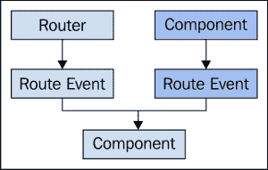

# 第五章：可寻址性与导航

运行在网络上的应用程序依赖于**可寻址**资源。URI 是至关重要的互联网技术，它消除了一类复杂性，因为我们可以把关于资源的信息编码到 URI 字符串中。这是*策略*部分。*机制*部分则由浏览器或我们的 JavaScript 代码来完成——查找请求的资源并显示它。

过去，处理 URI 是在后端进行的。当用户传递一个 URI 给浏览器时，浏览器的责任是将这个请求发送到后端并显示响应。随着大规模 JavaScript 应用程序的出现，这一责任主要转移到了前端。我们有了在浏览器中实现复杂路由的工具，有了这些工具，对后端技术的依赖就减少了。

然而，前端路由的好处确实是有代价的，一旦我们的软件增加了功能。本章深入探讨了在我们应用程序架构成长和成熟过程中可能遇到的路由场景。大多数路由器组件的底层实现细节并不重要。我们更关心的是我们的路由器组件如何适应规模影响因素。

# 路由方法

在 JavaScript 中有两种路由方法。第一种是使用基于哈希的 URI。这些 URI 以`#`字符开头，这是更受欢迎的方法。另一种不太受欢迎的方法是使用浏览器的 history API 生成更传统的 URI，网民们已经习惯了这种 URI。这种技术更加复杂，直到最近才获得足够的浏览器支持，使其变得可行。

## 哈希 URI

URI 中哈希部分最初的意图是指向文档的特定位置。所以浏览器会查看`#`字符左侧的所有信息，并将这些信息发送到后端，请求一些页面内容。只有在页面到达并渲染后，`#`字符右侧才变得相关。这时，浏览器使用 URI 的哈希部分在页面上找到本地相关位置。

如今，URI 中的哈希部分被用于不同的场景。它依旧用于 URI 变更时避免向后端传递无关数据。主要区别在于，现今我们处理的是应用程序和功能，而非网站和静态内容。由于在地址变更时大部分应用程序已经加载到浏览器中，向后端发送不必要的请求是没有意义的。我们只想要对新 URI 必要的数据，这通常通过后台的 API 请求来实现。

当我们谈论在 JavaScript 应用程序中使用哈希方法来改变 URI 时，通常只是哈希部分发生变化。这意味着相关浏览器事件将会触发，通知我们的代码 URI 已经改变。但它不会自动向后端发出请求以获取新页面内容，这是关键。我们实际上可以通过这种方式的前端路由获得很多性能和效率上的提升，这也是我们使用这种方法的原因之一。

它不仅效果良好，而且实施起来也很简单。实现一个哈希变更事件监听器，以执行逻辑来获取相关数据，然后用相关内容更新页面，并没有很多复杂的部件。此外，浏览器历史的变更我们自己也会自动处理。

## 传统的 URI

对于某些用户和开发者来说，哈希方法看起来就像是黑客技术。更不用说在公共互联网环境中呈现的 SEO 挑战了。他们更喜欢更传统的用斜杠分隔的资源名格式的外观和感觉。现在在所有现代浏览器中，由于对历史 API 的增强，这通常是可能实现的。本质上，路由机制可以监听历史堆栈上推入的状态，当发生这种情况时，它防止请求发送到后端，而是本地处理它。

显然，这种方法需要更多的代码才能工作，也需要考虑更多的边缘情况。例如，后端需要支持前端路由器所支持的所有 URI，因为用户可以将任何有效的 URI 输入到应用程序中。处理这种情况的一种技术是在服务器上使用重写规则，将 404 错误重定向回应用程序的索引页面，我们的真实路由处理就位于那里。

话说回来，大多数 JavaScript 应用框架中找到的路由组件抽象了方法上的差异，并提供了一种无缝地朝一个方向或另一个方向过渡的手段。是使用哪一个更重要，是为了增强功能还是提高可扩展性？实际上并不重要。但在可扩展性方面，重要的是要认识到实际上有两种主要方法，我们不想完全承诺于其中之一。

# 路由器是如何工作的

现在是我们深入研究路由器的时候了。我们想了解路由器的职责以及当 URI 发生变化时它的生命周期是什么样的。本质上，这相当于路由器取新的 URI 并判断它是否是路由器感兴趣的东西。如果是，那么它就会用解析后的 URI 数据作为参数触发适当的路线事件。

理解路由器在底层的角色对于扩展我们的应用程序很重要，因为我们有越多的 URI 和响应这些路由事件的组件，就有越多的扩展问题潜力。当我们知道路由器生命周期正在发生什么时，我们可以针对扩展影响因素做出适当的扩展权衡。

## 路由器职责

路由器的简化观点只是一个映射—有路由，字符串或正则表达式模式定义，它们映射到回调函数。重要的是这个过程快速、可预测且稳定。尤其是在我们应用程序中的 URI 数量增长时，正确实现这一过程具有挑战性。以下是任何路由组件需要处理的任何路由的大致概述：

+   存储路由模式与其相应事件名称的映射

+   监听 URI 变化事件—*哈希变化*或*弹出状态*

+   执行路由模式查找，将新的 URI 与每个映射的模式进行比较

+   当找到匹配项时，根据模式解析新的 URI

+   触发映射的路由事件，传递任何解析的数据

    ### 注意

    路由查找过程涉及在路由映射中进行线性搜索以找到匹配项。当定义了大量的路由时，这意味着性能显著下降。当路由映射是一个对象数组时，它也可能导致路由性能不一致。例如，如果一个路由位于数组的末尾，这意味着它最后被检查并且执行缓慢。如果它位于数组的开头，执行效果会更好。

    为了避免频繁访问的 URI 的性能下降，我们可以扩展路由器，使其根据优先级属性对路由映射数组进行排序。另一种方法涉及使用**字典**结构，以避免线性查找。当然，只有当路由器性能如此差，以至于可以测量出性能下降时，才考虑这样的优化。

当 URI 发生变化时，路由器要做很多事情，这就是理解给定路由的生命周期很重要的原因，从地址栏中 URI 发生变化开始，到完成所有的事件处理函数。从性能角度来看，大量的路由可能会对我们的应用程序产生负面影响。从组成角度来看，跟踪哪些组件创建和响应哪些路由是具有挑战性的。当我们知道任何给定路由的生命周期看起来是什么样的时，处理起来会稍微容易一些。

## 路由器事件

一旦路由器为改变后的 URI 找到了匹配项，并且一旦根据其匹配模式解析了 URI，它的最后工作就是触发路由事件。触发的事件是映射的一部分。URI 可能编码了变量，这些变量被解析并通过每个路由事件处理程序传递数据。



路由事件提供了一个抽象层，这意味着非路由器组件可以触发路由事件

大多数框架附带可以直接在路由变化时调用函数的路由组件，而不是触发一个路由事件。实际上，这更简单，是一种更直接的方法，适合小型应用程序。通过路由器触发事件机制间接获得的间接性是我们组件与路由器之间松耦合的原因。

这是有益的，因为不同组件之间如果没有相互了解，它们可以监听同一个路由事件。随着我们扩大规模，之前已经设立的同一路由将需要承担新的责任，而添加新处理程序比不断构建相同的函数代码要容易。还有抽象的好处——监听路由事件的组件不知道事件实际上是由路由实例触发的。当需要组件触发类似路由的行为，而不实际依赖路由时，这个特性很有用。

# uri 部分和模式

在大型 JavaScript 应用程序中，路由组件需要经过深思熟虑。我们还需要对 URI 本身进行深思熟虑。它们由什么组成？在整个应用程序中它们是否一致？什么是一个糟糕的 URI？在这些考虑上走向错误的方向会使我们难以扩展应用程序的可寻址性。

## 编码信息

URI 的作用在于，客户端可以将它传递给我们的应用程序，并且它包含了足够的信息，可以据此进行有用的操作。最简单的 URI 只是指向一种资源类型，或者是一个应用内的静态位置——`/users` 或 `/home` 是这类 URI 的 respective 例子。利用这些信息，我们的路由器可以触发一个路由事件，并触发一个回调函数。这些回调甚至不需要任何参数——它们知道要做什么，因为不存在变异性。

另一方面，路由回调函数可能需要一些上下文。这时在 URI 中编码信息就变得很重要。最常见的用途是当客户端要求某个资源的具体实例时，使用唯一标识符。例如，`users/31729`。在这里，路由需要找到与这个字符串匹配的模式，并且该模式还将指定如何提取 `31729` 变量。然后将其传递给回调函数，现在回调函数有足够的信息来执行其任务。

URI 可能会变得很大且复杂，如果我们试图在它们中编码很多信息。这个例子就是编码显示资源网格的页面的查询参数。尝试在路由模式中指定所有可能性是困难且容易出错的。肯定会有变化，以及关于变量组合使用的不预期的边缘情况。其中一些可能是可选的。

当一个给定的 URI 有如此多的潜在复杂性时，最好将编码选项保持在传递给路由器的 URI 模式之外。相反，让回调函数查看 URI 并进一步解析以确定上下文。这样可以保持路由规格整洁，将奇异的复杂处理程序与其他一切隔离。

对于常见的查询，我们可能希望为用户提供一个简单的 URI，尤其是如果它以链接的形式呈现。例如，最近的帖子链接到`/posts/recent`。这个 URI 的处理程序需要确定一些事情，否则这些事情需要编码在 URI 中——比如排序和要获取的资源数量。有时这些事情不需要包含在 URI 中，而这些决策对用户体验和代码的可扩展性都有好处。

## 设计 URI

资源名是我们创建 URI 的好灵感。如果 URI 链接到一个显示事件的页面，它可能应该以`events`开始。然而，有时后端暴露的资源名并不直观。或者，作为一个组织或行业，我们喜欢缩写某些术语。这些也应该避免，除非应用程序的上下文提供了意义。

反过来说也是正确的——URI 中包含太多意义实际上可能会导致混淆，如果它太冗长。这可以从这个单词的角度看过于冗长，或者从 URI 组件的数量的角度看过于冗长。为了帮助传达结构，并使人类眼睛更容易解析，通常会将 URI 分解为部分。例如，事物类型，后面是事物标识符。实际上，对于用户来说，将分类或其他辅助信息编码在 URI 中并不真正有帮助——尽管它当然可以在 UI 中显示。

我们能够做到的地方，我们应该保持一致。如果我们限制资源名的字符数，它们都应该遵循相同的限制。如果我们使用斜杠来分隔 URI 部分，到处都应该这样做。这个想法的整个出发点是，当有很多 URI 时，它能够很好地扩展，因为用户最终可以猜测出某个东西的 URI，而不必点击链接。

在保持一致性的同时，我们有时希望某些类型的 URI 能够突出显示。例如，当我们访问一个将资源置于不同状态的页面，或需要用户输入的页面时，我们应该用不同的符号前缀动作。假设我们正在编辑一个任务——URI 可能是`/tasks/131:edit`。在我们应用程序的各个地方保持一致性，用斜杠分隔 URI 组件。所以我们本可以做成类似`/tasks/131/edit`。然而，这会让它看起来像一个不同的资源，而实际上，它和`tasks/131`是同一个资源。只是现在，UI 控件处于不同的状态。

下面是一个显示用于测试路由的正则表达式的例子：

```js
// Wildcards are used to match against parameters in URIs...
console.log('second', (/^user\/(.*)/i).exec('user/123'));
//    [ 'user/123', '123' ]

// Matches against the same URI, only more restrictively...
console.log('third', (/^user\/(\d+)/i).exec('user/123'));
//    [ 'user/123', '123' ]

// Doesn't match, looking for characters and we got numbers...
console.log('fourth', (/^user\/([a-z])/i).test('user/123'));
//    false

// Matches, we got a range of characters...
console.log('fifth', (/^user\/([a-z]+)/i).exec('user/abc'));
//    [ 'user/abc', 'abc' ]
```

# 将资源映射到 URI

是时候看看 URI 在实际应用中的样子了。我们最常发现 URI 的形式，就是在我们应用程序中的链接。至少，这是理念所在——拥有一个良好互联的应用程序。虽然路由器理解如何处理 URI，但我们还需要查看所有这些链接需要生成并插入 DOM 中的地方。

生成链接有两种方法。第一种是一种相对手动的过程，需要模板引擎和实用函数的帮助。第二种尝试自动化，以扩展许多 URI 的可管理性。

## 手动构建 URI

如果一个组件在 DOM 中渲染内容，它可能会构建 URI 字符串并将它们添加到链接元素中。当只有少数页面和 URI 时，这样做是足够简单的。这里的扩展问题在于，JavaScript 应用程序中的页面计数和 URI 计数是互补的——大量的 URI 意味着大量的页面，反之亦然。

我们可以使用路由模式映射配置，该结构指定 URI 的外观以及它们被激活时会发生什么，作为实现视图时的参考。借助大多数框架以一种形式或另一种形式使用的模板引擎，我们可以使用模板特性来动态渲染所需的链接。或者，如果缺乏模板复杂性，我们需要一个独立的实用程序来为我们生成这些 URI 字符串。

当有很多 URI 需要链接，有很多模板时，这变得具有挑战性。模板语法为我们提供了一些帮助，使得构建这些链接稍微不那么痛苦。但这仍然耗时且容易出错。此外，我们将开始看到模板内容的重复，感谢我们在模板中构建链接的静态性质。我们至少需要硬编码，在模板中链接到的资源类型。

## 自动化资源 URI

我们链接的大部分资源都是来自 API 的实际资源，并在我们的代码中由模型或集合表示。既然如此，如果我们不是利用模板工具为这些资源构建 URI，而是可以在每个模型或集合上使用相同的函数来构建 URI，那会很好。这样，因为我们只关心抽象的`uri()`函数，所以与构建 URI 相关的模板中的任何重复都会消失。

这种方法虽然简化了模板，但引入了与路由器同步模型的挑战。例如，模型生成的 URI 字符串需要与路由器期望看到的模式匹配。所以要么，实现者需要足够自律，以保持模型生成的 URI 与路由器同步，要么模型需要基于模式来生成 URI 字符串。

如果路由器使用某种简化的正则表达式语法来构建 URI 模式，那么可以通过路由定义自动同步模型中实现的`uri()`函数。那里的挑战是模型需要了解路由器——这可能会导致依赖性规模问题——我们有时希望使用模型，而不一定是路由器。如果我们的模型存储了与路由器注册的 URI 模式呢？然后它可以使用这个模式来生成 URI 字符串，而且它仍然只在一个地方更改。另一个组件然后将模式注册到路由器，所以没有与模型的紧密耦合。

以下是一个示例，展示了如何将 URI 字符串封装在模型中，远离其他组件：

```js
// router.js
import events from 'events.js';

// The router is also an event broker...
export default class Router {

    constructor() {
        this.routes = [];
    }

    // Adds a given "pattern" and triggers event "name"
    // when activated.
    add(pattern, name) {
        this.routes.push({
            pattern: new RegExp('^' +
                pattern.replace(/:\w+/g, '(.*)')),
            name: name
        });
    }

    // Adds any configured routes, and starts listening
    // for navigation events.
    start() {
        var onHashChange = () => {
            for (let route of this.routes) {
                let result = route.pattern.exec(
                    location.hash.substr(1));
                if (result) {
                    events.trigger('route:' + route.name, {
                        values: result.splice(1)
                    });
                    break;
                }
            }
        };

        window.addEventListener('hashchange', onHashChange);
        onHashChange();
    }

}

// model.js
export default class Model {

    constructor(pattern, id) {
        this.pattern = pattern;
        this.id = id;
    }

    // Generates the URI string for this model. The pattern is
    // passed in as a constructor argument. This means that code
    // that needs to generate URI strings, like DOM manipulation
    // code, can just ask the model for the URI.
    get uri() {
        return '#' + this.pattern.replace(/:\w+/, this.id);
    }

}

// user.js
import Model from 'model.js';

export default class User extends Model {

    // The URI pattern for instances of this model is
    // encapsulated in this static method.
    static pattern() {
        return 'user/:id';
    }

    constructor(id) {
        super(User.pattern(), id);
    }

}

// group.js
import Model from 'model.js';

export default class Group extends Model {

    // The "pattern()" method is static because
    // all instances of "Group" models will use the
    // same route pattern.
    static pattern() {
        return 'group/:id';
    }

    constructor(id) {
        super(Group.pattern(), id);
    }

}

// main.js
import Router from 'router.js';
import events from 'events.js';
import User from 'user.js';
import Group from 'group.js';

var router = new Router()

// Add routes using the "pattern()" static method. There's
// no need to hard-code any routes here.
router.add(User.pattern(), 'user');
router.add(Group.pattern(), 'group');

// Setup functions that respond to routes...
events.listen('route:user', (data) => {
    console.log(`User ${data.values[0]} activated`);
});

events.listen('route:group', (data) => {
    console.log(`Group ${data.values[0]} activated`);
});

// Construct new models, and user their "uri" property
// in the DOM. Again, nothing related to routing patterns
// need to be hard-coded here.
var user = new User(1);
document.querySelector('.user').href = user.uri;

var group = new Group(1);
document.querySelector('.group').href = group.uri;

router.start();
```

# 触发路由

最常见的路由触发形式是用户在我们的应用程序中点击一个链接。如前一部分所述，我们需要让我们的链接生成机制能够处理许多页面和许多 URI。这种规模影响因素的另一个维度是实际的触发动作本身。例如，对于较小的应用程序，显然链接会较少。这也意味着用户点击事件较少——更多的导航选择意味着更高的事件触发频率。

考虑较少为人所知的导航参与者也很重要。这些包括在某些后端任务完成后重定向用户，或者只是一个直接的绕道，从点 A 到点 B。

## 用户操作

当用户在我们的应用程序中点击一个链接时，浏览器会捕捉到这一动作并更改 URI。这包括进入我们应用程序的入口点——可能来自另一个网站或书签。正是这种灵活性使得链接和 URI 能够来自任何地方并指向任何事物。在我们能够利用链接的地方是有意义的，因为这意味着我们的应用程序连接良好，而处理 URI 更改是路由器擅长并且能够轻松处理的事情。

但是还有其他触发 URI 更改和随后路由工作流程的方法。例如，假设我们正在一个`create`事件表单上。我们提交表单，响应回来后成功——我们想让用户留在`create`事件页面吗？还是想带他们到显示事件列表的页面，这样他们就可以看到他们刚刚添加的事件？在后一种情况下，手动更改 URI 是有意义的，而且实现起来非常简单。


我们的应用程序可以改变地址栏的不同方式

## 重定向用户

在 API 响应成功后重定向用户到一个新的路由是手动触发路由的一个好例子。还有其他几个场景，我们希望能够将用户从他们当前的位置重定向到一个与他们正在执行的活动相符的新页面，或者确保他们只是在观察正确的信息。

并非所有的重处理都需要在后端进行——我们可能会面临一个本地的 JavaScript 组件运行一个进程，完成后，我们想将用户带到我们应用中的另一个页面。

这里的关键思想是效果比原因更重要——我们并不太关心是什么原因导致了 URI 的变化。真正重要的是能够以意想不到的方式使用路由器。随着我们的应用程序扩展，我们通常会面临通过快速简单的路由器黑客手段来解决问题的场景。能够完全控制我们应用程序的导航，让我们对应用程序的扩展方式有了更多的控制权。

# Router 配置

我们的路由与它们的事件映射通常比路由实现本身要大。这是因为随着我们的应用程序增长并拥有更多的路由模式，可能性列表会变得更大。很多时候，这是应用程序满足其扩展需求不可避免的后果。关键是不要让大量的路由声明因自身重量而崩溃，而这可以通过多种方式发生。

配置给定路由器实例响应的路线有不止一种方法。根据我们使用的框架，路由器组件在配置上可能比其他组件有更多的灵活性。一般来说，有静态路由方法，或者事件注册方法。我们还想要考虑路由器随时禁用给定路线的能力。

## 静态路由声明

简单的应用程序通常使用静态声明配置它们的路由器。这意味着在路由创建时，将路由模式映射到回调函数。这种方法的好处是所有路由模式的相对局部性。一眼就能看出我们的路由配置情况，我们不需要去寻找特定的路由。然而，当有大量路由时，这种方法行不通，因为我们必须去搜索它们。此外，这种方法没有关注点的分离，这不利于开发者独立于彼此尝试做他们的事情。

## 注册事件

当有大量路由需要定义时，应该关注封装的路由——哪些组件需要这些路由，它们是如何告诉路由器的？嗯，大多数路由器会允许我们调用一个让我们添加新路由配置的方法。然后我们只需要包含路由器并从组件中添加路由。

这绝对是正确的方向；它允许我们将路由声明保留在需要它们的组件中，而不是将整个应用程序的路由配置组合成一个对象。然而，我们可以进一步扩展这种可扩展性。

与其让我们的组件直接依赖路由实例，不如触发一个添加路由事件？这将被任何监听该事件的 router 所接收。也许我们的应用程序正在使用多个 router 实例，每个实例都有自己的专业化功能——比如日志记录——它们都可以基于特定条件监听添加的路由。关键是，我们的组件不应该关心路由实例，只需要知道当某个模式与 URI 变化匹配时，会触发路由事件。


如何通过使用事件使组件与路由器隔离

## 禁用路由

在我们配置好一个给定的路由之后，我们是否假设它在会话期间始终是一个有效的路由？或者，路由器是否应该有一种方法来禁用一个给定的路由？这取决于我们从责任角度如何看待具体案例。

例如，如果发生了某些事情，且某个路径不再可访问——尝试它只会得到一个用户友好的错误——路由处理函数可以检查该路径是否可访问。然而，这增加了回调函数本身的复杂性，这种复杂性将散布在应用程序的回调中，而不是集中在某一个地方。

另一种方法可能是有一个检查组件，当组件进入需要这样做的状态时，该组件会禁用路由。当状态变为路由可以处理的内容时，该组件也会启用路由。

第三种方法是在路由首次注册时添加一个守卫函数作为选项。当路由匹配时，它会运行这个函数，如果守卫通过，则正常激活，否则失败。这种方法最适合扩展，因为检查的状态与相关路由紧密耦合，无需为路由启用/禁用状态。将守卫函数视为路由匹配条件的一部分。

下面是一个示例，展示了接受守卫条件函数的路由器。如果存在这个守卫函数并且返回`false`，则不会触发路由事件：

```js
// router.js
import events from 'events.js';

// The router triggers events in response to
// route changes.
export default class Router {

    constructor() {
        this.routes = [];
    }

    // Adds a new route, with an optional
    // guard function.
    add(pattern, name, guard) {
        this.routes.push({
            pattern: new RegExp('^' +
                pattern.replace(/:\w+/g, '(.*)')),
            name: name,
            guard: guard
        });
    }

    start() {
        var onHashChange = () => {
            for (let route of this.routes) {
                let guard = route.guard;
                let result = route.pattern.exec(
                    location.hash.substr(1));

                // If a match is found, and there's a guard
                // condition, evaluate it. The event is only
                // triggered if this passes.
                if (result) {
                    if (typeof guard === 'function' && guard()) {
                        events.trigger('route:' + route.name, {
                            values: result.splice(1)
                        });
                    }
                    break;
                }
            }
        };

        window.addEventListener('hashchange', onHashChange);
        onHashChange();
    }

}

// main.js
import Router from 'router.js';
import events from 'events.js';

var router = new Router()

// Function that can be used as a guard condition
// with any route we declare. It's returning a random
// value to demonstrate the various outcomes, but this
// could be anything that we want applied to all our routes.
function isAuthorized() {
    return !!Math.round(Math.random());
}

// The first route doesn't have a guard condition,
// and will always trigger a route event. The second
// route will only trigger a route event if the given
// callback function returns true.
router.add('open', 'open');
router.add('guarded', 'guarded', isAuthorized);

events.listen('route:open', () => {
    console.log('open route is always accessible');
});

events.listen('route:guarded', (data) => {
    console.log('made it past the guard function!');
});

router.start();
```

# 调试路由器

一旦我们的路由器增长到足够大的规模，我们将不得不解决复杂的情况。如果我们事先知道可能出现的问题，我们将更好地应对它们。我们还可以将故障排除工具集成到我们的路由器实例中，以帮助这个过程。扩展我们架构的可寻址性意味着能够快速、可预测地响应问题。

## 冲突的路由

冲突路由可能引起巨大的头痛，因为它们可能非常难以追踪。冲突模式是后来添加到路由器中的更具体模式的通用或类似版本。更通用的模式发生冲突，因为它与最具体的 URI 相匹配，这些 URI 应该已经被更具体模式匹配。然而，它们永远不会被测试，因为通用路由是首先执行的。

当这种情况发生时，可能根本看不出来路由存在问题，因为错误的路由处理程序运行得非常好，在 UI 上，一切看起来都很正常——除非有一点不对劲。如果按 FIFO 顺序处理路由，特定性很重要。也就是说，如果首先添加更通用的路由模式，那么当它们被激活时，它们总是与更具体的 URI 字符串匹配。

当有大量 URI 需要排序时，按照这种方式排序的挑战是，这是一项耗时的工作。我们必须比较新添加的路由与现有路由的模式。如果它们都被添加到同一个地方，开发人员之间的承诺也可能存在冲突。这是将路由按组件分离的另一个优点。这样做使得可能发生冲突的路由更容易被发现和处理，因为组件很可能具有少量类似的 URI 模式。

下面是一个显示具有两个冲突路由的路由组件的示例：

```js
// Finds the first matching route in "routes" - tested
// against "uri".
function match() {
    for (let route of routes) {
        if (route.route.test(uri)) {
            console.log('match', route.name);
            break;
        }
    }
}

var uri = 'users/abc';

var routes = [
    { route: /^users/, name: 'users' },
    { route: /^users\/(\w+)/, name: 'user' }
];

match();
//    match users
// Note that this probably isn't expected behavior
// if we look closely at the "uri". This illustrates
// the importance of order, when testing against a
// collection of URIs specs.

routes.reverse();

match();
//    match user
```

## 记录初始配置

路由器应该在配置了所有相关路由之后才开始监听 URI 变化事件。例如，如果个别组件用对该组件必要的路由配置路由器，我们不希望路由器在组件有机会配置其路由之前就开始监听 URI 变化事件。

初始化其下级组件的主要应用组件可能会引导这个过程，并在完成后告诉路由器开始工作。当个别组件有自己的路由封装在内时，在开发过程中，理解路由器的整体配置可能很困难。为此，我们需要在我们的路由器中有一个选项，用于记录其整个配置——模式及其触发的事件。这有助于我们进行扩展，因为我们不必牺牲模块化路由就能了解整体情况。

## 记录路由事件

除了记录初始路由配置之外，如果路由器能够在触发 URI 变化事件的生命周期中进行日志记录也是很有帮助的。这与我们在前一章中讨论的事件机制日志不同——这些事件将在路由触发路由事件之后记录。

如果我们正在构建一个大规模的 JavaScript 架构，拥有许多路由，我们就想了解关于我们的路由器的一切，以及它在运行时是如何行为的。路由器对于我们应用的可扩展性是如此的基础，以至于我们在这里要投入对细节的关注。

例如，了解路由器在遍历可用路由、寻找匹配项时的行为可能很有用。了解路由器从 URI 字符串解析出来的结果也很有用，这样我们就可以将其与下游的路由事件处理程序所看到的内容进行比较。并非所有的路由组件都支持这种级别的日志记录。如果我们发现需要它，一些框架将提供足够的入口点进入它们的组件，并附有优秀的扩展机制。

## 处理无效资源状态

有时，我们忘记路由是无状态的；它接受一个 URI 字符串作为输入，并根据模式匹配条件触发事件。与可寻址性相关的一个可扩展性问题并不在于路由器状态，而在于监听路由的组件状态。

例如，想象我们从一项资源导航到另一项资源。在我们访问这个新资源时，第一项资源会发生很多变化。很容易出现这样的情况：它以这样一种方式改变，使得这个特定用户无法访问，同时它还保存在用户的历史记录中，他们只需要点击后退按钮。

路由器和可寻址性可能会将这类边缘情况引入我们的应用程序。然而，处理这些边缘情况并不是路由器的责任。这些问题是由许多 URI、许多组件以及将它们全部联系在一起的复杂业务规则共同造成的。路由器只是一个帮助我们应对大规模政策的机制，而不是实施政策的场所。

# 摘要

本章详细介绍了如何随着应用程序的扩展实现可寻址性这一架构特性。

我们从路由和可寻址性的讨论开始，首先查看了不同的路由方法——hash 变化事件和利用现代浏览器中可用的历史 API。大多数框架为我们抽象了这些差异。接下来，我们探讨了路由器的职责，以及它们应该如何通过触发事件与其它组件解耦。

URI 本身的设计也在我们软件的可扩展性中扮演了角色，因为它们需要保持一致和可预测。用户甚至可以利用这种可预测性来帮助他们扩展对我们软件的使用。URI 编码信息，然后传递给响应路由的事件处理程序；这也需要考虑。

接着，我们查看了路由被触发的各种方式。这里的标准方法是点击一个链接。如果我们的应用程序连接良好，它将到处都是链接。为了帮助我们管理众多链接，我们需要一种自动生成 URI 字符串的方法。接下来，我们将查看组件运行所需要的中间数据。这些包括用户偏好和我们组件的默认值。
