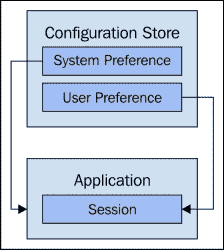

# 第六章：用户偏好和默认值

任何足够大的 JavaScript 应用程序都需要配置其组件。我们组件配置的范围和性质根据应用程序的不同而有所变化。在配置组件时，需要考虑许多扩展因素，我们将在整章中讨论这些因素。

我们将首先确定我们必须处理的偏好类型，然后本章的其余部分将讨论这些偏好相关的具体扩展问题以及如何解决它们。

# 偏好类型

当我们设计大型 JavaScript 架构时，关心的三种主要偏好类型是：地区、行为和外观。在本节中，我们将为每个偏好类别提供定义。

## 地区

当今的应用程序不能只支持一个单一的地区，如果它们要在全球范围内取得成功的话。由于全球化以及互联网，来自世界其他地区的应用程序需求已成为新的常态。因此，我们必须以一种能够无缝容纳许多地区的方式设计我们的 JavaScript 架构。一个地区的用户应该能够像其他任何地区的用户一样轻松、自信地使用我们的应用程序。

### 注意

使组件能够使用任何地区的过程称为**国际化**。然后，为我们的应用程序创建特定地区的数据的过程称为**本地化**。

国际化/本地化之所以困难，是因为它触及了用户界面的每一个视觉方面。尽管有很多组件不关心地区（如控制器或集合），但这仍然可能相当多。例如，任何原本在模板某处硬编码的字符串标签，现在需要通过一个地区感知翻译机制。

语言翻译本身就已经够困难了。但是地区数据包括与我们软件中使用的任何一种文化相关的任何和一切内容。例如，用于日期/时间或货币值的形式。这些只是最常见和最直接的元素。事物可以一直变化到如何度量数量，或者一直到整个页面的布局。

## 行为

我们组件的大部分行为都存在于代码中，并且是不变的。由于不同偏好而发生的行为变化是微妙而又重要的。当有多个互动组件时，必然会有一种不兼容的组合会引起问题。

例如，在我们组件的实现中可能有一个函数，它从一个配置值中获取一个值，用这个值来计算某物。这可能是一个用户偏好，或者可能是我们为了可维护性而设置的东西。

### 注意

在本书的剩余部分，我们将把个别配置值称为偏好。我们将把给定组件内所有偏好的聚合效果称为配置。

行为偏好可能会对用户看到的内容产生不同的影响。一个简单的例子就是关闭组件，或者禁用它。这个偏好会导致组件在 UI 中不再渲染。另一个偏好将决定显示多少元素。一个常见的例子是用户告诉应用程序他们希望在每页看到多少搜索结果。

这些类型的偏好并不总是直接映射到最终用户。也就是说，组件可能有一些不是直接暴露给用户的偏好。这可能是为了提高开发人员的灵活性，减少我们编写的代码量。可配置的组件有多种形式，从这种角度来看，我们需要确保相应地处理它们，以帮助我们的软件实现扩展。

我们需要的不仅仅是前端组件，因为给定偏好可能会改变后端行为。这可能简单到一个查询参数偏好，或者另一个偏好导致使用不同的 API 端点。所有这些看似无害的偏好加起来会产生深远的影响，跨越整个应用程序，可能会影响系统中的其他用户。

## 外观

如果一个现代 JavaScript 应用程序要跨越受众人口统计数据进行扩展，它的外观需要是可配置的。这一要求可以从可配置的标志，到具有潜在能力彻底改变 UI 外观和感觉的可互换主题不等。

一般来说，外观变化主要围绕 CSS 属性，如字体、颜色、宽度、边框半径等。虽然确实大多数 CSS 实现并未被大多数 JavaScript 开发者触及，但我们仍然需要关注主题边界。

例如，如果我们对外观以及如何配置它持灵活态度，我们可能会让用户在运行时选择自己的主题。因此，我们需要实现一个用户可以与之交互的主题切换机制。此外，主题化的用户界面意味着偏好需要被存储和加载。

那么这就是粗粒度主题——那细粒度外观配置又是怎样的呢？然而，粗粒度更为常见，对特定组件风格的配置并非不可能。外观粒度级别与其他扩展影响因素一致，比如我们的软件部署在哪里，以及我们配置 API 的能力如何。

# 支持本地化

拥有对我们所有组件的国际化支持是一个好主意。实际上，有很多 JavaScript 工具可以帮助我们完成这项任务。有些工具比较独立，而有些则更针对特定的框架。使用这些工具很简单，但还有很多其他与本地化相关的工作需要考虑，特别是在扩展的情况下。

## 决定支持哪些区域

一旦我们拥有带有国际化支持并在生产环境中使用的软件，下一步就是决定支持哪些区域。当我们确保所有组件都进行国际化时，我们只支持一个区域——默认区域。一开始这样做是可以的，可能需要数年才能出现对第二个辅助区域支持的需求。

这通常是新软件项目的情况。我们知道国际化应该是我们优先级列表上的重要事项，但在其他所有事情中很容易分心。不花费精力支持区域的主要论点是它目前是不需要的。反对这种心态的观点是，随着组件的增长，事后实施国际化是非常困难的。所以这又是需要考虑的与扩展相关的权衡。我们希望我们的应用程序能够跨文化扩展，还是认为立即上市更重要？

除了特殊情况外，我们假设国际化是必不可少的——我们需要确定我们首先要支持哪些区域，以及哪些可以等待。例如，在实际需要之前就寻求大规模区域支持是一个糟糕的主意。区域占用的物理空间，需要有人来维护这些区域。所以如果没有客户来承担这种增加的扩展复杂性的成本，这是不值得的。

相反，所选的本地化区域应完全基于客户需求。如果我们有一个地方有数百人寻求支持，而只有不到十几个人询问另一个地方，优先级就很明显了。如果我们像优先支持功能一样优先支持区域，这将对我们有帮助。

## 维护区域

首先，如果我们支持某个区域，我们将需要翻译在 UI 中显示的所有字符消息。其中一些是在模板文件中静态编码的，而其他字符串在我们的 JavaScript 模块中找到。如果只是找到这些字符串，并一次性翻译它们那该多好。但字符串很少会永远保持不变——经常会有微小的调整。此外，随着我们的软件增长和更多组件的添加，需要翻译的字符串也会增加。

仅字符串翻译的缩放因素就是我们支持的区域设置数量——这就是为什么我们需要谨慎地只支持有限数量的区域设置，只要我们能够做到。复杂性并没有就此结束。例如，一些消息字符串可以从源语言映射到目标语言。像语法屈折这样的东西——单词如何根据修改承担不同的意义——并不是那么直接。实际上，这些用例有时需要国际化的专用库。

其他可本地化的数据，如日期/时间格式，不需要太多维护。对于给定区域设置，应用程序中通常使用一两个格式。对于这些格式，客户可能会对他们文化中使用的标准格式感到满意。幸运的是，我们可以在我们的项目中使用**通用区域数据仓库**（**CLDR**）数据——一个可下载的通用区域数据仓库。这是一个良好的起点，因为大多数时候这些数据都是足够的，并且根据请求容易覆盖。

# 设置区域设置

一旦我们建立了国际化库，并且有几个区域设置，我们就可以开始测试我们的应用程序在不同文化角度下的行为。对于这种行为，有许多需要考虑的项目。例如，我们需要为用户启用区域设置，并且我们需要跟踪这个选择。

## 选择区域设置

在 JavaScript 应用程序中选择区域设置有两种常见方法。第一种方法是使用 `accept-language` 请求头。第二种方法是在用户设置页面上一个选择器小部件。

`accept-language` 方法的优点在于无需涉及用户输入。我们的应用程序会根据用户的浏览器语言偏好发送，从而我们可以设置区域设置。这种方法的挑战在于，从可用性的角度来看，它可能过于限制性，从实现角度来看也是如此。例如，用户可能无法控制他们的浏览器语言偏好，或者浏览器可能没有支持我们应用程序的区域设置偏好。

### 注意

使用 `accept-language` 请求头方法遇到的另一个技术挑战是，没有简单的方法将请求头从浏览器传递到 JavaScript 代码——这有点疯狂，因为它们都在浏览器中！例如，如果我们的 JavaScript 代码需要知道区域设置偏好，以便它可以加载适当的区域设置数据，它将需要访问 `accept-language` 头部。为此，我们需要后端技巧。

更加灵活的方法是向用户展示一个区域设置选择器小部件，然后从中明确用户想要激活哪个区域设置。然而，我们需要找到一种存储这个区域设置选择的方法，这样用户就不必重复选择他们的区域设置。

## 存储区域设置偏好

一旦用户选择地区偏好，可以作为 cookie 值存储。下次应用程序在浏览器中加载时，我们将准备好地区偏好。然后我们可以标记选择器为适当的选择，以及加载相关地区数据。

将地区偏好存储在 cookie 中的问题是，如果用户转到另一个浏览器，将需要重复相同的选择过程。这对于当今用户比以往任何时候都更加移动是一个真正的问题——在一个设备上所做的更改应该在任何应用程序被使用的地方反映出来。而这是通过 cookie 办不到的。

如果我们使用后端 API 存储地区偏好，它将无处不在对用户可用。下一个挑战是加载相关地区数据，使其可供我们其他组件使用。通常，我们希望在此开始渲染数据之前准备好这些数据，因此这是我们向后端发出的第一个请求之一。有时，所有地区都作为单一资源一起提供。如果我们支持很多地区，这可能成为问题，因为加载它需要的前期成本很高。

另一方面，一旦我们加载地区偏好，我们只能加载立即需要的地区。这将提高初始加载时间，但权衡是切换到新地区较慢。这可能不会经常发生，所以最好不要加载从未使用过的地区数据。


JavaScript 应用程序首先加载地区偏好，然后使用该偏好加载本地数据

## 在 URI 中使用地区

除了在后台存储本地偏好或作为 cookie 值外，地区还可以编码为 URI 的一部分。通常，它们作为两个字符代码表示，例如`en`或`fr`，并位于 URI 的开头。使用这种方法的优点是不需要存储偏好。我们仍然可能需要一个选择器让用户选择他们偏好的地区，但这将导致新的 URI，而不是将偏好值存储在某个地方。

像这样在 URI 中编码首选地区的方法与基于 cookie 的方法有相同的缺点。虽然我们可以收藏一个 URI，或将一个 URI 传递给其他人——他们会看到我们相同的地区——问题是这并不是一个永久的偏好。请注意，我们总是可以存储偏好并在应用程序加载时更新 URI。但由于路由和 URI 生成的额外复杂性，这种方法扩展性不佳。

# 通用组件配置

正如我们在上一节关于地区偏好的内容中看到的那样，我们需要加载一个偏好值，然后我们的每个组件都可以使用这个值。或者在地区的情况下，可能只有一个组件，但这个偏好值间接影响了所有组件。除了地区之外，我们还有许多其他想要在组件中进行配置的事物。本节从通用角度来探讨这个问题。首先我们需要决定给定组件的哪些方面是可配置的，然后是如何在运行时将这些偏好值传递给组件的机制。

## 决定配置值

组件配置的第一步是决定偏好——组件哪些方面需要配置，哪些方面可以保持静态？这远非一门精确的科学，因为往往后来我们会意识到某些静态内容应该是可配置的。试错是找到可配置偏好的最佳过程，尤其是当我们的软件刚刚起步时。过多的初始可配置性考虑是可扩展性的瓶颈。

当某事物不可配置时，它具有简单性的优势。它更加结构化，且不是活动的部件。这消除了潜在的边缘案例和性能问题。为使值可配置而进行的前期论证并不经常发生。但随着我们的软件成熟，我们将有一个更好的视角，因为我们已经设定了一些偏好，并且我们将更好地了解预期会发生什么。

例如，我们将开始在我们的多个组件中看到重复。它们将基本相同，只有微妙的差异。如果我们继续添加彼此之间只有细微差别的新的组件类型，我们将面临可扩展性问题。我们的代码库将增长到一个无法管理的规模，并且我们会让开发者困惑，因为给定组件的责任将变得模糊。

这就是我们利用可配置性来实现规模的地方。这是通过引入对新组件类型的偏好来实现的。例如，假设我们需要一个新的视图，它除了处理 DOM 事件的方式与另一个已经在多个地方使用的视图相同外，其他方面都相同。我们不是实现一个新的视图类型，而是增强现有的视图，使其能够接受一个新的函数值，用于覆盖这个事件的默认值。

另一方面，我们不能随意引入组件偏好。当我们这样做时，我们用新的瓶颈取代了旧的瓶颈。我们需要考虑性能，因为每增加一个新的可配置偏好都会受到影响。还有代码复杂性——使用偏好并不像使用静态值那么简单。还有可能引入与其他开发者在同一开发周期内引入的其他偏好不一致的偏好。最后，还需要跟踪和文档化给定组件可用的各种偏好。

## 存储和硬编码的默认值

就组件而言，偏好应尽可能像普通的 JavaScript 变量一样处理。这使得我们的代码具有灵活性——用静态值替换偏好不应该产生很大的影响。普通变量通常声明有一个初始值，偏好也应该声明有一个默认值。这样，如果由于某种原因我们无法获取存储在后台的偏好值，软件将继续使用合理的默认值运行。

对于任何偏好，都应该有一个回退默认值，并且这些值应该在某个地方进行文档化。理想情况下，使用的默认值服务于常见情况，因此不需要为了使用软件而调整每个偏好。如果我们由于某种原因无法从后端访问存储的配置值，硬编码的默认值会让软件继续运行，尽管是使用不那么理想的配置。

### 提示

有时，无法访问配置值是一个不可逾越的障碍，软件应该快速失败，而不是使用硬编码的默认值。虽然软件完全可以通过默认值正常运行，但根据我们的客户和他们部署的情况，这种模式可能比软件不可用更糟糕。这在部署大规模 JavaScript 应用程序时需要考虑。

默认偏好值的安全性使得在后台删除修改过的偏好值变得可能。把它看作是一个恢复出厂设置的动作。换句话说，如果我们通过调整偏好值引入了软件问题，我们只需删除我们存储的值即可。如果后台不需要存储默认值，那么就没有覆盖默认值的风险。


默认值总是存在，但很容易被后端偏好值覆盖

## 后端影响

如果我们将在后台存储偏好值以提供用户的便携性，那么我们需要某种机制，使我们能够在配置存储中放入新的值偏好，以及检索我们的偏好。理想情况下，这是一个允许我们定义任意键值偏好，并且让我们用一个请求检索所有配置的 API。

这种方法对前端开发如此宝贵，是因为我们可以在开发组件的同时为其定义新偏好，而不会打扰到后端团队。对于后端 API 来说，前端配置是任意的——无论是否有 UI，API 都能正常工作。

有时，这实际上可能比想象的更有麻烦。如果变化非常小——整个应用程序中只需要少量的配置值呢？如果是这样，我们可能会考虑维护一个静态的 JSON 文件，作为我们的前端配置。它足够任意，我们可以随时定义偏好，对于获取偏好值来说，它与 API 一样好用。

当用户定义的偏好设置不适用时，例如，用户的首选语言。我们的应用程序可能有一个默认语言，直到用户更改它。他们是在为自己更改偏好，而不是系统中的每个用户。这时我们就需要前面提到的配置 API。它存储这些值的方式，很可能是数据库，需要对用户敏感。但并非所有偏好值都需要这样；有些是由部署操作员设置的，用户无法更改这些。



当前用户会话可以用来加载特定于该用户的偏好设置；这些与系统设置不同，不会因用户而异。

## Loading configuration values

加载前端所需配置有两种方法。第一种方法是加载所有配置，因为 UI 中会渲染任何内容。这意味着在路由开始处理任何内容之前，我们会等待配置可用。这通常意味着等待一个加载配置数据的承诺。这里的明显缺点是初始加载时间变长。优点是我们拥有了后续所需的一切——不再需要配置请求。

我们可以在浏览器中使用本地存储来缓存偏好值。它们很少变化，这种策略有可能提高初始加载性能。另一方面，它增加了复杂性——所以只有在配置值很多且加载它们的时间明显时才考虑这种方法。

instead of loading all our configuration up-front, preference values can be loaded on demand. That is, when a component is about to be instantiated, a request is made for its configuration. This has the appeal of being efficient, but again, how much configuration could there possibly be to warrant such complexity? Strive toward loading all application configuration up-front where possible.


一个与后端通信的配置组件为获取或设置偏好值的任何组件提供了抽象。

# 配置行为

如果我们实现得当，我们组件的行为很大程度上是自包含的。它们向外部世界暴露的是对它们行为进行微调的偏好。这可能是一些内部关注的内容——比如使用的模型类型，或首选算法。它可能是一些面向用户的内容，比如启用组件，或设置显示模式。正是这些偏好帮助我们使组件能够在各种上下文中工作。

## 启用和禁用组件

一旦我们的软件达到一定的临界质量，不是所有功能对所有用户都相关。简单地能够在启用/禁用状态之间切换组件是一个强大的工具。对我们作为软件供应商，以及我们的客户来说都是如此。例如，我们知道某些功能是我们软件中某些用户角色所必需的，但它们并不是常见情况。为了更好地优化常见用户，我们可能会选择禁用某些不经常使用的高级功能。这可以清理布局，提高性能等。

另一方面，我们可能会默认开启所有功能，但如果组件有能力被关闭，那么这就让用户决定了哪些对他们来说是相关的。如果他们能够根据自己的喜好安排用户界面，移除对他们没有特别用处的元素，那么这将提升用户体验。

在任何情况下，这对整体布局都有影响。如果我们不花时间设计可扩展的布局，那么切换组件实际上并没有任何价值。在设计我们的布局时，我们需要考虑用户可能会使用，或者我们自己可能会使用的各种配置场景。


在页面上禁用组件有可能更新布局；我们的样式需要能够处理这种情况

## 更改数量

在 UI 中显示的数量在某一方面只是一个在设计时做出的猜测。我们希望列表中显示的项数量是最优的，用户不需要为此类型的偏好更改而烦恼。问题是数量是非常主观的。它更多的是关于使用我们的应用程序执行任务的个人，以及他们习惯于什么，他们使用我们的软件时正在做什么，还有许多其他因素，数量偏好默认可能不是最优的。

一个常见的数量问题是我想在屏幕上显示多少个实体？这些实体可以是整个应用程序中常用的网格小部件，一个搜索结果页面，或者任何其他渲染事物集合的东西。我们可以选择显示较少数量的效率默认设置，同时允许更多数量以满足用户的需求。

### 小贴士

始终检查用户提供的偏好是一个好主意。一个保护措施是在放置允许的值的选择，而不是接受任意的用户输入。例如，我们不应该允许网格中渲染 1,000 个实体。尽管如此，返回这些数据的 API 也应该进行检查并限制数量参数。

另一个数量考虑的是我们需要显示哪些实体属性？在网格的情况下，我们可能希望显示某些列而隐藏其他列。这样的偏好应该是持久的，因为如果我们设置了想要看到的数据，我们就不想重复那项工作。

当我们改变数量偏好时，会有后端影响。在决定渲染多少实体的情况下，我们可能希望在获取数据时将这个约束传递给 API——获取我们不打算显示的东西是没有意义的。这也可能涉及到模型或集合的改变。在确定在特定 UI 区域显示哪些数据的情况下，我们可能要求模型或集合只提供他们拥有的一部分数据。

## 更改顺序

在 UI 中渲染集合的顺序是另一个常见的 behavioral 偏好，我们很可能会支持它。这里最大的影响是配置某物的默认顺序。例如，按修改日期对每个集合进行排序，这样最近的实体首先出现，这是一个好的默认设置。

许多网格组件允许用户在给定列的升序和降序之间切换排序。这些都是操作，不一定偏好。然而，如果默认顺序从来不是我们想要的，它们可能会变得烦人。因此，我们可能需要为用户提供一种方式，为任何给定网格提供默认排序偏好，同时保留点击列标题进行临时排序的能力。

可能的更复杂的排序偏好是，点击列标题并不总是有帮助。例如，如果我们想按不在 UI 中渲染的东西排序，比如相关性或最佳销售？这里可能有一个控制可以用来实现这一点，但这又是另一个可能的偏好——因为它可能有助于提供更好的体验。

```js
// users.js
export default class Users {

    // Accepts a "collection" array, and an "order"
    // string.
    constructor(collection, order) {
        this.collection = collection;
        this.order = order;

        // Creates an iterator so we can iterate over
        // the "collection" array without having to
        // directly access it.
        this[Symbol.iterator] = function*() {
            for (let user of this.collection) {
                yield user;
            }
        };
    }

    set order(order) {

        // When the order break it down into it's parts,
        // the "key" and the "direction".
        var [ key, direction ] = order.split(' ');

        // Sorts the collection. If the property value can be
        // converted to lower case, they it's converted to avoid
        // case inconsistencies.
        this.collection.sort((a, b) => {
            var aValue = typeof a[key].toLowerCase === 'function' ?
                a[key].toLowerCase() : a[key];

            var bValue = typeof b[key].toLowerCase === 'function' ?
                b[key].toLowerCase() : b[key];

            if (aValue < bValue) {
                return -1;
            } else if (aValue > bValue) {
                return 1;
            } else {
                return 0;
            }
        });

        // If the direction is "desc", we need to reverse the sort.
        if (direction === 'desc') {
            this.collection.reverse();
        }
    }

}

// main.js
import Users from 'users.js';

var users = new Users([
    { name: 'Albert' },
    { name: 'Craig' },
    { name: 'Beth' }
], 'name');

console.log('Ascending order...');
for (let user of users) {
    console.log(user.name);
}
//
// Albert
// Beth
// Craig

users.order = 'name desc';

console.log('Descending order...');
for (let user of users) {
    console.log(user.name);
}
//
// Craig
// Beth
// Albert
```

## 配置通知

当用户在我们的应用程序中执行某些操作，比如打开或关闭某些功能时，我们需要提供关于该操作状态的反馈。它成功了吗？失败了吗？正在运行吗？这通常通过通知完成，以屏幕角落的短暂弹出窗口或某个面板的形式呈现。

用户可能希望控制他们通知方式的某些方面——没有比收到我们不关心的信息垃圾更让人恼火了。因此，与通知相关的的一个偏好可能就是通知主题的选择。例如，我们可能希望选择不接收不相关实体类型的通知。

另一个可能的偏好可能是给定通知在屏幕上保持活动状态的持续时间。例如，它应该在我们确认它之前一直停留原地，还是应该在三秒后消失？在极端情况下，如果没有什么其他办法能让它们不那么烦人，用户可能想要完全关闭通知。如果需要，以后可以随时方便地浏览操作日志。

## 内联选项

那么我们如何收集用户偏好输入呢？对于不太活跃的全球应用程序偏好，一个按类别划分的设置页面可能是合适的。然而，必须在设置页面上为个别小部件配置特定事项有点儿烦人。有时，拥有内联选项会更好。

内联意味着用户可以使用与相关 UI 部分相关的元素来设置他们的偏好。例如，在网格中选择特定的列显示。把这样的偏好埋在某个设置页面上并没有多大意义。当偏好控制与它们控制的元素相对位置时，通常需要更少的解释。当控制具有上下文意义时，用户通常更容易理解其含义。

### 注意

上下文偏好控制的一个缺点是，它们有可能导致界面混乱。如果页面上有许多组件，每个组件上都有偏好控制，那么我们很可能会制造混乱而不是提供便利。

# 更改外观和感觉

如今，应用程序的外观和感觉很少是静态的、不变的方面。相反，它们通常会附带几套用户可以选择的主题。或者，软件中内置了易于创建主题的支持。这允许我们的客户决定他们的软件应为他们的用户呈现何种外观。除了更新我们应用程序外观和感觉的预设主题外，还可以设置个别样式偏好。

## 主题工具

如果我们想要我们的应用程序能够根据请求更换主题，我们必须在 CSS 及其使用的标记上投入大量的设计和架构工作。虽然这个话题远远超出了本书的范围，但研究一下有助于生成主题的工具还是值得的。

在我们这一领域中可用的第一个工具是一个 CSS 框架。与 JavaScript 框架类似，CSS 框架定义了一致的模式和约定。接下来，就要我们这些组件作者来弄清楚如何将这些 CSS 模式应用到我们的组件以及它们生成的标记上。可以把一个主题看作是一系列样式偏好。当配置更改时，由于新的偏好值，外观也会发生变化。使一个 CSS 模块成为主题的原因是，它定义了与应用程序中所有其他主题相同的属性——只有这些属性的值会发生变化。

我们可以使用后端构建过程的一部分工具—CSS 编译器。这些工具接收使用 CSS 方言的文件，并预处理它们。关于这些预处理器语言的好处是，我们能够更精确地控制样式偏好的指定方式。例如，CSS 中没有变量这样的东西，但预处理器中有，这是非常方便的可配置性功能。

## 选择主题

一旦我们有了可定制的用户界面，我们需要一种加载特定主题实例的方法。即使我们不允许用户选择他们喜欢的主题，能够通过更改偏好值来改变设计也是很好的。当我们决定实现新设计时，这当然可以使部署到生产环境变得更加简单。

将来，我们可能会决定让用户选择自己的主题。例如，我们可能已经拥有大量用户，现在有这种需求。我们可以像系统中使用的任何其他偏好值一样创建主题选择器。我们需要有一种主题选择小部件，用户所做的选择可以映射到路径，因为这是交换一个主题到另一个主题所需的一切。

另一种可能性是根据用户角色设置不同的主题作为默认主题。例如，如果管理员登录，具有不同的视觉提示实际上您以特定类型的用户登录是有帮助的。在截图等场景中，这类事情可以帮助。

## 个人样式偏好

应用程序的外观和感觉可以逐个元素级别进行更改。也就是说，如果我们想改变某物的宽度，我们可以在屏幕上进行更改。也许我们不喜欢正在使用的字体样式，我们也想更改，但其他方面保持不变。

应避免此类细粒度的样式偏好，因为它们扩展性不佳。我们的组件必须了解特定的样式考虑，这通常会在大多数情况下降低组件的真正目的。在某些情况下，为屏幕选择不同的布局不会有害，因为这通常意味着将一个 CSS 类交换为另一个。

另一种可能性是使用拖放交互来设置某物的尺寸。但是，最好是将这些保留为短暂交互，而不是持久偏好。我们希望为常见的配置值优化，而针对个人口味调整元素大小并没有什么共同之处。

# 性能影响

我们将以概述由各种配置区域引入的性能影响来结束本章。如果我们确实需要在某一区域获取配置值，因为它们增加了价值，它们可能会影响整体性能—因此我们需要以某种方式抵消这种成本。

## 可配置的区域性能

说到语言环境，最显著的性能瓶颈就是初始加载。这是因为我们必须在实际为用户渲染任何内容之前加载所有语言环境数据。这包括字符串消息翻译，以及所有进行本地化的其他必要数据。当一次性加载多个语言环境时，初始化过程中的性能受到进一步限制。

提高加载性能的最佳方法是只加载用户实际想要的语言环境。一旦他们设置了这个偏好，他们不太可能频繁更改，所以附近有其他语言环境数据并准备好并没有真正的好处。

渲染视图时不可避免地会有减速，因为大量数据需要通过我们使用的本地化机制。单凭这一点不太可能引起性能问题，因为大多数操作都是小而高效的——简单的查找和字符串格式化。尽管如此，额外的开销是存在的，需要予以考虑。

## 可配置行为性能

改变组件行为的配置对性能影响最小。实际上，可配置行为的性能特性与可配置语言环境的特性相似。最大的挑战是初始配置加载。在那之后，只需执行查找，这是快速的。

需要注意的是，当我们需要配置大量组件时。虽然单个查找很快，但当查找量很大时，性能会受到影响。达到这个点需要一段时间，但风险依然存在。

以下是一个示例，展示了我们可以配置集合何时排序，从而影响具有依赖顺序并且被频繁调用的其他操作的性能：

```js
// users.js
export default class Users {

    // The users collection excepts data, and an
    // "order" property name.
    constructor(collection, order) {
        this.collection = collection;
        this.order = order;
        this.ordered = !!order;
    }

    // Whenever the "order" property is set, we need
    // to sort the internal "collection" array.
    set order(key) {
        this.collection.sort((a, b) => {
            if (a[key] < b[key]) {
                return -1;
            } else if (a[key] > b[key]) {
                return 1;
            } else {
                return 0;
            }
        });
    }

    // Finds the smallest item of the collection. If the
    // collection is ordered, then we can just return the
    // first collection item. Otherwise, we need to iterate
    // over the collection to find the smallest item.
    min(key) {
        if (this.ordered) {
            return this.collection[0];
        } else {
            var result = {};
            result[key] = Number.POSITIVE_INFINITY;

            for (let item of this.collection) {
                if (item[key] < result[key]) {
                    result = item;
                }
            }

            return result;
        }
    }

    // The inverse of the "min()" function, returns the
    // last collection item if ordered. Otherwise, it looks
    // for the largest item.
    max(key) {
        if (this.ordered) {
            return this.collection[this.collection.length - 1];
        } else {
            var result = {};
            result[key] = Number.NEGATIVE_INFINITY;

            for (let item of this.collection) {
                if (item[key] > result[key]) {
                    result = item;
                }
            }

            return result;
        }
    }

}

// main.js
import Users from 'users.js';

var users;

// Creates an "ordered" users collection.
users = new Users([
    { age: 23 },
    { age: 19 },
    { age: 51 },
    { age: 39 }
], 'age');

// Calling "min()" and "max()" doesn't result in
// two iterations over the collection because they're
// already ordered.
console.log('ordered min', users.min());
console.log('ordered max', users.max());
//
// ordered min {age: 19}
// ordered max {age: 51}

// Creates an "unordered" users collection.
users = new Users([
    { age: 23 },
    { age: 19 },
    { age: 51 },
    { age: 39 }
]);

// Every time "min()" or "max()" is called, we
// have to iterate over the collection to find
// the smallest or largest item.
console.log('unordered min', users.min('age'));
console.log('unordered max', users.max('age'));
//
// unordered min {age: 19}
// unordered max {age: 51}
```

行为偏好可能用于完全交换一个函数与另一个函数。它们可能有相同的接口，但实现不同。在运行时决定使用哪个函数并不昂贵，但还需要考虑内存消耗。例如，如果我们应用程序中有许多支持不同函数的偏好，我们将不得不存储默认实现，以及作为偏好值存储的函数。

## 可配置主题性能

我们唯一可以预期的可配置主题的延迟就是确定使用哪个主题的初始成本。然后是下载它以及将样式应用到标记的过程——这与只有一个静态样式集的应用程序没有区别。如果我们允许用户切换主题，那么还需要等待新的 CSS 和相关静态资源下载和渲染的额外延迟。

# 摘要

本章介绍了大规模 JavaScript 应用程序中可配置性的概念。主要的配置类别包括地区、行为和外观。地区是当今网络应用程序的一个重要部分，因为没有什么能阻止世界上任何地方的人使用我们的应用程序。然而，国际化带来了可扩展性的挑战。它增加了我们开发周期的复杂性，以及维护地区的成本。

偏好需要存储在某个地方。将它们存储在浏览器中是可行的，但这种方法缺乏可移植性。将偏好存储在后端并在应用程序初始化时加载它们要更合适得多。扩展许多偏好面临许多挑战，包括区分用户定义和系统偏好。我们是否包含了合理的硬编码默认值并不重要。

我们应用程序的风格是另一个可配置的维度。有框架和构建工具可以帮助我们构建外观和感觉的主题。可配置组件有一些小的性能考虑——下一章将探讨随着我们扩展软件而出现的性能挑战。
