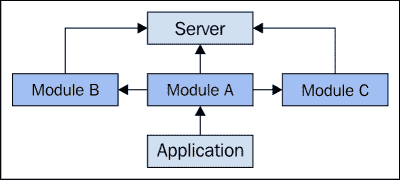
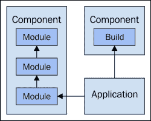
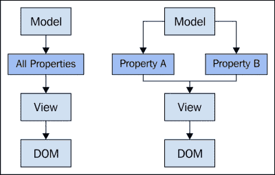
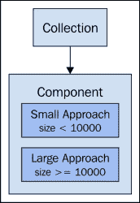

# 第七章： 加载时间和响应性

JavaScript 的可伸缩性包括应用程序的*加载时间*以及用户与应用程序交互时的*响应性*。共同地，我们将这两个架构品质称为性能。在用户眼中，性能是质量的主要指标——正确地做到这一点很重要。

随着我们的应用程序获得新功能和用户基础的增长，我们必须找到避免相关性能下降的方法。初始加载受到诸如 JavaScript 工件负载大小等因素的影响。我们 UI 的响应性更多地与代码的运行特性有关。

在本章中，我们将探讨这两个性能维度的各种权衡，以及它们将如何影响系统其他区域。

# 组件工件

在书的早期部分，我们强调过，大型 JavaScript 应用程序只是组件的集合。这些组件以复杂和精细的方式相互通信——这些通信实现了我们系统的行为。在组件可以通信之前，它们必须被交付到浏览器。了解这些组件是由什么组成的，以及它们实际上是如何被交付到浏览器的，有助于我们推理出应用程序的初始加载时间。

## 组件依赖

组件是我们应用程序的基石；这意味着我们需要将它们交付给浏览器，并以某种连贯的方式执行它们。组件本身可以从单体的 JavaScript 文件，到分布在几个模块中的东西。所有拼图碎片都是通过依赖图拼在一起的。我们从一个应用程序组件开始，因为这是进入我们应用程序的入口点。它通过要求它们来找到所有它需要的组件。例如，可能只有少数几个顶级组件，它们映射到我们软件的关键功能。这是依赖树的第一层，除非我们的所有功能组件都是单体构成的，否则可能还会有进一步的模块依赖需要解决。

模块加载机制遍历树结构，直到获取所需的所有内容。模块及其依赖关系细化到合理粒度的好处是，很多复杂性都被隐藏了起来。我们不需要在脑海中持有整个依赖图，这对于中等规模的应用来说是一个不切实际的目标。

这种模块化结构和用于加载和处理依赖的机制带来了性能影响。具体来说，初始加载时间会受到影响，因为模块加载器需要遍历依赖图，并为每个资源向后端请求。虽然请求是异步的，但网络开销依然存在——这在初始加载时对我们影响最大。

然而，仅仅因为我们想要一个模块化结构，并不意味着我们必须承担网络开销的后果。尤其是当我们开始扩展大量功能和大量用户时。每个客户端会话需要交付更多内容，随着更多用户请求相同的事物，后端资源争用也会增加。模块依赖关系是可以追踪的，这为我们的构建工具提供了许多选项。



如何加载 JavaScript 应用程序模块；依赖项会自动加载。

## 构建组件

当我们的组件达到一定复杂程度时，它们可能需要不仅仅是几个模块来实现所有功能。随着组件数量的增加，我们给自己制造了网络请求开销问题。即使模块携带的数据量很小，仍然需要考虑网络开销。

我们应该实际上追求更小的模块，因为它们更容易被其他开发者消费——如果它们小，那么它们很可能有更少的运动部件。如前所见，模块及其之间的依赖关系使我们能够实现分而治之。这是因为模块加载器追踪依赖关系图，并在需要时拉入模块。

如果我们想避免向后端发送这么多请求，我们可以将更大的组件工件作为构建工具链的一部分来构建。有许多工具可以直接利用模块加载器来追踪依赖关系，并构建相应的组件，如 RequireJS 和 Browserify。这很重要，因为它意味着我们可以选择适合我们应用程序的模块粒度，同时仍然能够构建更大的组件工件。或者我们也可以切换回实时将较小模块加载到浏览器中。

在网络请求开销方面的扩展含义造成了很大的影响。组件越多，这些组件越大，构建过程就越重要。特别是自从进行了代码压缩以来，这个压缩文件大小的过程经常是构建过程的一部分。能够关闭这些构建步骤，另一方面，对开发团队的可扩展性也有影响。如果我们能够在这之间切换浏览器接收的组件工件类型，那么开发过程可以推进得更快。



构建组件会导致请求的工件更少，网络请求也较少。

# 加载组件

在本节中，我们将探讨负责将我们的源模块和构建组件实际加载到浏览器中的机制。目前有许多第三方工具用于结构化我们的模块并声明它们的依赖关系，但趋势是转向使用这些任务的新浏览器标准。我们还将探讨延迟加载模块以及加载延迟对用户体验的影响。

## 加载模块

目前在生产中使用的大型应用程序许多都采用了如 RequireJS 和 Browserify 这样的技术。RequireJS 是一个纯粹的 JavaScript 模块加载器，它有可以构建较大组件的工具。Browserify 的目标是使用为 Node.js 编写的代码来构建在浏览器中运行的组件。尽管这两种技术都解决了本章讨论的许多问题，但新的 ECMAScript 6 模块方法才是未来的发展方向。

支持使用基于浏览器的模块加载和依赖管理方法的主要论点是，不再需要另一个第三方工具。如果语言有一个解决扩展问题的特性，走那条路总是更好的，因为我们的工作量会少一些。这肯定不是万能的，但它确实具备我们所需的大部分功能。

例如，我们不再需要依赖发送 Ajax 请求，并在请求到达时评估 JavaScript 代码——这一切都交给浏览器处理。该语法实际上与在其他编程语言中找到的标准`import export`关键词更加一致。另一方面，原生的 JavaScript 模块仍然是新宠，而仅仅因为这一点就抛弃使用不同模块加载器的代码还不够充分。对于新项目，研究允许我们一开始就使用这些新模块结构的 ES6 转换器技术是值得的。

### 注意

我们应用程序经历的网络开销的一部分，以及用户最终支付的一部分，与 HTTP 规范有关。该规范最新草稿版 2.0 解决了许多开销和性能问题。这对模块加载意味着什么？如果我们能够以最小的开销获得合理的网络性能，我们可能能够简化我们的构件。编译较大组件的需求可能会被推迟，以便专注于坚实的模块化架构。

## 懒加载模块

单块编译组件丧失的一个优势是，我们可以推迟到实际需要时才加载某些模块。对于编译组件来说，要么全部加载，要么全部不加载——这在我们整个前端被编译成一个单独的 JavaScript 文件时尤其正确。好处是，当需要时一切都已准备就绪。如果用户决定在初次加载后五分钟与一个功能互动，代码早已在浏览器中，随时待命。

另一方面，懒加载是默认模式。这意味着模块直到另一个组件明确请求它时才被加载到浏览器中。这可能意味着一个`require()`调用或一个`import`声明。在这些调用被作出之前，它们不会从后端获取。好处是，初始页面加载应该要快得多，它只拉取初始显示给用户的特性所需的模块。

另一方面，当用户在初始加载五分钟后尝试使用某个功能时，我们的应用程序将首次需要或导入一些模块。这意味着在初始加载后会有一些延迟。请注意，随后的会话中按需加载的模块数量应该很少。因为必然有一些共享模块在用户最初看到的页面中被加载。

我们必须仔细考虑我们系统中的依赖关系。尽管我们可能认为我们推迟了某些模块的加载，但可能存在一些间接依赖，它们会在不需要的时候无意中加载主页面的模块。开发工具中的网络面板为此提供了理想的功能，因为通常很明显我们正在加载我们实际上不需要的东西。如果我们的应用有很多功能，懒加载尤其有帮助。初始加载时间的节省是巨大的，而且很可能有些用户从未使用过这些功能，因此也无需加载。

接下来是一个示例，展示了在实际需要时才加载模块的概念：

```js
// stuff.js
// Export something we can call from another module...
export default function doStuff() {
    console.log('doing stuff');
}

// main.js
// Don't import "doStuff()" till the link
// is clicked.
document.getElementById('do-link')
    .addEventListener('click', function(e) {
        e.preventDefault();

        // In ES6, it's just "System.import()" - which isn't easy
        // to do across environments yet.
        var loader = new traceur.runtime.BrowserTraceurLoader();
        loader.import('stuff.js').then(function(stuff) {
            stuff.default();
        });
    });
```

## 模块加载延迟

模块是对事件的响应而加载的，而这些事件几乎总是用户事件。应用被启动。选择了一个标签页。这类事件如果它们尚未被加载，有可能会加载新的模块。挑战在于在这些代码模块还在传输中或被评估时，我们能为此类用户做些什么？因为正是我们在等待的代码，所以我们不能执行那些能提供更好加载体验的代码。

例如，在我们有一个模块被加载，以及它所有的依赖都被加载之前，我们无法执行那些对用户感知到的 UI 响应性至关重要的操作。这些操作包括发起 API 调用，以及操纵 DOM 以提供用户反馈。没有来自 API 的数据，我们只能告诉用户，*耐心点，东西正在加载!* 如果用户因为我们的模块需要一些时间而且加载指示器没有消失而感到沮丧，他们将会开始随机点击看起来可以点击的元素。如果我们没有为这些元素设置任何事件处理程序，那么 UI 将感觉不响应。

以下是示例，展示了导入运行昂贵代码的模块如何阻塞导入模块中代码的运行：

```js
// delay.js

var i = 10000000;

// Eat some CPU cycles, causing a delay in any
// modules that import this one.
console.log('delay', 'active');
while (i--) {
    for (let c = 0; c < 1000; c++) {

    }
}
console.log('delay', 'complete');

// main.js

// Importing this module will block, because
// it runs some expensive code.
import 'delay.js';

// The link is displayed, and it looks clickable,
// but nothing happens. Because there's no event
// handler setup yet.
document.getElementById('do-link')
    .addEventListener('click', function(e) {
        e.preventDefault();
        console.log('clicked');
    });
```

网络是不可预测的，我们应用后台所面对的规模化的影响者也是如此。用户众多意味着在加载我们的模块时可能会产生高延迟。如果我们想要扩展，就必须考虑这些情况。这涉及到使用策略。在主应用之后我们需要加载的第一个模块，是能够通知用户的功能。

例如，我们的 UI 有一个默认的加载器元素，但是当我们的第一个模块加载时，它会继续渲染关于正在加载的内容以及可能需要多长时间的更详细信息，或者，它可能只需要传达网络或后端存在问题的坏消息。随着我们的扩展，这类不愉快的事件会发生。如果我们想要继续扩展，我们必须尽早考虑这些问题，并使 UI 始终感觉响应灵敏，即使它实际上不是。

# 通信瓶颈

当我们的应用程序拥有更多的运动部件时，它会增加更多的通信开销。这是因为我们的组件需要彼此通信以实现特性的更大行为。如果我们愿意，我们可以将组件间的通信开销减少到几乎为零，但那样我们将面临单体和重复代码的问题。如果我们想要模块化的组件，通信是必须的，但这需要付出代价。

本节将探讨在我们扩展软件时可能会遇到的一些与通信瓶颈有关的问题。我们需要寻找在不牺牲模块化的情况下提高通信性能的折衷方案。其中最有效的方法之一是使用我们网络浏览器中可用的分析工具。它们可以揭示用户在与我们的 UI 交互时所经历的同等响应问题。

## 减少间接性

主要的抽象概念是通过事件经纪人实现的，我们的组件通过他彼此间进行通信。经纪人的职责是维护任何给定事件类型的订阅者列表。我们的 JavaScript 应用程序在两个方面可扩展——给定事件类型的订阅者数量和事件类型数量。在性能瓶颈方面，这可能会迅速变得无法控制。

我们首先想要密切关注的是我们特性的构成。实现一个特性时，我们将遵循现有特性的相同模式。这意味着我们将使用相同的组件类型，相同的事件等。虽然有细微的差异，但跨特性的总体模式是相同的。这是一个好习惯：遵循特性间的相同模式。所使用的模式是了解如何减少开销的良好起点。

例如，说我们应用程序中使用的模式需要 8-10 个组件来实现给定特性。这是开销太大。这些组件中的任何一个都要与几个其他组件通信，其中一些抽象概念并没有那么有价值。它们在我们的脑海中和设计纸上看起来很好，因为这是我们设计起源于架构的模式。现在我们已经实现了这个模式，最初的价值已经有点稀释，现在变成了一个性能问题。

接下来是一个示例，它展示了仅仅添加新组件就足以使通信开销成本呈指数级增加：

```js
// component.js
import events from 'events.js';

// A generic component...
export default class Component {

    // When created, this component triggers an
    // event. It also adds a listener for that
    // same event, and does some expensive work.
    constructor() {
        events.trigger('CreateComponent');
        events.listen('CreateComponent', () => {
            var i = 100000;
            while (--i) {
                for (let c = 0; c < 100; c++) {}
            }
        });
    }

};

// main.js
import Component from 'component.js';

// A place to hold our created components...
var components = [];

// Any time the add button is clicked, a new
// component is created. As more and more components
// are added, we can see a noticeable impact on
// the overall latency of the system.
// Click this button for long enough, and the browser
// tab crashes.
document.getElementById('add')
    .addEventListener('click', function() {
        console.clear();
        console.time('event overhead');
        components.push(new Component());
        console.timeEnd('event overhead');
        console.log('components', components.length);
    });
```

松耦合的组件是一件好事，因为它们分离了关注点，并且给了我们更少的实现风险和更多的实现自由。我们组件之间的耦合方式建立了一个可重复的模式。在初始实现之后的某个时刻，随着我们软件的成熟，我们会意识到曾经很好地服务于我们的模式现在过于复杂。我们组件的关注点已经被很好地理解，我们不再需要我们曾经认为可能需要的实现自由。解决这个问题的是改变模式。模式是被遵循的，所以它是未来我们代码的样子 ultimate indicator。它是解决通信瓶颈的最佳位置，通过移除不必要的组件。

## 代码分析

我们只需查看我们的代码，就能直观地感觉到有很多不必要的复杂性。正如我们在上一节所看到的，应用程序中使用的组件间通信模式非常明显。我们可以在逻辑设计层面看到过量的组件，但在运行时物理层面呢？

在我们开始重构代码、改变模式、移除组件等之前，我们需要对代码进行基准测试。这将给我们一个关于我们代码的运行时性能特性的想法，而不仅仅是它看起来如何。配置文件为我们提供了我们需要的信息，以对优化做出有用的决策。最重要的是，通过配置我们的代码，我们可以避免对最终用户体验影响很小或没有影响的微优化。至少，我们可以优先解决我们需要处理的性能问题。我们组件之间的通信开销很可能会优先考虑，因为它对用户的影响最直观，并且是一个巨大的扩展障碍。

我们可以使用的第一个工具是浏览器的内置分析工具。我们可以手动使用开发者工具 UI 来分析整个应用程序，同时与之交互。这对于诊断 UI 的具体响应性问题很有用。我们还可以编写使用相同浏览器内分析机制的代码，针对更小的代码片段，如单个函数，并获得相同的输出。结果配置文件实际上是一个调用堆栈，详细介绍了 CPU 时间是如何花费的。这指向了正确的方向，因此我们可以将精力集中在优化昂贵的代码上。

### 注意

我们只是触及了分析 JavaScript 应用程序性能的表面。这是一个巨大的主题，你可以在 Google 上搜索“分析 JavaScript 代码”-那里有很多好的资源。这是一个让你入门的好资源：[`developer.chrome.com/devtools/docs/cpu-profiling`](https://developer.chrome.com/devtools/docs/cpu-profiling)

下面是一个示例，展示了如何使用浏览器开发者工具创建一个比较几个函数的配置文件：

```js
// Eat some CPU cycles, and call other functions
// to establish a profilable call stack...
function whileLoop() {
    var i = 100000;

    while (--i) {
        forLoop1(i);
        forLoop2(i);
    }
}

// Eat some CPU cycles...
function forLoop1(max) {
    for (var i = 0; i < max; i++) {
        i * i;
    }
}

// Eat less CPU cycles...
function forLoop2(max) {
    max /= 2;
    for (var i = 0; i < max; i ++) {
        i * i;
    }
}

// Creates the profile in the "profile" tab
// of dev tools.
console.profile('main');
whileLoop();
console.profileEnd('main');
// 1177.9ms 1.73% forLoop1
// 1343.2ms 1.98% forLoop2
```

存在一些可以在浏览器外部分析 JavaScript 代码的工具。我们使用它们各有不同的目的。例如，benchmark.js 以及与之类似的工具，用于测量我们代码的原始性能。输出结果告诉我们每秒我们的代码可以运行多少次操作。这种方法真正有用的地方在于比较两个或更多函数的实现。分析可以为我们提供哪个函数最快，以及优势有多大的详细 breakdown。归根结底，这是我们最需要的重要分析信息。

# 组件优化

现在我们已经解决了组件通信性能瓶颈的问题，是时候看看我们组件内部了，具体是在实现细节和它们可能带来的性能问题上。例如，维护状态是 JavaScript 组件的一个常见要求，然而，从性能角度来看，这并不容易扩展，因为需要所有的记账代码。我们还需要注意那些修改其他组件使用的数据的函数引入的副作用。最后，DOM 本身以及我们的代码与它交互的方式，有很多可能导致不响应。

## 维护状态的组件

我们代码中的大多数组件需要维护状态，这在很大程度上是不可避免的。例如，如果我们的组件由一个模型和一个视图组成，视图需要根据模型的状态来决定何时重新渲染自己。视图还持有一个 DOM 元素的引用——直接或通过选择器字符串——而任何给定的元素在任何时候都具有状态。

所以状态是我们组件中的一个事实——这有什么大不了的？实际上，真的没有什么大不了的。事实上，我们可以写出一些真正的事件驱动的代码，这些代码对状态的变化做出反应，从而改变用户所看到的内容。当然，问题出现在我们进行扩展的时候；我们的组件单独来看，需要维护更多的状态，后端提供的数据模型变得更加复杂，DOM 元素也是如此。所有这些具有状态的东西都相互依赖。随着这些系统的增长，会带来大量的复杂性，并且真的可能会损害性能。

幸运的是，我们使用的框架为我们处理了很多这种复杂性。不仅如此——它们还针对这些类型的状态变更操作进行了大量优化，因为这对于使用它们的应用程序来说是如此基础。不同的框架采取不同的方法来处理组件状态的变化。例如，一些采取了更自动化的方法，这需要更多的开销来监控状态的变化。其他的更明确，状态是显式改变的，因此直接结果是事件被触发。后者的方法要求程序员更加自律，但也需要更少的开销。

为了避免随着组件数量及其复杂性的增加可能出现的性能问题，我们可以采取两件事。首先，我们要确保只维护那些重要事物的状态。例如，如果我们为永远不会发生状态变化设置处理程序，这是浪费的。同样地，如果我们有组件状态发生变化并触发永远不会导致 UI 更新的事件，这也是浪费的。虽然难以发现，但如果能避免这些隐藏的宝藏，我们也将避免与响应性相关的未来扩展问题。



视图可以对任何模型属性变化做出相同反应；或者，它们可以对特定属性变化有特殊反应。虚拟 DOM 试图为我们自动化这个过程。

## 处理副作用

在前一部分，我们探讨了组件维护的状态以及如果我们不小心，它们如何影响性能。那么这些状态变化是如何发生的呢？它们不是自发发生的——必须有什么明确地改变变量的值。这称为副作用，是另外一种可能影响性能且不可避免的东西。副作用是我们在前一部分讨论的状态变化的原因，如果不对它们小心处理，它们也会影响性能。

具有副作用的函数相反的是纯函数。这些函数接收输入并返回输出。中间没有状态变化。这类函数具有所谓的**引用透明性**——这意味着对于给定的输入，无论我们调用函数多少次，我们都保证有相同的输出。这个属性对于优化和并发性等事情很重要。例如，如果对于给定的输入我们总是得到相同的结果，函数调用的时间地点实际上并不重要。

想想我们应用程序中共享的通用组件和特定功能的组件。这些组件不太可能维护状态——状态更有可能存在于更接近 DOM 的组件中。这些顶级组件中的函数是没有副作用实现的好的候选者。甚至我们的功能组件也可能实现没有副作用的函数。作为一个经验法则，我们应该将我们的状态和副作用推送到尽可能接近 DOM 的地方。

正如我们在第四章*组件通信与职责*所看到的，在大致的发布/订阅事件系统中，要心理追溯正在发生的事情是困难的。有了事件，我们实际上并不需要追踪这些路径，但有了函数，情况就不同了。挑战在于，如果我们的函数改变了某物的状态，并且这导致了系统其他地方的故障，要追踪这类问题是非常困难的。此外，我们使用越多的无副作用函数，就越不需要进行理智检查的代码。我们经常遇到一些检查某物状态的代码片段，看似无原因。原因就在于——这是它工作的方式。这种方法在开发努力的扩展上只能走那么远。

下面是一个展示有副作用函数与*无*副作用函数的例子：

```js
// This function mutates the object that's
// passed in as an argument.
function withSideEffects(model) {
    if (model.state === 'running') {
        model.state = 'off';
    }

    return model;
}

// This function, on the other hand, does not
// introduce side-effects because instead of
// mutating the "model", it returns a new
// instance.
function withoutSideEffects(model) {
    return Object.assign({}, model, model.state === 'off' ?
        { state: 'running' } : {});
}

var first = { state: 'running' },
    second = { state: 'off' },
    result;

// We can see that "withSideEffects()" causes
// some unexpected side-effects because it
// changes the state of something that's used
// elsewhere.
result = withSideEffects(first);
console.log('with side effects...');
console.log('original', first.state);
console.log('result', result.state);

// By creating a new object, "withoutSideEffects()",
// doesn't change the state of anything. It can't
// possibly introduce side-effects somewhere else in
// our code.
result = withoutSideEffects(second);
console.log('without side effects...');
console.log('original', second.state);
console.log('result', result.state);
```

## DOM 渲染技术

更新 DOM 是昂贵的。优化 DOM 更新的最佳方法是不更新它们。换句话说，尽可能少地更新。我们应用扩展的挑战在于 DOM 操作变得更为频繁，出于必要。需要监视的状态更多，需要通知用户的事情也更多。即便如此，除了我们选择的框架所采用的技术外，我们还可以通过编写代码来减轻 DOM 更新的负担。

那么，为什么 DOM 更新相对于在页面中运行的简单 JavaScript 来说如此昂贵呢？确定显示应该看起来怎样的计算过程，消耗了大量的 CPU 周期。我们可以采取措施减轻浏览器渲染引擎的负载，使用在我们的视图组件中需要的更少工作的技术，从而提高 UI 的响应性。

例如，重排是导致一系列需要进行的计算的渲染事件。本质上，重排发生在我们元素的某些方面发生变化时，这可能导致其他附近元素布局的改变。整个过程在整个 DOM 中级联，所以一个看似廉价的 DOM 操作可能造成相当多的开销。现代浏览器中的渲染引擎很快。我们可以在 DOM 代码中有点粗心，UI 将表现完美。但随着新移动部件的增加，DOM 渲染技术的可扩展性就发挥作用了。

因此，首先要考虑的是，哪些视图更新可能导致重排？例如，改变元素的内容不是什么大问题，很可能永远不会导致性能问题。将新元素插入页面中，或者响应用户交互更改现有元素的样式——这些都可能带来响应性问题。

### 注意

目前流行的一个 DOM 渲染技术是使用**虚拟 DOM**。ReactJS 和其他类似库利用了这个概念。想法是，我们的代码可以直接将内容渲染到 DOM 中，就像它是在第一次渲染整个组件一样。虚拟 DOM 拦截这些渲染调用，并找出已经渲染的内容和发生变化的内容之间的差异。虚拟 DOM 的名字来源于事实，即 DOM 的表示形式存储在 JavaScript 内存中，并用于进行比较。这样，只有在绝对必要时才会触摸真实的 DOM。这种抽象允许进行一些有趣的优化，同时保持视图代码的简洁性。

不断地向 DOM 发送更新也不是理想的选择。因为 DOM 会接收到需要执行的更改列表，并按顺序应用它们。对于可能引发多次重排的复杂 DOM 更新，最好先卸载 DOM 元素，进行更新，然后重新挂载。当元素重新挂载时，昂贵的重排计算一次性完成，而不是连续几次执行。

然而，有时问题并不在 DOM 本身——而是在 JavaScript 的单线程特性。当我们的组件 JavaScript 正在运行时，DOM 没有机会渲染任何待处理的更新。如果在某些情况下我们的 UI 无响应，最好设置一个超时，让 DOM 更新。这也给了任何待处理的 DOM 事件一个被处理的机会，这对于用户在 JavaScript 代码运行时尝试做某事来说很重要。

接下来是一个示例，展示了如何在 CPU 密集型计算期间延迟运行 JavaScript 代码，给 DOM 一个更新机会：

```js
// This calls the passed-in "func" after setting a
// timeout. This "defers" the call till the next
// available opportunity.
function defer(func, ...args) {
    setTimeout(function() {
        func(...args[0]);
    }, 1);
}

// Perform some expensive work...
function work() {
    var i = 100000;
    while (--i) {
        for (let c = 0; c < 100; c++) {
            i * c;
        }
    }
}

function iterate(coll=[], pos=0) {
    // Eat some CPU cycles...
    work();

    // Update the progress in the DOM...
    document.getElementById('progress').textContent =
        Math.round(pos / coll.length * 100) + '%';

    // Defer the next call to "iterate()", giving the
    // DOM a chance to display the updated percentage.
    if (++pos < coll.length) {
        defer(iterate, [ coll, pos ]);
    }
}

iterate(new Array(1000).fill(true));
```

Web Workers 是另一种处理长时间运行的 JavaScript 代码的可能性。因为它们不能接触 DOM，所以它们不会影响 DOM 的响应性。然而，这项技术超出了本书的范围。

# API 数据

随着我们继续扩展，性能问题的最后一个主要障碍将是应用程序数据本身。这是我们必须特别注意的一个领域，因为有这么多影响扩展的因素在起作用。更多功能并不一定意味着更多数据，但通常确实如此。这意味着更多类型的数据和更多的数据量。后者主要受我们软件不断增长的用户基础的影响。我们作为 JavaScript 架构师的工作是要找出我们如何扩展应用程序，以应对加载时间增加和数据到达浏览器时的数据量增加。

## 加载延迟

或许对我们应用程序性能扩展的最大威胁就是数据本身。我们应用程序数据随时间变化和演进的方式 somewhat of a phenomenon。我们前端添加的功能确实影响了我们数据的形状，但我们的 JavaScript 代码不控制用户数量或他们与我们的软件互动的方式。后两者可能导致数据爆炸，如果我们的前端没有准备，它将停止运行。

我们作为前端工程师面临的挑战是，当我们等待数据时，用户没有什么可显示的。我们所能做的就是采取必要的步骤，提供一个可接受的*加载*用户体验。这引出了一个问题——当我们等待数据加载时，我们是否应该用加载信息遮挡整个屏幕，还是为等待数据的元素逐一显示加载信息？第一种方法，用户很少有风险做不允许的事情，因为我们阻止了他们与 UI 交互。第二种方法，我们需要担心在网络请求未完成时用户与 UI 交互。

这两种方法都不理想，因为数据加载的任何时刻，我们应用程序的响应性都会受到根本性的限制。我们不想完全阻止用户与 UI 交互。所以，也许我们需要对数据加载强制执行严格的超时。好处是，我们保证了响应性，即使响应是告知用户后端正在花费太长时间。缺点是，有时等待是必要的，就用户而言，如果需要完成某事。有时，糟糕的用户体验是可取的——而不是无意中创造出更糟糕的体验。

为了帮助后端数据扩展，前端需要做两件事。首先，尽可能地缓存响应。这减轻了后端的负载，而且使用了缓存数据的客户端响应性也更强，因为它无需再次请求。显然，我们需要一种失效机制，因为我们不想缓存过时的数据。WebSocket 在这里是一个很好的解决方案候选——即使它们只通知前端会话某个特定实体类型已更改，以便清除缓存。第二种帮助处理增长数据集的技术是减少任何给定请求加载的数据量。例如，大多数 API 调用都有选项，让我们限制结果的数量。这需要保持在一个合理的范围内。有助于思考用户首先需要查看什么，并围绕这一点进行设计。

## 处理大数据集的工作

在前一节中，我们讨论了前端开发中与应用程序数据相关的扩展问题。随着我们应用程序的增长，数据也在增长，这带来了一个加载挑战。一旦我们设法将数据加载到浏览器中，我们仍然有很多数据需要处理，这可能导致用户交互不响应。例如，如果我们有一个 1000 项的集合，并且一个事件将这个结构传递给几个组件进行处理，用户体验就会受到影响。我们需要的是帮助我们将大数据集和难以扩展的数据集转换为仅包含必需品的工具。

这就是低级实用库大显身手的地方——对大数据集进行复杂转换。更大的框架可能暴露出类似的工具——它们很可能在幕后使用低级实用工具。我们将要在数据上执行的转换是映射-减少（map-reduce）类型的。无论如何，这是抽象的模式，函数式编程库如 Underscore/lodash 提供了这个模式的许多变体。这如何帮助我们处理大数据集的扩展呢？我们可以编写干净、可复用的映射和减少功能，同时将许多优化工作推迟到这些库中。

### 注意

理想情况下，我们的应用程序只加载当前页面渲染所需的数据。很多时候这根本不可能——API 不能为我们的功能所需的每个可能的查询场景都做好准备。所以，我们用 API 进行广泛过滤，然后当数据到达时，我们的组件使用更具体的条件对数据进行过滤。

在这里，扩展问题在于后端过滤的内容和浏览器中过滤的内容之间的混淆。如果一个组件更多地依赖 API，而其他组件则在本地进行大部分过滤，这会导致开发者之间的混淆，以及非直观的代码。如果 API 发生微妙变化，甚至可能导致不可预测的错误，因为我们的组件以不同的方式使用它。

映射或减少的时间越少，UI 对用户的响应性越强。这就是为什么我们要尽早获取用户看到的数据非常重要的原因。例如，我们不想在数据一到达就立即在事件中传递 API 数据。我们需要以这样的方式构建组件通信，即在可能的情况下尽快进行计算密集型的集合过滤。这减轻了所有组件的工作负担，因为它们现在正在处理一个较小的集合。因此，扩展到更多组件并不是什么大问题，因为它们将处理更少的数据。

# 运行时优化组件

我们的代码应该针对常见情况进行优化。这是一个不错的扩展策略，因为随着更多功能和用户的加入，增长的是常见情况，而不是边缘情况。然而，总是有可能我们会处理两个同样常见的案例。想想将我们的软件部署到多个客户环境中的情况。随着功能的发展以满足客户的需求，对于任何给定的功能，可能会有两到三个常见情况。

如果我们有两个处理常见情况的函数，那么我们需要在运行时确定使用哪个函数。这些常见情况非常粗粒度。例如，一个常见情况可能是“集合很大”或“集合很小”。检查这些条件并不昂贵。因此，如果我们能够适应不断变化的常见情况，那么我们的软件将比如果我们不能适应变化条件时的响应性更强。例如，如果集合很大，函数可以采取不同的过滤方法。



组件可以在运行时根据大型或小型集合等粗分类改变其行为。

# 总结

从用户的角度来看，响应性是质量的一个强烈指标。不响应的用户界面令人沮丧，并且不太可能需要我们在扩展方面做出任何进一步的努力。应用程序的初始加载是用户对我们应用程序的第一个印象，也是最难快速实现的部分。我们研究了将所有资源加载到浏览器中的挑战。这是模块、依赖项和构建工具的组合。

在 JavaScript 应用程序中，响应性的下一个主要障碍是组件间通信的瓶颈。这通常是由于过多的间接性，以及实现特定功能所需的事件设计。组件本身也可能成为响应性的瓶颈，因为 JavaScript 是单线程的。我们讨论了这一领域的几个潜在问题，包括维护状态的成本，以及处理副作用的成本。

API 数据是用户关心的内容，直到我们拥有这些数据，用户体验才会下降。我们研究了扩展 API 及其内部数据带来的扩展问题。一旦我们拥有了数据，我们的组件需要能够快速地映射和减少它，同时数据集在我们扩展时继续增长。现在我们已经有了如何使我们的架构表现良好的更好想法，是时候考虑如何使其在各种环境中具有可测试性和功能性了。
