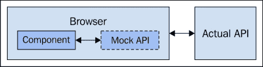
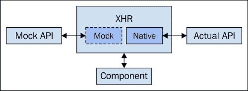
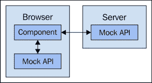
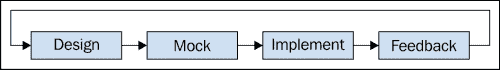
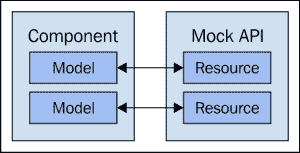
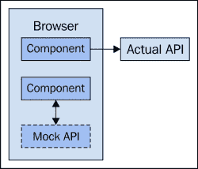
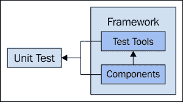
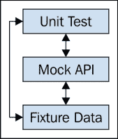
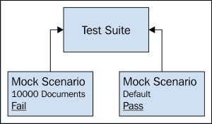
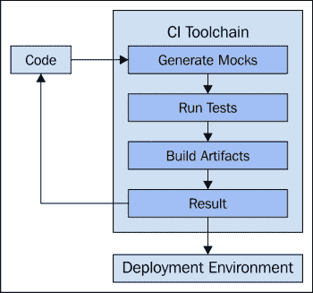

# 第八章：可移植性与测试

网络应用已经走了很长的路，仅仅几年前还只是简单地在网页中嵌入 JavaScript 代码。如今，我们在构建 JavaScript 应用程序，如果你在读这本书，那么是在构建可扩展的应用程序。这意味着我们的架构需要考虑到可移植性；后端服务于我们的应用程序并为其提供数据，是可替换的。

与可移植性相伴的是测试性的想法。当我们开发大规模的 JavaScript 代码时，我们不能对后端做出假设，这意味着有能力在没有后端的情况下运行。本章将探讨这两个密切相关的话题以及它们在面对不断变化的扩展影响时对我们意味着什么。

# 解耦后端

如果我们还需要更多的动机来证明 JavaScript 不再只用于可脚本的网页，那就看看 Node.js 吧。它不需要完整的浏览器环境，只需要 V8 JavaScript 引擎。Node 主要是作为后端服务器环境创建的，但它仍然很好地展示了 JavaScript 语言已经取得了多大的进步。同样，我们希望我们的代码是可移植的，能够与任何我们可以投入的后端基础设施一起运行。

在本节中，我们将探讨为什么我们要松耦合我们前端 JavaScript 代码与其后端 API 之间的联系。然后，我们将介绍模拟 API 的第一步，完全不需要后端。

## 模拟后端 API

如果我们正在开发一个大规模的 JavaScript 应用程序，我们将有一个后端基础设施的初步构建。那么，为什么我们还要考虑将我们的代码与这个后端分离，使其不再依赖于它呢？在追求可扩展性时，支持松耦合的组件总是好的，这对于 Web 应用程序中前端和后端环境之间的耦合也是正确的。即使后端 API 永远不会改变，我们也不能假设构建 API 所使用的技术和框架永远不会改变。松耦合这种依赖关系还有其他好处——比如能够独立于系统其他部分更新 UI。但模拟后端 API 的主要扩展好处来自于开发和测试的角度。能够快速搭建新的 API 端点并对其进行请求测试是没有替代品的。模拟 API 是我们 JavaScript 代码的碰撞测试假人。

不管喜欢与否，有时我们感觉自己好像在创建演示软件——在开发冲刺中间，我们必须向感兴趣的利益相关者展示我们所拥有的东西。与其让这导致绝望，我们应该从我们的模拟数据中获得信心。演示不再是大问题，而且有了我们模拟数据的信心，我们将开始将这些事件视为对自己的小挑战。当然，我们总是要维护一个英雄程序员的外表——为了管理人员的利益！

考虑到模拟数据有多棒，那么它的缺点是什么呢？就像我们产品中的任何东西一样，它是一种需要维护的软件——这总是伴随着风险。例如，如果模拟 API 与实际 API 不同步，或者它 creates confusion between what's functional in the UI versus what's mocked，那么它的价值就会降低。为了应对这些风险，我们必须制定围绕我们设计和实现功能的过程，我们稍后会讨论这些。

模拟 API 位于任何与实际 API 通信的组件之外；当移除模拟时，组件并不会知道更好

## 前端入口点

前端和后端接口的边界在哪里？这是我们希望进行切换的地方，在模拟数据和 API 正常返回的数据之间。这个边界实际上可能位于 web 服务器后面——在这种情况下，我们仍然在进行真实的 HTTP 请求，只是没有与真实应用程序交互。在其他情况下，我们完全在浏览器中进行模拟，HTTP 请求在离开浏览器之前被模拟库处理程序拦截。

在两种模拟方式中，我们前端应用程序之间都有一个概念上的边界——这是我们试图建立的。一旦我们找到它，这是关键，因为它代表了我们与后端的独立性。在生产中紧密耦合后端并没有什么问题——那就是它的目的。在其他情况下，例如在开发过程中，能够编排我们的组件发送 API 请求时发生的事情，是一种关键的扩展策略。

有可能直接使用模型和集合创建模拟数据模块。例如，如果我们正在运行在模拟模式，我们会导入这个模块，我们就会有模拟数据可以工作。这种方法的问题是，我们的应用程序知道它实际上并没有与后端真正工作。我们不希望这样。因为我们希望我们的代码运行得好像它在生产环境中运行一样。否则，我们将会经历手动实例化模拟的一些副作用——它需要尽可能地远离我们实际的代码。

无论我们决定采用哪种模拟机制，它都需要是模块化的。换句话说，我们需要有能力将其关闭并完全从构建中移除。在生产环境中，不应该有模拟。实际上，我们的模拟代码甚至不应该出现在生产构建中。如果我们通过 web 服务器提供模拟数据，这一点要容易实现一些。如果我们的模拟处理程序存在于浏览器中，我们需要以某种方式将它们移除，这需要某种构建选项。关于构建工具，我们稍后在第章节中会有更多介绍。

在浏览器中模拟 API 请求，拦截 XHR 级别的调用。如果有模拟代码，它会寻找模拟 API。当模拟被移除时，原生 HTTP 请求功能如常。

## 模拟工具

如前一部分所述，模拟后端 API 主要有两种方法。第一种方法是引入像 Mockjax 这样的库到我们的应用程序中以拦截 XHR 请求。第二种方法是在那里放置一个真实的 HTTP 服务器，但这个服务器实际上并没有接触到真正的应用程序——它像 Mockjax 方法一样提供模拟数据。

Mockjax 的工作方式简单而巧妙。它基于这样的假设：应用程序正在使用 jQuery `ajax()`调用来进行 HTTP 请求，这是一个相对安全的假设，因为大多数框架都在幕后使用这个。当调用 Mockjax 时，它用自己的功能覆盖了一些核心 jQuery XHR 功能。这是在每次进行 XHR 请求时运行的。它检查是否有与请求 URI 匹配的路由规范，如果找到，就会运行处理程序。否则，它将直接传递并尝试向后端发起请求——如果我们想将真实 API 请求与模拟请求结合起来，这还是挺有用的。我们稍后会深入研究这种结合。

任何给定的处理程序都可以返回 JSON 数据，或者任何其他格式，就像我们真实的 API 一样。关键在于我们的核心代码——我们的模型和集合初始化请求——对 Mockjax 一无所知，因为所有这些都是在更低的层次上发生的。同样的模型和集合代码在没有对生产后端进行修改的情况下运行。我们只需要在部署到真实 API 时，*拔掉*调用 Mockjax 的模块即可。

我们可以使用模拟 Web 服务器技术实现相同的属性——运行未修改的代码。这实际上是劫持 XHR 请求的完全相同的想法，只是在一个不同的层面上进行。主要优点是我们不需要在部署过程中采取任何特殊步骤。要么是模拟服务器，要么是真实服务器，在生产环境中，不太可能运行模拟服务器。缺点是我们确实需要一个正在运行的服务器，这对我们要求不高——但这确实是一个额外的步骤。而且我们确实失去了一些可移植性。例如，我们可以打包一个模拟构建发送给某人。如果它不需要 Web 服务器，整个应用程序可以在浏览器中演示。

从浏览器或后台 Web 服务器模拟 API；两种方法达到相同的结果——我们的代码不知道它正在与模拟通信。

## 生成模拟数据集

既然我们已经知道声明模拟 API 端点的选项，那么我们需要数据。假设我们的 API 返回 JSON 数据，我们可以将模拟数据存储在 JSON 文件中。例如，模拟模块可以将这些 JSON 模块作为依赖项引入，模拟处理程序可以将其作为数据源。但是这些数据从哪里来呢？

当我们开始构建模拟数据时，很可能存在一个 API，它正在某个地方运行。使用我们的浏览器，我们可以查看各种 API 端点返回的数据，并手动策划我们的模拟数据。如果 API 有文档，这个过程会简单得多，因为那样我们就会有线索，了解任何给定实体中任何给定字段允许的值。有时我们实际上没有创建模拟数据的起点——我们将在功能设计过程部分讨论这个问题。

手动创建我们的模拟数据集的优点是，我们可以确保它是准确的。也就是说，我们不希望创建与我们要模拟的数据不反映的东西，因为这将是整个目的的失败。更不用说跟上 API 变化的速度瓶颈了。理想的情况是使用一个工具来自动化生成模拟数据集的任务。它只需要知道给定实体的模式，然后就可以处理剩余的工作，接受几个参数并在其中加入一些随机性。

另一个有用的模拟数据生成工具可能是从给定部署中提取真实 API 数据的功能，并将其作为 JSON 文件存储。例如，假设有一个预演环境，我们的代码表现出问题。我们可以针对该环境运行我们的数据提取工具以获取所需的数据。由于我们希望尽量保持预演环境不变，这种方法是安全的，因为我们在诊断过程中对模拟数据造成的任何损害，都在内存中，可以轻松清除。

## 执行操作

实施模拟 API 的一个挑战性方面是执行操作。这些是除了 GET 以外的请求，通常需要改变某个资源的状态。例如，改变资源属性的值，或者彻底删除资源。我们需要一些通用的代码，我们的处理程序可以利用它来执行这些操作，因为我们的 API 端点在执行它们上的动作时应该遵循相同的模式。

实际上能否容易地实施取决于我们 API 动作工作流的复杂度。一个容易实施的动作可能就是修改资源的一个属性值然后返回`200`表示成功。然而，我们的应用程序很可能有更复杂的工作流，比如长时间运行的动作。例如，这类动作可能会返回一个新创建的*动作*资源的 ID，从那里，我们需要监控该动作的状态。我们的前端代码已经做到了这一点，因为那正是它需要与真实 API 一起工作的地方——我们需要在模拟中实现这些应用程序的细微差别。

操作可能会很快变得非常复杂。尤其是如果应用程序很大，有很多实体类型和很多操作。这里的想法是努力实现模拟这些操作的最小可行性成功路径。不要试图详细地模拟应用程序所做的每一件事——这不会扩展。

# 功能设计流程

我们不是为了好玩而创建模拟 API，我们是为了帮助开发功能。考虑到我们可能有一个相当大的 API，因此有很多要模拟的内容，我们需要一个过程来规范我们做事情的顺序。例如，我们需要等待 API 实施后再开始实现一个功能吗？如果我们能够模拟 API，那么我们就不必等待，但是 API 本身仍然需要设计，而且 API 有许多利益相关者。

在本节中，我们将回顾一些确保我们正确使用模拟，并以与我们的功能开发同步的方式进行操作的必要步骤。

## 设计 API

一些 API 端点足够通用，可以支持多个功能。这些是我们应用程序中的核心实体。通常，有一小部分实体扮演着至关重要的角色，大多数功能都会使用它们。另一方面，我们开发的大多数新功能将需要扩展我们的 API。这意味着一个新的 API 端点，或者几个。这取决于我们的后端资源是如何组合的，这涉及到一定程度的设计工作。

试图扩展我们的功能开发的问题在于，实现一个新的 API 可能需要花费很长时间。所以如果我们需要在开始开发前端功能之前就有 API，我们最终会推迟功能，这并不是理想的。我们希望在新鲜的时候开始做某件事。如果某件事在待办事项列表中积压，它经常永远留在那里。为拟议的功能实现一个模拟 API 让我们可以不拖延地开始滚动，这对于扩展开发是至关重要的。

当我们实现一个新 API 端点的模拟时，我们进入了绿色地带设计领域。这意味着我们必须考虑到那些可能不一定会进行前端开发的人的考虑。而且我们可能触及也可能不触及真实 API 的实际实现——这完全取决于我们的团队结构。话说回来，无论主题专家是谁，他们都需要透明地访问我们拟议的 API 的设计。他们可以提供建议、进行更改等等。继续走不可能的道路是没有意义的。另一种方法可能是让后端程序员草拟一个可能的 API 规范。这是纯粹的大局观；只包含最基本的端点，带有最小的属性和操作。其他的都是可以在我们模拟和实际代码之后轻易更改的细节。

在接触后端代码之前，使用模拟 API 实现功能可以帮助防止犯下昂贵的错误。例如，假设我们使用模拟 API 在前端实现了一些功能，直到它具有可演示性。这给了具有特定后端领域知识的工程师一个机会来指出功能的不可行性，从而让我们避免在未来犯下昂贵的错误。

设计模拟 API 的循环，以及针对它实现功能

## 实现模拟

现在我们已经接到实现一个功能的任务，第一步是实现一个模拟 API 来支持我们前端代码的开发。正如我们在上一节所看到的，我们应该与最终将实现真实 API 的人紧密合作。第一步是要确定高层次的 API 看起来是什么样的。其余的我们可以随着我们接近实现真实 API 而进行微调。

然而，在开发我们的模拟数据时，我们并不总是必须依赖 API 团队成员的手把手指导。我们可能有一些 API 端点，它们可能已经被我们的一些前端组件使用。话说回来，可能有一个可识别的模式我们可以遵循，尤其是如果模拟只是一个我们碰巧缺失的平凡实体类型的话。如果我们遵循一个好的模式，那么这就是一个好的起点，因为以后进行激进更改的机会更小。

当我们知道我们的模拟 API 看起来是什么样子，以及我们可以对其做些什么时，我们需要用模拟数据来填充它。如果我们已经有一些为其他模拟生成数据的工具，我们需要找出如何扩展这些工具。或者，我们只需要手动创建一些测试实体来开始。我们不想在前面花费太多时间输入数据。我们只需要最少的有效实体数量来证明我们的方法是可行的。

### 提示

我们可能并不总是想在创建数据之前就启动实际的模拟端点。相反，我们可能更愿意从数据出发，向上设计——设计正确的实体，而不是担心 API 本身的技术细节。这是因为，数据最终需要在某个地方进行存储，这是一个重要的活动。专注于数据让我们以不同的思维方式工作。选择最适合手头任务的处理方法。

我们所创建的模拟并不总是创造全新的东西。也就是说，我们模拟的 API 可能已经存在，或者其实现正在进行中。这实际上使得模拟的实现变得容易得多，因为我们可以向 API 作者请求示例数据，或者寻求帮助，以构建我们的模拟。记住，如果我们想要实现可移植性，我们必须能够将前端从后端中分离出来，这意味着我们需要模拟整个 API。

## 实施功能

现在我们已经有了我们的模拟 API，是时候受益了。事情并没有结束——模拟 API 经常进行微调。但这足以让我们开始编写真实的前端代码。立即，我们会发现一些问题。这些问题可能是拟议的 API 的问题，或者是与 API 通信的组件的问题。我们不能让这些问题沮丧，因为这正是我们所寻找的——早期发现问题。没有模拟 API 是无法获得这些的。

如果 API 普遍可行，而且我们的组件代码工作正常，我们可能会发现我们设计中的性能瓶颈。如果我们有生成模拟数据的工具，这尤其容易发现，因为生成 100,000 个实体轻而易举，看看我们的前端代码会发生什么。有时这需要快速重构，有时则需要完全改变方法。关键是我们要尽早而不是稍后找到这些问题。

我们可以通过模拟来做一件其他难以实现的事情，那就是经常进行演示。当我们严重依赖具有大量开销的大型后端环境时，这并不容易。如果少于几分钟就能让一个功能运行起来进行演示，我们可以自信地展示我们所做的。也许它是错误的，也许利益相关者会想到一些他们错过的事情，当他们看到他们的想法变为现实时。这就是模拟如何帮助我们通过早期和持续的反馈来扩展特征开发生命周期。

正在开发中的组件的内部，与模拟 API 端点通信

## 将模拟数据与 API 数据协调一致

此时，功能已经实现，我们如何协调为功能创建的模拟数据取决于实际 API 的状态。例如，如果我们只是模拟 API 中已经存在一段时间的东西，那么只要我们模拟和真实数据之间有高保真度，就可以安全地假设什么也不需要发生。然而，如果我们模拟的是一个全新的 API，有很大几率会发生一些变化，哪怕是微小的变化。重要的是我们要捕捉这些变化，确保我们的现有模拟数据在后续版本中保持相关性。

这是模拟过程中难以扩展且通常令人不愉快的一部分。我们的模拟数据有如此多的不同方式与实际 API 中的数据不同步，以至于很难尝试去跟上。如果我们有生成模拟数据的工具，那就容易多了。我们甚至可能能够根据 API 团队创建的规范生成整个 API。但这也存在问题，因为虽然模拟生成可以自动化，但规范本身需要在某个地方、以某种方式创建。因此，最好实现一个可以生成模拟数据的工具，但让我们的代码处理请求。只要我们不要重复自己太多，并且 API 有一个合理的模式，我们应该能够跟上我们的模拟数据。

另一种做法是在关闭某些模拟 API 端点的同时保留其他端点。可以把它看作是一种穿透——在这里，可以指定模拟端点的粒度，而不是只能切换整个模拟 API。例如，这种能力如果在调试应用程序中的特定问题时会非常有用，我们需要引导某些 API 端点返回特定的响应以复制问题。我们可以在 Mockjax 等库中实现这一点，因为不匹配请求路径规的请求只是被转发给本地的 XHR 机制。

一个组件使用模拟 API，而另一个使用实际 API

# 单元测试工具

是时候将注意力转向测试了，我们在学习了大规模模拟 API 端点的基础知识之后。我们模拟 API 的能力对于测试代码非常有用，因为我们可以使用同样的模拟数据或至少是同样的数据来进行测试。这意味着，如果我们的测试失败，我们可以开始与 UI 交互（如果需要的话），使用测试失败的相同数据，试图找出发生了什么。

我们将探讨使用随 JavaScript 框架提供的单元测试工具，并找出它们的价值观所在。我们还将研究使用更通用的独立测试框架，这些框架可以与任何代码一起运行。在本节结束时，我们将看看我们的测试如何自动化，以及这种自动化如何融入我们的开发工作流程。

## 框架内置工具

如果我们使用的是较大型的、全面的 JavaScript 应用程序框架，那么有很大概率它会自带一些单元测试工具。这些工具并不是要取代框架无关的现有单元测试工具。相反，它们是为了补充这些工具——为编写符合框架口味的测试提供特定支持。

对我们来说，这意味着我们需要编写更少的单元测试代码。如果我们遵循框架的模式，那么已经有很多单元测试工具了解我们的代码。例如，如果它已经知道我们将使用哪些组件来实现我们的功能，那么它可以为我们生成测试。这极大地帮助我们避免重复，并最终使我们的代码获得更全面的测试覆盖。

除了为我们生成测试骨架之外，框架测试设施还可以为我们提供测试中可用的实用函数。这意味着我们无需维护那么多单元测试代码，这之所以可能，是因为框架知道我们将在测试中想要做什么，并以实用函数的形式为我们抽象出这些操作。

依赖框架特定的测试工具的挑战在于，我们将把我们的产品与特定的框架耦合在一起。这对我们来说可能不是一个问题，因为一旦选定了一个框架，我们就会坚持使用它，对吧？嗯，不一定。在今天动荡的 JavaScript 生态系统中更是如此。在可移植性方面的一部分要求我们的架构具有一定程度的灵活性，意味着我们必须适应变化。这或许也是为什么如今越来越多的项目依赖于大型框架，而更多依赖于库的组合。

单元测试与框架的组件和单元测试工具有紧密的耦合关系

### 注意

在大型 JavaScript 应用程序中有很多异步代码，我们的单元测试不应忽略这些异步代码。例如，我们需要确保我们的模型单元能够获取数据并执行操作。这类函数返回承诺，我们需要确保它们如预期般正确解决或失败。

使用模拟 API 可以大大简化这一过程。无论是采用浏览器内方法还是 Web 服务器方法都可以，因为我们的代码仍然将它们视为真正的异步操作。我们可能还需要考虑模拟的是 WebSocket 连接。在浏览器中这样做稍微有些棘手，因为我们必须覆盖内置的 WebSocket 类。如果我们的模拟位于 Web 服务器后面，我们可以使用真实的 WebSocket 连接进行测试。

无论如何，模拟 WebSocket 都是困难的，因为我们必须模拟在某些其他事情发生时触发 WebSocket 消息的逻辑，例如 API 操作。然而，在获得更基本的测试覆盖后，我们仍然可能想要考虑模拟 WebSocket，因为如果我们的应用程序依赖于它们，自动化测试它们是很重要的。

## 独立的单元测试工具

单元测试工具的另一种方法是使用独立的框架。也就是说，一个不关心我们使用哪个 JavaScript 应用程序框架或库的单元测试工具。Jasmine 是这一目的的标准，因为它为我们提供了一种清晰简洁的方式来声明测试规格。开箱即用，它有一个在浏览器中工作的测试运行器，为我们提供了格式化的测试通过和测试失败的输出。

大多数其他独立的单元测试设施都使用 Jasmine 作为基础，并扩展它以提供额外的功能。例如，有 Jest 项目，它本质上是对 Jasmine 进行了扩展，增加了模块加载和模拟等功能。同样，这种类型的工具是框架无关的；它纯粹关注测试。使用这些独立的工具进行单元测试是一个很好的可移植性策略，因为这意味着，如果我们决定将代码转移到不同的技术，我们的测试仍然有效，并且实际上可以帮助使过渡顺利进行。

Jasmine 并不是市面上唯一的游戏，它只是最通用，给了我们在结构测试方面很大的自由。例如，Qunit 已经存在很长时间了。它适用于任何框架，但最初是为 jQuery 项目设计的测试工具。如果我们觉得现有的测试工具太重，或者不给我们项目所需的灵活性或输出，我们甚至可能想要自己开发测试工具。我们可能不想编写自己的测试运行器。我们的单元测试不是随意运行的， whenever we feel like it。它们通常是我们要自动化的大量任务链的一部分。

### 注意

有些代码比其他代码更容易测试。这意味着，根据我们的组件是如何组织的，可能很容易将它们分解为可测试的单元，或者可能很难。例如，具有许多活动部件和许多副作用的代码意味着，如果我们想要在组件上获得良好的测试覆盖率，我们必须为这个组件编写相对较大的测试套件。如果我们代码的耦合度较低，副作用较少，那么编写测试就会容易得多。

虽然我们希望编写可测试的代码，以使编写单元测试的过程更容易，但并不总是可能的。所以如果这意味着牺牲覆盖率，有时候这是更好的选择。我们不想为了编写更多的测试而重写代码，或者更糟糕的是，改变我们满意的架构。只有当我们认为我们的组件足够大，值得有更全面的测试覆盖时，我们才应该这样做。如果到了这个地步，我们可能需要重新思考我们的设计。好的代码自然容易测试。

## 工具链和自动化

随着我们的应用程序变得更大更复杂，有很多事情需要在“离线”状态下进行，作为持续开发过程的一部分。运行单元测试是我们希望自动化的任务之一。例如，在我们甚至运行测试之前，我们可能需要使用一个工具来检查我们的代码，以确保我们没有提交太草率的代码。测试通过后，我们可能需要构建我们的组件工件，以便它们可以被我们应用程序的运行实例使用。如果我们正在生成模拟数据，这可能也是同一过程的一部分。

总的来说，我们有一个工具链可以自动化所有这些任务。这些任务通常是一个更大、更粗粒度任务中的较小步骤，比如*构建生产*或*构建开发*。更复杂的任务只是我们定义的较小任务的组合。这是一种灵活的方法，因为**工具链**可以处理任务的顺序，按照它们需要发生的顺序，或者，我们可以单独运行任务。例如，我们可能只想运行测试。

最流行的工具链是一个任务运行器，名为 Grunt。其他类似的工具，如 Gulp，也越来越受欢迎。这些工具的好处在于它们有一个充满插件的活跃生态系统，这些插件能完成我们大部分需要做的事情——我们只需要配置使用这些插件的个别任务以及我们想要组合的更复杂的任务。对于我们来说，设置一个可以自动化我们开发过程大部分步骤的工具链，所需的努力非常小——基本上除了编写代码本身，其他事情都可以自动化。如果没有工具链，要使我们的开发工作扩展到多于几个贡献者，会非常困难甚至是不可能的。

使用工具链进行自动化任务的另一个好处是我们可以随时更改正在构建的工件类型。例如，当我们正中间开发一个功能时，我们不一定希望每次更改都构建生产工件。实际上这样做会大大减慢我们的速度。如果我们的工具可以仅仅部署原始源模块，那也会使调试变得容易很多。然后当我们接近完成时，我们开始构建生产版本，并针对那些版本进行测试。我们的单元测试可以同时针对原始源代码和生成的工件构建运行——因为我们永远不知道编译后可能会引入什么。

# 测试模拟场景

我们的应用程序规模越大，它需要处理的场景就越多。这是因为更多用户使用更多功能，我们的代码需要处理的复杂性也随之增加。拥有模拟数据和单元测试确实可以帮助我们测试这些场景。在本节中，我们将介绍一些可用于创建这些模拟场景并对其进行测试的选项，包括我们的单元测试以及像用户一样与系统交互。

## 模拟 API 和测试数据

模拟数据对我们很有价值，其中之一就是单元测试。如果我们模拟 API，我们可以运行我们的单元测试，好像我们的代码正在击中真实的 API。我们对模拟数据中的个别数据点有精细的控制，并且可以随意更改——它是沙盒中的数据，对外部世界没有负面影响。即使我们使用工具生成模拟数据，我们也可以进去调整。

一些单元测试工具接受测试数据，这些数据仅用于运行测试。这和我们在像 Mockjax 这样的 API 模拟工具中使用的数据并没有太大区别。主要区别是，测试数据在我们使用的单元测试框架之外并没有多大用处。

那么，如果我们既能用于测试又能用于模拟呢？例如，假设我们想利用单元测试框架的测试数据功能。它有一些自动化特性，如果我们不提供测试数据，我们就无法使用。另一方面，我们还想为开发目的模拟 API，以便与功能交互，与后端分离等。没有任何东西阻止我们将测试数据既用于单元测试，又用于 API 模拟。这样，我们就可以使用我们创建的任何模拟数据生成器来生成测试和浏览器中用户交互共享的场景。

单元测试可以通过请求击中模拟 API，或者直接使用测试数据；如果模拟 API 提供相同的数据，那么更容易找出失败测试中的问题。

## 场景生成工具

随着时间的推移，我们将积累新的功能和更多客户使用这些功能的场景。因此，我们工具链中有一个生成模拟数据的工具将非常有帮助。更进一步，这个工具可以接受生成模拟数据的参数。这些参数可能只是粗粒度的，但我们通常只需要将随机生成的模拟数据转换为我们需要的精心策划的场景。

我们将生成的单个模拟场景彼此之间不会有太大差异。这是有点意思的地方——我们需要一个作为基线的东西，这样如果我们确实对我们的场景做出了有趣的发现，我们可以问——*这个数据有什么不同？* 如果我们开始生成很多场景，因为我们有一个可以让我们这样做工具，我们需要确保我们确实有一个“黄金”模拟数据集——这是我们确信其按预期工作的东西。

我们需要对黄金模拟数据进行的更改类型包括更改集合中实体的数量等。例如，假设我们想看看某事物在给定页面上的表现如何。那么我们创建一百万个模拟实体，看看会发生什么。页面完全崩溃——进一步调查发现了一个`reduce()`函数，该函数试图对一个大于最大安全整数的数字进行求和。这种情况可以揭示有趣的错误。即使我们使用的场景牵强附会，不太可能在生产中发生，我们仍然应该修复错误，因为其他不那么极端的场景肯定会导致它触发。

更改场景可能会导致我们的测试失败；通常我们会创建扩展场景，看看我们的代码在哪里崩溃

我们可以模拟大量的可能性。例如，我们可以通过删除实体的属性来扭曲一些数据，确保我们的前端组件对它期望的东西有合理的默认值，或者它以优雅的方式失败。后者实际上非常重要。随着我们扩展 JavaScript 代码，我们有越来越多无法修复的场景，我们只需要确保我们的失败模式是可以接受的。

# 端到端测试和持续集成

最后一步是将端到端测试组合到我们的功能中，并将其连接到我们的持续集成过程中。单元测试是一回事，它们让我们确信我们的组件是坚固的——当它们通过时。用户不在乎单元测试，端到端测试作为与我们的 UI 交互的用户的代表。例如，可能在我们实施的任何给定功能的规格说明中嵌入了一组用例。端到端测试应该围绕这些用例设计。

像 Selenium 这样的工具使自动化端到端测试成为可能。它们将测试记录为作为用户执行的一系列步骤。同样的步骤可以在我们告诉它时重复。例如，一个端到端测试可能涉及资源的创建、修改和删除。该工具知道在 UI 中寻找成功路径的什么。当这种情况不发生时，我们知道测试失败了，我们需要去修复它。自动化这类测试对于扩展是至关重要的，因为随着我们添加功能，用户与我们的应用程序互动的方式越来越多。

我们再次可以向我们的工具链寻求帮助，因为既然它已经在自动化我们所有的其他任务，它可能也应该自动化我们的端到端测试。工具链对于我们的持续集成过程也是至关重要的。我们可能会共享一个 CI 服务器来构建我们系统的其他方面，只是它们是以不同的方式完成的。工具链使我们容易与 CI 过程集成，因为我们只需要脚本适当的工具链命令即可。

在系统中设置模拟数据可以帮助我们进行端到端的测试，因为如果工具要像用户那样操作，那么它就必须发出后端 API 请求。这样做可以确保我们的一致性，并帮助我们排除测试本身作为问题来源的可能。借助模拟 API，我们可以开发单元测试，并对同一来源进行端到端的测试。

工具链、模拟数据以及我们的测试，所有这些都运行在 CI 环境中；我们所开发的代码是输入。

# 概要

本章介绍了前端 JavaScript 应用程序的可移植性概念。在此上下文中，可移植性意味着与后端不是紧密耦合的。具有可移植性的主要优势在于，我们可以将 UI 视为其独立的应用程序，它不需要任何特定的后端技术。

为了帮助我们的前端实现独立，我们可以模拟它依赖的后端 API。模拟也让我们可以严格专注于 UI 开发——消除了后端问题阻碍我们开发的的可能性。

模拟数据可以帮助我们测试代码。有许多单元测试库，每个库都有自己的方法，我们可以利用它们。如果我们使用相同的模拟数据来运行测试，那么我们可以在浏览器中看到的不一致性中排除不一致性。我们的测试需要自动化，还有其他几个发生在我们开发过程中的任务也需要自动化。

我们所实现的工具链与持续集成服务器完美契合——这是实现规模扩张的关键工具。端到端的测试也是在这里自动完成的，这使我们能更好地了解用户在使用我们的软件时可能会遇到的问题。现在，是时候转换思路，认真审视应用扩展的局限性了。我们不能无限扩展，下一章节将探讨在我们达到一定规模后如何避免撞墙。
