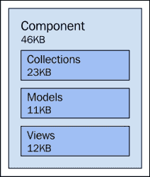
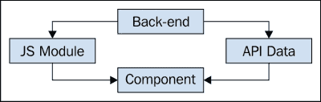
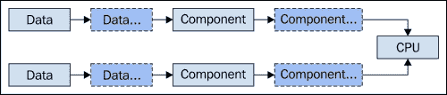
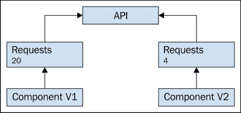
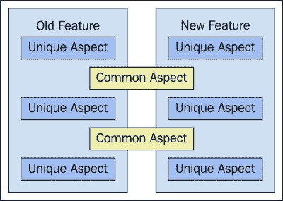
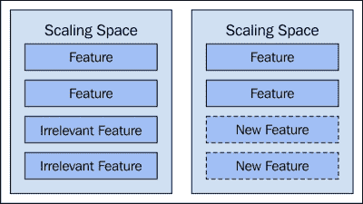
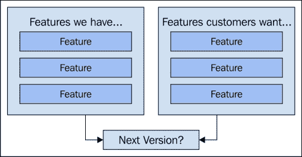
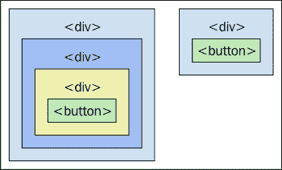
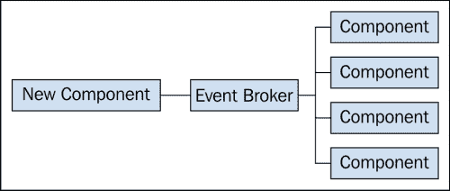

# 第九章：缩减扩展

我们倾向于认为扩展是一个单向问题——我们只能从当前的位置向上扩展。不幸的是，这并不完全有效。我们只能在一条线上扩展这么久，然后基础就会在我们脚下崩溃。关键在于识别扩展限制，并围绕它们进行设计。

在本章中，我们将探讨几乎所有浏览器环境中 JavaScript 架构师面临的根本性扩展限制。我们还将探讨客户作为扩展影响因素，以及新特性与现有特性之间的冲突。从过度设计中缩减也是一项基本活动。

我们整个应用程序的组成决定了通过关闭特性来缩减扩展的难易程度。这一切都取决于耦合，如果我们仔细观察，我们经常会发现我们需要重构我们的组件，以便它们可以稍后轻松移除。

# 扩展限制

我们的应用程序受到它们运行的环境的限制。这意味着客户机上运行的硬件和浏览器本身。有趣的是，网络应用程序还需要考虑代码本身的传输。例如，如果我们正在编写后端代码，我们可以向任何问题投入更多的代码，这不是问题，因为代码不会移动——它在一个地方运行。

对于 JavaScript 来说，大小很重要。这一点是无法回避的。作为推论，网络带宽也很重要——既包括我们的 JavaScript 工件的交付，也包括从 API 获取我们的应用程序数据。

在本节中，我们将解决浏览器计算环境中对我们施加的硬性扩展限制。随着我们的应用程序的增长，我们感受到这些限制的压力越来越多。在为我们的应用程序规划新特性时，需要考虑这些方面。

## JavaScript 工件大小

我们的 JavaScript 工件的累计大小只能增长到一定程度。最终，我们的应用程序的加载时间将会受到严重影响，以至于没有人愿意使用我们的应用程序。巨大的 JavaScript 工件通常意味着其他区域的过度膨胀。例如，如果我们向浏览器交付巨大的文件，我们可能有过多的东西。也许我们不需要那些没有人使用的特性，或者也许我们的组件中有重复的代码。

无论原因是什么，效果都不好。越小越好。我们如何知道我们的 JavaScript 文件大小是否足够小呢？这取决于——没有普遍的“理想”大小。我们的应用程序部署在哪里，是在公共互联网上？还是企业用户背后的 VPN？这些系统的用户可能有不同的接受标准。总的来说，公共互联网用户对我们加载时间的性能和功能膨胀的容忍度较低。另一方面，企业用户通常更欣赏更多功能，并对加载时间的不佳更加宽容。

不断添加到我们产品中的新功能是 JavaScript 文件大小增长的最大贡献者。这些导致了新组件的增加，从而增加了重量。任何给定功能都至少有最小文件集，每个文件都是遵循我们现有功能模式的组件。如果我们的一半模式还可以，那么我们应该能够保持我们组件的大小合理。然而，当截止日期涉及时，重复的代码总是找到进入应用程序的方式。即使我们的代码尽可能精简，当被要求实现功能时，我们仍然必须实现它们。

编译过的文件可以帮助我们解决文件大小的问题。我们可以合并和压缩文件，减少网络请求次数，节省总体带宽。但是，任何特定功能都会使这些编译过的文件持续增长。我们可以在遇到任何问题之前持续增长一段时间。如前所述，问题都是相对的，取决于环境和我们软件的用户。在所有情况下，我们的 JavaScript 文件的大小不能无限增长。



JavaScript 文件的大小是组成组件的所有模块的聚合结果。

## 网络带宽

我们的 JavaScript 文件的大小贡献了我们的应用程序整体网络带宽消耗。尤其是随着更多用户的采用——用户是我们所有架构问题的乘数。与我们的 JavaScript 代码相结合的是我们的应用程序数据。这些 API 调用也贡献了整体网络带宽消耗和用户感知的延迟。

### 小贴士

随着我们的应用程序跨越地理边界，我们会注意到各种连接问题。在世界上许多地方，高速网络根本不是一个选项。如果我们想要进入这些市场，而且我们应该这么做，那么我们的架构需要能够应对缓慢的互联网连接。使用 CDN 传递我们的应用程序所使用的库可以帮助解决这个问题，因为它们考虑了请求的地理位置。

挑战在于，任何新功能都会增加新的网络带宽消耗。这包括代码的大小，以及新组件引入的新 API 调用。请注意，这些效果并不会立即显现。例如，新组件在页面加载时不会进行 API 调用，只有在用户导航到特定的 URI 时才会进行 API 调用。

尽管如此，新的 API 端点意味着随着时间的推移网络带宽使用会增加。此外，当用户导航到功能页面时，并不是只做一个 API 调用那么简单。有时需要三个或更多的 API 调用，以便构建要呈现的数据。当我们认为一个新的 API 调用不是什么大问题时，我们需要记住，通常这会变成多个调用，这意味着更多的带宽消耗。

是否存在根本的网络带宽限制？从理论上讲，并不存在，就像我们的 JavaScript 资源大小一样——如果我们愿意，可以把它们扩展到每个 10MB。我们可以肯定的是，这不会改善用户体验，而且副作用可能会导致更糟糕的体验。网络带宽消耗也是如此。



组件通过请求 JavaScript 模块和 API 数据来消耗网络带宽

下面是一个例子，展示了我们的应用程序随着更多请求的发出而遭受聚合延迟的痛苦：

```js
// model.js
// A model with a fake "fetch()" method that doesn't
// actually set any data.
export default class Model {

    fetch() {

        // Returns a promise so the caller can work
        // with this asynchronous method. It resolves
        // after 1 second, meant to simulate a real
        // network request.
        var promise = new Promise((resolve, reject) => {
            setTimeout(() => resolve(), 1000);
        });

        return promise;
    }

};

// main.js
import Model from 'model.js';

function onRequestsInput(e) {
    var size = +e.target.value,
        cnt = 0,
        models = [];

    // Create some models, based on the "requests"
    // number.
    while (cnt++ < size) {
        models.push(new Model());
    }

    // Setup a timer, so we can see how long it
    // takes to fetch all these models.
    console.clear();
    console.time(`fetched ${models.length} models`);

    // Use "Promise.all()" to synchronize the fetches
    // of each model. When they're all done, we can stop
    // the timer.
    Promise.all(models.map(item => item.fetch())).then(() => {
        console.timeEnd(`fetched ${models.length} models`);
    });
}

// Setup our DOM listener, so we know how many
// models to create and fetch based on the "requests"
// input.
var requests = document.getElementById('requests');

requests.addEventListener('input', onRequestsInput);
requests.dispatchEvent(new Event('input'));
```

## 内存消耗

随着我们实现每一个功能，浏览器消耗的内存也在增长。这听起来像是一个显而易见的陈述，但它很重要。内存问题不仅伤害应用程序的性能，它们可能会导致整个浏览器标签页崩溃。因此，我们需要密切关注我们代码的内存分配特性。浏览器内置的性能分析工具可以记录对象在内存中的分配情况随时间变化。这对于诊断问题，或者观察我们的代码行为非常有用。

### 注意

频繁创建和销毁对象会导致性能滞后。这是因为不再引用的对象会被垃圾回收。当垃圾回收器运行时，我们的 JavaScript 代码不会运行。因此，我们有一个冲突的需求——我们希望代码运行得快，同时不想浪费内存。

想法是不必要地触发垃圾回收器的运行。例如，有时我们可以把变量提升到更高的作用域。这意味着在整个应用程序的生命周期中，引用并没有被多次创建和销毁。

另一种场景是在短时间内频繁分配，例如在循环中。虽然 JavaScript 引擎在处理这类场景时很聪明，但仍然值得我们关注。最佳资源是考虑垃圾回收器的低级库的源代码，避免不必要的分配。

API 返回的响应也消耗内存，具体取决于返回的数据，可能消耗大量的内存。我们希望确保给定 API 端点可以响应的数据量有限制。许多后端 API 会自动这样做，一次不超过 1000 个实体。如果我们需要遍历集合，那么我们需要提供一个偏移量参数。然而，我们可能还需要进一步限制 API 响应的大小，因为集合中单个实体的大小在浏览器中作为模型占用大量内存。

尽管这些集合通常会在用户从一个页面移动到另一个页面时进行垃圾回收，但我们实施的每个新功能都可能带来微妙的内存泄漏错误。这些微妙的错误难以处理，因为泄漏发生缓慢，并且在不同的环境中表现不同。当内存泄漏很大且明显时，它更容易复现，因此也更容易定位和修复。

接下来是一个例子，展示了内存消耗如何迅速失控：

```js
// model.js
var counter = 0;

// A model that consumes more and more memory,
// with each successive instance.
export default class Model {

    constructor() {
        this.data = new Array(++counter).fill(true);
    }

};

// app.js
// A simple application component that
// pushes items onto an array.
export default class App {

    constructor() {
        this.listening = [];
    }

    listen(object) {
        this.listening.push(object);
    }

};

// main.js
import Model from 'model.js';

function onRequestsInput(e) {
    var size = +e.target.value,
        cnt = 0,
        models = [];

    // Create some models, based on the "requests"
    // number.
    while (cnt++ < size) {
        models.push(new Model());
    }

    // Setup a timer, so we can see how long it
    // takes to fetch all these models.
    console.clear();
    console.time(`fetched ${models.length} models`);

    // Use "Promise.all()" to synchronize the fetches
    // of each model. When they're all done, we can stop
    // the timer.
    Promise.all(models.map(item => item.fetch())).then(() => {
        console.timeEnd(`fetched ${models.length} models`);
    });
}

// Setup our DOM listener, so we know how many
// models to create and fetch based on the "requests"
// input.
var requests = document.getElementById('requests');

requests.addEventListener('input', onRequestsInput);
requests.dispatchEvent(new Event('input'));
```

## CPU 消耗

影响我们用户界面响应性的一个重要因素是客户端的 CPU。如果它能够在有代码需要运行时，例如在点击时运行我们的代码，那么 UI 将感觉是响应性的。如果 CPU 正在处理其他事情，我们的代码将不得不等待。用户也只能等待。显然，在给定的操作系统环境中，有很多软件要求 CPU 的注意力——其中大部分完全超出我们的控制。我们无法减少浏览器之外其他应用程序的使用，但我们可以从我们的 JavaScript 应用程序中减少 CPU 的使用。但首先，我们需要了解这些 JavaScript CPU 周期来自哪里。

在架构层面，我们不考虑使单个组件的小部分更高效的微优化。我们关心的是缩小规模，这在应用运行时对 CPU 消耗有明显的影响。我们在第七章，*加载时间和响应性*，看到了如何分析我们的代码。这告诉我们 CPU 在我们的代码中花费的时间。用配置文件作为我们的测量标准，我们可以进行更改。

影响 CPU 使用的两个因素是活动的特性数量和这些特性使用的大小。例如，当我们向系统中添加更多组件时，CPU 消耗自然会更多，因为当事情在 UI 中发生时，该特性的组件代码需要以某种方式响应。但这一点本身不太可能产生很大的影响。是实现新特性时伴随的 API 数据使得 CPU 成本变得昂贵。



合并消耗 CPU 周期的力量——处理更多数据的更多组件

例如，如果我们不断实施新功能，而数据集保持不变，我们开始感受到 CPU 成本。这是因为有更多的间接性，意味着对于任何给定事件需要运行更多的代码。然而，这种减慢会以冰川般的速度发生——我们可以在不费吹灰之力的情况下，不断增加数百个功能。是变化的数据使这成为一种扩展不可能性。因为如果你将功能数量乘以不断增长的数据集，CPU 成本将呈指数级增长。

好吧，也许并非我们所有的功能都在消耗所有的数据。也许我们的设计中间接性非常少。这仍然是在缩减规模时需要考虑的最大因素。所以如果我们需要降低 CPU 成本，我们就需要移除功能及其处理的数据——这是唯一能产生可测量影响的方法。

下面是一个示例，展示了组件数量和数据项数量的组合如何逐渐消耗更多的 CPU 时间：

```js
// component.js
// A generic component used in an application...
export default class Component {

    // The constructor accepts a collection, and performs
    // a "reduce()" on it, for no other reason than to eat
    // some CPU cycles.
    constructor(collection) {
        collection.reduce((x, y) => x + y, 0);
    }

}
// main.js
import Component from 'component.js';

function onInput() {
    // Creates a new collection, the size
    // is based on the "data" input.
    var collection = new Array(+data.value).fill(1000),
        size = +components.value,
        cnt = 0;

    console.clear();

    // Sets up a timer so we can see how long it
    // takes for x components to process y collection items.
    console.time(`${size} components, ${collection.length} items`);

    // Create the number of components in the "components"
    // input.
    while (cnt++ < size) {
        new Component(collection);
    }

    // We're done processing the components, so stop the timer.
    console.timeEnd(`${size} components, ${collection.length} items`);
}

// Setup out DOM event listeners...
var components = document.getElementById('components'),
    data = document.getElementById('data');

components.addEventListener('input', onInput);
data.addEventListener('input', onInput);

components.dispatchEvent(new Event('input'));
```

## 后端能力

我们将要解决的最后一个扩展限制是提供我们静态资源和 API 数据的后端。这是一个限制因素，因为我们的代码不能在到达浏览器之前运行，我们也不能在原始数据到达之前向用户显示信息。这两件事都取决于后端来实现，但在进行前端开发时，关于后端有几点需要注意的。

第一个关注点是我们应用程序的使用情况。正如运行我们 JavaScript 代码的浏览器不能无限扩展一样，我们的后端 API 也不能无限扩展。虽然它们有一些特性使它们能够扩展浏览器不具备的，但它们仍然受到更多请求量的影响。第二个关注点是我们代码与 API 的交互方式。我们必须观察一个用户如何使用我们的应用程序，以及这些交互产生的 API 请求。如果我们能够优化一个用户的请求，增加更多用户对后端的冲击会更小。

例如，我们不想发起我们不需要的请求。这意味着，*在实际需要之前不要加载数据*。并且，*不要反复加载相同的数据*。如果一个用户在会话开始五分钟后才开始与一个功能互动，那么在这段时间内后端就可以处理其他请求。有时我们的组件会使用相同的 API 端点。如果它们同时被创建，并且先后发送相同的 API 请求会怎样呢？后端不得不服务这两个请求，这是不必要的，因为它们将具有相同的内容。

我们需要构建组件通信结构，以考虑规模影响因素，如后端产生的负载。在这个特定实例中，第二个组件可以在*挂起请求*映射中查找并返回那个承诺，而不是生成一个新的请求。



新组件应致力于减少带宽消耗；一种方法是使用更少的 API 请求来实现相同的功能。

# 冲突的功能

随着我们软件的增长，我们功能之间的界限变得模糊。至少会有一些重叠，这是件好事。如果没有至少一点重叠，用户在从我们 UI 的一个区域过渡到另一个区域时会有困难。当达到一个特性阈值时，问题就出现了，因为此时有多个重叠的层次不断叠加。这是一个自我传播的问题，每增加一个新特性就会变得更糟，直到解决这个问题。

这个问题的两个潜在原因包括我们应用程序中随时间变得无关的部分，而它们并没有被退役，而是闲置妨碍。客户需求在这种规模影响中起了很大的作用，因为它决定了产品的未来方向。这也应该让我们了解到现在所拥有的，要么为了满足需求而需要改变，要么在不久的将来需要消失。

## 重叠功能

在我们应用程序的生命周期中，将会有与现有功能重叠的新功能。这就是软件开发的本质——建立在你已经拥有的基础上，而不是从完全无关的领域开始。当这种重叠不显眼时，作为从现有功能到新功能和增强的桥梁，这是很好的。

当重叠与现有功能冲突时，这种重叠就不那么好了。这就像想在树林里建房子，而不先移走任何树。如果重叠要无缝且可扩展，需要发生两件事之一。要么我们需要调整已经存在的内容以适应即将到来的内容，要么我们需要重新思考新功能，使其更好地适应可用空间。这很有趣，因为考虑到我们所拥有的，有时我们甚至在实现功能之前就必须缩减功能——这通常比实现后更容易。

不合理的功能重叠的最终结果是用户觉得功能繁琐、难以使用，因此我们预计将来会收到一些投诉。这是我们稍后可能需要修复或删除的另一件事。我们实际上经常这样说服自己——这并不是一个很大的增加，但足够满足截止日期。但这种*足够好*的代价是什么？除了预期的用户烦恼外，还有代码需要担心。我们很少说这样的话——*好吧，用户可能不喜欢它，但代码非常棒*。通常糟糕的用户体验是功能规划不当和实施不佳的结果。

解决方案其实相当简单，正如我们已经看到的。这是为变化腾出空间，或者修改新功能的问题。我们经常忽视的一点是记录潜在问题。例如，如果我们看到一个计划中的功能与我们的现有代码不匹配，我们需要提出来并概述哪些不匹配以及为什么。拥有这些信息归档并可搜索总比忽视要好。这是我们通过与团队包容来扩展我们的架构理念的方式。



旧功能与新功能之间的重叠是缩减不必要的代码的一个很好的起点

## 不相关功能

随着时间的推移，一些功能证明了自己的价值。我们的用户非常喜欢它们，并且经常使用。更重要的是——我们几乎不需要维护它们。它们就是能正常工作。另一方面，我们实现的其他一些功能开始生锈的速度比我们预期的要快。可能有无数的迹象表明这种情况正在发生。也许有一小部分用户喜欢这个功能，但它存在 bug 并且难以维护。也许我们的大部分用户喜欢这个功能，但它阻碍了项目中的多项举措的实施。但最常见的情况是，根本没有人使用它。

无论出于何种原因，功能确实变得不相关。我们作为行业的问题是我们喜欢积累代码。有时我们出于必要保留不相关的功能——我们可能会破坏太多东西，或者在需要的地方引入向后不兼容。在其他时候，这实际上更多的是前端问题，我们保留功能是因为我们没有明确的命令来摆脱它。好吧，如果我们想要扩展应用程序，我恐怕这种情况需要发生。

这是一个主动而不是被动的问题。正如我们所知，每个组件都对我们扩展约束有所贡献——无论是网络、内存、CPU 还是其他方面。谁知道呢，也许我们的产品里存在的功能完全可以应付。最好把它解决掉，因为这样它实际上限制我们扩展能力的可能性更小。我们可能认为它是一段无害的代码，但彻底排除不是更好吗？此外，这种态度 Simply put, it's better to scale down the things we don't need, and then think about where to go from there. If we set the precedent with all our stakeholders that we're ready and willing to trim the fat, we're more likely to convince them to ship a leaner product.



我们的应用程序可扩展的空间有限；删除无关功能可以释放扩展空间

## 客户需求

取决于我们正在构建的产品类型，以及它服务的用户类型，客户需求将转化为有序规划实施，或者冲动反应。我们都想让客户开心——这就是我们为什么要开发软件。但正是这些快速决定实施人们尖叫着要的东西，损害了我们的架构。就好像我们把功能当成错误来实施。对于错误，我们尽快实施快速修复，因为我们需要把它们赶出门。

新功能不是错误。尽管用户和管理层怎么说——没有他们所要求的功能他们也能活下去。我们需要找到一种方法，为我们争取必要的时间，将客户想要的新功能纳入我们的架构中。这并不是说我们可以一直推迟——我们必须及时地这样做。也许移除用户不太关心的现有功能是前进最快的途径。



确定哪些功能会包含在下一个版本中；这些功能要么是我们已经拥有的，要么是客户希望的新功能

# 设计失败

缩小规模一方面是通过修复我们现有的代码。例如，通过移除功能，或者通过修改现有组件以适应新计划的功能。但这也只能让我们在未来走得更远。两年前看起来是个好主意的设计想法，是为了我们当时考虑的功能，其中一些可能今天已经不再存在。

要想对我们的架构产生持久的影响，我们必须修复破碎的模式。它们仍然在我们的产品中起作用，因为我们在让它们起作用，尽管它们可能不是完成工作的最佳工具。找出正确的设计不是一个一次性的事件，它发生在我们的软件变化中，以及我们的扩展影响命令中。

在本节中，我们将探讨几种可能解决我们设计中一些缺陷的方法。也许有很多我们不需要的活动部件。也许由于我们组件通信模型的复杂性，我们正在效率低下地处理我们的 API 数据。或者，我们 DOM 元素的结构导致了晦涩的选择器字符串，从而减慢了开发速度。这只是可能性的一小部分——缺陷模式因项目而异。

## 不必要的组件

当我们最初开始设计我们的架构和构建我们的软件时，我们将利用当时有意义的模式。我们设计组件使其彼此之间松耦合。为了实现这种松耦合，我们通常会做出权衡——增加活动部件。例如，为了保持每个组件职责的专注，我们必须将较大的组件拆分为较小的组件。这些模式决定了我们特征组件的构成。如果我们遵循这种模式，并且它有不必要的部分，我们所开发的新东西也将包含不必要的部分。

很难做到模式正确，因为当我们需要决定使用哪些模式时，我们没有足够的信息。例如，框架中有很多通用的模式，因为它们服务的受众比我们的应用程序广泛得多。因此，虽然我们想要利用框架暴露的相同模式，但我们需要将它们适应到我们的特定功能中。这些是随着客户需求逐渐改变我们产品的性质而逐渐变化的模式。我们可以接受这种自然现象，并投入时间修复我们的模式。或者，我们可以随着问题的出现而解决，保持我们原始的模式不变。对我们曾经认为的基础进行调整，是我们扩展架构的最佳方式。

最常见的模式缺陷是多余的间接性。也就是说，组件是抽象的，并没有真正的价值。虽然它们将组件与另一样东西解耦，但它们所做的也就仅此而已。我们会注意到，随着时间的推移，我们的代码积累了这些相对较小的模块，而且倾向于看起来都一样。它们之所以小，是因为它们不做太多的事情，它们看起来一样，是因为它们是我们承诺在整个代码中一致使用的模式的一部分。在模式被构思的时候，这个组件是完全有意义的。实现几个组件后，它变得不那么有意义了。失去这个组件并不会损害设计，事实上，整个项目现在感觉有点更轻了。有趣的是，模式在纸上的样子与在实际应用中的样子之间的脱节。

下一个例子展示了一个使用控制器的组件，以及另一个不需要控制器且少了一个活动部件的组件版本：

```js
// view.js
// An ultra-simplistic view that updates
// the text of an element that's already in
// the DOM.
export default class View {

    constructor(element, text) {
        element.textContent = text;
    }

};

// controller.js
import events from 'events.js';
import View from 'view.js';

// A controller component that accepts and configures
// a router instance.
export default class Controller {

    constructor(router) {
        // Adds the route, and creates a new "View" instance
        // when the route is activated, to update content.
        router.add('controller', 'controller');
        events.listen('route:controller', () => {
            new View(document.getElementById('content'), 'Controller');
        });
    }

};

// component-controller.js
import Controller from 'controller.js';

// An application that doesn't actually do
// anything accept create a controller. Is the
// controller really needed here?
export default class ComponentController {

    constructor(router) {
        this.controller = new Controller(router);
    }

};

// component-nocontroller.js
import events from 'events.js';
import View from 'view.js';

// An application component that doesn't
// require a component. It performs the work
// a controller would have done.
export default class ComponentNoController {

    constructor(router) {
        // Configures the router, and creates a new
        // view instance to update the DOM content.
        router.add('nocontroller', 'nocontroller');
        events.listen('route:nocontroller', () => {
            new View(document.getElementById('content'), 'No Controller');
        });
    }

};

// main.js
import Router from 'router.js';
import ComponentController from 'component-controller.js';
import ComponentNoController from 'component-nocontroller.js';

// The global router instance is shared by components...
var router = new Router();

// Create our two component type instances,
// and start the router.
new ComponentController(router);
new ComponentNoController(router);

router.start();
```

## 低效的数据处理

微优化在效率上并没有给我们带来太多好处。另一方面，重复处理可能会导致巨大的扩展问题。挑战在于，我们可能甚至不会注意到正在进行重复处理，除非我们寻找它。这通常发生在数据从一个组件传递到另一个组件时。第一个组件对 API 数据进行转换。然后，原始数据被传递给第二个组件，它随后执行了完全相同的转换。随着更多组件的添加，这些低效问题开始累积。

我们很少发现这类问题的原因是我们被美丽的设计模式所迷惑。有时候，那些损害用户体验的低效问题被我们的代码所掩盖，因为我们是一致地做事情。也就是说，我们保持组件之间的关联关系是松耦合的，正因为如此，我们的架构在多个方面都能扩展。

大多数时候，一点重复的数据处理是完全可以接受的权衡。这取决于它在处理其他扩展影响方面的灵活性给我们带来了什么。例如，如果我们能够轻松地处理多种不同的配置，并在需要时启用/禁用功能，这是因为我们有数量众多的不统一部署，那么这种权衡可能是有意义的。然而，在一个方面扩展往往意味着在另一个方面不扩展。例如，数据量很可能会增加，这意味着组件之间传递的数据会增加。所以之前没有问题的那些偷偷摸摸的数据转换，现在变成了大问题。当这种情况发生时，我们必须减少数据处理。

再次强调，这并不意味着我们需要开始引入微优化——这意味着我们必须开始寻找大的效率胜利。起点应该始终是网络调用本身，因为前端最大的效率胜利就是一开始就没有获取到数据。要查看的第二件事是组件之间传递的数据。我们需要确保一个组件没有在前一个组件链中做完全相同的事情。

下面是一个示例，展示了每次调用`fetch()`时都会获取模型数据的组件。它还展示了一个替代实现，当已经有挂起的请求时，不会获取模型：

```js
// model.js
// A dummy model with a dummy "fetch()" method.
export default class Model {

    fetch() {
        return new Promise((resolve) => {
            setTimeout(() => {

                // We want to log from within the model
                // so that we know a fetch has actually
                // been performed.
                console.log('processing model');

                // Sets some dummy data and resolves the
                // promise with the model instance.
                this.first = 'First';
                this.last = 'Last';

                resolve(this);
            }, 1000);
        });
    }

};

// component-duplicates.js
import Model from 'model.js';

// Your standard application component
// with a model.
export default class ComponentDuplicates {

    constructor() {
        this.model = new Model();
    }

    // A naive proxy to "model.fetch()". It's
    // naive because it shouldn't fetch the model
    // while there's outstanding fetch requests.
    fetch() {
        return this.model.fetch();
    }

};

// component-noduplicates.js
import Model from 'model.js';

// Your standard application component with a
// model instance.
export default class ComponentNoDuplicates {

    constructor() {
        this.promise = null;
        this.model = new Model();
    }

    // "Smartly" proxies to "model.fetch()". It avoids
    // duplicate API fetches by storing promises until
    // they resolve.
    fetch() {

        // There's a promise, so there's nothing to do -
        // we can exit early by returning the promise.
        if (this.promise) {
            return this.promise;
        }

        // Stores the promise by calling "model.fetch()".
        this.promise = this.model.fetch();

        // Remove the promise once it's resolved.
        this.promise.then(() => {
            this.promise = null;
        });

        return this.promise;
    }

};

// main.js
import ComponentDuplicates from 'component-duplicates.js';
import ComponentNoDuplicates from 'component-noduplicates.js';

// Create instances of the two component types.
var duplicates = new ComponentDuplicates(),
    noDuplicates = new ComponentNoDuplicates();

// Perform two "fetch()" calls. You can see that
// the fetches are both carried out by the model,
// even though there's no need to.
duplicates.fetch();
duplicates.fetch().then((model) => {
    console.log('duplicates', model);
});

// Here we do the exact same double "fetch() call,
// only this component knows not to carry out
// the second call.
noDuplicates.fetch();
noDuplicates.fetch().then((model) => {
    console.log('no duplicates', model);
});
```

### 提示

当我们的组件之间相互独立时，避免进行重复的 API 调用是很困难的。比如说，一个功能创建了一个新的模型并获取它。另一个在同一页上的功能需要相同的模型，但它对第一个组件一无所知——它也创建了一个模型并获取数据。

这些会导致完全相同的 API 调用，这显然是不必要的。不仅对于前端来说效率低下，因为它对于完全相同的数据有两个不同的回调，而且它还损害了整个系统。当我们发起不需要的请求时，我们会在后端堵塞请求队列，影响其他用户。我们必须留心这些重复调用，并相应地调整我们的架构。

## 过度创新的标记

用于渲染我们 UI 组件的标记可能会变得有些失控。因为我们追求的是特定的外观和感觉，所以我们必须对标记进行一些篡改才能达到目的。然后我们再继续篡改，因为在这个浏览器或那个浏览器上看起来不太对。结果是元素被深深地嵌套在其他元素中，以至于它们失去了任何语义意义。我们应该努力实现标签的语义化使用——测试放入`p`元素中，可点击的按钮是`button`元素，页面部分用`section`元素分割等等。

这里的挑战在于，我们追求的设计通常表现为线框图，我们需要以一种方式实现它，使其可以被切成我们的框架和组件可以使用的部分。因此，随着试图保持事物语义化，简单性就丧失了，同时将事物划分为独立的视图也不总是可行的。

尽管如此，我们还是需要在可能的地方简化 DOM 结构，因为它直接影响到我们 JavaScript 代码的简单性和性能。例如，我们的组件经常需要找到页面上的元素，要么改变它们的状态，要么从它们那里读取值。我们可以编写选择器字符串，查询 DOM 并返回我们需要的元素。这些字符串贯穿于我们的视图代码中，它们反映了我们标记的复杂性。

当我们在代码中遇到复杂的选择器字符串时，即使是我们自己写的，我们也无法弄清楚它实际上在查询什么——因为 DOM 结构和所使用的标签并无帮助。所以结果证明，使用语义化标记实际上对我们的 JavaScript 代码有很大的帮助。还有复杂 DOM 结构的性能影响——如果我们经常遍历深层 DOM 结构，我们就会付出性能上的代价。



过度深入的元素嵌套通常可以简化，减少元素的使用。

# 应用程序组合

我们将以一个关于应用程序组成的章节结束。这是我们对应用程序的 10,000 英尺高空视角，在这里我们可以看到各个功能是如何组合的。第三章中，*组件组合*我们研究了组件组合，同样的原则在这里也适用。这个想法是我们正在操作一个稍微高层次的东西。

在第六章，*用户偏好和默认设置*中，我们探讨了可配置性，这也与应用程序组成的想法相关。例如，关闭功能，或者打开默认禁用的功能。我们整个应用程序的组成对缩减某些方面有很大的影响。

## 功能启用

缩减的便捷方法是关闭功能。困难的部分是让利益相关者同意这是一个好主意。然后我们可以直接删除功能，一切就绪了，对吧？不一定。我们可能需要花些时间来移除功能。例如，如果它涉及到系统的几个入口点，而且没有配置可以关闭这些入口点呢？这不是什么大问题，只是意味着我们需要花更多时间编写移除这些功能的代码。

唯一的问题是测试从系统中移除功能的效果。对于没有配置能完成工作的场景，我们不得不花时间编写代码来做这件事，然后我们才能进行测试。例如，我们可以花五分钟关闭配置值，然后我们就会得到立即的结果。也许我们最早就能了解到，在我们可以安全地将功能从系统中移除之前，有很多工作要做。

除了在删除功能后测试我们应用程序的运行行为外，我们可能还需要一些构建时的选项。如果我们的生产代码被编译成几个 JavaScript 工件，那么我们需要一种完全从构建中移除这些功能的方法。通过配置禁用组件是一回事，这意味着当我们的代码运行时，某些东西不会加载等等。如果我们把功能从我们的源代码仓库中移除，那么这显然不那么令人担忧——我们的工具无法构建不存在的代码。然而，如果我们有数百个可能包含在我们构建工件中的潜在组件，我们需要一种排除它们的方法。

## 新功能影响

对我们应用程序的下一个重大影响是新功能的添加。是的，这个讨论是关于缩减的，但我们不能忽视新功能对我们应用程序的添加。毕竟，这就是我们最初为什么要缩减的原因。不是为了构建一个做更少的较小应用程序。这是为了给客户想要的功能腾出空间，并随着时间的推移提高我们产品的整体质量。

添加功能和删除功能的过程通常是并行的。例如，在一个开发冲刺期间，一个团队负责实现一个新功能，而另一个团队负责移除一个正在引起问题的问题功能。由于这两项活动都以重大方式影响应用程序，我们必须小心行事，并尽量减少这些影响。

本质上，这意味着确保旧功能的移除不会对新添加的功能造成太大的干扰。例如，如果新功能依赖于旧功能中的某个部分。如果我们的设计是合理的，那么就不会有直接的依赖关系。然而，人类对复杂性理解不足——尤其是通过间接作用的原因和效果。因此，扩大这项操作可能意味着我们根本不能在所有活动中并行执行。



根据我们组件间通信模型的不同，向系统中添加新组件的效果应该是相当温和的。

## 核心库

影响我们应用组合的最后因素就是我们所使用的框架和库。不言而喻，我们只想要用我们所需要的——所谓“用进废退”。这主要是在我们引入较小库作为依赖时的问题。相比之下，框架在大部分情况下是包含一切的。这意味着你可能需要的所有东西框架里都已经有了。虽然这并不一定正确，但它仍然帮助我们减少了第三方库的依赖。

即便框架如今也是模块化的，这意味着我们可以挑选我们想要的好东西，而把其他的留给别人。即便如此，引入组件（无论是来自框架还是其他地方）仍然很容易，而这些我们可能根本不会使用。这在网站开发中相当常见。我们需要这样的一个功能模块，我们不想亲自编写，因为那边的库已经能实现了。然后它就会迷失在页面混合中。我们应该吸取网站没有学到的教训——我们的应用需要一组专注的依赖关系，这对于完成工作至关重要。

# 总结

本章介绍了这样一个观念：我们应用中的并非一切都是无限可扩展的。实际上，我们应用中的任何方面都不是无限可扩展的，因为每个方面都受到不同因素的限制。这些因素以独特的方式融合在一起，我们必须要做出必要的权衡。如果我们想要持续扩展，我们必须在其他领域进行缩减。

新功能源于客户需求，它们通常与我们已经实现的其他功能重叠。这可能是因为我们没有对新功能定义得很清楚，或者是因为系统现有的入口点定义得不明确。无论如何，这都可能使得一个具有挑战性的练习；用新功能替换现有功能。我们经常需要去除重叠区域，因为它们在代码层面和可用性层面都会造成混淆。

缩小规模不仅仅是逐个处理的活动——还需要考虑设计模式。移除一个功能后，我们需要审视我们正在使用的模式，并问自己，*我们是否希望未来一直重复这样做？* 向前发展的更好、更可扩展的方法，是修复这个模式。即使在我们缩减规模之后，仍然存在出错的可能性。在下一章中，我们将更详细地探讨失败的组件以及如何处理它们。
