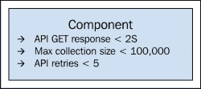
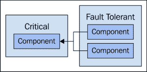
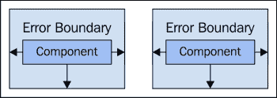
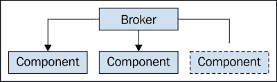
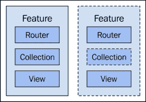
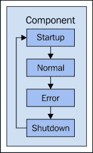
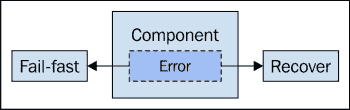

# 第十章 应对失败

在本书的这一点上，我们希望认为我们的架构是健全的。我们考虑过可扩展性，并做出了所有适当的选择，例如牺牲性能以提高配置性。我们在可扩展的 JavaScript 架构中尚未深入探讨的一个方面是人类因素。尽管我们很聪明，但我们是最薄弱的环节，因为我们设计和编写应用程序代码——我们很擅长犯微妙的错误。

除非我们完全被排除在软件开发之外，否则我们必须考虑设计组件时的失败。这包括考虑失败模式——我们是快速失败还是尝试从错误中恢复？它包括考虑错误的质量——有些错误比其他错误更容易处理。但它也关于了解我们的局限性；我们不可能实际检测和恢复每一个可想象的错误。

当我们扩展应用程序时，我们处理失败的方法也需要扩展。这是我们需要在众多其他扩展因素之间做出的另一个权衡。让我们先来看看快速失败的故障模式。

# 快速失败

快速失败的系统或组件在失败时停止运行。这听起来可能不是一种理想的设计特性，但考虑一下替代方案：一个失败后仍然继续运行的系统或组件。这些组件可能正在运行错误的状态下，而如果系统或组件停止，这种情况是不可能的。

有时我们想要恢复一个失败的组件，我们将在本章后面讨论这个话题。在本节中，我们将回顾一些用于确定 JavaScript 组件是否应快速失败的准则，以及这对用户有什么后果。有时，即使我们的快速失败机制也会失败，我们也需要考虑这一点。

## 使用质量约束

当我们的组件快速失败时，通常是由于一个已知的错误状态。另一方面，可能发生一些完全出乎意料的事情。无论如何，它都可能导致我们的组件处于不良状态，我们不希望应用程序像一切都很正常一样继续运行。让我们关注当质量约束不满足时的快速失败。这些是关于我们的应用程序如何行为的断言。例如，我们不应该尝试发送超过三次 API 请求；我们不应该等待超过 30 秒的响应——模型的这个属性应该总是有一个非空字符串，等等。

当这些断言被证明是错误的时，就是停止执行的时候了——无论是单个组件还是整个系统。我们这样做并不是为了惹恼用户。和任何失败一样，我们希望它们尽可能少发生。将快速失败想象成汽车事故中安全气囊的部署——当这种情况发生时，我们的车就无法再开了。

在某些条件下使组件或整个系统快速失败的决策不应被轻视。例如，如果我们因为一个特性团队以这种方式实现而在一个地方快速失败，对其他团队来说是未知的，整个应用程序开始失败。同时，结果表明这是设计的一部分，是预期行为。这种失败模式需要有严格的理由。讨论快速失败场景时，真正有帮助的是如果应用程序继续不受干扰地运行可能发生的灾难性结果。



当违反约束时，会导致组件快速失败，可能使整个应用程序快速失败

## 提供有意义的反馈

我们不希望给用户或我们开发团队的其他成员错误地传达为什么在某些场景下我们的软件不能运行的原因。这意味着我们必须区分快速失败和完全不受控制的失败。后者是打破我们应用程序的东西，可能会导致浏览器标签页崩溃。或者更糟糕的是，它还在地上爬来爬去，给用户留下它仍然有点工作的印象，同时一直在造成伤害。

这意味着当我们快速失败时，我们必须让用户清楚地知道出了什么问题，他们不应该继续使用它。无论是一个失败的组件还是整个应用程序，我们必须使信息清晰简洁。用户不需要总是知道出了什么问题；他们只需要知道当前组件或应用程序是损坏的，他们所做的任何事情都不会起作用。

这实际上是我们将快速失败引入架构的一个重要后果——我们在某些条件下获得了响应性。我们永远不会让用户猜测。当然，面前有损坏的软件是很烦人的，但比这更糟糕的是等待、尝试，然后再次等待，以发现它是损坏的。通过清楚地传达应用程序或其部分正在运行，或者通过在元素上抛出一个`div`遮罩或者关闭 DOM 事件处理程序，我们可能希望阻止用户与它交互。

接下来的例子展示了两个错误处理程序。第一个程序通过禁用按钮隐式地处理错误。另一个回调做了同样的事情，但还明确显示了一个错误信息：

```js
// The DOM elements...
var error = document.getElementById('error'),
    fail1 = document.getElementById('fail1'),
    fail2 = document.getElementById('fail2');

// The first event merely disables the button.
function onFail1(e) {
    e.target.disabled = true;
}

// The second event disables the button, but
// also explicitly informs the user about what
// went wrong.
function onFail2(e) {
    e.target.disabled = true;
    error.style.display = 'block';
}

// Setup event handlers...
fail1.addEventListener('click', onFail1);
fail2.addEventListener('click', onFail2);
```

## 当我们不能快速失败时...

我们可以将快速失败机制设计到我们的组件中。但我们不能保证这些机制本身不会失败。也就是说，我们为了保护自己而编写的代码是由我们编写的。等等。我们可以在错误处理代码层上继续编写快速失败和优雅失败的代码，当底层出现故障时，它会在底层出现故障。但这是为了什么目的？

认识到我们并不能总是可预测地失败是我们面临的可扩展性挑战的一部分。因为，在某个时刻，我们必须关注我们实际上试图提供的特性，而不是支撑它的框架。额外的失败处理代码并不会让我们的产品变得更好，它只是以代码的形式增加了体积。如果我们试图专注于我们正在构建的特性，那些我们想要快速失败的明显案例自然会显现出来。

失败检测代码的问题在于，它需要与其他应用程序一起扩展，外部扩展因素指导其发展。例如，更多用户意味着后端有更多的需求。这意味着我们的失败检测代码可能永远都不会到达——我们如何考虑这种情况？我们不这样做。因为试图解决这些问题，并不会扩展。尝试防止它们发生是更有成果的努力。

# 容错性

具有容错性的系统具有在组件出现故障时生存下来的能力。这是通过更正组件中的错误，或者用新实例替换有缺陷的组件来实现的。将容错性想象为一架飞机，它只用一个引擎就能降落——乘客是我们的用户。

通常，我们在大规模服务器环境中听到关于容错性的讨论。在具有足够复杂性的前端开发中，这也是一个可行的概念。在本节中，我们将首先考虑如何将组件分类为关键组件和非关键组件。然后，我们将转向错误检测，以及如何处理错误，以便应用程序能够继续运行。

## 分类关键行为

就像不能被另一个线程中断的关键代码段一样，在我们的应用程序中，有一些组件不能优雅地失败。有些组件无论发生什么都必须正常工作，如果它们不能，那么它们需要快速失败以避免造成进一步的损害。这就是我们需要对组件进行分类的原因。虽然对于给定组件必须按预期工作这一点可能显而易见，但以某种方式一致地分类它们是有意义的。在整个组织中传播这样的想法是个好主意。

当我们知道哪些组件是关键的，我们就知道它们必须正常工作，而且无法想象它们需要恢复的情况。如果这些组件失败了，那就有一个需要修复的错误。我们还可以更加集中地进行单元测试。

给组件设置不同的重要性层级不是一个好主意。例如，对于绝对关键的组件有一个等级，再下一个等级的组件虽然不关键但也不足以认为是普通的，依此类推——这样就违背了初衷。我们要么可以没有这个组件生存，要么就不能。这种简单性让我们把组件分为两个类别，给它们贴标签比让它们疲劳要简单得多。任何非关键组件都有可能容忍失败，因此我们可以开始考虑这些组件的故障检测和恢复设计。



关键组件与其他可以容忍错误的组件

## 检测和隔离异常行为

我们的组件之间应当是解耦的，如果我们设计一个可扩展性好的架构的话。这种解耦的一部分就是错误处理。一个组件的错误不应该导致另一个组件的失败。如果我们能够采用这样的信条，其他一切都会变得更简单。因为如果一个组件失败了，我们可以自信地说，这次失败不是由另一个组件引起的。从那时起，找出原因并解决问题就会容易得多。

如果我们有一个事件代理之类的组件，那么将一个组件的错误与另一个组件解耦就会容易得多。如果所有的组件间通信都是通过代理进行的，那么那里就是实现检测错误并防止它们传播到其他组件的一个好机制。例如，如果一个组件接收到一个事件并运行一个回调函数失败，它可能会对整个应用程序产生副作用，甚至可能导致整个应用程序完全失败。

相反，事件代理会检测到这个错误，例如抛出的异常，或者是回调函数返回的错误状态代码。在异常的情况下，它不会在**调用栈**中找到上升的路径，因为它被捕获了。事件队列中的下一个处理程序 then 可以接收到关于失败处理程序的信息——这样它们就可以决定做什么，也许什么都不做。重要的是错误被隔离，并且它的发生被传达给其他组件。

下面是一个示例，展示了能够检测错误并将它们转发给事件下一个回调的事件代理：

```js
// events.js
// The event broker...
class Events {

    // Trigger an event...
    trigger(name, data) {
        if (name in this.listeners) {
            // We need to know the outcome of the previous handler,
            // so each result is stored here.
            var previous = null;

            return this.listeners[name].map(function(callback) {
                var result;

                // Get the result of running the callback. Notice
                // that it's wrapped in an exception handler. Also
                // notice that callbacks are passed the result
                // of the "previous" callback.
                try {
                    result = previous = callback(Object.assign({
                        name: name
                    }, data), previous);
                } catch(e) {
                    // If the callback raises an exception, the
                    // exception is returned, and also passed to
                    // the next callback. This is how the callbacks
                    // know if their predecessor failed or not.
                    result = previous = e;
                }

                return result;
            });
        }
    }

}

var events = new Events();

export default events;

// main.js
import events from 'events.js';

// Utility for getting the error message from
// the object. If it's an exception, we can return
// the "message" property. If it has an "error"
// property, we can return that value. Otherwise,
// it's not an error and we return "undefined".
function getError(obj) {
    if (obj instanceof Error) {
        return obj.message;
    } else if (obj && obj.hasOwnProperty('error')) {
        return obj.error;
    }
}

// This callback will be executed first, since it's
// the first to subscribe to the event. It'll randomly
// throw errors.
events.listen('action', (data, previous) => {
    if (Math.round(Math.random())) {
        throw new Error('First callback failed randomly');
    } else {
        console.log('First callback succeeded');
    }
});

// This callback is second in line. It checks if the
// "previous" result is an error. If so, it will exit
// early by returning the error. Otherwise, it'll randomly
// throw its own error or succeed.
events.listen('action', (data, previous) => {
    var error = getError(previous);
    if (error) {
        console.error(`Second callback failed: ${error}`);
        return previous;
    } else if (Math.round(Math.random())) {
        throw new Error('Second callback failed randomly');
    } else {
        console.log('Second callback succeeded');
    }
});

// The final callback function will check for errors in
// the "previous" result. What's key here is that only
// one of the preceding callbacks will have failed. Because
// the second callback doesn't do anything if the first
// callback fails.
events.listen('action', (data, previous) => {
    var error = getError(previous);
    if (error) {
        console.error(`Third callback failed: ${error}`);
        return previous;
    } else {
        console.log('Third callback succeeded');
    }
});

events.trigger('action');
```



容错意味着一个组件产生的错误不能影响其他组件

## 禁用有缺陷的组件

当我们对整个应用程序进行快速失败时，是因为我们试图避免更糟糕的问题出现。但是，如果系统中的一个组件与其它组件完全解耦，并且出现了问题呢？我们可以尝试从失败中恢复，但并非总是可行——如果存在 bug，唯一的恢复选项就是修补代码。与此同时，如果无法恢复，我们可以禁用该组件。

这样做有两个目的。首先，errant component 传播其问题的机会减少。其次，禁用组件或完全隐藏它，防止任何用户交互。这意味着用户重复尝试最终导致其他 bug 的事情的机会减少。这不应该发生，因为组件是隔离的，但仍然——我们不知道我们的设计在哪里有缺陷。

在问题组件被排除在外之后，我们可以在用户完全绝望之前得到一些安慰。只是系统中有一个方面用户无法与之交互。这给我们一点时间来诊断问题并修复有问题的组件。

设计问题是谁负责禁用组件——是组件本身，还是负责检测问题的核心组件的责任？一方面，组件自行关闭是个好主意，因为关闭可能涉及多个步骤，以保持其他组件运行顺畅。另一方面，当遇到问题时，像事件经纪人这样的东西关闭问题组件，将错误处理放在一个地方。我们采取的方法真的取决于最简单的解决方案。如果事件经纪人可以安全地做到这一点，那么那可能是最好的选择。



禁用的组件不与系统中的其他部分交互，这降低了问题组件引起问题的可能性

## 优雅地降级功能

在检测到错误时禁用组件是一件事，另一件事是以优雅的方式处理失败的组件并将其从 UI 中移除。尽管我们努力使组件之间保持松耦合，但在 DOM 方面，这是一个完全不同的问题。例如，我们实际上能不干扰周围元素的情况下移除失败组件的 DOM 元素吗？还是说我们最好保持元素的位置不变，但视觉上禁用它们并关闭任何 JavaScript 事件处理程序？

我们采取的方法取决于我们正在构建什么，即我们应用程序的性质。一些应用程序由于组件的组合和 UI 的一般布局而容易添加和删除功能，但视觉设计不仅仅是可从应用程序其余部分分离的皮肤。从理论上讲，它应该与系统的其余部分解耦，但在实践中这种观念行不通。如果我们想要扩展，页面上的元素布局与失败组件以及我们能够在其他地方产生副作用的情况下禁用或删除它们的能力有关。

我们应该将处理失败组件的想法视为关闭它们，因为通常需要发生一些行动——以便我们优雅地降低用户体验。很少整个功能会失败——是一个像路由器这样的组件导致一个功能无法正常工作。所以，如果我们关闭给定组件的路由处理程序，我们将需要关闭其他组件以从 UI 中移除功能，并向用户显示错误消息等。这些关闭语义需要考虑并对我们构建的任何给定功能进行测试。我们不是试图保护功能本身；实际上，我们是在保护系统其余部分免受功能可能造成的危害。



一个集合组件失败，导致整个功能服务中断；但整个应用程序仍然可以正常工作

# 故障恢复

在上一节中，我们开始思考我们前端代码中的容错性。也就是说，我们的应用程序需要在不成功的组件丢失的情况下至少在短期内生存下来。但如果有一些我们可以从中恢复的错误类型呢？所以，在检测到错误后，我们不会关闭组件，而是采取一些其他行动；这些行动仍然能满足用户的需求。

在这一节中，我们将看看我们的组件可以以各种方式从失败的操作中恢复。例如，我们可以重新尝试一个操作，或者我们可以通过重新启动它来清除组件的错误状态。有时，在恢复过程中获取用户关于他们希望如何进行的输入是有意义的。

## 重试失败的操作

如果我们的组件执行一个失败的操作，它可以重新尝试这个操作。这个操作甚至不必是组件的一个基本部分。但是由于组件依赖于这个操作，如果它失败了，那么组件也会失败。例如，一个后端 API 调用可能会失败，使得发起调用的我们的组件处于一个不确定的状态。API 调用在失败时重新尝试是一个很好的选择。

无论是我们正在重试的 API 调用，还是涉及其他组件的操作，我们都必须确保它是**幂等的**。这意味着在初始操作调用*之后*，随后的调用没有任何副作用。换句话说，连续多次调用该操作不会对系统中的其他部分产生负面影响。数据获取请求——请求不改变后端资源状态而向 API 请求数据的请求——是重试的好候选。例如，如果我们的数据获取请求失败是因为后端响应时间过长，可能是由于其他用户的需求竞争造成的，我们可以再次尝试请求并获得即时结果。我们可能不想继续等待，但如果我们决定重试，这是安全的。下面是一个示例，展示了将重试失败的数据获取尝试的模型：

```js
// api.js
// Simulate an API call by returning a promise.
function fetch() {
    return new Promise((resolve, reject) => {

        // After one second, randomly resolve or
        // reject the promise.
        setTimeout(() => {
            if (Math.round(Math.random())) {
                resolve();
            } else {
                reject();
            }
        }, 1000);

    });
}

export default fetch;

// model.js
import fetch from 'api.js';

// An entity model that's fetched from the API.
export default class Model {

    // Initialized with a "retries" count and an
    // "attempts" counter, used when the requests fail.
    constructor(retries=3) {
        this.attempts = 0;
        this.retries = retries;
    }

    // Returns a new promise where "fetchExecutor()"
    // attempts, and possibly re-attempts to call the API.
    fetch() {
        return new Promise(this.fetchExecutor.bind(this));
    }

    fetchExecutor(resolve, reject) {
        // Call the API and resolve the promise. Also reset the
        // "attempts" counter.
        fetch().then(() => {
            this.attempts = 0;
            resolve();
        }).catch(() => {
            // Make another API request attempt, unless
            // we've already made too many, in which case
            // we can reject the promise.
            if (this.attempts++ < this.retries) {
                console.log('retrying', this.attempts);
                this.fetchExecutor(resolve, reject);
            } else {
                this.attempts = 0;
                reject(`Max fetch attempts 
                    ${this.retries} exceeded`);
            }
        });
    }

};

// main.js
import Model from 'model.js';

var model = new Model();

// Fetch the model, and look at the logging
// output to see how many attempts were made.
model.fetch()
    .then(() => {
        console.log('succeeded');
    })
    .catch((e) => {
        console.error(e);
    });
```

### 注意

我们必须注意我们执行的操作类型以及我们收到的失败类型。例如，创建新资源的表单提交可以以多种方式失败。如果我们尝试此操作，并且它返回了一个 503 错误，我们知道可以安全重试——因为后端实际上并没有接触到任何资源。另一方面，我们可能会得到一个 500——这意味着我们不知道后端发生了什么。

在使用数据获取请求时，我们不必太担心失败的类型，因为我们没有改变任何状态。这意味着在重试操作之前，我们需要考虑操作类型，如果它修改资源，还需要考虑错误响应的类型。

## 重启组件

组件通常具有生命周期——启动、关闭以及根据组件类型在中间存在几个阶段。通常，这个生命周期需要由创建组件的事物来启动。随着组件在其生命周期中移动，它会改变其内部状态。这种状态可能是后来在组件中看到的失败的来源。

例如，如果一个组件处于*忙碌*状态，并且不处理来自外部组件的任何外部请求，那么我们很可能会在系统中的其他地方看到问题。也许组件确实很忙，或者也许有些东西错误地将它置于该状态。如果是这种情况，那么重新启动生命周期可能足以解决任何问题，并使组件处于运行状态，能够再次处理外部请求。

本质上，重新启动组件是恢复错误的一种绝望的努力。这意味着我们不知道组件出了什么问题，只知道有些东西不工作，它正在整个应用程序中制造混乱。在出现问题时重新启动组件的主要复杂性在于，一旦我们排除了糟糕的内部状态，组件仍然需要继续它之前的工作。例如，如果我们有一个从后端获取集合的组件，并且我们重新启动它，由于组件状态的问题，那么它需要再次获取那个集合。

所以在我们将重新启动功能设计到我们的组件之前，我们需要考虑几件事情。首先，我们如何知道何时重新启动一个组件？这通常是一个特定于应用程序的决定，但它们大多数集中在组件失败的边缘案例上。如果有一个错误，那么重新启动它可能无助于解决问题，但尝试一下也无妨。另一个方面是数据源的恢复——不是内部状态，而是这个应用程序使用的数据源。这两者是分开的——内部状态是组件计算出来的东西，而数据是一个外部来源，作为输入提供。

我们不希望实现组件重新启动功能作为掩盖我们代码中其他问题的机制。这只是设计我们组件的一种好方法。它迫使我们思考组件可能在环境中被抛来抛去的各种方式。即使只是问这个问题也是值得的——如果我重新启动这个组件，或者在运行时用新的实例替换它，会发生什么？我们可能永远不会实际做这些事情，即使我们想这么做也不一定可行。然而，经历这个练习意味着我们将开始设计在这些问题上更有韧性的组件。



组件状态周期的一个非常高层次的视图

## 手动用户干预

如果导致问题的组件能够自行重新启动，以摆脱错误状态，那么我们可能希望给用户一些控制何时发生这种情况的权力。例如，如果一个组件生成错误，那么我们可以禁用该功能，告诉用户该功能出了问题，并询问他们是否希望重新加载该功能。

同样的方法也可以用于重试失败的操作——询问用户是否想再试一次。当然，我们必须自由处理用户更平凡的重新尝试/重启操作。当很明显用户希望这个操作成功，而且他们等待的时间不长时，我们不应该因为重新尝试操作而打扰他们。这会适得其反——我们的目的是在软件遇到不允许它执行任务的场景时，通过将控制权交还给用户，做出响应。

我们可能需要设定一个阈值，在尝试重启/重试之前，必须满足这个阈值才能向用户寻求输入。例如，我们试图获取的 API 数据已经超时了两次，用户可能已经变得不耐烦。所以我们在这里停下来，告诉用户发生了什么——我们没有从后端收到响应。我们应该继续尝试，还是停下来？因为当我们的组件遇到这种非确定性情况时，将控制权交给人类可能更好，因为他们的洞察力可能比我们的代码更强。

我们的组件会愉快地重新启动和重试事情，但这必须得到用户的同意。但是当用户放弃，他们已经经历了足够的折磨，想要采取积极行动，而不是让车轮空转时，会发生什么？那么我们可能需要向用户提供一些指导。除了让他们的应用程序一次又一次地尝试相同的事情之外，他们还能做些什么？我们的组件是否了解错误，可以转达给用户？例如，如果一个特定错误的解决方法是更改用户偏好，那么在这里显示一个友好、富有指导性的信息，告诉他们如何解决问题是有意义的。

### 小贴士

最好将故障排除建议表述为*可能的*解决方案——而不是确定无疑的方案。这只是为了避免收到糟糕的客服请求。

## 当我们无法从失败中恢复时...

如果我们已经到了失败的这一步，而用户仍然无法从我们的软件中获得他们需要的，那我们也没有办法了。正如章节标题所暗示的，并非一切都能恢复。后端 API 并不总是可以访问的。我们的组件在生产环境中可能会有 bug，有时甚至在它们被发现之前已经存在了好几年。

像这样的史诗级失败，就像是我们的应用程序在人群面前脸朝地摔了一跤。重试操作只是返回同样的结果。重启组件没有效果。向用户请求输入也不会有帮助，因为可能无法重试正在失败的特定操作，或者我们只是在这里没有实现任何用户输入。

在两种情况下，解决方案都是恢复到快速失败的失败模式——关闭组件，或在特殊情况下关闭整个应用程序。如果我们只是禁用失败的组件，我们必须确保我们的应用程序可以在没有它的情况下运行。这就回到了飞机单引擎着陆的比喻——能做得到吗？如果不能，那么我们必须停止整个应用程序。

所有这些可能在第一眼看起来有点过于激烈。然而，这样做消除了支持团队不必担心的一整类其他缺陷。由于故障组件的副作用，新缺陷进入实时系统的可能性更小。

我们在可扩展的错误处理中玩的是概率游戏，而当我们不过于聪明地处理恢复活动时，概率就在我们这边。



失败组件的两个失败模式选项；这个选择可以在运行时做出，而不一定是预先的设计决策

# 性能和复杂性

有了健壮的失败检测和恢复机制，是时候关注它们引入的性能和复杂性影响了。在任何大型 JavaScript 应用程序中，没有什么是不需要付出代价的——每取得一点进步，都会有一个新的扩展挑战。失败处理只是那些进步之一。

与失败处理紧密相关的两个扩展因素是性能和复杂性。我们的软件以有趣的方式失败，而且没有优雅的处理方式，结果是复杂的实现。复杂的代码通常对性能不是很好。所以我们将首先查看什么使我们的异常处理代码变慢。

## 异常处理

当我们用 JavaScript 处理异常时，我们通常会捕获所有被抛出的错误。无论是我们可以预见到会被抛出的东西，还是突如其来的东西，然后由异常处理程序决定如何处理错误。例如，它会关闭组件，还是重试操作？`try`/`catch`语句的好处是我们可以确保在给定代码段中不会有未捕获的错误。因为那就是我们开始看到其他组件间的副作用的时候。

实现这一点的一种方式，作为一个全面的异常处理机制，不让错误通过，就是在事件代理中。在这里，我们会将任何事件回调调用的调用包裹在一个`try`/`catch`块中。这样，无论调用事件回调函数的结果如何，异常处理代码都可以检查异常并决定如何处理。

然而，这里有一个问题——在异常处理器内运行的代码要付出性能代价。JavaScript 引擎非常擅长优化我们的代码。有些事情阻止这些优化发生，而异常处理器就是其中之一。当有多个异常处理级别，一直延伸到调用堆栈底部时，问题会被放大。

这种影响在用户可感知的延迟方面有多明显？这取决于我们应用程序的规模——更多的组件意味着可能有更多没有得到优化的代码在运行。但总的来说，这不会是我们应用程序是否运行缓慢的决定因素。然而，与其他决定因素一起，它可能很重要。在事件经纪人层面实现精简的异常处理是一个合理的权衡。我们的所有代码都通过这里的 try 块运行，但我们得到的回报很多——我们只有适当地处理失败，才能运行得快。

嵌套异常处理在我们每个组件内部进行时，可能会引起更多的性能和复杂性问题。例如，如果我们的事件回调函数捕获了错误，并且处理得不好，那么我们可能做得弊大于利。通常最好让异常在同一个地方被捕获。正如前面所提到的，还有性能方面的影响。我们可以在较高层次上承受打击，但我们不想在每个组件上进一步遭受打击，尤其是因为这些组件的数量会不断增加。

## 状态检查

除了异常处理，我们还有逻辑在执行操作前检查我们组件的状态。如果当前状态不适合该操作，那么它就不会被执行，因为这样做可能会引起问题。这是一种主动的异常处理，我们在尝试做任何事情之前处理任何潜在的错误，而异常处理则更加乐观。

组件状态本身可能很简单，但当我们的代码必须检查边缘情况时，通常涉及到检查组件所在位置的状态，还要检查其他组件的状态。不一定直接——因为我们的组件是解耦的——但间接地，比如通过向主应用程序发出查询。这可能会变得相当复杂。当我们添加更多组件时，那里将需要进行更多的状态检查，同时我们现有的状态检查代码可能会变得更加复杂。

如果用`if`语句或其他类似方式编写简单的状态检查，那还好。但通常发生的情况是，随着测试失败，这些边缘情况越来越多，更多的边缘情况处理被添加到混乱中。如果我们从整个应用程序的状态来考虑，我们会发现它只是我们所有组件状态的汇总。考虑到有很多组件，每个组件都有自己的独特状态和在特定情况下可以执行的操作的限制，难怪我们不能预测应用程序将以何种方式失败。当我们开始这条道路时，很容易在系统中引入更多问题。这是复杂性的代价——在别处添加了一些错误处理后，原本没有问题的地方现在却成了问题。

### 提示

为了减少组件状态检查的复杂性以便处理错误，有一种方法是将我们的操作声明性地绑定到必须满足的条件上。例如，我们可以有一种映射，其中包含操作的名称和要检查的所有条件集合。然后，一个通用机制可以查看这个映射，并确定我们是否可以执行该操作。在组件间一致地使用这样的方法将减少问题`if`语句的数量。

## 通知其他组件

作为 JavaScript 架构师，我们所面临的另一个挑战是在一个松耦合组件系统中处理失败。我们希望组件之间松耦合，因为这意味着它们可以互换，并且系统更容易构建和扩展。在错误处理的情境下，这种分离作为失败组件与系统其余部分之间的安全网。这固然是好消息，但我们还需要在保留现有松耦合的同时，通知组件失败，以及发生在快乐路径上的所有其他事件。我们该如何做呢？

让我们先来思考一下事件代理——所有组件间通信的仲裁者。如果它能够传递我们所有的组件事件，那么它当然也能够传递错误通知，对吧？假设代理执行了一个函数回调，并抛出了一个异常。这个异常被代理捕获，并将关于错误的详细信息作为参数传递给事件的下一个回调函数。

在正常情况下，回调会接收到一个错误参数，因此需要检查这个参数——这是一个小障碍，有小额的开销。如果函数不在乎它之前发生了什么，那么这个参数可以安全地忽略。或者，如果传递了一个错误，回调可以查看错误并决定接下来做什么。如果是这种错误——检查这个状态，否则做那个，等等——它可能会选择什么都不做。重要的是错误要被传达，因为我们不希望一个组件中的错误产生副作用，有时需要在其他组件中采取纠正措施，但需要知道错误发生了。

# 记录和调试

在大型 JavaScript 应用程序中应对失败的一部分是产生正确的信息。最明显的地方是从错误控制台开始，其中记录了未捕获的异常，或者使用`console.error()`生成的简单错误信息。一些错误信息会导致快速的修复，而其他的会让程序员去寻找根本不存在的解决方案。

除了在错误发生时记录错误，我们可能还希望记录一些即将发生错误的状况。这些是警告信息，它们在前端应用程序中的使用不如预期的那么频繁。警告在诊断我们代码中更隐蔽的问题时特别有用，因为它们在失败后留下了一连串的线索。

用户如果不打开他们的开发者工具窗口，不一定能看到这些日志，普通用户可能根本看不到。相反，我们只向他们展示与他们在应用程序中正在做的事情相关的错误。因此，我们不能只发表声明，我们必须接着提供下一步的行动。

## 有意义的错误日志

有意义的错误信息非常有用。这确实是一个可扩展性的问题，考虑到错误信息的有效性直接影响到开发者解决问题的能力。考虑一下不包含有用信息的错误信息。当我们调查这些失败时，花在拼凑出发生了什么上的时间要更多。我们可以使用浏览器中的开发者工具追踪错误的来源，但这只能告诉我们位置。我们需要更好的指导来了解出了什么问题。

有时这些模糊的错误信息并不是什么大问题，因为当我们追溯到它们在代码中的来源时，立即就很清楚出了什么问题。通常这只是我们忽略的一个边缘情况，用几行代码就能修复。其他时候，问题比这更深。例如，如果错误实际上是由另一个组件的副作用引起的呢？这会建议我们可能想要修复设计问题，因为我们一直认为我们没有副作用。

考虑以下错误信息：`Uncaught TypeError: component.action is not a function`。要解读这个信息需要做很多工作，除非我们因为每天与代码交互而对代码非常熟悉。问题是我们随着应用规模的扩大而对我们的代码变得越来越不熟悉，因为增加了更多的组件。这意味着我们与它们相处的时间变少了，当它们出问题时，快速修复它们变得很困难。除非我们能从错误本身得到帮助。如果上面的错误改为：`ActionError: The "query" component does not support the "save" action`会怎样？

坦白说，在生成的错误消息中包含这种具体细节确实增加了我们代码的复杂性。然而，如果我们能在提供具体检查和让代码自然失败之间找到平衡，那么这些好处将被证明是有用的。例如，为永远不会发生的事情编写错误检查和详细消息是完全没有意义的。只关注那些收益大的场景。也就是说，如果存在强烈的错误发生可能性，那么该消息可以指向一个快速的解决方案。

当我们快速失败时，我们应该抛出自定义异常。这使得错误在控制台明确显示，我们可以提供有意义的帮助开发者诊断问题。抛出异常是快速失败的简单方法，因为一旦抛出，当前的执行栈将停止运行。

## 关于潜在失败的警告

错误信息和警告信息之间的区别是，后者意味着系统仍在正常运行，尽管不是最优的。例如，如果我们对给定集合中的物品数量施加一些约束，当接近这个限制时，我们可以发出警告。这个功能带来了与增强错误消息相同的关注点——涉及更多的代码和复杂性。

那么，如果我们已经建立了强大的错误处理机制，还有什么意义呢？警告很好，因为它们在开发者工具的控制台中以视觉方式区分开来。错误有功能障碍的含义，但是警告要表达的不是这个意思。我们试图表明的是，可能会发生不好的事情。例如，如果我们把汽车引擎转速提高到很高，我们会注意到转速表指针进入了红色区域。这是一个警告，意味着如果这种行为继续下去，可能会发生“不好的事情”。

警告背后的模糊性实际上是有帮助的，但对于错误，我们追求的是具体性。我们希望警告是通用的，这样它们就可以对我们应用程序的状态做出广泛的断言。这意味着我们的日志不会被开始重复的小警告信息填满。到这个时候，它们就失去了所有的意义。如果它们是通用的，它们可以在我们诊断错误时帮助错误病理。它们大多数时候作为线索，告诉我们几秒钟后发生了什么错误。如果我们和一个更有经验的用户一起调试，他们可能会把这些警告传递给我们。对于不太涉及的 users，我们需要一种更友好的方法来解决问题。

## 通知和指导用户

我们在此节中讨论的错误和警告通常最终都会显示在开发者工具的控制台中。这说明我们并不太关心用户是否能看见这些错误或警告。对于我们希望用户看到的消息，它们需要成为界面的一部分——我们不能依赖开发者工具是否打开或存在。一些相同的错误信息原则也适用于我们明确显示给用户的消息。例如，我们想要通知用户出了问题。我们如何具体地表达这个信息由我们决定。在这里我们也要考虑受众——告诉他们一个组件状态必须在调用某个方法之前是某种特定的状态，是没有帮助的。

然而，如果我们能够将错误的名称翻译成用户可以看到并直接与之交互的功能，那么它们会立即理解。现在他们拥有了不工作的东西。他们可能不在乎为什么它不行——他们能得到这些信息又能做什么呢？更好的做法是跟随指令。*这个坏了，所以你需要这么做*。这个努力是值得实施的，因为从规模上讲，软件正在处理许多我们需要人工干预的问题，这是无法规模化的。它还使用户继续使用我们的软件——这本身就是一种很大的规模影响力。

有时并没有好的指令。也就是说，用户需要的功能就是不起作用，而且他们对此无能为力。然而，我们仍然可以努力让消息告诉他们这个功能已经停止工作。开发者工具控制台中的错误信息可能包含更多关于出错原因的相关信息。然而，我们希望在没有在 UI 上做些用户友好的事情的情况下不要提出异常。这样我们就是在为两个受众服务——开发者和用户。

# 改进架构

如果我们想要架构能够扩展，就需要有健壮的方法来处理失败的组件。但这种方法只能让我们走得更远——因为反复处理同样的失败是不具备扩展性的。尽可能消除失败的可能性才是具备扩展性的。添加新组件会引入新的失败模式，我们需要为此做好准备，并通过消除旧的失败模式来抵消这些影响。

这是通过设计来实现的；特别是经过修订的设计。变化可能是一个小的调整，也可能是方向上的根本转变。这真的取决于频率、严重性以及增长速度。综合考虑所有这些因素，我们会得出一些设计上的权衡，使我们能够向前推进。

有几种技术可以帮助我们实现这一点。例如，当我们遇到新的失败场景时，我们需要有一种一致的方式来记录它们，我们需要更好地将我们的组件分类为关键组件和非关键组件。正如往常一样，我们需要保持事情的简单性。

## 记录失败场景

端到端测试是记录场景的好方法。特别是那些导致我们的软件失败的场景。我们可以设计一些这些场景，在我们设计和实现功能时即兴创作。但端到端测试的亮点在于能够重现在生产环境中实际发生的失败。这些测试不仅对于重现错误以便我们知道它已经被修复是必不可少的，而且对于历史保存也是必要的。

随着时间的推移，我们会积累起端到端测试，这些测试模拟真实生活中的场景；其中一个客户实际做过的事情，导致了失败。这使得我们的软件在实现层面上变得更强大。在一定程度上，我们的软件由于需要考虑每个端到端测试而设计上存在缺陷。想法是改进架构，以至于某些失败根本不可能发生。

假设我们有一些端到端测试在获取给定集合时失败。结果发现，我们发送参数的方式，每次请求都发送，实际上并不需要。此外，我们解析响应的方式也可以得到改进——某些部分是静态的。这些都是架构上的改进，因为它们具有通用性，适用于我们的数据模型，并且因为生成了失败的代码已经不再存在，从而消除了某些失败。

## 改进组件分类

关键组件不能失败，它们是我们核心应用的一个组成部分——如果它们失败了，那么整个应用也会失败。这就是为什么我们只有很少的关键组件；可能只有几个与每个组件都有关的组件，绝对需要按预期运行。另一方面，非关键组件即使失败了，也不会导致整个应用失败。或者，它们可以尝试从失败中恢复，以保持用户体验的流畅。

尽管我们对关键组件的分类相对是静态的，但这并不总是如此。例如，我们可能有一个功能组件，我们认为它不是关键的，应用可以在没有它的情况下生存。这在过去可能是正确的，但现在我们的应用已经增长，而这个组件以不明显的方式触及其他每个组件——所以它不能失败是关键。

关键组件是否会失去其关键性？它们更可能被完全移除出设计，而不是被降级为非关键组件。然而，我们需要确保我们始终对我们关键组件有一个清晰的理解。这是我们架构的一个重要特性——拥有不可能失败的组件。如果它们确实失败了，那么这就被认为是整个应用的失败。在我们扩展应用时，我们必须保持这种架构特性不变，这通常意味着我们要确保我们识别出随着引入的新关键组件。

## 复杂性促进失败

复杂组件有很多内部部件，并且它们以多种方式与它们的环境相连。随着复杂性，我们有隐含的状态，这些通常在组件失败后才被发现。我们只是在心理上无法把握复杂设计。当设计师们自己都无法把握设计时，他们怎么可能把握所有的失败模式呢？

复杂性伤害我们有两种方式。第一种是在触发失败本身。由于所有活动部件，我们错过了在更简单的组件中明显的边缘情况。我们必须引入大量的错误处理代码来考虑复杂性，使得组件更加复杂，引发更多的失败。循环重复自己。

复杂性伤害我们的第二种方式是在它们发生时处理失败。例如，具有少量活动部件的简单组件以明显的方式失败。即使我们错过了它们并且后来必须去修复，修复它们也不需要时间。这是因为我们要在心理上处理的实在太少。简洁促进安全。

# 总结

本章向我们介绍了大规模 JavaScript 应用的各种失败模式。快速失败模式意味着一旦我们检测到问题，就会立即停止一切，以努力防止进一步的损害。当我们的应用中的关键组件出现问题时，这通常是可取的。

容错性是一种架构特性，意味着系统能够检测错误，并防止它们干扰正常运行。在 JavaScript 环境中，这通常意味着捕获异常，并防止它们干扰其他组件。组件可以从错误中恢复有几种方式，包括重试操作，或者重启自身，以清除不良状态。

错误处理增加了我们代码的复杂度，如果处理不当，还会对性能产生影响。为了避免这些问题，我们必须追求简单的不操纵状态的组件，并避免过度的异常处理。错误信息可以帮助程序员和用户获取他们需要的信息，更好地应对失败。最终目标是将失败转化为改进的设计，彻底消除有问题的代码。

大规模应用 JavaScript 确实是可行的，尽管有时它看起来像是一个无法逾越的障碍。为了得到正确的答案，我们首先需要提出正确的问题。我希望这本书已经为您提供了形成关于如何扩展您的 JavaScript 应用程序问题的必要知识。在正确的情境中，关注正确的扩展影响因素，并在正确的时间，将为您提供答案。
