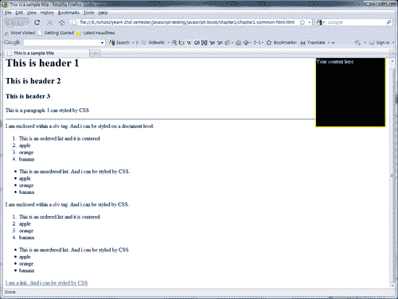
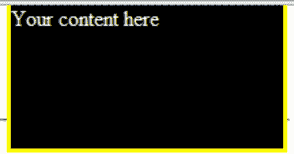
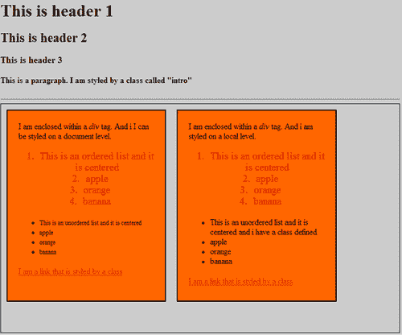
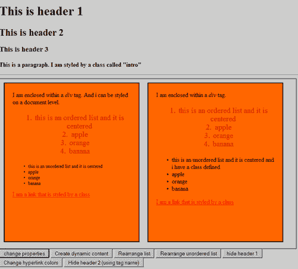

# 第一章：什么是 JavaScript 测试？

> 首先，请允许我欢迎你拿起这本书。如果你拿起这本书，我会假设你对 JavaScript 测试感兴趣。你很可能会经历 JavaScript，希望通过学习如何测试你的 JavaScript 程序来提高你的技能。
> 
> JavaScript 通常与网络浏览器关联，是创建网页上交互元素的关键工具之一。然而，与 PHP、Python 等服务器端语言不同，JavaScript 通常默默失败（尽管像 IE 这样的浏览器有时会提供警告信息）；没有错误信息告诉你发生了错误。这使得调试变得困难。
> 
> 通常，我们将学习关于 JavaScript 测试的基本构建块。这包括**HTML（超文本标记语言）**、**CSS（层叠样式表）**和 JavaScript 的基础知识。之后，你将学习各种技术使 HTML、CSS 和 JavaScript 协同工作；这些技术是你在其他章节中要学习的内容的基础。

更具体地说，我们将在本章中学习以下内容：

+   HTML、CSS 和 JavaScript 的基础

+   HTML、CSS 和 JavaScript 的语法

+   如何使用 CSS 和 JavaScript 选择 HTML 元素？

+   网页为什么需要在没有 JavaScript 的情况下工作？

+   测试是什么，为什么你需要测试？

+   什么是错误？

+   JavaScript 错误的类型

本章中示例很简单——它们旨在让你看到主要语法和正在使用的内置方法或函数。在本章中，代码将最少；你会被要求输入代码。之后，我们将简要回顾代码示例，看看发生了什么。

带着这个想法，我们将立即开始。

# JavaScript 在网页中占有什么位置？

每个网页都由以下属性组成——内容、外观和行为。这些属性分别由超文本标记语言（HTML）、层叠样式表（CSS）和 JavaScript 控制。

## HTML 内容

HTML 代表超文本标记语言。它是网页的主导标记语言。通常，它控制网页的内容。HTML 通过`<head>`、`<body>`、`<form>`和`<p>`等语义标记来定义网页（或 HTML 文档），以控制标题、文档主体、表单、段落等。你可以把 HTML 看作是一种描述网页应该看起来怎样的方式。

HTML 使用标记标签，这些标签通常成对出现。HTML 的语法如下：

`<name-of-html-tag>` 你的内容可以在这里括起来 `</name-of-html-tag>`

请注意，**HTML**标签由尖括号括起来；**HTML**标签对以`<name-of-html-tag>`开头，以`</name-of-html-tag>`结尾。这个第二个**HTML**标签被称为闭合标签，它们在**HTML**标签前有一个斜杠。

以下是一些常见的 HTML 元素：

+   `<head> </head>`

+   `<body> </body>`

+   `<title> </title>`

+   `<p> </p>`

+   `<h1> </h1>`

+   `<a> </a>`

要查看完整的 HTML 元素列表，请访问[`www.w3schools.com/tags/default.asp`](http://www.w3schools.com/tags/default.asp)。

# 行动时间—构建一个 HTML 文档

我们将通过使用上面看到的 HTML 标签和语法来创建一个 HTML 文档。（你在这里看到的示例可以在`Chapter 1`的源代码文件夹中找到，文档名为`chapter1-common-html.html`）

1.  首先，打开你最喜欢的文本编辑器或工具，比如微软记事本，然后创建一个新文档。

1.  将以下代码输入到你的新文档中并保存。

    ```js
    <!DOCTYPE html PUBLIC "-//W3C//DTD XHTML 1.0 Transitional//EN" "http://www.w3.org/TR/xhtml1/DTD/xhtml1-transitional.dtd">
    <html >
    <head>
    <title>This is a sample title</title>
    </head>
    <body>
    <h1>This is header 1</h1>
    <h2>This is header 2</h2>
    <h3>This is header 3</h3>
    <p>This is a paragraph. It can be styled by CSS</p>
    <hr>
    <div style="position:absolute; background-color:black; color:#ffffff;top:10px;right:10px;border:solid 3px yellow; height:200px; width:200px;">Your content here</div>
    <div>
    <div>I am enclosed within a <i>div</i> tag. And it can be styled on a document level.
    <ol>
    <li>This is an ordered list and it is centered</li>
    <li>apple</li>
    <li>orange</li>
    <li>banana</li>
    </ol>
    <ul>
    <li>This is an unordered list. And it can be styled by CSS.</li>
    <li>apple</li>
    <li>orange</li>
    <li>banana</li>
    </ul>
    </div>
    <div>I am enclosed within a <i>div</i> tag. And it can be styled by CSS.
    <ol>
    <li>This is an ordered list and it is centered</li>
    <li>apple</li>
    <li>orange</li>
    <li>banana</li>
    </ol>
    <ul>
    <li>This is an unordered list. And it can be styled by CSS</li>
    <li>apple</li>
    <li>orange</li>
    <li>banana</li>
    </ul>
    <a href="#">This is a link. And it can be styled by CSS </a>
    </div>
    </div>
    </body>
    </html>

    ```

1.  最后，打开浏览器中的文档，你会看到类似以下屏幕截图的示例：



+   请注意右上角的黑色盒子。这是 CSS 工作的一个简单例子。这将在后面解释。

## 刚才发生了什么？

你刚刚使用更常见的**HTML**元素和**HTML**语法创建了一个 HTML 文档。

每个**HTML**标签都有特定的用途，正如你在浏览器中看到的结果一样。例如，你肯定注意到了`<h1>This is header 1</h1>`产生了最大的文本，`<h2>This is header 2</h2>`产生了第二大文本，依此类推。

`<ol> </ol>`代表有序列表，而`<ul> </ul>`代表无序列表（带有子弹点的列表）。

你应该注意到了`<div> </div>`的使用。这用于在 HTML 文档中定义一个部分。然而，`<div> </div>`的效果和力量只能在本章的下一部分看到。

但是等等，似乎我还没有对 HTML 做一个完整的介绍。没错。我没有介绍 HTML 元素的各个属性。所以让我们快速概述一下。

### 使用其属性样式化 HTML 元素

通常，HTML 元素的 core 属性包括`class, id, style`和`title`属性。你可以以以下方式使用这些属性：

```js
<div id="menu" class="shaded" style="..." title="Nice menu"> Your
content here </div>

```

注意，这四个属性可以同时使用。另外，属性的顺序无关紧要。

但我们还没有进行任何样式设计。样式只发生在`style`属性中。为了看到一个例子，请在之前的代码中`<body>`和`</body>`标签之间输入以下代码。

```js
<div style= "position:absolute; background-color:black;color:#ffffff;
top:10px;right:10px;border:solid 3px yellow; height:200px;
width:200px;">Your content here
</div>

```

你应该能看到一个 200px 乘 200px 的黑色盒子，带有黄色边框，位于浏览器窗口的右上角（如之前的屏幕截图所示）。以下是只显示黑色盒子的屏幕截图：



通常，你指定的内联样式会操作`style`属性的样式属性，以使其看起来是你想要的样子。

只有`style`属性允许你设置 HTML 元素的样式。但这种方法只用于为元素指定内联样式。

如果你想知道`<title>`标签的作用，它实际上是一个指定元素额外信息的属性。这通常用在`<head>`标签内。如果你打开任何包含`<title>`标签的 HTML 文档，你会在浏览器的标签页或浏览器窗口的标题中找到这个标签的内容。

那么`id`属性和`class`属性是什么呢？我们将在下一节简要介绍这些内容。

### 为 HTML 元素指定 id 和 class 名称

通常，`id`属性和`class`属性允许 HTML 元素通过 CSS（我们将在本章后面介绍的层叠样式表）来设置样式。你可以把`id`属性和`class`属性看作是一个“名字”，或者是一种识别对应 HTML 元素的方法，这样如果这个“名字”被 CSS 引用，元素就会按照特定的 CSS 样式进行设置。此外，`id`属性和`class`属性经常被 JavaScript 引用以操纵一些 DOM（文档对象模型）属性等。

在本书的这一点上，你必须理解一个重要的概念：每个 HTML 元素的`id`属性在 HTML 文件中必须是唯一的，而`class`属性则不是。

## 层叠样式表

CSS 代表层叠样式表。CSS 用于控制网页的布局、外观和格式。CSS 是你指定 HTML 元素风格化外观的方法。通过 CSS，你可以定义字体、颜色、大小，甚至是 HTML 元素的布局。

如果你注意到了，我们还没有向我们的 HTML 文档添加任何形式的 CSS 样式；在前面的截图中，你所看到的是我们浏览器的默认 CSS（除了右上角的黑色盒子），大多数浏览器如果没有定义特定的 CSS，都会有相同的默认 CSS。

CSS 可以是内部的或外部的；内部 CSS 通过`<style>`标签嵌入 HTML 文档中，而外部 CSS 则通过`<link>`标签链接，例如：

```js
<link rel="stylesheet" type="text/css" href="style.css">.

```

通常，使用内部 CSS 被认为是一种不好的实践，应该避免。与内部 CSS 相比，外部 CSS 更受欢迎，因为它可以节省我们的时间和精力，我们只需更改`.css`文件即可更改网站的设计，而不需要对每个 HTML 文档进行单独的更改。它还有助于提高性能，因为浏览器只需下载一个 CSS 并将其缓存在内存中。

本节最重要的点是 CSS 选择器的使用和 CSS 的语法。

CSS 选择器的工作方式如下：选择 ID 时，ID 的名称前面有一个井号字符。对于类选择器，它前面有一个点号。在你稍后看到的代码中，你会看到同时使用了 ID 和类选择器（在源代码中也进行了注释）。以下是选择器的一个快速预览：

```js
/* this is a id selector */
#nameOfID {
/* properties here*/
}
/* this is a class selector */
.nameOfClass {
/* properties here*/
}

```

CSS 的语法如下：选择器 { 声明 } . 声明由分号分隔的一组名称或值属性对组成，其中冒号将名称与值分隔开。

记得我们在上一节提到了`id`属性 和 `class`属性吗？现在你将看到 CSS 是如何使用`id`属性和`class`属性的。

# 动手时间—使用 CSS 样式化你的 HTML 文档

现在我们将继续样式化我们在上一节创建的 HTML 文档，使用 CSS。为了简单起见，我们将使用内部 CSS。在本节中，你将看到 CSS 语法在实际工作中的应用，以及它是如何通过利用相应 HTML 元素的`id`属性和`class`属性来样式化每个 HTML 元素的。注意这个例子中同时使用了`id`和`class`选择器。

### 注意

这个例子完成版本可以在`Chapter 1`的源代码文件夹中找到，文件名为：`chapter1-css-appearance.html`

1.  接着上一个例子，打开你的文本编辑器，在`</title>`标签后插入以下代码：

    ```js
    <style type="text/css">
    body{
    background-color:#cccccc;
    }
    /* Here we create a CSS selector for IDs by a name preceded by a hash character */
    #container{
    width:750px; /* this makes the width of the div element with the id 'container' to have a width of 750px */
    height:430px;
    border:1px solid black;solid 1px black;
    }
    /* #[nameOfElement] */
    #boxed1{
    background-color:#ff6600;
    border:2px solid black;
    height:360px;
    width:300px;
    padding:20px;
    float:left;
    margin:10px;
    }
    #boxed2{
    HTML documentstyling, CSS usedbackground-color:#ff6600;
    border:2px solid black;
    height:360px;
    width:300px;
    padding:20px;
    float:left;
    margin:10px;
    }
    #ordered1{
    font-size:20px;
    color:#ce0000;
    text-align:center;
    }
    #unordered1{
    font-size:12px;
    color:#000f00;
    }
    #ordered2{
    font-size:20px;
    color:#ce0000;
    text-align:center;
    }
    #unordered2{
    font-size:12px;
    color:#000f00;
    }
    #unordered2.nice{
    font-size:16px;
    }
    .intro{
    color:black;
    font-weight:bold;
    }
    a:link {color:#FF0000;} /* unvisited link */
    a:visited {color:#00FF00;} /* visited link */
    a:hover {color:#FF00FF;} /* mouse over link */
    a:active {color:#0000FF;} /* selected link */
    </style>

    ```

1.  在添加上面的 CSS 代码后，你需要为你 的 HTML 元素添加`class`和`id`属性。你需要添加的内容如下：

    ```js
    <! - Some code omitted above -- >
    <body>
    <! - Some code omitted -- >
    <p class="intro">This is a paragraph. I am styled by a class called "intro"</p>
    <hr>
    <div id="container">
    <div id="boxed1">I am enclosed within a <i>div</i> tag. And I can be styled on a document level.
    <ol id="ordered1">
    <li>This is an ordered list and it is centered</li>
    <li>apple</li>
    <li>orange</li>
    <li>banana</li>
    </ol>
    <ul id="unordered1">
    <li>This is an unordered list.</li>
    <li>apple</li>
    <li>orange</li>
    <li>banana</li>
    </ul>
    <a class="link" href="#">I am a link that is styled by a class</a>
    </div>
    <div id="boxed2">I am enclosed within a <i>div</i> tag. And I am styled on a local level.
    <ol id="ordered2">
    <li>This is an ordered list and it is centered</li>
    <li>apple</li>
    <li>orange</li>
    <li>banana</li>
    </ol>
    <ul class="nice" id="unordered2">
    <li>This is an unordered list and I have a class defined</li>
    <li>apple</li>
    <li>orange</li>
    <li>banana</li>
    </ul>
    <a class="link" href="#">I am a link that is styled by a class</a>
    </div>
    </div>
    </body>
    </html>

    ```

    需要添加的`class`和`id`属性在上面的代码片段中突出显示。如果你不确定自己是否做得正确，打开`chapter1-css-appearance.html`看看。

1.  现在保存文件，并在浏览器中打开它。你应该看到你的 HTML 文档现在看起来与使用 CSS 样式化之前不同。你的输出应该与下面示例中的截图类似：



## 刚才发生了什么？

你刚刚在你上一节创建的 HTML 文档中应用了 CSS。注意你同时使用了`id`选择器和`class`选择器语法。在每个选择器内部，你也应该看到一些样式属性。

这个例子中的 HTML 元素与上一个例子相似，不同之处在于现在的 HTML 元素具有`id`和`class`名称。

在下面的子部分中，我将继续解释引用各种 HTML 元素的技术，以及我们如何通过使用它们的样式属性来设置元素样式。

### 通过它的 id 或 class 名称引用 HTML 元素并对其进行样式设置

我们引用了各种 HTML 元素的`id`或`class`名称。考虑上面例子中的以下代码片段：

```js
<! some code omitted above-->
<p class="intro">This is a paragraph. I am styled by a class called "intro"</p>
<! some code omitted -->
<div id="boxed">This is enclosed within a <i>div</i> tag. And it is styled on a local level.
<ol id="ordered1">
<li>This is an ordered list and it is centered</li>
<li>apple</li>
<li>orange</li>
<li>banana</li>
</ol>
<ul class="nice" id="unordered1">
<li>This is an unordered list and has a class defined</li>
<li>apple</li>
<li>orange</li>
<li>banana</li>
</ul>
<a class="link" href="#">This is a link that is styled by a class</a>
</div>

```

高亮的代码指的是使用`id`和`class`名称属性的 HTML 元素。注意有些 HTML 元素同时具有`id`和`class`名称属性，而有些则没有。

现在考虑这个 CSS 代码段，它出现在示例中：

```js
#boxed1{
background-color:#ff6600;
border:2px solid black;
height:360px;
width:300px;
padding:20px;
float:left;
margin:10px;
}

```

`#boxed1`选择器指的是 HTML 文档中的`<div>`元素，其 id 为`#boxed1`。注意，具有 id 为`#boxed1`的`<div>`元素是根据声明中的名称和值属性对进行样式的。如果你更改值属性并刷新你的浏览器，你将注意到`#boxed1`元素也发生了变化。

现在，考虑以下 CSS 代码段：

```js
.intro{
color:black;
font-weight:bold;
}

```

以及：

```js
a:link {color:#FF0000;} /* unvisited link */
a:visited {color:#00FF00;} /* visited link */
a:hover {color:#FF00FF;} /* mouse over link */
a:active {color:#0000FF;} /* selected link */

```

前两个代码段是我们所说的`class`选择器，它们的语法与`id`选择器略有不同。例如，`.intro`类选择器选择类名称为“intro”的`<p>`元素，而`a:link`、`a:visited`、`a:hover`和`a:active`选择器指的是锚点的四种状态。

到目前为止，我们已经介绍了 CSS 选择器如何选择 HTML 文档中的 HTML 元素。但我们还没有涉及到 HTML 元素同时具有`id`和`class`属性的情况，现在我们来解释一下。

### 类选择器和 id 选择器之间的区别

尽管`id`选择器和`class`选择器看起来一样，但它们之间有一些细微的差别。例如，`id`选择器用于指定一个 HTML 元素，而`class`选择器用于指定几个 HTML 元素。

例如，你可以尝试将锚元素`<a class="link" href="#">`更改为`<a class="`**intro**`" href="#">`，你会注意到链接现在变成了粗体。

### 注意

如果一个 HTML 元素有一个由`id`和`class`选择器控制的样式属性，那么`class`选择器中的样式属性将优先于`id`选择器中的样式属性。

### 类选择器和 id 选择器的其他用途

在下面的章节中，你将了解到 HTML 元素的`id`和`class`名称在网页上提供交互性方面起着重要作用。这是通过使用 JavaScript 实现的，JavaScript 通过其`id`或`class`名称来引用 HTML 元素，之后对引用的 HTML 元素执行各种操作，如 DOM 操作。

### CSS 属性的完整列表

这里给出的例子不完整。要获取 CSS 的完整参考，你可以访问[`www.w3schools.com/css/css_reference.asp`](http://www.w3schools.com/css/css_reference.asp)。

## JavaScript 为网页提供行为

在本节中，我们将介绍 JavaScript 的一些关键方面。总的来说，如果 HTML 为 HTML 文档提供内容，而 CSS 为 HTML 文档设置样式，那么 JavaScript 通过为网页提供行为来赋予 HTML 文档生命。

行为可以包括动态改变 HTML 文档的背景颜色，或者改变文本的字体大小等等。JavaScript 甚至可以用来创建如动画幻灯片、淡入淡出效果等效果。

通常，行为是基于事件的，通过实时操作 DOM 来实现（至少从用户的角度来看）。

如果你对 JavaScript 还不太熟悉，JavaScript 是一种具有面向对象能力的解释型编程语言。它是一种松散类型的语言，这意味着你在声明变量或函数时不需要定义数据类型。

在我看来，理解 JavaScript 语言特性最好的方式是通过一个例子。现在，是时候动手了。

# 动手时间—给你的 HTML 文档添加行为

我们将把 JavaScript 应用到一个带有 CSS 样式的 HTML 文档上。与之前的例子相比，HTML 元素和 CSS 一般来说没有太大变化，除了你会在 HTML 文档中看到 HTML 按钮。

这个例子中应用到 HTML 文档上的 JavaScript 被称为内联 JavaScript，因为它存在于 HTML 文档中。

我们在这里要展示的是如何声明变量、函数，如何操作 HTML 元素的 DOM，以及如何通过它们的`id`或`class`来引用 HTML 元素。你还将学习到数组的一些常用内置方法，以及如何引用这些元素，从而使你的任务变得更简单。

这个例子并不复杂，但你将学习到一些最重要的、用于引用 HTML 元素并操作 DOM 的常用技术。

### 注意

（这个例子完整的代码可以在源代码文件夹`Chapter 1`中找到，文件名为：`chapter1-javascript-behavior.html`）：

1.  继上一个例子之后，在`</style>`标签后输入以下 JavaScript 代码：

```js
<script type="text/javascript">
function changeProperties(d){
var e = document.getElementById(d);
e.style.position = "absolute";
e.style.fontFamily = "sans-serif";
e.style.backgroundColor = "#000000";
e.style.border = "solid 2px black";
e.style.left = "200px";
e.style.color = "#ffffff";
}
function arrangeList(f) {
// This is the element whose children we are going to sort
if (typeof f == "string"){ // check to see if the element is "string"
f = document.getElementById(f);
}
// Transfer the element (but not text node) children of e to a real array
var listElements = [];
for(var x = f.firstChild; x != null; x = x.nextSibling)
if (x.nodeType == 1){
listElements.push(x);
}
listElements.sort(function(n, m) { // .sort is a built in method of arrays
var s = n.firstChild.data;
var t = m.firstChild.data;
if (s < t){
return -1;
}
else if (s > t){
return 1;
}
else{
return 0;
}
});
for(var i = 0; i < listElements.length; i++){
f.appendChild(listElements[i]);
}
}
function insertContent(a){
var elementToBeInserted = document.getElementById(a);
elementToBeInserted.innerHTML = "<h1>This is a dynamic content</h1><br><p>great to be here</p>";
}
function changeElementUsingName(a){
var n = document.getElementsByName(a);
for(var i = 0; i< n.length; i++){
n[i].setAttribute("style","color:#ffffff");
}
}
function hideElement(a){
var header = document.getElementById(a);
header.style.visibility = "hidden";
}
function hideElementUsingTagName(a){
var n = document.getElementsByTagName(a);
for(var i = 0; i< n.length; i++){
n[i].setAttribute("style","visibility:hidden");
}
}
</script>

```

+   现在保存你的文档并在浏览器中加载它，你会看到一个与下一张截图类似的示例：



## 刚才发生了什么？

你已经创建了一个带有 CSS 样式的 HTML 文档，并向其应用了 JavaScript。与之前的例子相比，HTML 元素和 CSS 一般来说没有太大变化，但你将会看到`<button>`元素。

通过点击 HTML 按钮，你可以看到 JavaScript 的强大作用。你会发现如果你点击了**改变属性**按钮，你将看到右侧的 HTML 盒子向左移动了 200 像素，其背景颜色也发生了变化。你还可以点击其他按钮来测试它们对 HTML 文档的影响。

当你点击每个 HTML 按钮时，你正在调用一个 JavaScript 函数，通过 DOM 操纵文档中的相关 HTML 元素。你应该看到诸如隐藏内容、创建动态内容、重新排列项目列表等效果。

在以下部分中，我首先简要介绍了 JavaScript 语法，然后将事件附加到 HTML 元素上，最后使用 JavaScript 的内置方法来查找 HTML 元素并操作它们。

### JavaScript 语法

我们将从学习 JavaScript 的基本语法开始。考虑一下打开的`<script>`标签：

```js
<script type="text/javascript">
// code omitted
</script>

```

上述`<script>`标签的作用是确定 JavaScript 的开始和结束位置。在`type`属性内，我们写`text/javascript`以表示这是一个 JavaScript 代码。

现在，让我们考虑一下以下的代码片段：

```js
function arrangeList(f) {
if (typeof f == "string"){ // check to see if the element is "string"
f = document.getElementById(f);
}
var listElements = [];//declaring a variable
for(var x = f.firstChild; x != null; x = x.nextSibling)
if (x.nodeType == 1){
listElements.push(x);
}
listElements.sort(function(n, m) { // .sort is a built in method of arrays
var s = n.firstChild.data;
var t = m.firstChild.data;
if (s < t){
return -1;
}
else if (s > t){
return 1;
}
else{
return 0;
}
});
for(var i = 0; i < listElements.length; i++){
f.appendChild(listElements[i]);
}
}

```

上面的代码片段显示了一个名为`arrangeList`的函数。我们通过使用保留关键字`function`后跟函数名称来定义一个函数。参数在`( )`内传递，在这个代码片段中，`f`是传递给函数的参数。函数从`a`开始{并在`a}`结束。

简而言之，函数语法可以定义如下：

```js
function functionname(parameter1, parameter2, ... parameterX){
Body of the function
}

```

第二个高亮行通过使用`if`语句展示了 JavaScript 中的决策制定。这个语法与 C 编程语言中的`if`语句相似。JavaScript 的`if`语句的语法如下：

```js
if (condition){
code to be executed if condition is true.
}

```

`if`语句的一个变体是**if-else**。

```js
if (condition){
code to be executed if condition is true.
}
else{
code to be executed if condition is not true.
}

```

我们使用关键字`var`后跟一个变量名。在上面的例子中，`var listElements = []`；意味着定义了一个名为`listElements`的变量，并给它一个表示空列表的`[]`值。通常，由于 JavaScript 是松散类型的，变量可以被赋予任意值。

继续上面的内容，你应该看到`for`循环在起作用。它的语法也与 C 语言的`for`循环相似。

如果你是 JavaScript 的新手，`document.getElementById()`和`listElements.push(x)`之类的语句可能会让你感到困惑。这两行代码中发生的事情是我们使用了 JavaScript 的一些内置方法来引用具有相应 ID 的 HTML 元素。现在，`document.getElementById()`对你来说将更重要；这将在你学习如何在 HTML 文档中查找元素的部分进行介绍。

### javascript 事件

首先，让我们来看一下你 JavaScript 中找到的以下代码片段：

```js
<button onclick="changeProperties('boxed1')">change properties</button>
<button onclick="insertContent('empty')">Create dynamic content</button>
<button onclick="arrangeList('ordered1')">Rearrange list</button>
<button onclick="arrangeList('unordered1')">Rearrange unordered list</button>
<button onclick="hideElement('header1')">hide header 1</button>
<button onclick="changeElementUsingName('lost')">Change hyperlink colors</button>
<button onclick="hideElementUsingTagName('h2')">Hide header 2 (using tag name)
</button>

```

上面的代码片段显示了通过`onclick`附加到 HTML 按钮上的事件。当按钮被点击时，相应的 JavaScript 函数将被调用。

例如，`<button onclick="changeProperties('boxed1')">change properties</button>`意味着当这个按钮被点击时，`changeProperties()`函数将被调用，参数`boxed1`是一个具有`ID boxed1`的`div`元素。

### 在文档中查找元素

记住，我们已经看到了 JavaScript 的一些内置方法。JavaScript 可以通过使用一些内置方法或属性在 HTML 文档中查找元素。在找到 HTML 元素后，你可以操作它的属性。JavaScript 具有`Document`对象（DOM 树的根）的三个属性，可以让你找到所需的 HTML 元素。这里提到的技术是 JavaScript 测试的骨架。理解这一部分对理解本书的其余部分至关重要。所以，确保你理解了这一章节的内容。

首先，`document.getElementById()`。这个属性允许你通过特定的 ID 选择一个 HTML 元素。`document.getElementById()`只能返回一个元素，因为每个`id`属性的值都是（应该是）唯一的。以下是来自示例的代码片段：

```js
function changeProperties(d){
var e = document.getElementById(d); 
e.style.position = "absolute";
e.style.fontFamily = "sans-serif";
e.style.backgroundColor = "#000000";
e.style.border = "2px solid black";
e.style.left = "200px";
e.style.color = "#ffffff";
}

```

考虑上面代码片段中突出显示的行，`var e = document.getElementById(d)`。这里发生的是 HTML 元素'd'被引用，而'd'碰巧是`changeProperties()`函数的参数。如果你查看这个示例的源代码，你会看到一个 HTML 按钮，其内容为：`<button onclick="changeProperties('boxed1')">改变属性</button>`。注意'boxed1'正在被引用，这意味着参数'f'取值为'boxed1'的 HTML 元素 id。因此，`var e = document.getElementById(d)`意味着通过`document.getElementById()`方法将 ID 为'boxed1'的 HTML `div` 分配给变量`e`。

其次，注意`document.getElementsByName()`语句。这个方法和`document.getElementById()`类似，但它查看的是`name`属性而不是`id`属性。它返回一个元素的数组而不是一个单一的元素。考虑以下代码片段：

```js
function changeElementUsingName(a){
var n = document.getElementsByName(a); 
for(var i = 0; i< n.length; i++){
n[i].setAttribute("style","color:#ffffff");
}
}

```

这里发生的是通过名称'`a`'（碰巧是函数的参数）引用了 HTML 元素，并且因为返回的是元素数组，我们使用一个`for`循环遍历元素，并使用`.setAttribute`方法将文本颜色改为白色。`name`属性仅适用于`<form>`和`<a>`标签。

最后，看看`document.getElementsByTagName()`。这个方法通过 HTML 标签名称来查找 HTML 元素。例如，以下代码：

```js
function hideElementUsingTagName(a){
var n = document.getElementsByTagName(a); 
for(var i = 0; i< n.length; i++){
n[i].setAttribute("style","visibility:hidden");
}
}

```

通过标签名称查找 HTML 元素，并使其隐藏。在我们这个例子中，使用`h2`作为参数，因此当你点击相关按钮时，所有包含在`<h2>`标签中的文本都会消失。

现在，如果你将参数改为`div`，那么你会注意到所有的方框都会消失。

### 把所有内容放在一起

现在我将简要描述 JavaScript 如何与 HTML 元素交互。在本小节中，你会了解到：当 HTML 按钮被点击（一个事件）后，它调用一个 JavaScript 函数。然后，JavaScript 函数接收一个参数并执行该函数。考虑下面的代码片段。

以下是为带有事件的 HTML 按钮编写的代码：

```js
<button onclick="insertContent('empty')">Create dynamic content</button>code

```

接下来，以下是为 HTML `div` 元素编写的代码：

```js
<div id="empty"></div>

```

最后，以下是要调用的 JavaScript 函数的代码：

```js
function insertContent(a){
var elementToBeInserted = document.getElementById(a);
elementToBeInserted.innerHTML = "<h1>This is a dynamic content</h1><br><p>great to be here</p>";
}

```

现在，让我解释我们要在这里做什么；点击 HTML 按钮后，调用 JavaScript 函数`insertContent()`。参数'`empty`'被传递给`insertContent()`。'`empty`'指的是 ID 为'`empty`'的`div`元素。

在调用`insertContent()`后，参数'empty'被传递给变量`var elementToBeInserted`，通过使用`document.getElementById()`。然后，利用 HTML 元素节点的内置方法`innerHTML()`（因为 HTML 元素节点传递给了`elementToBeInserted`变量），我们动态地插入文本"`<h1>This `is a dynamic content</h1><br><p>great to be here</p>`"。

然后请在你的网页浏览器中打开文件，并点击 HTML 按钮。你会注意到新的一段文本被动态地插入到 HTML 文档中。

### 注意

HTML 元素节点的内置方法`innerHTML()`允许我们操纵（或者在这个例子中，动态插入）HTML 内容到使用`innerHTML()`方法的 HTML 节点中。例如，在我们的例子中，我们将`"<h1>This is a dynamic content</h1><br><p>great to be here</p>"`插入到`<div id="empty"></div>`中。技术上讲，插入后，最终结果将是：`<div id="empty"><h1>This is a dynamic content</h1><br><p>great to be here</p></div>`。

# JavaScript 与服务器端语言的区别

总的来说，JavaScript 与服务器端语言的主要区别在于它们的用途和执行位置。在现代应用中，JavaScript 在客户端（用户的网页浏览器）运行，而服务器端语言在服务器上运行，因此经常用来读取、创建、删除和更新 MySQL 等数据库。

这意味着 JavaScript 在网页浏览器上进行处理，而服务器端语言在网页服务器上执行。

服务器端语言包括 ASP.NET、PHP、Python、Perl 等。

在现代网络开发技术背景下，你可能已经听说过 Web 2.0 应用程序。一个重要的技术是 JavaScript 经常被广泛使用，以提供交互性并执行异步数据检索（有时是数据操作），这也被称作 AJAX（它是异步 JavaScript 和 XML 的缩写）。

JavaScript 不能用来与数据库交互，而像 PHP、Python 和 JSP 这样的服务器端语言可以。

JavaScript 也被称为前端，而服务器端则是后端技术。

### 注意

JavaScript 也可以用在服务器端，尽管它最常与客户端技术相关联。尽管 JavaScript 通常不与与数据库交互关联，但未来这种情况可能会改变。考虑像 Google Chrome 这样的新浏览器，它为 JavaScript 提供了与浏览器内建数据库交互的数据库 API。

# 为什么页面需要在没有 JavaScript 的情况下工作

虽然关于我们应该让网页在没有或具有 JavaScript 的情况下工作的争论有很多，但我个人认为，这取决于网站或应用程序的使用方式。不过无论如何，我将从一些页面需要在没有 JavaScript 的情况下工作的常见原因开始。

首先，并非所有用户都在网页浏览器中启用了 JavaScript。这意味着如果您的应用程序（或功能）需要 JavaScript，那么没有启用 JavaScript 的用户将无法使用您的应用程序。

其次，如果您打算支持移动设备上的用户，那么您需要确保您的网站或应用程序在没有 JavaScript 的情况下也能工作。主要原因是移动设备对 JavaScript 的支持往往不够满意；如果您使用 JavaScript，您的网站或应用程序可能不如预期工作（或者更糟，根本无法工作）。

另一个角度来看，这基于您对用户群体的理解。例如，大概唯一可以忽略那些禁用 JavaScript 的用户的情况是，当您可以保证或事先知道您的用户群体已启用 JavaScript 时。这种情况可能出现在您为内部使用开发应用程序时，您事先知道您的所有用户都已启用 JavaScript。

如果您在想如何创建在没有 JavaScript 的情况下也能工作的页面，您可以了解一下优雅降级（graceful degradation）的概念。想象一下，您有一个应用程序，该应用程序的核心功能是基于 AJAX 的。这意味着为了使用您的应用程序，您的用户需要启用 JavaScript。在这种情况下，您可能需要考虑让您的页面在没有 JavaScript 的情况下也能工作，以确保所有用户都能使用您的应用程序。

# 测试是什么？

一般来说，程序员在编写程序时会有一些目标。除了创建一个为解决特定问题或满足特定需求而编写的程序之外，其他常见目标还包括确保程序至少是正确的、高效的，并且可以容易地扩展。

在上文提到的目标中，正确性至少在这本书中是最重要的目标。我们所说的正确，是指对于任何给定的输入，我们需要确保输入是我们想要的或需要的，相应的输出也是正确的。这一点的隐含意义是指程序逻辑是正确的：它按照我们的意图工作，没有语法错误，引用的变量、对象和参数是正确的并且是我们需要的。

例如，一个用 JavaScript 编写的退休计划计算器。我们可能会期望用户输入诸如他们当前的年龄、退休年龄和每月储蓄等值。想象一下，如果用户输入错误的数据，比如字符串或字符。JavaScript 退休计划计算器将无法工作，因为输入数据是错误的。更糟糕的是，如果用户输入了正确的数据，而我们计算为退休设置 aside 的金额的算法是错误的，这将导致输出是错误的。

上述错误可以通过测试来避免，这是本书的主题。在本章剩余的部分，我们将讨论你作为 JavaScript 程序员可能遇到的一些错误类型。但在我们进入那个话题之前，我将简要讨论为什么我们需要测试。

# 为什么你需要测试？

首先且最重要的是，人类容易犯错误。作为一名程序员，你很可能在你编程生涯中犯过编码错误。即使地球上最优秀的程序员也犯过错误。更糟糕的是，我们可能直到测试程序时才发现错误。

第二，也许更重要的是，JavaScript 通常会默默失败；没有错误信息告诉你发生了什么错误，或者错误发生在哪里，假设你没有使用任何测试单元或工具来测试你的 JavaScript。因此，如果你 JavaScript 程序有错误，很难或根本没有办法知道发生了什么。

### 注意

在微软的 Internet Explorer 中，你实际上可以看到是否有任何 JavaScript 错误。你需要打开**脚本调试**，这在**工具** | **Internet 选项** | **高级** | **脚本调试**中找到。开启**脚本调试**后，如果你有任何 JavaScript 错误，你将在 IE7 或 IE8 的左下角看到一个黄色的'yield'图标。点击这个图标，你会得到一个窗口，你可以在其中点击**显示详细信息**来获取有关错误的更多信息。

第三，即使有方法可以通知你 JavaScript 错误，比如启用**脚本调试**，如上所述，但仍有某些错误是无法通过这些方法检测到的。例如，你的程序语法可能是一百分之一百的正确，但你的算法或程序逻辑可能是有误的。这意味着即使你的 JavaScript 可以执行，你的输出可能是错误的。

最后，测试 JavaScript 可以帮助你识别跨浏览器兼容性问题。因为大约有五种主要类型的浏览器（不计算不同版本）需要支持——即微软的 Internet Explorer、Mozilla 的 Firefox、谷歌的 Chrome、苹果的 Safari 和 Opera 网络浏览器——你肯定需要测试以确保你的网站或应用程序在所有浏览器上都能工作，因为不同的浏览器有不同的 DOM 兼容性。

确保程序正确意味着确认并检查输入是正确的，然后输出是我们期望的结果。

# 错误类型

在我开始介绍 JavaScript 错误之前，我们需要了解 JavaScript 和网页浏览器的工作原理。一般来说，用户从服务器请求一个网页文档，这个文档被加载到用户的网页浏览器中。假设这个网页文档中嵌入了 JavaScript（无论是通过外部 JavaScript 文件还是通过内联 JavaScript），JavaScript 将与网页文档一起被加载（从上到下）。当网页浏览器加载网页文档时，网页浏览器的 JavaScript 引擎将开始解释网页文档中嵌套的 JavaScript。这个过程将继续，直到 JavaScript（和网页文档）完全加载到用户的网页浏览器中，为交互做好准备。然后，用户可能开始通过点击可能附有 JavaScript 事件链接或按钮来与网页文档进行交互。

现在，带着上面的过程在心中，我们将开始介绍不同类型的 JavaScript 错误，通过使用简单的例子。

## 加载错误

我们首先讨论的错误类型是加载错误。加载错误是在文档加载过程中由网页浏览器的 JavaScript 引擎捕获的错误。

换句话说，加载错误发生在 JavaScript 有机会运行之前。这些错误通常在代码有机会执行之前被 JavaScript 引擎发现。

带着前面提到的事情在心中，现在让我们经历一下加载错误是如何发生的。

# 行动时间——加载错误的具体表现

现在我们将看到加载错误的具体表现。我们实际上并没有看到它，但你将学习到一些加载错误的最常见原因。

### 注意

这个例子的完整代码可以在源代码文件夹`第一章`中找到，文件名为`chapter1-loading-errors.html`

1.  打开你的文本编辑器并创建一个新文档。

1.  将以下代码输入到你的文档中：

    ```js
    <html>
    <head><title>JavaScript Errors - Loading Errors</title></head>
    <body>
    <script type="text/javascript">/*
    1\. Loading Errors
    */
    /*
    // Example 1 - syntax errors
    var tests = "This is a test"; // note two s
    document.write(test); // note one s
    */
    /*
    // Example 2 - syntax errors as the keyword "var" is not used
    Var Messsage = "This is a test"; // note three s's
    document.write(Message); // note two s's
    */
    /*
    // Example 3 - error caused by using a key word
    var for = "this is a test";
    document.write(in);
    */
    </script>
    </body>
    </html>

    ```

1.  现在，取消注释掉例子 1 周围的`/*`和`*/`，保存文档并在浏览器中加载它。你应该在你的网页浏览器中看到一个空白页面。

1.  重复上述步骤，对例子 2 和例子 3 也这样做。你应该看到例子 2 和例子 3 都是一个空白页面。

## 刚才发生了什么？

你刚刚创建了一个带有错误 JavaScript 代码的 HTML 文档。从代码中的注释，你应该意识到错误主要是由于语法错误引起的。当这种错误发生时，网页浏览器中的 JavaScript 没有任何响应。

常见的语法错误示例包括缺少括号、缺少分号和错误的变量名。

通常情况下，只要你的代码在语法上是正确的，那么你应该能够避免加载错误。

现在，你可能会问，如果 JavaScript 代码的某些部分是错误的会发生什么？这将取决于错误发生的地点。

### 部分正确的 JavaScript

通常情况下，JavaScript 是从上到下执行或加载的。这意味着首先加载第一行代码，然后是下一行，直到最后加载最后一行代码。这对部分正确的 JavaScript 有重要的影响。

# 行动时间——加载错误在行动中

现在我们将看到部分正确的 JavaScript 代码在行动中及其影响。

### 注意

这个示例的完整源代码可以在源代码文件夹中找到，文件名为`Chapter1-loading-errors-modified.html`。

1.  打开你的文本编辑器，创建一个新文档，将以下代码输入到你的文档中：

    ```js
    <html>
    <head><title>JavaScript Errors - Loading Errors</title></head>
    <body>
    <script type="text/javascript">/*
    1\. Loading Errors - modified
    */
    // this is correct code
    var tests = "This is a CORRECT test";
    document.write(tests);
    // this is incorrect code. The variable name referred is incorrect
    var Messsage = "This is a FIRSTtest";
    document.write(Message);
    // this is correct code
    var testing = "this is a SECOND test";
    document.write(testing);
    </script>
    </body>
    </html>

    ```

1.  现在保存你的文档并在你的网页浏览器中加载你的文档。你应该在浏览器中看到文字**这是一个测试在**。

## 刚才发生了什么？

如果你追踪代码，你应该看到 JavaScript 是从上到下执行的。当它遇到一个错误时，它会在`document.write()`中引用一个错误的变量名而停止执行。因为它在遇到错误时停止执行，所以剩下的 JavaScript 代码将不会被执行。

如果你的 JavaScript 代码是按照函数来组织的，那么情况会有所不同。在这种情况下，语法错误的函数将无法执行，而语法正确的函数将继续工作，无论其在代码中的顺序如何。

到现在为止，你应该对加载错误以及如何通过确保你的代码在语法上是正确的来防止它们有一个大致的了解。

现在让我们继续讨论下一类错误——运行时错误。

### 运行时错误

你还记得 JavaScript 是如何与网页文档一起加载到浏览器中的吗？在网页文档完全加载到网页浏览器后，它准备好响应各种事件，这也导致了 JavaScript 代码的执行。

运行时错误发生在执行过程中；例如，考虑一个带有 JavaScript 事件的 HTML 按钮。假设一个 JavaScript 函数被分配给了一个事件，那么如果 JavaScript 函数有错误，当用户点击 HTML 按钮时，该函数将不会被执行。

其他形式的运行时错误发生在你对对象、变量或方法误用，或者你引用了尚不存在的对象或变量时。

# 行动时间——运行时错误在行动中

现在我们将看到运行时错误的三个常见原因在行动。

### 注意

代码示例保存在第一章的源代码文件夹中，名为：`chapter1-runtime-errors.html`。

1.  打开你的文本编辑器，在新的文档中输入以下代码：

    ```js
    <html>
    <head><title>JavaScript Errors</title></head>
    <script type="text/javascript">/*
    2\. Runtime Errors
    */
    alert (window.innerHTML);
    var Test = "a variable that is defined";
    alert(Test); // if variables is wrongly typed, than nothing wil happen
    // nothing happens when the user clicks on the HTML button, which invokes the following function
    function incorrectFunction(){
    alert(noSuchVariable);
    }
    </script>
    <body>
    <input type="button" value="click me" onclick="incorrectFunction()" />
    </body>
    </html>

    ```

1.  保存文档，并将其加载到你的网页浏览器中。

1.  在将文档加载到浏览器后，你将看到两个警告框：第一个框显示**未定义**，第二个警告框显示**已定义的变量**。然后你会看到一个写着**点击我**的 HTML 按钮。

1.  点击按钮，你会发现什么也没有发生。

## 刚才发生了什么？

你所看到的第一个警告框显示了一个由方法误用引起的错误。`window.innerHTML`不存在，因为`.innerHTML`是应用于 HTML 元素，而不是`window`。第二个警告框显示一个在`alert()`引用它之前已定义的变量。最后，当你点击 HTML 按钮时，什么也不会发生，因为应该被调用的函数引用了未定义的变量。因此，在`onclick()`事件中没有执行。

在这个例子中，你应该意识到代码的逻辑非常重要，你需要在使用它们之前定义你的变量或对象。还要确保应用的方法或属性是正确的。否则，你最终会得到一个运行时错误。

现在，我们将进入 JavaScript 错误的最后一种形式——逻辑错误。

### 逻辑错误

逻辑错误很难解释。但一般来说，你可以将逻辑错误视为代码运作不符合你预期的方式时产生的错误。通过亲身体验逻辑错误，你更容易理解它们是什么。所以，让我们采取一些行动。

# 行动时间——逻辑错误在行动

在这个最后一个例子中，你会看到逻辑错误。

1.  打开你的文本编辑器，在新的文档中输入以下代码：

    ```js
    <html>
    <head><title>JavaScript Errors</title>
    <script type="text/javascript">
    /* Logic Errors */
    //saving some input in wrong variables
    function amountOfMoneySaved(amount){
    var amountSpent, amountSaved;
    amountSpent = amount; // where you really meant amountSaved
    var currentAmount = 100;
    var totalAmountSaved = currentAmount - amountSpent;
    alert("The total amount of money you have now is " +
    totalAmountSaved );
    }
    function checkInput(amount){
    if(amount>0 && amount<99)
    alert("is number");
    else
    alert("NOT number");
    }
    </script>
    </head>
    <body>
    <!-- this shows an infinite loop, an obvious logic error-->
    <script>
    // an infinite loop
    for(var i = 0; i<10; i--){
    document.write(i + "<br>");
    }
    </script>
    <form id="moneyForm">
    You currently have 100 dollars.
    The amount of money you have saved is: <input type="text" id="money" name="money" /><br />
    <input type="submit" value="Submit"
    onclick="amountOfMoneySaved(moneyForm.money.value)" />
    </form>
    </body>
    </html>

    ```

1.  现在，保存代码并在浏览器中打开文档。

1.  你会看到两个简单的表单。第一个表单包含文本：**您目前有 100 美元。您所拥有的金额是** " "，后面是一个输入框。第二个表单包含文本：**检查你是否输入了一个数字**，后面是一个输入框。

1.  现在尝试输入一个大于 99 的数字（比如，999）。

    你可能注意到了，在输入你的输入后，总金额似乎减少了。这是一个逻辑错误的例子，你应该将输入加起来，但函数却减去了输入。程序为什么没有按照预期的方式工作？

## 刚才发生了什么？

你刚刚见证了一个简单的逻辑错误行动例子。逻辑错误可以有多种形式。你可能注意到了上面例子中被注释掉的一段代码。

```js
<script type="text/javascript">// example 1: infinite loop
for(var i = 0; i<10; i--){
document.write(i + "<br>");
}
</script>

```

这是一个无限 `for` 循环的例子。在这个循环中，你可能会注意到语句 `document.write(i+<br>")`; 应该执行 10 次（从 `var i = 0` 到 `i = 9`）。然而，在 `for` 语句内的初始化器中的第三个表达式是递减的（`i--`）。

因此，变量 `i` 永远不可能达到 `i>10` 的条件。如果你取消注释代码，你会注意到语句 `document.write(i"<br>")`; 将会继续执行，直到网页浏览器挂起；如果你在 Windows 机器上使用 Firefox，网页浏览器将会挂起，你将不得不使用任务管理器退出浏览器。

# 一些编写无错误 JavaScript 的建议

到现在为止，你应该对 JavaScript 错误类型有一个大致的了解。虽然我们通常无法避免错误，但我们在编写代码时应该尽量减少错误。在本节中，我将简要讨论一些作为初学 JavaScript 程序员可以采取的策略，以最小化可能发生的错误量。

## 总是检查对象、变量和函数的正确名称

正如上面错误形式所看到的，你总是应该确保你正确地使用了对象、变量和函数的名称。因为这样的错误不会在你的网页浏览器中显示，当你编写**代码时，总是检查名称的正确使用是一个好主意**。

这还包括为不同的变量、对象和函数使用独特的名称。记住，JavaScript 是大小写敏感的；因此一定要记得检查你是否正确地使用了变量、对象和函数的大小写。

## 检查语法是否正确

因为你在使用 JavaScript，至少在这本书中，你应该在运行你的程序之前检查你是否使用了正确的语法。在此之前，我们讨论了语言语法的一些关键特性，例如，每个语句都以分号结束，使用正确和匹配的括号，使用正确或独特的函数名称等。

## 编码前规划

在实际编码过程之前的规划有助于减少逻辑错误的可能性。这有助于你仔细思考你的程序，并在代码中找出明显的逻辑错误。规划还可以帮助你检查盲点，例如缺失的功能或函数。

## 编写代码时检查正确性

在你编写程序的过程中，总是检查你在完成代码的某些部分时是否有错误是一个好主意。例如，如果你的程序由六个函数组成，总是明智（且减少错误）地检查每个函数的正确性。在移动到下一个函数之前，确保你编写的每个函数都是正确的是一个好习惯，这可以在你编写大型程序时节省你很多麻烦。

## 通过选择合适的文本编辑器来预防错误

我个人认为，一个合适的文本编辑器（或 IDE）是减少编码错误的关键步骤。请注意，我没有说你需要一个“好”的文本编辑器，而是需要一个“合适”的文本编辑器。这是因为不同的编程语言有不同的特性和不同的功能。

例如，如果您已经使用过 Python 编程，您会注意到您不需要具备检查匹配括号的能力，因为 Python 基于代码块（制表或空格来表示代码块）。然而，在 JavaScript 的情况下，您肯定需要您的文本编辑器帮助您检查匹配（或缺失）的括号。可以实现上述功能的代码编辑器包括 Dreamweaver（商业的）和 Eclipse（免费的）。

除了匹配括号检查之外，以下是一些在您使用 JavaScript 编码时将为您提供帮助的其他功能：

1.  自动制表或关键字后的空格或匹配括号：这将帮助您 visually inspect 代码结构，并将减少编码错误。

1.  自动完成或自动建议功能：这意味着当你输入代码时，编辑器足够智能，可以建议你程序中使用的一些单词（或代码），这样你就可以在编写代码时快速引用它们。这对于检查用户定义的变量、对象和函数特别有用。

1.  语法高亮：这将帮助您识别是否误用了任何关键字。还记得运行时错误吗？运行时错误可能由关键字的误用引起。如果您正在使用任何用户定义的变量、对象或函数的关键字，语法高亮将帮助您识别这一点。

# 总结

哇，我们在这一章中涵盖了好多内容。本章涵盖的大部分内容构成了我们后续章节需要使用的构建块。具体来说，我们介绍了以下主题：

+   我们在网页中学到了 HTML、CSS 和 JavaScript。总的来说，HTML 提供内容，CSS 为网络文档设置样式，JavaScript 为网页提供行为和交互性。

+   我们已经学习了 HTML、CSS 和 JavaScript 的语法。

+   我们已经学习了如何使用 ID 和类选择器的关键技术，以便 CSS 能够引用各种 HTML 元素，并对引用的 HTML 元素执行样式操作。

+   对于 JavaScript，我们学习了三种重要的技术，以便 JavaScript 能够引用 HTML 元素。这三种技术（或者说内置方法）是：`document.getElementById()`，`document.getElementsByName()`和`document.ElementsByTagName()`。

+   接下来，我们学习了测试以及为什么我们需要进行测试。总的来说，测试是为了确保程序正确运行——也就是说，对于给定的输入，我们得到正确的输出。此外，测试有助于发现语法错误，并确认程序以我们预期的方式运行。

+   我们讨论了 JavaScript 错误的类型，具体包括加载错误、运行时错误和逻辑错误。我们还讨论了每种错误类型的一些简单示例以及它们常见的原因。

+   我们讨论了一些编写无错误代码的重要技巧和建议。

现在我们已经介绍了 JavaScript 测试的基本构建块，你将看到我们如何利用它们来执行即兴测试，这将在下一章中介绍。你会注意到本章中使用的一些函数和内置方法将在下一章中使用。
