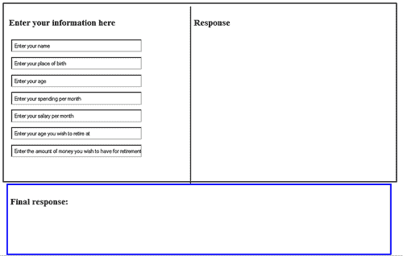
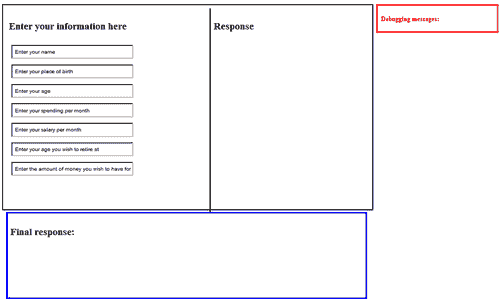
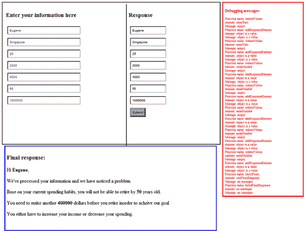

# 第二章：JavaScript 中的随兴测试和调试

> 在本章中，我们将正式进入测试我们实际创建的 JavaScript 程序。但在我开始之前，我想向你简要介绍一下你可以期待在本章中看到的内容。在本章中，你将学习到两个主要概念，第一个概念是不同的浏览器如何影响 JavaScript 测试，第二个主要概念是你如何通过使用 alert()来测试你的 JavaScript 程序。你还将学习如何访问表单上的值，操作这些值，并最终以有意义的方式输出这些值。

你还将看到前一章中介绍的许多技术被广泛使用。

更具体地说，我们将学习以下主题：

+   随兴测试的目的

+   当浏览器遇到 JavaScript 错误时会发生什么

+   浏览器差异及需要在多个浏览器中测试的需求

+   常见的浏览器消息及其含义

+   如何找出你的代码是否得到了正确的输出，以及是否在代码中把正确的值放在了正确的位置

+   如何访问表单上的值以及如何访问网页的其他部分

+   当你的 JavaScript 程序没有给你期望的结果时该怎么办的技巧

+   脚本如果不运行该怎么办

+   如何进行视觉检查

+   如何使用`alert()`测试你的 JavaScript 程序

+   为了简化测试，注释掉代码的某些部分

+   为什么随兴测试并不总是足够

所以在进入本章的主要内容之前，我会简要提到在继续本章其余内容之前你应该理解的两个基本概念。

# 随兴测试的目的——让脚本运行

第一个基本概念涉及随兴测试的目的。随兴测试的主要目的是快速让你的代码运行起来，然后看看你的代码是否有任何错误。如前所述，JavaScript 的三种不同错误类型包括加载、运行时和逻辑错误。

随兴测试的主要优点是它允许你测试你的 JavaScript 程序，而不会让你感到困惑。它适用于那些想要节省时间的人，尤其是测试小段代码时。

# 当浏览器遇到 JavaScript 错误时会发生什么

现在是第二个基本概念的时候了。在前一章中，我已经简要描述了一个网页是如何被加载到浏览器中，然后在网页浏览器中渲染，等待与用户交互。我还提到，通常来说，JavaScript 是默默失败的；它不会明确告诉你或显示发生了什么错误（如果有的话）。这是因为你的浏览器没有开启任何形式的调试。

然而，现代网络浏览器具有内置的方式，让浏览器告诉用户网页上发生了某种错误。当你明确打开或安装网络浏览器的调试工具时，就会发生这种情况。对于某些浏览器，您还需要明确打开错误控制台，才能找出发生了什么错误。

如果您想知道如何利用这些内置功能，以下是一些简单的指导说明，帮助您开始使用：

1.  对于 Firefox——打开你的网络浏览器，前往**工具**。点击**错误控制台**。

1.  对于 Internet Explorer——你需要前往**工具 | 互联网选项 | 高级**。滚动到底部**浏览**，并检查**显示关于每个脚本错误的通知**。

现在你已经理解了为什么我们要进行临时测试的基本概念。接下来，我们将进入一个更复杂的话题——浏览器差异如何影响你的 JavaScript 程序。

# 浏览器差异及在多个浏览器中进行测试的需要

一般来说，浏览器具有不同的功能。对我们来说最重要的区别，至少在这本书中，是不同浏览器使用的 JavaScript 引擎。不同的 JavaScript 引擎以不同的方式处理 JavaScript。这对我们有很大的影响。一个网络浏览器支持的某些 JavaScript 函数或方法可能在另一个浏览器上不受支持。

JavaScript 的主要本质是它通过 DOM 操作提供网页的行为；不同的浏览器对 DOM 的支持有不同的级别。

我们不会尝试深入讨论各种浏览器支持和不支持的内容。相反，我们会指向这个网站：[`www.quirksmode.org/compatibility.html`](http://www.quirksmode.org/compatibility.html)。

这个链接提供了不同选择器下各种网络浏览器不兼容性的总结。对于我们这里的目的，我们应该更关注 DOM 选择器，因为我们关心的是 JavaScript。可以随意浏览该网站以获取详细信息。但现在，你需要理解的主要观点是，浏览器差异导致了不兼容性，因此我们需要测试浏览器兼容性。

大多数初学者 JavaScript 程序员经常会想知道他们如何可以找出访问者使用的浏览器。毕竟，如果你能找出你的访问者使用什么浏览器，你就能创建出兼容的 JavaScript 代码。这在很大程度上是正确的；所以现在我们首先要学习如何检查访问者的浏览器。

# 是时候行动了——检查功能和嗅探浏览器

在本节中，我们想向您介绍 navigator 对象。navigator 对象是一个内置对象，为您提供有关访问者浏览器的信息。我们试图做的是向您展示 navigator 对象是如何工作的，以及您可以如何根据浏览器信息进行编程决策。

### 注意

此示例的源代码可以在源代码文件夹`第二章`中找到，文件名为`browser-testing-sample-1.html`和`browser-testing-sample-2.html`。

1.  如果您还没有这样做，请启动您的文本编辑器，然后在您的文本编辑器中输入以下代码：

    ```js
    <html>
    <head><title>Testing for Browser - Example 1</title></head>
    <body>
    <script type="text/javascript">// Sample 1
    var browserType ="Your Browser Information Is As Follows:\n";
    for( var propertyName in navigator){
    browserType += propertyName + ": " + navigator[propertyName] + "\n";
    }
    alert(browserType);
    </script>
    </body>
    </html>

    ```

    下面是之前代码中发生的事情：我们定义了一个变量`browserType`。之后我们使用了一个`for`循环并定义了另一个变量`propertyName`。

1.  所说的`for( var propertyName in navigator )`意味着我们正在尝试获取`navigator`对象中的所有属性。

1.  这样做之后，我们将`propertyName`和信息添加到`browserType`变量中。最后，我们在一个警告框中输出这些信息。

1.  现在，将文件加载到您的网页浏览器中，您应该会看到一个包含有关您网页浏览器信息的弹出窗口。

    注意，警告框包含了有关您网页浏览器各种类型的信息。您还可以访问浏览器的特定属性以供您自己使用。我们接下来要做的就是这件事。

    您已经学会了如何使用 navigator 对象，现在该看看我们如何利用这些信息来执行编程决策了：

1.  创建另一个新文档，并在其中输入以下代码：

    ```js
    <html>
    <head><title>Testing for Browser - Example 2</title></head>
    <body>
    <script type="text/javascript">// Sample 2
    var typeOfBrowser = navigator.appName;
    document.write(typeOfBrowser);
    if(typeOfBrowser == "Netscape"){
    alert("do code for Netscape browsers");
    }
    else{
    alert("do something else");
    }
    </script>
    </body>
    </html>

    ```

在上一个示例代码中，我们已经定义了变量`typeOfBrowser`，用于决定执行哪个操作。一个简单的方法是使用`if else`语句根据浏览器名称选择执行的代码。

## 刚才发生了什么？

在前面的示例中，您已经看到了如何使用 navigator 对象执行“浏览器嗅探”，并根据给定信息执行适当的操作。

除了使用 navigator 对象，您还可以基于浏览器的能力测试浏览器之间的差异。这意味着您可以测试用户浏览器是否具有某些功能。这种技术也被称为功能测试。现在，我们将简要看看您如何执行功能测试。

## 通过功能测试测试浏览器差异

功能测试是应对浏览器不兼容的重要且强大的方法。例如，您可能想使用某个可能在不同浏览器上不受支持的函数。您可以包含一个测试，以查看此功能是否受支持。然后，根据这些信息，您可以为您的访问者执行适当的代码。

# 行动时间——针对不同浏览器的功能测试

在本节中，我们将简要介绍一个简单易用的方法，可以帮助你快速测试某个特性。我们要使用的方法是`.hasFeature()`方法。现在，让我们深入了解并看看它在实际中的应用。

### 注意

这个示例的源代码可以在`source code`文件夹中的`第二章`找到，文件名为`browser-testing-by-feature-2.html`和`browser-testing-by-feature.html`。

1.  启动你的文本编辑器，然后在文本编辑器中输入以下代码：

    ```js
    <html>
    <head><title>Testing browser capabilities using .hasFeature()</title></head>
    <body>
    <script type="javascript/text">
    var hasCore = document.implementation.hasFeature("Core","2.0");
    document.write("Availability of Core is "+ hasCore + "<br>");
    var hasHTML = document.implementation.hasFeature("HTML","2.0");
    document.write("Availability of HTML is "+ hasHTML + "<br>");
    var hasXML = document.implementation.hasFeature("XML","2.0");
    document.write("Availability of XML is "+ hasXML + "<br>");
    var hasStyleSheets = document.implementation.hasFeature("StyleSheets","2.0");
    document.write("Availability of StyleSheets is "+ hasStyleSheets + "<br>" );
    var hasCSS = document.implementation.hasFeature("CSS","2.0");
    document.write("Availability of CSS is "+ hasCSS + "<br>" );
    var hasCSS2 = document.implementation.hasFeature("CSS2","2.0");
    document.write("Availability of CSS2 is "+ hasCSS2 + "<br>");
    </script>
    </body>
    </html>

    ```

    为了使事情更清晰，我为每个特性和版本号定义了变量。一般来说，`.hasFeature()`的使用如下所示：

    ```js
    .hasFeature(feature, version);
    // feature refers to the name of the feature to test in string
    // version refers to the DOM version to test

    ```

1.  现在将文件加载到你的网页浏览器中，你应该会看到屏幕上动态创建各种类型的文本。

    同样，你可以使用从用户浏览器中得到的信息以与之前示例中看到的方式类似地执行各种决策。

    因此，为了简化和解释的目的，这里是你可以如何使用`.hasFeature()`进行程序决策的示例。

1.  创建另一个新文档，并将以下代码输入其中：

    ```js
    <html>
    <head><title>Testing browser capabilities using .hasFeature() - Example 2</title></head>
    <body>
    <script type="text/javascript">
    var hasCore = document.implementation.hasFeature("Core","2.0");
    if(hasCore){
    document.write("Core is supported, perform code based on the feature<br>");
    }
    else{
    document.write("Feature is not supported, do alternative code to enable your program<br>");
    }
    </script>
    </body>
    </html>

    ```

上面的示例代码是自解释的，因为它与`browser-testing-sample-2.html`中的示例类似。

## 刚才发生了什么？

之前的示例是你测试浏览器差异可以做到的事情的一个简单扩展。它与第一个示例类似，后者明确“嗅探”浏览器信息，而使用`.hasFeature()`的方法是基于功能能力的。

测试浏览器差异没有对错之分。然而，一个普遍的做法是使用`.hasFeature()`来测试程序功能。也就是说，我们经常使用`.hasFeature()`以确保我们的 JavaScript 功能在不同浏览器中可用。

之前的示例展示了你可以通过`.hasFeature()`测试的一些特性。以下是使用`.hasFeature()`可以测试的其他特性列表：

+   事件

+   用户界面事件

+   鼠标事件

+   网页事件

+   变异事件

+   范围

+   遍历

+   视图

既然你已经对如何测试浏览器差异有了一些了解，是时候讨论下一个话题了——得到输出并将值放在正确的地方。

# 你得到正确的输出并将值放在正确的地方了吗？

在本节中，我们将学习如何确保我们得到输出并将正确的值放在正确的地方。这意味着我们需要了解如何使用 JavaScript 与 HTML 表单配合。

## 访问表单中的值

一般来说，“获取”值通常意味着用户会在 HTML 文档中输入一些值到表单中，然后我们的程序从网络表单中“获取”输入。此外，这些值可能被其他函数处理，也可能不被处理；初始用户输入可能作为参数传递给其他函数，然后被处理。

这可以通过使用 JavaScript 的内置工具来实现；JavaScript 为您提供了几种访问表单值的方式，这样您就可以稍后使用这些值。通常，JavaScript 会在**"获取"表单的** `onsubmit` 事件中。

# 行动时间——从表单中获取值

在以下示例中，我们将从简单的 HTML 表单开始。你将学习到访问不同表单元素的各种技术。这里发生的是，我们首先通过使用`onsubmit`事件提交表单。`onsubmit`事件允许我们将表单通过一个 JavaScript 函数发送出去，该函数帮助我们从各种表单元素类型中提取值。所以在这个示例中，我需要你放松并理解前面提到的技术。

### 注意

本例的源代码可在`source code`文件夹的`Chapter 2`中找到，文件名为`accessing-values-from-form.html`。

1.  再次，将以下代码输入到您在新建文档中最喜欢的编辑器中：

    ```js
    <html>
    <head><title>Getting Values from a HTML form</title>
    <script type="text/javascript">/*
    In this example, we'll access form values using
    the following syntax:
    document.NameOfForm.NameOfElement
    where:
    NameOfForm is the name of corresponding form
    NameOfElement is the name of the element ( within the corresponding form)
    */
    function checkValues(){
    var userInput = document.testingForm.enterText.value;
    alert(userInput);
    var userInputTextArea = document.testingForm.enterTextArea.value;
    alert(userInputTextArea);
    var userCheckBox = document.testingForm.clickCheckBox.value;
    // this is for checkbox
    if(document.testingForm.clickCheckBox.checked){
    userCheckBox = true;
    }
    else{
    userCheckBox = false;
    }
    alert(userCheckBox);
    var userSelectBox = document.testingForm.userSelectBox.value;
    alert(userSelectBox);
    // here's another way you can "loop" through your form elements
    alert(document.testingForm.radioType.length);
    for(var counter = 0; counter<document.testingForm.radioType.length;counter++){
    if(document.testingForm.radioType[counter].checked){
    var userRadioButton = document.testingForm.radioType[counter].value;
    alert(userRadioButton);
    }
    }
    }
    </script>
    </head>
    <body>
    <h1>A simple form showing how values are accessed by JavaScript</h1>
    <form name="testingForm" onsubmit="return checkValues()">
    <p>Enter something in text field:<input type="text" name="enterText" /></p>
    <p>Enter something in textarea:<textarea rows="2" cols="20" name="enterTextArea"></textarea></p>
    <p>Check on the checkbox:<input type="checkbox" name="clickCheckBox" /></p>
    <p>Select an option:
    <select name="userSelectBox">
    <option value="EMPTY">--NIL--</option>
    <option value="option1">option1</option>
    <option value="option2">option2</option>
    <option value="option3">option3</option>
    <option value="option4">option4</option>
    </select>
    </p>
    <p>Select a radio buttons:<br />
    <input type="radio" name="radioType" value="python" /> Python
    <br />
    <input type="radio" name="radioType" value="javascript" /> JavaScript
    <br />
    <input type="radio" name="radioType" value="java" /> Java
    <br />
    <input type="radio" name="radioType" value="php" /> PHP
    <br />
    <input type="radio" name="radioType" value="actionscript" /> ActionScript 3.0
    </p>
    <input type="submit" value="Submit form" />
    </form>
    </body>
    </html>

    ```

    你应该注意到有各种输入类型，比如`text`、`textarea`、`checkbox`、`select`和`radio`。

1.  保存表单，然后将其加载到网页浏览器中。你应该在屏幕上看到一个简单的 HTML 表单。

1.  继续输入字段的值，然后点击**提交表单**。你应该看到一系列的警告窗口，重复你输入的值。

## 刚才发生了什么？

在之前提到的简单示例中，你通过一个 JavaScript 事件`onsubmit`提交了一个表单。`onsubmit`事件调用了一个名为`checkValues()`的 JavaScript 函数，该函数帮助我们访问不同表单元素中的值。

通常，访问表单元素的语法如下：

```js
document.formName.elementName.value 

```

其中`formName`是指表单的名称，`elementName`指的是元素的名称。

正如**之前的示例中，表单名是** `testingForm`，正如在`<form name="testingForm" onsubmit="return checkValues()">`中所看到的，输入文本元素的名字是`enterText`，正如在`<input type="text" name="enterText" />`中所看到的。因此，基于这段代码片段，我们将通过以下方式访问表单值：

`document.testingForm.enterText.value`

我们可以将这个值赋给一个可以稍后保存的变量，如代码示例所示。

之前的示例应该很容易理解。但在这个简短的示例中，我还介绍了一些其他有用的方法。考虑以下代码片段，它可以在示例中找到：

```js
for(var counter = 0; counter<document.testingForm.radioType.length;counter++){ 
if(document.testingForm.radioType[counter].checked){
var userRadioButton = document.testingForm.radioType[counter].value;
alert(userRadioButton);
}
}

```

请注意，在突出显示的行中，我使用了`length`属性；`document.testingForm.radioType.length`意味着我在名为`testingForm`的表单中计算了名为`radioType`的元素的数量。这个属性返回一个整数，然后可以在这个整数上使用循环，如之前代码片段中的`for`循环。然后你可以遍历表单元素，并使用前面提到的方法检查它们的值。

另一个**重要的技术可以在下面的代码片段中找到**：

```js
if(document.testingForm.clickCheckBox.checked){ 
userCheckBox = true;
}

```

突出显示的行中**发生的事情是**`document.testingForm.clickCheckBox.checked`返回一个`true`或`false`。你可以使用这个技术来检查你引用的表单元素是否有输入。然后你可以利用这个信息来执行决策。

### 访问表单值的另一种技术

正如你可能已经注意到的，我们通过使用`name`属性来访问表单元素。我们很可能会（很可能）使用`name`属性来访问表单元素，因为它更容易引用这些元素。但无论如何，这里有一个你可以快速查看的替代方法：

而不是写

```js
document.formName.elementName.value 

```

你可以写这个：

```js
document.forms[integer].elementName.value 

```

这里你正在使用`forms`对象，`elementName`指的是输入的名称。

上述代码样例的一个例子可能是：

`document.forms[0].enterText.value`

注意`forms`对象后面跟了`[0]`。这意味着`forms`对象被当作数组一样处理；`forms[0]`指的是网页上的第一个表单，依此类推。

既然你已经理解了访问表单值的基础知识，你在下一节将学习如何确保你在正确的地方获取正确的值。

## 访问网页的其他部分

在本节中，你将学习如何访问网页的其他部分。通常，你已经学习了通过使用`getElementById`、`getElementsByTag`和`getElementsByTagName`来访问网页不同部分的构建块。现在你将进一步使用这些方法，以及新学到的从表单中访问值的技术。

# 行动时间—在正确的地方获取正确的值

在这个例子中，你将看到到目前为止你所学习技术的综合应用。你将学习如何访问表单值、操纵它们、对它们执行操作，最后，把新的输出放置在网页的其他部分。为了帮助你更好地可视化我要描述的内容，以下是完成例子的截图：



接下来要使用的例子**是一个简单的 JavaScript 程序，用于检查你是否能在你想要退休的年龄退休。它会要求你提供一些基本信息**。根据提供的信息，它将确定你能否在那个时间退休，**基于**你退休时想要拥有的**金额**。

你将构建一个表单（实际上有两个表单，泛泛而言），用户将被要求在第一个表单（在左边）输入基本信息，在输入每个字段所需的 information 后，将在字段右边动态出现另一个输入字段（在网页的**中间**），**如果输入正确**。

当你输入信息时，一个 JavaScript 事件将触发一个 JavaScript 函数来检查输入的正确性。如果输入正确，将在刚刚接受输入的字段右侧创建一个新的字段，并且左侧的字段将被禁用。

在左侧**字段正确填写后，你会注意到一个完整的表单正在页面中间**被填写。点击**提交**后，代码将进行计算，并根据你指定的年龄和你需要的金额，确定你是否可以退休。

这个示例的基本要求如下：

+   必须输入正确的值。例如，如果字段要求你输入你的年龄，该字段只能接受整数，不允许字符。

+   如果字段需要文本输入，例如你的名字，将不允许整数。

### 注意

这个示例的完整源代码可以在`第二章`的源代码文件夹中找到，文件名为`getting-values-in-right-places.html`。

那么现在，让我们开始这个示例：

1.  让我们先从构建这个示例的基本界面开始。所以，请将以下代码（HTML 和样式）输入到你的文本编辑器中。

    ```js
    <!DOCTYPE html PUBLIC "-//W3C//DTD XHTML 1.0 Transitional//EN" "http://www.w3.org/TR/xhtml1/DTD/xhtml1-transitional.dtd">
    <html >
    <head><title>Getting the right values</title>
    <style>
    input{
    padding:5px;
    margin:5px;
    font-size:10px;
    }
    .shown{
    display:none;
    }
    .response{
    padding:5px;
    margin:5px;
    width:inherit;
    color:red;
    font-size:16px;
    float:left;
    }
    #container{
    position:absolute;
    width:800px;
    padding:5px;
    border: 2px solid black;
    height:430px;
    }
    #left{
    height:inherit;
    width:370px;
    border-right:2px solid black;
    float:left;
    padding:5px;
    }
    #right{
    height:inherit;
    width:300px;
    float:left;
    padding:5px;
    }
    #bottom{
    float:left;
    bottom:5px;
    padding:5px;
    }
    #finalResponse{
    float:left;
    width:780px;
    height:250px;
    border:3px solid blue;
    padding:5px;
    }
    /* this is for debugging messages */
    #debugging{
    float:left;
    margin-left:820px;
    height:95%;
    width:350px;
    border:solid 3px red;
    padding:5px;
    color:red;
    font-size:10px;
    }
    </style>
    <script type=”javascript/text”>
    // some Javascript stuff in here
    var globalCounter = 0;
    </script>
    <body>
    <div id="container">
    <div id="left">
    <h3>Enter your information here</h3>
    <form name="testForm" >
    <input type="text" name="enterText" id="nameOfPerson" onblur="submitValues(this)" size="50" value="Enter your name"/><br>
    <input type="text" name="enterText" id="birth" onblur="submitValues(this)" size="50" value="Enter your place of birth"/><br>
    <input type="text" name="enterNumber" id="age" onblur="submitValues(this)" size="50" maxlength="2" value="Enter your age"/><br>
    <input type="text" name="enterNumber" id="spending" onblur="submitValues(this)" size="50" value="Enter your spending per month"/><br>
    <input type="text" name="enterNumber" id="salary" onblur="submitValues(this)" size="50" value="Enter your salary per month"/><br>
    <input type="text" name="enterNumber" id="retire" onblur="submitValues(this)" size="50" maxlength="3" value="Enter your age you wish to retire at" /><br>
    <input type="text" name="enterNumber" id="retirementMoney" onblur="submitValues(this)" size="50"
    value="Enter the amount of money you wish to have for retirement"/><br>
    </form>
    </div>
    <div id="right">
    <h3>Response</h3>
    <form name="testFormResponse" id="formSubmit" onsubmit="checkForm(this);return false">
    </form>
    </div>
    <div id="finalResponse"><h3>Final response: </h3></div>
    </div>
    </body>
    </html>

    ```

1.  你可能想保存这个文件并在浏览器中加载它，看看你是否得到了与之前看到的前屏幕截图相同的输出。

    请注意，在上面的 HTML 表单中，有一个 JavaScript 事件`onblur`。`onblur`是一个发生在一个元素失去焦点时的 JavaScript 事件。所以你应该看到所有输入元素都有一个`onblur`，它触发了`submitValues()`函数。

    你也应该注意到`submitValues()`有一个`this`作为参数。`this`是 JavaScript 中最强大的关键词之一，指的是它所指向的相应元素。一个例子是`<input type="text" name="enterText" id="nameOfPerson" onblur="submitValues(this)" size="50" value="Enter your name"/>`。在这段代码中，`submitValues(this)`将通过名称`enterText`提交 HTML 表单元素对象。

    现在，是时候进行 JavaScript 编程了。根据之前的解释，当发生 JavaScript 事件`onblur`时，它将提交 HTML 表单元素对象到`submitValues()`函数。因此，我们首先从这个函数开始。

1.  现在，请将以下代码插入`<script type="javascript/text">`标签之间：

    ```js
    function submitValues(elementObj){
    // using regular expressions here to check for digits
    var digits = /^\d+$/.test(elementObj.value);
    // using regular expressions
    // here to check for characters which
    // includes spaces as well
    var letters = /^[a-zA-Z\s]*$/.test(elementObj.value);
    // check to see if the input is empty
    if(elementObj.value==""){
    alert("input is empty");
    return false;
    }
    // input is not relevant; we need a digit for input elements with name "enterNumber"
    else if(elementObj.name == "enterNumber" && digits == false){
    alert("the input must be a digit!");
    return false;
    }
    // input is not relevant; we need a digit for input elements with name "enterNumber"
    else if(elementObj.name == "enterText" && letters == false){
    alert("the input must be characters only!");
    return false;
    }
    // theinput seems to have no problem, so we'll process the input
    else{
    elementObj.disabled = true;
    addResponseElement(elementObj.value,elementObj.id);
    return true;
    }
    }

    ```

    我对代码正在做什么进行了注释，但我将重点介绍之前函数中使用的一些技术。

    我们在这里要做的就是检查输入的正确性。对于这个示例，我们只接受纯数字或纯字符（包括空格）。以下代码片段就是这样做：

    ```js
    var digits = /^\d+$/.test(elementObj.value);
    var characters = /^[a-zA-Z\s]*$/.test(elementObj.value);

    ```

    在这里，我们利用正则表达式来检查输入的正确性。`/^\d+$/`和`/^[a-zA-Z\s]*$/`都是正则表达式，它们都附加上`test`方法。`test`方法测试 HTML 表单对象的值。例如，如果`var digits = /^\d+$/.test(elementObj.value)`的确是数字，它将返回`true`，否则返回`false`。同样，`var characters = /^[a-zA-Z\s]*$/.test(elementObj.value)`如果是字符（包括空格）将返回`true`，否则返回`false`。

    如果您想了解更多关于使用正则表达式的信息，可以参考[`www.w3schools.com/jsref/jsref_obj_regexp.asp`](http://www.w3schools.com/jsref/jsref_obj_regexp.asp)并了解其工作原理。

    这些信息将在`if-else`语句的决策过程中使用。`if-else`语句检查 HTML 对象的名称；`enterNumber`期望一个整数输入。如果不是`enterNumber`，它期望一个字符输入。

    您应该注意到，如果输入没有问题，我们将禁用输入元素，并将 HTML 表单对象的`value`和`id`传递给一个函数`addResponseElement()`，之后我们将`return true`，表示代码成功执行并提交了表单值。

    现在，我们将进入`addResponseElement()`函数：

1.  继续当前文档，在`submitValues()`函数下方添加以下代码：

    ```js
    function addResponseElement(messageValue, idName){
    globalCounter++;
    var totalInputElements = document.testForm.length;
    var container = document.getElementById('formSubmit');
    container.innerHTML += "<input type=\"text\" value=\"" +messageValue+ "\"name=\""+idName+"\" /><br>";
    if(globalCounter == totalInputElements){
    container.innerHTML += "<input type=\"submit\" value=\"Submit\" />";
    }
    }

    ```

    `addResponseElement()`所做的就是尝试动态地将输入元素添加到表单的原始输入表单右侧。在这里，您应该发现`var container = document.getElementById('formSubmit')`很熟悉。它寻找一个 ID 为 formSubmit 的 HTML 元素。之后，我们通过`innerHTML`方法向这个表单添加 HTML。`container.innerHTML += "<input type=\"text\" value=\"" +messageValue+ "\"name=\""+idName+"\" /><br>";`尝试将输入添加到`<form>`标签之间。

    您还应该注意到`var totalInputElements = document.testForm.length`;。这段代码通过使用`length`属性确定`testForm`中的输入元素总数。我们利用这个信息来确定是否处于表单的最后一个输入字段，以便在另一个表单上添加一个提交按钮。

    接下来，我们将创建一个函数，它在第二个名为`testFormResponse`的表单提交后调用。

1.  继续在**当前文档中，在** `addResponseElement()`函数下方添加以下代码：

    ```js
    function checkForm(formObj){
    var totalInputElements = document.testFormResponse.length;
    var nameOfPerson = document.testFormResponse.nameOfPerson.value;
    var birth = document.testFormResponse.birth.value;
    var age = document.testFormResponse.age.value;
    var spending = document.testFormResponse.spending.value;
    var salary = document.testFormResponse.salary.value;
    var retire = document.testFormResponse.retire.value;
    var retirementMoney = document.testFormResponse.retirementMoney.value;
    var confirmedSavingsByRetirement;
    var ageDifference = retire - age; // how much more time can the user have to prepare for retirement
    var salaryPerYear = salary * 12; // salary per year
    var spendingPerYear = spending * 12; // salary per year
    // income per year, can be negative
    // if negative means cannot retire
    // need to either increase spending
    // or decrease spending
    var incomeDifference = salaryPerYear - spendingPerYear;
    if(incomeDifference <= 0){
    buildFinalResponse(nameOfPerson,-1,-1,-1,incomeDifference);
    return true;
    }
    else{
    // income is positive, and there is chance of retirement
    confirmedSavingsByRetirement = incomeDifference * ageDifference;
    if(confirmedSavingsByRetirement <= retirementMoney){
    var shortChange = retirementMoney - confirmedSavingsByRetirement;
    var yearsNeeded = shortChange/12;
    buildFinalResponse(nameOfPerson,false,yearsNeeded,retire, shortChange);
    return true;
    }
    else{
    var excessMoney = confirmedSavingsByRetirement - retirementMoney;
    buildFinalResponse(name,true,-1,retire,excessMoney);
    return true;
    }
    }
    }

    ```

    这个函数中发生的事情相当直接。各种表单值被分配给各种变量。然后我们开始进行一些简单的计算，以查看用户是否有足够的钱退休。您可以通过查看函数中的注释来了解计算的逻辑。

    通常，我们会调用函数`buildFinalResponse()`，无论用户能否按时退休，以及是否有足够的钱。所以这是`buildFinalResponse()`。

    继续当前文档，在`checkForm ()`函数下方添加以下代码：

    ```js
    function buildFinalResponse(name,retiring,yearsNeeded,retire, shortChange){
    var element = document.getElementById("finalResponse");
    if(retiring == false){
    element.innerHTML += "<p>Hi <b>" + name + "</b>,<p>";
    element.innerHTML += "<p>We've processed your information and we have noticed a problem.<p>";
    element.innerHTML += "<p>Base on your current spending habits, you will not be able to retire by <b>" + retire + " </b> years old.</p>";
    element.innerHTML += "<p>You need to make another <b>" + shortChange + "</b> dollars before you retire inorder to acheive our goal</p>";
    element.innerHTML += "<p>You either have to increase your income or decrease your spending.<p>";
    }
    /*
    else if(retiring == -1){
    element.innerHTML += "<p>Hi <b>" + name + "</b>,<p>";
    element.innerHTML += "<p>We've processed your information and we have noticed HUGE problem.<p>";
    element.innerHTML += "<p>Base on your current spending habits, you will not be able to retire by <b>" + retire + " </b> years old.</p>";
    element.innerHTML += "<p>This is because you spend more money than you make. You spend <b>" + shortChange + "</b> in excess of what you make</p>";
    element.innerHTML += "<p>You either have to increase your income or decrease your spending.<p>";
    }
    */
    else{
    // able to retire but....
    element.innerHTML += "<p>Hi <b>" + name + "</b>,<p>";
    element.innerHTML += "<p>We've processed your information and are pleased to announce that you will be able to retire on time.<p>";
    element.innerHTML += "<p>Base on your current spending habits, you will be able to retire by <b>" + retire + "</b> years old.</p>";
    element.innerHTML += "<p>Also, you'll have ' <b>" + shortChange + "</b> amount of excess cash when you retire.</p>";
    element.innerHTML += "<p>Congrats!<p>";
    }
    }

    ```

函数`buildFinalResponse()`与`addResponseElement()`函数类似。**它只是寻找所需的 HTML 元素，并将所需的** HTML 添加到该元素中。

在这里，**你可以清楚地看到在这本书中学到的 JavaScript 函数、方法和技巧**。

保存文件。**你可以尝试玩弄这个例子，看看它对你来说是如何工作的**。

## 刚才发生了什么？

在前一个例子中，你看到了如何访问表单的值，对输入进行操作，然后将输出放置在网页的不同部分。你可能会注意到我们广泛使用了`getElementById`。我们还使用了`form`对象和`value`方法来访问表单中各个元素的值。然后，通过使用`getElementById`，我们寻找所需的 HTML 元素，并将输出添加到 HTML 元素中。

但是，在这个时候，你可能会想知道如果你在程序中犯错误，你应该做什么。这就是我们下一节将重点关注的内容。

# 脚本给出了预期的结果吗？

我的观点是，在我们开始任何有意义的讨论之前，我们必须理解“**预期结果**”的含义。

“预期结果（s）”**可以有几种含义，至少对于这本书的目的来说是这样。例如，如前所述，每个输入的输出都应该是正确的；这里指的是最终的输出。还有一种输出，它以“**视觉输出**”的形式出现。例如，对于每个用户交互或事件，我们的网络应用程序通常会提供一种视觉提示，让用户知道正在发生的事情。在这种情况下，我们的视觉提示按照我们的意图行事，将被认为是“**预期结果**”。

一个简单的提示，为了检查脚本是否给你预期的结果，就是使用简单的输入并进行自己的计算。确保你的计算是正确的，并测试你的程序。

在本章的后半部分，我们将详细讨论两种相关技术。但首先，让我们看看如果我们的脚本没有运行，我们可以采取哪些行动。

# 脚本不运行时怎么办

如果脚本运行不了，很可能是因为加载或运行时出现了错误，这取决于你的程序是如何编写的。例如，在你刚刚创建的前一个程序中，如果你在输入第一个输入字段后没有回应，并且焦点不再在第一个输入字段上，那么你就知道程序没有在运行。

在这个例子中，有几种可能性（这些都归结于前面章节中提到的 JavaScript 错误的三个基本形式）。首先，可能在 JavaScript 事件的输入字段中存在语法错误，或者在由 JavaScript 事件调用的函数中存在严重的错误。如果不是，可能是逻辑错误。

无论错误可能是什么，通常很难猜测错误是什么以及在哪里。因此，如果您的代码没有运行，我将介绍三种重要的测试代码的技术。

## visually inspecting the code（视觉检查代码）

视觉检查代码意味着你将扮演一个人类编译器，并 visually check for errors in your code（视觉检查代码中的错误）。我的看法是，对于视觉检查有一些预设条件和小贴士：

+   必须有良好的代码块结构。这意味着代码应该适当地隔开并缩进，以提高视觉清晰度。一眼看上去，你应该能够看出哪段代码嵌套在哪个`if-else`语句下，或者它属于哪个函数。

+   你使用的代码编辑器有很大的不同。一个常见的错误是括号或反引号的不匹配。因此，一个允许高亮显示匹配括号的代码编辑器将帮助你发现这类错误。

+   检查每个语句(statement)后面的分号。

+   检查变量是否已初始化。如果变量在程序的后部分使用但未初始化，将会造成严重的错误。

之前的操作是我如果脚本没有运行或者没有按照我预期的运行方式来运行时会做的一些事情。然而，尽管我们有意愿，但对代码的视觉检查只能对小于 30 到 50 行代码的小程序有用。如果程序再大一些，或者如果它们包含在事件中调用的各种函数，使用 `alert` 函数来检查我们的代码可能更好（也更有效率）。

## 使用 alert[] 来查看正在运行的代码

`alert` 方法可以用来检查正在运行的代码是否被适当地使用。我们还没有正式介绍 alert 方法。但是以防万一，您可以在 JavaScript 程序中的几乎任何地方使用 alert 函数来创建弹出窗口。语法如下：

`alert(message)`

其中 `message` 可以接受几乎任意数量的值（或者如果它已经被定义或初始化，可以是变量）。由于 `alert` 方法的灵活性，它也可以用来显示值、字符串和对象类型。

使用 `alert` 的问题源于在代码中放置 `alert` 的位置。这将在下一个动手示例中展示。

## 使用 alert() 来查看正在使用哪些值

正如前面提到的，`alert` 方法可以用来显示几乎任何类型的值。因此，常见的用法是将一个变量传递给 `alert` 方法，看看值是否是我们需要的或预期的。

同样，我们需要知道在哪里应用`alert`方法，以确保我们的代码检查是正确的。

在这一点上，示例将是查看我们如何使用`alert`方法检查代码错误的最合适方式。那么，让我们来看看这个是如何工作的。

# 行动时间——使用 alert 检查你的代码

这个示例与你之前所做的类似。在这个示例中，你需要将`alert`插入到适当的位置，以检查哪部分代码正在运行。在某些情况下，你需要向`alert`方法传递值，并看看这个值是否是你想要的。

坦白说，告诉你一步一步应该放置`alert`方法会很繁琐，尤其是因为本例中大部分代码与上一个类似。然而，为了让你更容易跟随，我们将从整个程序开始，然后向你解释`alert`方法的位置和传递给`alert`方法的价值背后的原因。

### 注意

以下示例的源代码可以在源代码文件夹的`第二章`中找到，文件名为`getting-values-in-right-places-using-alert.html`。

1.  这个示例与上一个类似，不同之处在于 JavaScript 代码略有改动。用以下代码替换上一个示例中的 JavaScript 代码：

    ```js
    var globalCounter = 0;
    function submitValues(elementObj){
    alert("submitValues");
    alert(elementObj.name);
    var totalInputElements = document.testForm.length;
    alert("total elements: " + totalInputElements);
    var digits = /^\d+$/.test(elementObj.value);
    var characters = /^[a-zA-Z\s]*$/.test(elementObj.value);
    alert (characters);
    if(elementObj.value==""){
    alert("input is empty");
    return false;
    }
    else if(elementObj.name == "enterNumber" && digits == false){
    alert("the input must be a digit!");
    return false;
    }
    else if(elementObj.name == "enterText" && characters == false){
    alert("the input must be characters only!");
    return false;
    }
    else{
    alert("you've entered : " + elementObj.value);
    elementObj.disabled = true;
    alert(elementObj.value);
    addResponseElement(elementObj.value,elementObj.id);
    return true;
    }
    }
    function addResponseElement(messageValue, idName){
    alert("addResponseElement");
    globalCounter++;
    var totalInputElements = document.testForm.length;
    alert("totalInputElements");
    var container = document.getElementById('formSubmit');
    container.innerHTML += "<input type=\"text\" value=\"" +messageValue+ "\"name=\""+idName+"\" /><br>";
    if(globalCounter == totalInputElements){
    container.innerHTML += "<input type=\"submit\" value=\"Submit\" />";
    }
    }
    function checkForm(formObj){
    alert("checkForm");
    var totalInputElements = document.testFormResponse.length;
    alert(totalInputElements);
    var nameOfPerson = document.testFormResponse.nameOfPerson.value;
    alert(nameOfPerson);
    var birth = document.testFormResponse.birth.value;
    alert(birth);
    var age = document.testFormResponse.age.value;
    alert(age);
    var spending = document.testFormResponse.spending.value;
    alert(spending);
    var salary = document.testFormResponse.salary.value;
    alert(salary);
    var retire = document.testFormResponse.retire.value;
    alert(retire);
    var retirementMoney = document.testFormResponse.retirementMoney.value;
    alert(retirementMoney);
    var confirmedSavingsByRetirement;
    var ageDifference = retire - age; // how much more time can the user have to prepare for retirement
    alert(ageDifference);
    var salaryPerYear = salary * 12; // salary per year
    alert(salaryPerYear);
    var spendingPerYear = spending * 12; // salary per year
    alert(spendingPerYear);
    var incomeDifference = salaryPerYear - spendingPerYear;
    alert(incomeDifference);
    if(incomeDifference <= 0){
    buildFinalResponse(nameOfPerson,-1,-1,-1,incomeDifference);
    return true;
    }
    else{
    confirmedSavingsByRetirement = incomeDifference * ageDifference;
    if(confirmedSavingsByRetirement <= retirementMoney){
    var shortChange = retirementMoney - confirmedSavingsByRetirement;
    alert(shortChange);
    var yearsNeeded = shortChange/12;
    buildFinalResponse(nameOfPerson,false,yearsNeeded,retire, shortChange);
    return true;
    }
    else{
    var excessMoney = confirmedSavingsByRetirement - retirementMoney;
    alert(excessMoney);
    buildFinalResponse(name,true,-1,retire,excessMoney);
    return true;
    }
    }
    }
    function buildFinalResponse(name,retiring,yearsNeeded,retire, shortChange){
    alert("buildFinalResponse");
    var element = document.getElementById("finalResponse");
    if(retiring == false){
    alert("if retiring == false");
    element.innerHTML += "<p>Hi <b>" + name + "</b>,<p>";
    element.innerHTML += "<p>We've processed your information and we have noticed a problem.<p>";
    element.innerHTML += "<p>Base on your current spending habits, you will not be able to retire by <b>" + retire + " </b> years old.</p>";
    element.innerHTML += "<p>You need to make another <b>" + shortChange + "</b> dollars before you retire inorder to acheive our goal</p>";
    element.innerHTML += "<p>You either have to increase your income or decrease your spending.<p>";
    }
    else{
    // able to retire but....
    alert("retiring == true");
    element.innerHTML += "<p>Hi <b>" + name + "</b>,<p>";
    element.innerHTML += "<p>We've processed your information and are pleased to announce that you will be able to retire on time.<p>";
    element.innerHTML += "<p>Base on your current spending habits, you will be able to retire by <b>" + retire + "</b> years old.</p>";
    element.innerHTML += "<p>Also, you'll have <b>" + shortChange + "</b> amount of excess cash when you retire.</p>";
    element.innerHTML += "<p>Congrats!<p>";
    }
    }

    ```

1.  保存文档并在网页浏览器中加载它。玩转示例，看看警告框是如何通知你哪部分代码正在执行，以及输入了哪些值。

## 刚刚发生了什么？

如果你浏览了之前的示例，你会注意到`alert()`通常放在函数的开始处，以及在变量被初始化时。为了检查函数，我们通常会手动输入函数的名称，并将其作为参数传递给`alert`方法，以通知我们程序的互动过程中发生了什么。同样，我们将定义的变量（表单元素的值）作为参数传递给`alert`方法，以通知我们用户输入了哪些值。

因此，通过使用一个`alert()`方法，我们能够找出正在运行的代码和正在使用的值。然而，这个方法可能有些过于繁琐或令人沮丧，因为警告框会不断地在你的窗口上弹出。这里有一个简单的替代方法，用于检查正在运行的代码，以及检查输入元素。

## 检查代码正在运行以及使用哪些值的一种不那么侵扰性的方法

为了以一种不那么侵扰的方式测试我们的代码，我们会写一个简单的调试函数。这个调试函数应该打印出函数的名称和其他一些变量。为了简单起见，我们将展示一个简单的调试函数，它打印出函数的名称和正在使用的 HTML 元素。那么，让我们开始吧。

# 行动时间—检查值的使用是否突兀

如上所述，我们将演示一个非常简单的调试函数，帮助你识别正在运行的代码以及正在使用的 HTML 元素。在这里，你会对如何以一种不那么突兀的方式测试你的代码有一些基本了解。

再次，这个例子与上一个例子相似，但有一些重要的元素我们将添加到上一个例子中。本质上，我们将在其中添加一个函数、一些 HTML 和 CSS。

然而，你可能会发现回头参考上一个例子并给上一个例子添加新元素很繁琐。因此，建议你跟随这个例子。

### 注意

另外，你可以在源代码文件夹`第二章`中查看源代码，文件名为`getting-value-in-right-places-complete.html`。

所以，不再赘述，让我们马上开始：

1.  在`<style>`标签之间插入以下 CSS 代码：

    ```js
    /* this is for debugging messages */
    #debugging{
    float:left;
    margin-left:820px;
    height:95%;
    width:350px;
    border:solid 3px red;
    padding:5px;
    color:red;
    font-size:10px;
    }

    ```

1.  现在，对于将包含调试信息的 HTML 容器，请在`</body>`标签前输入以下代码片段：

    ```js
    <div id="debugging"><h3>Debugging messages: </h3></div>

    ```

    在这里发生的情况是，之前的 HTML 元素将被用来在调试信息与简单应用程序本身之间提供视觉分隔。现在保存文件，然后用网页浏览器打开它，你会看到一个类似于下一张截图中的示例：

    

1.  接下来，你需要将以下代码添加到你的 JavaScript 代码中：

    ```js
    function debuggingMessages(functionName, objectCalled, message){
    var elementName;
    if(objectCalled.name){
    elementName = objectCalled.name;
    }
    else if(objectCalled.id){
    elementName = objectCalled.id;
    }
    else{
    elementName = message;
    }
    var element = document.getElementById("debugging");
    element.innerHTML += "Function name :" +functionName+ "<br>element :" +elementName+"<br>";
    }

    ```

    前面提到的函数用于捕获当前使用的函数名称；这相当于当前正在使用什么代码，因为我们的程序是事件驱动的，函数通常是由用户触发的。

    这三个参数如下：

    +   `functionName`指的是当前使用的函数的 functionName。在下一步，你将看到动态获取这个值的方法。

    +   `objectCalled`指的是正在使用的 HTML 对象。

    +   `Message`指的是一个字符串。这可以是任何你想要的消息；它的目的是为你提供在屏幕上编写调试消息的灵活性。

        此外，我们使用了`.innerHTML`方法将消息追加到 ID 为"debugging"的 HTML`div`元素中。

1.  现在最后，是时候看看我们如何使用这个函数了。通常，我们按照以下方式使用函数：

    ```js
    debuggingMessages("name of function", elementObj,"empty");

    ```

    如果你查看源代码，你会看到前面提到的函数在程序中谨慎使用。考虑以下代码片段：

    ```js
    function submitValues(elementObj){
    //alert("submitValues");
    debuggingMessages("submitValues", elementObj,"empty"); 
    //alert(elementObj.name);
    var totalInputElements = document.testForm.length;
    //alert("total elements: " + totalInputElements);

    ```

    在前一个案例中，"`submitValues`"的值将被传递，因为`submitValues`是函数的名称。注意我们也把函数参数`elementObj`传递给`debuggingMessages()`，以便通知我们当前函数中使用了什么。

1.  最后，你可能想要在 JavaScript 程序中的每个函数中添加`debuggingMessages("function name", elementObj,"empty")`。如果你不确定应该在哪个地方使用这个函数，请参考给出的源代码。

    如果你自己正在输入函数，那么请注意你可能需要更改参数名称以适应每个函数。通常，`debuggingMessages()`可以替代`alert()`方法。所以，如果你不确定应该在哪个地方使用`debuggingMessages()`，你可以将`debuggingMessages()`用于前一个示例中用于检查代码的每个`alert()`。

1.  如果你已经执行了整个程序，你会看到类似于下一张截图的东西：

## 刚才发生了什么？

你刚刚创建了一个函数，它允许你以一种不那么侵扰的方式检查你的代码，这是通过利用 JavaScript 的一些内置方法实现的，包括`.innerHTML`方法。这里发生的事情是另一个例子，展示了你如何访问值、操纵它们，然后将这些值输出到所需的 HTML 元素，以使检查变得更不侵扰。

如果你查看源代码，你可能会注意到我在不同的情况下使用了不同的消息；如果你使用的话，这将为你的调试函数带来更多的灵活性。

# 注释掉脚本的一部分以简化测试

注释掉脚本的一部分是测试你的 JavaScript 代码的另一种重要且简单易用的权宜之计。本质上，你注释掉那些立即不会使用的代码。

因为我们还没有介绍如何进行多行注释，所以我借此机会向你展示如何使用它。语法如下：

```js
/*
This is a multiple line comment
*/

```

注释掉脚本的一部分可以用来简化测试的方法如下：我们通常会注释掉所有我们一开始不会使用的其他代码。例如，`getting-values-right-places-complete.html`中使用的第一个函数是`submitValues()`函数。

我们会在取消注释用于的第二个函数之前，确保`submitValues()`函数是正确的，这个第二个函数是`addResponseElement()`函数。

这个过程一直持续到所有函数都被取消注释，这意味着代码是正确的。

考虑到所有这些点，我们现在将转到基于前一个示例的简单练习。

# 行动时间——简化检查过程

在这个例子中，不会有源代码供你复制。相反，你可以使用在`getting-values-right-places-complete.html`中找到的前一个示例，并尝试以下步骤：

1.  滚动到源代码的 JavaScript 部分。注释掉所有除了`submitValues()`和`addResponseElement()`之外的函数。

1.  保存文件并加载到你的网页浏览器中。现在测试一下这个程序。

    您应该注意到，您的程序仍然可以运行，但是当所有输入字段都正确填写后，您将无法成功提交表单。

    这是因为您注释掉了`checkForm()`函数，这个函数对于第二次表单提交是必需的。

    这意味着什么？这意味着`submitValues()`和`addResponseElement()`函数运行正常，现在可以安全地进行下一步。

1.  现在，取消注释`checkForm()`、`buildFinalResponse()`和`debuggingMessages()`函数，保存文件并在浏览器中重新加载。继续测试您的程序，直到您提交表单。

    您应该注意到，在提交第二份表单之前，所有事情都进行得很顺利。这是因为您在上一个步骤中已经测试过，所以预料到了这种情况。

    现在，在您完成所有输入字段后，提交表单。因为您已经取消注释了`checkForm()`和`buildFinalResponse()`函数，现在提交表单后您应该期待有一个回应。

1.  最后，取消注释`debuggingMessages()`函数。保存文件并在浏览器中加载它

现在，同样地，像往常一样使用程序，您应该看到所有必要的功能都像以前一样正常工作。

## 刚才发生了什么？

您刚刚通过取消注释代码的不同部分，以一种有用的方法测试了您的代码。您可能注意到我们从第一个将要使用的函数开始，然后继续到下一个。这个过程将帮助我们找到包含错误的代码块。

这种技术也可以应用于代码语句。我们注释掉了函数中的代码，因为根据示例，这样更容易跟踪。

# 时机差异——确保在交互之前 HTML 已经准备好了

记住 JavaScript 的本质是通过操作 DOM 元素为网页提供行为吗？这是一个关键点——如果 HTML 在例如执行改变表单颜色的 JavaScript 函数时不可用，那么 JavaScript 函数将无法工作。

在这种情况下，问题不是由于 JavaScript 错误，比如逻辑、运行时和加载错误，而是由于时机问题。

如前章所述，网络浏览器（客户端）从服务器下载一个网页，通常是从上到下读取网页（文档）。因此，例如，如果您有一个大型的 HTML 文档（例如一个在主体中有大图像的 HTML 文档），您的 JavaScript 可能无法与 HTML DOM 交互，因为没有 HTML 可以与之交互。

有两条解决方法可以让我们解决这个问题：

1.  使用`<body>`标签的 JavaScript 事件`onload`。这可以按照以下方式进行：

    ```js
    <html>
    <head>
    <script>
    function aSimpleFunction()
    {
    alert(window.status);
    }
    </script>
    </head>
    <body onload="aSimpleFunction()">
    </body>
    </html>

    ```

    高亮的行意味着`aSimpleFunction()`仅在`<body>`标签中的内容加载完成后执行。您可以利用这个技术确保在执行您的 JavaScript 函数之前，您的 HTML 内容已经加载完成。

    这里有一个（可能是更受欢迎的方法）：

1.  将你的 JavaScript 函数放在`</body>`标签之前。

这个方法通常被使用；你可以看到提供分析服务的公司通常要求其用户在`</body>`标签之前放置跟踪代码（通常是 JavaScript，如 Google 分析）。这意味着 JavaScript 代码片段将在`<body>`标签中的所有内容加载完成后加载，确保 HTML DOM 将与 JavaScript 交互。

# 为什么临时测试永远不够

到目前为止，你可能已经注意到，为临时测试介绍的方法在应用到你的代码时可能会变得重复。例如，`alert`方法需要你手动在不同代码部分输入`alert`函数，包含不同的值，以便你检查代码。这可能会变得繁琐且低效，尤其是当程序开始变得更大时。简单地说，当程序变得太大时，它将无法扩展。同时，`alert`方法可能会相当显眼。因此，我们创建了一个简单的调试功能。

我们创建的简单调试功能较为不显眼；你可以与程序互动，并在屏幕上获得几乎即时的反馈。尽管它具有不太显眼的优点，但它有两个主要的缺点。第一个缺点是它可能既繁琐又低效，这与`alert`方法相似。第二个缺点是调试功能的优劣在很大程度上取决于 JavaScript 程序员的技能。然而，作为 JavaScript 的初学者，我们可能有没有创建健壮调试功能的技能。

因此，当需要时，还有其他更强大的工具可以帮助我们完成工作，我们将在后面的章节中讨论这些工具。

# 总结

在本章中，我们在前一章学到的基础知识上进行了构建，并扩展了我们可以使用本章介绍的各种技术进行临时测试的知识。

总的来说，我们将前一章和本章介绍的各种方法和技巧结合起来，以帮助我们进行临时测试。我们经常通过`getElementById`查找所需的元素，然后通过`form`对象访问表单值。我们还使用了`alert()`方法进行某种形式的临时测试。

具体来说，我们已经介绍了以下主题：

+   我们学习了如何使用`form`对象及其方法访问表单上的值，操纵值，并使用前一章学到的技术将值输出到网页的其他部分，例如`getElementById`。我们通过`.innerHTML`将 HTML 内容附加到特定的 HTML 元素上。

+   如果脚本没有提供预期的输出，我们可以采取的行动，即使用`alert()`方法测试脚本并注释掉代码。这引导我们进行临时测试。

+   执行临时性测试的各种技术，最值得注意的是，通过使用`alert()`方法。由于它明显的干扰性，我们创建了一个简单的调试函数，提供了一种不那么干扰的测试方式。

+   时间差异：我们必须始终确保 HTML DOM 在 JavaScript 可以与其交互之前是可用的。

+   由于可扩展性和效率问题，临时性测试永远不够。

既然我们已经理解并尝试了临时性测试，现在是时候学习一些关于 JavaScript 测试的更高级内容了。如前所述，尽管临时性测试快速简单，但它并不一定能带来更好的 JavaScript 代码（除了它其他缺点之外）。在下一章，我们将学习如何验证 JavaScript。尽管这个概念听起来简单，但你在实际编码和设计过程中，以及可以帮助你验证你的 JavaScript 程序的其他因素方面，你会学到更多关于 JavaScript 的概念。
