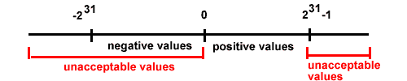
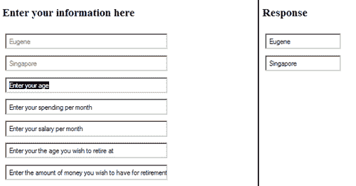
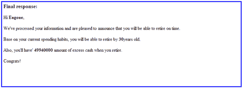
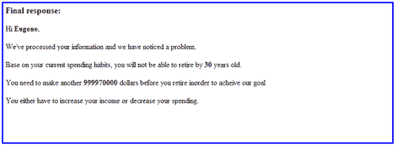

# 第四章：测试计划

> 欢迎来到第四章。在我们进入更正式的测试过程之前，我们首先必须了解测试是关于什么的。在本章中，我们将学习如何为你的 JavaScript 程序制定测试计划。我们将学习你应该知道的各种测试概念，之后我会向你提供一个简短的指南，它将作为下一章的基础。

在我们进入各种测试概念之前，我们首先需要建立对以下问题的简要理解：

+   我们真的需要一个测试计划来进行测试吗？

+   我们应该什么时候为我们的代码开发测试计划？

+   我们的程序需要多少测试？

在覆盖上述问题之后，我们将学习以下测试概念和想法：

+   黑盒测试、白盒测试及相关概念

+   边界条件

+   单元测试

+   网页功能测试

+   集成测试

+   非功能性测试，如性能测试

+   可用性测试

+   测试顺序——我们首先进行上述哪些测试？

+   回归测试——通常在我们更改代码时进行

为了更好地了解测试在何时何地发挥作用，我们首先从软件生命周期的非常简要介绍开始。

# 软件生命周期的非常简要介绍

了解软件生命周期将帮助你更深入地了解软件开发过程，更重要的是，了解测试将在何时何地进行。

一般来说，软件生命周期有以下阶段：

1.  分析

1.  设计

1.  实施

1.  测试

1.  部署

1.  维护

在第一阶段，我们通常进行分析以了解干系人的需求。例如，如果你为客户进行定制项目，你需要理解用户需求、系统需求和业务目标。一旦你理解了需求，你需要设计软件。这个阶段需要做的事情包括绘制数据流程图、设计数据库等。下一阶段是实施阶段。我们可以将此视为实际的编码过程。

接下来是测试，这是本书的主要关注点。在本章中，我们将学习如何根据各种测试概念来规划我们的测试。在测试阶段之后，我们将部署项目，最后我们维护项目。因为这是一个循环，理论上我们在维护阶段期间或之后会回到分析阶段。这是因为软件或程序是进化的；随着需求和需求的变化，我们的软件也在变化。

尽管术语和阶段可能与你在其他相关内容中看到的有稍许不同，但过程通常是一样的。这里的主要收获是，测试通常在实施之后进行。

## 敏捷方法

你可能听说过敏捷方法论，它包括敏捷软件开发方法论，当然还有敏捷测试方法。

一般来说，敏捷软件开发和测试方法通常是以最终用户或客户为目标进行的。通常文档很少，专注于短暂的软件开发周期，通常为一周到四周。

那么这和你们在上一部分读到的软件开发周期有什么关系呢？总的来说，测试不是一个独立的阶段，而是与开发过程紧密集成，从客户的角度进行代码测试，尽可能早，当代码足够稳定以进行测试时。

### 敏捷方法和软件周期在行动

可能你们很难想象之前的理论是如何应用的。为这本书创建示例代码的过程 closely mimics 软件生命周期和敏捷方法论。所以我打算非常简要地分享一下我根据我们学到的理论为这本书创建代码示例时的经历。

### 分析和设计

从技术角度来说，分析和设计阶段发生在我思考什么样的代码示例能够满足书籍目标的时候。我认为代码应该足够简单，便于理解，最重要的是能够展示 JavaScript 的各种特性。代码应该为后续章节的代码测试搭建好舞台。

### 实施和测试

实施阶段发生在我编写代码示例的时候。当我为代码片段创建函数时，我尽可能地进行测试，并问自己代码是否能够展示 JavaScript 的使用并便于后续的测试目的。

所以，这里发生的事情是我在尽可能多地进行测试时使用了一种敏捷测试方法。

### 部署

在商业世界中，代码的部署通常发生在代码传输给最终用户之后。然而，在我的情况下，部署涉及到将我的代码示例发送给编辑。

### 维护

维护阶段发生在我提交代码后，编辑发现并修复了 bug 的时候。尽管有意愿，但代码并不总是无懈可击的。

# 你需要一个测试计划才能进行测试吗？

你很可能会需要一个测试计划来执行测试。这是因为计划帮助你保持清晰的测试目标。它还帮助你确定你想对你的程序进行什么样的测试。

最重要的是，正如您将意识到的，为了进行彻底的测试，您将需要实施各种测试，包括基于白盒测试和黑盒测试的概念测试，网页测试，单元测试，集成测试等。测试计划还作为测试数据，错误，测试结果以及您程序可能的解决方案的记录。这意味着，为了确保不遗漏任何内容，最好有一个明确的计划，了解要测试什么，何时测试以及如何测试您的程序。

# 何时制定测试计划

理论上，如果您查看软件开发周期，您会发现测试是在实施之后进行的。测试计划在您完成程序的实际编码过程（实施）之后应该进行。这是因为只有在这个时候，您才确认了您有哪些功能，方法和模块；基于您已经完成的内容来规划要测试的内容是有商业意义的，因为您知道要关注什么。

然而，在实践中，建议在实施过程之前开始规划。根据您的具体情况，当然有可能您可以制定一个高级测试计划（HLTP）或高级测试用例（HLTC）。如果您正在开发一个大型复杂的系统，需要 HLTP 来解决整体需求。其他支持性测试计划用于解决系统的详细内容。高级测试用例（HLTC）与高级测试计划（HLTP） somewhat 相似，不同之处在于它覆盖了与系统整体需求直接相关的主要功能测试用例。

您应该注意的另一个要点是，在实践中，测试计划可以广泛地分为系统测试和用户验收测试。系统测试涵盖所有形式的的功能测试和非功能测试（您稍后了解），而用户验收测试是一个阶段，在这个阶段，测试是由最终用户在移交所有权之前进行的。

# 需要进行多少测试？

你可能急于确定需要测试什么以及不需要测试什么。关于需要进行多少测试有很多不同的观点，但我个人认为，您程序中列出的以下部分内容应该定义您的测试计划范围。

## 代码意图做什么？

首先，您需要了解代码的意图。例如，我们之前章节中代码的业务需求是为了根据用户的输入计算用户是否能够按时退休，这些输入包括他的当前年龄，他希望退休的年龄，他当前的支出，当前的薪水等等。因此，我们创建了满足业务需求的代码。一旦我们知道我们的代码意图做什么，我们就可以测试代码是否满足我们的业务需求。

## 测试代码是否满足我们的需求

通过测试代码以查看它是否满足我们的业务需求，我们的意思是对于每个输入，我们需要得到正确的输出。回到我们在第二章，*JavaScript 中的即兴测试和调试*和第三章，*语法验证*中提到的例子，如果剩余可支配收入总额小于用于退休的资金量，输出将应该是“无法退休”，至少在字面上是这样的。从测试角度来看，我们需要确保当提到的情况为真时，输出将是“无法退休”。

这可以通过一种称为白盒测试的概念来实现，其中测试是基于测试者知道代码内容的假设进行的。我将在接下来的章节中详细介绍白盒测试和其他测试概念。为了给你一个提示，你将遇到的一些测试概念包括单元测试，你以小单元测试代码，以及边界值测试，你测试代码的最大或最小可接受值。

接下来，我们需要考虑的是如何测试或检测用户无效行为。

## 测试用户无效行为

在开发网页时，我们最常听到的一句话是“永远不要信任用户”。这是因为可能存在恶意的用户，他们试图通过输入无效数据来“破坏”你的应用程序。以前面章节中的例子为例，姓名输入框只能接受字符和空格，而年龄和工资输入框只能接受数字，不能接受字符。然而，如果有人试图将字符输入年龄或工资字段，这将是一种无效行为。

我们的程序必须足够健壮，能够测试或检查无效行为；错误的输入会导致错误的输出。

## 上述问题的简要总结

通过了解你的代码旨在做什么以及它应该做什么，并理解检测用户无效行为的需求，你已经定义了测试计划的范围。你的测试应该围绕这些标准进行。

现在我们可以转向你将在测试的不同方面使用的各种测试概念，以及测试计划的构建块——主要测试概念和策略。

# 主要测试概念和策略

在本节中，我们将介绍不同类型的测试概念和策略。我不会试图详细解释每个概念，而是需要你掌握其大意，并了解这些概念的来源。熟悉这些概念后，我们将着手制定实际的测试计划。作为一个开始，我将从开发者遵循的业务策略讲起（无论你为外部或内部客户执行项目），这样你可以对测试的进行有一个高层次的了解。总之，无论你信仰哪种测试概念、方法论或理念，你都将面临以下测试用例：

+   功能性需求测试

+   非功能性需求测试

+   验收测试

## 功能性需求测试

功能性需求测试旨在测试软件系统中的代码、功能或模块。例如，回到我们为前几章编写的代码，功能性需求包括以下内容：

1.  检查用户输入的有效性。

1.  如果步骤 1 的输入有效，一个新的输入框将在当前输入框的右侧出现，当用户将鼠标移至下一个输入框时。

1.  根据用户输入提供正确的计算输出。例如，如果用户退休时需要 1,000,000 美元，而他到退休时只有 500,000 美元，那么他将无法退休。

本章涵盖的功能性需求测试示例如下：

+   网页测试

+   边界测试

+   等价类划分

## 非功能性需求测试

非功能性需求测试指的是与软件的功能或特定行为无关的需求。相反，这是一个指定了可以用来评判软件运行情况的标准的需求。

例如，功能性需求可能是我们的软件应该能够存储用户输入的值，而非功能性需求是数据库应该实时更新。

另一个与前几章示例代码相关的例子是，功能性需求可能是软件能够计算用户是否能够按时退休，而非功能性需求可能是我们的用户界面应该直观。你现在看到非功能性需求与功能性需求之间的区别了吗？

本章涵盖的非功能性需求测试示例如下：

+   性能测试

+   可用性测试

+   集成测试

你作为一名软件开发者在职业生涯中可能会遇到的其它非功能性需求如下：

+   页面快速加载

+   搜索引擎优化网页

+   创建的软件文档

+   系统的效率

+   软件的可靠性

+   你生产的软件代码的互操作性。例如，你可以在主要浏览器上编写 JavaScript

## 验收测试

验收测试通常是整个测试过程的最后一个阶段。这通常在软件最终被客户接受之前进行。验收测试可以进一步分为两部分。首先由软件供应商进行验收测试，然后由最终用户（称为用户验收测试）进行验收测试。

验收测试是客户（或最终用户）将在您创建的软件上进行实际测试（类似于实际使用系统）的时间。一个典型的过程将包括最终用户创建反映软件商业使用的测试用例。

如果你使用敏捷测试方法，这些测试用例通常被称为故事。这取决于客户在商业环境中如何使用它们。在用户验收测试之后，你将把产品的所有权移交给客户。

在最常见的测试场景涵盖之后，我们将进入测试概念的具体内容。我们将从最常听到的测试概念之一，即黑盒测试概念开始。

## 黑盒测试

黑盒测试属于“箱子方法”，其中一款软件被视为一个箱子，箱子包含各种功能、方法、类等。比喻来说，“黑盒”通常意味着我们无法看到箱子里面有什么。这意味着我们不知道程序的内部结构而实施测试；我们从程序的外部视角出发，使用有效和无效的输入以确定输出是否正确。

因为我们不知道程序的内部结构和代码，所以我们只能从用户的角度来测试程序。在这种情况下，我们可能试图确定主要功能是什么，然后尝试根据这些功能实施我们的测试。

黑盒测试的主要优点是，测试结果往往是独立的，因为测试人员不知道代码。然而，缺点是，因为测试人员不知道代码是关于什么的，测试人员可能会创建或执行重复的测试，或者测试未能测试软件最重要的方面。更糟糕的是，测试人员可能会漏掉整个功能或方法。

这就是为什么在现实世界中，测试用例会在开发周期的早期阶段准备好的原因，这样我们就不会遗漏某些需求。优点是测试人员将能够访问所需的测试用例，但同时，测试人员无需具备完整的代码知识。

黑盒测试的一些例子包括可用性测试、边界测试和公测。

### 可用性测试

简单来说，可用性测试通常涉及从用户的角度进行测试，以查看我们创建的程序是否易于使用。这里的关键目标是观察用户使用我们的程序，以发现错误或需要改进的地方。可用性测试通常包括以下方面：

+   **性能：**特别是在用户完成特定任务所需的点击（或操作）次数方面，例如注册为会员，或从网站上购买产品等。

+   **召回率：**用户在一段时间没有使用程序后，还能记得如何使用程序吗？

+   **准确性：**我们的程序设计是否导致了最终用户的错误？

+   **反馈：**反馈无疑是 AJAX 相关应用最重要的一个问题之一。例如，在提交 AJAX 表单后，用户通常会等待某种形式的反馈（以视觉反馈的形式，如成功消息）。但是想象一下，如果没有视觉反馈或成功消息，用户怎么知道他是否成功或失败地提交了表单呢？

### 边界测试

边界测试是一种测试方法，其中测试最大和最小值。边界测试有时包括测试错误值和典型值。

例如，在前几章的程序中，我们允许输入名字的最大字符数是 20 个字符。

### 等价划分

等价划分测试是一种将数据范围划分为分区，从而导出测试用例的技术。例如，对于接受用户年龄的输入框，它应该表现出以下分区：

请注意，在我们的示例中，只接受正数值来输入用户的年龄，因为一个人的年龄技术上应该是正数。因此，任何负值都是不可接受的值。

对于小于**-231**且大于**231-1**的范围内，由于硬件和 EMCA 操作符的要求，整数只能持有**-231**到**231-1**之间的值。

### 公测

公测已经被当前流行的 Web 2.0 公司，如谷歌，普及，在这些公司中，网络应用程序通常会发布给除了核心编程团队之外的其他有限受众。公测在 alpha 测试之后进行，此时大多数的错误和故障已经被检测并修复。公测通常被用作获取潜在用户反馈的一种方式。

这样的过程在开源项目中很常见，比如 Ubuntu（一个基于 Linux 的开源操作系统）、jQuery（一个 JavaScript 库）和 Django（一个基于 Python 的网页框架）。这些开源项目或软件通常有一系列的内测和公测版本。它们在发布软件或项目的主要版本之前，通常也会有发布候选版本。

## 白盒测试

白盒测试也被称为透明盒测试、玻璃盒测试或透明测试。白盒测试可以被视为黑盒测试的对立面；我们在了解程序的内部结构的情况下测试程序。我们从程序的内部视角来看待问题，并在实施我们的测试计划时使用这种视角。

白盒测试通常发生在测试可以访问程序的内部代码和数据结构的情况下。因为我们从程序的内部视角来看待问题，并且了解我们的源代码，所以我们的测试计划是基于我们的代码来设计的。

我们可能会发现自己追踪代码的执行路径，并找出程序中各种函数或方法的各种输入和输出值。

白盒测试的一些例子包括分支测试和 Pareto 测试。

### 分支测试

分支测试是一个概念，它要求代码中的每个分支至少测试一次。这意味着编写的一切功能或代码都应该被测试。在软件测试中，有一个度量标准称为代码覆盖率，它指的是程序的源代码中有多少已经被测试过。分支测试覆盖的一些更重要的类型包括以下内容：

+   功能覆盖：确保代码中的每个功能都已经被调用（测试）

+   决策覆盖：每个`if else`语句都已经被测试过。可能存在这样的情况，代码的`if`部分可以工作，但`else`部分却不能，反之亦然。

### Pareto 测试

Pareto 测试我个人称之为“现实世界”的测试，并在严格的时间和金钱约束下进行。这是因为 Pareto 测试只关注最常用的功能；最经常使用的功能是最重要的，因此我们应该把时间和精力集中在测试这些功能上。另外，我们可以将 Pareto 测试看作是大多数错误来自于我们程序中少数几个功能的情况；因此，通过发现这些功能，我们可以更有效地测试我们的程序。

### 注意

Pareto 测试源自一个被称为“帕累托原则”的想法，也许更广为人知的是“80-20 原则”。帕累托原则指出，大约 80% 的效果来自于 20% 的原因。例如，80% 的销售收入可能来自于 20% 的销售团队或客户。或者另一个例子是，世界上 80% 的财富是由世界上 20% 的人口控制的。应用在我们的案例中，我们可以认为 80% 的错误或程序错误来自于 20% 的代码，因此我们应该专注于这部分代码的测试。或者，我们可以说程序的 80% 的使用活动来自于 20% 的代码。同样，我们可以专注于这部分代码的测试。顺便说一下，Pareto 测试可以被视为一个一般的测试原则，而不仅仅是白盒测试的一种形式。

## 单元测试

单元测试将代码分成逻辑块进行测试，通常一次关注一个方法。单元可以被视为代码的最小可能块，例如一个函数或方法。这意味着在理想情况下，每个单元应该与其他所有单元独立。

当我们执行单元测试时，我们尝试在完成每个函数或方法时进行测试，以确保我们拥有的代码在继续下一个函数或方法之前能够正常工作。

这有助于减少错误，您可能已经注意到，在开发前几章中的 JavaScript 程序时，我们以某种方式应用了单元测试的概念。每当创建一个函数时，我们尽可能地进行测试。

单元测试的一些好处包括最小化错误，以及便于变更，因为每个函数或方法都是单独在隔离环境中测试的，并且在很大程度上简化了集成。

我认为主要好处是单元测试灵活，便于文档记录。这是因为当我们编写和测试新函数时，我们可以轻松地记录下问题所在，以及代码是否能正确工作。实际上，我们是在进行逐步记录——在测试的同时记录结果。

单元测试也是集成测试的一个组成部分，尤其是在自下而上的方法中，因为我们从最小的可能单元开始测试，然后逐步测试更大的单元。例如，在我为第二章创建代码时，*JavaScript 中的即兴测试与调试*，我实际上进行了非正式的单元测试。我将每个函数视为独立的单元，并使用相关的 HTML 输入字段测试每个 JavaScript 函数，以确保得到正确的输出。这种技术可以看作是在编写新代码时执行持续集成的一部分。

持续集成是一个过程，在这个过程中，开发者频繁地集成他们的代码，以防止集成错误。这通常需要自动构建代码（包括测试）来检测集成测试。当我们创建新代码时，确保与现有代码集成非常重要，以防止出现兼容性问题或新旧错误。持续集成越来越受欢迎，因为它集成了单元测试、版本控制和构建系统。

## 网页测试

如前所述，网页测试是一种功能测试，通常指的是从用户角度测试用户界面。对于我们在这里的目的，我们将测试我们的 JavaScript 程序与 HTML 和 CSS 结合使用。

网页测试还包括不同浏览器和平台上的正确性测试。我们至少应该关注像 Internet Explorer 和 Firefox 这样的主要网络浏览器，并检查在不同浏览器下的表现和 JavaScript 程序是否正常工作。

要了解浏览器使用情况，你可能想去 [`www.w3schools.com/browsers/browsers_stats.asp`](http://www.w3schools.com/browsers/browsers_stats.asp) 查看哪些浏览器受欢迎、正在下降或正在崛起。

### 注意

看起来 Google Chrome 正在迅速增加势头，它有很大的机会成为一个受欢迎的网络浏览器；根据 w3schools 提供的统计数据，不到两年的时间，Google Chrome 的市场份额从 3.15% 增加到 14.5%。这种受欢迎程度的部分原因在于其 JavaScript 引擎性能。

网页测试的另一个主要焦点也包括检查最常用的用户行为，比如非法与合法值、登录、登出、用户错误行为、SQL、HTML 注入、HTML 链接检查、图像、机器人攻击的可能性等等。

由于 SQL、HTML 注入和机器人攻击超出了本书的范围，我们将关注其他问题，比如确保网页在不同浏览器下能够工作、检查非法与合法值、错误行为以及频繁行为等。

## 性能测试

性能测试包括负载测试、压力测试、耐力测试、隔离测试、尖峰测试等多种类型。我不会试图让你陷入细节之中。相反，我将重点关注 JavaScript 程序员可能会面临的两个更常见的问题。

首先，性能可以指客户端下载一段 JavaScript 所需的时间。你可能会认为下载时间取决于互联网连接。但有一件简单的事情你可以做，那就是压缩你的 JavaScript 代码，而不需要重构或重写它。一个很好的例子就是我们在 第三章，*语法验证* 中介绍的 JQuery 库。如果你访问 JQuery 的官方网站 [`jquery.com`](http://jquery.com)，你可能注意到了 JQuery 分为两种形式——生产版本和开发版本。生产版本是最小化的，文件大小为 24KB，而开发版本则是 155KB。显然，生产版本的文件大小更小，因此在下载 JavaScript 方面提高了性能。

### 注意

压缩你的代码——或者最小化你的代码——指的是你删除代码中所有不必要的空白和行，以减小文件大小。一些代码最小化工具会自动删除注释、替换函数、变量，甚至采用不同的编码方式。

其次，性能也可以指执行特定代码的速度，对于给定的输入量而言。通常，我们需要使用外部库或工具来帮助我们找出我们代码中相对较慢的部分，或者瓶颈所在。相关工具以及我们如何可以应用性能测试，将在第六章，*测试更复杂的代码*中介绍。

## 集成测试

集成测试是验收测试之前的测试过程中的最后一步。因为我们已经确保程序的基本构建模块作为单独的单位正确工作，我们现在需要确保它们能否一起工作。

集成测试指的是我们程序的所有不同组件的测试。不同的组件可以指的是我们迄今为止谈论的各种单元。集成测试的主要目标是确保功能、性能和可靠性要求得到满足。我们也一起测试不同的单元，看看它们是否能工作；我们需要检查在组合单元时是否有任何异常。

集成测试可以采取不同的形式，例如自顶向下和自底向上的方法。

在自顶向下的方法中，我们首先从最高级别的集成模块开始，然后是每个模块的子模块或函数。另一方面，自底向上的测试从最低级别的组件开始，然后逐步过渡到更高级别的组件。

基于我们迄今为止看到的示例代码，很难理解集成测试是如何工作的。通常，如果我们把 HTML 代码视为一个单元、CSS 作为一个单元、每个单独的 JavaScript 函数作为一个单元，我们可以看到集成测试将包括测试所有三个在一起并确保它是正确的。

在自底向上的方法中，我们从代码的基本单元开始测试。随着我们测试代码的基本单元，我们逐步测试更大单元的代码。这个过程与单元测试类似。

## 回归测试——在做出更改后重复先前的测试

回归测试专注于在程序被修改或升级时揭示程序中的错误。在现实情况下，我们倾向于对一个程序进行更改——无论是升级它、添加新功能等等。关键是，当我们对程序进行更改时，我们需要测试新组件，看看它们是否能与旧组件一起工作。

我们需要执行回归测试，因为研究和经验表明，在程序被修改时，新的或旧的错误可能会出现。例如，当添加新功能时，可能会重新引入之前修复过的旧错误，或者新功能本身可能包含影响现有功能的错误。这就是回归测试发挥作用的地方：我们执行之前的测试，以确保旧的组件仍然运行良好，并且没有旧的错误再次出现。我们用旧的组件测试新功能，以确保整个系统正常工作。有时，为了节省时间和资源，我们可能只对与旧组件结合的新功能进行测试。在这种情况下，我们可以应用影响分析来确定应用程序通过添加或修改代码的影响区域。

回归测试是最真实的部分。这是因为随着程序的增长，你更改代码的可能性很大。在你更改代码的过程中，可能会引入程序中的错误或不兼容。回归测试帮助你发现这些错误。

# 测试顺序

我们已经介绍了所需的基础知识，所以是时候了解我们应该从哪种测试开始。我们进行测试的顺序取决于我们是要实施自下而上的测试还是自上而下的测试。测试的顺序没有问题，但我个人更喜欢自下而上的测试：我通常首先从单元测试开始，然后是其他类型的测试（取决于程序的性质），最后是集成测试。

采取这种方法的主要原因是因为单元测试允许我们更早地发现代码中的错误；这防止了错误或缺陷的累积。此外，它提供了在记录测试结果方面更大的灵活性。

然而，如果你喜欢自上而下的方法，你总是可以先以最终用户的角度来测试程序。

在现实世界中，特别是在测试网络应用程序方面，很难区分（至少在概念上）自下而上的测试和自上而下的测试。这是因为尽管用户界面和编程逻辑是分开的，但我们确实需要同时测试两者，以了解它是否按照我们的预期工作。

然而，测试顺序应该以用户验收测试结束，因为最终用户是我们代码的使用者。

在下一节中，我们将向您展示如何编写测试计划。你会注意到，我们将从用户的角度进行测试。现在，是编写我们的测试计划的时候了。

# 编写你的测试计划

既然我们已经覆盖了必要的测试概念，是时候学习如何创建测试计划了。同时，我们将记录我们的测试计划；这将作为本章下一部分的依据，我们将应用测试。

## 测试计划

我们的测试计划将包含我们之前覆盖的一些概念，例如网页测试、边界测试、集成测试等。因为我们正在对第二章中使用的代码进行测试(*Ad Hoc Testing and Debugging in Javascript*)，我们知道代码是关于什么的。因此，我们可以设计我们的测试过程，使其能够包含来自黑盒测试和白盒测试的思想。

你可能想前往`源代码`文件夹并打开`sample_test_plan.doc`文件，这是我们的示例测试计划。这是一个非常简单和非正式的测试计划，只包含所需组件的最少量。如果你为自己的文档编写参考资料，使用简单的文档可以节省时间和精力。然而，如果你为客户准备测试计划，你需要一个更详细的文档。为了简单起见，我们将使用`source code`文件夹中提供的示例文档来帮助你快速理解计划过程。我将简要概述我们的测试计划的组件，同时，我将向您介绍我们测试计划的主要组件。

### 版本控制

在第一个组件中，你会注意到有一个版本表，记录了测试计划的变化。在现实世界中，计划会变化，因此，跟踪已经变化的事情是一个好习惯。

### 注意

另一种使版本控制更容易维护的方法是使用版本控制软件，如 Git 或 BitBucket。这样的版本工具记录了你代码中的变化；这将使你能够追踪你所做的变化，这使得创建测试计划变得容易得多。你可以访问[`git-scm.com/`](http://git-scm.com/)了解更多信息关于 Git，以及[`bitbucket.org/`](http://bitbucket.org/)了解关于 BitBucket 的信息。

### 测试策略

下一个重要的组成部分是你应该注意的测试策略。测试策略表示我们将用于测试计划的主要思想和想法。你会看到我们同时采用了白盒测试和黑盒测试，以及单元测试和集成测试。由于我们的 JavaScript 程序是基于网络的，我们隐式地执行了一种网页测试，尽管这在章节的后续部分没有提到。对于测试的每个阶段，我们将决定所需的测试值。另外，如果你查看`sample_test_plan.doc`，你会发现我添加了，以预期值的简短描述形式，每个测试部分的结果或响应。

#### 通过白盒测试测试预期和可接受值

我们将要做的第一件事是使用单元测试进行白盒测试。由于我们对代码和用户界面（HTML 和 CSS 代码）有深入的了解，我们将把测试应用到用户界面级别。这意味着我们将通过输入我们已经决定的各个测试值来测试程序。

在此例中，我们将像在第二章*JavaScript 中的即兴测试和调试*和第三章*语法验证*中一样使用程序，看看程序是否如我们所预期的那样工作。我们将在此处使用预期和可接受的数据值。

输入将是程序要求我们输入的内容—对于需要我们输入姓名、出生地等内容的输入字段，我们将向其输入字符。需要数字作为输入的输入字段，如年龄、我们希望退休的年龄、薪水、开支等，我们将输入数字。

输入的详细信息如下（输入值仅为演示目的）：

| 输入字段 | 输入值（案例 1） | 输入值（案例 2） |
| --- | --- | --- |
| ---- | ---- | ---- |
| 姓名 | Johnny Boy | Billy Boy |
| 出生地 | 旧金山 | 旧金山 |
| 年龄 | 25 | 25 |
| 每月开支 | 1000 | 1000 |
| 每月薪水 | 100000 | 2000 |
| 你希望退休的年龄 | 55 | 55 |
| 到退休年龄我想要的钱 | 1000000 | 1000000 |

对于每个输入值，我们期望相应的输入字段在屏幕中间、**响应**标题下动态创建，同时，原始输入字段将被禁用。这被称为测试的预期输出、结果或响应。这对于第一个表单的其余输入字段也是如此。动态创建的字段的示例如下所示：

请注意，在屏幕中间，在**响应**标题下，有两个输入字段。这些输入字段是动态创建的。

#### 通过黑盒测试测试预期和不可接受值

我们将要做的第二件事是使用边界值测试进行黑盒测试。这个测试分为两部分：首先，我们将测试程序的边界值，以查看输出是否正确。输入与白盒测试中使用的输入类似，不同之处在于我们将每个输入使用异常大的数字或异常大的字符长度。我们还将单个数字和单个字符作为输入的一部分。每个输入的输出应与白盒测试中看到的输出相似。

更具体地说，我们将使用以下测试值（请注意，这些测试值仅用于演示目的；当你创建你的程序时，你必须决定应该使用哪些合适的边界值）：

| 输入字段 | 最小值 | 常见值 | 最大值 | 注释 |
| --- | --- | --- | --- | --- |
| 姓名 | 一个字符，例如'a' | Eugene | 一个非常长的字符串，不超过 255 个字符。 | 值的范围（X）：一个字符 1 <= X <= 255 个字符 |
| 出生地 | 一个字符，例如 a | 纽约市 | 一个非常长的字符串，不超过 255 个字符。 | 值的范围（X）：一个字符 1 <= X <= 255 个字符 |
| 年龄 | 1 | 25 | 不会超过 200 岁 | 值的范围（X）：1 <= X <= 200 |
| 每月支出 | 1 | 2000 | 1000000000 | 值的范围（X）：1 <= X <= 1000000000 |
| 每月工资 | 2 | 5000 | 1000000000 | 注意到我们假设用户挣得比花得多。值的范围（X）：1 <= X <= 1000000000 |
| 你希望在退休时的年龄 | 这个年龄应该大于现在的年龄 | 这个年龄应该大于现在的年龄 | 这个年龄应该大于现在的年龄 | 值的范围（X）：1 <= X <= 200 |
| 到退休年龄时我想要的钱 | 我们将使用 1 这里 | 一个合适的数字，比如 1000000 | 不会超过一万亿美元 | 值的范围（X）：1 <= X <= 1000000000 |

如果你参考了`sample test`文档，你就会发现我为每个输入字段提供了一个测试值的样本范围。

### 注意

记住我们之前提到等价划分了吗？在实际操作中，给定一个边界值，我们会测试与给定测试值相关的三个值。例如，如果我们想测试一个边界值'50'，那么我们会测试 49、50 和 51。然而为了简化，我们只会测试预期的值。这是因为下一章我们将对给定的值进行实际测试；这可能会变得重复和单调。我只是想让你知道真正的世界实践是什么。

这部分测试的第二部分是我们将测试预期的非法值。在第一种情景中，我们将使用既被接受又被拒绝的值。输入将类似于我们在白盒测试阶段所使用的值，不同的是，我们将数字作为需要数字的字段的输入，反之亦然。每次我们输入一个不被接受的值时，预期的输出是会出现一个警告框，告诉我们输入了错误的值。

具体细节，请查看以下表格：

| 输入字段 | 输入值 | 输入值案例 1 | 输入值案例 2 | 输入值案例 3 |
| --- | --- | --- | --- | --- |
| 姓名 | 数字或空值 | 1 | ~!@#$%^&*()" | 测试 |
| 出生地 | 数字或空值 | 1 | ~!@#$%^&*()" | 测试 |
| 年龄 | 字符和空值 | a | ~!@#$%^&*()" | -1 |
| 每月支出 | 字符和空值 | a | ~!@#$%^&*()" | -1 |
| 每月工资 | 字符和空值 | a | ~!@#$%^&*()" | -1 |
| 你希望在多少岁时退休 | 字符和空值 | a | ~!@#$%^&*()" | -1 |
| 我希望在退休年龄拥有多少钱 | 字符和空值 | a | ~!@#$%^&*()" | -1 |

通常情况下，对于每个预期的非法值，我们应期待我们的程序会通过一个警告框来提醒我们，告诉我们我们输入了错误类型的值。

在第二个测试场景中，我们将尝试输入非字母数字值，例如感叹号、星号等。

在第三个测试场景中，我们将测试输入字段中数字的负值。第三个测试场景的输入值如下：我们使用-1 来节省一些打字时间；所以像-100000 这样的负值没有区别。

#### 测试程序逻辑

在这一部分的测试计划中，我们将尝试测试程序逻辑。确保程序逻辑的一部分是确保输入是我们需要和想要的。然而，程序逻辑的某些方面不能仅仅通过验证输入值来保证。

例如，我们对用户有一个隐含的假设，即我们认为用户将输入一个比他当前年龄大的退休年龄。虽然这个假设在逻辑上是合理的，但用户可能根据传统假设输入值，也可能不输入。因此，我们需要通过确保退休年龄大于当前年龄来确保程序逻辑是正确的。

这个测试的输入值如下：

| 输入字段 | 第一份表单的输入值 |
| --- | --- |
| 姓名 | Johnny Boy |
| 出生地 | 旧金山 |
| 年龄 | 30 |
| 每月支出 | 1000 |
| 每月工资 | 2000 |
| 你希望在多少岁时退休 | 25 |
| 我希望在退休年龄拥有多少钱 | 1000000 |

这里需要注意的是，“你希望在多少岁时退休”的值比“年龄”的值要小。

我们应该期待我们的程序能够发现这个逻辑错误；如果它没有发现，我们需要修复我们的程序。

#### 集成测试和测试意外值

最后一个阶段是集成测试，在这个阶段中，我们测试整个程序，看它是否能协同工作，这包括第一个表单、由第一个表单派生出的第二个表单，等等。

在第一个测试场景中，我们开始时缓慢而稳定，通过测试预期和可接受的值。第一个测试场景的输入值如下（输入值仅用于演示目的）：

| 输入字段 | 输入值（情况 1） | 输入值（情况 2） | 输入值（情况 3） | 输入值（情况 4） |
| --- | --- | --- | --- | --- |
| 姓名 | Johnny Boy | Johnny Boy | Johnny Boy | Johnny boy |
| 出生地 | 旧金山 | 旧金山 | 旧金山 | 旧金山 |
| 年龄 | 25 | 25 | 25 | 25 |
| 每月支出 | 1000 | 1000 | 1000 | 1000 |
| 每月工资 | 100000 | 2000 | 2000 | 100000 |
| 希望退休的年龄 | 55 | 55 | 28 | 28 |
| 到退休年龄我想要的钱的数量 | 2000000 | 2000000 | 1000000 | 100000 |

请注意下划线的输入值。这些输入值是为了确定我们是否能根据输入得到正确的响应。例如，在输入所有值并提交动态生成的第二表单后，案例 1 和案例 3 的输入值将导致输出表明用户无法按时退休，而案例 2 和 4 的输入值将导致输出表明用户可以按时退休。

这是一个截图，展示了如果用户能够按时退休，输出会是什么样子：

下一个截图展示了如果用户不能按时退休的输出：

请注意两个不同案例文本的区别。

为了查看测试案例结果的详细信息，请打开`sample_test_plan.doc`文件，该文件可在本章的`source code`文件夹中找到。

现在是第二个测试场景的时间。在第二个测试场景中，我们首先填写第一个表单的值。在我们提交由动态创建的第二表单之前，我们将尝试更改值。输入值将包括我们用于白盒测试和黑盒测试的值。第一个测试场景的输入值如下：

| 输入字段 | 第一表单的输入值 | 第二表单的输入值（随机值） |
| --- | --- | --- |
| 姓名 | Johnny Boy | 25 |
| 出生地 | 旧金山 | 100 |
| 年龄 | 25 | Johnny Boy |
| 每月支出 | 1000 | 一些字符 |
| 每月工资 | 100000 | 更多字符 |
| 希望退休的年龄 | 20 | 更多信息 |
| 到退休年龄我想要的钱的数量 | 1000000 | 1000000 |

这个测试阶段的目的是测试第二表单的健壮性，这一点我们到目前为止还没有验证。如果第二表单失败，我们将需要更改我们的代码以增强我们程序的健壮性。

现在我们将进入我们测试计划的下一个部分——发现的错误或 bug。

### 错误表单

最后一个部分帮助我们记录我们找到的 bug。这个区域允许我们记录错误是什么，它们是由什么引起的，以及这些错误发生的功能或特性。通常，无论我们发现什么错误，我们都需要记录导致错误的确切功能，并评论可能的解决方案。

## 测试计划的总结

上面介绍的组件是测试计划中最重要的组件之一。通常对于测试的每个阶段，我们都明确指出了我们的测试数据和预期输出。请注意，我们使用这份文档作为一种非正式的方式提醒我们需要做哪些测试，所需的输入、预期的输出，更重要的是我们发现的缺陷。这份样本文档没有提到的是对于发现那些缺陷需要执行的操作，这将在下一章节中介绍。

# 总结

我们有效地完成了测试计划的规划过程。尽管我们的测试计划是非正式的，我们看到了如何应用各种测试概念，结合不同的测试数据值来测试我们之前章节中创建的程序。

具体来说，我们涵盖了以下主题：

+   我们首先从对软件工程关键方面的简要介绍开始。我们了解到测试发生在实现（编码）阶段之后。

+   我们已经学会了如何通过询问我们的代码应该做什么来定义测试范围，确保它做它应该做的事情，最后通过测试用户无效行为来测试。

+   接下来我们介绍了各种测试概念，如白盒测试、黑盒测试、单元测试、网页测试、性能测试、集成测试和回归测试。

+   我们还学会了我们需要从不同的方面测试我们的程序，从而增强程序的健壮性。

+   尽管这一章节中介绍的测试概念在某些方面可能有所不同，我们可以将它们归类为：测试预期但可接受的值、预期但不可接受的值和一般意义上的意外值。我们还学会了根据对编写代码的理解来测试逻辑错误。

+   最后我们规划并记录了我们的测试计划，其中包括测试过程描述、测试值、预期输出等重要的组成部分，如版本控制和缺陷表单。

尽管测试方法可以根据组织类型和应用程序类型有显著不同，但这里列出的一些方法通常更适合轻量级的网页应用。然而，这些概念也是构建大规模、复杂的网页应用的基础。

这一章节标志着测试计划工作的结束。现在请准备好，我们将继续进入下一章节，在那里我们将执行测试计划。
