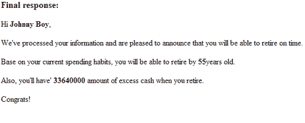
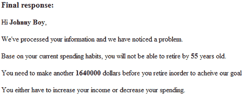
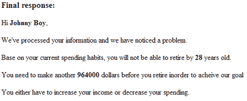
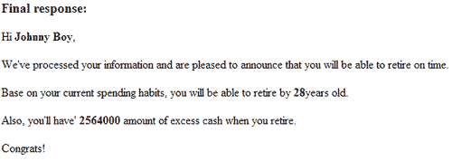
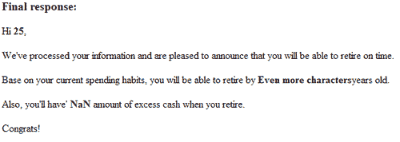

# 第五章：将测试计划付诸行动

> 欢迎来到第五章。这一章相当直接；我们基本上把在第四章，计划测试中讨论的计划付诸行动。
> 
> 我们将如何实施我们的测试计划的步骤如下：首先开始测试预期和可接受的值，接着测试预期但不可接受的值。接下来，我们将测试程序的逻辑。最后，我们将执行集成测试和测试意外值或行为。

除了执行上述测试之外，我们还将在本章涵盖以下内容：

+   回归测试实战—你将学习如何通过修复 bug 然后再次测试你的程序来执行回归测试

+   客户端测试与服务器端测试的区别

+   如何使用 Ajax 对测试产生影响

+   当测试返回错误结果时该怎么办

+   如果访客关闭了 JavaScript 会发生什么

+   如何通过压缩你的 JavaScript 代码来提高性能

那么让我们动手开始测试吧。

# 应用测试计划：按顺序运行你的测试

在本节中，我们将简单地将测试计划应用于我们的程序。为了简单起见，我们将记录任何在上一节中提供的示例测试计划中的缺陷或错误。除此之外，在每次测试结束时，我们将在`sample_text_plan.doc`中记录一个通过或失败的文本，我们是在上一章中创建的。然而，请注意，在现实世界中（尤其是如果你为你的客户做一个定制的项目），记录结果非常重要，即使你的测试是正确的。这是因为，很多时候，产生正确的测试结果是向客户交付代码的一部分。

顺便提醒一下—我们即将使用的测试计划是在上一章创建的。你可以在第四章的`source code`文件夹中找到测试计划，文件名为`sample_test_plan.doc`。如果你急于想看一个完整的测试计划，其中已经执行了所有测试，请前往第五章的`source code`文件夹，并打开`sample-testplan-bug-form-filled.doc`。

如果你不想翻页或打开电脑只是为了查看测试列表，测试列表如下：

+   测试用例 1

    +   测试用例 1a：白盒测试

    +   测试用例 1b：黑盒测试

        +   测试用例 1bi：边界值测试

        +   测试用例 1bii：测试非法值

+   测试用例 2：测试程序的逻辑

+   测试用例 3：集成测试

    +   测试用例 3a：使用预期值测试整个程序

    +   测试用例 3b：测试第二个表单的健壮性。

带着这个想法，让我们开始第一次测试。

## 测试用例 1：测试预期和可接受的值

测试预期和可接受值指的是白盒测试阶段。我们现在将按照计划执行测试（这是第一个测试场景）。

# 行动时间—测试案例 1a：通过白盒测试测试预期和可接受值

在此部分，我们将通过使用在规划阶段预先确定的值来开始我们的测试。您在本章节中使用的源代码是`perfect-code-for-jslint.html`，该代码可在第三章的`source code`文件夹中找到。我们在此将输入预期的和可接受的数据值。我们将从使用输入值案例 1 的输入值开始测试，正如我们的示例测试文档所规划的那样。

1.  用您最喜欢的网络浏览器打开源代码。

1.  当您在网络浏览器中打开您的程序时，焦点应该在第一个输入字段上。按照我们的计划输入名字**Johnny Boy**。在您在第一个输入字段中输入**Johnny Boy**后，继续下一个字段。

    当您将焦点转移到下一个字段时，您会在原始输入字段的右侧看到一个新的输入字段出现。如果出现这种情况，那么您为第一个输入收到了正确和预期的输出。如果您不理解这意味着什么，请随时参考第四章，*测试计划*，并查看给出的预期输出的屏幕截图。

1.  对于第二个输入，我们需要输入出生地。按照计划输入**旧金山**。点击（或使用标签）转到下一个字段。

    与第一个输入字段类似，在您移动到下一个字段后，您会看到一个包含您输入值的新输入字段。这意味着您此刻已经有了正确的输出。

1.  这个步骤与上述步骤类似，不同之处在于输入值现在是一个数字。输入您的年龄**25**。然后继续到下一个字段。您还应该在右侧看到一个新的输入字段。

1.  现在，请对左侧表单的剩余字段重复上述步骤。重复此操作，直到您在屏幕中间看到一个**提交**按钮。

    如果为您的每个输入动态创建了一个新的输入字段，并且每个动态创建的新输入字段都包含您输入的确切内容，那么您就得到了正确的输出。如果不是这样，测试失败。然而，根据我们的测试，我们得到了正确的输出。

1.  现在，在您的浏览器中刷新页面，并为在输入值案例 2 中找到的输入值重复测试。您也应该收到正确的输出。

    假设两个测试案例都产生了正确的输出，那么恭喜你，在这个测试阶段没有发现任何错误或 bug。这个部分的测试并没有什么特别或繁琐的地方，因为我们已经知道，基于我们的输入，我们会收到预期的输出。现在，我们将进行更加令人兴奋的测试——测试预期但不可接受的数据。

## 测试用例 1b：使用黑盒测试测试预期但不可接受的值

在这个部分，你将继续执行我们的测试计划。随着测试的进行，你会发现我们的程序还不够健壮，存在一些固有错误。你会了解到，你需要记录下这些信息；这些信息将在我们调试程序时使用（这是第二个测试场景）。

# 行动时间——测试用例 1bi：使用边界值测试测试预期但不可接受的值

在这个测试部分，我们将继续使用前一部分相同的源代码。我们将开始进行边界值测试。因此，我们将首先使用“最小值”，然后是“最大值”进行测试。我们将跳过常见值测试用例，因为那与之前的测试相似。

1.  再次刷新你的网页浏览器。

1.  首先，为**姓名**输入字段输入一个字符**a**。输入值后，用鼠标点击下一个输入字段。你应该看到在第一个输入字段的右侧动态创建了一个输入字段，与之前的测试一样。

    这个测试的输出与你在前一个测试中看到和经历的情况类似。我们试图测试的是程序是否接受一个最小值。在这个测试阶段，我们天真地选择接受一个字符作为可接受的输入。因为这是可接受的，我们应该看到一个动态生成的值出现在原始输入字段的右侧。如果你看到了这个，那么你得到了正确的输出。

1.  同样，为**出生地**输入字段输入一个字符**a**。输入值后，用鼠标点击下一个输入字段。你会看到在第一个输入字段的右侧动态创建了一个输入字段，正如之前的测试所看到的那样。

    你应该对这个输入值也收到正确的输出。现在让我们继续下一个输入值。

1.  现在，我们将按计划为输入字段年龄输入数字 1。同样，输入值后，将焦点移动到下一个输入字段。

1.  我们将按照计划重复进行测试。

    在此阶段的测试中，我们通常不应该收到任何错误。与之前进行的第一次测试类似，我们应该对每个输入都看到熟悉的输出。然而，我想指出这个测试阶段的一个重要点：

    我们天真地选择了一个可能不切实际的最小值。考虑一下接受单个字符值的各个输入字段。在很大程度上，我们的原始程序逻辑似乎并不适合实际世界的情况。通常，我们应该期望对于接受字符值的输入字段至少有两个或三个字符。因此，我们将此视为程序中的一个错误，并在我们的“错误报告表”上记录这一点。您可以打开`sample-testplan-bug-form-filled.doc`文件，看看我们如何记录这个缺陷。

    既然我们已经通过了最小值测试用例，现在是时候转到下一个测试用例——最大值。

1.  像往常一样，刷新您的网页浏览器以清除之前输入的所有值。我们现在将开始输入超过 255 个字符的极长字符串。

    正如早前所解释的，我们还应该收到类似的输出——一个动态生成的输入字段，其中包含我们的输入值。

1.  同样，使用长字符串或大数值为剩余的输入字段输入值。你不应该遇到任何错误。

    虽然我们没有明显的错误，但您可能已经注意到我们遇到了之前经历过的类似问题。我们的程序也没有最大值边界值。看起来如果你尝试输入大于最大值的价值，程序仍然会接受它们，只要这些值不是非法的。同样，如果你尝试输入超过 200 个字符的字符串，程序仍然会接受它，因为它是一个合法值。这意味着我们的程序没有限制用户可以输入的最大字符数。这可以被视为一个错误。我们将在“错误报告表”中记录这个编程错误。您可能想去看看我们是如何记录这个错误的。既然我们已经完成了预期和不可接受值的第一阶段测试，现在是时候进行这个测试的第二阶段——测试预期非法值。

# 行动时间——测试用例 1bii：使用非法值测试期望但不可接受的价值

此阶段的测试有三种输入情况。在测试的第一个情况中，我们将为需要字符输入的输入字段输入数值，反之亦然。

#### 输入用例 1：

1.  我们将再次刷新浏览器以清除旧的值。接下来，我们开始输入预期的非法值。对于“name”输入字段，我们将输入一个数字。这可以是任何数字，比如“1”。继续测试。在您输入数字后，尝试将鼠标光标移动到下一个输入字段。

    当你试图将焦点移到下一个输入字段时，你应该看到一个警告框，告诉你输入了错误的类型值。如果按照我们的测试计划看到警告框，那么此刻就没有错误。

1.  为了测试下一个字段，我们需要在继续之前输入第一个字段的正确值。另一种方法是刷新浏览器并直接跳到第二个字段。假设您使用第一种方法，让我们输入一个假设的名字，**史蒂夫·乔布斯**，然后继续输入下一个字段。同样，我们尝试为**出生地**输入一个数字。在您为输入字段输入数字后，尝试移动到下一个字段。

    再次，您将看到一个警告框，告诉您您输入了无效的输入，需要输入文本输入。到目前为止还不错；没有错误或错误，我们可以继续到下一个字段。

1.  我们需要刷新浏览器并直接跳到第三个字段，或者我们需要在继续到第三个字段之前为**姓名**和**出生地**字段输入有效值。无论使用哪种方法，我们将尝试为**年龄**字段输入字符串。完成此操作后，尝试移动到下一个输入字段。

    您将再次收到警告框，告诉您您输入了错误的类型。这是按照计划，也是预期的。因此，还没有错误或错误。

1.  对剩下的字段重复上述步骤，在输入预期但非法值时尝试移动到下一个字段。

    对于所有剩余的字段，您应该收到警告框，告诉您您输入了错误的类型，这是我们期望和计划的内容。

#### 输入案例 2：

既然我们已经完成了第一个测试场景，是时候进行第二个测试场景了，在那里我们尝试输入非字母数字值。

1.  测试过程与第一个测试相当相似。我们首先刷新浏览器，然后立即为第一个输入字段输入非字母数字值——**姓名**输入字段。按照我们的计划，我们将输入**~!@#$%^&*()**作为输入，然后尝试移动到下一个输入字段。

    对于第一个输入字段，需要字符输入，您应该看到一个警告框，告诉您只能输入文本。如果您看到这个，那么我们的程序按计划工作。现在让我们进行下一步。

1.  对于下一个输入字段，我们将重复上一步，我们期望得到相同的输出。

1.  现在，对于第三个输入字段，我们继续输入相同的非字母数字输入值。预计这一步的区别只是警告，它告诉我们我们输入了错误的输入，会告诉我们需要输入数字而不是文本。

1.  我们对剩余的字段重复上述步骤，通常我们应该期望看到一个警告框，告诉我们需要输入文本或数字，这取决于哪个输入字段。如果是这样，那么一切顺利；这个测试场景中没有相关的错误或错误。

#### 输入案例 3：

现在是我们执行第三个测试场景的时候，我们在需要数字输入的输入字段中输入负值。

1.  再次，我们将刷新浏览器以清除旧值。我们将按计划输入前两个输入字段。我们将输入**Johnny Boy**和**San Francisco**作为**姓名**和**出生地**的输入字段。

1.  完成上一个步骤后，输入剩余字段的**-1**。当你为这些字段输入**-1**时，你应该看到我们的程序没有检测到负值。相反，它给出了一个错误的响应，告诉我们应该输入数字。

    实际上，我们的程序应该足够健壮，能够识别负值。然而，如前述测试所示，我们的程序对非法值似乎有错误的响应。我们的程序确实发现了错误，但它返回了一个错误的响应。给出的响应是一个警告框，告诉您输入必须是数字。这在技术上是错误的，因为我们的输入是一个数字，尽管是一个负数。

    这意味着我们的程序确实发现了负值，但它返回了一个错误的响应。这意味着我们这里有一个严重的错误。我们需要在我们的样本文档中注意这个错误，通过在“错误报告表单”上记录这个错误来 document this error。你可以看看我在`sample test plan`文档中是如何记录这个的。

    哇！这个小节有点长和无聊。没错，测试可以是无聊的，到现在你应该看到我们在这个部分测试的问题都会包含在一个好的程序设计中。你会注意到，至少对我们在这里的目的来说，检查输入值以确保输入是我们需要的，对我们程序的成功是基本的；如果输入值错误，测试剩下的程序就没有意义，因为我们几乎可以确定会因为错误的输入而得到错误的输出。

## 测试用例 2：测试程序逻辑

在本小节中，我们将尝试在程序逻辑方面测试程序的健壮性。虽然我们已经通过确保输入正确 somewhat 测试了程序逻辑，但根据我们的测试计划，还有一方面我们需要测试，那就是现在的年龄和退休年龄。

# 行动时间——测试程序逻辑

通常，我们将尝试输入一个比当前年龄小的退休年龄。现在让我们测试程序的健壮性：

1.  让我们刷新浏览器，然后按照我们的计划输入值。首先输入**Johnny Boy**，然后输入**San Francisco**作为**姓名**和**出生地**的输入字段。

1.  现在，请注意这个步骤：我们将现在输入**30**作为**年龄**，并继续其他字段。

1.  当你到达**希望退休的年龄**输入字段时，你将想输入一个小于**年龄**字段的值。根据我们的测试计划，我们将输入**25**。之后，我们将尝试移动到下一个字段。

    因为我们成功移动到了下一个字段，这意味着我们的程序还不够健壮。我们的程序不应该接受小于当前年龄值的退休年龄值。因此，即使我们的程序确实产生了最终结果，我们也可以确定输出不是我们想要的，因为逻辑已经是错误的。

    因此，我们需要注意在这个测试阶段发现的逻辑错误。我们再次在错误报告表上记录这个错误。现在我们将进行我们测试的最后阶段。

## 测试案例 3：集成测试和测试意外值

我们已经完成了测试的最后阶段。在这一小节中，我们将先使用预期和可接受值测试整个程序，然后通过更改第二个表单的值来中断表单提交流程。

# 行动时间——测试案例 3a：使用预期值测试整个程序

第一组测试共有四组数据。通常情况下，我们会输入所有的值，然后提交表单，看看我们是否能得到预期的响应：输入案例 1 和输入案例 3 的输入值将导致输出显示用户无法按时退休，而输入案例 2 和输入案例 4 的输入值将导致输出显示用户将能够按时退休。有了这个想法，让我们从第一组输入值开始：

1.  回到你的网页浏览器，刷新你的程序，或者如果你关闭了程序，重新打开源代码。我们按照计划输入值：**Johnny Boy** 和 **San Francisco** 作为**姓名**和**出生地**。

1.  接下来，我们将输入**25**作为**年龄**，然后输入**1000**作为**每月支出**。我们将重复这些步骤，直到我们在第二个表单上看到动态生成的**提交**按钮。

1.  一旦你看到**提交**按钮，点击按钮提交值。你应该在**最终响应**框中看到一些文本被生成。如果你看到输出包含姓名、退休年龄、退休所需金额的正确输出值，更重要的是，响应**你将在 55 岁时退休**，如下面的屏幕截图所示，那么程序中没有错误！

1.  现在让我们继续输入案例 2 的值。同样，我们将刷新浏览器，然后开始输入所有计划中的值。

1.  当你看到动态创建的**提交**按钮时，点击该按钮以提交表单。在这个测试案例中，你会看到用户将**无法按时退休**，如下面的屏幕截图所示:

    如果你收到前一张截图中的输出，那么到目前为止没有错误。所以让我们继续第三种情况的输入值。

1.  再次刷新你的浏览器，然后按照计划开始输入值。需要注意的值包括**每月工资**和**你想退休的年龄**。通常，我们已经设定了这些值，以测试我们是否能够创建输出，以便能够按时退休或不按时退休。

1.  继续输入值，直到你看到动态生成的**提交**按钮。点击**提交**按钮以提交表单。你会看到如下截图所示的输出:

    如果你收到了之前的输出，那么到目前为止没有错误或故障。

1.  现在，让我们进入最后一个案例——案例 4。我们基本上会重复之前的步骤。我只需要你注意**每月工资**的输入值。注意输入值是**100000**，退休年龄没有改变。我们试图模拟用户能够按时退休的情况。

1.  继续输入值，直到你看到动态生成的**提交**按钮。点击**提交**按钮以提交表单。你会看到如下截图所示的输出:

+   再次，如果你收到了前一张截图中的输出，那么你已经收到了正确的输出。有了这一点，我们已经完成了这个测试阶段的 第一部分。

    通常，我们已经测试了整个程序，以查看我们是否得到了预期的输出。我们使用了不同的值生成了两种可能的输出：能够按时退休或无法按时退休。我们不仅已经收到了正确的输出，我们还测试了在计算结果方面的函数的健壮性。

    考虑到之前的因素，是时候进入测试的第二阶段了——测试第二个表单的健壮性。

# 行动时间—测试用例 3b：测试第二个表单的健壮性

如果你从第一章就开始跟随我，你可能会注意到我们只是禁用了左侧表单的输入字段，而没有禁用右侧的输入字段。除了故意这样做以向您展示 JavaScript 编程的不同方面外，我们还设置它可以向我们展示集成测试的其他方面。所以现在，我们将尝试更改动态生成的表单的值看看会发生什么。

1.  首先刷新浏览器，然后按照计划开始输入输入值。在您输入完所有值之后，根据测试计划更改第二表单中的值。

1.  现在，提交表单，您将看到如下截图的输出：

+   哎呀！显然，我们的程序有一个致命的缺陷。我们的第二个表单没有检查机制，或者说是没有。第二个表单在我们的用户可能想要更改值的情况下存在。从一开始，我们天真地选择相信用户会在第二个表单上输入合法和可接受的值，如果他们选择更改输入。现在我们知道这可能不是事实，我们在“缺陷报告表”上记录这一点。

## 刚才发生了什么？

通常，我们已经执行了整个测试计划。在这个过程中，我们发现了一些后来要修复的错误。您可能会觉得步骤重复；这是真的，测试有时会重复。但是幸运的是，我们的程序相当小，因此测试它是可以管理的。

现在我们已经完成了测试，是时候考虑我们如何处理那些错误了。我们将在下一部分开始讨论这个问题。

## 当测试返回意外结果时应该做什么

通常，当测试返回意外或错误的结果时，意味着我们的程序中有一个错误或缺陷。根据我们的测试，您肯定已经注意到我们的程序中有薄弱环节。导致测试返回意外结果的薄弱环节或错误如下：

+   我们的程序不支持负值

+   我们编写的代码不支持边界值（最大和最小值）。

+   第二个表单不检查输入值的正确性；如果我们更改第二个表单中的任何值，程序就会失败。

这些观点意味着我们的代码不够健壮，我们需要修复它；我们将在下一节立即进行。

# 回归测试在行动

在本节中，我们将通过执行回归测试来亲自动手。我们将尝试通过编写修复我们最初应用测试计划时找到的错误的代码来模拟需要回归测试的情况。编写代码后，我们首先测试编写的代码，然后测试整个应用程序以查看它是否协同工作。

# 行动时间——修复错误并进行回归测试

我们将逐一修复我们发现的每个错误。我们将从编写一个允许我们的程序支持边界值的函数开始。修复所有错误的完整源代码在`source code`文件夹的第五章中，文件名为`perfect-code-for-JSLInt-enhanced.html`。

在我们开始第一个错误的实际编码过程之前，让我们考虑一下我们可以做什么来支持边界值。

首先，如果我们回到我们的示例测试计划，你会注意到在我们的“Bug 报告表单”中，我们已经记录了我们可以尝试更改检查表单输入的函数，使其可以检查最小和最大值。为了简单起见，我们将通过检查输入的长度来启用边界值。例如，“Neo”意味着有三个输入字符，“1000”将有四个数字输入字符。

其次，因为第一个表单的输入检查是在`submitValues()`中完成的，我们将尝试添加这个函数所需的检查机制。有了这个想法，我们可以开始编码过程：

1.  打开我们在第三章，*语法验证*中编写的原始源代码，在你的最喜欢的源代码编辑器中，寻找`submitValues()`函数。接下来，在`debuggingMessages()`函数之后添加以下代码：

    ```js
    // this is the solution for checking the length of the input
    // this will allow us to enable boundary values
    // starting with minimum values: we will accept character
    // length of more than or equal than 3
    // and less than 100 characters
    if (elementObj.name === 'enterText') {
    if (elementObj.value.length <= 3) {
    alertMessage("Input must be more than 3 characters!");
    var element = document.getElementById(elementObj.id);
    jQuery(element).focus(); 
    return true;
    }
    if (elementObj.value.length >= 100) {
    alertMessage("Input must be less than 100 characters!");
    var element = document.getElementById(elementObj.id);
    jQuery(element).focus();
    return true;;
    }
    }
    // now for checking the maximum value of digits
    // upper boundary is set at 10 digits
    if (elementObj.name === 'enterNumber') {
    if (elementObj.value.length >= 10) {
    alertMessage("Input must be less than 10 digits!");
    var element = document.getElementById(elementObj.id);
    jQuery(element).focus();
    return true;
    }
    }

    ```

    在之前的代码中发生的事情是我们添加了一些`if`语句。这些语句通过`.name`属性检查输入的类型，然后检查它是否大于最小输入或小于最大输出。我们设置了一个最小输入长度为三个字符和一个最大输入长度小于 100 个字符的文本输入。对于需要数字输入的输入，我们设置了最大输入长度为 10 位数字。由于用户可能没有收入，我们没有设置最小输入长度。

1.  保存你的文件并测试程序。尝试输入少于三个字符或超过 100 个字符。你应该会收到一个警告框，显示你的输入过大或过小。同样，测试需要数字输入的输入字段，并查看程序是否检测到超过 10 位数字的输入长度。如果你为每个不同情况收到了正确的警告框，那么你已经修复了错误。

    现在我们已经修复了与边界值有关的问题，是时候继续处理我们在“Bug 报告表单”上记录的下一个错误了，这是我们在`sample-testplan-bug-form-filled.doc`中发现的第三个错误（错误编号 3），它与负值有关。

    错误在于，我们的程序将负数输入视为非数字值，并产生错误的输出信息，提示输入必须是数字。因此，在这种情况下，我们需要通过追溯到问题的源头——负责检查输入的函数来修复这个错误。

    请注意，检查输入的函数是`submitValues()`。现在，让我们进入实际的编程过程：

1.  回到你的源代码，从`submitValues()`函数开始。我们需要一个检查负数输入的机制，并返回正确的输出，提示**输入必须是正数**。所以我们可以这样做：

    ```js
    // this is the solution for checking negative values
    // this only applies to input fields that requires numeric inputs
    if (elementObj.name === 'enterNumber') {
    if (elementObj.value < 0) {
    alertMessage("("Input must be positive!");
    var element = document.getElementById(elementObj.id);
    jQuery(element).focus(); 
    return true;
    }
    }

    ```

    通过添加上述代码，你将能够检查负值。上述代码应放置在`submitValues()`函数中，在检查输入长度的`if`语句之前。

1.  保存你的程序并测试它。在遇到需要数字输入的表单字段时，尝试输入一个负值，比如**-1**。如果你收到一个警告框，提示**输入必须是正数**，那么我们就做对了。

    `submitValues()`的代码应该包括以下行：

    ```js
    function submitValues(elementObj) {
    // code above omitted
    // this is the solution for checking negative values
    // this only applies to input fields that requires numeric inputs
    if (elementObj.name === 'enterNumber') {
    if (elementObj.value < 0) {
    alertMessage("Input must be positive!");
    var element = document.getElementById(elementObj.id);
    jQuery(element).focus();
    return false;
    }
    }
    // code below is omitted
    }

    ```

    上述片段中的行是我们在这个小节中添加的。因为我们已经确保了我们的频率相同，所以我们可以继续讨论第四个错误（我们`sample_test_plan.doc`中的第 4 个 bug）。这个错误与程序逻辑有关。

    本章开始时，我们发现程序没有检测到退休年龄可能小于用户当前年龄的情况。这对我们的程序可能是致命的。因此，我们需要添加一个确保退休年龄大于用户当前年龄的机制。

    因为问题在于输入的检查，我们需要关注`submitValues()`。

1.  让我们回到源代码，在`submitValues()`中添加以下代码：

    ```js
    // this is to make sure that the retirement age is larger than present age
    if (elementObj.id === 'retire') {
    if (elementObj.value < document.getElementById('age').value) {
    alertMessage('Retirement age must be higher than age');
    var element = document.getElementById(elementObj.id);
    jQuery(element).focus();
    return false;
    }
    }

    ```

    你应该在这段代码之前输入上述代码。

    现在，测试你的代码。尝试输入一个小于当前年龄的退休年龄。你应该会收到一个警告消息，提示退休年龄必须大于年龄。

    如果你收到了这个警告，那么恭喜你，你做对了！再次总结这个部分，以确保我们意见一致，`submitValues()`应该包括以下所示的代码行：

    ```js
    function submitValues(elementObj) {
    // code above omitted
    // this is to make sure that the retirement age is larger than present age
    if (elementObj.id === 'retire') {
    if (elementObj.value < document.getElementById('age').value){
    alertMessage('retirement age must be larger than age');
    var element = document.getElementById(elementObj.id);
    jQuery(element).focus();
    return true;
    }
    }
    // code below omitted
    }

    ```

    现在让我们继续讨论通过检查第二个表单发现的最后一个错误（我们`sample-testplan-bug-form-filled.doc`中的第 5 个 bug）。

    我们已经创建了一个 JavaScript 程序，这样当我们为每个输入字段输入值时，会动态创建一个新的输入字段。这意味着在所有输入字段都完成后，会创建一个新的表单。你可能没有注意到，新创建的输入字段允许用户更改它们的值。

    这里的问题在于，用户可能会在新表单中更改输入值，这可能会导致致命错误，因为我们没有检查机制来检查第二表单中的值。所以，我们天真地选择相信用户会相应地行动，只输入有效的值。但显然，我们错了。

    因此，为了检查第二表单，我们很可能需要创建一个新的函数来检查第二表单。

    尽管第二表单是动态生成的，但我们可以通过到目前为止学到的方法获取这些字段内的值。记住，因为 JavaScript 在第二表单中创建了字段，这些字段在技术上存在于内存中，因此仍然可以访问。

    有了这个想法，我们需要创建一个适用于这些字段的函数。

1.  打开源代码，滚动到最后一个使用 jQuery 语句的函数。在这个函数之前，创建以下函数：

    ```js
    function checkSecondForm(elementObj) {
    // some code going here
    }

    ```

1.  首先，开始检查空值。因此，我们可以这样做来检查空值：

    ```js
    if(document.testFormResponse.nameOfPerson.value === "") {
    alertMessage("fields must be filled!");
    return false;
    }
    if(document.testFormResponse.birth.value === "") {
    alertMessage("fields must be filled!");
    return false;
    }
    if(document.testFormResponse.age.value === "") {
    alertMessage("fields must be filled!");
    return false;
    }
    if(document.testFormResponse.spending.value === "") {
    alertMessage("fields must be filled!");
    return false;
    }
    if(document.testFormResponse.salary.value === "") {
    alertMessage("fields must be filled!");
    return false;
    }
    if(document.testFormResponse.retire.value === "") {
    alertMessage("fields must be filled!");
    return false;
    }
    if(document.testFormResponse.retirementMoney.value === "") {
    alertMessage("fields must be filled!");
    return false;
    }

    ```

    通常，我们应用第三章中学到的知识，使用`===`而不是`==`来检查空值。我们基本上检查在动态生成的字段中找到的值，并检查它们是否为空。

    现在我们已经有了检查字段是否为空的代码，是时候编写检查输入正确类型的代码了。

1.  我们可以应用在第三章中学到的技术*语法验证*来检查输入的正确性。通常，我们使用正则表达式，像前几章一样，来检查输入的类型。我们可以这样做：

    ```js
    var charactersForName = /^[a-zA-Z\s]*$/.test(document.testFormResponse.nameOfPerson.value);
    var charactersForPlaceOfBirth = /^[a-zA-Z\s]*$/.test(document.testFormResponse.birth.value);
    var digitsForAge = /^\d+$/.test(document.testFormResponse.age.value);
    var digitsForSpending = /^\d+$/.test(document.testFormResponse.spending.value);
    var digitsForSalary = /^\d+$/.test(document.testFormResponse.salary.value);
    var digitsForRetire = /^\d+$/.test(document.testFormResponse.retire.value);
    var digitsForRetirementMoney = /^\d+$/.test(document.testFormResponse.retirementMoney.value);
    // input is not relevant; we need a digit for input elements with name "enterNumber"
    if (charactersForName === false || charactersForPlaceOfBirth === false) {
    alertMessage("the input must be characters only!");
    debuggingMessages( checkSecondForm", elementObj, "wrong input");
    return false;
    }
    else if (digitsForAge === false || digitsForSpending === false || digitsForSalary === false || digitsForRetire === false || digitsForRetirementMoney === false ){
    alertMessage("the input must be digits only!");
    debuggingMessages( checkSecondForm", elementObj, "wrong input");
    return false;
    }
    // theinput seems to have no problem, so we'll process the input
    else {
    checkForm(elementObj);
    alert("all is fine");
    return false;
    }

    ```

    要查看完整版本的先前代码，请查看*第五章*的`source code`文件夹，并参考`perfect-code-for-JSLInt-enhanced.html`文件。

    然而，记住，在早期的调试会话中，我们已经创建了新的检查机制，以支持边界值、防止负值，并确保退休年龄大于用户的当前年龄。

    因为第二表单可能会被更改，之前的错误也可能在第二表单中发生。因此，我们还需要添加那些检查机制。为了看看你是否做得正确，请查看`source code`文件夹中名为`perfect-code-for-JSLInt-enhanced.html`的文件中的`checkSecondCode()`函数。以下是`checkSecondCode()`的代码片段：

    ```js
    // above code omitted
    if (elementObj.id === 'retire') {
    if (elementObj.value < document.getElementById('age').value) {
    alertMessage('retirement age must be larger than age');
    var element = document.getElementById(elementObj.id);
    jQuery(element).focus();
    return true;
    }
    }
    // this is the solution for checking negative values
    // this only applies to input fields that requires numeric inputs
    if (elementObj.name === 'enterNumber') {
    if (elementObj.value < 0) {
    alertMessage("Input must be positive!");
    var element = document.getElementById(elementObj.id);
    jQuery(element).focus();
    return true;
    }
    }
    if (elementObj.name === 'enterText') {
    if (elementObj.value.length <= 3) {
    alertMessage("Input must be more than 3 characters!");
    var element = document.getElementById(elementObj.id);
    jQuery(element).focus(); 
    return true;
    }
    if (elementObj.value.length >= 100) {
    alertMessage("Input must be less than 100 characters!");
    var element = document.getElementById(elementObj.id);
    jQuery(element).focus(); 
    return true;
    }
    }
    if (elementObj.name === 'enterNumber') {
    if (elementObj.value.length >= 10) {
    alertMessage("Input must be less than 10 digits!");
    var element = document.getElementById(elementObj.id);
    jQuery(element).focus(); 
    return true;
    }
    }
    // remaining code omitted
    }

    ```

## 刚才发生了什么？

我们已经完成了整个测试计划，包括回归测试。注意，在编码过程的每个阶段，我们都进行了小测试，以确保我们的解决方案正确工作；我们在回归测试过程中再次使用了单元测试。

请注意，我们还测试了程序逐步；我们测试了每个新函数或我们创建的代码，并确保它正确工作，在我们修复下一个错误之前。

通过这个过程，我们将有更好的机会创建好的程序，并避免将新的错误引入我们的代码。

除了在我们程序变化的过程中进行回归测试之外，关于我们程序的测试还有其他重要的问题。让我们转到第一个重要问题——性能问题。

## 性能问题——压缩你的代码以使其加载更快

如我在第四章中提到的，*计划测试*，我们编写的代码的性能取决于各种因素。性能通常指的是你代码的执行速度；这取决于你为代码使用的算法。由于算法问题超出了本书的范围，让我们专注于更容易实现的事情，比如通过压缩你的代码来提高程序的性能。

通常，压缩你的代码后，你的代码文件大小会更小，因此降低了在执行前需要缓存存储代码的磁盘使用量。它还减少了将 JavaScript 文件从 Web 服务器传输到客户端所需的带宽。所以现在，让我们看看我们如何压缩我们的 JavaScript 代码。

我们可以采取两种方式来做这件事：

1.  我们可以压缩整个程序，这意味着我们将压缩我们的 CSS、HTML 和 JavaScript 在一起。

1.  我们可以将所有的本地 JavaScript 移到一个外部文件中，然后只压缩这个外部 JavaScript 文件。为了保持简单，我将先使用第一种方法。

首先，我想让你访问[`jscompress.com/`](http://jscompress.com/)，并将我们的源代码粘贴到输入框中。有一个选项叫做"**Minify (JSMin)**"。这个选项将会一起压缩 HTML、CSS 和 JavaScript。一旦你将代码复制到输入框中，点击**压缩 JavaScript**。

然后你会看到页面刷新，并将在输入框中显示压缩后的代码。将这段代码复制粘贴到一个新文件中，然后将其保存为`testing-compressed.html`。

如果你去到`source code`文件夹，你会注意到我已经为你完成了压缩过程。检查`testing-compressed.html`文件和我们之前编写的代码的大小。根据我们所有的源代码，压缩后的版本是 12KB，而原始版本是 18KB。

现在让我们尝试第二种方法——将所有的 JavaScript 放在一个外部的 JavaScript 文件中并压缩这个文件。我们将这样做：

1.  剪切掉`<head>`和`</head>`标签之间的所有 JavaScript，并将其粘贴到一个新的名为`external.js`的文件中。

1.  保存`external.js`，并将 HTML 文档的更改也保存下来。

1.  回到你的 HTML 文档，转到`<head>`和`</head>`标签之间，插入以下内容：`<script type="text/javascript" src="img/external.js">`。然后保存文件。

这样一来，你的代码就被压缩了，从而使得从服务器加载到客户端的速度更快。

看来我们成功地通过压缩代码来减小了文件大小。当然，由于我们的代码不多，所以区别并不明显。然而，在实际中，代码可以增加到数千甚至数万行，正如我们看到的 jQuery 库一样。在这种情况下，代码压缩将有助于提高性能。

### 注意

如果你是一个在保密协议（NDA）下工作的开发者，你可能不允许使用我之前提到的任何外部服务。如果是这种情况，你可能想考虑使用雅虎的 YUI 压缩器，它允许你直接从命令行工作。更多信息，请访问[`developer.yahoo.com/yui/compressor/#using`](http://developer.yahoo.com/yui/compressor/#using)。

## 使用 Ajax 会有所不同吗？

让我先简要解释一下使用 Ajax 时会发生什么。JavaScript 是 Ajax 方程的一部分；JavaScript 的执行负责发送信息和从服务器加载信息。这是通过使用`XMLHttpRequest`对象来实现的。

当使用 Ajax 进行发送和加载数据时，测试责任是不同的；你不仅要测试我们前面章节中涵盖的各种错误，还要测试每个错误是否导致了信息的成功发送和加载以及对用户的正确视觉响应。

然而，由于你需要和服务器之间发送和接收请求，你可能需要进行某种形式的服务器端测试。这让我们来到了话题的下一部分——JavaScript 测试与服务器端测试的区别。

## 与服务器端测试的区别

如前一部分所述，当你在进行 Ajax 测试时，可能需要进行服务器端测试。通常，到目前为止你在书中所学的概念也可以应用于服务器端测试。因此，从概念上讲，JavaScript 测试和服务器端测试之间应该没有太大区别。

然而，请注意，服务器端测试通常包括服务器端代码，并且很可能包括 MySQL、PostgreSQL 等数据库。这意味着与 JavaScript 测试相比，服务器端测试的复杂性可能会有所不同。

尽管如此，你还是需要对所使用的服务器端语言、数据库等有深入了解。这是你开始规划测试的最基本要求。

### 注意

如果你在进行 Ajax 测试的服务器端测试，你肯定想了解一下超文本传输协议（HTTP）响应状态码。这些状态码是确定你的请求是否成功的一种方式。它们甚至告诉你是否发生了任何错误。更多信息请访问：[`www.w3.org/Protocols/rfc2616/rfc2616-sec10.html`](http://www.w3.org/Protocols/rfc2616/rfc2616-sec10.html)。

## 如果访客关闭了 JavaScript 会发生什么

我们已经简要讨论了是否应该为关闭 JavaScript 的用户编写应用程序的问题。虽然关于是否应该支持这类用户存在不同的观点，但在我看来，最好的方法之一是至少告知我们的用户他们的浏览器不支持 JavaScript（或者 JavaScript 已被关闭），他们可能会错过一些内容。为了实现这一点，我们可以使用以下代码片段：

```js
<html>
<body>
<script type="text/javascript">
document.write("Your browser supports JavaScript, continue as usual!");
// do some other code as usual since JavaScript is supported
</script>
<noscript>
Sorry, your browser does not support JavaScript! You will need to enable JavaScript in order to enjoy the full functionality and benefits of the application
</noscript>
</body>
</html>

```

+   请注意，我们使用了`<noscript>`标签，这是在 JavaScript 被关闭或不被支持时显示用户的替代内容的途径。

    既然我们已经接近本章的尾声，你可能已经掌握了要领。让我们看看你是否能通过尝试以下练习来提高你的技能。

## 尝试英雄——提升我们程序的可用性

既然你已经走到了这一步，你可能想尝试这个任务——通过以下方式提升这个程序的可用性：

+   确保用户从第一个字段到最后一个字段输入所需信息。

    我们程序可能遇到的另一个问题是，用户可能会点击第一个以外的任何输入字段并开始输入信息。尽管这可能不会直接影响我们程序的正确性，但有可能结果不是我们预期的。

+   关于第二个表单，你有什么方法能告知你的用户哪些输入字段有错误的输入？用户可以更改错误的输入吗？

    当我们修复与第二个表单相关的错误时，我们只是创建了检测第二个表单输入正确性的机制。然而，如果用户在第二个表单中输入了错误的值，用户可能不会立即知道哪些字段输入错误。

以下是一些帮助你开始这项练习的提示：

+   从一开始，你可以禁用所有除了第一个以外的输入字段。然后当第一个字段获得正确的输入时，你可以启用第二个输入字段。同样，当第二个输入字段正确完成时，第三个输入字段被启用，依此类推。

+   对于第二个问题，你可能想查看我们的代码，看看你是否能编辑`checkSecondForm()`函数中`if else`语句中的条件。我所做的是将所有可能性合并成一个`if`或`else if`语句，从而使无法检测出哪个字段出了问题。你可以尝试将条件拆分，使得每个`if`和`else if`语句只包含一个条件。这样，如果出现问题，我们就能为第二表单中的每个输入字段创建一个自定义响应。

# 总结

哇，我们在这一章节中涵盖了大量的知识。我们执行了测试计划并发现了 bug。接下来我们成功地修复了我们发现的问题。在修复每个 bug 后，我们执行了回归测试，以确保保留了原始功能，并且没有在程序中引入新的 bug。

具体来说，我们讨论了以下主题：

+   如何执行测试计划以及如何记录我们发现的问题

+   修复每个错误后如何执行回归测试

+   如何压缩代码以提高性能

+   如果我们使用 Ajax，测试差异如何

+   客户端测试与服务器端测试的区别

前面提到的学习点可能看起来很小，但既然你已经阅读了这一章节，你应该知道执行测试计划和随后修复 bug 可能会很繁琐。

现在我们已经讨论了测试计划的执行，是时候讨论稍微复杂一些的内容——测试更复杂的代码。请注意，我们一直以一种一维的方式处理 JavaScript：我们将所有的 JavaScript 放在我们的 HTML 文件中，还包括 CSS。我们一直将 JavaScript 代码开发成这样，因为我们只使用这一段 JavaScript 代码。但是，实际上，通常可以看到 web 应用程序使用不止一段 JavaScript 代码；这段额外的代码通常通过外部 JavaScript 文件附上。

更重要的是，这并不是我们在现实世界中唯一会面临的问题。随着我们的代码变得更加复杂，我们将需要使用更复杂的测试方法，甚至可能需要使用内置控制台等工具，以更有效、更高效地帮助我们进行测试。

在下一章中，我们将讨论之前提到的 issues，第六章，*测试更复杂的代码*。在那里见！
