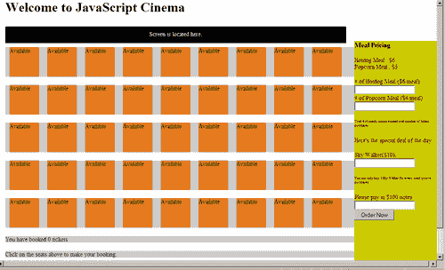

# 第六章：测试更复杂的代码

> 欢迎来到第六章。在这一章中，我们将了解更多关于 JavaScript 测试的内容。更具体地说，我们将学习如何测试更复杂的代码，其中实体之间会有更多的交互。到目前为止，我们一直在对相对简单的代码进行测试，使用的是相对直接的技术。

更具体地说，我们将涵盖以下内容：

+   组合脚本时可能发生的错误类型

+   如何处理组合脚本时发生的错误

+   目前互联网上可用的各种 JavaScript 库，以及我们在测试它们时需要考虑的问题。

+   如何测试 GUI、库的控件插件以及其他考虑因素

+   如何使用控制台日志

+   使用 JavaScript 内置对象进行异常处理

+   使用 JavaScript 内置对象测试应用程序

让我们从覆盖组合脚本时可能发生的错误类型的基本概念开始。

# 组合脚本的问题

到目前为止，我们一直专注于在 HTML 文档中编写和测试只有一段 JavaScript 代码。考虑一下现实生活中的情况，我们通常使用外部的 JavaScript；如果我们使用多个 JavaScript 文件会发生什么？如果我们使用多个外部 JavaScript 文件，我们可能会遇到什么问题？我们在下面的子节中都会覆盖到。我们首先从第一个问题开始——组合事件处理器。

## 组合事件处理器

你可能意识到了，也可能没有意识到，但自从第三章《语法验证》以来，我们就一直在处理事件处理器。实际上，我们在《第一章，什么是 JavaScript 测试》中提到了事件。JavaScript 通过添加交互性，使我们的网页充满生机。事件处理器是交互性的心跳。例如，我们点击一个按钮，一个弹出窗口就会出现，或者我们的光标移动到 HTML `div`元素上，元素的颜色会改变以提供视觉反馈。

为了了解我们可以如何组合事件处理器，请考虑以下示例，该示例在文件`combine-event-handlers.html`和`combine-event-handlers.js`中，如以下代码所示：

在`combine-event-handlers.html`中，我们有：

```js
<html>
<head>
<title>Event handlers</title>
<script type="text/javascript" src="combine-event-
handlers.js"></script>
</head>
<body>
<div id="one" onclick="changeOne(this);"><p>Testing One</p></div>
<div id="two" onclick="changeTwo(this);"><p>Testing Two</p></div>
<div id="three" onclick="changeThree(this);"><p>Testing Three</p></div>
</body>
</html>

```

请注意，每个`div`元素都由不同的函数处理，分别是`changeOne()`、`changeTwo()`和`changeThree()`。事件处理器在`combine-event-handlers.js`中：

```js
function changeOne(element) {
var id = element.id;
var obj = document.getElementById(id);
obj.innerHTML = "";
obj.innerHTML = "<h1>One is changed!</h1>";
return true;
}
function changeTwo(element) {
var id = element.id;
var obj = document.getElementById(id);
obj.innerHTML = "";
obj.innerHTML = "<h1>Two is changed!</h1>";
return true;
}
function changeThree(element) {
var id = element.id;
var obj = document.getElementById(id);
obj.innerHTML = "";
obj.innerHTML = "<h1>Three is changed!</h1>";
return true;
}

```

你可能想接着测试程序。随着你点击文本，内容会根据函数中的定义发生变化。

然而，我们可以重写代码，使得所有事件都由一个函数处理。我们可以将`combine-event-handlers.js`重写为如下：

```js
function combine(element) {
var id = element.id;
var obj = document.getElementById(id);
if(id == "one"){
obj.innerHTML = "";
obj.innerHTML = "<h1>One is changed!</h1>";
return true;
}
else if(id == "two"){
obj.innerHTML = "";
obj.innerHTML = "<h1>Two is changed!</h1>";
return true;
}
else if(id == "three"){
obj.innerHTML = "";
obj.innerHTML = "<h1>Three is changed!</h1>";
return true;
}
else{
; // do nothing
}
}

```

当我们使用`if else`语句检查我们正在处理的`div`元素的`id`，并相应地改变 HTML 内容时，我们可以节省很多行代码。请注意，我们已经将函数重命名为`combine()`。

因为我们对 JavaScript 代码做了一些改动，所以我们还需要对我们的 HTML 进行相应的改动。所以`combine-event-handlers.html`将被重写如下：

```js
<html>
<head>
<title>Event handlers</title>
<script type="text/javascript" src="img/combine-event- handlers.js"></script>
</head>
<body>
<div id="one" onclick="combine(this);"><p>Testing One</p></div>
<div id="two" onclick="combine(this);"><p>Testing Two</p></div>
<div id="three" onclick="combine(this);"><p>Testing Three</p></div>
</body>
</html>

```

请注意，现在`div`元素由同一个函数`combine()`处理。这些重写的示例可以在`combine-event-handlers-combined.html`和`combine-event-handlers-combined.js`中找到。

## 名称冲突

处理名称冲突是我们需要解决的下一个问题。与事件处理程序组合的问题类似，名称冲突发生在两个或更多变量、函数、事件或其他对象具有相同名称时。尽管这些变量或对象可以包含在不同的文件中，但这些名称冲突仍然不允许我们的 JavaScript 程序正常运行。请考虑以下代码片段：

在`nameclash.html`中，我们有以下代码：

```js
<html>
<head>
<title>testing</title>
<script type="text/javascript" src="img/nameclash1.js"></script>
</head>
<body>
<div id="test" onclick="change(this);"><p>Testing</p></div>
</body>
</html>

```

在`nameclash1.js`中，我们有以下代码：

```js
function change(element) {
var id = element.id;
var obj = document.getElementById(id);
obj.innerHTML = "";
obj.innerHTML = "<h1>This is changed!</h1>";
return true;
}

```

如果你通过在浏览器中打开文件并点击文本**Testing**来运行此代码，HTML 内容将按预期更改。然而，如果我们在这段代码后面添加`<script type="text/javascript" src="img/nameclash2.js"></script>`，并且`nameclash2.js`的内容如下：

```js
function change(element) {
alert("so what?!");
}

```

然后我们将无法正确执行代码。我们将看到警告框，而不是 HTML 内容被改变。如果我们改变外部 JavaScript 的位置，那么`div`元素的内容将被改变，我们将无法看到警告框。

由于这些名称冲突，我们的程序变得不可预测；解决这个问题的方法是在你的函数、类或事件中使用独特的名称。如果你有一个相对较大的程序，建议使用命名空间，这是 YUI 和 jQuery 等几个 JavaScript 库中常见的策略。

# 使用 JavaScript 库

现在有很多 JavaScript 库可供使用。一些最常用的如下：

+   JQuery ([`jquery.com`](http://jquery.com))

+   YUI (Yahoo!用户界面 JavaScript 库) ([`developer.yahoo.com/yui/`](http://developer.yahoo.com/yui/))

+   Dojo ([`dojotoolkit.org/`](http://dojotoolkit.org/))

+   原型([`www.prototypejs.org/`](http://www.prototypejs.org/))

+   Mootools ([`mootools.net/`](http://mootools.net/))

+   Script.aculo.us ([`script.aculo.us/`](http://script.aculo.us/))

还有更多的 JavaScript 库。要查看完整的列表，请随时访问[`en.wikipedia.org/wiki/List_of_JavaScript_libraries.`](http://en.wikipedia.org/wiki/List_of_JavaScript_libraries.)

- 如果您考虑使用 JavaScript 库，您可能已经了解到使用 JavaScript 库的好处。事件处理以及令人望而生畏的跨浏览器问题使得考虑使用 JavaScript 库变得必要。但是，您可能想知道作为初学者 JavaScript 程序员在选择 JavaScript 库时应注意什么。这里有一份需要考虑的事项列表：

+   - 可用支持的级别，以文档形式表示。

+   - 是否提供教程，以及它们是免费还是付费。这有助于加快编程过程。

+   - 插件和附加组件的可用性。

+   - 库是否有内置的测试套件？这对于我们的目的来说非常重要。

## - 您是否需要测试别人编写的库？

- 首先，当我们学习 JavaScript 测试时，我认为对于初学者学习 JavaScript 编程，可能不建议测试别人编写的 JavaScript 库。这是因为我们需要理解代码才能进行准确测试。能够进行客观（且准确）测试的是 JavaScript 专家，而虽然您正在成为其中的一员，但您可能还没有达到那个水平。

- 其次，从实际角度考虑，已经为我们完成了许多这样的测试。您需要做的就是在互联网上搜索它们。

- 但为了学习目的，让我们简要了解一下通常针对库代码运行哪些测试。

## - 针对库代码应运行哪些测试

- 通常，作为各种 JavaScript 库的用户，我们最常进行性能测试和性能测试。

### - 性能测试

- 性能测试，顾名思义，是关于测试您的代码性能。这包括以手动方式测试您的代码（在各种浏览器上）的速度，或使用某些工具（如 Firebug 或其他工具）（更多此类工具将在第八章中介绍）。

- 通常，为了生成性能测试的准确结果，您需要针对所有流行平台测试您的代码（最理想的是使用工具和测试套件）。例如，对 JavaScript 代码进行性能测试的常见方法是在 Firefox 中安装 Firebug 并使用它进行测试。但是从实际角度考虑，Firefox 用户只占互联网用户的约四分之一（最多三分之一）。为了确保您的代码达到标准，您还需要针对其他平台（如 Internet Explorer）进行测试。我们将在第八章中介绍更多内容。

### - 性能测试

剖析测试与性能测试类似，不同之处在于它关注的是代码中的瓶颈，而不是整体性能。瓶颈通常是低效代码的主要罪魁祸首。修复瓶颈（几乎）是提高代码性能的确定方法。

## 图形用户界面（GUI）和控件插件以及如何测试它们的相关考虑

如果你查看了我向你指出的各种 JavaScript 库的列表，你可能会注意到一些 JavaScript 库也提供了用户界面或控件插件。这些旨在增强你的应用程序的用户界面，最重要的是，通过实现常用的用户界面组件（如对话框、颜色选择器等）来帮助你节省时间和精力。

但是问题就从这里开始——我们如何测试这些用户界面和控件插件呢？我们可以采取很多方法来完成这件事，但最简单的方法（或许也是最繁琐的）莫过于 visually 和 manually 进行测试。例如，如果我们期望一个对话框会出现在屏幕的左上角，并且具有某种颜色、宽度和高度，如果它没有以我们期望的方式出现，那么就出错了。

同样，如果我们看到了我们预期看到的东西，那么我们可以说它是正确的——至少在视觉上是这样。

然而，需要进行更严格的测试。测试用户界面可能是一项艰巨的任务，因此我建议你使用像 Sahi 这样的测试工具，它允许我们用任何编程语言编写自动化网页应用界面测试。像 Sahi 这样的工具超出了本章的范围。我们将在第八章详细介绍 Sahi。与此同时，如果你急于了解 Sahi，可以随时访问他们的网站：[`sahi.co.in`](http://sahi.co.in)。

# 故意抛出自己的 JavaScript 错误

在本节中，我们将学习如何抛出自己的 JavaScript 错误和异常。我们将简要介绍错误函数和命令的语法。这时给你语法可能有点难以理解，但这是必要的。一旦你理解了如何使用这些命令和保留字，你将了解如何利用它们提供更具体的信息（从而获得更多控制权）来控制你可以在下一节中捕获和创建的错误类型。那么让我们从第一个保留字——`throw`开始吧。

## 抛出语句

`throw`是一个允许你创建异常或错误的语句。它有点像`break`语句，但`throw`允许你跳出任何作用域。通常，我们用它来字面意思上抛出一个错误。语法如下：

```js
throw(exception);

```

我们可以用`throw(exception)`以下方式：

```js
throw "This is an error";

```

或者：

```js
throw new Error("this is an error");

```

`Error`是一个内置对象，通常与`throw`语句一起使用；我们稍后会介绍`Error`。现在要理解的重要一点是语法，以及`throw`也经常与`try, catch`和`finally`一起使用，这将帮助你控制程序流程并创建准确的错误信息。现在让我们继续讲解`catch`。

## 尝试，捕获和最后语句

`try, catch`和`finally`语句是 JavaScript 的异常处理机制，如前所述，它帮助你控制程序流程，同时捕获你的错误。`try, catch`和`finally`语句的语法如下：

```js
try {
// exceptions are handled here
}
catch (e) {
// code within the catch block is executed if any exceptions are caught in the try block
}
finally {
// code here is executed no matter what happens in the try block
}

```

请注意`try`后面跟着`catch`，然后可选地使用`finally`。通常，`catch`语句捕获`try`语句中发生的异常。异常是一个错误。只要`try`或`catch`语句终止，`finally`语句就会执行。

既然我们已经介绍了故意抛出 JavaScript 错误的基本命令和保留字，那么让我们来看一个`try, catch`和`finally`一起使用的例子。下面的代码可以在*第六章*的`source code`文件夹中的 HTML 文档`try-catch-finally-correct-version.html`中找到。查看下面的代码：

```js
<html>
<head>
<script>
function factorial(x) {
if(x == 0) {
return 1;
}
else {
return x * factorial(x-1);
}
}
try {
var a = prompt("Enter a positive integer", "");
var f = factorial(a);
alert(a + "! = " + f);
}
catch (error) {
// alert user of the error
alert(error);
alert(error.message);
}
finally {
alert("ok, all is done!");
}
</script>
</head>
<body>
</body>
</html>

```

你可以将上面的代码复制并粘贴到你最喜欢的文本编辑器中，保存它，然后在浏览器中运行。或者你可以运行样本文件`try-catch-finally-correct-version.html`。

你将看到一个提示窗口，要求你输入一个正整数。接着输入一个正整数，比如**3**，然后你会收到一个警告窗口，告诉你**3! = 6**。之后，你应该会收到另一个警告窗口，其中包含消息**好的，一切都完成了！**，因为`finally`块将在`try`或`catch`终止后执行。

现在，输入一个负数，比如**-1**。如果你使用的是 Firefox，你会收到一个提示窗口，告诉你有太多的递归。如果你使用的是 Internet Explorer，你会收到一个**[object Error]**消息。

在第一个弹出窗口之后，你将收到第二个弹出窗口。如果你使用的是 Firefox，你会看到一个**InternalError: Too much recursion**消息。如果你使用的是 Internet Explorer，你会收到一个**Out of stack space**消息。

最后，你应该会看到一个最终的警告窗口，其中包含消息**好的，一切都完成了！**，因为`finally`块将在`try`或`catch`终止后执行。虽然确实我们遇到了一个错误，但错误信息并不是我们真正需要的，因为它没有告诉我们我们输入了非法值。

这就是`throw`发挥作用的地方。`throw`可以用来控制程序流程，并为每种错误给出正确的响应。查看下面的代码，也可以在`source code`文件夹中的文件`try-catch-finally-throw-correct-version.html`找到。

```js
<html>
<head>
<script>
function factorial(x) {
if(x == 0) {
return 1;
}
else {
return x * factorial(x-1);
}
}
try {
var a = prompt("Please enter a positive integer", "");
if(a < 0){
throw "negative-error";
}
else if(isNaN(a)){
throw "not-a-number";
}
var f = factorial(a);
alert(a + "! = " + f);
}
catch (error) {
if(error == "negative-error") {
alert("value cannot be negative");
}
else if(error == "not-a-number") {
alert("value must be a number");
}
else
throw error;
}
finally {
alert("ok, all is done!");
}
</script>
</head>
<body>
</body>
</html>

```

现在请执行程序，输入正确的值、负值和非字母数字值。根据你的输入，你应该会收到正确的错误消息。

注意之前代码行中我们使用`throw`语句来控制要显示给用户的错误消息类型。这是`throw`语句可以使用的几种方式之一。请注意，在`throw`之后定义的字符串用于创建程序逻辑，以决定应调用哪些错误消息。

如果你想知道这种异常处理机制还有哪些其他功能，请从`try-catch-finally-correct-version.html`中删除`factorial`函数。或者，你可以打开文件`try-catch-finally-wrong-version.html`并运行程序。然后尝试输入任何值。你应该会收到一个警告消息，告诉你`factorial`函数未定义，之后你将收到另一个警告框，显示**好的，一切都完成了**。请注意，在这种情况下，我们不需要编写任何形式的消息；`catch`足够强大，可以告诉我们出了什么问题。

需要注意的是，如果不对异常编写处理程序，JavaScript 运行时可能会捕获异常。

既然我们已经介绍了异常处理机制的基本知识，接下来让我们具体了解一下——处理错误的内置对象。

# 使用内置对象捕获错误

在本节中，我们将简要介绍每种内置对象是什么，以及它们的语法，然后展示每个内置对象如何工作的示例。请注意，我们将在示例中适度使用警告消息，这些消息是基于 Firefox 浏览器。如果你在 Internet Explorer 上尝试代码，你可能会看到不同的错误消息。

## 错误对象

`Error`是一个通用的异常，它接受一个可选的消息，提供异常的详细信息。我们可以使用`Error`对象，使用以下语法：

```js
new Error(message); // message can be a string or an integer

```

以下是一个显示`Error`对象动作的示例。这个示例的源代码可以在文件`error-object.html`中找到。

```js
<html>
<head>
<script type="text/javascript">
function factorial(x) {
if(x == 0) {
return 1;
}
else {
return x * factorial(x-1);
}
}
try {
var a = prompt("Please enter a positive integer", "");
if(a < 0){
var error = new Error(1);
alert(error.message);
alert(error.name);
throw error;
}
else if(isNaN(a)){
var error = new Error("it must be a number");
alert(error.message);
alert(error.name);
throw error;
}
var f = factorial(a);
alert(a + "! = " + f);
}
catch (error) {
if(error.message == 1) {
alert("value cannot be negative");
}
else if(error.message == "it must be a number") {
alert("value must be a number");
}
else
throw error;
}
Error objectworkingfinally {
alert("ok, all is done!");
}
</script>
</head>
<body>
</body>
</html>

```

你可能注意到了，这个代码的结构与之前的例子相似，我们在其中演示了`try, catch, finally`和`throw`。在这个例子中，我们利用了我们所学的知识，并没有直接抛出错误，而是使用了`Error`对象。

我需要你关注上面给出的代码。注意我们已经将整数和字符串作为`var error`的消息参数，分别是`new Error(1)`和`new Error("it must be a number")`。请注意我们可以使用`alert()`创建一个弹出窗口，以通知用户发生的错误和错误的名称，因为它是`Error`对象，所以名称是**Error**。同样，我们可以使用消息属性来为适当的错误消息创建程序逻辑。

了解`Error`对象是如何工作的很重要，因为以下我们要学习的内置对象的工作方式与`Error`对象的工作方式相似。（我们可能能够展示如何在这些错误中使用控制台日志。）

## **RangeError 对象**

当一个数字超出其适当的范围时，会发生`RangeError`。这个语法与我们之前看到的`Error`对象相似。这是`RangeError`的语法：

```js
new RangeError(message);

```

`message` 可以是字符串或整数。

我们从一个简单的例子开始，展示这是如何工作的。查看以下代码，可以在`source code`文件夹中的`rangeerror.html`文件找到：

```js
<html>
<head>
<script type="text/javascript">
try {
var anArray = new Array(-1);
// an array length must be positive
}
catch (error) {
alert(error.message);
alert(error.name);
}
finally {
alert("ok, all is done!");
}
</script>
</head>
<body>
</body>
</html>

```

当你运行这个例子时，你应该会看到一个警告窗口，通知你数组长度无效。在此警告窗口之后，你应该会收到另一个警告窗口，告诉你**错误是 RangeError**，因为这是一个`RangeError`对象。如果你仔细查看代码，你会看到我故意创建了这个错误，给数组长度一个负值（数组长度必须是正数）。

## **引用错误**

当你引用的变量、对象、函数或数组不存在时，会发生`引用错误`。到目前为止你看到的语法相似，如下所示：

```js
new ReferenceError(message);

```

`message` 可以是字符串或整数。

因为这个问题很简单，所以我直接进入下一个例子。以下例子的代码可以在`source code`文件夹中的`referenceerror.html`文件找到。

```js
<html>
<head>
<script type="text/javascript">
try {
x = y;
// notice that y is not defined
// an array length must be positive 
}
catch (error) {
alert(error);
alert(error.message);
alert(error.name);
}
finally {
alert("ok, all is done!");
}
</script>
</head>
<body>
</body>
</html>

```

注意`y`未定义，我们期望在`catch`块中捕获这个错误。现在在你的 Firefox 浏览器中尝试之前的例子。你应该会收到四个关于错误的警告窗口，每个窗口都会给你不同的消息。消息如下：

+   **引用错误: y 未定义**

+   **y 未定义**

+   **引用错误**

+   **好的，一切都完成了**

如果你在使用 Internet Explorer，你会收到稍微不同的消息。你会看到以下消息：

+   **[object Error] message**

+   **y 是未定义的**

+   **TypeError**

+   **好的，一切都完成了**

## **TypeError 对象**

当尝试访问类型不正确的值时，会抛出一个`TypeError`。语法如下：

```js
new TypeError(message); // message can be a string or an integer and it is optional

```

`TypeError`的一个例子如下：

```js
<html>
<head>
<script type="text/javascript">
try {
y = 1
var test = function weird() {
var foo = "weird string";
}
y = test.foo(); // foo is not a function
}
catch (error) {
alert(error);
alert(error.message);
alert(error.name);
}
finally {
alert("ok, all is done!");
}
</script>
</head>
<body>
</body>
</html>

```

如果你尝试在 Firefox 中运行此代码，你应该会收到一个警告框，指出它是一个`TypeError`。这是因为`test.foo()`不是一个函数，这导致了一个`TypeError`。JavaScript 能够找出捕获了哪种类型的错误。同样，你可以通过取消注释代码来使用传统的抛出自定义`TypeError()`的方法。

以下内置对象使用较少，所以我们快速浏览一下内置对象的语法。

## **SyntaxError 对象**

当你在语法上出错时，会发生`语法错误`。`SyntaxError`的语法如下：

```js
new SyntaxError([message,[,,[,filename[, lineNumber]]]); // message can be a string or an integer and it is optional

```

请注意`filename`和`lineNumber`参数是非标准的，如果可能的话应避免使用它们。

## `URIError`对象

`URIError`是在遇到格式不正确的 URI 时发生的。该语法的格式如下：

```js
new URIError([message,[,filename[, lineNumber]]]);

```

类似于`SyntaxError`，请注意`filename`和`lineNumber`参数是非标准的，如果可能的话应避免使用它们。

## `EvalError`对象

`EvalError`是在使用不正确或包含其他错误的`eval`语句时发生的。

```js
new EvalError([message,[,filename[, lineNumber]]]);// message can be a string or an integer and it is optional

```

类似于`SyntaxError`和`URIError`，请注意`filename`和`lineNumber`参数是非标准的，如果可能的话应避免使用它们。

# 使用错误控制台记录信息

Firefox 的控制台是一个足够强大的工具，可以让你记录 JavaScript 消息。你可以记录内置对象的错误信息，也可以编写你自己的信息。

## 错误信息

我们在本节中看到的错误信息是在 Firefox 错误控制台中生成的，并记录在错误控制台的日志中。在开始之前，我需要你打开你的 Firefox 浏览器，点击菜单栏上的**工具**，然后选择**错误控制台**。确保你没有打开其他标签页。

现在，打开你的代码编辑器，并在新文档中输入以下代码：

```js
<html>
<head>
<script type="text/javascript">
try {
var anArray = new Array(-1););
}
catch (error) {
throw error;
}
finally {
alert("ok, all is done!");
}
</script>
</head>
<body>
</body>
</html>

```

将文档保存为`.html`文件，然后在你的 Firefox 浏览器中运行该文件。或者，你可以使用位于`source code`文件夹中的源代码与 HTML 文档一起使用，文档名为：`error-message-console.html`。如果你现在查看你的控制台，你应该会收到以下错误信息：**无效的数组长度**。这是因为我们在上面的代码中定义了一个负长度的数组。

这里的技巧是使用`throw`语句来抛出错误信息。请注意，Firefox 的错误控制台不会显示错误的`name`。

现在我们将看看如何创建自定义错误信息。

## 编写你自己的消息

让我们继续创建我们自己的错误信息。完整的代码可以在`source code`文件夹中的`test-custom.html`文件找到。

再次打开你的代码编辑器，创建一个新文档，并输入以下代码：

```js
<html>
<head>
<script type="text/javascript">
function factorial(x) {
if(x == 0) {
return 1;
}
else {
return x * factorial(x-1);
}
}
try {
var a = prompt("Please enter a positive integer", "");
if(a < 0){
throw new Error("Number must be bigger than zero"); 
}
else if(isNaN(a)){
throw new Error("You must enter a number"); 
}
var f = factorial(a);
alert(a + "! = " + f);
}
catch (error) {
throw error; 
}
</script>
</head>
<body>
</body>
</html>

```

我们所做的是在`try`块中抛出两个带有自定义消息的新`Error`对象，然后在`catch`块中再次抛出`Error`对象。在`try`块中，我们创建了一个自定义的`Error`对象，而在`catch`块中，我们将消息抛向**错误控制台**。

请注意突出显示的行。我们在`Error`对象中定义了我们自己的消息。保存文件，然后打开你的 Firefox 浏览器。转到**工具 | 错误控制台**。在**错误控制台**中，确保你在**所有**标签或**错误**标签。现在在你的 Firefox 浏览器中运行你的代码。如果你输入非数字输入，你将在错误控制台收到**你必须输入一个数字**的消息。如果你输入的数字小于零，你将收到**数字必须大于零**的消息。关键在于利用提供的方法和属性来抛出你自己的错误信息。

# 修改脚本和测试

既然我们已经介绍了使用内置对象抛出和捕获错误的基本模块，以及使用控制台抛出错误消息，是时候学习我们如何可以将所学应用到一个简单的应用程序上了。

# 行动时间——编码、修改、抛出和捕获错误

在这一部分，我需要你集中注意力，因为我们将会应用我们之前创建第一个应用程序时学到的所有知识。之后，我们将尝试生成我们自己的错误，并在测试过程中抛出各种错误信息。

我们将要创建的是一个模拟电影预订系统。我不知道你们是否注意到了，但我注意到服务台的工作人员使用某种电影预订系统，它有一个 GUI 来帮助他们的预订过程。我们不仅会创建那个系统，还会添加更多功能，比如购买与电影票一起的食品和饮料。

以下是电影票预订系统的详细信息：当你点击每个座位时，你正在执行一个预订动作。如果座位已被预订，点击它将执行一个取消预订动作。

其他重要的设计规则如下：你不能购买比你预订的门票更多的餐点。例如，如果你预订了四张门票，你只能购买最多四份餐点，无论是热狗套餐还是爆米花套餐。同样，你每购买一份餐点，你可以购买一个 Sky Walker。这意味着如果你购买了三份餐点，你只能购买最多三个 Sky Walker。另外，你只能用百元钞票支付。这意味着你只能在**请用 100 美元钞票支付**输入框中输入百位数的数字。

如果您在想各种商品的价格，门票每张 10 美元。热狗套餐 6 美元，爆米花套餐 4 美元。Sky Walker 每个 10 美元。

清楚这些规则了吗？如果你清楚这些规则，我们首先开始创建这个应用程序。之后，我们将把异常捕获机制作为最后一步。顺便说一下，这个例子完成的代码可以在第六章的`cinema-incomplete`文件夹中找到。

1.  打开代码编辑器，创建一个新文件。将以下代码输入到你的文件中。

    ```js
    <!DOCTYPE html PUBLIC "-//W3C//DTD XHTML 1.0 Transitional//EN" "http://www.w3.org/TR/xhtml1/DTD/xhtml1-transitional.dtd">
    <html >
    <head>
    <title>JavaScript Cinema</title>
    </head>
    <body>
    </body>
    </html>

    ```

    这将构成我们程序的骨架。现在，它不会做任何事情，也不会在您的网页上显示任何设计。因此，我们将从创建我们应用程序的布局开始。

1.  在您的 HTML 文档的`<body>`标签内输入以下代码。

    ```js
    <div id="container">
    <div id="side-a">
    <h1>Welcome to JavaScript Cinema </h1>
    <div class="screen">
    <p> Screen is located here. </p>
    </div>
    <div class="wrapper" id="tickets">
    <p>You have booked 0 tickets</p>
    </div>
    <div class="wrapper">
    <p>Click on the seats above to make your booking.</p>
    </div>
    </div>
    <div id="side-b">
    <div class="menuRight">
    <h4>Meal Pricing</h4>
    <p>Hotdog Meal : $6 <br />Popcorn Meal : $4</</p>
    <form name="foodForm" onsubmit="return checkForm()">
    <!-- total number of meals cannot exceed total number of tickets purchased -->
    # of Hotdog Meal ($6/meal): <input type="text" name="hotdogQty" length="3" size="3px"/>
    <br />
    # of Popcorn Meal ($4/meal): <input type="text" name="popcornQty" length="3" size="3px" />
    <p class="smalltext">Total # of meals cannot exceed total number of tickets purchases</p>
    <br />
    <!-- here's some specials to go with -->
    <p>Here's the special deal of the day:</p>
    Sky Walker($10):<input type="text" name="skywalker" length="3" size="3px"/>
    <p class="smalltext">You can only buy 1 Sky Walker for every meal you've purchased.</p>
    <br />
    <!-- show total price here -->
    Please pay in $100 notes
    <input type="text" name="hundred" length="3" size="3px" />
    <br />
    <input type="submit" value="Order Now">
    </form>
    </div>
    <div id="orderResults"> </div>
    </div>
    </div>

    ```

    这段代码构成了我们电影票预订应用程序的基本控制。您可能已经注意到有各种带有 wrapper 类的`div`元素。这些元素将用于创建一个类似网格的用户界面，代表影院的座位。所以现在我们将开始创建用于表示座位的网格。

1.  首先，我们将构建网格的第一行。首先，在具有 wrapper 类的第一个`div`元素内输入以下代码：

    ```js
    <div class="left1" id="a1" name="seats" onclick="checkBooking(this);">
    <p>Available</p>
    </div>
    <div class="left2" id="a2" name="seats" onclick="checkBooking(this);">
    <p>Available</p>
    </div>
    <div class="left8" id="a8" name="seats" onclick="checkBooking(this);">
    <p>Available</p>
    </div>
    <div class="left9" id="a9" name="seats" onclick="checkBooking(this);">
    <p>Available</p>
    </div>

    ```

    请注意，您在具有 wrapper 类的第一个`div`元素内输入的每个`<div>`元素都有一个`class`和`id`属性。通常，第一个`div`将有一个`left1`类和一个`a1`ID。下一个`div`元素将有一个`left2`类和`a2`ID，依此类推。这是我们设计网格的方式。现在，让我们进行下一步。

1.  与步骤 3 类似，我们将构建网格的下一行。在第二个具有 wrapper 类的`div`元素内输入以下代码：

    ```js
    <div class="left1" id="b1" name="seats" onclick="checkBooking(this);">
    <p>Available</p>
    </div>
    <div class="left2" id="b2" name="seats" onclick="checkBooking(this);">
    <p>Available</p>
    </div>
    <div class="left8" id="b8" name="seats" onclick="checkBooking(this);">
    <p>Available</p>
    </div>
    <div class="left9" id="b9" name="seats" onclick="checkBooking(this);">
    <p>Available</p>
    </div>

    ```

    注意，构成网格第二行的`div`元素具有以"b"开头的 ID，与第一行的"a"开头形成对比。这是我们将继续用来命名和构建网格的方式。这意味着下一行将具有以"c"开头的 ID，第四行将以"d"开头，依此类推。

    总共我们将创建五行。这意味着我们还有三行要做。

1.  现在我们将构建网格的下一三行。将上一步给出的代码输入到剩余的`div`元素中，但请记住根据行号更改每个元素的`id`。同时，记得包含`onclick="checkBooking(this)"`，因为这将用于执行我们的 JavaScript 函数。

    完成 HTML 后，是时候添加 CSS 以创建我们应用程序的正确设计和布局。

1.  对于这个例子，我们将使用外部 CSS。因此，在`<title>`标签之后插入以下代码。

    ```js
    <link rel="stylesheet" type="text/css" href="cinema.css" />

    ```

1.  现在我们将创建一个 CSS 文件。打开一个新文档，将其保存为`cinema.css`，因为这是我们步骤 6 中提到的。接下来，将以下代码输入到`cinema.css`中：

    ```js
    body{
    border-width: 0px;
    padding: 0px;
    padding-left: 20px;
    margin: 0px;
    font-size: 90%;
    }
    #container {
    text-align: left;
    margin: 0px auto;
    padding: 0px;
    border:0;
    width: 1040px;
    }
    #side-a {
    float: left;
    width: 840px;
    }
    #side-b {
    margin: 0;
    float: left;
    margin-top:100px;
    width: 200px;
    height: 600px;
    background-color: #cccc00;
    }

    ```

    这是用于构建应用程序框架的 CSS 类和 ID 选择器的代码。如果您忘记了 CSS 是如何工作的，您可能想回到第一章，*什么是 JavaScript 测试*，复习一下。

    现在，我们将决定网格上*座位*的大小和其他重要属性。

1.  我们将定义座位的宽度、高度、背景颜色和文本颜色。将以下代码添加到`cinema.css`中：

    ```js
    #a1,#a2,#a3,#a4,#a5,#a6,#a7,#a8,#a9,
    #b1,#b2,#b3,#b4,#b5,#b6,#b7,#b8,#b9,
    #c1,#c2,#c3,#c4,#c5,#c6,#c7,#c8,#c9,
    #d1,#d2,#d3,#d4,#d5,#d6,#d7,#d8,#d9,
    #e1,#e2,#e3,#e4,#e5,#e6,#e7,#e8,#e9
    {
    background:#e5791e;
    color:#000000;
    width: 71px;
    height: 71px;
    }

    ```

    之前的代码为我们的电影院中的所有“座位”定义了大小、颜色和背景。现在我们在创建应用程序的布局和设计方面迈出了最后一步。

1.  现在我们将定义包含我们的座位的网格的布局和颜色。完成的 CSS 代码可以在`cinema-incomplete`文件夹的`source code`文件夹中的`cinema.css`文件中找到。将以下代码添加到`cinema.css`中：

    ```js
    .wrapper{
    position: relative;
    float: left;
    left: 0px;
    width: 840px;
    margin-bottom: 20px;
    background-color: #cccccc
    }
    ...
    .left1{
    position: relative;
    float: left;
    left: 10px;
    z-index:0;
    }
    .left2{
    position: relative;
    float: left;
    left: 30px;
    width: 71px;
    height: 71px;
    }
    ... ...
    .left8{
    position: relative;
    float: left;
    left: 150px;
    }
    .left9{
    position: relative;
    float: left;
    left: 170px;
    }

    ```

    这段 CSS 代码基本上定义了网格的每一列。一旦你完成了这个，将其保存为`cinema.css`和`cinema.html`。确保这些文件在同一个文件夹中。打开`cinema.html`在你的网页浏览器中，你应该会看到类似以下屏幕截图的东西：

    

    如果你发现有什么不对劲的地方，你可能想比较一下你的代码和在`cinema-incomplete`文件夹中找到的示例源代码。

    现在我们已经完成了应用程序的设计和布局，是时候为我们添加应用程序的行为了。以下部分的完整代码示例可以在*第六章*的`cinema-complete`文件夹中找到。

1.  我们将使用一个外部的 JavaScript 文件。所以让我们在`</head>`标签之前添加以下代码片段：

    ```js
    <script type="text/javascript" src="img/cinema.js"></script>

    ```

1.  现在让我们创建一个新的文件，命名为`cinema.js`。我们将专注于创建票务预订机制。因为我们将通过点击座位来预订票，所以我们需要一个处理点击事件的机制。因为我们在 HTML 代码中已经包含了`onclick="checkBooking(this)"`，我们现在需要做的是创建一个处理点击事件的函数。将以下代码添加到`cinema.js`中：

    ```js
    function checkBooking(element) {
    var id = element.id;
    var status = document.getElementById(id).innerHTML;
    // "<P>Available</P>" is for an IE quirks
    if(status === "<p>Available</p>" || status === "<P>Available</P>" )
    addBooking(id);
    else
    removeBooking(id);
    //alert(id);
    return true;
    }

    ```

    请注意，之前的代码检查了`div`元素的`innerHTML`，并检查它是否为`<p>Available</p>`。如果是，这意味着座位是可用的，我们可以继续预订座位。如果不是，座位已被预订，点击`div`元素将导致取消座位的预订。

    带着这个想法，我们需要再写两个函数，以帮助我们进行座位预订和取消预订。

1.  我们现在将创建两个更多的函数，用于预订或取消座位的预订。在`cinema.js`前添加以下代码：

    ```js
    var counterNumReservations = 0;
    function addBooking(id) {
    // add 1 to counterNumReservations when a user clicks on the seating
    // alert("addBooking");
    document.getElementById(id).style.backgroundColor = "#000000";
    document.getElementById(id).style.color = "#ffffff";
    document.getElementById(id).innerHTML = "<p>Booked!</p>";
    counterNumReservations = counterNumReservations + 1;
    document.getElementById("tickets").innerHTML = "<p>You have booked " + counterNumReservations + " tickets</p>">";
    return true;
    }
    function removeBooking(id) {
    // minus 1 from counterNumReservations when a user clicks on a seating that is already booked
    // alert("removeBooking");
    document.getElementById(id).style.backgroundColor = "#e5791e";
    document.getElementById(id).style.color = "#000000";
    document.getElementById(id).innerHTML = "<p>Available</p>";
    counterNumReservations = counterNumReservations - 1;
    document.getElementById("tickets").innerHTML = "<p>You have booked " + counterNumReservations + " tickets</p>">";
    return true;
    }

    ```

    我们使用了一个全局变量来跟踪预订的票数或座位数。之前的函数所做的就是它们将增加或减少（如适当）`counterNumReservations`，同时改变`div`元素的内容，以反映预订过程的状态。在这种情况下，被预订的座位将是黑色的。

    现在，保存你的文件，点击座位。你应该能够收到关于预订过程的视觉反馈。

    我们将转移到表单处理机制。

1.  表单处理机制基本上处理以下内容：计算总消费、总餐量、用户支付的金额、找零（如有）、以及其他可能的错误或条件，如是否支付了足够的金额、是否使用了百元大钞等。有了这个思路，我们将创建以下函数：

    ```js
    function checkForm(){
    var mealPrice;
    var special;
    var hundred;
    var change;
    var ticketPrice
    if(calculateMealQty() == 1 && checkHundred() == 1 && checkSpecial() == 1 && checkMoney() == 1) {
    alert("passed! for checkForm");
    mealPrice = calculateMealPrice();
    special = specialOffer();
    ticketPrice = calculateTicketPrice();
    change = parseInt(amountReceived()) - parseInt((mealPrice + special + ticketPrice));
    alert(change);
    success(change);
    }
    else
    alert("there was something wrong with your order.");
    return false;
    }

    ```

    为了创建模块化的代码，我们将功能划分为单独的函数。例如，`success()`和`failure()`用于创建 HTML 内容，显示预订过程的状态。

    同样地，注意我们将需要为计算餐量、检查总消费金额等创建其他函数。这些函数是基于我们从*第一章*到*第五章*所学习的内容创建的，所以我将快速进行。现在，让我们创建这些函数。

1.  我们现在将为计算餐量、总餐价、总票价等创建各种函数。我们从计算餐量开始：

    ```js
    function calculateMealQty() {
    var total = parseInt(document.foodForm.hotdogQty.value) + parseInt(document.foodForm.popcornQty.value);
    alert("you have ordered " + total + " meals");
    if(total > counterNumReservations) {
    alert("you have ordered too many meals!");
    failure("you have ordered too many meals!");
    return 0;
    }
    else {
    alert("ok proceed!");
    return 1;
    }
    }

    ```

    现在，我们将编写用于计算餐价的函数：

    ```js
    function calculateMealPrice() {
    // add up total price
    var price = 6*parseInt(document.foodForm.hotdogQty.value) + (4*parseInt(document.foodForm.popcornQty.value));
    alert("meal price is " + price);
    return price;
    }

    ```

    接下来是用于计算票价的函数：

    ```js
    function calculateTicketPrice() {
    var price = counterNumReservations * 10;
    alert("ticket price is " + price);
    return price;
    }

    ```

    我们现在将编写用于计算用户在天行者套餐上花费的函数：

    ```js
    function specialOffer() {
    // for more ordering offers
    var skywalker = 10 * parseInt(document.foodForm.skywalker.value);
    alert("skywalker price is " + skywalker);
    return skywalker;
    }

    ```

    完成这一步后，我们将编写一个小函数来核对收到的金额：

    ```js
    function amountReceived() {
    var amount = parseInt(document.foodForm.hundred.value);
    alert("I received "+ amount);
    return amount;
    }

    ```

    既然我们已经完成了大部分计算的功能函数，是时候编写用于检查用户是否点了过多的天行者套餐的函数了：

    ```js
    function checkSpecial() {
    if(parseInt(document.foodForm.skywalker.value) > (parseInt(document.foodForm.hotdogQty.value) + parseInt(document.foodForm.popcornQty.value))){
    alert("you have ordered too many sky walker");
    failure("you have ordered too many sky walker");
    return 0;
    }
    else {
    return 1;
    }
    }

    ```

    完成上一步后，是时候检查用户是否支付了太少的钱：

    ```js
    function checkMoney() {
    var mealPrice = calculateMealPrice();
    var special = specialOffer();
    var ticketPrice = calculateTicketPrice();
    var change = amountReceived() - (mealPrice + special + ticketPrice);
    alert("checkMoney :" + change);
    if(change < 0) {
    alert("you have paid too little money!");
    failure("you have paid too little money!");
    return 0;
    }
    else
    return 1;
    }

    ```

    正如一开始所规定的，我们还需要检查用户是否使用了百元大钞支付。这样做如下：

    ```js
    function checkHundred() {
    // see if notes are in hundreds
    var figure = parseInt(document.foodForm.hundred.value);
    if((figure%100) != 0) {
    alert("You did not pay in hundreds!");
    failure("You did not pay in hundreds!");
    return 0;
    }
    // can use error checking here as well
    else {
    alert("checkHundred proceed");
    return 1;
    }
    }

    ```

    最后，创建反映预订状态的 HTML 内容的函数如下：

    ```js
    function failure(errorMessage) {
    document.getElementById("orderResults").innerHTML = errorMessage;
    }
    function success(change) {
    document.getElementById("orderResults").innerHTML = "Your order was successful.";
    document.getElementById("orderResults").innerHTML += "Your change is " + change + " and you have purchased " + counterNumReservations + " tickets.";
    }

    ```

    哇！编写了不少代码！你可能想保存你的文件并在浏览器中测试你的应用程序。你应该有一个完整运行的应用程序，前提是你正确输入了代码。至此阶段的完整代码可以在`cinema-complete`文件夹中找到。

    虽然我们刚刚经历了一个繁琐的过程，但这是一个必要的过程。你可能会问为什么我们首先要编写代码而不是立即测试。我的回答是，首先，在真实的企业世界中，我们很可能会先编写代码然后再测试我们编写的代码。其次，如果我要创建一个教程并让你测试代码，而不知道代码是什么，这可能会让你处于困境，因为你可能不知道要测试什么。最重要的是，我们采取的方法允许你练习编程技能并理解代码的内容。

    这将帮助你理解如何在代码中应用`try`、`catch`和其他内置异常对象；我们现在就会进行这个操作。

1.  我们现在将创建一个函数，用于通过使用内置对象抛出和捕获我们的错误。现在，打开`cinema.js`并在文档顶部添加以下代码：

    ```js
    function catchError(elementObj) {
    try {
    // some code here
    }
    catch (error) {
    if(error instanceof TypeError){
    alert(error.name);
    alert(error.message);
    return 0;
    }
    else if(error instanceof ReferenceError){
    alert(error.name);
    alert(error.message);
    return 0;
    }
    ... ...
    else if(error instanceof EvalError){
    alert(error.name);
    alert(error.message);
    return 0;
    }
    else {
    alert(error);
    return 0;
    }
    }
    finally {
    alert("ok, all is done!");
    }
    }

    ```

    之前的代码将构成我们的`catchError()`函数的框架。基本上，这个函数所做的就是捕获错误（或潜在的错误），并测试它是什么类型的错误。在这个例子中，我们将看到这个函数的两个示例用法。

    第一个例子是一个简单的例子，展示我们如何在其他函数中使用`catchError()`，以便我们可以捕获任何实际或潜在的错误。在第二个例子中，我们将使用`catchError()`抛出和捕获一个`TypeError`。

    这个阶段的完整代码可以在`cinema-error-catching`文件夹中找到。请注意，除了添加`catchError()`和`addBooking()`函数的一些小改动外，大部分代码都没有改变。

1.  我们将现在尝试通过在`try`块中添加以下代码片段来捕获一个`ReferenceError`（如果你使用的是 Internet Explorer，则为`TypeError`）：

    ```js
    x = elementObj;

    ```

    接下来，在函数`addBooking()`顶部添加以下代码：

    ```js
    var test = catchError((counterNumReservations);
    if(test == 0)
    return 0; // stop execution if an error is catched;

    ```

    我们在这里试图做的是，如果我们发现任何错误，就停止 JavaScript 代码的执行。在上面的代码片段中，我们向`catchError()`传递了一个变量，`counterNumReservations`，作为示例。

    现在，保存文件并测试程序。程序应该正常工作。然而，如果你现在将`try`块中的代码更改为：

    ```js
    var x = testing;

    ```

    在测试未定义的地方，当你执行你的应用程序时，你将收到一个`ReferenceError`（如果你使用的是 Firefox 浏览器）或`TypeError`（如果你使用的是 Internet Explorer）。

    之前的简单示例显示，你可以向`catchError()`函数中传递变量，以检查它是否是你想要的。

    现在，让我们来做一些更难的事情。

1.  我们将现在尝试抛出和捕获一个`TypeError`。首先，移除上一个示例中我们所做的更改。我们在这里所做的就是检查传递到`addBooking()`函数中的对象是否是我们想要的`nodeType`。通过在`addBooking()`函数顶部添加以下代码，我们可以实现这一点：

    ```js
    var test = document.getElementById(id);
    // alert(test.nodeName); // this returns a DIV -> we use nodeName as it has more functionality as compared to tagName
    var test = catchError(test.nodeType);
    // nodeType should return a 1
    if(test == 0)
    return 0; // stop execution if an error is catched;

    ```

请注意上述代码行。我们所做的是获取`id`元素的`nodeType`。这个结果将被用作`catchError()`函数的参数。关于`nodeType`的一些基本细节，请访问[`www.w3schools.com/htmldom/dom_nodes_info.asp`](http://www.w3schools.com/htmldom/dom_nodes_info.asp)。

现在，移除你对`catchError()`所做的任何更改，并在`try`块中添加以下代码：

```js
var y = elementObj;
// var correct is the type of element we need.
var correct = document.getElementById("a1").nodeType;
alert("Correct nodeType is: " + correct);
var wrong = 9; // 9 represents type Document
if(y != correct){
throw new TypeError("This is wrong!");
}

```

请注意，我们通过检查结果整数来测试`nodeType`。任何不正确的东西（`correct`变量是 1）都会导致错误，如`if`语句块所示。

保存文件，然后运行你的示例。你应该首先收到一个警告框，告诉你**正确的 nodeType 是 1**，然后是消息**TypeError**。接下来，你会看到消息**这是错误的**（这是一个个性化消息）和最后的消息**好的，一切都完成了**，表示`catchError()`函数的结束。

我们所做的是针对不同的错误类型抛出自定义错误。在我们的案例中，我们想要确保我们传递了正确的`nodeType`。否则，这是一个错误，我们可以抛出自定义错误。

有了这些，我们将结束这个示例。

## 有勇气尝试的英雄——使用 catchError 函数检查输入

既然你已经覆盖了不少代码并获得了一些新知识，你可能想尝试一下：使用`catchError()`函数来检查用户输入的正确性。你会怎么进行呢？以下是一些帮你开始的想法：

+   你可能想确保输入的值在传递给其他函数之前经过`catchError()`。

+   你会在其他函数中实现`catchError()`吗？还是输入时立即传递给`catchError()`的值，然后传递给其他函数？

# 总结

在本章中我们已经覆盖了不少概念。最重要的是使用内置对象通过 JavaScript 的异常处理机制，以及这些对象与`try, catch`和`finally`语句一起使用。然后我们尝试将这些概念应用到我们创建的电影票预订应用程序中。

我们还学习了以下主题：

+   当使用脚本一起时发生的问题，如名称冲突和组合事件处理程序以使代码更加紧凑。

+   为什么我们需要使用 JavaScript 库，以及需要考虑的问题，如文档的可用性、教程、插件和测试套件。

+   我们如何利用像 Selenium 这样的工具来测试库的 GUI 和小部件插件（这些将在第八章中详细介绍）。

+   我们如何可以编写错误消息，或者我们自己的消息，到控制台日志。

+   如何通过使用 JavaScript 内置对象进行异常处理，并使用这些对象与`try, catch`和`finally`语句一起使用。

+   如何在示例应用程序中使用 JavaScript 的异常处理机制。

到目前为止，我们已经使用手动方式测试我们的代码，尽管现在使用更先进的测试方法。在下一章中，我们将学习如何使用不同的调试工具来使调试更容易，这将是测试的一部分。这将包括使用如 IE8 开发者工具、Firefox 的 Firebug 扩展、Google Chrome 网络浏览器检查器以及 JavaScript 调试器等工具。

这些工具之所以强大，是因为它们允许我们以一种不那么侵扰的方式进行测试；例如，我们通常无需使用`alert()`，因为我们可以将这些工具的内置控制台作为日志输出窗口。这能节省大量时间，并使我们的测试过程更加顺畅。我们将在接下来的课程中学习这些不同的调试工具。
