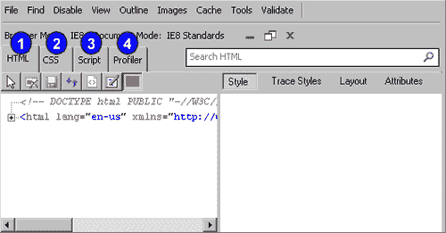

# 第七章：调试工具

> 在本章中，我们将学习一些可以使我们的生活更轻松的调试工具。我们将使用市场上主要浏览器（如 Internet Explorer、Firefox、Google Chrome 和 Safari）提供的调试工具。
> 
> 我明白互联网上有详尽的文档，因此你可以在这一章期待的是我会非常简要地介绍一下特性，然后通过一个简单的例子说明如何利用调试功能让生活变得更轻松。

通常，你会了解到每个浏览器中提到的调试工具的以下主题：

+   获取调试工具的位置和方式

+   如何使用工具调试 HTML、CSS 和 JavaScript

+   高级调试，如设置断点和观察变量

+   如何使用调试工具进行性能分析

那么让我们开始吧。

# IE 8 开发者工具（以及为 IE6 和 7 设计的开发者工具栏插件）

本节我们将重点介绍 Internet Explorer 8 的开发者工具栏。

### 注意

如果你正在使用 Internet Explorer 6 或 7，以下是你如何可以为 Internet Explorer 6 或 7 安装开发者工具栏的方法。

你需要访问 [`www.microsoft.com/downloads/details.aspx?familyid=e59c3964-672d-4511-bb3e-2d5e1db91038&displaylang=en`](http://www.microsoft.com/downloads/details.aspx?familyid=e59c3964-672d-4511-bb3e-2d5e1db91038&displaylang=en) 并下载开发者工具栏。如果你阅读的是这本书的纸质版，无法复制和粘贴上述 URL，那么就谷歌“IE6 或 IE7 的开发者工具栏”，你应该会来到你需要的下载页面。

请注意，上述网页上的工具栏与 Internet Explorer 8 不兼容。

如果你不想单独安装开发者工具，我建议你安装 Internet Explorer 8；IE8 预装了他们的开发者工具，与为 IE6 或 IE7 单独安装开发者工具相比，它更为方便。

从这一刻起，我将涵盖使用 Internet Explorer 8 内置工具的开发者工具。

# 使用 IE 开发者工具

因为我们已经获得了插件，现在是时候通过一个例子来了解它是如何工作的了。我为此章节准备了`source code`文件夹中的示例代码；转到文件夹并在浏览器中打开名为`IE-sample.html`的文件。这个示例基本上要求你输入两个数字，然后对这两个数字进行加法、减法、乘法和除法。结果将显示在表单右侧的框中。

现在给它一个测试，完成后我们开始学习如何使用 IE8 的调试工具调试这个网页。

## 打开

我假设文件仍然在你的浏览器中打开。如果不是，请在浏览器中打开`IE-sample.html`（当然，使用 Internet Explorer）。一旦示例打开，您需要打开调试工具。您可以导航到**工具**，然后点击**开发者工具**。或者，您可以通过按键盘上的*Shift* + *F12*来访问调试工具。

## 用户界面的简要介绍

在我们进入实际的调试过程之前，我将简要关注 IE 调试工具的关键特性。

1.  HTML：**HTML**标签显示您当前查看的脚本或网页的源代码。当你点击这个标签时，你会在右侧得到相关标签，如图所示。

1.  CSS：**CSS**标签显示了当前您正在查看的网页所使用的 CSS 样式表。

1.  脚本：**脚本**标签是您执行 JavaScript 调试任务的地方。当你点击这个标签时，你会得到一些与调试任务相关的特性，比如**控制台、断点、局部变量**和**监视**。

1.  **Profiler**：**Profiler**标签显示了网页的剖析数据，如果您选择进行剖析的话。

## IE 调试工具的基本调试

通常，我们可以用 IE 的调试工具两种方式：

+   在一个单独的窗口中

+   在浏览器内停靠

您可以通过点击调试窗口右上角的钉子图标将调试工具停靠在浏览器内。在我的情况下，我更喜欢将其停靠在我的浏览器中，这样我屏幕上就有更多的查看空间。而且，由于示例代码相当小，将其停靠在您的浏览器上应该就足够了。

通常，调试面板的左侧是 IE 团队所说的**主要内容**面板。这个面板显示了网页的文档对象模型；这个面板让我们从程序化的角度 overview 网页的源代码。

以下是一些使用 IE 调试工具进行调试的基本知识。

# 行动时间——使用 IE8 开发者工具调试 HTML

1.  要检查网页的 HTML 元素，请点击**主要内容面板**中的**HTML**标签。我们可以点击位于**主要内容面板**第一行上的**+**图标。

1.  一旦你点击了**+**图标，你应该会看到`<head>`和`<body>`在`<html>`标签展开后立即出现；再次点击它们将会显示`<head>`和`<body>`标签包含的其他元素。例如，让我们点击具有`id wrap`的`div`元素。

1.  点击`div`元素后，您可以立即看到与`wrap`相关的各种属性，如其父元素、继承的 HTML 和 CSS，以及属于`wrap`的 CSS 属性。

    我们可以通过点击调试窗口中**属性面板**上的各种命令来进一步检查：

    +   **样式**：**样式**命令通过提供适用于选定元素的的所有规则列表，改善了 CSS 的调试。规则按优先级顺序显示；所以最后应用的规则出现在底部，任何被另一个属性覆盖的属性都会被划掉，让你能快速理解 CSS 规则如何影响当前元素，而不需要手动匹配选择器。您可以通过切换规则旁边的复选框，快速开启或关闭 CSS 规则，动作将立即在您的页面上生效。在我们这个案例中，你会看到我们的`#wrap`元素有两个继承：body 和 HTML。你可以通过点击属性值并输入`#eee`，将颜色属性更改为`#eee`。完成后，按下*Enter*，您可以看到变化立即生效。

    +   **追踪样式**：这个命令包含了与**样式**相同的信息，只不过它按照属性对样式进行了分组。如果你正在寻找关于某个特定属性的信息，切换到**追踪样式**命令。只需找到你感兴趣的属性，点击加号（+）图标，就能看到设置该属性的所有规则列表——再次按照优先级顺序排列。

    +   **布局**：**布局**命令提供了盒模型信息，如元素的偏移、高度和内边距。在调试元素的定位时使用这个命令。

    +   **属性**：**属性**命令允许你查看选定元素的的所有定义属性。这个命令还允许你编辑、添加或删除选定元素的属性。

# 行动时间——使用 IE8 开发者工具调试 CSS

现在让我们将注意力重新转移到**主要内容面板**。

1.  点击**CSS**标签，以便我们可以访问所有的 CSS（外部或内部）文件。一旦你这样做，你会看到我们网页上使用的相同的 CSS。

1.  现在我想要你点击**BODY**中的一项样式属性，比如**color**，并将其更改为**#ccc**。你将立即看到我们网页上文本颜色的变化。

## 刚才发生了什么？

我们刚刚完成了调试的基本操作，这为我们提供了在使用 IE 的调试工具调试 JavaScript 之前所需的知识。

我们上面执行的简单例子，就是我们所说的实时编辑源；我们可以编辑任何 HTML 或 CSS 属性，而无需回到我们的源代码，更改它，保存它，然后在浏览器中重新加载文件。在我看来，这样的功能是我们使用调试工具的关键原因之一。

然而，请注意，你所做的更改只存在于 Internet Explorer 对网站的内部表示中。这意味着刷新页面或导航离开会恢复原始网站。

然而，有些情况下你可能想保存更改，为了做到这一点，你可以点击**保存**按钮，将当前的 HTML 或 CSS 保存到文件中。这是为了防止意外覆盖你的原始源代码。

让我们继续学习 JavaScript。

## 调试 JavaScript

现在该学习如何使用 IE 的开发者工具调试 JavaScript 了。

# 行动时间——使用 IE8 开发者工具进行更多 JavaScript 调试

以下是开始调试的步骤：

1.  点击在**主内容面板**中找到的**脚本**标签。

1.  接下来，点击写着**开始调试**的按钮。

1.  点击**开始调试**后，你将拥有一个完整调试器的所有功能。

    如果你希望在调试过程中的任何一点停止调试，请点击**停止调试**。

    现在让我们看看我们可以使用调试工具的各种功能做什么。让我们从第一个开始：设置断点。

    我们通常设置断点以控制执行。在前几章中，我们通常依赖于`alert()`或其他函数来控制程序执行。

    然而，通过使用 IE 的调试工具，你只需设置断点就可以控制程序执行；在这个过程中，你可以节省很多`alert()`，或其他自定义函数。

    现在，让我们通过使用断点来控制执行。

1.  你可以通过右键点击行号并选择**插入断点**来设置断点。在我们的案例中，让我们去包含`buildContent(answerB, "minus")`;的那一行，右键点击它，然后选择**插入断点**。

1.  现在尝试在浏览器中输入一些值到输入字段中。你会看到，动态内容不会在右侧的**黑色正方形**上创建。这是因为代码执行在`buildContent(answerB, "minus")`;处停止了。

    我们通常使用断点来检查变量；我们需要知道我们的代码是否以我们希望的方式执行，以确保它是正确的。现在，让我们看看如何设置断点和检查变量。

    我们通过使用监视功能来检查变量。继续上一个示例，我们可以通过点击监视窗格来使用监视功能。另外，你也可以点击本地变量，它提供了类似的功能，允许我们看到一组变量。这可以用来监视自定义变量列表，也可以检查变量的当前状态。

    要执行我们刚刚描述的操作，我们需要执行以下步骤：

1.  点击**开始调试**，并为包含`var answerA = add(numberA, number)`;和`buildContent(answerA, "add")`;的行设置断点。

1.  现在，运行示例，分别为输入字段输入**5**和**3**。然后点击**提交**。

1.  现在转到你的 **调试器** 面板，点击 **局部变量**。你会看到以下截图的输出：

    +   这个面板显示的是与设置断点的函数相关的局部变量列表

        注意到 **answerA**, **answerB**, **answerC**, 和 **answerD** 目前都是未定义的，因为我们还没有为它们执行任何计算，因为我们已经在 `var answerA = add(numberA, number)` 处设置了断点。

1.  接下来，点击 **监视**。现在你可以添加你想要检查的变量。你可以通过输入变量的名称来实现这一点。输入 **answerA** 和 **numberB**，然后按 *Enter*。你会看到一个类似于以下截图的屏幕：

    +   如前所述，**answerA** 目前还没有定义，因为它还没有被我们的程序计算出来。另外，因为我们已经为 **numberA** 和 **numberB** 输入了值，所以 **numberB** 自然是有定义的。

    ### 注意

    你注意到我们的输入类型不正确了吗？这是因为我们使用了 `.value` 方法来访问输入字段的值。作为一个优秀的 JavaScript 程序员，我们应该使用 `parseFloat()` 将值转换为浮点数。

    +   我们可以在调试模式下继续执行代码（在调试窗口中）通过执行 Continue、Step In、Step Over 和 Step Out 操作。

        我们将快速进入示例，看看 Continue、Step In、Step Over 和 Step Out 是如何工作的。继上面的例子继续：

1.  点击绿色的 **Continue** 按钮，它看起来像一个 "**播放**" 按钮。立即，你会看到代码将执行到下一个断点。这意味着之前未定义的变量现在将被定义。如果你点击 **局部变量**，你会看到类似于下一个截图的输出：

1.  点击 **监视**，你会看到一个类似于下一个截图的屏幕：

    这意味着 Continue 的效果是执行从第一个断点到最后一个断点的代码。如果没有第二个断点，代码将执行到末尾。

    你可能想尝试 Step In、Step Over 和 Step Out。

    通常，它们就是这样做的：

    +   步入（Step In）：这会跟踪代码的执行。例如，您可以执行上述示例中的步骤，只是点击**步入**而不是**继续**。您会注意到，您实际上正在跟踪代码。接下来，您可以查看**局部变量**和**监视**窗口，您会注意到 previously-undefined 变量将在代码执行过程中被定义。

    +   步过（Step Over）：这会直接跳到下一行代码，而不是像步入（Step In）那样跳进其他函数。

    +   步出（Step Out）：这会“步出”当前断点，直到下一个断点。它与**继续**类似。如果您在步入（Step In）之后使用步出（Step Out），它将继续到下一个断点（如果有）。

        现在让我们继续了解下一个有用功能，即在遇到错误时停止代码。

        要启用此功能，您需要点击**在错误时中断**按钮，或者您可以简单地按*Ctrl* + *Shift* + *E*。一旦您开始调试，此功能应该会自动启用。

        这个功能的作用是如果在执行代码时发现任何错误，就停止执行。例如，取消注释说：`buildContent(noSuchThing, "add");` 这行代码，并在调试模式下运行代码。您将在调试窗口的控制台中看到以下屏幕截图：

    

    使用调试器的一个酷炫之处在于，它可以帮助您在运行时发现错误，这样您就可以快速识别您犯的错误。

    现在我们已经对 IE 调试工具的一些更高级功能有了基本的了解和认识，是时候关注我们 JavaScript 程序的性能了。

    Internet Explorer 调试工具附带一个内置分析器，名为 JavaScript 分析器，通过提高性能帮助您的网站达到一个新的水平。

    通常，分析器会为您提供您网站的 JavaScript 方法以及内置 JavaScript 函数中花费的时间数据。这就是如何使用这个功能。

1.  使用浏览器中的示例源代码，打开**开发**工具并点击**分析**标签。然后点击**开始分析**，以开始一个会话。

1.  打开您的浏览器，输入一些示例值。例如，我输入了**5** 和 **3**。输入示例值后，转到您的调试窗口并点击**停止分析**。将显示以下屏幕截图的类似屏幕：

+   请注意，Jscript Profiler 包括每个函数花费的时间（每个函数的名称也给出）。每个函数的使用次数也给出，如计数栏所示。您可能注意到我们每个函数的时间都是 0.00；这是因为我们的示例程序相对较小，所以所需时间接近零。

## 刚才发生了什么？

我们刚刚介绍了 Internet Explorer 的开发者工具，它帮助我们从更流畅的方式执行调试任务。

以防你想知道手动调试与使用调试工具之间的区别，我可以根据经验 safely tell you that the amount of time saved by using a debugging tool alone is a good enough reason for us to use debugging tools.

你可能知道，在为 Internet Explorer 开发时会有各种怪癖；使用其内置的调试工具可以帮助你更有效地找出这些怪癖。

带着这个想法，让我们继续介绍下一个工具。

# Safari 或 Google Chrome 网络检查器和 JavaScript 调试器

在本节中，我们将学习 Safari 和 Google Chrome 中使用的 JavaScript 调试器。尽管两者有相似的代码基础，但存在微妙的差异，因此让我们先了解 Safari 和 Google Chrome 之间的区别。

## Safari 与 Google Chrome 之间的差异

如果你是苹果粉丝，你无疑会认为 Safari 可能是地球上最好的浏览器。然而，Google Chrome 和 Safari 都源自一个名为 WebKit 的开源项目。

Safari 和 Google Chrome 使用不同的 JavaScript 引擎。从**Safari 4.0**开始，Safari 使用了一种名为 SquirrelFish 的新 JavaScript 引擎。Google Chrome 使用 V8 JavaScript 引擎。

然而，在使用 Google Chrome 和 Safari 提供的内置调试器进行 JavaScript 调试时，两者几乎完全相同，甚至界面也很相似。

在接下来的部分，我将使用 Chrome 来解释示例。

## Chrome 中的调试

对于 Google Chrome，我们无需下载任何外部工具即可执行调试任务。调试工具随浏览器本身一起提供。所以现在，我们将看到如何使用`sample.html`开始我们的调试会话。

打开和启用：我们首先需要在 Chrome 中打开和启用调试。在 Google Chrome 中，您可以使用两个工具来帮助您为 Web 应用程序执行调试任务：网络检查器和 JavaScript 调试器。

网络检查器：谷歌浏览器的网络检查器主要用于检查您的 HTML 和 CSS 元素。要使用网络检查器，只需在网页上的任何组件上右键单击即可启动网络检查器。您将能够看到您点击的组件的相关元素和资源，包括 DOM 的层次视图和一个 javascript 控制台。要使用网络检查器，请在谷歌浏览器中打开`example.html`。将鼠标移至侧边栏上写着**列 2**的地方。在**列 2**上右键单击，您将看到一个弹出菜单。选择**检查元素**。一个新的窗口被打开。这就是网络检查器。

现在我们将进入 javascript 调试器。

javascript 调试器：要使用谷歌浏览器的 javascript 调试器，选择**页面菜单**图标，该图标位于**URL**输入字段的右侧，然后单击**开发者** | **调试 javascript 控制台**。你也可以通过按下*Ctrl* + *Shift* + *J* 来启动 javascript 调试器。如果您使用的是 Safari，您需要首先通过点击位于**页面**图标右侧的**显示设置**图标来启用开发者菜单，选择**偏好设置**，然后单击**高级**。在此屏幕上，启用**在菜单栏中显示开发菜单**选项。然后，您可以通过点击**页面**图标并选择**开发者**和**开始调试 javascript**来访问这个菜单栏。这个界面与我们在谷歌浏览器中看到的基本相同。

请注意，打开 javascript 调试器后，您将打开与网络检查器中看到的相同的窗口。然而，现在的默认标签页是**脚本**。在这个标签页中，您可以查看前一小节中提到的我们例子的源代码。

这是我们将要用来执行我们的调试任务的主屏幕。在接下来的会话中，我们将开始做一些基本的调试，让我们的手指稍微脏一些。

如果您已经完成了我们在使用 Internet Explorer 开发者工具的调试会话，您将要执行的大部分任务和行动在概念上应该是相似的。

我们刚刚探索了打开和开始网络检查器和 javascript 调试器的基本操作。现在让我们简要介绍一下用户界面，以便让您跟上进度。

## 用户界面的简要介绍

以下是对您如何在谷歌浏览器调试工具中找到关键功能的简要说明，如图所示：

1.  元素：**元素**标签页显示您当前正在显示的脚本或网页的源代码。当你点击**元素**图标时，你会得到一些相关标签页（如前一个屏幕快照中所示的**计算样式**）。

1.  脚本：**脚本**标签是你将执行你的 JavaScript 调试任务的地方。当你点击**脚本**图标时，你会得到一个与调试相关的功能的列表，比如**监视表达式、调用栈、作用域变量**和**断点**。

1.  配置文件：**配置文件**标签显示了你选择进行配置时网页的配置数据。

# 行动时间—使用 Chrome 进行调试

1.  我们现在将学习如何使用控制台并利用断点来简化我们的调试会话。我们从控制台开始。

1.  控制台基本上显示了你在调试会话中做了什么。我们首先看到如何访问控制台。

1.  首先，在你的 Google Chrome 浏览器中打开`sample.html`文件，如果你还没有这么做的话。一旦你完成了这个，按照以下步骤进行操作，以显示控制台：

1.  打开你的 JavaScript 调试器，通过选择**页面菜单**图标 ，该图标可以在**URL**输入字段的右侧找到，然后前往**开发者** | **调试 JavaScript**。你也可以按*Ctrl* + *Shift* + *J* 启动 JavaScript 调试器。

1.  完成第 4 步后，点击控制台图标，该图标可以在 JavaScript 调试器的底部找到。完成后，你会看到一个类似于以下屏幕截图的屏幕：

    现在我们已经打开了控制台，我们将继续学习调试器的最常用功能。在这个过程中，你也将看到控制台如何记录我们的行动。

    我们现在将继续学习如何设置断点。

    如前所述，设置断点是调试过程的重要部分。所以我们实际调试过程的起点就是设置一个断点。

1.  在 Google Chrome 中打开`sample.html`，开始你的调试器，并确保你处于**脚本**标签。你可以通过点击我们想要设置断点的行号来设置断点。让我们尝试点击包含`buildContent(answerB, "minus")`的行；然后点击行号。你会看到一个类似于以下屏幕截图的屏幕：

    注意现在**第 130 行**有一个蓝色箭头（突出显示的行），在源代码面板的右侧，你会看到断点面板。现在它包含了我们刚刚设置的断点。

1.  运行示例，在浏览器中输入一些值到输入字段中。我希望你在第一个输入字段中输入**4**，在第二个输入字段中输入**3**。然后点击**提交**。你会看到动态内容不会在右边的黑色正方形中创建。这是因为代码已经停止在`buildContent(answerB, "minus")`；.

1.  现在回到你的调试器，你会看到你的源代码右侧下一个屏幕截图，类似于下面的示例：

    你会看到**调用栈**和**作用域变量**现在正在用值填充，而监视表达式没有。我们将在接下来的几段中详细介绍这些内容。但现在，我们首先从**调用栈**和**作用域变量**开始。

    正如上一个屏幕截图所示，当我们执行程序时，**调用栈**和**作用域变量**现在正在用值填充。一般来说，**调用栈**包含了正在执行的函数的序列，而**作用域变量**显示了可用直到断点或执行结束的变量的值。

    当我们点击**提交**按钮时，会发生以下情况：首先执行的是`formSubmit()`函数，在这个函数内部，计算了`var answerA`、`var answerB`、`var answerC`和`var answerD`。这就是**作用域变量**如何用我们的值进行填充的。

    通常，这就是 Google Chrome 中**调用栈**和**作用域变量**的工作方式。现在，让我们关注一下我们心中一直存在的问题，**监视表达式**。

    在解释**监视表达式**之前，最好我们先看看它如何行动。回到上一个屏幕截图，你会注意到此时**监视表达式**还没有被填充。我们现在尝试通过执行以下步骤来填充监视表达式：

1.  刷新你的浏览器，回到你的调试器。

1.  在**监视表达式**面板上，点击**添加**，并输入以下内容：`document.sampleform.firstnumber.value`和`document.getElementById("dynamic")`。

1.  回到你的浏览器，输入**4**和**3**作为输入值。点击**提交**。假设你没有在上一个部分中移除我们设置的断点，你将在**监视表达式**面板上看到下一个屏幕截图中的信息：

    **监视表达式**现在被填充了。`document.sampleform.firstnumber.value`和`document.getElementById("dynamic")`是从我们的 JavaScript 程序中复制的代码行。如果你追踪代码，你会注意到`document.sampleform.firstnumber.value`用于推导第一个输入字段的值，而`document.getElementById("dynamic")`用于引用`div`元素。

    截至目前，你已经理解了**监视表达式**用于检查表达式。你只需要添加你想要看到的表达式，在执行程序后，你将看到该表达式的意思、指向的内容，或者它当前的值。这允许你在程序执行时监视表达式的更新。你不需要完成程序就能看到变量的值。

    现在该转到调试窗口中的继续（Continue）、步进（Step In）、步过（Step Over）和步出（Step Out）操作了。

    这里的概念与我们之前在 Internet Explorer 开发者工具中看到的内容非常相似。如果你想知道执行这些操作的按钮在哪里，你可以发现在**观察表达式（Watch Expression）**面板上方。以下是每个操作的相关概念：

    +   步进（Step In）：这会在代码执行时跟踪代码。假设你仍然在我们的示例中，你可以点击带有向下箭头的图标。你会看到你实际上正在跟踪代码。继续点击**步进（Step In）**，你会看到**作用域变量（Scope Variables）**和**调用栈（Call Stack）**中的值发生变化。这是因为代码的不同点会有各种变量或表达式的不同值。

    +   步出（Step Out）：这仅仅是移动到代码的下一行，而不跳入其他函数，与步进（Step In）类似。

    +   步过（Step Over）：这仅仅是移动到代码的下一行。

        在本节最后，我们将重点介绍如何暂停在异常处。这意味着程序将在遇到问题的那行停止。我们将做什么来看它的实际作用：

1.  打开`sample.html`文件，在编辑器中搜索`buildContent (noSuchThing, "add")`这一行；取消注释它。保存文件并在 Google Chrome 中打开。

1.  打开**调试器**。点击带有暂停标志的按钮 ，该按钮位于**显示控制台（Show Console）**按钮的右侧。这将在遇到错误时使调试器停止执行。

1.  像往常一样，为输入字段输入一些值。点击**提交**。完成后，回到你的调试器，你会看到以下屏幕截图中的信息：

+   如果你启用了暂停异常功能，通常你会得到这种视觉信息。

## 刚才发生了什么？

我们已经介绍了使用 Google Chrome 的基础知识。如果你遵循了之前的教程，你将学会如何使用控制台、设置、步进、步出和越过断点、在异常时暂停以及观察变量。

通过使用上述功能的组合，你将能够快速嗅出并发现不意的 JavaScript 错误。你甚至可以跟踪你的 JavaScript 代码是如何执行的。

在接下来的几节中，你将开始注意到大多数工具都有非常相似的功能，尽管有些可能有不同术语表示相同的功能。

现在该转向另一个工具，即 Opera JavaScript 调试器了。

# Opera JavaScript 调试器（Dragonfly）

Opera 的 JavaScript 调试器被称为 Dragonfly。为了使用它，你所需要做的就是下载最新版本的 Opera；Dragonfly 已经包含在最新版本的 Opera 中。

既然你已经安装了必要的软件，是时候进行调试任务了。

## 使用 Dragonfly

我们首先从我们的`example.html`文件开始。在 Opera 浏览器中打开这个文件。现在我们将了解如何启动 Dragonfly。

### 启动 Dragonfly

要访问 Dragonfly，请转到菜单选项**工具**。选择**高级**，然后点击**开发者工具**。一旦你这样做，Dragonfly 就会出现。像往常一样，我们将从工具的用户界面简介开始。

#### 用户界面简介

以下是我们将使用的一些最重要功能的简要概述，如图所示：

1.  **DOM:** 这个标签页用于检查 HTML 和 CSS 元素

1.  **脚本:** 当我们调试 JavaScript 时使用此标签页

1.  **错误控制台:** 这个标签页在调试 JavaScript 时显示各种错误信息。

我们现在开始调试`example.html`。

# 行动时间—使用 Opera Dragonfly 进行调试

1.  在本节中，我们将学习如何使用 Dragonfly 的调试功能。我们将从设置断点开始。

    这就是我们在 Dragonfly 中设置断点的方法：

1.  在 Opera 中打开`sample.html`，启动 Dragonfly，然后点击**脚本**标签页。您可以通过点击我们想要设置断点的行号来设置断点。让我们尝试转到包含`buildContent(answerB, "minus")`;的行，然后点击行号。

1.  打开你的浏览器，执行`example.html`。输入**5**和**3**作为输入值。点击**提交**按钮。像往常一样，你不会看到任何动态生成的内容。程序的断点在包含`buildContent(answerB, "minus")`;的位置。

1.  现在回到龙 fly，你会注意到**调用堆栈**和**检查**面板现在已填充。如果你输入与我相同的值，你应该会看到与下一个截图相似的值：

+   在**检查**和**调用堆栈**中显示的值是在断点之前的计算和执行的值和函数。

## 刚才发生了什么？

我们刚刚使用 Dragonfly 设置了一个断点，当我们执行我们的 JavaScript 程序时，我们看到了 Dragonfly 的各种字段是如何填充的。现在我们将详细介绍每个字段。

## 检查和调用堆栈

如前一个截图所示，当我们执行程序时，**调用堆栈**和**检查**会填充值。一般来说，**调用堆栈**显示特定函数调用时的运行时环境性质—已经调用了什么，以及以什么顺序调用。检查面板列出了当前调用的所有属性值及其他信息。堆栈帧是**调用堆栈**中的特定部分。检查的概念与在 Google Chrome 中看到的**作用域变量**相似。

## 线程日志

线程日志：这个面板显示了穿过你当前正在调试的脚本的各个线程的详细信息。

现在我们将继续深入了解龙翼的功能。

## 继续、步入、单步跳过、单步跳出和错误停止

我们还可以在调试代码时执行通常的继续、步入、单步跳过和单步跳出的任务。下面是一个截图，显示我们如何找到前面提到的功能：

1.  继续：在停止在断点后继续当前选中的脚本。如果有的话，这将继续到下一个断点，或者它将继续到脚本的末尾。

1.  步入：这允许你在包含断点的当前函数之后的下一个函数中步入。它有效地追踪代码的执行。假设你仍然在我们的示例中，你可以点击带有向下箭头的**步入**图标。你会发现你实际上正在追踪代码。继续点击**步入**，你会看到**检查**和**调用栈**中的值发生变化。这是因为代码的不同点会有各种变量或表达式的不同值。

1.  单步跳过：这允许你在设置断点的行之后跳到下一行——你可以多次使用这个功能来跟随脚本的执行路径。

1.  单步跳出：这将使你跳出函数。

1.  错误停止：这允许你在遇到错误时停止执行你的脚本。为了看到这个功能，请在你的编辑器中打开`example.html`文件，并查找写着`buildContent(noSuchThing, "add")`的行；然后取消注释。保存文件，然后再次使用 Opera 打开它。打开龙翼，点击图标。现在在 Opera 中执行你的程序并输入一些示例值。完成后，你将在龙翼中看到以下截图：

注意，在**46**行有一个指向右边的黑色箭头。这意味着这行代码有一个错误。

在我们结束龙翼节段之前，我们再来看一个重要的功能：设置功能。

## 设置

OPERA 的龙翼有一个让我们为我们的调试任务创建不同设置的巧妙功能。这一系列设置很多，所以我不会全部介绍。但我将重点介绍那些对你的调试会话有用的设置。

+   脚本：在这个面板中，选中窗口后自动重新加载文档是一个巨大的时间节省功能，尤其是当你有多个 JavaScript 文件需要调试时，因为它将帮助你自动重新加载文档。

+   控制台：此面板允许你在调试会话中控制你想看到的信息。从 XML 到 HTML，你可以启用或禁用消息，以看到最重要的信息。

有了这个，我们将结束 Dragonfly 部分，继续学习 Firefox 和 Venkman 扩展。

# Firefox 和 Venkman 扩展

我们知道 Firefox 有很多插件和工具，其中一些是专为网页开发而设计的。在本节中，我们将学习 Mozilla 的 JavaScript 调试器 Venkman 扩展。

## 使用 Firefox 的 Venkman 扩展

我们将先获得扩展；我们将假设您已经安装了 Firefox。在我的情况下，我正在使用 Firefox 3.6.3。

### 获得 Venkman JavaScript 调试器扩展

为了获得 Venkman JavaScript 调试器扩展，请前往[`addons.mozilla.org/en-US/Firefox/addon/216/`](http://https://addons.mozilla.org/en-US/Firefox/addon/216/)并点击**添加到 Firefox**。安装后，Firefox 将提示您重新启动 Firefox 以使更改生效。

### 打开 Venkman

为了开始调试，让我们在 Firefox 中打开文件`example.html`。在这里，我们可以现在开始 Venkman。点击**工具**并选择**JavaScript 调试器**。如果你使用的是 Firefox 的旧版本，可以通过前往**工具** | **网页开发** | **JavaScript 调试器菜单**来访问它。

现在我们将对 Venkman 的用户界面进行简要介绍。

### 用户界面的简要介绍

下一张截图显示了 Venkman 扩展的用户界面：

1.  已加载脚本：**已加载脚本**面板显示了您可以用于调试的脚本列表。加载脚本后，你将在**源代码**面板中看到它。

1.  局部变量和观察：**局部变量**面板显示在执行调试任务时可用的局部变量。如果您点击**观察**标签，您将看到**观察**面板。您将使用这个来输入您想要观察的表达式。

1.  断点和调用堆栈：**断点**面板允许您添加一系列断点，而**调用堆栈**面板按顺序显示执行的函数或变量。

1.  源代码：**源代码**面板显示您当前正在调试的源代码。

1.  互动会话：**互动会话**面板是此调试器的控制台。

现在我们将使用 Venkman 扩展开始调试：

# 是时候行动了——使用 Firefox 的 Venkman 扩展进行调试

我们将先设置断点，然后再详细说明：

与其他所有调试器一样，我们可以通过以下步骤设置断点：

1.  首先，在 Firefox 中打开文件`example.html`。

1.  打开 JavaScript 调试器，调试器窗口将显示出来。

1.  当你看到调试器窗口时，转到**加载脚本**面板，你将在其中看到文件`example.html`。点击它，你将在**源代码**面板上看到代码被加载。

1.  设置断点时，点击你想要设置断点的行。例如，我在包含以下代码的行**130**上设置了断点：`buildContent(answer, "minus")`；你应该会看到类似以下截图的内容：

## 刚才发生了什么？

首先要注意的是，在之前的截图中，有一个**白色 B**在一个红色矩形内。这表示已经设置了一个断点。

在 Venkman 中，有时你会看到一个**白色 F**在一个黄色盒子内；这表示 Venkman 只能设置一个未来的断点。当你的选择行没有源代码，或者如果该行代码已经被 JavaScript 引擎卸载（顶级代码有时在执行完成后不久就会被卸载）。

未来断点意味着 Venkman 现在无法设置一个硬断点，但如果文件稍后加载，并且在选择的行号有可执行代码，Venkman 将自动设置一个硬断点。

要关注的第二件事是**断点**面板。这个面板包含了我们在这个调试会话中设置的所有断点。

现在，在我们将要进入以下小节之前，我需要你通过打开浏览器输入我们示例应用程序的输入。在我的案例中，我在第一个和第二个输入框中分别输入了**5**和**3**。完成输入后，点击**提交**。

再次，你会注意到原来空白的面板现在充满了值。我们将在以下小节中介绍这个。

## 断点或调用栈

在前一个小节中我们已经简要介绍了断点。如果你看看**断点**面板，你会注意到在那个面板的右侧，有一个名为**调用栈**的标签页。

点击**调用栈**，你应该在这个新面板中看到一些数据。假设你已经输入了相同的输入和同样的断点，你会看到一个与下一个截图示例相似的屏幕：

通常，**调用栈**显示了在特定函数调用时的运行环境性质—调用什么，以及调用顺序。在 Venkman 中，它显示函数名、文件名、行号和 pc（程序计数器）。

## 局部变量和监视器

现在让我们关注**局部变量**和**监视器**。**局部变量**和**监视器**的面板位于**断点**和**调用栈**面板之上。如果你一直按照我的指示操作，并且输入完全相同的输入，你应在**局部变量**面板中看到以下内容：

**本地变量** 面板简单地显示了具有值（由于代码执行）的变量的值，直到断点，或者程序结束，根据它们创建或计算的顺序。

我们想要讨论的下一个面板是 **Watches** 面板。**Watches** 面板的作用和我们之前为其他浏览器做的 watch 表达式一样。然而，因为我们还没有为 **Watches** 面板添加任何内容，所以让我们采取一些行动来看看 **Watches** 面板是如何工作的：

# 是时候行动了——使用 Venkman 扩展进行更多调试

在本节中，我们将介绍更多的调试功能，比如观察、停止、继续、单步进入、单步跳过、单步退出、边缘触发和抛出触发。但首先，让我们执行以下步骤，以便看到 **Watches** 面板的实际作用：

1.  点击 **Watches** 标签。

1.  在 **Watches** 面板内部右键点击，选择 **添加观察**。

1.  输入 `document.sampleform.firstnumber.value`。

1.  重复步骤 2 和 3，这次输入 `document.getElementById("dynamic")`。

    完成后，你会看到以下屏幕截图的输出：

    

    **Watches** 面板的作用是允许我们添加一个表达式列表，以便我们跟踪这些表达式，并且还能显示这些表达式的值。

    现在让我们来看看停止和继续功能。

    Venkman 提供了一些有用的功能，包括停止和继续。停止功能基本上会在下一个 JavaScript 语句处停止，而继续功能则继续代码的执行。

    你可以让 Venkman 在下一行 JavaScript 语句处停止。

1.  点击工具栏上较大的红色 **X**，或者你可以去菜单选择 **调试**，然后选择 **停止**。

    有时没有执行 JavaScript。如果出现这种情况，你会在工具栏上的 **X** 上看到省略号（...），菜单项会被勾选。当遇到下一行 JavaScript 时，调试器将停止。你可以通过点击 **X** 或再次选择 **停止** 来取消这个操作。

    除了停止和继续功能，Venkman 还提供了标准的单步进入、单步跳过和单步退出功能。

    +   单步执行：这会执行一行 JavaScript 代码，然后停止。你可以通过点击写着 **Step Into** 的图标来尝试这个功能。如果你多次点击它，你会注意到局部变量在变化，你将能够看到代码被执行的情况，就像你在追踪代码一样。

    +   单步跳过：用于跳过即将到来的函数调用，并在调用返回时将控制权返回给调试器。如果你点击 **单步跳过**，你会发现新内容正在你的浏览器中创建。对于文件 `example.html`，假设你从断点点击 **单步跳过**，你会看到内容是从 `buildContent(answer, "minus")` 创建的；。

    +   步出：执行直到当前函数调用退出。

        我们将看到如何使用错误触发器和抛出触发器。

        错误触发器用于让 Venkman 在下一个错误处停止，而抛出触发器用于让 Venkman 在下一个异常抛出时停止。

        为了看到它的实际效果，我们将执行以下操作：

1.  在你的编辑器中打开`example.html`文件，再次搜索到`buildContent(noSuchThing, "add")`这一行，并取消注释。保存文件后再次打开，使用 Firefox。

1.  在 Firefox 中打开文件后，打开 Venkman。

1.  一旦你打开了 Venkman，点击**调试**|**错误触发器**，选择**在错误处停止**。然后，再次点击**调试**|**抛出触发器**，选择**在错误处停止**。

1.  打开你的浏览器，为输入字段输入任意两个数字——比如说分别是**5**和**3**。点击**提交**。

1.  返回 Venkman，你会发现`buildContent(noSuchThing, "add")`这一行被突出显示，在交互式会话（或控制台）面板中，你会看到一个错误信息，写着**X 错误。noSuchThing 未定义**。

    既然我们已经看到了 Venkman 在遇到错误时如何停止我们的程序，现在让我们转到它的剖析功能。

    正如我们在前一章节中提到的，剖析是用来测量脚本的执行时间的。要启用剖析：

1.  点击工具栏上的**剖析**按钮。当剖析被启用时，你会在工具栏按钮上看到一个绿色的勾选标记。

1.  一旦你启用了剖析，打开你的浏览器并输入一些示例值。我还是用**5**和**3**吧。然后点击**提交**。

1.  回到 Venkman，点击**文件**，选择**另存为配置数据**。我已经包含了一个例子，展示了我们刚刚做了什么，并将其保存为`data.txt`文件。你可以打开这个文件，查看剖析会话的内容。你可以在`data.txt`文件中通过搜索`example.html`来找到`sample.html`的剖析数据。

1.  完成剖析后，点击**剖析**再次停止收集数据。

    在剖析被启用时，Venkman 将为每个调用的函数收集调用次数、最大调用持续时间、最小调用持续时间和总调用持续时间。

    你也可以使用**清除剖析数据**菜单项清除所选脚本的剖析数据。

## 刚才发生了什么？

我们已经介绍了 Venkman 扩展的各种功能。像停止、继续、步进、步出和断点步进这些功能，在现阶段对你来说应该不再陌生，因为它们与我们之前介绍的工具概念上是相似的。

那么现在让我们转移到最后一个工具，Firebug 扩展程序。

# Firefox 和 Firebug 扩展程序

我个人认为 Firebug 扩展无需进一步介绍。它可能是市场上最受欢迎的 Firefox 调试工具之一（如果不是最流行的话）。Firebug 是免费和开源的。

它具有以下功能：

+   通过在网页上点击和指向来检查和编辑 HTML

+   调试和分析 JavaScript

+   快速发现 JavaScript 错误

+   记录 JavaScript

+   执行飞行的 JavaScript

Firebug 或许是互联网上最好的文档化调试工具之一。所以我们将查看你可以访问的 URL，以便利用这个免费、开源且强大的调试工具：

+   要安装 Firebug，请访问：[`getFirebug.com`](http://getFirebug.com)

+   要查看完整的常见问题解答列表，请访问：[`getFirebug.com/wiki/index.php/FAQ`](http://getFirebug.com/wiki/index.php/FAQ)

+   要查看完整的教程列表，请访问：[`getFirebug.com/wiki/index.php/Main_Page`](http://getFirebug.com/wiki/index.php/Main_Page)。如果你希望了解更多关于每个特定功能的信息，请在网页的左侧寻找**面板**。

# 总结

我们终于到了本章的结尾。我们已经介绍了可用于我们的调试任务的各个浏览器的特定工具。

具体来说，我们已经介绍了以下主题：

+   用于 Internet Explorer 的开发者工具

+   Google Chrome 和 Safari 的 JavaScript 调试器和 Web 检查器

+   Opera 的 Dragonfly

+   Firefox 的 Venkman 扩展

+   Firebug 资源

如果你需要更多关于每个特定工具的信息，你可以通过在本书中提到的工具和功能后添加关键词“教程”来使用 Google 搜索。

我们已经介绍了可以帮助你开始调试 JavaScript 应用程序的工具的最重要功能。在我们最后一章中，我们将重点介绍各种测试工具，这些工具可以在你的测试需求不能手动满足时使用。
