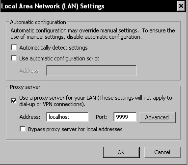
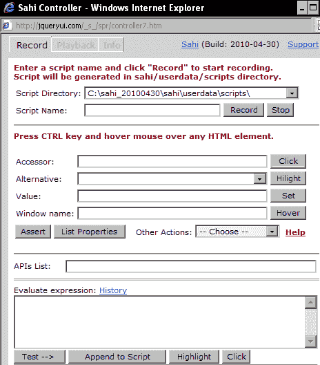
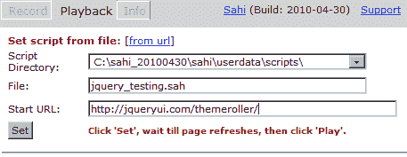
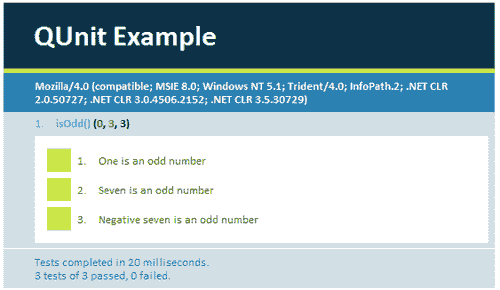
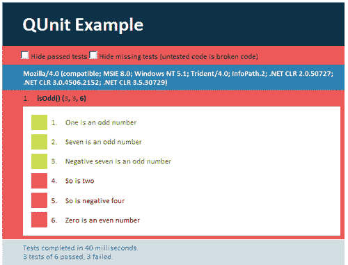
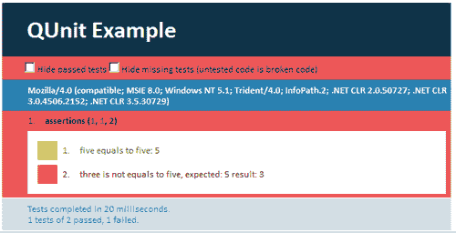
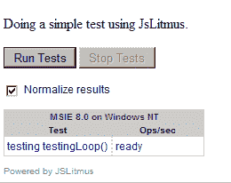
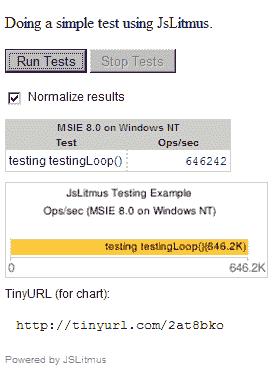

# 第八章：测试工具

> 在最后一章中，我们将介绍一些高级工具，您可以使用它们来测试您的 JavaScript。我们将介绍一些可以帮助您进一步自动化测试和调试任务的工具，并向您展示如何测试您的用户界面。
> 
> 我理解您有很多选择，因为市面上有很多可供您选择用于测试任务的工具。但我会关注那些通常免费、跨浏览器和跨平台的工具；您是 Safari、IE、Chrome 或其他浏览器的粉丝并不重要。根据[`w3schools.com/browsers/browsers_stats.asp`](http://w3schools.com/browsers/browsers_stats.asp)，大约 30%的网页浏览器使用 Internet Explorer，46%使用 Firefox 浏览器，其余的使用 Chrome、Safari 或 Opera。这意味着您使用的工具将满足这些统计数据。尽管有些应用程序是为只有一个浏览器开发的，但我们学习如何为不同的浏览器编写代码是一个好的实践和学习经验。
> 
> 更重要的是，我将详细介绍的工具是我个人认为更容易上手的工具；这将帮助您对测试工具有一个大致的了解。

以下工具将详细介绍：

+   Sahi 是一个跨浏览器自动化测试工具。我们将用它来执行 UI 测试。

+   QUnit 是一个 JavaScript 测试套件，可以用来测试几乎任何 JavaScript 代码。我们将用它来执行 JavaScript 代码的自动化测试。

+   JSLitmus，一个用于创建即兴 JavaScript 基准测试的轻量级工具。我们将使用这个工具进行一些基准测试。

除了前面提到的工具，我还将介绍一些重要的测试工具，我认为这些工具对您的日常调试和测试任务很有用。所以，一定要查看这一部分。

# Sahi

我们简要讨论了测试由 JavaScript 库提供的用户界面小部件的问题。在本节中，我们将开始测试使用 JavaScript 库小部件构建的用户界面。同样的技术也可以用于测试自定义用户界面。

Sahi 是一个使用 Java 和 JavaScript 的浏览器无关的自动化测试工具。我们将关注这个工具，因为它与浏览器无关，我们不能总是忽视 IE 用户。

Sahi 可以用来执行各种测试任务，但我想要强调的一个功能是它能够记录测试过程并在浏览器中回放。

您将看到使用 Sahi 执行用户界面测试是多么有用。

# 行动时间—使用 Sahi 进行用户界面测试

我们将向您展示 Sahi 的记录和回放功能，并了解如何使用它来测试由 JavaScript 库（如 jQuery）提供的用户界面小部件。

1.  我们首先安装 Sahi。访问[`sahi.co.in`](http://sahi.co.in)并下载最新版本。在我写下这段文字的时候，最新版本是 V3 2010-04-30。下载后，解压到`C:`驱动器。

1.  打开 Internet Explorer（我在这篇教程中使用的是 IE8），然后访问[`jqueryui.com/themeroller/`](http://jqueryui.com/themeroller/)。我们将使用这个用户界面进行演示。

1.  为了使用 Sahi，我们需要首先导航到`C:\sahi_20100430\sahi\bin`并查找`sahi.bat`。点击它，这样我们就可以启动 Sahi。

1.  现在，是时候设置你的浏览器，以便它能与 Sahi 一起使用。打开你的浏览器，前往**工具** | **Internet 选项** | **连接**，然后点击**局域网设置**。点击**代理服务器**并输入以下屏幕截图中的信息:

    完成操作后，关闭此窗口以及与工具相关的所有其他窗口。

1.  完成上一步后，让我们回到浏览器中。为了在浏览器中使用 Sahi，你需要按*Ctrl* + *Alt*，同时双击网页上的任何元素（[`jqueryui.com/themeroller/`](http://jqueryui.com/themeroller/)）。你应该看到一个新的窗口，如下下一个屏幕截图所示:

1.  如果你看到了上面截图中的窗口，那么你已经正确设置了并启动了 Sahi。现在，让我们来了解它的自动化测试功能，记录和回放功能。

1.  在**脚本名称**输入字段中输入**jquery_testing**，然后在显示在前一个屏幕截图中的窗口中点击**记录**。这将开始记录过程。

1.  现在，让我们点击几个用户界面元素。在我的情况下，我点击了**第二部分，第三部分，打开对话框**和**字体设置**。这可以在左侧菜单找到。

1.  导航到`C:\sahi_20100430\sahi\userdata\scripts`，你会看到一个名为`jquery_testing.sah`的文件。用 WordPad 打开这个文件，你将看到我们刚刚创建的行动列表，记录在这个文件中。

1.  进入 Sahi 窗口，点击**停止**。现在，我们已经停止了记录过程。

1.  在 WordPad 中打开`jquery_testing.sah`，并更改代码，使其如下所示：

    ```js
    function jquery_testing() {
    _click(_link("Section 2"));
    _click(_link("Section 2"));
    _click(_link("Section 3"));
    _click(_link("Section 3"));
    _click(_link("Open Dialog"));
    _click(_link("Font Settings"));
    }
    jquery_testing();

    ```

    我定义了一个名为`jquery_testing()`的函数来包含我们创建的行动列表。然后，我把`jquery_testing()`添加到文件的末尾。这一行是为了在我们激活回放功能时调用这个函数。

1.  现在让我们进入 Sahi 窗口，点击**回放**。然后，输入如下下一个屏幕截图中的信息:

    点击**设置**，等待页面刷新。

1.  页面刷新后，点击**播放**。在浏览器中，我们将看到我们执行的操作按照前面提到的步骤重复进行。您还将在 **声明** 面板中收到一个 **成功** 消息，这意味着我们的测试过程是成功的。

## 刚才发生了什么？

我们刚刚使用 Sahi 完成了一个简单的用户界面测试过程。Sahi 的回放过程和记录功能使我们能够轻松地测试用户界面。

请注意，Sahi 允许我们以视觉方式进行测试。与前面章节中看到的其他手动测试方法相比，除了为回放功能定义一个函数外，并没有太多编码工作。

现在，让我们关注与 Sahi 相关的其他重要且相关的话题。

## 使用 Sahi 进行更复杂的测试

如本节开头所述，Sahi 可以与任何浏览器一起使用，执行各种任务。它甚至可以用来进行断言测试。

查看[`sahi.co.in/static/sahi_tutorial.html`](http://sahi.co.in/static/sahi_tutorial.html)，了解如何在您的测试过程中使用断言。

### 注意

在本节结束后，请确保您回到**工具** | **Internet 选项** | **连接**，点击 LAN 设置，取消勾选**代理服务器**，以便您的浏览器可以像往常一样工作。

# QUnit

QUnit 是一个 jQuery 测试套件，但它可以用来测试我们编写的 JavaScript 代码。这意味着代码不必依赖于 jQuery。通常，QUnit 可以用来进行断言测试和异步测试。此外，断言测试有助于预测您代码的返回结果。如果预测失败，那么您的代码中很可能会出错。异步测试简单地指的是同时测试 Ajax 调用或函数。

让我们立即行动来看看它是如何工作的。

# 是时候进行行动测试 JavaScript with QUnit

在本节中，我们将更深入地了解 QUnit，通过编写一些代码，也学习 QUnit 支持的各种测试。我们将编写正确的测试和错误的测试，以了解它是如何工作的。本节的源代码可以在 `source code` 文件夹的 `qunit` 中找到。

1.  打开您的编辑器，将文件保存为 `example.html`。在其中输入以下代码：

    ```js
    <!DOCTYPE html>
    <html>
    <head>
    <title>QUnit Example</title>
    <link rel="stylesheet" href="http://github.com/jquery/qunit/raw/master/qunit/qunit.css" type="text/css" media="screen">
    <script type="text/javascript" src="img/qunit.js"></script> 
    <script type="text/javascript" src="img/codeToBeTested.js"></script>
    <script type="text/javascript" src="img/testCases.js"></script>
    </head>
    <body>
    <h1 id="qunit-header">QUnit Test Results</h1>
    <h2 id="qunit-banner"></h2>
    <div id="qunit-testrunner-toolbar"></div>
    <h2 id="qunit-userAgent"></h2>
    <ol id="qunit-tests"></ol>
    </body>
    </html>

    ```

    之前的代码所做的就是简单地为测试设置代码。注意突出显示的行。前两行 simply point to the hosted version of the QUnit testing suite (both CSS and JavaScript)，最后两行是您的 JavaScript 代码和测试用例所在的地方。

    `codeToBeTested.js` 只是指您编写的 JavaScript 代码，而 `testCases.js` 是您编写测试用例的地方。在接下来的步骤中，您将看到这两个 JavaScript 文件是如何一起工作的。

1.  我们将从在`codeToBeTested.js`中编写代码开始。创建一个 JavaScript 文件，并将其命名为`codeToBeTested.js`。首先，我们将编写一个简单的函数，用于测试输入的数字是否是奇数。带着这个想法，输入以下代码：

    ```js
    codeToBeTest.js:
    function isOdd(value){
    return value % 2 != 0;
    }

    ```

    `isOdd()`接收一个参数值，并检查它是否是奇数。如果是，这个函数将返回 1。

    现在让我们为我们的测试用例编写一段代码。

1.  创建一个新的 JavaScript 文件，并将其命名为`testCases.js`。现在，将其输入以下代码：

    ```js
    test('isOdd()', function() {
    ok(isOdd(1), 'One is an odd number');
    ok(isOdd(7), 'Seven is an odd number');
    ok(isOdd(-7), 'Negative seven is an odd number');
    })

    ```

    注意我们使用 QUnit 提供的方法编写测试用例的方式。首先，我们定义一个函数调用`test()`，它构建了测试用例。因为我们要测试`isOdd()`函数，所以第一个参数是一个将在结果中显示的字符串。第二个参数是一个包含我们断言的回调函数。

    我们使用断言语句，通过使用`ok()`函数。这是一个布尔断言，它期望它的第一个参数为真。如果是真，测试通过，如果不是，测试失败。

1.  现在保存所有你的文件，并在你喜欢的任何浏览器中运行`example.html`。根据你的机器，你会收到一个类似于以下示例的屏幕截图：

    通过点击`isOdd()`，你可以查看测试的详细信息，并将看到它的结果。输出如前一个屏幕截图所示。

    现在让我们模拟一些失败的测试。

1.  回到`testCases.js`，在`test()`的最后一行添加以下代码：

    ```js
    // tests that fail
    ok(isOdd(2), 'So is two');
    ok(isOdd(-4), 'So is negative four');
    ok(isOdd(0), 'Zero is an even number');

    ```

    保存文件并刷新你的浏览器。你现在将在浏览器中看到一个类似于以下示例的屏幕截图：

    

现在你可以看到测试**4, 5**和**6**失败了，它们是红色的。

在这个时候，你应该看到 QUnit 的好处在于，它很大程度上自动化了我们的测试过程，我们不需要通过点击按钮、提交表单或使用`alert()`来进行测试。使用这样的自动化测试无疑可以节省我们大量的时间和精力。

## 刚才发生了什么？

我们刚刚使用了 QUnit 对自定义的 JavaScript 函数进行了自动化测试。这是一个简单的例子，但足以让你入门。

## 在现实生活中的 QUnit 应用

你可能想知道如何在现实生活中的情况下使用这些测试来测试你的代码。我会说，你很可能会用`ok()`来测试你的代码。例如，你可以测试真值，如果用户输入是字母数字，或者用户输入了无效值。

## 各种情况的断言测试更多

另一个你可以注意的事情是`ok()`并不是唯一你可以执行的断言测试。你还可以执行其他测试，比如比较断言和相同断言。让我们看一个关于比较的短例子。

在本节中，我们将学习使用另一个断言语句，`equals()`。

1.  打开你的编辑器，打开`testCases.js`。注释掉你之前写的代码，并在文件中输入以下代码：

    ```js
    test('assertions', function(){
    equals(5,5, 'five equals to five');
    equals(3,5, 'three is not equals to five');
    })

    ```

    这段代码与您注释掉的代码具有相同的结构。但是请注意，我们使用的是`equals()`函数而不是`ok()`。`equals()`函数的参数如下：

    +   第一个参数是实际值

    +   第二个参数是期望的值

    +   第三个参数是自定义消息

    我们使用了两个`equals()`函数，其中第一个测试将通过，但第二个不会，因为三和五不相等。

1.  保存文件并打开`example.html`在浏览器中。你会看到以下截图：

# JSLitmus

根据 JSLitmus 主页的介绍，JSLitmus 是一个用于创建临时 JavaScript 基准测试的轻量级工具。在我看来，这绝对是正确的。使用 JSLitmus 非常简单，尤其是当它支持所有流行浏览器，如 Internet Explorer、Firefox、Google Chrome、Safari 等时。同时，它完全免费，包含我们在这里提到的产品。

在本节中，我们将快速举一个例子，展示如何创建临时 JavaScript 基准测试。

# 行动时刻—创建临时 JavaScript 基准测试

现在我们将看到使用 JSLitmus 创建临时 JavaScript 基准测试是多么简单。但首先，让我们安装 JSLitmus。顺便说一下，本节的所有源代码可以在本章的`source code`文件夹中找到，在`jslitmus`文件夹下。

1.  访问[`www.broofa.com/Tools/JSLitmus/`](http://www.broofa.com/Tools/JSLitmus/) 并下载`JSlitmus.js`。

1.  打开你的编辑器，在`JSLitmus.js`相同的目录下创建一个名为`jslitmus_test.html`的新 HTML 文件。

1.  将以下代码输入`jslitmus_test.html:`

    ```js
    <!DOCTYPE html PUBLIC "-//W3C//DTD XHTML 1.0 Transitional//EN"
    "http://www.w3.org/TR/xhtml1/DTD/xhtml1-transitional.dtd">
    <html  xml:lang="en" lang="en">
    <head>
    <meta http-equiv="Content-Type"
    content="text/html;charset=utf-8" />
    <title>JsLitmus Testing Example</title>
    <script type="text/javascript" src="img/JSLitmus.js"></script>
    <script type="text/javascript">
    function testingLoop(){
    var i = 0;
    while(i<100)
    ++i;
    return 0;
    }
    JSLitmus.test('testing testingLoop()',testingLoop);
    </script>
    </head>
    <body>
    <p>Doing a simple test using JsLitmus.</p>
    <div id="test_element" style="overflow:hidden; width: 1px;
    height:1px;"></div>
    </body>
    </html>

    ```

    实际上，我这段代码是从 JSLitmus 官网提供的官方示例中摘取的。我会以稍微不同于官方示例的方式进行测试，但无论如何，它仍然展示了我们如何使用 JSLitmus 的语法。

    上面的代码片段包含了用户定义的函数`testingLoop()`，而`JSLItmus.test('testing testingLoop()', testingLoop);`是用 JSlitmus 的语法测试`testingLoop()`的 JavaScript 代码行。

    让我解释一下语法。通常，我们是这样使用 JSLitmus 的：

    ```js
    JSlitmus.test('some string in here', nameOfFunctionTested);

    ```

    第一个参数是你可以输入的字符串，第二个参数是你打算测试的函数的名称。只需确保这段代码位于你的函数定义之后的地方。

1.  现在我们已经设置了我们的测试，是时候运行它，看看结果如何。保存`jslitmus_test.html`并在浏览器中打开这个文件。你应该在浏览器中看到以下内容：

    注意在测试列下，它显示了我们作为`JSLItmus.test()`的第一个参数输入的文本。

1.  点击**运行测试**按钮。你应该在浏览器中收到以下结果：

+   它基本上显示了执行代码所需的时间和其他相关信息。你甚至可以通过访问动态生成的 URL 来查看图表形式的性能。如果你收到了与之前截图类似的的东西，那么你已经完成了一个即兴基准测试。

### 注意

如果你在 Internet Explorer 上运行此测试，并且恰好收到以下（或类似）信息：“**脚本执行时间过长**”，那么你需要调整你的 Windows 注册表，以便允许测试运行。访问[`support.microsoft.com/default.aspx?scid=kb;en-us;175500`](http://support.microsoft.com/default.aspx?scid=kb;en-us;175500)以了解如何调整你的 Windows 注册表设置。

## 刚才发生了什么？

我们刚刚使用 JSLitmus 创建了一个即兴基准测试。注意使用 JSLitmus 执行即兴基准测试是多么简单。JSLitmus 的酷之处在于它的简单性；没有其他工具，没有需要打开的窗口等等。你所需要做的就是编写`JSLItmus.test()`并输入你想测试的函数的信息和名称。

## 使用 JSLitmus 进行更复杂的测试

上面的例子是一个非常简单的例子，帮助你入门。如果你对执行更复杂的测试感兴趣，可以随意查看[`www.broofa.com/Tools/JSLitmus/demo_test.html`](http://www.broofa.com/Tools/JSLitmus/demo_test.html)并查看其源代码。你将看到使用 JSLitmus 的不同风格的测试，在其带有注释的源代码中。

现在我们已经介绍了与浏览器无关的工具，是时候快速介绍其他类似的测试工具，这些工具可以帮助你调试 JavaScript。

# 你应该查看的其他测试工具

现在我们即将结束这一章节，我会留给你一个简单的测试工具列表，你可以查看用于测试目的：

+   塞利姆（Selenium）：**Selenium**是一个自动化测试工具，只能记录在 Firefox 上，并且在其他浏览器中回放时可能会超时。还有其他版本的 Selenium 可以帮助你在多个浏览器和平台上进行测试。Selenium 使用 Java 和 Ruby。获取更多信息，请访问[`seleniumhq.org`](http://seleniumhq.org)。要查看一个简单的介绍，请访问[`seleniumhq.org/movies/intro.mov`](http://seleniumhq.org/movies/intro.mov)。

+   Selenium Server：也称为 Selenium 远程控制，**Selenium Server**是一个允许你用任何编程语言编写自动化 Web 应用程序 UI 测试的工具，针对任何 HTTP 网站，使用任何主流的 JavaScript 支持浏览器。你可以访问[`seleniumhq.org/projects/remote-control/`](http://seleniumhq.org/projects/remote-control/)。

+   Watir：**Watir**是一个作为 Ruby 宝石的自动化测试工具。Watir 有详细的文档，可以在[`wiki.openqa.org/display/WTR/Project+Home`](http://wiki.openqa.org/display/WTR/Project+Home)找到。

+   **断言单元框架**：**断言单元框架**是一个基于断言的单元测试框架。截至编写本文时，文档似乎有限。但是你可以通过访问[`jsassertunit.sourceforge.net/docs/tutorial.html`](http://jsassertunit.sourceforge.net/docs/tutorial.html)来学习如何使用它。你可以访问[`jsassertunit.sourceforge.net/docs/index.html`](http://jsassertunit.sourceforge.net/docs/index.html)获取其他相关信息。

+   **JsUnit**是一个从最流行的 Java 单元测试框架 JUnit 移植过来的单元测试框架。JsUnit 包括一个平台，用于在不同的浏览器和不同的操作系统上自动执行测试。你可以在[`www.jsunit.net/`](http://www.jsunit.net/)获得 JsUnit。

+   FireUnit：**FireUnit**是一个设计在 Firebug 中运行的 Firefox 单元测试框架。它也是 Firefox 的一个流行调试工具，网上有大量的关于它的教程和文档。你可以在[`fireunit.org/`](http://fireunit.org/)获得 FireUnit。

+   JSpec：**JSpec**是一个使用自定义语法和预处理器的 JavaScript 测试框架。它还可以以多种方式使用，例如通过终端，通过浏览器使用 DOM 或控制台格式化器，等等。你可以在[`visionmedia.github.com/jspec/`](http://visionmedia.github.com/jspec/)获得 JSpec。

+   TestSwarm：**TestSwarm**为 JavaScript 提供分布式、持续集成测试。它最初是由 John Resig 为支持 jQuery 项目而开发的，现在已成为官方 Mozilla 实验室项目。请注意，它仍然处于严格测试中。你可以在[`testswarm.com/`](http://testswarm.com/)获得更多信息。

# 总结

我们已经终于完成了这一章的结尾。我们覆盖了可用于我们调试任务的各个浏览器的特定工具。

具体来说，我们涵盖了以下主题：

+   Sahi：一个使用 Java 和 JavaScript 的浏览器无关的自动化测试工具

+   QUnit：一个可以用来测试 JavaScript 代码的 jQuery 测试套件

+   JsLitmus：创建即兴 JavaScript 基准测试的轻量级工具

+   你可以查看的工具列表

最后，我们终于来到了本书的结尾。我希望你从这本书中学到了很多关于 JavaScript 测试的知识。我想感谢你花费时间和精力阅读这本书，同时也想感谢 Packt 出版社的支持。
