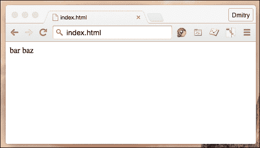
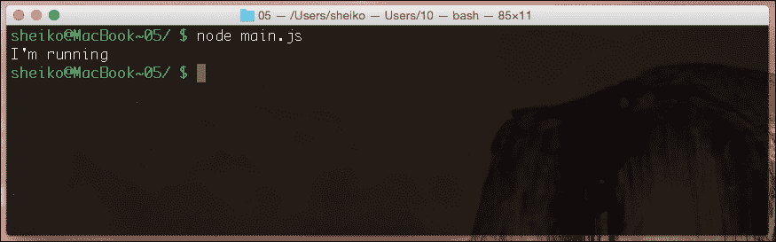
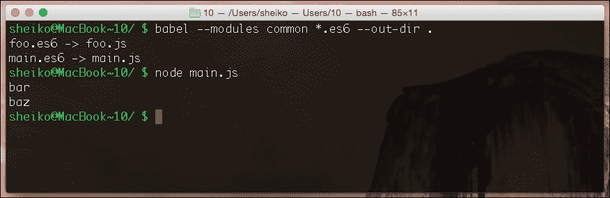
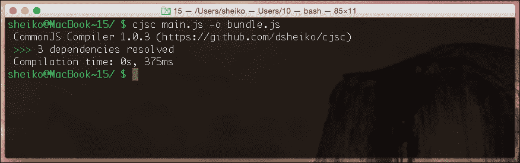
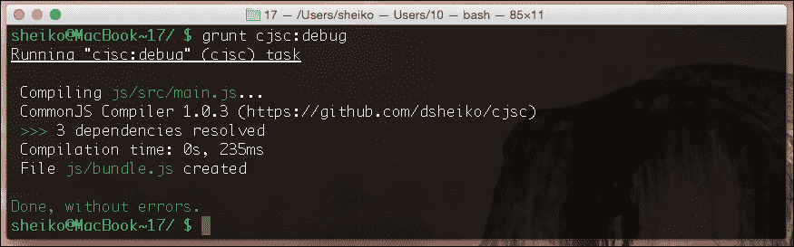

# 第二章：使用 JavaScript 的模块化编程

总的来说，工程学就是将大型任务分解为小型任务，并在系统中组合这些任务的解决方案。在软件工程中，我们遵循低耦合和高内聚的原则，将代码库分解为模块。在本章中，我们将讨论在 JavaScript 中创建模块的方法，并涵盖以下主题：

+   如何使用模块化的 JavaScript 摆脱困境

+   如何在浏览器中使用异步模块

+   如何在服务器上使用同步模块

+   JavaScript 内置模块系统

+   将 CommonJS 转换为浏览器使用

# 如何使用模块化的 JavaScript 摆脱困境

你有多少数码照片，可能成千上万，或者更多？想象一下，如果你的图片查看器没有分类能力。没有相册，没有书籍，没有分类，什么都没有。它将毫无用处，不是吗？现在假设你有一个 JavaScript 应用程序，它包含在一个文件中，并且它不断增长。当它接近一千行或超过一千行代码时，无论你的代码设计有多好，从可维护性的角度来看，它仍然会变成像那堆未分类照片的巨大列表一样的无用*堆*。我们不应该构建一个单块应用程序，而应该编写几个独立的模块，它们组合在一起形成一个应用程序。因此，我们将复杂问题分解为简单任务。

## 模块

那么，模块是什么呢？模块封装了为特定功能设计的代码。模块还提供了一个接口，声明了模块公开和需要的元素。模块通常打包在一个文件中，这使得它容易定位和部署。一个设计良好的模块意味着低耦合（模块之间的相互依赖程度）和高内聚（模块元素彼此属于的程度）。

模块在 JavaScript 中给我们带来了哪些优势？

### 更清晰的全局作用域

你在 JavaScript 中知道任何在我们任何函数作用域之外进行的赋值都会在全局作用域中创建一个新的成员（在浏览器中是一个内置对象 window，在 Node.js/Io.js 中是 global）。因此，我们总是有意外覆盖已经定义属性的风险。相反，模块中声明的任何内容除非我们明确导出它，否则它将留在这里。

### 将代码打包成文件

在服务器端语言中，应用程序由许多文件组成。这里的一个最佳实践是，一个文件只包含一个类，并且只负责一件事情。此外，完全限定的类名必须反映其文件位置。所以当我们遇到对象问题时，我们可以很容易地推断出在哪里可以找到其源代码。我们可以将 JavaScript 应用程序代码分成不同的脚本，但这些将共享同一个作用域，并且不会给我们任何封装。此外，当脚本异步加载时，内部依赖关系必须解决，这并不容易。但是，如果我们使用模块，每个模块都有一个专门的文件和自己的作用域。模块加载器负责异步依赖关系。

### 重用

想象一下，在项目工作中，你写了一段代码，解决了一个任务——比如提供了一个方便的 API 来管理 cookie。当切换到另一个项目时，你意识到你的 cookie 管理器在那里会很合适。在*意大利面条代码*的情况下，你必须提取组件代码，解耦它，并将其绑定到新位置。如果你将组件作为设计得体的模块编写，你只需拿过来并插入即可。

## 模块模式

嗯，我们知道模块有帮助，并且我们想使用它们。那么，我们在 JavaScript 中如何实现一个模块呢？首先，我们需要将模块代码从全局作用域中分离出来。我们只能通过用函数包装模块代码来实现这一点。这里的一个常见做法是使用**立即执行函数表达式**（**IIFE**）：

```js
IIFE
(function () {
  "use strict";
   // variable defined inside this scope cannot be accessed from outside
}());
```

模块还必须具有与周围环境交互的接口。就像我们通常处理函数一样，我们可以将对象引用作为 IIFE 的参数传递。

```js
Import
(function ( $, Backbone ) {
   "use strict";
  // module body
}( jQuery, Backbone ));
```

你可能也看到过一种模式，即全局对象（window）通过参数传递。这种方式我们不是直接访问全局对象，而是通过引用。有一种观点认为通过局部引用访问更快。这并不完全正确。我准备了一个 Codepen，里面有一些测试，在[`codepen.io/dsheiko/pen/yNjEar`](http://codepen.io/dsheiko/pen/yNjEar)。它显示，在 Chrome（v45）中，局部引用确实快了 20%；然而，在 Firefox（v39）中，这并没有造成任何显著的差异。

你也可以在参数列表中运行模式变体 with `undefined`。没有通过参数传递的参数有一个`undefined`值。所以，我们这样做是为了确保即使在全局`undefined`对象被覆盖的情况下，我们也能在作用域中获得真实的`undefined`对象。

```js
Local References
(function ( window, undefined ) {
   "use strict";
  // module body
}( window ));
```

为了在模块的作用域外暴露模块元素，我们可以简单地返回一个对象。函数调用的结果可以赋值给外部变量，如下所示：

```js
Export
/** @module foo */
var foo = (function () {
  "use strict";
       /**
        * @private
        * @type String
        */
   var bar = "bar",
       /**
        * @type {Object}
        */
       foo = {
         /**
          * @public
          * @type {String}
          */
         baz: "baz",
         /**
          * @public
          * @returns {String}
          */
         qux: function() {
           return "qux";
         }
       };
   return foo;
}());

console.log( foo.baz ); // baz
console.log( foo.qux() ); // qux
```

## 增强

有时我们需要在模块中混合事物。例如，我们有一个提供核心功能的模块，我们希望根据使用上下文插入扩展。假设，我有一个基于伪类声明创建对象的模块。

基本上，在实例化时它自动继承自指定的对象并调用构造方法。在特定的应用程序中，我还希望这也验证对象接口是否符合给定的规范。所以，我在基础模块中插入了这个扩展。是如何做到的？我们将基础模块的引用传递给插件。将保留对原始模块的链接，因此我们可以在插件的作用域中修改它：

```js
/** @module foo */
var foo = (function () {
      "use strict";
           /**
            * @type {Object}
            */
         var foo = {
             /**
              * @public
              * @type {String}
              */
             baz: "baz"
           };
       return foo;
    }()),
    /** @module bar */
    bar = (function( foo ){
      "use strict";
      foo.qux = "qux";
    }( foo || {} ));

console.log( foo.baz ); // baz
console.log( foo.qux ); // qux
```

## 模块标准

我们已经回顾了实现模块的几种方法。然而，在实践中，我们更倾向于遵循一个标准化的 API。这些已经被一个庞大的社区证明，被实际世界的项目采用，并被其他开发者所认可。我们需要牢记的两个最重要的标准是**AMD**和**CommonJS 1.1**，现在我们更愿意看看 ES6 模块 API，这将是下一件大事。

CommonJS 1.1 以同步方式加载模块。模块体在第一次加载后执行一次，导出的对象被缓存。它为服务器端 JavaScript 设计，主要用于 Node.js/Io.js。

AMD 以异步方式加载模块。模块体在第一次加载后执行一次，导出的对象也被缓存。这为浏览器使用而设计。AMD 需要一个脚本加载器。最受欢迎的有 RequireJS、curl、lsjs 和 Dojo。

很快，我们可以期待脚本引擎获得对 JavaScript 内置模块的原生支持。ES6 模块结合了两者的优点。与 CommonJS 类似，它们有紧凑的语法和支持循环依赖，与 AMD 类似，模块异步加载，加载可配置。

# 如何在浏览器中使用异步模块

为了掌握 AMD，我们将做一些例子。我们将需要脚本加载器 RequireJS([`requirejs.org/docs/download.html`](http://requirejs.org/docs/download.html)).所以你可以下载它，然后在 HTML 中指定本地版本，或者给它一个外部链接到 CDN。

首先，让我们看看我们如何创建一个模块并请求它。我们把模块放在`foo.js`文件里。我们使用`define()`调用声明模块作用域。如果我们传递一个对象给这个调用，对象简单地被导出：

**foo.js**

```js
define({
  bar: "bar",
  baz: "baz"
});
```

当我们传递一个函数时，它被调用，其返回值被导出：

**foo.js**

```js
define(function () {
  "use strict";
  // Construction
  return {
    bar: "bar",
    baz: "baz"
  };
});
```

在`foo.js`旁边放置`main.js`。这段代码可以如下描述：当第一个参数（这里只有`foo`，即`./foo.js`）提供的所有模块都被加载并可用时，调用给定的回调。

**main.js**

```js
require( [ "foo" ], function( foo ) {
  "use strict";
  document.writeln( foo.bar );
  document.writeln( foo.baz );
});
```

从 HTML（`index.html`）开始，我们首先加载`RequireJS`，然后是`main.js`：

**index.html**

```js
<script src="img/require.min.js"></script>
<script src="img/main.js" ></script>
```

当我们有一个加载器时，同步加载脚本感觉不对。然而，我们可以用仅有的脚本元素来实现，此外，还可以强制它异步加载：

**index.html**

```js
<script data-main="./main" async 
  src="img/require.min.js"></script>
```

使用`data-main`属性，我们告诉加载器首先加载哪个模块，无论何时模块准备就绪。当我们启动`index.html`时，我们将在`main.js`中导入的`foo`模块属性值。

`index.html`输出异步加载模块的导出内容：



现在我们处理更多的依赖关系。所以我们创建了`bar.js`和`baz.js`模块：

**bar.js**

```js
define({
  value: "bar"
});
```

**baz.js**

```js
define({
  value: "baz"
});
```

我们必须修改`foo.js`以访问这些模块：

**foo.js**

```js
define([ "./bar", "./baz" ], function ( bar, baz ) {
  "use strict";
  // Construction
  return {
    bar: bar.value,
    baz: baz.value
  };
});
```

正如您可能注意到的，`require`/`define`依赖列表由模块标识符组成。在我们的案例中，所有模块和 HTML 位于同一目录中。否则，我们需要根据相对路径构建标识符（可以省略`.js`文件扩展名）。如果您路径出错，RequireJS 无法解析依赖，它会发出`Error: Script error for:<module-id>`。这有很大帮助吗？您可以自己改进错误处理。传递给模块作用域回调的函数表达式接收一个异常对象作为参数。这个对象具有特殊属性，如`requireType`（一个包含错误类型的字符串，如`timeout`、`nodefine`、`scripterror`）和`requireModules`（受错误影响的模块 ID 数组）。

```js
require([ "unexisting-path/foo" ], function ( foo ) {
  "use strict";
  console.log( foo.bar );
  console.log( foo.baz );
}, function (err) {
  console.log( err.requireType );
  console.log( err.requireModules );
});
```

在一个良好的设计中，模块众多，并且分配给一个目录树。为了避免每次都进行相对路径计算，您可以一次性配置脚本加载器。因此，加载器将通过指定的别名知道如何找到依赖文件：

**main.js**

```js
require.config({
    paths: {
        foo: "../../module/foo"
    }
});
require( [ "foo" ], function( foo ) {
  "use strict";
  console.log( foo.bar );
  console.log( foo.baz );
});
```

这带来了一个好处。现在如果我们决定更改一个模块文件名，我们不需要修改每个需要它的其他模块。我们只需要更改配置：

**main.js**

```js
require.config({
  paths: {
    foo: "../../module/foo-v0_1_1"
  }
});
require( [ "foo" ], function( foo ) {
  "use strict";
  console.log( foo.bar );
  console.log( foo.baz );
});
```

通过配置，我们也可以解决远程模块。例如，这里我们引用 jQuery，但 RequireJS 从配置中知道模块的端点，因此，从 CDN 加载模块：

**require.config({**

```js
  paths: {
    jquery: "https://code.jquery.com/jquery-2.1.4.min.js"
  }
});

require([ "jquery" ], function ( $ ) {
  // use jQuery
});
```

## 优点和缺点

AMD 方法的优点之一是模块异步加载。这也意味着在部署时，我们不需要上传整个代码库，而只需上传一个模块。由于浏览器可以同时处理多个 HTTP 请求，这种方式可以提高性能。然而，这里有一个巨大的陷阱。并行加载几段代码确实很快。但是实际项目中的模块要多的多。使用目前仍占主导地位的 HTTP/1.1 协议，加载所有这些模块将需要很长时间。与新的 SPDY 和 HTTP/2 标准不同，HTTP/1.1 在下载页面时的并发性处理并不好，如果队列很长，这将导致头阻塞([`http2.github.io/faq/`](https://http2.github.io/faq/))。RequreJS 提供了一个工具([`requirejs.org/docs/optimization.html`](http://requirejs.org/docs/optimization.html))来合并多个模块。这样我们不需要加载每个单独的模块，而只需要几个包。一起打包的依赖关系是同步解析的。因此，可以说在一定程度上我们放弃了 AMD 的主要优点——异步加载。同时，我们仍然需要加载一个通常相当重的脚本加载器，并用`define()`回调包装每个模块。

从我的经验来看，我更倾向于建议你使用与 Common JS 模块同步编译的包，这些包可以在浏览器中使用。

# 如何在服务器上使用同步模块

以下示例需要 Node.js。使用预编译安装器在[`nodejs.org/download/`](https://nodejs.org/download/)安装 Node.js 只需几分钟，甚至通过包管理器在[`github.com/joyent/node/wiki/Installing-Node.js-via-package-manager`](https://github.com/joyent/node/wiki/Installing-Node.js-via-package-manager)安装更快。

我们将从在模块中放入一个简单的逻辑开始：

**foo.js**

```js
console.log( "I'm running" );
```

现在我们可以调用模块：

**main.js**

```js
require( "./foo" );
```

为了运行示例，我们将打开控制台（在 Windows 上，你可以直接运行`CMD.EXE`，但我建议使用像 CMDER 这样的增强工具，可在[`cmder.net/`](http://cmder.net/)获得）。在控制台中，我们输入以下内容：

```js
node main.js

```



按下*Enter*键后，控制台输出**I'm running**。所以当请求一个模块时，其主体代码被执行。但如果我们多次请求该模块呢？

**main.js**

```js
require( "./foo" );
require( "./foo" );
require( "./foo" );
```

结果是一样的。只输出了一次**I'm running**。这是因为模块主体代码只在模块首次请求时执行一次。导出的对象（可能由主体代码生成）被缓存，类似于单例：

**foo.js**

```js
var foo = new Date();
```

**main.js**

```js
var first = require( "./foo" ),
    second = require( "./foo" );

console.log( first === second ); // true
```

正如你可能会注意到的，与 AMD 不同，我们模块中不需要任何包装器。但它仍然与全局作用域隔离吗？

**foo.js**

```js
var foo = "foo";
```

**main.js**

```js
require( "./foo" );
console.log( typeof foo ); // undefined
```

模块作用域中定义的任何变量在作用域外不可用。然而，如果你真的希望在暴露的接口后面的模块变量之间共享任何东西，你可以通过一个全局对象来实现（Node.js 类似于浏览器中的 Windows 对象）。

那么关于导出有什么要注意的呢？CommonJS 更倾向于单个导出。我们将 `module.exports` 赋值为一个类型或值的引用，这将是所需函数的缓存返回。如果我们想要多个导出，我们只需导出一个对象：

**foo.js**

```js
// module logic
module.exports = {
  bar: "bar",
  baz: "baz"
};
```

**main.js**

```js
var foo = require("./foo");
console.log( foo.bar ); // bar
console.log( foo.baz ); // baz
```

以下是在 Node.js 中最常见的情况，导出一个对象构造函数：

**foo.js**

```js
var Foo = function(){
  this.bar = "bar";
}

module.exports = Foo;
```

因此，通过一个必需的调用，我们可以获得带有原型的构造函数，并可以创建实例：

**main.js**

```js
var Foo = require("./foo"),
    foo = new Foo();

console.log( foo.bar ); // bar
```

正如我们从 `main` 模块请求 `foo` 模块一样，我们也可以从其他模块请求：

**bar.js**

```js
// module logic
module.exports = "bar";
```

**baz.js**

```js
// module logic
module.exports = "baz";
```

**foo.js**

```js
// module logic
module.exports = {
  bar: require( "./bar" ),
  baz: require( "./baz" )
};
```

**main.js**

```js
var foo = require( "./foo" );
console.log( foo.bar ); // bar
console.log( foo.baz ); // baz
```

但是，如果 Node.js 遇到循环依赖呢？如果我们从被调用模块中请求回调用者，会发生什么？并没有什么戏剧性的事情发生。正如您可能记得的，模块代码只执行一次。所以，如果在 `main.js` 已经执行后，我们还是从 `foo.js` 请求 `main.js`，那么它的主体代码将不再被调用：

**foo.js**

```js
console.log("Runnnig foo.js");
require("./main");
```

**main.js**

```js
console.log("Runnnig main.js");
require("./foo");
```

当我们用 Node.js 运行 `main.js` 时，我们得到以下输出：

```js
Runnnig main.js
Runnnig foo.js
```

## 优点和缺点

CommonJS 拥有简洁而富有表现力的语法。它非常容易使用。单元测试通常编写成在命令行运行，最好是持续集成的一部分。一个设计良好的 CommonJS 模块是一个完美的测试单元，您可以直接从 Node.js 驱动的测试框架（例如，Mocha）中访问，完全脱离应用程序上下文。然而，CommonJS 暗示了同步加载，这不适合在浏览器中使用。如果我们想绕过这个限制，我们必须将模块源代码编译成一个脚本，内部解决模块依赖关系而不加载（参见 *"为浏览器使用编译 CommonJS"*）。

## UMD

如果你希望你的模块既能在浏览器中作为 AMD 使用，又能在服务器上作为 CommonJS 使用，有一个技巧（[`github.com/umdjs/umd`](https://github.com/umdjs/umd)）。通过添加一个包装函数，你可以根据运行时环境动态构建所需的格式的导出。

# JavaScript 的内置模块系统

嗯，AMD 和 CommonJS 都是社区标准，并不是语言规范的一部分。然而，随着 EcmaScript 第六版的推出，JavaScript 拥有了它自己的模块系统。目前，还没有浏览器支持这一特性，因此我们必须安装 Babel.js 编译器来处理例子。

由于 Node.js 已经随 NPM 分发（NPM 是 Node.js 的包管理器），我们现在可以运行以下命令：

```js
npm install babel -g

```

## 命名导出

现在我们可以像下面这样编写一个模块：

**foo.es6**

```js
export let bar = "bar";
export let baz = "baz";
```

在 ES6 中，我们可以导出多个元素。任何用关键字 export 声明的变量或函数都可以被导入：

**main.es6**

```js
import { bar, baz } from "./foo";
console.log( bar ); // bar
console.log( baz ); // baz
```

由于我们目前还没有在浏览器中支持 ES6 模块，我们将将它们转换为 CommonJS 或 AMD。在这里，Babel.js 帮助我们：

```js
babel --modules common *.es6 --out-dir .
```

通过这个命令，我们让 Babel.js 将当前目录下的所有 `*.es6` 文件翻译成 CommonJS 模块。因此，我们可以用 Node.js 运行派生的 `main.js` 模块：

```js
node main.js
```



同样，我们将 ES6 模块转换为 AMD：

```js
babel --modules amd *.es6 --out-dir .
```

**index.html**

```js
<script data-main="./main" 
  src="img/require.min.js"></script>
```

在前一个示例中，我们在导入语句中列出了我们的命名导出。我们也可以导入整个模块，并将命名导出作为属性引用：

**main.es6**

```js
import * as foo from "./foo"; 
console.log( foo.bar ); // bar
console.log( foo.baz ); // baz
```

## 默认导出

除了默认导出，我们还可以这样做。这是在 Node.js 中通常是如何进行导出的：

**foo.es6**

```js
export default function foo(){ return "foo"; }
```

**main.es6**

```js
import foo from "./foo";
console.log( foo() ); // foo
```

我们导出了一个函数，并在导入时带来了它。这也可以是一个类或一个对象。

在 AMD 中，我们将导出作为回调参数接收，而在 CommonJS 中，作为局部变量。尽管 ES6 没有导出值，但它导出了所谓的绑定（引用），这些引用是不可变的。您可以读取它们的值，但如果您尝试更改它们，您会得到一个类型错误。Babel.js 在编译时触发这个错误：

**foo.es6**

```js
export let bar = "bar";
export function setBar( val ) {
   bar = val;
};
```

**main.es6**

```js
import { bar, setBar } from "./foo";
console.log( bar ); // bar
setBar( "baz" );
console.log( bar ); // baz
bar = "qux"; // TypeError
```

## 模块加载器 API

除了在单独的规范中声明性语法([`github.com/whatwg/loader/`](https://github.com/whatwg/loader/))，ES6 还为我们提供了一个程序化 API。它允许我们以编程方式处理模块并配置模块加载：

```js
System.import( "./foo" ).then( foo => {
  console.log( foo );
})
.catch( err => {
  console.error( err );
});
```

与 Node.js 不同，由于 ES6 模块的声明性特性，需要在顶层引入和导出。所以，这不能是条件性的。然而，有了实用的加载器 API，我们可以采取其他方式：

```js
Promise.all([ "foo", "bar", "baz" ]
    .map( mod => System.import( mod ) )
  )
  .then(([ foo, bar, baz ]) => {
     console.log( foo, bar, baz );
  });
```

在这里，我们定义了一个回调函数，当三个指定的模块都加载完成后才会被调用。

## 结论

AMD 和 CommonJS 都是过渡性标准。一旦 JavaScript 内置模块系统在脚本引擎中获得更广泛的支持，我们实际上就不再需要它们了。ES6 模块异步加载，加载方式可以配置成类似于 AMD。它们还有紧凑且表达性强的语法，并支持类似于 CommonJS 的循环依赖。此外，ES 提供静态模块结构的声明性语法。这种结构可以被静态分析（静态检查、校验、优化等）。ES6 还提供了一个程序化加载器 API。因此，您可以配置模块如何加载以及如何条件性加载模块。另外，ES6 模块可以与宏和静态类型扩展。

虽然一切看起来都很明朗，但仍有一只苍蝇在瓶中。ES6 模块可以预先以同步方式加载（使用`<script type="module"></script>`），但通常会有异步加载，这让我们陷入了与 AMD 相同的陷阱中。HTTP/1.1 上的多次 HTTP 请求对用户响应时间产生了有害影响 ([`developer.yahoo.com/performance/rules.html`](https://developer.yahoo.com/performance/rules.html))。另一方面，SPDY 和 HTTP/2 允许每个 TCP 连接发送多个请求，得到了更广泛的支持，并最终会取代可疑的 HTTP/1.x。此外，W3C 正在制定一个名为*Web 上的打包*的标准 ([`w3ctag.github.io/packaging-on-the-web/`](https://w3ctag.github.io/packaging-on-the-web/))，描述了如何从 URL（哈希）接收归档文件（脚本）。因此，我们将能够将整个目录与模块一起打包成一个归档文件，部署它们，并以与将它们放在目录中相同的方式引用它们。

# 为浏览器环境转换 CommonJS

虽然 HTTP/2 和*Web 上的打包*还在路上，我们需要快速的模块化应用程序。如前所述，我们可以将应用程序代码划分为 CommonJS 模块，并将它们转换为供浏览器使用。最受欢迎的 CommonJS 转换器无疑是 Browserify ([`browserify.org`](http://browserify.org))。这个工具的最初任务是使 Node.js 模块可重用。他们在这一点上做得相当成功。这可能看起来像魔法，但你可以真正地在客户端使用`EventEmitter`和其他一些 Node.js 核心模块。然而，由于主要关注 Node.js 兼容性，该工具为 CommonJS 编译提供的选项太少。例如，如果你想进行依赖项配置，你必须使用一个插件。在实际项目中，你可能会最终使用多个插件，每个插件都有特定的配置语法。因此，总体设置变得过于复杂。相反，我们将在此处探讨另一个名为 CommonJS Compiler ([`github.com/dsheiko/cjsc`](https://github.com/dsheiko/cjsc))的工具。这是一个相当小的实用程序，旨在将 CommonJS 模块带入浏览器。这个工具非常容易配置和使用，这使得它成为一个很好的选择来阐述这个概念。

首先，我们安装`cjsc`：

```js
npm install cjsc -g

```

现在我们可以从*如何在服务器上同步模块*部分中取一个例子，并为浏览器环境转换它：

**bar.js**

```js
// module logic
module.exports = "bar";
```

**foo.js**

```js
// module logic
module.exports = {
  bar: require( "./bar" )};
```

**main.js**

```js
var foo = require( "./foo" );
document.writeln( foo.bar ); // bar
```

起点是`main.js`。因此，我们告诉`cjsc`将这个模块与所有必需的依赖递归地打包到`bundle.js`中：

```js
cjsc main.js -o bundle.js
```



让我们来看看生成的文件。`cjsc`用`custom _require`替换了所有的`require`调用，并将其放在了开头的`_require`函数定义中。这个小技巧让你可以在像 NW.js 这样的 Node.js/Io.js 友好环境中运行编译后的代码，在那里`require`函数仍然需要用于本地包。每个模块都被一个提供模块相关对象（exports 和 modules）以及全局对象的函数作用域（`window`）所包裹。

```js
Compiled Code
_require.def( "main.js", function( _require, exports, module, global )
{
  var foo = _require( "foo.js" );
  console.log( foo.bar ); // bar
  console.log( foo.baz ); // baz
    return module;
  });
```

生成的代码是通用 JavaScript，我们肯定可以从 HTML 中对其进行定位：

**index.html**

```js
<script src="img/bundle.js"></script>
```

我们的源代码仍然是 CommonJS 模块。这意味着我们可以在基于 Node.js 的框架中直接访问它们进行单元测试。Mocha.js 测试的官方网站是[`mochajs.org/`](http://mochajs.org/)：

```js
var expect = require( "chai" ).expect;
describe( "Foo module", function(){
  it( "should bypass the export of bar", function(){
      var foo = require( "./foo" );
      expect( foo ).to.have.property( "bar" );
      expect( foo.bar ).to.eql( "bar" );
  });
});
```

`cjsc`有许多选项。但在实际项目中，每次构建都输入一个长命令行会令人厌烦且效率低下：

```js
cjsc main-module.js -o build.js  --source-map=build/*.map \
 --source-map-root=../src -M --banner="/*! pkg v.0.0.1 */"
```

我们使用像`Grunt`、`Gulp`、`Cake`和`Broccoli`这样的任务运行器的原因就在于此。目前最受欢迎的任务运行器是`Grunt`([`gruntjs.com`](http://gruntjs.com))，它拥有大量的插件可供选择（参见[`sixrevisions.com/web-development/grunt-vs-gulp/`](http://sixrevisions.com/web-development/grunt-vs-gulp/)上的 Grunt 与 Gulp 对比信息图）。因此，我们需要将`grunt`命令行界面全局安装：

```js
npm install -g grunt-cli

```

为了设置一个`Grunt`项目，我们需要两个配置文件，`package.json`([`docs.npmjs.com/files/package.json`](https://docs.npmjs.com/files/package.json))和`Gruntfile.js`文件。第一个包含有关运行`Grunt`任务的 NPM 包的元数据。第二个用于定义和配置任务。

我们可以从一个非常简洁的`package.json`开始，其中只包含一个任意项目名及其版本，采用语义版本控制([`semver.org/`](http://semver.org/))格式：

**package.json**

```js
{
  "name": "project-name",
  "version": "0.0.1"
}
```

现在我们可以安装所需 NPM 包：

```js
npm install --save-dev grunt
npm install --save-dev grunt-cjsc

```

这样我们就得到了一个本地的 Grunt 和一个 CommonJs 编译器的 Grunt 插件。特殊的`--save-dev`选项在`package.json`部分创建`devDependencies`（如果不存在），并将其填充为已安装的依赖项。例如，当我们从版本控制系统拉取项目源代码时，我们可以通过简单地运行`npm install`来恢复所有依赖项。

在`Gruntfile.js`中，我们必须加载已经安装的`grunt-cjsc`插件，并配置一个名为`cjsc`的任务。实际上，我们将需要至少两个目标，为这个任务提供不同的配置。第一个，`cjsc:debug`，运行`cjsc`以生成未压缩的代码，并提供源映射。第二个，`cjsc:build`，用于准备部署资产。所以我们得到了`bundle.js`中的压缩代码：

**Gruntfile.js**

```js
module.exports = function( grunt ) {
  // Project configuration.
  grunt.initConfig({
    pkg: grunt.file.readJSON( "package.json" ),
    cjsc: {
      // A target to generate uncompressed code with sources maps
      debug: {
        options: {
          sourceMap: "js/*.map",
          sourceMapRoot: "src/",
          minify: false
        },
        files: { "js/bundle.js": "js/src/main.js" }
      },
      // A target to build project for production
      build: {
        options: {
          minify: true,
          banner: "/*! <%= pkg.name %> - v<%= pkg.version %> - " +
          "<%= grunt.template.today(\"yyyy-mm-dd\") %> */"
        },
        files: { "js/bundle.js": "js/src/main.js" }
      }
    }
  });

  // Load the plugin that provides the task.
  grunt.loadNpmTasks( "grunt-cjsc" );

  // Make it default task
  grunt.registerTask( "default", [ "cjsc:build" ] );

};
```

从配置中，我们可以看到`cjsc`旨在将`js/src/main.js``transpile`成`js/bundle.js`。因此，我们可以将前面示例中的模块复制到`./js/src`。

现在，当一切准备就绪后，我们将运行一个任务。例如，请看以下内容：

```js
grunt cjsc:debug

```



如前所述，我们可以使用 `cjsc` 配置依赖映射。我们只需在一个对象字面量中描述依赖项，该字面量可以作为 JSON 文件通过命令行界面提供给 `cjsc`，或注入到 Grunt 配置中：

```js
{
  "jquery": {
    "path": "./vendors/jQuery/jquery.js"
  },
  "underscore": {
    "globalProperty": "_"
  },
  "foo": {
    "path": "./vendors/3rdpartyLib/not-a-module.js",
    "exports": [ "notAModule" ],
    "imports": [ "jquery" ]
  }
}
```

在这里，我们声明了位于 `./vendors/jQuery/jqueiry.js` 的模块的 `jquery` 别名（快捷方式）。我们还说明了一个全局暴露的 `"_"`（Underscore.js）库必须被视为一个模块。最后，我们指定了第三方组件的路径、导出和导入。因此，我们得到了这个在应用（不干预其代码）中作为一个模块的 this，尽管它不是一个模块：

```js
cjsc main.js -o bundle.js --config=cjsc-conig.json
```

或者我们可以使用以下 Grunt 配置：

```js
 grunt.initConfig({
cjsc main.js -o bundle.js --config=cjsc-conig.json
Grunt configuration
 grunt.initConfig({
    cjsc: {
      build: {
        options: {
          minify: true,
          config: require( "fs" ).readFileSync( "./cjsc-conig.json" )
        }
      },
        files: { "js/bundle.js": "js/src/main.js" }
      }
  });
```

## 将 ES6 模块捆绑以实现同步加载

嗯，正如我们在*JavaScript 内置模块系统*部分提到的，ES6 模块将会取代 AMD 和 CommonJS 标准。而且，我们现在就可以写 ES6 代码并将其转译为 ES5。一旦支持 ES6 的脚本代理足够好，我们从理论上可以使用我们的代码。然而，性能呢？实际上，我们可以将 ES6 模块编译成 CommonJS 并然后用 `cjsc` 捆绑它们以供浏览器使用：

**foo.es6**

```js
export let bar = "bar";
export let baz = "baz";
```

**main.es6**

```js
import { bar, baz } from "./foo";
document.writeln( bar ); // bar
document.writeln( baz ); // baz
```

首先，我们将 ES6 编译成 CommonJS 模块：

```js
babel --modules common *.es6 --out-dir .

```

然后，我们将 CommonJS 模块捆绑成一个适合浏览器使用的脚本：

```js
cjsc main.js -o bundle.js -M

```

# 摘要

模块化编程是与面向对象编程紧密相关的一个概念，它鼓励我们为更好的可维护性来结构化代码。特别是，JavaScript 模块保护全局作用域免受污染，将应用程序代码分成多个文件，并允许重用应用程序组件。

目前大多数使用的两个模块 API 标准是 AMD 和 CommonJS。第一个是为浏览器使用而设计的，假设异步加载。第二个是同步的，适用于服务器端 JavaScript。然而，你应该知道 AMD 有的重大缺陷。一个细粒度的应用程序设计，拥有大量的通过 HTTP/1.1 的模块，可能会在应用程序性能方面造成灾难。这是最近将 CommonJS 模块转译为浏览器使用实践日益增多的主要原因。

这两个 API 都应被视为过渡性标准，因为即将到来的 ES6 模块标准旨在取代它们。目前，没有脚本引擎支持这一功能，但有一些转译器（例如，Babel.js）允许将 ES6 模块转译成 CommonJS 或 AMD。
