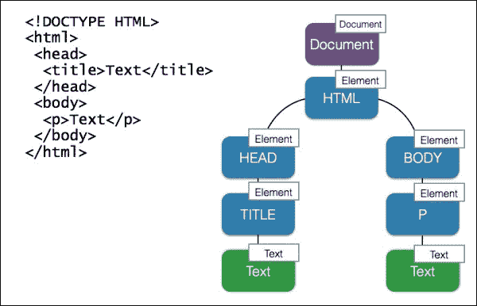

# 第三章：DOM 脚本和 AJAX

当涉及到**文档对象模型**（**DOM**）操作和 AJAX 时，第一反应可能是使用 jQuery 或 Zepto。但是，这难道不让你烦恼吗？你为了一些普通的任务，却加载了一个沉重的第三方库，而浏览器已经为你提供了所需的一切？有些人引入 jQuery 是为了跨浏览器兼容性。好吧，这个库是用来修复*损坏的 DOM API*。这在我们要支持像 IE7 这样老旧浏览器的时候真的很有帮助。然而，今天，当我们支持的浏览器使用率不到 0.1%时，我们几乎不需要关心遗留浏览器([`www.w3schools.com/browsers/browsers_explorer.asp`](http://www.w3schools.com/browsers/browsers_explorer.asp))。现代浏览器在支持 Web API 方面相当一致。总的来说，跨浏览器兼容性不再是问题。

第二个，也是最常见的借口是，这个库简化了你需要编写的查询和操作 DOM 的代码量。它在某种程度上简化了代码，但缺点是，现在我们有一代开发者不知道 JavaScript 和 Web API，只知道 jQuery。其中许多人没有这个库就无法解决一个简单的任务，也不知道当他们调用库方法时实际发生了什么。良好的代码意味着可移植性和高性能。没有对原生 API 的了解，很难实现这一点。

因此，在本章中，我们将探讨原生处理 DOM 和 AJAX 的方式，重点关注高性能。

本章将涵盖以下主题：

+   高速 DOM 操作

+   与服务器的通信

# 高速 DOM 操作

为了高效地处理 DOM，我们需要了解它的本质。DOM 是一个表示在浏览器中打开的文档的树结构。DOM 中的每个元素都称为节点。



每个节点作为一个对象都有属性和方法([`developer.mozilla.org/en/docs/Web/API/Node`](https://developer.mozilla.org/en/docs/Web/API/Node))。节点有不同的类型。在前面的图片中，你可以看到一个文档节点、元素节点和文本节点。实际上，树也可能包含特定类型的节点，如注释节点、文档类型节点等。为了说明树内的关系，我们可以认为 HTML 有两个子节点**HEAD**和**BODY**，它们作为兄弟姐妹相互关联。显然，HTML 是 HEAD 和 BODY 的父节点。我们可以使用这些通过节点属性可访问的关系来导航树：

```js
var html = document.documentElement;
console.log( html.nodeName ); // HTML

var head = html.childNodes[0];
console.log( head.nodeName );  // HEAD
console.log( head.parentNode === html );  // true
```

这部分很清楚，但如果我们请求下一个兄弟节点是 HEAD 而不是 BODY，我们将得到一个内容中包含空白符的文本节点（`nodeValue`）：

```js
var sibling = head.nextSibling;
// the same as html.childNodes[1]
console.log( sibling.nodeName ); // #text
console.dir( sibling.nodeValue ); // "\n  "
```

在 HTML 中，我们通常用空格、TAB 和换行符来分隔元素，以提高可读性，这些也构成了 DOM 的一部分。因此，为了访问元素，我们最好使用文档和元素方法。

## 遍历 DOM

当然，你知道如何通过 ID（`document.getElementById`）或标签名（`document.getElementsByTagName`）找到一个元素。你也可以通过 CSS 选择器（`document.querySelector`）查找一个元素：

```js
<article id="bar">
  <h2>Lorem ipsum</h2>
</article>
var article = document.querySelector( "#bar" ),
      heading = article.querySelector( "h2" );
```

选择器由一个或多个类型（标签）选择器、类选择器、ID 选择器、属性选择器或伪类/元素选择器组合而成（[`www.w3.org/TR/CSS21/selector.html%23id-selectors`](http://www.w3.org/TR/CSS21/selector.html%23id-selectors)）。考虑到组合（匹配一组、后代或兄弟姐妹），这给了我们相当多的可能选项。所以选择一个将 HTML 元素从 JavaScript 绑定的策略可能会很难。我的建议是始终使用`data-*`属性选择器：

```js
<article data-bind="bar">
  <h2 data-bind="heading">Lorem ipsum</h2>
</article>

var article = document.querySelector( "[data-bind=\"bar\"]" ),
      heading = article.querySelector( "[data-bind=\"heading\"]" );
```

这样我们就独立于 HTML 结构了。如果我们改变标签，例如为了更好的语义，JavaScript 方面不会出错。我们独立于 CSS 类，这意味着我们可以安全地重构 CSS。我们不受 ID 的限制，ID 在每个文档中应该是唯一的。

`querySelector`取 DOM 中匹配选择器的第一个元素，而`querySelectorAll`检索所有它们：

```js
<ul data-bind="bar">
  <li data-bind="item">Lorem ipsum</li>
  <li data-bind="item">Lorem ipsum</li>
  <li data-bind="item">Lorem ipsum</li>
</ul>

var ul = document.querySelector( "[data-bind=\"bar\"]" ),
      lis = ul.querySelectorAll( "[data-bind=\"item\"]" );
console.log( lis.length );
```

找到的元素被表示为一个`NodeList`。它看起来像一个数组，但它不是。它是一个实时集合，在每次 DOM 重排时都会被更新。考虑以下示例：

```js
var divs = document.querySelectorAll( "div" ), i; 
for ( i = 0; i < divs.length; i++ ) { 
  document.appendChild( document.createElement( "div" ) ); 
}
```

前面的代码会导致一个无限循环，因为无论我们访问集合的下一个元素，都会向集合中添加一个新元素，`divs.length`递增，我们永远满足不了循环条件。

重要的是要知道，遍历一个实时集合（`NodeList`、`HTMLCollection`）是慢的，并且资源消耗很大。如果你不需要它是实时的，只需将集合转换为一个数组，例如`[].slice.call( nodeList )`，正如在第一章，*深入 JavaScript 核心*中提到的那样。在 ES6 中，这可以用`[...nodeList]spread`操作符完成：

```js
var ul = document.querySelector( "[data-bind=\"bar\"]" ),
      lis = ul.querySelectorAll( "[data-bind=\"item\"]" );
console.log( [].slice.call( lis ) ); // into array ES5 way
console.log( [ ...lis ] ); // into array ES6 way
```

除了查询，我们还可以测试找到的元素是否与给定的选择器匹配：

```js
console.log( el.matches( ".foo > .bar" ) );
console.log( input.matches( ":checked" ) );
```

## 改变 DOM

嗯，现在我们知道如何在 DOM 中找到元素了。那么我们来看看如何将新元素动态插入到 DOM 树中。有多种方法。我们可以简单地使用`el.innerHTML`方法设置新的 HTML 内容：

```js
var target = document.getElementById( "target" );
target.innerHTML = "<div></div>";
```

否则，我们可以创建一个节点（`document.createElement`）并将其注入到 DOM 中（`el.appendChild`）：

```js
var target = document.getElementById( "target" ),
      div = document.createElement( "div" ),
target.appendChild( div );
```

在这里你应该记得，每次我们改变`el.innerHTML`或者向一个元素中添加一个子元素，我们都会引起 DOM 重排。当这种情况在循环中反复发生时，它可能会减慢应用程序的速度。

当我们通过`el.innerHTML`传递 HTML 时，浏览器首先必须解析字符串。这是一个耗资源的操作。然而，如果我们明确地创建元素，这个操作会快得多。如果我们生产出一系列相似的元素，流程还可以进一步优化。我们可以在循环中创建每一个元素，也可以创建一个原始创建的元素副本（`el.cloneNode`），这样可以快得多：

```js
var target = document.getElementById( "target" ),
    /**
     * Create a complex element
     * @returns {Node}
     */
    createNewElement = function(){
      var div = document.createElement( "div" ),
          span = document.createElement( "span" );
      span.appendChild( document.createTextNode( "Bar" ) );
      div.appendChild( span );
      return div;
    },
    el;

el = createNewElement();
// loop begins
target.appendChild( el.cloneNode( true ) );
// loop ends
```

另一方面，我们可以创建一个文档片段（`document.createDocumentFragment`）并在循环中向片段添加创建的节点。文档片段是一种虚拟 DOM，我们对其进行操作而不是真实的 DOM。一旦我们完成，我们可以将文档片段作为分支注入到真实的 DOM 中。通过结合这种技术和克隆技术，我们预计在性能上会有所收获。实际上，这并不确定([`codepen.io/dsheiko/pen/vObVOR`](http://codepen.io/dsheiko/pen/vObVOR))。例如，在 WebKit 浏览器中，虚拟 DOM（`document.createDocumentFragment`）比真实 DOM 运行得慢。

正如我们在性能方面所做的那样，让我们关注准确性。如果我们需要将一个元素注入到确切的位置（例如，在`foo`和`bar`节点之间），`el.appendChild`并不是正确的方法。我们必须使用`el.insertBefore`：

```js
parent.insertBefore(el, parent.firstChild);
```

要从 DOM 中删除一个特定的元素，我们这样做：

```js
el.parentNode.removeChild(el);
```

此外，我们还可以重新加载元素，例如，重置所有订阅的事件监听器：

```js
function reload( el ) {
    var elClone = el.cloneNode( true );
    el.parentNode && el.parentNode.replaceChild( elClone, el );
 }
```

## 样式化 DOM

谈到样式，我们 wherever possible 使用 CSS 类。这提供了更好的可维护性——继承、组合和关注分离。你当然知道如何通过`el.className`属性为元素分配预期的类。然而，在现实世界中，`el.classList`对象要实用得多：

```js
el.classList.add( "is-hidden" );
el.classList.remove( "is-hidden" );
var isAvailable = true;
el.classList.toggle("is-hidden", !isAvailable );
if ( el.classList.contains( "is-hidden" ) ){}
```

在这里，除了明显的添加/删除/包含方法，我们还使用`toggle`。这个方法根据作为第二个参数传递的布尔值，要么添加，要么删除指定的类。

有时我们需要显式地操作样式。DOM 的一个部分叫做**CSS 对象模型**（**CSSOM**），它提供了一个接口来操作 CSS。因此，我们可以使用`el.style`属性读取或设置元素的动态样式信息：

```js
el.style.color = "red";
el.style.fontFamily = "Arial";
el.style.fontSize = "1.2rem";
```

一个较少为人所知的技巧是改变样式规则的实际文本：

```js
el.style.cssText = "color:red;font-family: Arial;font-size: 1.2rem;";
```

正如你所看到的，第二种方法并不那么灵活。你不能改变或访问一个声明，而只能访问整个规则。然而，这种样式的速度显著更快([`codepen.io/dsheiko/pen/qdvWZj`](http://codepen.io/dsheiko/pen/qdvWZj))。

虽然`el.style`包含了元素的显式样式，但`window.getComputedStyle`返回的是继承（计算）样式：

```js
var el = document.querySelector( "h1" ),
    /**
     * window.getComputedStyle
     * @param {HTMLElement} el
     * @param {String} pseudo - pseudo-element selector or null 
     * for regular elements
     * @return {CSSStyleDeclaration}
     */
    css = window.getComputedStyle( el, null );
console.log( css.getPropertyValue( "font-family" ) );
```

我们刚刚检查的情况指的是内联样式。实际上，我们也可以访问外部或内部样式表：

```js
<style type="text/css">
.foo {
 color: red;
}
</style>
<div class="foo">foo</div>
<script type="text/javascript">
var stylesheet = document.styleSheets[ 0 ];
stylesheet.cssRules[ 0 ].style.color = "red";
// or
// stylesheet.cssRules[ 0 ].style.cssText = "color: red;";
</script>
```

为什么我们要这样做呢？因为有特殊情况。例如，如果我们想要修改，比如说，伪元素的样式，我们必须涉及到样式表：

```js
var stylesheet = document.styleSheets[ 0 ];
stylesheet.addRule( ".foo::before", "color: green" );
// or
stylesheet.insertRule( ".foo::before { color: green }", 0 );
```

## 利用属性和属性

HTML 元素有属性，我们可以从 JavaScript 访问它们：

```js
el.setAttribute( "tabindex", "-1" );
if ( el.hasAttribute( "tabindex" ) ) {}
el.getAttribute( "tabindex" );
el.removeAttribute( "tabindex" );
```

虽然 HTML 定义了元素属性，但属性是由 DOM 定义的。这造成了区别。例如，如果你有一个输入元素，最初属性和属性（`el.value`）有相同的值。然而，当用户或脚本改变值时，属性不会受到影响，但属性会：

```js
// attribute
console.log( input.getAttribute( "value" ) );
// property
console.log( input.value );
```

正如你可能很可能知道的那样，除了全局属性之外，还有一种特殊类型——自定义数据属性。这些属性旨在提供 HTML 及其 DOM 表示之间交换专有信息，由脚本使用。基本想法是，你定义一个自定义属性，如`data-foo`，并为其设置一个值。然后，从脚本中，我们使用`el.dataset`对象访问和改变属性：

```js
console.log( el.dataset.foo ); 
el.dataset.foo = "foo";
```

如果你定义了一个多部分属性，如`data-foo-bar-baz`，相应的`dataset`属性将是`fooBarBaz`：

```js
console.log( el.dataset.fooBarBaz ); 
el.dataset.fooBarBaz = "foo-bar-baz";
```

## 处理 DOM 事件

在浏览器中发生了许多事件。这可以是设备事件（例如，设备改变位置或方向），窗口事件（例如，窗口大小），一个过程（例如，页面加载），媒体事件（例如，视频暂停），网络事件（连接状态改变），当然，还有用户交互事件（点击，键盘，鼠标和触摸）。我们可以使我们的代码监听这些事件，并在事件发生时调用订阅的处理函数。要订阅 DOM 元素的某个事件，我们使用`addEventListener`方法：

```js
EventTarget.addEventListener( <event-name>, <callback>, <useCapture> );
```

在前面的代码中，`EventTarget`可以是窗口、文档、元素或其他对象，如`XMLHttpRequest`。

`useCapture`是一个布尔值，你可以指定事件传播的方式。例如，用户点击一个按钮，这个按钮在一个表单中，我们为这个点击事件订阅了两个元素的处理程序。当`useCapture`为`true`时，表单元素的处理程序（`ancestor`）将首先被调用（`capturing flow`）。否则，表单的处理程序将在按钮的处理程序之后被调用（`bubbling flow`）。

`callback`是一个在事件触发时调用的函数。它接收一个`Event`对象作为参数，该对象具有以下属性：

+   `Event.type`：这是事件的名字

+   `Event.target`：这是事件发生的事件目标

+   `Event.currentTarget`：这是事件目标，监听器附加到该目标（`target`和`currentTarget`可能在我们为多个元素附加相同的事件处理程序时有所不同，如[`developer.mozilla.org/en-US/docs/Web/API/Event/currentTarget`](https://developer.mozilla.org/en-US/docs/Web/API/Event/currentTarget)所述）

+   `Event.eventPhase`：这指示事件流程的哪个阶段正在被评估（无、捕获、目标或冒泡）

+   `Event.bubbles`：这表明事件是否是冒泡事件

+   `Event.cancelable`：这表明是否可以防止事件的默认动作

+   `Event.timeStamp`：这指定了事件时间

事件还有以下方法：

+   `Event.stopPropagation()`：这阻止事件进一步传播。

+   `Event.stopImmediatePropagation()`：如果我们有多个监听器订阅了同一个事件目标，在调用这个方法后，剩下的监听器将不会被调用。

+   `Event.preventDefault()`：这阻止默认行为。例如，如果它是一个提交类型的按钮的点击事件，通过调用这个方法，我们可以阻止它自动提交表单。

让我们在实践中试试看：

```js
<form action="/">
<button type="submit">Click me</button>
</form>
<script>
var btn = document.querySelector( "button" )
    onClick = function( e ){
      e.preventDefault(); 
      console.log( e.target );
    };
btn.addEventListener( "click", onClick, false );
</script>
```

在这里，我们为按钮元素的一个点击事件订阅了一个`onClick`监听器。当按钮被点击时，它会在 JavaScript 控制台中显示表单没有被提交的事实。

如果我们想要订阅键盘事件，我们可以这样做：

```js
addEventListener( "keydown", function( e ){
    var key = parseInt( e.key || e.keyCode, 10 );
     // Ctrl-Shift-i
    if ( e.ctrlKey && e.shiftKey && key === 73 ) {
      e.preventDefault();
      alert( "Ctrl-Shift-L pressed" );
    }
  }, false );
```

过程事件的最常见例子是文档就绪状态的改变。我们可以监听`DOMContentLoaded`或`load`事件。第一个事件在文档完全加载和解析后触发。第二个事件还等待样式表、图像和子框架加载完成。在这里，有一个怪癖。我们必须检查`readyState`，因为如果在事件可能已经触发后注册一个监听器，回调将永远不会被调用：

```js
function ready( cb ) {
  if ( document.readyState !== "loading" ){
    cb();
  } else {
    document.addEventListener( "DOMContentLoaded", cb );
  }
}
```

嗯，我们知道如何使用`EventTarget.addEventListener`方法订阅 DOM 事件。`EventTarget`对象还有一个方法来取消订阅监听器。例如，请看以下内容：

```js
btn.removeEventListener( "click", onClick );
```

如果我们想要触发一个 DOM 事件，例如模拟一个按钮点击，我们必须创建一个新的`Event`对象，设置它，并在我们想要事件触发时在元素上分派：

```js
var btn = document.querySelector( "button" ),
    // Create Event object
    event = document.createEvent( "HTMLEvents" );
// Initialize a custom event that bubbles up and cannot be canceled 

event.initEvent( "click", true, false );
// Dispatch the event
btn.dispatchEvent( event );
```

同样，我们也可以创建我们自己的自定义事件：

```js
var btn = document.querySelector( "button" ),
    // Create Event object
    event = document.createEvent( "CustomEvent" );
// Subscribe to the event 
btn.addEventListener("my-event", function( e ){
  console.dir( e );
});
// Initialize a custom event that bubbles up and cannot be canceled 
event.initEvent( "my-event", true, false );
// Dispatch the event
btn.dispatchEvent( event );
```

# 与服务器通信

许多人使用第三方库来向服务器发送任何请求。但我们真的需要这些库吗？让我们在下面的内容中看看如何使用原生的 AJAX，以及下一个通信 API 将是什么。

## XHR

**XMLHttpRequest**（**XHR**）是 JavaScript 中用于在客户端和服务器之间交换数据的主要 API。XHR 最初由微软在 IE5 中通过 ActiveX 呈现（1999 年），并且在 IE 浏览器直到版本 7（2006 年）中都有一种专有的语法。这导致了兼容性问题，促成了*AJAX 库*（如 Prototype 和 jQuery）的出现。如今，XHR 在所有主流浏览器中的支持都是一致的。通常，要执行一个 HTML 或 HTTPS 请求，我们需要完成许多任务。我们创建一个 XHR 的实例，通过 open 方法初始化一个请求，为与请求相关的事件订阅监听器，设置请求头（`setRequestHeader`），最后调用 send 方法：

```js
var xhr = new XMLHttpRequest();
xhr.open( "GET", "http://www.telize.com/jsonip?callback=0", true );
xhr.onload = function() {
      if ( this.status === 200 ) {
        return console.log( this.response );
      }
    };

xhr.responseType = "json";
xhr.setRequestHeader( "Content-Type", "application/x-www-form-urlencoded" );
xhr.send( null );
```

还有更多选项可用。例如，我们可以利用`progress`和`abort`事件来控制文件上传（[`developer.mozilla.org/en-US/docs/Web/API/XMLHttpRequest/Using_XMLHttpRequest`](https://developer.mozilla.org/en-US/docs/Web/API/XMLHttpRequest/Using_XMLHttpRequest)）。

我突然想到，对于一个简单的调用，这个接口过于复杂了。互联网上有大量的 XHR 包装器实现。最流行的实现之一可以在[`github.com/Raynos/xhr`](https://github.com/Raynos/xhr)找到。它使得 XHR 的使用如此简单：

```js
xhr({
  uri: "http://www.telize.com/jsonip",
  headers: {
    "Content-Type": "application/json"
  }
}, function ( err, resp ) {
  console.log( resp );
})
```

此外，该库还提供了一个模拟对象，可用于在单元测试中替换真实的 XHR。

## Fetch API

我们刚刚检查了 XHR API。这在 15 年前看起来不错，但现在看起来很笨拙。我们必须使用包装器来使其更友好。幸运的是，语言已经演进，现在我们有一个新的内置方法叫做 Fetch API。想想使用它进行调用的容易程度：

```js
fetch( "/rest/foo" ).then(function( response ) {
  // Convert to JSON
  return response.json();
}).catch(function( err ) {
  console.error( err );
});
```

尽管表面上很简单，这个 API 还是很强大的。`fetch`方法期望在第一个强制参数中是一个带有远程方法 URL 的字符串或者一个`Request`对象。请求选项可以在第二个可选参数中传递：

```js
fetch( "/rest/foo", {
  headers: {
    "Accept": "application/json",
    "Content-Type": "application/json"
  }
});
```

与我们的上一个片段类似，fetch 方法返回**Promise**。Promise 对于异步或延时操作已经成为一种常见的实践。在 Promise 实现时调用的函数（参见 then）接收一个`Response`对象。这个函数有许多属性和方法（[`developer.mozilla.org/en-US/docs/Web/API/Response`](https://developer.mozilla.org/en-US/docs/Web/API/Response)）。因此，我们可以使用相应的转换方法将响应转换为 JSON、文本、blob 或流，并且我们可以获得与请求相关的信息：

```js
console.log( response.text() );
console.log( response.status );
console.log( response.statusText );
console.log( response.headers.get( "Content-Type" ) );
```

那么`POST`请求呢？Fetch 有一个名为`body`的混合插件，它代表了`Response`/`Request`的正文。我们可以通过这个传递`POST`数据：

```js
var form = document.querySelector( "form[data-bind=foo]" ),
    inputEmail = form.querySelector( "[name=email]" ),
    inputPassword = form.querySelector( "[name=pwd]" );

fetch( "/feedback/submit", {
  method: "post",
  body: JSON.stringify({
    email: inputEmail.value,
    answer: inputPassword.value
  })
});
```

它不仅接受键值对，还可以接受例如`FormData`，所以你可以像这样提交整个表单以及附带的文件：

```js
var form = document.querySelector( "form[data-bind=foo]" );
fetch( "/feedback/submit", {
  method: "post",
  body: new FormData( form )
});
```

目前，一些主流浏览器（例如，IE/Edge、Safari）不支持这个 API。然而，如果你打算使用 Fetch API，你可以使用 Fetch 的 polyfill([`github.com/github/fetch`](https://github.com/github/fetch))。

# 总结

在过去，每个浏览器的制造商都有自己定制的 DOM 实现，这些实现之间几乎不兼容。然而，这种情况已经改变，W3C DOM 至少在浏览器中得到了十年的支持。今天，我们可以安全地使用 JavaScript 原生 API 来访问、操作和样式化 DOM。

在 JavaScript 中，XHR 仍然是客户端与服务器之间通信的主要 API。不过它对开发者并不太友好。因此，我们通常为其编写自定义包装器。

然而，一个新的 API，名为 Fetch，已经被提出并已经在 Chrome、Firefox 和 Opera 中得到实现。这个新 API 的使用要简单得多，与 XHR 相比，它提供了更加令人印象深刻且灵活的功能。
