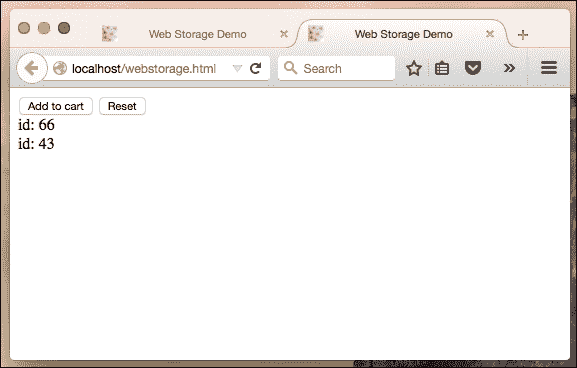

# 第四章：HTML5 API

尽管语言规范（**ECMA-262**）每几年变化一次，但新的 HTML5 API 几乎在每次浏览器更新时都会潜入语言中。已经可用的 API 数量相当多。然而，在本章中，我们将重点关注那些重新考虑整个开发过程的 API。我们将学习如何利用 web workers 进行多线程，如何从可重用的独立 web 组件构建应用程序，如何在客户端存储和搜索大量数据，以及如何与服务器建立双向通信。

在本章中，我们将介绍以下主题：

+   在 web 浏览器中存储数据

+   使用 JavaScript workers 提高性能

+   创建我们的第一个 web 组件

+   学习使用服务器到浏览器通信通道

# 在 web 浏览器中存储数据

在 HTML5 特性中，有几个是为了在客户端存储数据而设计的：Web 存储、IndexedDB 和 FileSystem API。当以下情况发生时，我们才能从这些技术中受益：

+   我们希望缓存客户端数据，以便在没有额外 HTTP 请求的情况下进行检索。

+   在 web 应用程序中，我们有大量的本地数据，我们希望我们的应用程序离线工作

让我们来看看这些技术。

## Web 存储 API

过去，我们只有保持应用程序状态的机制，而且它是使用**HTTP cookies**。除了不友好的 API 之外，cookie 还有几个缺点。它们的最大大小通常约为 4 KB。所以我们根本不能存储任何像样的数据。当在不同标签页中更改应用程序状态时，cookie 并不真正适用。cookie 容易受到**跨站脚本攻击**。

现在我们有一个高级 API，称为**Web 存储**。它提供了更大的存储容量（取决于浏览器，5-25 MB）并且不会将任何数据附加到 HTTP 请求头中。实现此接口的两个 JavaScript 内置对象是：**localStorage**和**sessionStorage**。第一个用于持久数据存储，第二个用于会话期间保持数据。

存储 API 非常易于使用，如下所示：

```js
var storage = isPersistent ? localStorage : sessionStorage;
storage.setItem( "foo", "Foo" );
console.log( storage.getItem( "foo" ) );
storage.removeItem( "foo" );
```

另外，我们可以为了方便使用 getters/setters，如下所示：

```js
storage.foo = "Foo";
console.log( storage.foo );
delete storage.foo;
```

如果我们想要遍历存储，我们可以使用`storage.length`和`storage.key()`：

```js
var i = 0, len = storage.length, key;
for( ; i < len; i++ ) {
  key = storage.key( i );
  storage.getItem( key );
}
```

正如你所见，与 cookies 相比，Web 存储 API 对开发者更加友好，也更加强大。最常见的实际例子之一是我们需要存储的情况是购物车。在设计应用程序时，我们必须记住，用户在做出选择时通常会在多个标签页或窗口中打开产品详细页。因此，我们必须照顾到所有打开的页面之间的存储同步。

幸运的是，无论何时我们更新 localStorage，都会在 window 对象上触发 `storage` 事件。因此，我们可以为这个事件订阅一个处理程序来用实际数据更新购物车。这个例子简单的代码可能看起来像这样：

```js
<html>
  <head>
    <title>Web Storage</title>
  </head>
  <body>
    <div>
      <button data-bind="btn">Add to cart</button>
      <button data-bind="reset">Reset</button>
    </div>
    <output data-bind="output">

    </output>
    <script>

    var output = document.querySelector( "[data-bind=\"output\"]" ),
        btn = document.querySelector( "[data-bind=\"btn\"]" ),
        reset = document.querySelector( "[data-bind=\"reset\"]" ),
        storage = localStorage,
       /**
        * Read from the storage
        * @return {Arrays}
        */
        get = function(){
           // From the storage we receive either JSON string or null
           return JSON.parse( storage.getItem( "cart" ) ) || [];
        },
        /**
         * Append an item to the cart
         * @param {Object} product
         */
        append = function( product ) {
          var data = get();
          data.push( product );
          // WebStorage accepts simple objects, so we pack the object into JSON string         storage.setItem( "cart", JSON.stringify( data ) );
        },
        /** Re-render list of items */
        updateView = function(){
          var data = get();
          output.innerHTML = "";
          data && data.forEach(function( item ){
            output.innerHTML += [ "id: ", item.id, "<br />" ].join( "" );
          });
        };

    this.btn.addEventListener( "click", function(){
      append({ id: Math.floor(( Math.random() * 100 ) + 1 ) });
      updateView();
    }, false );

    this.reset.addEventListener( "click", function(){
      storage.clear();
      updateView();
    }, false );

    // Update item list when a new item is added in another window/tab
    window.addEventListener( "storage", updateView, false );

    updateView();

    </script>
  </body>
</html>
```

为了看到这个功能实际运行的情况，我们必须在两个或更多标签页中打开代码 HTML。现在，当我们点击**加入购物车**按钮时，每个标签页都会更新已订购商品的列表。正如您可能注意到的，我们还可以通过点击**重置**按钮来清理购物车。这会调用`storage.clear`方法，清空列表。如果您想在这里使用 sessionStorage 而不是 localStorage，我必须警告您这样做是不行的。sessionStorage 对每个标签页或窗口都是隔离的，所以我们不能用这种方法跨它们进行通信。

然而，如果我们能在不同的框架中加载同一窗口中的页面运行这个例子，那么我们本可以使用 sessionStorage 的。下方的截图是一个购物车应用实际运行的示例：


