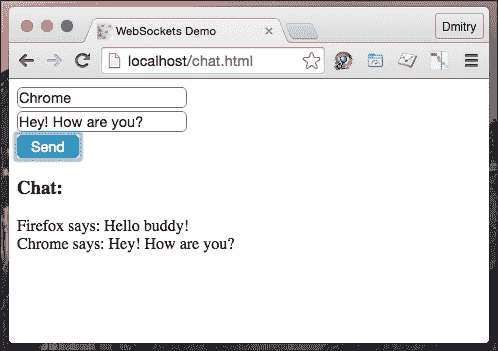

## 第五章：索引数据库（IndexedDB）

当我们需要存储相当小的数据量（兆字节）时，Web Storage 表现很好。然而，如果我们需要大量结构化数据，并且我们希望通过索引进行性能搜索，我们将使用 IndexedDB API。在浏览器中存储数据的 API 的想法并不新鲜。几年前，谷歌及其合作伙伴积极推广一个名为**Web SQL Database**的标准候选。尽管如此，这个规范还是未能通过 W3C 推荐。现在，我们有了 IndexedDB API，它已经得到广泛支持，并提供了显著的性能提升（异步 API 以及由于索引键而强大的搜索功能）。

然而，IndexedDB 的 API 相当复杂。由于大量的嵌套回调，它也很难阅读：

```js
/**
 * @type {IDBOpenDBRequest}
 * Syntax: indexedDB.open( DB name, DB version );
 */
var request = indexedDB.open( "Cem", 2 );

/** Report error */
request.onerror = function() {
  alert( "Opps, something went wrong" );
};
/**
 * Create DB
 * @param {Event} e
 */
request.onupgradeneeded = function ( e ) {
  var objectStore;
  if ( e.oldVersion ) {
    return;
  }
  // define schema
  objectStore = e.currentTarget.result.createObjectStore( "employees", { keyPath: "email" });
  objectStore.createIndex( "name", "name", { unique: false } );
   // Populate objectStore with test data
  objectStore.add({ name: "John Dow", email: "john@company.com" });
  objectStore.add({ name: "Don Dow", email: "don@company.com" });
};
/**
 * Find a row from the DB
 * @param {Event} e
 */
request.onsuccess = function( e ) {
  var db = e.target.result,
      req = db.transaction([ "employees" ]).objectStore( "employees" ).get( "don@company.com" );

  req.onsuccess = function() {
    console.log( "Employee matching `don@company.com` is `" + req.result.name + "`" );
  };
};
```

在这个示例中，我们创建了一个打开数据库的请求。如果数据库不存在或其版本已更改，将触发`upgradeneeded`事件。在监听这个事件的函数中，我们可以通过声明对象存储及其索引来定义模式。因此，如果我们需要更新现有数据库的模式，我们可以增加版本号，`upgradeneeded`将再次触发，监听器将被调用以更新模式。一旦我们定义了模式，我们就可以用示例数据填充对象存储。当打开数据库的请求完成后，我们请求与电子邮件 ID `don@company.com`匹配的记录。请求完成后，我们进入控制台：

```js
Employee matching 'don@company.com` is `Don Dow'
```

相当复杂，不是吗？这个 API 让我想到了一个包装器。我所知道最好的一个叫做**Dexie** ([`www.dexie.org`](http://www.dexie.org))。只需比较一下它暴露的接口如何轻松地解决同一个任务：

```js
<script src="img/Dexie.js"></script>
<script>
var db = new Dexie( "Cem" );
// Define DB
db.version( 3 )
  .stores({ employees: "name, email" });

// Open the database
db.open().catch(function( err ){
  alert( "Opps, something went wrong: " + err );
});

// Populate objectStore with test data
db.employees.add({ name: "John Dow", email: "john@company.com" });
db.employees.add({ name: "Don Dow", email: "don@company.com" });

// Find an employee by email
db.employees
  .where( "email" )
  .equals( "don@company.com" )
  .each(function( employee ){
    console.log( "Employee matching `don@company.com` is `" + employee.name + "`" );
  });

</script>
```

## 文件系统 API

好吧，在 Web 应用程序中，我们可以使用 Web Storage 存储键值对，我们也可以创建和使用 IndexedDB。还有一件事 missing。桌面应用程序可以读写文件和目录。这是我们经常在能够离线运行的 Web 应用程序中需要的东西。FileSystem API 允许我们在应用程序范围内创建、读取和写入用户的本地文件系统。让我们举一个例子：

```js
window.requestFileSystem  = window.requestFileSystem || window.webkitRequestFileSystem;
    /**
     * Read file from a given FileSystem
     * @param {DOMFileSystem} fs
     * @param {String} file
     */
var readFile = function( fs, file ) {
      console.log( "Reading file " + file );
      // Obtain FileEntry object
      fs.root.getFile( file, {}, function( fileEntry ) {
        fileEntry.file(function( file ){
           // Create FileReader
           var reader = new FileReader();
           reader.onloadend = function() {
             console.log( "Fetched content: ", this.result );
           };
           // Read file
           reader.readAsText( file );
        }, console.error );
      }, console.error );
    },
    /**
     * Save file into a given FileSystem and run onDone when ready
     * @param {DOMFileSystem} fs
     * @param {String} file
     * @param {Function} onDone
     */
    saveFile = function( fs, file, onDone ) {
      console.log( "Writing file " + file );
      // Obtain FileEntry object
      fs.root.getFile( file, { create: true }, function( fileEntry ) {
        // Create a FileWriter object for the FileEntry
        fileEntry.createWriter(function( fileWriter ) {
          var blob;
          fileWriter.onwriteend = onDone;
          fileWriter.onerror = function(e) {
            console.error( "Writing error: " + e.toString() );
          };
          // Create a new Blob out of the text we want into the file.
          blob = new Blob([ "Lorem Ipsum" ], { type: "text/plain" });
          // Write into the file
          fileWriter.write( blob );
        }, console.error );
      }, console.error );
    },
    /**
     * Run when FileSystem initialized
     * @param {DOMFileSystem} fs
     */
    onInitFs = function ( fs ) {
      const FILENAME = "log.txt";
      console.log( "Opening file system: " + fs.name );
      saveFile( fs, FILENAME, function(){
        readFile( fs, FILENAME );
      });
    };

window.requestFileSystem( window.TEMPORARY, 5*1024*1024 /*5MB*/, onInitFs, console.error );
```

首先，我们请求一个沙盒化的本地文件系统（`requestFileSystem`），该文件系统对应用程序来说是持久的。通过将 `window.TEMPORARY` 作为第一个参数传递，我们允许浏览器自动删除数据（例如，当需要更多空间时）。如果我们选择 `window.PERSISTENT`，我们确定数据在没有明确用户确认的情况下无法清除。第二个参数指定了我们可以为文件系统分配多少空间。然后，还有 `onSuccess` 和 `onError` 回调。当创建文件系统时，我们收到一个对 `FileSystem` 对象的引用。这个对象有一个 `fs.root` 属性，其中对象保持对根文件系统目录的 `DirectoryEntry` 绑定。`DirectoryEntry` 对象有 `DirectoryEntry.getDirectory`、`DirectoryEntry.getFile`、`DirectoryEntry.removeRecursevly` 和 `DirectoryEntry.createReader` 方法。在前一个示例中，我们在当前（`root`）目录中写入，所以我们只需使用 `DirectoryEntry.getFile` 打开一个给定名称的文件。成功打开文件后，我们收到一个代表打开文件的 `FileEntry` 对象。该对象有几个属性，如：`FileEntry.fullPath`、`FileEntry.isDirectory`、`FileEntry.isFile` 和 `FileEntry.name`，以及方法如 `FileEntry.file` 和 `FileEntry.createWriter`。第一个方法返回一个 `File` 对象，该对象可用于读取文件内容，第二个用于写入文件。当操作完成时，我们从文件中读取。为此，我们创建一个 `FileReader` 对象，并让它读取我们的 `File` 对象作为文本。

# 使用 JavaScript workers 提高性能

JavaScript 是单线程环境。所以，多个脚本实际上并不能真的同时运行。是的，我们使用 `setTimeout()`、`setInterval()`、`XMLHttpRequest` 以及事件处理程序来异步运行任务。因此我们获得了非阻塞执行，但这并不意味着并发。然而，通过使用 web workers，我们可以在与 UI 脚本无关的后台独立运行一个或多个脚本。Web workers 是长期运行的脚本，不会被阻塞的 UI 事件中断。Web workers 利用多线程，因此我们可以从多核 CPU 中受益。

那么，我们可以在哪些地方使用 web workers 呢？任何我们需要进行处理器密集型计算而不希望它们阻塞 UI 线程的地方。这可以是图形、网络游戏、加密和 Web I/O。我们从 web worker 直接操作 DOM 是不可能的，但我们有访问 `XMLHttpRequest`、Web Storage、IndexedDB、FileSystem API、Web Sockets 等特性的权限。

那么，让我们来看看实践中这些 web workers 是什么。总的来说，我们在主脚本中注册一个现有的 web worker 并通过 PostMessage API 与 web worker 进行通信（[`developer.mozilla.org/en-US/docs/Web/API/Window/postMessage`](https://developer.mozilla.org/en-US/docs/Web/API/Window/postMessage)）：

```js
index.html
<html>
  <body>
<script>
"use strict";
// Register worker
var worker = new Worker( "./foo-worker.js" );
// Subscribe for worker messages
worker.addEventListener( "message", function( e ) {
  console.log( "Result: ", e.data );
}, false );
console.log( "Starting the task..." );
// Send a message to worker
worker.postMessage({
  command: "loadCpu",
  value: 2000
});
</script>
  </body>
</html>
foo-worker.js
"use strict";
var commands = {
  /**
   * Emulate resource-consuming operation
   * @param {Number} delay in ms
   */
  loadCpu: function( delay ) {
    var start = Date.now();
    while (( Date.now() - start ) < delay );
    return "done";
  }
};
// Workers don't have access to the window object. // To access global object we have to use self object instead.
self.addEventListener( "message", function( e ) {
  var command;
  if ( commands.hasOwnProperty( e.data.command ) ) {
    command = commands[ e.data.command ];
    return self.postMessage( command( e.data.value ) );
  }
  self.postMessage( "Error: Command not found" );

}, false );
```

在这里的`index.html`中，我们请求网络工作者（`foo-worker.js`）订阅工作者消息，并要求它加载 CPU 2,000 毫秒，这代表了一个消耗资源的进程。工作者接收到消息并检查`command`属性中指定的函数。如果存在，工作者会将消息值传递给函数，并返回返回值。

请注意，尽管通过启动`index.html`启动了如此昂贵的进程，主线程仍然是非阻塞的。然而，当进程完成后，它还是会向控制台报告。但是，如果你尝试在主脚本内运行`loadCpu`函数，UI 将会冻结，很可能会导致脚本超时错误。现在考虑这个：如果你异步调用`loadCpu`（例如，使用`setTimeout`），UI 仍然会挂起。处理 CPU 敏感操作的唯一安全方法是将它们交给网络工作者。

网络工作者可以是专用的，也可以是共享的。专用的网络工作者只能通过一个脚本访问，该脚本是我们调用工作者的地方。共享工作者可以从多个脚本中访问，甚至包括在不同窗口中运行的脚本。这使得这个 API 有些不同：

**index.html**

```js
<script>
"use strict";
var worker = new SharedWorker( "bar-worker.js" );
worker.port.onmessage = function( e ) {
  console.log( "Worker echoes: ", e.data );
};
worker.onerror = function( e ){
  console.error( "Error:", e.message );
};
worker.port.postMessage( "Hello worker" );
</script>
bar-worker.js
"use strict";
onconnect = function( e ) {
  var port = e.ports[ 0 ];
  port.onmessage = function( e ) {
    port.postMessage( e.data );
  };
  port.start();
};
```

前面的例子中的工作线程只是简单地回显了接收到的消息。如果工作线程进行了有效的计算，我们就可以从不同页面上的不同脚本中指挥它。

这些例子展示了并发计算中网络工作者的使用。那么，将一些网络 I/O 操作从主线程中卸载又会怎样呢？例如，我们被要求将特定的 UI 事件报告给远程**商业智能服务器**（在这里**BI 服务器**用于接收统计数据）。这不是核心功能，因此最好是将这些请求产生的任何负载都保持在主线程之外。因此，我们可以使用一个网络工作者。然而，工作者只有在加载后才可用。通常，这非常快，但我还是想确保由于工作者不可用而没有丢失任何 BI 事件。我可以做的是将网络工作者代码嵌入 HTML 中，并通过数据 URI 注册网络工作者：

```js
<script data-bind="biTracker" type="text/js-worker">
  "use strict";

  // Here shall go you BI endpoint
  const REST_METHOD = "http://www.telize.com/jsonip";
  /**
   * @param {Map} data - BI request params
   * @param {Function} resolve
   */
  var call = function( data, resolve ) {
    var xhr = new XMLHttpRequest(),
        params = data ? Object.keys( data ).map(function( key ){
            return key + "=" + encodeURIComponent( data[ key ] );
          }).join( "&" ) : "";

    xhr.open( "POST", REST_METHOD, true );
    xhr.addEventListener( "load", function() {
        if ( this.status >= 200 && this.status < 400 ) {
          return resolve( this.response );
        }
        console.error( "BI tracker - bad request " + this.status );
      }, false );
    xhr.addEventListener( "error", console.error, false );
    xhr.responseType = "json";
    xhr.setRequestHeader( "Content-Type", "application/x-www-form-urlencoded" );
    xhr.send( params );
  };
  /**
   * Subscribe to window.onmessage event
   */
  onmessage = function ( e ) {
    call( e.data, function( data ){
      // respond back
      postMessage( data );
    })
  };
</script>

<script type="text/javascript">
  "use strict";
  window.biTracker = (function(){
    var blob = new Blob([ document.querySelector( "[data-bind=\"biTracker\"]" ).textContent ], {
          type: "text/javascript"
        }),
        worker = new Worker( window.URL.createObjectURL( blob ) );

    worker.onmessage = function ( oEvent ) {
      console.info( "Bi-Tracker responds: ", oEvent.data );
    };
    return worker;
  }());
  // Let's test it
  window.biTracker.postMessage({ page: "#main" });
</script>
```

通过将网络 I/O 交给工作者，我们还可以对其进行额外的控制。例如，在网络状态发生变化时（`ononline`和`onoffline`事件，以及工作者可以访问的`navigator.online`属性），我们可以要么返回实际的调用结果，要么返回缓存的结果。换句话说，我们可以使我们的应用程序离线工作。实际上，还有特殊类型的 JavaScript 工作者，称为服务工作者。服务工作者继承自共享工作者，充当网页应用程序和网络之间的代理（[`developer.mozilla.org/en-US/docs/Mozilla/Projects/Social_API/Service_worker_API_reference`](https://developer.mozilla.org/en-US/docs/Mozilla/Projects/Social_API/Service_worker_API_reference)）。

# 创建第一个网络组件

你可能熟悉 HTML5 视频元素([`www.w3.org/TR/html5/embedded-content-0.html#the-video-element`](http://www.w3.org/TR/html5/embedded-content-0.html#the-video-element)).通过在 HTML 中放置一个元素，你将得到一个运行视频的小工具。这个元素接受多个属性来设置播放器。如果你想要增强这个功能，你可以使用它的公共 API 并在其事件上订阅监听器([`www.w3.org/2010/05/video/mediaevents.html`](http://www.w3.org/2010/05/video/mediaevents.html)).因此，每当我们需要播放器时，我们都会重用这个元素，并且只针对与项目相关的外观和感觉进行自定义。如果每次我们都需要页面上的小工具时，都有足够多的这样的元素就好了。然而，这并不是在 HTML 规范中包含我们可能需要的任何小工具的正确方法。然而，创建自定义元素的 API，比如视频，已经存在。我们确实可以定义一个元素，打包化合物（JavaScript，HTML，CSS，图片等），然后只需从消费 HTML 中链接它。换句话说，我们可以创建一个独立且可重用的 Web 组件，然后通过在 HTML 中放置相应的自定义元素（`<my-widget />`）来使用它。我们可以重新样式化该元素，如果需要，我们可以利用元素 API 和事件。例如，如果你需要一个日期选择器，你可以取一个现有的 Web 组件，比如说在[`component.kitchen/components/x-tag/datepicker`](http://component.kitchen/components/x-tag/datepicker)可用的那个。我们只需要下载组件源（例如，使用浏览器包管理器）并在我们的 HTML 代码中链接到该组件：

```js
<link rel="import" href="bower_components/x-tag-datepicker/src/datepicker.js"> 
```

在 HTML 代码中声明组件：

```js
<x-datepicker name="2012-02-02"></x-datepicker>
```

这应该在最新版本的 Chrome 中顺利运行，但在其他浏览器中可能不会工作。运行 Web 组件需要在客户端浏览器中解锁多项新技术，如**自定义元素**、**HTML 导入**、**Shadow DOM**和模板。模板包括我们在第一章中研究的 JavaScript 模板(*Diving into JavaScript core*)。自定义元素 API 允许我们定义新的 HTML 元素、它们的行为和属性。Shadow DOM 封装了一个由自定义元素所需的 DOM 子树。而 HTML 导入的支持意味着通过给定的链接，用户代理通过在页面上包含其 HTML 来启用 Web 组件。我们可以使用 polyfill([`webcomponents.org/`](http://webcomponents.org/))确保所有主要浏览器都支持所需的技术：

```js
<script src="img/webcomponents.min.js"></script>
```

你想写自己的 Web 组件吗？我们一起做。我们的组件类似于 HTML 的`details/summary`。当点击**summary**时，详细信息显示出来。因此，我们创建`x-details.html`，在其中我们放置组件样式和 JavaScript 以及组件 API：

**x-details.html**

```js
<style>
  .x-details-summary {
    font-weight: bold;
    cursor: pointer;
  }
  .x-details-details {
    transition: opacity 0.2s ease-in-out, transform 0.2s ease-in-out;
    transform-origin: top left;
  }
  .x-details-hidden {
    opacity: 0;
    transform: scaleY(0);
  }
</style>
<script>
"use strict";
    /**
     * Object constructor representing x-details element
     * @param {Node} el
     */
var DetailsView = function( el ){
      this.el = el;
      this.initialize();
    },
    // Creates an object based in the HTML Element prototype
    element = Object.create( HTMLElement.prototype );
/** @lend DetailsView.prototype */
Object.assign( DetailsView.prototype, {
  /**
   * @constracts DetailsView
   */
  initialize: function(){
    this.summary = this.renderSummary();
    this.details = this.renderDetails();
    this.summary.addEventListener( "click", this.onClick.bind( this ), false );
    this.el.textContent = "";
    this.el.appendChild( this.summary );
    this.el.appendChild( this.details );
  },
  /**
   * Render summary element
   */
  renderSummary: function(){
    var div = document.createElement( "a" );
    div.className = "x-details-summary";
    div.textContent = this.el.dataset.summary;
    return div;
  },
  /**
   * Render details element
   */
  renderDetails: function(){
    var div = document.createElement( "div" );
    div.className = "x-details-details x-details-hidden";
    div.textContent = this.el.textContent;
    return div;
  },
  /**
   * Handle summary on click
   * @param {Event} e
   */
  onClick: function( e ){
    e.preventDefault();
    if ( this.details.classList.contains( "x-details-hidden" ) ) {
      return this.open();
    }
    this.close();
  },
  /**
   * Open details
   */
  open: function(){
    this.details.classList.toggle( "x-details-hidden", false );
  },
  /**
   * Close details
   */
  close: function(){
    this.details.classList.toggle( "x-details-hidden", true );
  }
});

// Fires when an instance of the element is created
element.createdCallback = function() {
  this.detailsView = new DetailsView( this );
};
// Expose method open
element.open = function(){
  this.detailsView.open();
};
// Expose method close
element.close = function(){
  this.detailsView.close();
};
// Register the custom element
document.registerElement( "x-details", {
  prototype: element
});
</script>
```

在 JavaScript 代码的进一步部分，我们基于一个通用 HTML 元素（`Object.create( HTMLElement.prototype )`）创建了一个元素。如果需要，我们这里可以继承一个复杂元素（例如，视频）。我们使用前面创建的作为原型的元素注册了一个`x-details`自定义元素。通过`element.createdCallback`，我们在自定义元素创建时订阅了一个处理程序。在这里，我们将我们的视图附加到元素上，以通过为其提供我们打算的功能来增强它。现在我们可以在 HTML 中使用该组件，如下所示：

```js
<!DOCTYPE html>
<html>
  <head>
    <title>X-DETAILS</title>
    <!-- Importing Web Component's Polyfill -->
    <!-- uncomment for non-Chrome browsers
    script src="img/webcomponents.min.js"></script-->
    <!-- Importing Custom Elements -->
 <link rel="import" href="./x-details.html">
  </head>
  <body>
    <x-details data-summary="Click me">
      Nunc iaculis ac erat eu porttitor. Curabitur facilisis ligula et urna egestas mollis. Aliquam eget consequat tellus. Sed ullamcorper ante est. In tortor lectus, ultrices vel ipsum eget, ultricies facilisis nisl. Suspendisse porttitor blandit arcu et imperdiet.
    </x-details>
  </body>
</html>
```

下面屏幕截图展示了 X-details web-组件在行动中的情况：


# 学习使用服务器到浏览器的通信通道

使用 XHR 或 Fetch API，我们可以从服务器请求一个状态。这是一条单向通信。如果我们想要实时通信，我们同样也需要反方向也这样做。例如，我们可能希望在数据库中相应记录发生变化时，用户通知（你的帖子被点赞了，新评论，或者新私信）能够立即弹出。服务器端有连接到数据库，所以期望服务器能通知客户端。在过去，要在客户端接收这些事件，我们使用了被称为**COMET**（隐藏 iframe，长轮询，标签长轮询等）的技巧。现在我们可以使用原生的 JavaScript API。

## 服务器发送事件

提供了一种订阅服务器端事件的技术是**服务器发送事件**（**SSE**）API。在客户端，我们注册一个服务器流（`EventSource`）并订阅来自它的事件：

```js
var src = new EventSource( "./sse-server.php" );

src.addEventListener( "open", function() {
   console.log( "Connection opened" );
}, false);

src.addEventListener( "error", function( e ) {
  if ( e.readyState === EventSource.CLOSED ) {
    console.error( "Connection closed" );
  }
}, false );

src.addEventListener( "foo", function( e ) {
  var data = JSON.parse( e.data );
  console.log( "Received from the server:", data );
}, false);
```

在这里，我们为特定事件`"foo"`订阅了一个监听器。如果你想让回调在每次服务器事件上被调用，只需使用`src.onmessage`。至于服务器端，我们只需要设置 MIME 类型`text/event-stream`，并发送由换行符成对分隔的事件负载块：

```js
event: foo\n
data: { time: "date" }\n\n
```

SSE 通过 HTTP 连接工作，因此我们需要一个 Web 服务器来创建一个流。PHP 要简单得多，并且是一个广泛使用的服务器端语言。很可能你已经熟悉其语法。另一方面，PHP 并不适合持久连接的长久维持。然而，我们可以通过声明一个循环让我们的 PHP 脚本永不结束来欺骗它：

```js
<?PHP
set_time_limit( 0 );
header("Content-Type: text/event-stream");
header("Cache-Control: no-cache");
date_default_timezone_set("Europe/Berlin");

function postMessage($event, $data){
  echo "event: {$event}", PHP_EOL;
  echo "data: ", json_encode($data, true), PHP_EOL, PHP_EOL;
  ob_end_flush();
  flush();
}
while (true) {
  postMessage("foo", array("time" => date("r")) );
  sleep(1);
}
```

你可能看到过 SSE 示例，其中服务器脚本一次性输出数据并终止进程（例如，[`www.html5rocks.com/en/tutorials/eventsource/basics/`](http://www.html5rocks.com/en/tutorials/eventsource/basics/)）。那也是一个工作示例，因为每次服务器通过服务器终止连接时，浏览器都会重新建立连接。然而，这种方法并没有 SSE 的任何好处，它像轮询一样工作。

现在一切看起来都准备好了，所以我们可以运行 HTML 代码。这样做时，我们在控制台得到以下输出：

```js
Connection opened
Received from the server: Object { time="Tue, 25 Aug 2015 10:31:54 +0200"}
Received from the server: Object { time="Tue, 25 Aug 2015 10:31:55 +0200"}
Received from the server: Object { time="Tue, 25 Aug 2015 10:31:56 +0200"}
Received from the server: Object { time="Tue, 25 Aug 2015 10:31:57 +0200"}
Received from the server: Object { time="Tue, 25 Aug 2015 10:31:58 +0200"}
Received from the server: Object { time="Tue, 25 Aug 2015 10:31:59 +0200"}
Received from the server: Object { time="Tue, 25 Aug 2015 10:32:00 +0200"}
Received from the server: Object { time="Tue, 25 Aug 2015 10:32:01 +0200"}
Received from the server: Object { time="Tue, 25 Aug 2015 10:32:02 +0200"}
...
```

## Web Sockets

好吧，使用 XHR/Fetch 我们从客户端到服务器进行通信。使用 SSE，我们这样做是反向的。但是我们可以同时进行双向通信吗？另一个 HTML5 好东西叫做 Web Sockets，它提供了双向、全双工的客户端服务器通信。

客户端看起来类似于 SSE。我们只需注册 WebSocket 服务器，订阅其事件，并向其发送我们的事件：

```js
var rtm = new WebSocket("ws://echo.websocket.org");
rtm.onopen = function(){
  console.log( "Connection established" );
  rtm.send("hello");
};
rtm.onclose = function(){
  console.log( "Connection closed" );
};
rtm.onmessage = function( e ){
  console.log( "Received:", e.data );
};
rtm.onerror = function( e ){
  console.error( "Error: " + e.message );
};
```

这个在`ws://echo.websocket.org`的演示源简单地回显发送给它的任何消息：

```js
Connection established
Received: hello
```

需要更实际的东西吗？我相信最说明问题的例子将是一个聊天室：

**demo.html**

```js
<style>
  input {
    border-radius: 5px;
    display: block;
    font-size: 14px;
    border: 1px solid grey;
    margin: 3px 0;
  }
  button {
    border-radius: 5px;
    font-size: 14px;
    background: #189ac4;
    color: white;
    border: none;
    padding: 3px 14px;
  }
</style>

<form data-bind="chat">
  <input data-bind="whoami" placeholder="Enter your name">
  <input data-bind="text" placeholder="Enter your msg" />
  <button type="submit">Send</button>
</form>
<h3>Chat:</h3>
<output data-bind="output">
</output>
<script>

var whoami = document.querySelector( "[data-bind=\"whoami\"]" ),
    text = document.querySelector( "[data-bind=\"text\"]" ),
    chat = document.querySelector( "[data-bind=\"chat\"]" ),
    output = document.querySelector( "[data-bind=\"output\"]" ),
    // create ws connection
    rtm = new WebSocket("ws://localhost:8001");

rtm.onmessage = function( e ){
  var data = JSON.parse( e.data );
  output.innerHTML += data.whoami + " says: " + data.text + "<br />";
};
rtm.onerror = function( e ){
  console.error( "Error: " + e.message );
};

chat.addEventListener( "submit", function( e ){
  e.preventDefault();
  if ( !whoami.value ) {
    return alert( "You have enter your name" );
  }
  if ( !text.value ) {
    return alert( "You have enter some text" );
  }
  rtm.send(JSON.stringify({
    whoami: whoami.value,
    text: text.value
  }));
});

</script>
```

这里有一个带有两个输入字段的表单。第一个期望输入一个人的名字，第二个是聊天信息。当表单提交时，将两个输入字段的值发送到 WebSocket 服务器。服务器的响应显示在输出元素中。与 SSE 不同，WebSocket 需要特殊的协议和服务器实现才能工作。为了运行示例，我们将使用一个简单的基于 nodejs 的服务器实现，**nodejs-websocket**（[`github.com/sitegui/nodejs-websocket`](https://github.com/sitegui/nodejs-websocket)）：

**ws.js**

```js
    /** @type {module:nodejs-websocket} */
var ws = require( "nodejs-websocket" ),
    /** @type {Server} */
    server = ws.createServer(function( conn ) {
        conn.on( "text", function ( str ) {
          console.log( "Received " + str );
          broadcast( str );
        });
    }).listen( 8001 ),
    /**
     * Broadcast message
     * @param {String} msg
     */
    broadcast = function ( msg ) {
      server.connections.forEach(function ( conn ) {
        conn.sendText( msg );
      });
    };
```

脚本创建了一个在端口 8001 上监听 WebSocket 消息的服务器，当接收到任何消息时，端口将其广播给所有可用的连接。我们可以这样启动服务器：

```js
node ws.js
```

现在我们在两个不同的浏览器中打开我们的聊天室演示。当我们从一个浏览器中发送消息时，消息会在两个浏览器中显示出来。下面的截图显示了在 Firefox 中的 WebSocket 驱动的聊天：


下面的截图显示了在 Chrome 中的 WebSocket 驱动的聊天：



注意客户端对事件反应有多快。通过套接字进行的通信具有无可争辩的优势。

有许多针对不同语言的 WebSocket 服务器实现，例如，Socket.IO（[`socket.io`](http://socket.io)）用于 Node.js，Jetty（[`www.eclipse.org/jetty`](http://www.eclipse.org/jetty)）用于 Java，Faye（[`faye.jcoglan.com`](http://faye.jcoglan.com)）用于 Ruby，Tornado（[`www.tornadoweb.org`](http://www.tornadoweb.org)）用于 Python，甚至还有一个名为 Ratchet 的 PHP 实现（[`socketo.me`](http://socketo.me)）。然而，我想向您介绍一个与语言无关的 WebSocket 守护进程——Websocketd（[`websocketd.com/`](http://websocketd.com/)）。它就像**公共网关接口**（**CGI**），但是用于 Web Sockets。所以您可以使用您喜欢的语言编写服务器登录脚本，然后将脚本附加到守护进程：

```js
websocketd --port=8001 my-script
```

# 总结

HTML5 提供了一些很棒的 API，我们刚才检查了一些。在浏览器存储 API 中，有 localStorage 和 sessionStorage，它们扩展了 cookie 遗留问题。两者都 capable of storing megabytes of data and can be easily synchronized across different browser windows/tabs. IndexedDB 允许我们存储更多的数据，并提供了一个用于使用索引的高性能搜索的接口。我们还可以使用 FileSystem API 来创建和操作与网络应用程序绑定的本地文件系统。

虽然 JavaScript 是一个单线程环境，我们仍然可以在多个线程中运行脚本。我们可以注册专用或共享的 Web Workers，并将任何耗处理器操作交给它们，从而不会影响主线程和 UI。我们还可以利用一种特殊的 JavaScript 工作者---服务工作者---作为网络应用程序和网络之间的代理。这可以在浏览器在线/离线模式之间切换时控制网络 I/O。

现在我们可以创建自己的自定义高级元素，这些元素可以轻松地被重复使用、重新设计并增强。渲染此类元素所需的资源包括 HTML、CSS、JavaScript 和图片，它们被作为 Web 组件捆绑在一起。因此，我们实际上可以从类似建筑物的组件开始构建网页。

在过去，我们使用被称为 COMET 的技巧来在服务器和客户端之间交换事件。现在我们可以使用 SSE API 来订阅通过 HTTP 发送的服务器事件。我们还可以使用 Web Sockets 进行双向、全双工的客户端-服务器通信。
