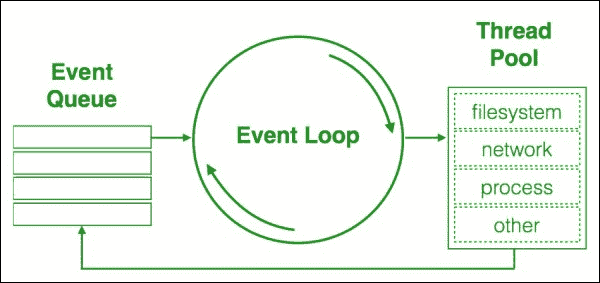

# 第五章：异步 JavaScript

如今，互联网用户变得没有耐心，页面加载或导航过程中的 2-3 秒延迟，他们就会失去兴趣，并且可能会离开服务，转而使用其他东西。我们最高优先级的是减少用户响应时间。这里的主要方法被称为*芥末切割*（[`www.creativebloq.com/web-design/responsive-web-design-tips-bbc-news-9134667`](http://www.creativebloq.com/web-design/responsive-web-design-tips-bbc-news-9134667)）。我们提取应用程序的核心体验所需的组件并首先加载它们。然后，我们逐步添加增强的体验。至于 JavaScript，我们需要最关心的是非阻塞流程。因此，我们必须避免在 HTML 渲染之前同步加载脚本，并将所有长时间运行的任务包装到异步回调中。这可能是你已经知道的事情。但你是高效地这样做吗？

在本章中，我们将介绍以下主题：

+   非阻塞 JavaScript

+   错误优先回调

+   延续传递风格

+   使用 ES7 方式处理异步函数

+   使用 Async.js 库进行并行任务和任务系列

+   事件处理优化

# 非阻塞 JavaScript

首先，让我们看看当我们异步做事情时实际发生的情况。无论何时在 JavaScript 中调用一个函数，它都会创建一个新的栈帧（执行对象）。每个内部调用都会进入这个帧。这里帧是从调用堆栈的顶部以**LIFO**（**后进先出**）的方式推入和弹出。换句话说，在代码中，我们调用`foo`函数，然后调用`bar`函数；然而，在执行过程中，`foo`调用`baz`函数。在这种情况下，在`call`堆栈中，我们有以下顺序：`foo`、`baz`，然后才是`bar`。所以`bar`是在`foo`的栈帧清空后才被调用。如果任何一个函数执行一个 CPU 密集型任务，所有后续的调用都会等待它完成。然而，JavaScript 引擎具有**事件队列**（或任务队列）。



如果我们为 DOM 事件订阅一个函数，或者将一个回调传递给定时器（`setTimeout`或`setInterval`）或任何 Web I/O API（XHR、IndexedDB 和 FileSystem），它最终都会进入相应的队列。然后，浏览器的事件循环决定何时将哪个回调推入回调堆栈。以下是一个例子：

```js
function foo(){
  console.log( "Calling Foo" );
}
function bar(){
  console.log( "Calling Bar" );
}
setTimeout(foo, 0 );
bar();
```

使用`setTimeout( foo, 0 )`，我们声明`foo`应立即被调用，然后我们调用`bar`。然而，`foo`进入一个队列，事件循环将其推入调用堆栈的更深位置：

```js
Calling Bar
Calling Foo
```

这也意味着如果`foo`回调执行一个 CPU 密集型任务，它不会阻塞主线程的执行流程。同样，异步发起的 XHR/Fetch 请求在等待服务器响应时不会锁定交互：

```js
function bar(){
  console.log( "Bar complete" );
}
fetch( "http://www.telize.com/jsonip" ).then(function( response ) {
  console.log( "Fetch complete" );
});
bar();

// Console:
// Bar complete
// Fetch complete
```

这如何适用于实际应用？以下是一个常见的流程：

```js
"use strict";
// This statement loads imaginary AMD modules
// You can find details about AMD standard in 
// "Chapter 2: Modular programming with JavaScript" 
require([ "news", "Session", "User", "Ui" ], function ( News, Session, User, Ui ) {
  var session = new Session(),
      news = new News(),
      ui = new Ui({ el: document.querySelector( "[data-bind=ui]" ) });
  // load news
 news.load( ui.update );
 //  authorize user 
 session.authorize(function( token ){
   var user = new User( token );
   // load user data
   user.load(function(){
     ui.update();
     // load user profile picture
     user.loadProfilePicture( ui.update );
     // load user notifications  
     user.loadNotifications( ui.update );
   });
 });
});
```

JavaScript 依赖的加载是排队进行的，所以浏览器可以在不等待加载完成的情况下渲染并把 UI 交付给用户。一旦脚本完全加载，应用程序就会把两个新任务推入队列：*加载新闻*和*认证用户*。再次强调，它们都不会阻塞主线程。只有在这些请求之一完成并涉及到主线程时，它才会根据新接收的数据增强 UI。一旦用户被认证并且会话令牌被检索到，我们可以加载用户数据。任务完成后，我们又会排队新的任务。

正如你所见，与同步代码相比，异步代码更难阅读。执行序列可能会相当复杂。此外，我们还需要特别注意错误控制。当处理同步代码时，我们可以用`try`/`catch`包围程序的一块，拦截执行期间抛出的任何错误：

```js
function foo(){
  throw new Error( "Foo throws an error" );
}
try {
  foo();
} catch( err ) {
  console.log( "The error is caught" );
}
```

然而，如果调用被排队，它就会滑出`try`/`catch`的作用域：

```js
function foo(){
  throw new Error( "Foo throws an error" );
}
try {
  setTimeout(foo, 0 );
} catch( err ) {
  console.log( "The error is caught" );
}
```

是的，异步编程有其怪癖。为了掌握这一点，我们将检查编写异步代码的现有实践。

因此，为了使代码异步，我们排队一个任务并订阅一个事件，当任务完成时触发该事件。实际上，我们采用的是*事件驱动编程*，特别是，我们应用了一个*发布/订阅*模式。例如，我们在第三章中提到的`EventTarget`接口，*DOM 脚本和 AJAX*，简而言之，就是关于为 DOM 元素的事件订阅监听器，并从 UI 或以编程方式触发这些事件：

```js
var el = document.createElement( "div" );
    event = new CustomEvent( "foo", { detail: "foo data" });
el.addEventListener( "foo", function( e ){
  console.log( "Foo event captured: ", e.detail );
}, false );

el.dispatchEvent( event );

// Foo event captured: foo data
```

在 DOM 背后，我们使用了一个类似的原理，但实现可能会有所不同。最流行的接口可能是基于两个主要方法`obj.on`（用于订阅处理程序）和`obj.trigger`（用于触发事件）：

```js
obj.on( "foo", function( data ){
  console.log( "Foo event captured: ", data );
});
obj.trigger( "foo", "foo data" );
```

这是在抽象框架中实现发布/订阅的方式，例如，Backbone。jQuery 在 DOM 事件上也使用这个接口。这个接口因其简单性而获得了势头，但它实际上并不能帮助处理意大利面条代码，也没有涵盖错误处理。

# 错误优先的回调

在 Node.js 中所有异步方法使用的模式被称为**错误优先的回调**。以下是一个例子：

```js
fs.readFile( "foo.txt", function ( err, data ) {
  if ( err ) {
    console.error( err );
  }
  console.log( data );
});
```

任何异步方法都期望有一个回调函数作为参数。完整的回调参数列表取决于调用方法，但第一个参数总是错误对象或 null。当我们使用异步方法时，函数执行期间抛出的异常不能在`try`/`catch`语句中检测到。事件发生在 JavaScript 引擎离开`try`块之后。在前面的例子中，如果在读取文件时抛出任何异常，它作为第一个和必需的参数落在回调函数上。尽管它的使用很普遍，但这种方法有其缺陷。在编写具有深层回调序列的实际代码时，很容易遇到所谓的**回调地狱**（[`callbackhell.com/`](http://callbackhell.com/)）。代码变得相当难以跟踪。

# 继续传递风格

我们经常需要一个异步调用的链，即一个任务在另一个任务完成后开始的任务序列。我们感兴趣的是异步调用链的最终结果。在这种情况下，我们可以从**继续传递风格**（**CPS**）中受益。JavaScript 已经有了内置的`Promise`对象。我们用它来创建一个新的`Promise`对象。我们把异步任务放在`Promise`回调中，并调用参数列表的`resolve`函数，以通知`Promise`回调任务已解决：

```js
"use strict";
    /**
     * Increment a given value
     * @param {Number} val
     * @returns {Promise}
     */
var foo = function( val ) {
      /**
       * Return a promise.
       * @param {Function} resolve
       */
      return new Promise(function( resolve ) {
        setTimeout(function(){
          resolve( val + 1 );
        }, 0 );
      });
    };

foo( 1 ).then(function( val ){
  console.log( "Result: ", val );
});

// Result: 5
```

在前面的例子中，我们调用`foo`，它返回`Promise`。使用这种方法，我们设置了一个处理器，当`Promise`被满足时调用。

那么关于错误控制呢？在创建`Promise`时，我们可以使用第二个参数（`reject`）中的函数来报告失败：

```js
"use strict";
/**
 * Make GET request
 * @param {String} url
 * @returns {Promise}
 */
function ajaxGet( url ) {
  return new Promise(function( resolve, reject ) {
    var req = new XMLHttpRequest();
    req.open( "GET", url );
    req.onload = function() {
      // If response status isn't 200 something went wrong
      if ( req.status !== 200 ) {
        // Early exit
        return reject( new Error( req.statusText ) );
      }
      // Everything is ok, we can resolve the promise
      return resolve( JSON.parse( req.responseText ) );
    };
    // On network errors
    req.onerror = function() {
      reject( new Error( "Network Error" ) );
    };
    // Make the request
    req.send();
  });
};

ajaxGet("http://www.telize.com/jsonip").then(function( data ){
  console.log( "Your IP is ", data.ip );
}).catch(function( err ){
  console.error( err );
});
// Your IP is 127.0.0.1
```

关于`Promises`最令人兴奋的部分是它们可以被链式调用。我们可以把回调函数排队作为异步任务，或者进行值转换：

```js
"use strict";
    /**
     * Increment a given value
     * @param {Number} val
     * @returns {Promise}
     */
var foo = function( val ) {
      /**
       * Return a promise.
       * @param {Function} resolve
       * @param {Function} reject
       */
      return new Promise(function( resolve, reject ) {
        if ( !val ) {
          return reject( new RangeError( "Value must be greater than zero" ) );
        }
        setTimeout(function(){
          resolve( val + 1 );
        }, 0 );
      });
    };

foo( 1 ).then(function( val ){
  // chaining async call
  return foo( val );
}).then(function( val ){
  // transforming output
  return val + 2;
}).then(function( val ){
  console.log( "Result: ", val );
}).catch(function( err ){
  console.error( "Error caught: ", err.message );
});

// Result: 5
```

注意，如果我们把`0`传给`foo`函数，入口条件会抛出一个异常，我们最终会进入`catch`方法的回调。如果在回调中抛出异常，它也会在`catch`回调中出现。

`Promise`链以类似于瀑布模型的方式解决——任务一个接一个地调用。我们也可以让`Promise`在几个并行处理任务完成后解决：

```js
"use strict";
    /**
     * Increment a given value
     * @param {Number} val
     * @returns {Promise}
     */
var foo = function( val ) {
      return new Promise(function( resolve ) {
        setTimeout(function(){
          resolve( val + 1 );
        }, 100 );
      });
    },
    /**
     * Increment a given value
     * @param {Number} val
     * @returns {Promise}
     */
    bar = function( val ) {
      return new Promise(function( resolve ) {
        setTimeout(function(){
          resolve( val + 2 );
        }, 200 );
      });
    };

Promise.all([ foo( 1 ), bar( 2 ) ]).then(function( arr ){
  console.log( arr );
});
//  [2, 4]
```

`Promise.all`静态方法在所有最新浏览器中还得不到支持，但你可以通过[`github.com/jakearchibald/es6-promise`](https://github.com/jakearchibald/es6-promise)的 polyfill 来获得。

另一种可能性是让`Promise`在任何一个并发运行的任务完成时解决或拒绝：

```js
Promise.race([ foo( 1 ), bar( 2 ) ]).then(function( arr ){
  console.log( arr );
});
// 2
```

# 用 ES7 的方式处理异步函数

我们已经在 JavaScript 中有了 Promise API。即将到来的技术是 Async/Await API，它出现在 EcmaScript 第七版的提案中（[`tc39.github.io/ecmascript-asyncawait/`](https://tc39.github.io/ecmascript-asyncawait/)）。这描述了我们如何可以声明非阻塞的异步函数并等待`Promise`的结果：

```js
"use strict";

// Fetch a random joke
function fetchQuote() {
  return fetch( "http://api.icndb.com/jokes/random" )
  .then(function( resp ){
    return resp.json();
  }).then(function( data ){
    return data.value.joke;
  });
}
// Report either a fetched joke or error
async function sayJoke()
{
  try {
    let result = await fetchQuote();
    console.log( "Joke:", result );
  } catch( err ) {
    console.error( err );
  }
}
sayJoke();
```

目前，API 在任何一个浏览器中都不受支持；然而，你可以在运行时使用 Babel.js 转换器来运行它。你也可以在线尝试这个例子：[`codepen.io/dsheiko/pen/gaeqRO`](http://codepen.io/dsheiko/pen/gaeqRO)。

这种新语法允许我们编写看起来是同步运行的异步代码。因此，我们可以使用诸如`try`/`catch`之类的常见构造来进行异步调用，这使得代码更加可读，更容易维护。

# 使用 Async.js 库的并行任务和任务系列

处理异步调用的另一种方法是一个名为**Async.js**的库（[`github.com/caolan/async`](https://github.com/caolan/async)）。使用这个库时，我们可以明确指定我们想要任务批次如何解析—作为瀑布（链）或并行。

在第一种情况下，我们可以向`async.waterfall`提供回调数组，假设当一个完成后，下一个会被调用。我们还可以将一个回调中解析的值传递给另一个，并在方法的`on-done`回调中接收累积值或抛出的异常：

```js
/**
 * Concat given arguments
 * @returns {String}
 */
function concat(){
  var args = [].slice.call( arguments );
  return args.join( "," );
}

async.waterfall([
    function( cb ){
      setTimeout( function(){
        cb( null, concat( "foo" ) );
      }, 10 );
    },
    function( arg1, cb ){
      setTimeout( function(){
        cb( null, concat( arg1, "bar" ) );
      }, 0 );
    },
    function( arg1, cb ){
      setTimeout( function(){
        cb( null, concat( arg1, "baz" ) );
      }, 20 );
    }
], function( err, results ){
   if ( err ) {
     return console.error( err );
   }
   console.log( "All done:", results );
});

// All done: foo,bar,baz
```

同样，我们将回调数组传递给`async.parallel`。这次，它们全部并行运行，但当它们都解决时，我们在方法的`on-done`回调中接收结果或抛出的异常：

```js
async.parallel([
    function( cb ){
      setTimeout( function(){
        console.log( "foo is complete" );
        cb( null, "foo" );
      }, 10 );
    },
    function( cb ){
      setTimeout( function(){
        console.log( "bar is complete" );
        cb( null, "bar" );
      }, 0 );
    },
    function( cb ){
      setTimeout( function(){
        console.log( "baz is complete" );
        cb( null, "baz" );
      }, 20 );
    }
], function( err, results ){
   if ( err ) {
     return console.error( err );
   }
   console.log( "All done:", results );
});

// bar is complete
// foo is complete
// baz is complete
// All done: [ 'foo', 'bar', 'baz' ]
```

当然，我们可以组合这些流程。此外，该库还提供了迭代方法，如`map`、`filter`和`each`，适用于异步任务的数组。

Async.js 是这种类型的第一个项目。今天，有许多受此启发的库。如果你想要一个轻量级且健壮的与 Async.js 类似的解决方案，我建议你查看一下 Contra ([`github.com/bevacqua/contra`](https://github.com/bevacqua/contra))。

# 事件处理优化

编写内联表单验证器时，你可能会遇到一个问题。当你输入时，`user-agent`会不断向服务器发送验证请求。这样你可能会很快就会通过产生 XHR 来污染网络。另一个你可能熟悉的问题是一些 UI 事件（`touchmove`、`mousemove`、`scroll`和`resize`）会频繁触发，订阅的事件处理程序可能会使主线程过载。这些问题可以通过两种已知的方法来解决，称为*去抖*和*节流*。这两个函数都可以在第三方库（如 Underscore 和 Lodash）中找到（`_.debounce`和`_.throttle`）。然而，它们可以用一点`o`代码实现，不需要依赖额外的库来实现这个功能。

## 去抖

通过去抖，我们确保在重复触发的事件中，处理函数只被调用一次：

```js
  /**
   * Invoke a given callback only after this function stops being called `wait` milliseconds
   * usage:
   * debounce( cb, 500 )( ..arg );
   *
   * @param {Function} cb
   * @param {Number} wait
   * @param {Object} thisArg
   */
  function debounce ( cb, wait, thisArg ) {
    /**
     * @type {number}
     */
    var timer = null;
    return function() {
      var context = thisArg || this,
          args = arguments;
      window.clearTimeout( timer );
      timer = window.setTimeout(function(){
        timer = null;
        cb.apply( context, args );
      }, wait );
    };
  }
```

假设我们希望只有在组件进入视图时才进行延迟加载，在我们的案例中，这需要用户至少向下滚动 200 像素：

```js
var TOP_OFFSET = 200;
// Lazy-loading
window.addEventListener( "scroll", debounce(function(){
  var scroll = window.scrollY || window.pageYOffset || document.documentElement.scrollTop;
  if ( scroll >= TOP_OFFSET ){
     console.log( "Load the deferred widget (if not yet loaded)" );
  }
}, 20 ));
```

如果我们简单地为滚动事件订阅一个监听器，它在用户开始和停止滚动的时间间隔内会被调用很多次。多亏了去抖代理，检查是否是加载小部件的时候的处理程序只调用一次，即当用户停止滚动时。

## 节流

通过节流，我们设置在事件触发时允许处理程序被调用的频率：

```js
  /**
   * Invoke a given callback every `wait` ms until this function stops being called
   * usage:
   * throttle( cb, 500 )( ..arg );
   *
   * @param {Function} cb
   * @param {Number} wait
   * @param {Object} thisArg
   */
 function throttle( cb, wait, thisArg ) {
  var prevTime,
      timer;
  return function(){
    var context = thisArg || this,
        now = +new Date(),
        args = arguments;

    if ( !prevTime || now >= prevTime + wait ) {
      prevTime = now;
      return cb.apply( context, args );
    }
    // hold on to it
    clearTimeout( timer );
    timer = setTimeout(function(){
      prevTime = now;
      cb.apply( context, args );
    }, wait );
  };
}
```

所以如果我们通过节流在容器的`mousemove`事件上订阅一个处理程序，`handler`函数一次（在这里是每秒一次）直到鼠标光标离开容器边界：

```js
document.body.addEventListener( "mousemove", throttle(function( e ){
  console.log( "The cursor is within the element at ", e.pageX, ",", e.pageY );
}, 1000 ), false );

// The cursor is within the element at 946 , 715
// The cursor is within the element at 467 , 78
```

## 编写不会影响延迟关键事件的回调

我们有些任务不属于核心功能，可能是在后台运行。例如，我们希望在不滚动页面时派发分析数据。我们不使用去抖或节流，以免加重 UI 线程的负担，可能导致应用无响应。在这里去抖不相关，节流也不会提供精确数据。然而，我们可以使用`requestIdleCallback`原生方法（[`w3c.github.io/requestidlecallback/`](https://w3c.github.io/requestidlecallback/)）在`user-agent`空闲时安排任务。

# 总结

我们最优先的目标之一是减少用户响应时间，即，应用程序架构必须确保用户流程永远不会被阻塞。这可以通过将任何长时间运行的任务排队异步调用来实现。然而，如果您有许多异步调用，其中一些并行运行，一些顺序运行，不特别注意，很容易陷入所谓的回调地狱。恰当地使用诸如*继续传递风格*（*Promise API*）、Async/Await API 或外部库如 Async.js 等方法可以显著改进您的异步代码。我们还需要记住，像`scroll`/`touch`/`mousemove`这样的某些事件，虽然被频繁触发，但频繁调用订阅的监听器可能会造成不必要的 CPU 负载。我们可以使用去抖和节流技术来避免这些问题。

通过学习异步编程的基础，我们可以编写非阻塞应用程序。在第六章，大规模 JavaScript 应用程序架构，我们将讨论如何使我们的应用程序可扩展，并总体上提高可维护性。
