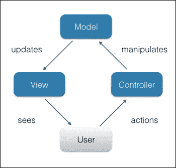
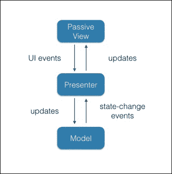
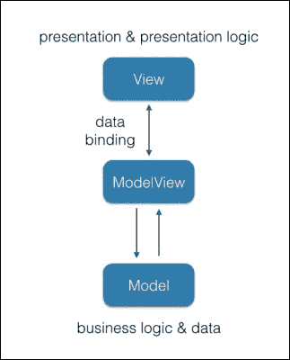

# 第六章：大型 JavaScript 应用程序架构

任何有经验的程序员都会努力使代码具有可重用性和可维护性。在这里，我们遵循面向对象编程的原则，如封装、抽象、继承、组合和多态。除了这些基本原则之外，我们还遵循 Robert C. Martin 定义的面向对象编程和设计的基本原则，即著名的**SOLID**原则([`en.wikipedia.org/wiki/SOLID_(object-oriented_design)`](https://en.wikipedia.org/wiki/SOLID_(object-oriented_design)))。在代码审查过程中，如果我们遇到任何这些原则的违反，都会被视为代码异味，并导致重构。我们每天在开发中解决的核心任务，通常都是我们一次又一次遇到的问题。在本章中，我们将介绍 JavaScript 开发中最常见的通用架构解决方案和概念：

+   JavaScript 中的设计模式

+   使用 JavaScript MV* 框架了解 JavaScript 中的关注分离

# JavaScript 中的设计模式

抽象的万无一失的解决方案早已为人所知，通常被称为**设计模式**。编程中的最初的 23 个设计模式首次收集在 1995 年出版的*Erich Gamma*、*Richard Helm*、*Ralph Johnson*和*John Vlissides*(*GoF*)合著的《设计模式：可复用面向对象软件的元素》一书中。这些模式与特定的编程语言无关。尽管如此，*Addy Osmani*在他的在线书籍《学习 JavaScript 设计模式》([`addyosmani.com/resources/essentialjsdesignpatterns/book/`](http://addyosmani.com/resources/essentialjsdesignpatterns/book/))中展示了如何实现一些 GoF 的模式，特别是在 JavaScript 中。

在这里，我们不会重复他的工作；相反，我们将研究如何组合这些模式。JavaScript 开发中的一个常见问题是在动态创建的对象之间的通信。例如，我们有一个对象，并需要从对象`foo`调用对象`bar`的`baz`方法。然而，我们无法知道`bar`是否已经可用。GoF 的模式中介者鼓励我们创建一个用于代理其他对象之间通信的对象。因此，通过避免对象之间的直接交互，我们促进了松耦合。在我们的案例中，尽管调用`bar.baz`，但我们告知中介者我们的意图。中介者在`bar`可用时会进行调用：

```js
"use strict";

class EventEmitter {
  /** Initialize */
  constructor() {
    /**
    * @access private
    * @type {EventHandler[]}
    */
   this.handlers = [];
  }
 /**
  * Subscribe a cb handler for a given event in the object scope
  * @param {String} ev
  * @param {Function} cb
  * @param {Object} [context]
  * @returns {EventEmitter}
  */
  on( ev, cb, context ){
     this.handlers.push({
       event: ev,
       callback: cb,
       context: context
     });
     return this;
  }
/**
  * Emit a given event in the object
  * @param {String} ev
  * @param {...*} [arg]
  * @returns {EventEmitter}
  */
  trigger( ev, ...args ) {
    this.handlers.forEach(function( evObj ){
     if ( evObj.event !== ev || !evObj.callback.apply ) {
       return;
     }
     evObj.callback.apply( evObj.context || this, args );
   }, this );
   return this;
  }
}

window.mediator = new EventEmitter();
```

在这里，我们使用了 ES6 语法，它非常适合描述代码设计。借助 ES6，意图可以简洁明了地表达，而在 JavaScript 的 ES5 及更早版本中，要达到同样的效果需要编写额外的代码行。

在前面的示例中，我们通过实例化`EventEmitter`类创建了一个中介者对象。`EventEmitter`实现了一种称为 PubSub 的消息模式。这种模式描述了一种消息交换，其中一个对象向另一个对象发送事件，第二个对象调用订阅了该事件的手动函数（如果有的话）。换句话说，如果我们为`foo`对象的`myevent`中介者事件（`mediator.on`）订阅一个处理器函数，我们就可以通过在中介者上发布`myevent`事件来调用`foo`的处理器（`mediator.trigger`）。让我们看一个例子。我们的虚构应用程序是本地化的。它从登录屏幕开始。当用户登录时，屏幕会跳转到带有新闻的仪表板。用户可以在任意屏幕上更改语言。然而，在第一阶段，新闻视图对象甚至还没有被创建，而在第二阶段，登录视图对象已经被销毁。但是，如果我们使用中介者，我们可以触发`translate`事件，所有可用的订阅者都将收到消息：

```js
class News {
  /** Initialize */
  constructor(){
    mediator.on( "translate", this.update, this );
  }
  /** @param {String} lang */
  update( lang ){
    // fetch news from remote host for a given lang
    console.log( "News loaded for", lang );
  }
}

class Language {
  /** @param {String} lang */
  change( lang ) {
    mediator.trigger( "translate", lang );
  }
}

let language = new Language();
new News()
language.change( "de" );
```

每当用户更改语言(`language.change`)时，相应的事件通过中介者广播出去。当 news 实例可用时，它会调用接收事件负载的`update`方法。在实际应用中，这个实例将为给定语言加载新闻并更新视图。

那么我们取得了什么成果呢？当我们使用中介者和基于事件驱动的方法（PubSub）时，我们的对象/模块是松耦合的，因此，整体架构更能接受需求变化。此外，我们在单元测试中获得了更多的灵活性。

在撰写这本书的时候，没有任何浏览器提供对 ES6 类语句的本地支持。然而，你可以使用 Babel.js 运行时（[`babeljs.io/docs/usage/browser/`](https://babeljs.io/docs/usage/browser/)）或转译来运行给定的代码。

当应用程序增长，我们处理的事件太多时，将事件处理封装到一个单独的消息总线对象中是有意义的。这时，`Facade`模式就会浮现在脑海中，它为其他接口定义了一个统一的高层次接口：

```js
class Facade {
  constructor(){
    mediator.on( "show-dashboard", function(){
      this.dashboard.show()
      this.userPanel.remove();
    }, this )
    .on( "show-userpanel", function(a){
      this.dashboard.hide()
      this.userPanel = new UserPanel( this.user );
    }, this )
    .on( "authorized", function( user ){
      this.user = user;
      this.topBar = new TopBar( user.name );
      this.dashboard = new Dashboard( user.lang );
      this.mainMenu = new MainMenu( user.lang );
    }, this )
    .on( "logout", function(){
      this.userPanel.remove();
      this.topBar.remove();
      this.dashboard.remove();
      this.mainMenu.remove();
      this.login = new Login();
    }, this );
  }
}
```

在初始化`Facade`类之后，我们可以通过在中介者上触发事件来启动一个涉及多个模块的复杂流程。这种方式将行为逻辑封装到一个专门的物体中；这使得代码更具可读性，整个系统更容易维护。

# 理解 JavaScript 中的关注点分离

编写 JavaScript（尤其是客户端）时，一个主要的挑战是避免*意大利面条代码*，在这种代码中，同一个模块渲染用户视图，处理用户交互，还做业务逻辑。这样的模块可能会迅速成长为一个源文件怪物，开发者在其中迷失方向，而不是发现问题并解决问题。

被称为**模型-视图-控制器**（**MVC**）的编程范式将应用程序功能分为不同的层次，如表示层、数据层和用户输入层。简而言之，MVC 意味着用户与控制器模块中的视图交互，控制器模块操作模型，模型更新视图。在 JavaScript 中，控制器通常是一个观察者，它监听 UI 事件。用户点击一个按钮，事件被触发，控制器处理相应的模型。例如，控制器请求模型将提交的数据发送到服务器。视图得知模型状态变化，并相应地作出反应，比如说它显示一条消息，“数据已保存”。以下图片展示了 MVC 模式中组件的协作：



正如你所见，我们可以将所有用户输入处理器封装在单个模块（这里指的是**控制器**）中，我们可以将遵循领域驱动设计实践的数据层抽象为模型模块。最终，我们有一个负责更新 UI 的视图模块。所以，模型对组件的表示（HTML，CSS）一无所知，也不知道 DOM 事件——这只是纯粹的数据及其操作。控制器只知道视图的事件和视图 API。最后，视图不知道模型和控制器，但暴露出它的 API 并发送事件。因此，我们得到了一个易于维护和测试的高效架构。

然而，在由 JavaScript 构建的 UI 情况下，将视图逻辑和控制器逻辑分开并不那么容易。这里我们有了 MVC 的衍生版本：**MVP**和**MVVM.MVP**。

在**MVP**模式中的**P**代表**Presenter**，它负责处理用户请求。Presenter 监听视图事件，检索数据，操作数据，并使用视图 API 更新展示。Presenter 可以与模型交互以持久化数据。正如您将在以下图表中看到的，Presenter 就像一个经理，它接收请求，使用可用资源处理它，并指导视图进行更改。下面的图片显示了 MVP 模式中组件的协作：



MVP 相比于 MVC 提供了更好的可测试性和关注分离。您可以在[`codepen.io/dsheiko/pen/WQymbG`](http://codepen.io/dsheiko/pen/WQymbG)找到一个实现 MVP 的`TODO`应用的示例。

## MVVM

被动的 MVP 观点主要涉及数据绑定和 UI 事件的代理。实际上，这些都是我们可以抽象的。在**模型-视图-视图模型**（**MVVM**）方法中的视图可能根本不需要任何 JavaScript。通常，视图是使用视图模型知道的指令扩展的 HTML。模型表示特定领域的数据并暴露相应的诸如验证的方法。视图模型是视图和模型之间的中间人。它将模型的数据对象转换为视图所需的格式，例如，当模型属性包含原始日期时间时，视图模型将其转换为视图中所期望的格式如`2016 年 1 月 1 日 00:01`。下面的图片显示了 MVVM 模式中组件的协作：



MVVM 模式的优势在于命令式和声明式编程两者之间。它可能通过将大部分通用视图逻辑抽象到一个公共绑定模块中来大大减少开发时间。随着像 Knockout，Angular 和 Meteor 这样的流行 JavaScript 框架的出现，这个模式得到了推动。你可以在[`msdn.microsoft.com/en-us/magazine/hh297451.aspx`](https://msdn.microsoft.com/en-us/magazine/hh297451.aspx)找到基于 MVVM 模式的 RSS 阅读器应用程序的示例。

# 使用 JavaScript MV* 框架

当你开始一个新的可扩展的网页应用时，你必须决定是否使用框架。现在很难找到任何不是建立在框架之上的大型项目。然而，使用框架也有缺点；只需看看**零框架宣言**（[`bitworking.org/news/2014/05/zero_framework_manifesto`](http://bitworking.org/news/2014/05/zero_framework_manifesto)）。然而，如果你决定支持框架，那么你将面临一个选择困境：选用哪一个。这确实不是一件易事。现在的 JavaScript 框架非常众多；只需看看 TodoMVC 提供的多样性([`todomvc.com`](http://todomvc.com))。很难一一审查它们，但我们可以简要地检查一些最受欢迎的框架。根据最近的调查（例如，[`ashleynolan.co.uk/blog/frontend-tooling-survey-2015-results`](http://ashleynolan.co.uk/blog/frontend-tooling-survey-2015-results)），目前最流行的是 Angular，React 和 Backbone。这三个给出了非常不同的开发范式。所以它们适合用来概述 JavaScript 框架的一般情况。

## 后端

Backbone ([`backbonejs.org`](http://backbonejs.org)) 非常轻量级且易于入门。这是唯一一个你可以在相对较短的时间内掌握整个代码库的流行框架([`backbonejs.org/docs/backbone.html`](http://backbonejs.org/docs/backbone.html))。本质上，Backbone 为你提供了一致性的抽象，除此之外什么也没有。总的来说，我们将所有的 UI 相关逻辑封装到 `Backbone.View` 的子类型中。视图所需的所有数据，我们将其放入 `Backbone.Model` 或 `Backbone.Collection` 的派生类型中（当它是一个条目列表）。最后，我们通过 `Backbone.Route` 实现基于哈希的导航请求的路由。

让我们考虑一个例子。我们的虚构应用程序允许我们通过给定的电子邮件地址查找联系人。由于我们希望这个应用程序友好，所以期望在应用程序表单中输入时进行验证。为此，我们需要一点 HTML：

```js
<form data-bind="fooForm">
      <label for="email">Email:</label>
      <input id="email" name="email" required />
      <span class="error-msg" data-bind="errorMsg"></span>
      <button data-bind="submitBtn" type="submit">Submit</button>
  </form>
```

这里有一个输入控件，一个提交按钮，以及一个可能错误信息的容器。为了管理这些，我们将使用以下 `Backbone.View`：

**ContactSearchView.js**

```js
"use strict";
/** @class {ContactSearchView}  */
var ContactSearchView = Backbone.View.extend(/** @lends ContactSearchView.prototype */{
  events: {
    "submit": "onSubmit"
  },
  /** @constructs {ContactSearchView} */
  initialize: function() {
    this.$email = this.$el.find( "[name=email]" );
    this.$errorMsg = this.$el.find( "[data-bind=errorMsg]" );
    this.$submitBtn = this.$el.find( "[data-bind=submitBtn]" );
    this.bindUi();
  },
  /** Bind handlers */
  bindUi: function(){
    this.$email.on( "input", this.onChange.bind( this ) );
    this.model.on( "invalid", this.onInvalid.bind( this ) );
    this.model.on( "change", this.onValid.bind( this ) );
  },
  /** Handle input onchange event */
  onChange: function(){
    this.model.set({
      email: this.$email.val(),
      // Hack to force model running validation on repeating payloads
      "model:state": ( 1 + Math.random() ) * 0x10000
    }, { validate: true });
  },
  /** Handle model in invalid state */
  onInvalid: function(){
    var error = arguments[ 1 ];
    this.$errorMsg.text( error );
    this.$submitBtn.prop( "disabled", "disabled" );
  },
  /** Handle model in valid state */
  onValid: function(){
    this.$errorMsg.empty();
    this.$submitBtn.removeProp( "disabled" );
  },
  /** Handle form submit */
  onSubmit: function( e ){
    e.preventDefault();
    alert( "Looking up for " + this.model.get( "email") );
  }
});
```

在构造函数（`initialize` 方法）中，我们将 HTML 的操作节点与视图的属性绑定，并订阅 UI 和模型事件的事件处理程序。然后，我们在 `submit` 表单和 `input` 表单上注册监听器方法。当我们输入时，第二个处理程序被调用，并更新模型。模型运行验证，根据结果，它以 `invalid` 或 `change` 模型事件作出响应。在 `invalid` 事件的情况下，视图显示错误信息，否则它被隐藏。

现在我们可以添加模型，如下所示：

**ContactSearchModel.js**

```js
 "use strict";
/** @class {ContactSearchModel}  */
var ContactSearchModel = Backbone.Model.extend(/** @lends ContactSearchModel.prototype */{
  /** @type {Object} */
  defaults: {
    email: ""
  },
  /**
   * Validate email
  * @param {String} email
  */
  isEmailValid: function( email ) {
    var pattern = /^[a-zA-Z0-9\!\#\$\%\&\'\*\+\-\/\=\?\^\_\`\{\|\}\~\.]+@[a-zA-Z0-9.\-]+\.[a-zA-Z]{2,4}$/g;
    return email.length && pattern.test( email );
  },
  /**
   * Validate model
  * @param {Map} attrs
  */
  validate: function( attrs ) {
    if ( !attrs.email ) {
      return "Email is required.";
    }
    if ( !this.isEmailValid( attrs.email ) ) {
      return "Invalid email address.";
    }
  }
});
```

这个模型在`defaults`属性中定义了领域数据，并提供了`validate`方法，当我们将模型设置或保存时会自动调用该方法。

现在我们可以把所有东西结合起来并初始化视图：

```js
<!DOCTYPE html>
<html>
  <script type="text/javascript" src="img/jquery.min.js"></script>
  <script type="text/javascript" src="img/underscore-min.js"></script>
  <script type="text/javascript" src="img/backbone-min.js"></script>
  <script type="text/javascript" src="img/ContactSearchView.js"></script>
  <script type="text/javascript" src="img/ContactSearchModel.js"></script>
  <style>
    fieldset { border: 0; }
    .error-msg{ color: red; }
  </style>
  <body>
   <form data-bind="fooForm">
    <fieldset>
      <label for="email">Email:</label>
      <input id="email" name="email" required />
      <span class="error-msg" data-bind="errorMsg"></span>
    </fieldset>
    <fieldset>
      <button data-bind="submitBtn" type="submit">Submit</button>
    </fieldset>
  </form>
<script>

// Render foo view
 new ContactSearchView({
   el: $( "[data-bind=fooForm]" ),
   model: new ContactSearchModel
 });

</script>
  </body>
</html> 
```

backbone 本身的大小令人惊讶地小（6.5 Kg 压缩），但是加上 jQuery 和 Underscore 的依赖关系，这使得整体捆绑包变得相当大。这两个依赖关系在过去至关重要，但现在值得怀疑——我们是否需要它们？因此，检查 **Exoskeleton** ([`exosjs.com/`](http://exosjs.com/)) 项目是有意义的，这是一个经过优化的 Backbone 版本，无需依赖关系即可完美工作。

## 安吉拉

Angular ([`Angular.org`](http://Angular.org)) 现在似乎是世界上最受欢迎的 JavaScript 框架。它由谷歌支持，被认为是一个解决你大部分日常任务的框架。特别是，Angular 有一个名为双向绑定的特性，这意味着 UI 变化传播到绑定的模型，反之亦然，模型变化（例如，通过 XHR）更新 UI。

在 AngularJS 中，我们直接在 HTML 中定义行为，使用指令。指令是自定义的元素和属性，它们假设与 Web 组件类似的 UI 逻辑。实际上，你可以在 AngularJS 中创建功能性小部件，而不需要写一行 JavaScript 代码。AngularJS 中的模型是简单数据容器，与 Backbone 不同，它们没有与外部来源的连接。当我们需要读取或写入数据时，我们使用服务。任何数据发送到视图时，我们可以使用过滤器来格式化输出。该框架利用依赖注入（DI）模式，允许将核心组件作为依赖项相互注入。这使得模块更容易满足需求变化和单元测试。让我们在实践中看看这个：

```js
<!DOCTYPE html>
<html>
  <script src="img/angular.min.js"></script>
  <style>
    fieldset { border: 0; }
    .error-msg{ color: red; }
  </style>
  <body>
   <form ng-app="contactSearch" name="csForm" ng-submit="submit()" ng-controller="csController">
    <fieldset>
      <label for="email">Email:</label>
      <input id="email" name="email" ng-model="email" required
          ng-pattern="/^[a-zA-Z0-9\!\#\$\%\&\'\*\+\-\/\=\?\^\_\`\{\|\}\~\.]+@[a-zA-Z0-9.\-]+\.[a-zA-Z]{2,4}$/"  />
      <span class="error-msg" ng-show="csForm.email.$dirty && csForm.email.$invalid">
        <span ng-show="csForm.email.$error.required">Email is required.</span>
        <span ng-show="csForm.email.$error.pattern">Invalid email address.</span>
      </span>
    </fieldset>
    <fieldset>
      <button type="submit" ng-disabled="csForm.email.$dirty && csForm.email.$invalid">Submit</button>
    </fieldset>
  </form>
<script>
  "use strict";
  angular.module( "contactSearch", [] ).controller( "csController", [ "$scope", function ( $scope ){
    $scope.email = "";
    $scope.submit = function() {
      alert( "Looking up for " + $scope.email );
    };
  }]);
</script>
  </body>
</html>
```

在这个例子中，我们声明了一个输入字段，并将其绑定到一个模型邮箱上（`ng-model` 指令）。表单验证的工作方式与 HTML5 表单相同：如果我们声明了一个输入类型为邮箱的输入字段并进行相应的验证。这里我们使用默认的文本类型，并使用 `ng-pattern`（类似于 HTML5 的 pattern）属性来设置与 Backbone 案例相同的邮箱验证规则。接下来，我们依靠 `ng-show` 指令在输入状态为空（`csForm.email.$dirty`）或无效（`csForm.email.$invalid`）时显示错误信息块。在这种情况下，提交按钮相反是隐藏的。使用 `ng-controller` 和 `ng-submit` 指令，我们将 `csController` 控制器和 `on-submit` 处理程序绑定到表单上。在 `csController` 的主体（JavaScript）中，`$scope.submit` 期望有一个处理表单提交事件的事件处理函数。

正如你所看到的，与 Angular 相比，实现相同任务所需的总代码量要少得多。然而，我们必须接受一个事实，那就是将应用逻辑保持在 HTML 中确实使得代码难以阅读。

此外，Angular 每个指令都会订阅许多观察者（意图处理器、自动脏检查等），在包含众多交互元素的页面中，这会使其变得缓慢且资源消耗大。如果你想调整你的应用性能，你最好去学习 Angular 的源代码，这对于有 ~11.2K 行代码（版本 1.4.6）来说将是一个具有挑战性的任务。

## React

React ([`facebook.github.io`](https://facebook.github.io)) 是 Facebook 的一个项目，它不是一个框架，而是一个库。React 独特的 approach 暗示了基于组件的应用。本质上，React 通过所谓的虚拟 DOM 来定义组件的视图，这使得 UI 渲染和更新出奇地快。由于 React 专注于视图，因此它包含了一个模板引擎。可选地，React 组件可以用 JavaScript 的一个子集 JSX 来编写，其中你可以将 HTML 模板放在 JavaScript 中。JSX 可以根据以下示例动态解析，或者可以预编译。由于 React 只处理视图，并且不假设其他关注点，因此与其它框架一起使用是有意义的。因此，React 可以插入到框架中（例如，作为 Angular 的指令或 Backbone 的视图）。

在这次实现联系人搜索应用的过程中，我们将使用 React 来控制我们的示例视图，通过将其拆分为两个组件（`FormView` 和 `EmailView`）。第一个组件定义了搜索表单的视图：

```js
   /** @class {FormView}  */
var FormView = React.createClass({
  /** Create an initial state with the model  */
  getInitialState: function () {
    return {
      email: new EmailModel()
    };
  },
  /**
   * Update state on input change event
   * @param {String} value - changed value of the input
   */
  onChange: function( value ){
    this.state.email.set( "email", value );
    this.forceUpdate();
  },
  /** Handle form submit */
  onSubmit: function( e ){
    e.preventDefault();
    alert( "Looking up for " + this.state.email.get( "email") );
  },
  /** Render form */
  render: function () {
    return <form onSubmit={this.onSubmit}>
      <fieldset>
      <label htmlFor="email">Email:</label>
      <EmailView model={this.state.email} onChange={this.onChange} />
      </fieldset>
      <fieldset>
        <button data-bind="submitBtn" type="submit">Submit</button>
      </fieldset>
    </form>;
  }
});
```

在 `render` 方法中，我们使用 JSX 表示法声明了组件的视图。这使得操作虚拟 DOM 变得容易得多。与 Angular 类似，我们可以在 HTML 中直接引用组件作用域。因此，我们可以通过引用 `onSubmit` 和 `onChange` 属性中的相应处理程序来订阅表单提交事件和输入变更事件。由于 React 没有内置模型，我们复用了在探索 Backbone 时创建的 `ContactSearchModel` 模型。

你可能会注意到 JSX 中有一个 `EmailView` 自定义标签。这就是我们引用我们的第二个组件的方式，它代表了一个电子邮件输入控件：

```js
    /** @class {EmailView}  */
var EmailView = React.createClass({
  /**
   * Delegate input on-changed event to the from view
   * @param {Event} e
   */
  onChanged: function( e ){
    this.props.onChange( e.target.value );
  },
  /** Render input */
  render: function () {
    var model = this.props.model;
    return <span>
      <input id="email" type="text" value={model.email} onChange={this.onChanged} />      
      <span className="error-msg" data-bind="errorMsg"> {model.isValid() ? "" : model.validationError}</span>
    </span>;
  }
});
```

在这里，我们将电子邮件输入绑定到模型，将错误消息容器绑定到模型状态。我们还把输入的 `onChange` 事件传递给了父组件。

好了，现在我们可以将组件添加到 HTML 中并渲染表单：

```js
<!DOCTYPE html>
<html>
<head>
  <script src="img/react.js"></script>
  <script src="img/JSXTransformer.js"></script>
  <script type="text/javascript" src="img/underscore-min.js"></script>
  <script type="text/javascript" src="img/backbone-min.js"></script>
  <script type="text/javascript" src="img/ContactSearchModel.js"></script>
  <style>
    fieldset { border: 0; }
    .error-msg{ color: red; }
  </style>
</head>
<body>
  <div data-bind="app"></div>
<script type="text/jsx">
  /** @jsx React.DOM */

// Please insert here both components
// FormView and EmailView

// render app
React.render(
  <FormView />,
  document.querySelector( "[data-bind=app]" )
);
</script>
</body>
</html>
```

我们通过相应的自定义元素来在模板中引用组件，比如 web-components。不要让自己混淆于它们的相似性，React 组件是从浏览器中抽象出来的，而 web-components 类似于浏览器原生组件。React 的核心概念是虚拟 DOM 允许我们避免不必要的 DOM reflow 周期，这使得该库适用于高性能应用。React 在服务器上使用 Node.js 渲染静态页面非常出色。因此，我们可以在服务器和客户端之间复用应用程序组件。

# 总结

编写可维护的代码是一门艺术。或许在提供这方面指导方面最好的书籍是*Robert C. Martin*所著的《Clean Code: A Handbook of Agile Software Craftsmanship》。这本书讲述了如何命名函数、方法、类，注释，代码格式化，当然还有面向对象编程（OOP）和 SOLID 原则的正确使用。然而，当我们重复使用本书或设计模式系列中描述的解决方案时，我们必须将它们翻译成 JavaScript，这可能由于语言的特性而具有挑战性。在更高的层次上，我们必须将代码划分为表示层、业务逻辑层、数据访问层和持久化层，其中每一组代码都关注一个问题，并且与其他代码松耦合。在这里，我们可以选择一种方法。在 JavaScript 世界中，这通常是 MVC（MVP 或 MVVM 或其他）的派生。考虑到这一点，一个体面的编程设计需要大量的抽象。如今，我们可以使用许多框架。它们提供了多样的编程范式。
