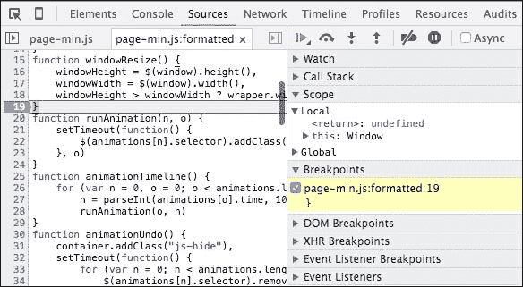
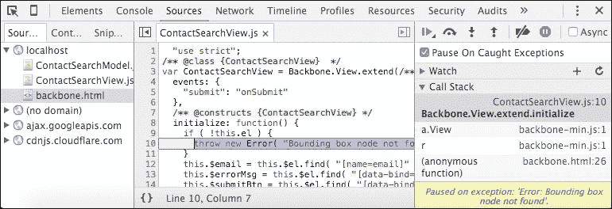
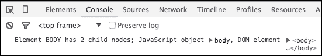
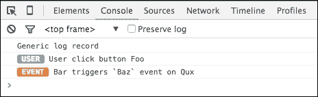
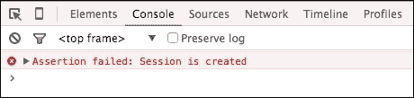
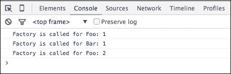
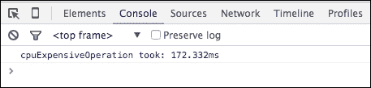
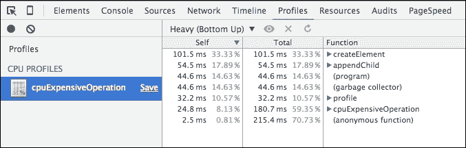
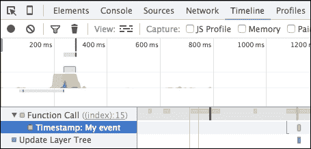
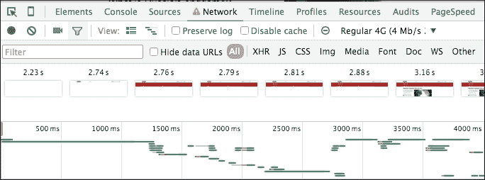

# 第八章：调试和剖析

调试是编程的一个棘手部分。开发过程中的错误是不可避免的。无论我们的经验如何，我们都要花很多时间来寻找它们。这种情况发生了。通过查看代码，你可能找不到错误，应用程序可能没有问题，但开发者可能会花几个小时直到他们找到一个愚蠢的原因，比如拼写错误的属性名。如果更好地利用浏览器开发工具，可以节省很多时间。因此，在本章中，我们将考虑以下主题：

+   如何发现错误

+   充分利用控制台 API

+   如何调整性能

# 寻找错误

调试是关于找到并解决阻止预期应用程序行为的缺陷。在这方面，关键是找到导致问题的代码。当我们遇到一个错误时通常会做什么呢？比如说，我们有一个表单，它被假设在提交事件上运行验证，但它没有。首先，我们需要满足许多假设。例如，如果表单元素的引用是有效的，如果在注册监听器时事件和方法名称拼写正确，如果对象上下文在监听器主体中丢失等等。

一些错误可以自动发现，例如通过验证方法入口和出口点的输入和输出（参见设计合同在：[`en.wikipedia.org/wiki/Design_by_contract`](https://en.wikipedia.org/wiki/Design_by_contract)）。然而，我们不得不手动查找其他错误，在这方面我们可以使用两种选择。从代码肯定正确的地方逐步走向问题点（自底向上的调试），或者相反，从断点退回到查找断裂源。在这里，浏览器开发工具可以派上用场。

最先进的是 Chrome DevTools。我们可以打开其中的**源代码**面板并在代码中设置断点。在达到断点时，浏览器停止执行并显示一个带有实际变量作用域和调用堆栈的面板。它还提供了控制，可以用来*逐行*前后*单步执行*代码。下面的屏幕截图显示了使用断点的调试帮助：



然而，这可能会在 DevTools 中导航代码库时变得棘手。幸运的是，你可以在 IDE 外直接设置断点。你只需要在想要浏览器中断的行上放置调试器语句。

有时，很难弄清楚 DOM 的情况。我们可以让 DevTools 在 DOM 事件上中断，如节点移除、节点修改和子树更改。只需在**源代码**面板中导航到 HTML 元素，右键点击，选择**在...中断**选项。

此外，在**源代码**面板中有一个名为**XHR 断点**的标签，我们可以在其中设置一个 URL 列表。然后，当浏览器请求这些 URL 中的任何一个时，它将中断。

你还可以在**源代码**面板侧边栏找到一个形似停车标志的图标。如果点击这个按钮，DevTools 将在任何捕获的异常处中断，并带你到源代码中的抛出位置。下面的截图展示了如何使用“在捕获异常时暂停”工具：



### 注意

更多信息，请参阅[`developer.chrome.com/devtools/docs/javascript-debugging`](https://developer.chrome.com/devtools/docs/javascript-debugging)。

# 从控制台 API 中获得最佳效果

尽管这不是 JavaScript 的一部分，但我们都在广泛使用控制台 API 来了解应用程序生命周期中实际发生了什么。这个 API 是由 Firebug 工具引入的，现在每个主要的 JavaScript 代理商都可以使用。大多数开发者只是使用 error、trace、log 等方法进行简单的日志记录，以及像 info 和 warn 这样的装饰器。嗯，当我们向`console.log`传递任何值时，它们都会显示在**JavaScript** **控制台**面板上。通常，我们传递一个描述案例的字符串和一个我们想要检查的各种对象列表。然而，你知道我们可以直接从字符串中引用这些对象，就像 PHP 的`sprintf`一样吗？所以，作为第一个参数给出的字符串可以是一个包含其他参数的格式指定器的模板：

```js
var node = document.body;
console.log( "Element %s has %d child nodes; JavaScript object %O, DOM element %o",
  node.tagName,
  node.childNodes.length,
  node,
  node );
```



可用的指定符有`%s`用于字符串，`%d`用于数字，`%o`用于 DOM 元素，`%O`用于 JavaScript 对象（与`console.dir`相同）。此外，有一个特殊的指定符允许我们样式化`console.log`报告。这非常有用。在实际应用中，控制台接收太多的日志记录。在成百上千条类似的消息中找出所需的消息变得困难。我们可以做的是对消息进行分类并相应地样式化：

```js
console.log.user = function(){
  var args = [].slice.call( arguments );
  args.splice( 0, 0, "%c USER ",
    "background-color: #7DB4B5; border-radius: 3px; color: #fff; font-weight: bold; " );
  console.log.apply( console, args );
};

console.log.event = function(){
  var args = [].slice.call( arguments );
  args.splice( 0, 0, "%c EVENT ",
    "background-color: #f72; border-radius: 3px; color: #fff; font-weight: bold; " );
  console.log.apply( console, args );
};
console.log( "Generic log record" );
console.log.user( "User click button Foo" );
console.log.event( "Bar triggers `Baz` event on Qux" );
```

在这个例子中，我们定义了两个扩展`console.log`的方法。一个用青色前缀 console 消息为**USER**，用于用户动作事件。第二个用**EVENT**前缀报告，旨在突出中介事件。下面的截图解释了使用 console.log 的颜色化输出：



另一个不太为人所知的技巧是在代码逻辑中使用`console.assert`进行断言。所以，我们假设一个条件是正确的，直到它为止一切都很好，我们没有收到任何消息。但是一旦它失败，我们在控制台中获得一个记录：

```js
console.assert( sessionId > 0, "Session is created" );
```

下面的截图展示了如何使用控制台断言：



有时我们需要知道一个事件发生多少次。这里我们可以使用`console.count`方法：

```js
function factory( constr ){
  console.count( "Factory is called for " + constr );
  // return new window[ constr ]();
}
factory( "Foo" );
factory( "Bar" );
factory( "Foo" );
```

这会在控制台中显示指定的消息和一个自动更新的计数器旁边。下面的截图展示了如何使用`console.count`：



### 注意

你可以在[`developer.chrome.com/devtools/docs/console`](https://developer.chrome.com/devtools/docs/console)找到更多关于控制台工作的信息。

# 优化性能

性能决定用户体验。如果页面加载时间过长或者界面响应迟缓，用户可能会离开应用程序且再也不回来。这在网页应用中尤为正确。在第三章，*DOM 脚本和 AJAX*，我们比较了操作 DOM 的不同方法。为了找出哪种方法速度更快，我们使用了一个内置的性能对象：

```js
"use strict";
var cpuExpensiveOperation = function(){
      var i = 100000;
      while( --i ) {
        document.body.appendChild( document.createElement( "div" ) );
      }
    },
    // Start test time
    s = performance.now();

cpuExpensiveOperation();
console.log( "Process took", performance.now() - s, "ms" );
```

`performance.now()`返回一个高精度的毫秒时间戳，精确到微秒。这是为基准测试设计和广泛使用的。然而，`time/timeEnd`控制台对象也提供了测量时间的方法：

```js
console.time( "cpuExpensiveOperation took" );
cpuExpensiveOperation();
console.timeEnd( "cpuExpensiveOperation took" );
```

下面的截图展示了如何使用控制台测量时间：



如果我们需要知道操作执行期间确切发生了什么，我们可以请求该时段的配置文件：

```js
console.profile( "cpuExpensiveOperation" );
cpuExpensiveOperation();
console.profileEnd( "cpuExpensiveOperation" );
```

下面的截图展示了如何使用控制台 API 进行配置文件：



此外，我们可以在 DevTools 的**时间线**面板中精确标记事件的时间：

```js
cpuExpensiveOperation(); 
console.timeStamp( "cpuExpensiveOperation finished" );
```

下面的截图展示了如何在记录会话期间在时间线上标记事件：



当我们优化性能时，我们必须特别注意响应时间。有许多技术可以用来在启动过程中改善用户体验（非阻塞 JavaScript 和 CSS 加载、关键 CSS、将静态文件托管到 CDN 等）。好吧，假设你决定异步加载 CSS（[`www.npmjs.com/package/asynccss`](https://www.npmjs.com/package/asynccss)）并缓存到 localStorage。但你如何测试你从中获得了什么？幸运的是，DevTools 有一个电影胶片功能。我们只需要打开**网络**面板，启用**屏幕截图捕获**并重新加载页面。

DevTools 向我们展示了用户在加载过程中看到的页面每帧的加载进度。此外，我们可以手动为测试设置一个连接速度（节流），并找出它如何影响电影胶片。下面的截图展示了如何获取页面加载的电影胶片：



# 总结

调试是 web 开发的一个重要组成部分。它也可能是一个相当缓慢和单调的任务。借助浏览器开发工具，我们可以减少捉虫的时间。我们可以在代码中设置断点，一步步走到问题的源头，就像程序一样。当使用 Chrome DevTools 时，我们可以监视 DOM 修改事件和特定的 URL 请求。在调整性能时，我们可以使用`time/timeEnd`测量时间，并用`profile/profileEnd`请求进程配置文件。借助电影胶片和节流等功能，我们可以查看不同连接上的页面加载情况。

我们这本书从复习 JavaScript 的核心特性开始。我们学会了如何通过语法糖使代码更具表现力，练习了对象迭代和集合规范化，比较了包括 ES6 类在内的各种声明对象的方法，并发现了如何使用 JavaScript 的*魔法方法*。然后，我们深入到了模块化编程。我们谈论了模块模式和模块的一般概念，并回顾了 JavaScript 模块化的三种主要方法：AMD，CommonJS 和 ES6 模块。下一个话题是保持高性能 DOM 操作。我们还研究了 Fetch API。我们也考虑了一些最激动人心的 HTML5 API，如存储、IndexedDB、工作者、SSE 和 WebSocket，以及 Web 组件背后的技术。我们考虑了利用 JavaScript 事件循环和构建非阻塞应用程序的技术。我们在 JavaScript 中实践了设计模式，并涵盖了关注分离。我们在三个框架中编写了一个简单的应用程序，分别是 Backbone、Angular 和 React。我们通过创建命令行工具和暴露 Web 服务器来尝试 Node.js。我们还使用 NW.js 创建了一个演示桌面应用程序以及其移动版本 PhoneGap。最后，我们谈论了捉虫。
