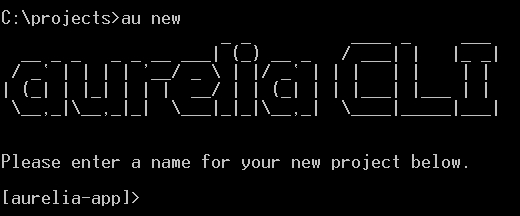
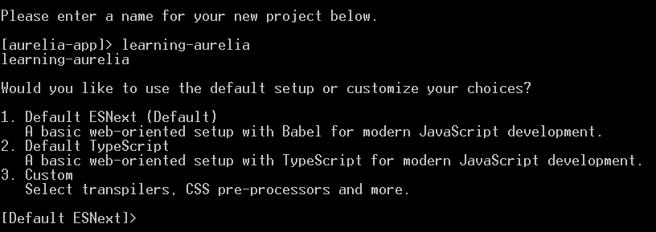
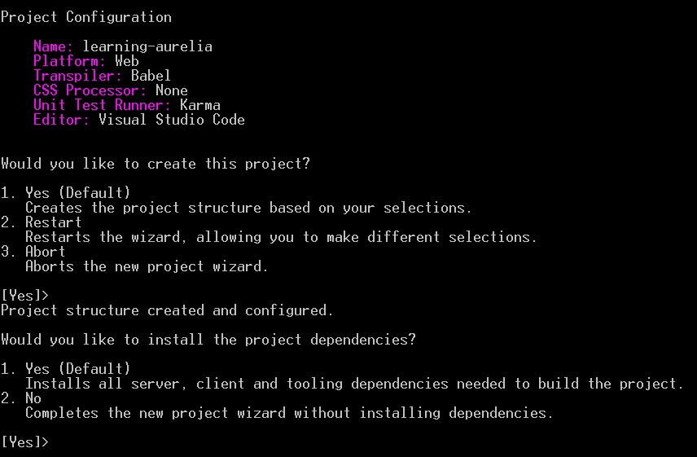

# 第一章：入门

Aurelia 开发者体验是其关键优势。该框架的作者对开发过程中的每一个环节都给予了深思熟虑的关注，因此使用该框架的过程无缝而流畅，从而使得学习曲线尽可能平滑。

这本书谦虚地遵循了同样的哲学。它将教你如何从 A 到 Z 使用 Aurelia 构建真实世界的应用程序。实际上，在阅读本书并跟随代码示例时，你确实会做这件事。你将从设置你的开发环境和创建项目开始，然后我会引导你了解诸如路由、模板、数据绑定、自动化测试、国际化以及打包等概念。我们将讨论应用程序设计、组件之间的通信以及第三方集成。我们将涵盖所有现代、真实世界的单页应用程序所需的主题。

在第一章中，我们将首先定义一些将在整本书中使用的术语。我们将快速介绍 Aurelia 的核心概念。然后，我们将查看核心 Aurelia 库，并了解它们如何相互交互以形成一个完整、功能丰富的框架。我们还将了解开发 Aurelia 应用程序所需的工具以及如何安装它们。最后，我们将开始创建我们的应用程序并探索其全局结构。

# 术语

由于这本书是关于一个 JavaScript 框架的，因此 JavaScript 在其中扮演着中心角色。如果你对最近几年变化很大的术语不是完全了解，让我来澄清一些事情。

JavaScript（或 JS）是 **ECMAScript**（**ES**）标准的方言或实现。它不是唯一的实现，但绝对是其中最受欢迎的。在这本书中，我将使用 JS 缩写来讨论实际的 JavaScript 代码或代码文件，而在谈论实际的 ECMAScript 标准版本时，我将使用 ES 缩写。

就像计算机编程中的所有事物一样，ECMAScript 标准随时间不断发展。在撰写本书时，最新版本是 **ES2016**，于 2016 年 6 月发布。它最初被称为 **ES7，**但制定规范的 **TC39** 委员会决定改变他们的批准和命名模型，因此有了新名字。

之前的版本，在命名模型改变之前称为 **ES2015**（**ES6**）的版本，于 2015 年 6 月发布，与之前的版本相比是一个很大的进步。这个较早的版本，称为 **ES5**，于 2009 年发布，是六年来最新的版本，因此现在所有现代浏览器都广泛支持。如果你在过去五年中一直在编写 JavaScript，你应该熟悉 ES5。

当他们决定改变 ES 命名模型时，TC39 委员会还选择改变规格的批准模型。这个决定是为了更快地发布语言的新版本。因此，新的特性正在社区中起草和讨论，必须通过一个批准过程。每年，将发布一个新的规格版本，包括当年批准的特性和概念。

这些即将推出的功能通常被称为**ESNext**。这个术语包括已经批准或至少相当接近批准但尚未发布的语言特性。可以合理地期待其中大多数或至少一些特性将在下一个语言版本中发布。

由于 ES2015 和 ES2016 仍然是较新的版本，它们并没有得到大多数浏览器的完全支持。此外，ESNext 特性通常根本没有浏览器支持。

这些多个名称可能会让人感到相当困惑。为了简化事情，我将坚持使用官方名称 ES5 代表之前版本，ES2016 代表当前版本，ESNext 代表下一个版本。但这只是我的偏好；在接下来的章节中，我们可能会遇到一些仍然使用原始命名法的工具或库。

在深入之前，你应该熟悉 ES2016 引入的功能以及 ESNext 装饰器（如果你还不熟悉的话）。我们将在整本书中使用这些功能。

### 注意

如果你不知道从 ES2015 和 ES2016 开始，你可以在 Babel 网站上找到新特性的概述：

[`babeljs.io/docs/learn-es2015/`](https://babeljs.io/docs/learn-es2015/)

至于 ESNext 装饰器，谷歌工程师 Addy Osmani 解释得相当好：

[`medium.com/google-developers/exploring-es7-decorators-76ecb65fb841`](https://medium.com/google-developers/exploring-es7-decorators-76ecb65fb841)

为进一步阅读，你可以查看未来 ES 版本的特性提案（如装饰器、类属性声明、异步函数等）：

[`github.com/tc39/proposals`](https://github.com/tc39/proposals)

# 核心概念

在我们开始实践之前，有几个核心概念需要解释。

## 约定

首先，Aurelia 非常依赖约定。其中大多数约定是可配置的，如果它们不符合你的需求，可以进行更改。每当我们在书中遇到一个约定时，我们都会看看是否有可能改变它。

## 组件

组件是 Aurelia 的一等公民。Aurelia 组件是什么？它由一个 HTML 模板组成，称为**视图**，和一个 JavaScript 类组成，称为**视图模型**。视图负责显示组件，而视图模型控制其数据和行为。通常，视图位于一个`.html`文件中，视图模型在`.js`文件中。按照约定，这两个文件通过命名规则绑定，它们必须位于同一目录中，并且具有相同的名称（当然，除了它们的扩展名）。

以下是一个没有数据、没有行为和静态模板的空组件的示例：

`component.js`

```js
export class MyComponent {} 

```

`component.html`

```js
<template> 
  <p>My component</p> 
</template> 

```

组件必须遵守两个约束，视图的根 HTML 元素必须是`template`元素，视图模型类必须从`.js`文件中导出。作为一个经验法则，组件的 JS 文件应该只导出一个视图模型类。如果导出了多个类或函数，Aurelia 将在文件的导出函数和类上迭代，并使用找到的第一个作为视图模型。然而，由于 ES 规范中对象的键的枚举顺序不是确定的，没有任何保证导出会按照它们声明的顺序进行迭代，所以 Aurelia 可能会将错误的类作为组件的视图模型。

那个规则的唯一例外是一些视图资源，我们将在第三章，*显示数据*，和第五章，*创建可复用的组件*中看到它们。除了它的视图模型类，一个组件的 JS 文件可以导出像值转换器、绑定行为和自定义属性等东西，基本上任何不能有视图的视图资源，这排除了自定义元素。

组件是 Aurelia 应用的主要构建块。组件可以使用其他组件；它们可以组合成更大的或更复杂的组件。得益于插槽机制，你可以设计一个组件的模板，使其部分可以被替换或自定义。我们将在接下来的章节中看到所有这些。

# 架构

Aurelia 不是您通常意义上的单页应用的单体框架。它是一组松散耦合的库，具有明确定义的抽象。它的每个核心库都解决了一个特定且明确定义的问题，这是单页应用中常见的。Aurelia 利用依赖注入和插件架构，因此您可以丢弃框架的部分内容，用第三方甚至您自己的实现来替换它们。或者，您也可以丢弃不需要的功能，使您的应用程序更轻便，加载速度更快。我们将在第二章，*布局、菜单和熟悉*中更深入地了解这个插件机制。

核心 Aurelia 库可以分为多个类别。让我们快速浏览一下。

## 核心功能

以下库大多相互独立，如果需要，可以单独使用。它们各自提供一组专注的功能，是 Aurelia 的核心：

+   `aurelia-dependency-injection`：一个轻量级但强大的依赖注入容器。它支持多种生命周期管理策略和子容器。

+   `aurelia-logging`：一个简单的日志记录器，支持日志级别和可插拔的消费者。

+   `aurelia-event-aggregator`：一个轻量级的消息总线，用于解耦通信。

+   `aurelia-router`：一个客户端路由器，支持静态、参数化或通配符路由，以及子路由。

+   `aurelia-binding`：一个适应性强且可插拔的数据绑定库。

+   `aurelia-templating`：一个可扩展的 HTML 模板引擎。

## 抽象层

以下库主要定义接口和抽象，以解耦关注点并启用可扩展性和可插拔行为。这并不意味着上一节中的某些库没有除了它们的功能之外的自己的抽象。其中一些确实有。但当前节中描述的库几乎除了定义抽象之外没有其他目的：

+   `aurelia-loader`：一个定义了加载 JS 模块、视图和其他资源的接口的抽象。

+   `aurelia-history`：一个定义了历史管理接口的抽象，被路由使用。

+   `aurelia-pal`：一个用于平台特定能力的抽象。它用于抽象代码运行的平台，如浏览器或 Node.js。实际上，这意味着一些 Aurelia 库可以在服务器端使用。

## 默认实现

以下库是前两节库暴露的抽象的默认实现：

+   `aurelia-loader-default`：`aurelia-loader`抽象的 SystemJS 和`require`基础加载器的实现。

+   `aurelia-history-browser`：基于标准浏览器哈希变化和推态机制的`aurelia-history`抽象的实现。

+   `aurelia-pal-browser`：`aurelia-pal`抽象的浏览器实现。

+   `aurelia-logging-console`：`aurelia-logging`抽象的浏览器控制台实现。

## 集成层

以下库的目的是将一些核心库集成在一起。它们提供接口实现和适配器，以及默认配置或行为：

+   `aurelia-templating-router`：`aurelia-router`和`aurelia-templating`库之间的集成层。

+   `aurelia-templating-binding`：`aurelia-templating`和`aurelia-binding`库之间的集成层。

+   `aurelia-framework`：一个将所有核心 Aurelia 库集成到一个功能齐全的框架的集成层。

+   `aurelia-bootstrapper`：一个将`aurelia-framework`的默认配置带入并处理应用程序启动的集成层。

## 附加工具和插件

如果你查看 Aurelia 在 GitHub 上的组织页面[`github.com/aurelia`](https://github.com/aurelia)，你会看到更多仓库。前面部分列出的库只是 Aurelia 的核心——如果我可以这么说的话，这只是冰山一角。在 GitHub 上还有许多其他库，它们提供了额外的功能或集成了第三方库，其中一些是由 Aurelia 团队开发和维护的，许多其他是由社区开发的。我们将在后续章节中介绍一些这些额外的库，但我强烈建议你在阅读完这本书后自己探索 Aurelia 生态系统，因为它是快速发展的，Aurelia 社区正在做一些非常令人兴奋的事情。

# 工具

在接下来的部分，我们将介绍开发 Aurelia 应用程序所需的工具。

## Node.js 和 NPM

由于 Aurelia 是一个 JavaScript 框架，因此其开发工具自然也是用 JavaScript 编写的。这意味着当你开始学习 Aurelia 时，你需要做的第一件事就是在你的开发环境中安装 Node.js 和 NPM。

### 注意

Node.js 是基于 Google 的 V8 JavaScript 引擎的服务器端运行环境。它可以用来构建完整的网站或网络 API，但它也被许多前端项目用于开发和构建任务，如转换、校验和压缩。

NPM 是 Node.js 的默认包管理器。它使用[`www.npmjs.com`](http://www.npmjs.com)作为其主要仓库，所有可用的包都存储在这里。它与 Node.js 捆绑在一起，因此如果你在电脑上安装了 Node.js，NPM 也会被安装。

要在你的开发环境中安装 Node.js 和 NPM，你只需要访问[`nodejs.org/`](https://nodejs.org/)并下载适合你环境的正确安装程序。

如果 Node.js 和 NPM 已经安装，我强烈建议你确保使用至少版本 3 的 NPM，因为旧版本可能与我们将要使用的其他一些工具存在兼容性问题。如果你不确定你有哪些版本，你可以在控制台中运行以下命令来检查：

```js
> npm -v

```

如果 Node.js 和 NPM 已经安装但你需要升级 NPM，你可以通过运行以下命令来实现：

```js
> npm install npm -g

```

## Aurelia 命令行界面（CLI）

尽管可以使用任何包管理器、构建系统或打包器来构建 Aurelia 应用程序，但管理 Aurelia 项目的最佳工具是命令行界面，也称为 CLI。

截至撰写本文时，CLI 只支持 NPM 作为其包管理器以及`requirejs`作为其模块加载器和打包器，这可能是因为它们都是最成熟和最稳定的。它还在幕后使用 Gulp 4 作为其构建系统。

基于 CLI 的应用在运行时总是会被打包，即使在开发环境中也是这样。这意味着在开发过程中应用的性能将与生产环境中的性能非常接近。这也意味着打包是一个持续关注的问题，因为新的外部库必须添加到某些打包中，以便在运行时可以使用。我们将在第十章详细看到这一点，*生产环境下的打包*。

在本书中，我们将坚持使用首选方案并使用 CLI。然而，书末有两个附录介绍了替代方案，第一个是针对 Webpack 的，第二个是针对 SystemJS 和 JSPM 的。

### 安装 CLI

CLI 是一个命令行工具，应该通过打开控制台并执行以下命令来全局安装：

```js
> npm install -g aurelia-cli

```

根据你的环境，你可能需要以管理员权限运行这个命令。

如果你已经安装了它，请确保你有最新版本，通过运行以下命令：

```js
> au -v

```

然后你可以将这个命令输出的版本与 GitHub 上标记的最新版本号进行比较，地址是：[`github.com/aurelia/cli/releases/latest`](https://github.com/aurelia/cli/releases/latest)。

如果你没有最新版本，你可以通过运行以下命令简单地更新它：

```js
> npm install -g aurelia-cli

```

如果出于某种原因更新 CLI 的命令失败了，只需卸载然后重新安装即可：

```js
> npm uninstall aurelia-cli -g
> npm install aurelia-cli -g

```

这应该会重新安装最新版本。

# 项目骨架

作为 CLI 的替代方案，项目骨架可在 [`github.com/aurelia/skeleton-navigation`](https://github.com/aurelia/skeleton-navigation) 找到。这个仓库包含多个样本项目，基于不同的技术，如 SystemJS 和 JSPM、Webpack、ASP .Net Core 或 TypeScript。

准备骨架非常简单。你只需要从 GitHub 下载并解压存档，或者在本地克隆仓库。每个目录都包含一个不同的骨架。根据你的选择，你可能需要安装不同的工具并运行设置命令。通常，骨架中的 `README.md` 文件中的说明是非常清晰的。

这些骨架是使用不同技术开始新应用的其他良好起点。本书的最后两章附录展示了如何使用其中一些骨架，使用 SystemJS 和 JSPM 或 Webpack 构建应用程序。

除了附录，本书其余部分将继续使用 CLI。

## 我们的应用

使用 CLI 创建 Aurelia 应用非常简单。你只需要在你想创建项目的目录中打开一个控制台，并运行以下命令：

```js
> au new

```

CLI 的项目创建过程将开始，你应该看到类似这样的内容：



命令行界面（CLI）首先会询问您想要为您项目命名什么。这个名称将用于创建项目所在的目录以及设置一些值，例如它将创建的`package.json`文件中的`name`属性。让我们给我们的应用命名为`learning-aurelia`：



接下来，CLI 会询问我们想要使用哪些技术来开发应用。在这里，您可以选择一个自定义转换器，如 TypeScript，以及一个 CSS 预处理器，如 LESS 或 SASS。

### 注意

转换器，编译器的小表亲，将一种编程语言翻译成另一种。在我们的案例中，它将用于将 ESNext 代码转换为 ES5，后者被所有现代浏览器理解。

默认选择是使用 ESNext 和普通 CSS，这是我们将会选择的：



接下来的步骤简单回顾了我们所做的选择，并请求确认创建项目，然后询问我们是否想要安装项目的依赖，默认情况下它会这样做。在此阶段，命令行界面将创建项目并在幕后运行`npm install`。一旦完成，我们的应用就准备好了：


在此阶段，您运行`au new`的目录将包含一个名为`learning-aurelia`的新目录。这个子目录将包含 Aurelia 项目。我们将在下一节中稍作探讨。

### 注意

命令行界面（CLI）可能会发生变化，在将来提供更多选项，因为计划支持更多工具和技术。如果您运行它，不要惊讶看到不同或新的选项。

我们创建项目的路径使用了 Visual Studio Code 作为默认代码编辑器。如果你想使用其他编辑器，比如**Atom**、**Sublime**或**WebStorm**，这些是在撰写本文时支持的其他选项，你只需要在创建过程开始时选择选项#3 自定义转换器、CSS 预处理器等，然后为每个问题选择默认答案，直到被要求选择您的默认代码编辑器。创建过程的其余部分应该基本保持不变。请注意，如果您选择不同的代码编辑器，您的体验可能与本书中找到的示例和屏幕截图不同，因为撰写本书时使用的是 Visual Studio Code。

如果您是 TypeScript 开发者，您可能想创建一个 TypeScript 项目。然而，我建议您坚持使用简单的 ESNext，因为本书中的每个示例和代码示例都是用 JS 编写的。尝试跟随 TypeScript 可能会证明很繁琐，尽管如果您喜欢挑战，可以尝试。

## 基于 CLI 的项目的结构

如果您在代码编辑器中打开新创建的项目，您应该看到以下文件结构：

+   `node_modules`：包含项目依赖的标准 NPM 目录

+   `src`：包含应用源代码的目录

+   `test`：包含应用自动化测试套件的目录，我们将在第七章中探索，*测试所有事物*

+   `.babelrc`：Babel 的配置文件，CLI 使用它将我们的应用的 ESNext 代码转换成 ES5，这样大多数浏览器都可以运行它。

+   `index.html`：加载并启动应用的 HTML 页面

+   `karma.conf.js`：**Karma**的配置文件，CLI 使用它来运行单元测试；

+   `package.json`：标准的 Node.js 项目文件

这个目录还包括其他文件，如`.editorconfig`、`.eslintrc.json`和`.gitignore`，它们对学习 Aurelia 来说兴趣不大，所以我们不覆盖它们。

除了所有这些，你应该看到一个名为`aurelia_project`的目录。这个目录包含与使用 CLI 构建和打包应用相关的事物。让我们看看它由什么组成。

### `aurelia.json`文件

这个目录中最重要的文件是一个名为`aurelia.json`的文件。这个文件包含了 CLI 用于测试、构建和打包应用的配置。这个文件根据你在项目创建过程中的选择可能会有很大的变化。

### 注意

这种情况非常少见，需要手动修改这个文件。向应用中添加一个外部库就是这种情况，我们在接下来的章节中会面临多次。除了这种情况，这个文件基本上不应该手动更新。

这个文件中第一个有趣的部分是`platform`：

```js
"platform": { 
  "id": "web", 
  "displayName": "Web", 
  "output": "scripts", 
  "index": "index.html" 
}, 

```

这一部分告诉 CLI，输出目录的名称是`scripts`，它还告诉 CLI，将加载并启动应用的 HTML 主页是`index.html`文件。

下一个有趣的部分是`transpiler`部分：

```js
"transpiler": { 
  "id": "babel", 
  "displayName": "Babel", 
  "fileExtension": ".js", 
  "options": { 
    "plugins": [ 
      "transform-es2015-modules-amd" 
    ] 
  }, 
  "source": "src/**/*.js" 
}, 

```

这一部分告诉 CLI 使用 Babel 转换应用的源代码。它还定义了额外的插件，因为有些插件已经在`.babelrc`中配置好，在转换源代码时使用。在这种情况下，它添加了一个插件，将以 AMD 兼容模块的形式输出转换后的文件，以兼容`requirejs`。

这个文件中有许多其他部分，其中一些我们将在后续章节中覆盖，还有一些我留给你们自己探索。

### 任务

`aurelia_project`目录包含一个名为`tasks`的子目录。这个子目录包含各种 Gulp 任务，用于构建、运行和测试应用。这些任务可以使用 CLI 执行。

你可以首先尝试不带任何参数运行`au`：

```js
> au

```

这将列出所有可用的命令以及它们的可用参数。这个列表包括内置命令，比如我们已经在用的`new`，或者在下一节中会看到的`generate`，还有在`tasks`目录中声明的 Gulp 任务。

要运行这些任务中的一个，只需执行`au`，后面跟上任务的名称作为它的第一个参数：

```js
> au build

```

此命令将运行定义在`aurelia_project/tasks/build.js`中的`build`任务。这个任务使用 Babel 转换应用程序代码，如果有的话，执行 CSS 和标记预处理器，并在`scripts`目录中打包代码。

运行后，你应在`scripts`目录下看到两个新文件：`app-bundle.js`和`vendor-bundle.js`。这两个文件是在应用程序启动时由`index.html`加载的实际文件。前者包含所有应用程序代码，包括 JS 文件和模板，而后者包含应用程序使用的所有外部库，包括 Aurelia 库。我们将在第十章中学习如何自定义打包——*生产环境下的打包*。

你可能会注意到列表中有一个名为`run`的命令。这个任务定义在`aurelia_project/tasks/run.js`中，在启动本地 HTTP 服务器以提供应用程序之前内部执行`build`任务：

```js
> au run

```

默认情况下，HTTP 服务器将在端口 9000 上监听请求，因此你可以打开你喜欢的浏览器，访问 http://localhost:9000/ 来查看默认的演示应用程序。

### 注意

如果你需要更改开发 HTTP 服务器运行的端口号，你只需要打开`aurelia_project/tasks/run.js`，找到对`browserSync`函数的调用。传递给这个函数的对象包含一个名为`port`的属性。你可以相应地更改它的值。

`run`任务可以接受一个`--watch`开关：

```js
> au run --watch

```

如果存在此开关，任务将继续监控源代码，并在任何代码文件更改时重新构建应用程序并自动刷新浏览器。这在开发过程中非常有用。

### 生成器

命令行界面（CLI）还提供了一种生成代码的方法，使用位于`aurelia_project/generators`目录中的类。在撰写本文时，有创建自定义属性、自定义元素、绑定行为、值转换器和甚至任务和生成器的生成器。是的，有一个生成器用于生成生成器。

### 注意

如果你对 Aurelia 一无所知，那些概念（值转换器、绑定行为以及自定义属性和元素）可能对你来说毫无意义。不用担心，我们将在接下来的章节中介绍这些主题。

可以使用内置的`generate`命令执行生成器：

```js
> au generate attribute

```

此命令将运行自定义属性生成器。它会询问要生成的属性的名称，然后在其`src/resources/attributes`目录中创建它。

如果你看一下这个生成器，它可以在`aurelia_project/generators/attribute.js`中找到，你会发现文件导出一个名为`AttributeGenerator`的单一类。这个类使用`@inject`装饰器（我们将在第二章中更详细地看到，*布局、菜单和熟悉*)来声明`aurelia-cli`库中的各种类作为依赖项，并在其构造函数中注入它们的实例。它还定义了一个`execute`方法，当生成器运行时由 CLI 调用。这个方法利用`aurelia-cli`提供的服务与用户交互并生成代码文件。

### 注意

默认可用的生成器名称有`attribute`、`element`、`binding-behavior`、`value-converter`、`task`和`generator`。

### 环境

基于 CLI 的应用程序支持环境特定的配置值。默认情况下，CLI 支持三个环境-开发、暂存和生产。这些环境的每个配置对象都可以在`aurelia_project/environments`目录中的不同文件`dev.js`、`stage.js`和`prod.js`中找到。

一个典型的环境文件看起来像这样：

`aurelia_project/environments/dev.js`

```js
export default { 
  debug: true, 
  testing: true 
}; 

```

默认情况下，环境文件用于根据环境启用 Aurelia 框架的调试日志和仅限测试的模板功能。我们将在下一节看到这一点。然而，环境对象可以增强任何所需的属性。通常，它可用于根据环境配置后端的不同 URL。

添加新环境仅仅是 在`aurelia_project/environments`目录中为其添加一个文件的问题。例如，您可以通过在目录中创建一个`local.js`文件来添加一个`local`环境。

许多任务，基本上是`build`和所有使用它的任务，如`run`和`test`，都期望使用`env`参数指定环境：

```js
> au build --env prod

```

在这里，应用程序将使用`prod.js`环境文件进行构建。

如果没有提供`env`参数，默认使用`dev`。

### 注意

当执行`build`任务时，它只是在运行转译器和打包输出之前将适当的环境文件复制到`src/environment.js`。这意味着`src/environment.js`绝不应该手动修改，因为它将被`build`任务自动覆盖。

## Aurelia 应用程序的结构

上一节描述了特定于基于 CLI 的项目的一些文件和文件夹。然而，项目中的某些部分无论构建系统和包管理器如何都是相同的。这些是在本节中将要看到的更全局的主题。

### 托管页面

Aurelia 应用程序的第一个入口点是 HTML 页面的加载和托管。默认情况下，这个页面名为`index.html`，位于项目的根目录中。

默认的托管页面看起来像这样：

`index.html`

```js
<!DOCTYPE html> 
<html> 
  <head> 
    <meta charset="utf-8"> 
    <title>Aurelia</title> 
  </head> 

  <body aurelia-app="main"> 
    <script src="img/vendor-bundle.js"  
            data-main="aurelia-bootstrapper"></script> 
  </body> 
</html> 

```

当页面加载时，`body`元素内的`script`元素加载了`scripts/vendor-bundle.js`文件，该文件包含了`requirejs`本身以及所有外部库的定义和对`app-bundle.js`的引用。加载时，`requirejs`检查`data-main`属性并将其值作为入口点模块使用。在这里，`aurelia-bootstrapper`开始工作。

启动器首先在 DOM 中查找具有`aurelia-app`属性的元素。我们可以在默认的`index.html`文件中的`body`元素中找到这样的属性。这个属性识别作为应用程序视图口的元素。启动器使用属性的值作为应用程序的主模块名称，定位模块，加载它，并在元素内渲染结果 DOM，覆盖任何先前的内容。应用程序现在正在运行。

### 注意

尽管默认的应用程序没有说明这种情况，但一个 HTML 文件托管多个 Aurelia 应用程序是可能的。它只需要包含多个带有`aurelia-app`属性的元素，每个元素都引用自己的主模块。

### 主模块

按惯例，由`aurelia-app`属性引用的主模块命名为`main`，因此位于`src/main.js`中。此文件预计将导出一个`configure`函数，该函数将由 Aurelia 启动过程调用，并将传递一个用于配置和启动框架的配置对象。

默认情况下，主要的`configure`函数看起来像这样：

`src/main.js`

```js
import environment from './environment'; 

export function configure(aurelia) { 
  aurelia.use 
    .standardConfiguration() 
    .feature('resources'); 

  if (environment.debug) { 
    aurelia.use.developmentLogging(); 
  } 

  if (environment.testing) { 
    aurelia.use.plugin('aurelia-testing'); 
  } 

  aurelia.start().then(() => aurelia.setRoot()); 
} 

```

`configure`函数首先告诉 Aurelia 使用其默认配置，并加载`resources`特性，我们将在第二章，*布局、菜单和熟悉*中看到特性是如何工作的。它还根据环境的`debug`属性有条件地加载开发日志插件，并根据环境的`testing`属性有条件地加载测试插件。这意味着，默认情况下，两个插件将在开发中加载，而在生产中不会加载任何一个。

最后，该函数启动了框架，然后将根组件附加到 DOM。

### 注意

`start`方法返回一个`Promise`，其解析触发了对`setRoot`的调用。如果你不熟悉 JavaScript 中的`Promise`，我强烈建议你在继续之前查阅相关资料，因为它们是 Aurelia 中的核心概念。

### 根组件

任何 Aurelia 应用程序的根部都有一个单一的组件，包含应用程序内的所有内容。按惯例，这个根组件名为`app`。它由两个文件组成：`app.html`，其中包含渲染组件的模板，以及`app.js`，其中包含其视图模型类。

在默认的应用程序中，模板非常简单：

`src/app.html`

```js
<template> 
  <h1>${message}</h1> 
</template> 

```

这个模板由一个单一的 `h1` 元素组成，它将包含视图模型的 `message` 属性的值作为文本，感谢字符串插值，我们将在 第三章，*显示数据* 中更详细地探讨。

`app` 视图模型看起来像这样：

`src/app.js`

```js
export class App { 
  constructor() { 
    this.message = 'Hello World!'; 
  } 
} 

```

这个文件简单地导出一个类，该类有一个 `message` 属性，包含字符串 `Hello World!`。

应用程序启动时，此组件将被渲染。如果你运行应用程序并使用你最喜欢的浏览器导航到应用程序，你会看到一个包含 `Hello World!` 的 `h1` 元素。

你可能会注意到，这个组件的代码中没有提到 Aurelia。实际上，视图模型只是普通的 ESNext，Aurelia 可以原样使用它。当然，我们稍后会在很多视图模型中利用许多 Aurelia 特性，所以大多数视图模型实际上将依赖于 Aurelia 库，但这里的重点是，如果你不想在视图模型中使用任何 Aurelia 库，你就不必使用，因为 Aurelia 设计得尽可能不具侵入性。

## 传统引导方式

可以在宿主页面中将 `aurelia-app` 属性留空：

```js
<body aurelia-app> 

```

在这种情况下，引导过程要简单得多。而不是加载一个包含 `configure` 函数的主模块，引导器将简单地使用框架的默认配置并作为应用程序根加载 `app` 组件。

对于一个非常简单的应用程序来说，这可能是一个更简单的开始方式；因为它消除了 `src/main.js` 文件的必要性，你可以直接删除它。然而，这意味着你被默认框架配置所束缚。你不能加载功能或插件。对于大多数实际应用，你需要保留主模块，这意味着指定为 `aurelia-app` 属性值的 `aurelia-app`。

## 自定义 Aurelia 配置

主模块的 `configure` 函数接收一个配置对象，用于配置框架：

`src/main.js`

```js
//Omitted snippet... 
aurelia.use 
  .standardConfiguration() 
  .feature('resources'); 

if (environment.debug) { 
  aurelia.use.developmentLogging(); 
} 

if (environment.testing) { 
  aurelia.use.plugin('aurelia-testing'); 
} 
//Omitted snippet... 

```

这里，`standardConfiguration()` 方法是一个简单的助手，它封装了以下内容：

```js
aurelia.use 
  .defaultBindingLanguage() 
  .defaultResources() 
  .history() 
  .router() 
  .eventAggregator(); 

```

这是 Aurelia 的默认配置。它加载了默认的绑定语言、默认的模板资源、浏览器历史插件、路由插件和事件聚合器。这是典型 Aurelia 应用程序使用的默认一组功能。本书的各个章节都会涉及到这些插件。除了绑定语言之外的所有这些插件都是可选的，绑定语言是模板引擎所必需的。如果你不需要其中一个，那就不要加载它。

除了标准配置之外，根据环境设置还会加载一些插件。当环境的`debug`属性为`true`时，会使用`developmentLogging()`方法加载 Aurelia 的控制台日志记录器，因此可以在浏览器控制台中看到跟踪和错误信息。当环境的`testing`属性为`true`时，会使用`plugin`方法加载`aurelia-testing`插件。这个插件注册了一些在调试组件时非常有用的资源。

`configure`函数中的最后一行启动了应用程序并显示其根组件，根据约定，这个组件的名称是`app`。然而，如果你违反了约定并为根组件指定了其他名称，你可以通过将根组件的名称作为`setRoot`函数的第一个参数来绕过这个约定：

```js
aurelia.start().then(() => aurelia.setRoot('root')); 

```

在这里，预期根组件位于`src/root.html`和`src/root.js`文件中。

# 总结

得益于 Aurelia 的命令行界面（CLI），入门非常简单。安装工具并创建一个空项目仅仅是运行几个命令的问题，通常等待初始 NPM 安装完成的时间比实际设置的时间还要长。

在下一章中，我们将介绍依赖注入和日志记录，并开始通过向应用程序中添加组件和配置路由来导航它们来构建我们的应用程序。
