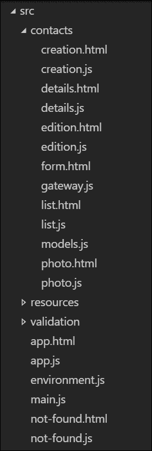
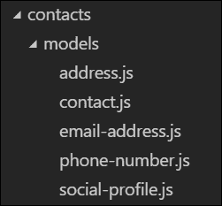
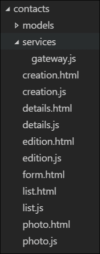
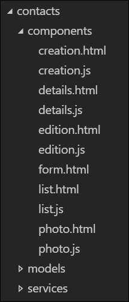
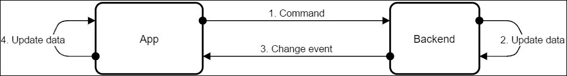

# 第六章：设计关注 - 组织和解耦

组织大型应用程序可能会变得复杂。取决于应用程序的结构以及其部分之间必须如何相互依赖，决定如何组织代码并不总是显而易见的。当你不熟悉框架时，这一点更是如此。

组织 Aurelia 应用程序有很多方法。像设计和架构相关的任何事物一样，选择一个组织模型是一个权衡许多标准的问题。显然，选择一个模型而不是另一个意味着从中受益，但也需要处理其缺点和限制。

在本章中，我们首先将了解组织应用程序的不同方法，以及框架可以帮助我们做到这一点的各种特性。当然，我们将对我们的联系管理应用程序进行重构，使其具有更可扩展的结构。我们会尝试不同的想法，直到找到一个稳定的结构。

其次，如果构成我们应用程序的组件紧密耦合，基于组件的框架就是徒劳的。在本章的第二部分，我们将看到不同的方法来解耦组件，使用数据绑定、共享服务或 Aurelia 的事件聚合器。

# 重新组织我们的应用程序

在探索应用程序结构的可能性之前，我们首先需要决定我们的目标是什么。如果我们不知道我们正在努力争取的组织模型的属性，我们就无法做出明智的决定。

当然，这里的属性将是绝对任意的。在真实项目中，有真实的客户、真实的利益相关者和真实的用户，我们至少会有一些线索来了解这些属性可能是什么。在我们联系管理应用程序的案例中，我们将坚持最常见的中型到大型项目中需要的属性。

首先，我们将假设我们的应用程序注定要增长。现在，它只管理联系人，但我们可以想象我们的产品所有者对应用程序有宏伟的计划，最终我们会添加一些完全不相关的功能。

当前的结构，或者它的缺失，适合一个小应用程序。对于一个具有更多独特功能的大型应用程序，项目必须以这样的方式组织，以使开发人员不会在代码中迷失。在我们应用程序的背景下，我们需要选择一个结构，以最小化将来需要重新组织的机会，因为它的结构无法扩展。

第二，我们将努力实现一种允许功能尽可能解耦和独立的架构。目标是使包括和排除应用程序的功能尽可能容易。这个要求对大多数应用程序来说并不典型，但在这个情况下，它将允许我们了解当需要时 Aurelia 如何帮助我们做到这一点。

## 重构结构

目前，我们的应用程序基本上没有结构，除了全局资源和验证设置，它们作为特性在自己的目录中分组。所有与联系人管理特性相关的文件都位于`src`目录的根目录中，组件与 API 网关和模型混合在一起。让我们在那里面整理一下。

### 注意

在`chapter-6/samples/app-reorganized`中找到的示例展示了经过以下章节描述的结构调整后的应用程序。它可以作为参考。

首先，让我们将所有与联系人管理相关的代码放在一个`contacts`目录中。这使得每个功能都向隔离在自己的目录中迈出了一步。此外，为了减少冗余，让我们将以`contact-`开头的文件重命名为不带前缀的名称。

项目结构应该像这样之后：



这已经更好了。然而，我们可以通过创建子目录来增强聚合性，按其责任类型对文件进行分组。在这里，我们首先有组件`creation`、`details`、`edition`、`list`和`photo`。我们还有一个服务：网关。最后，我们有一些`models`，它们都被放在同一个文件里。

### 分解模型

让我们先将模型分解成一个新的`models`目录，并通过爆炸`models.js`文件，将每个模型类移动到这个新目录内部的各自文件中。它应该看起来像这样：



现在，通过简单的查看`models`目录，开发者可以看到我们有多个模型以及它们的名称。

当然，这意味着我们必须对这些类进行一些更改。首先，我们必须在`address.js`、`email-address.js`、`phone-number.js`和`social-profile.js`文件的顶部添加一个用于验证的`import`语句：

```js
import {ValidationRules} from 'aurelia-validation'; 

```

接下来，在`contact.js`文件的顶部必须添加其他模型类的`import`语句：

```js
import {PhoneNumber} from './phone-number'; 
import {EmailAddress} from './email-address'; 
import {Address} from './address'; 
import {SocialProfile} from './social-profile'; 

```

### 隔离网关

`gateway`与文件中的其他内容不同，它是一个服务。通常，服务是单例，为应用程序的其他部分提供一些功能。在这里，我们只有这个一个服务，但仍然值得为其创建一个自己的目录，以便更容易找到。

让我们创建一个`services`目录，并将`gateway`移动到那里：



为了让`gateway`像以前一样工作，需要做的第一个改变是使`environment import`语句的路径绝对，通过移除`./`前缀：

```js
import environment from 'environment'; 

```

我们还需要更改导入`Contact`类的路径：

```js
import {Contact} from '../models/contact'; 

```

### 组件分组

最后，我们可以将视觉组件分组到它们自己的目录中。让我们创建一个`components`目录，并将剩下的文件移动到里面：



此时，应用程序已损坏。我们需要做两件事：修复组件中的模型类和网关的`import`和`require`语句，以及修复`app`组件的路由声明。

首先，在`creation.js`、`details.js`、`edition.js`、`list.js`和`photo.js`中，必须修复网关的`import`语句：

```js
import {ContactGateway} from '../services/gateway'; 

```

此外，`Contact`模型在`creation.js`中的`import`语句也必须修复：

```js
import {Contact} from '../models/contact'; 

```

最后，我们需要通过修复路径并添加别名来更改`creation.html`和`edition.html`中的`require`语句，以便`form.html`模板仍作为`contact-form`自定义元素加载：

```js
<require from="./form.html" as="contact-form"></require> 

```

至此，我们的`contacts/components`已准备就绪。我们只需要修复`app`组件内所有路由声明的组件路径：

```js
config.map([ 
  { route: '', redirect: 'contacts' }, 
  { route: 'contacts', name: 'contacts',  
    moduleId: 'contacts/components/list', nav: true, title: 'Contacts' }, 
  { route: 'contacts/new', name: 'contact-creation',  
    moduleId: 'contacts/components/creation', title: 'New contact' }, 
  { route: 'contacts/:id', name: 'contact-details',  
    moduleId: 'contacts/components/details' }, 
  { route: 'contacts/:id/edit', name: 'contact-edition',  
    moduleId: 'contacts/components/edition' }, 
  { route: 'contacts/:id/photo', name: 'contact-photo',  
    moduleId: 'contacts/components/photo' }, 
]); 

```

文件结构现在要干净得多。如果你现在运行应用程序，一切应该还是和之前一样工作。

### 没有一劳永逸的解决方案。

我们刚刚重构的结构并不是绝对的真理。在这种决策中，品味和观点总是起到一定的作用，对于这类问题没有正确或错误的答案。

然而，这种结构的背后的理由是简单且可以归结为几个原则：

+   通用或应用程序范围内的资源位于`resources`特性中。像`order-by`值转换器或`file-picker`自定义元素这样的东西应该放在那里。

+   类似地，不属于特定特性的服务和服务模型，应该位于`src`目录的根目录下的各自目录中；例如，在`src/services`和`src/models`中。在我们的应用程序中没有这些。

+   每个领域特性都位于自己的目录中，例如`contacts`目录。

+   也可以存在技术特性，例如`validation`特性。这些特性的目的是提供一些通用行为或扩展其他特性。

+   在特性目录内，文件按责任类型分组。组件，无论是像`creation`、`details`、`edition`、`list`和`photo`这样的路由组件，还是像`form.html`模板这样的专用小部件或自定义元素，都位于`components`子目录内。服务和模型也有各自的目录。如果给定特性存在特殊的值转换器或绑定行为，它们也应该位于特性目录内的各自目录中。

这些都是我在构建 Aurelia 应用程序时遵循的指导原则。当然，通常还有需要深思熟虑的情况，要么是因为它们不适合现有的槽位，要么是因为盲目应用这些规则会搞得一团糟。

例如，如果我们的路由组件和专用小部件很多，将`components`目录分成两个，比如命名为`screens`和`widgets`可能是个好主意。这样，更容易识别哪些是路由组件，哪些是特定功能的定制元素或组合小部件。

此外，有时在结构中添加另一层分类会更好，无论是按子域或类别分组功能，还是按更具体的目的分组服务、模型或组件。这里的真正指南是尽量使结构传达意图和隐性知识，以及尽可能容易地理解每个部分的位置。

我尝试遵循的另一条指南是使域功能目录反映出导航菜单结构。当然，当菜单结构过于复杂时，这是不可能的，尽管这可能是一个需要重新思考的信号。当可能时，这显然可以使开发人员更容易、更直观地导航代码和应用程序。

## 利用子路由

此时，所有与联系人管理相关的代码都位于`contacts`目录中。但这真的正确吗？实际上，并不正确。路由定义仍然位于`app`组件中。我们如何将这些移动到`contact`目录内？

第一个可能性是利用子路由。这样，我们可以在`contacts`内部声明一个`main`组件，负责声明到各种联系人管理组件的路由，如`list`、`creation`和`edition`。然后，`app`组件需要一个通往联系人`main`组件的单一路由，并且不需要知道更专业的`contacts`路由。

### 注意

在以下部分，我们将尝试不同的事情。为了更容易地将代码恢复到每次尝试之前的样子，我建议您在此时以某种方式备份您的应用程序，无论是简单地复制和粘贴项目目录，还是如果您从 GitHub 克隆了代码，则在您的源控制中创建一个分支。此外，在`chapter-6/samples/app-using-child-router`中找到的示例展示了如下一节中描述的应用程序修改。它可以作为参考。

### 更改根路由

首先，更改根路由配置：

`src/app.js`

```js
export class App { 
  configureRouter(config, router) { 
    this.router = router; 
    config.title = 'Learning Aurelia'; 
    config.map([ 
 { route: '', redirect: 'contacts' }, 
 { route: 'contacts', name: 'contacts', moduleId: 'contacts/main', 
 nav: true, title: 'Contacts' }, 
 ]); 
    config.mapUnknownRoutes('not-found'); 
  } 
} 

```

这里，我们移除了所有指向各种联系人管理组件的路由，并用一个映射到`contacts` URL 前缀的单一路由替换它们。此路由通往`contacts`的`main`组件。当然，我们保留了默认路由，它重定向到这个`contacts`路由。

### 配置联系人子路由

接下来，我们需要创建`contacts`的`main`组件：

`src/contacts/main.js`

```js
import {inlineView} from 'aurelia-framework'; 

@inlineView('<template><router-view></router-view></template>') 
export class Contacts { 
  configureRouter(config) { 
    config.map([ 
      { route: '', name: 'contacts',  
        moduleId: './components/list', title: 'Contacts' }, 
      { route: 'new', name: 'contact-creation',  
        moduleId: './components/creation', title: 'New contact' }, 
      { route: ':id', name: 'contact-details',  
        moduleId: './components/details' }, 
      { route: ':id/edit', name: 'contact-edition',  
        moduleId: './components/edition' }, 
      { route: ':id/photo', name: 'contact-photo',  
        moduleId: './components/photo' }, 
    ]); 
  } 
} 

```

在这里，我们首先使用`inlineView`装饰器声明一个模板，该模板简单地使用`router-view`元素来渲染子路由器的活动组件。这个子路由器是通过`configureRouter`方法配置的，该方法声明了之前在`app`组件中的`contacts`路由。

当然，路由声明需要做一点小修改。首先，必须从每个路由的`route`属性中删除`contacts/`前缀，因为它现在由父路由器处理。因此，指向`list`组件的路由现在是子路由器的默认路由，因为它的模式与空字符串匹配。此外，`moduleId`属性可以改为相对路径，而不是像以前那样的绝对路径。这将减少如果我们改名或移动`contacts`目录时需要做的更改。最后，由于这个子路由器的导航模型不用于渲染任何菜单，我们可以从指向列表的路由中删除`nav`属性。

### 含义

如果你运行应用程序并对其进行测试，你可能会注意到，现在在通过`creation`、`details`、`edition`和`photo`组件导航时，**联系人**顶菜单项保持高亮状态，而之前只有在`list`组件活动时才高亮。

这是因为这个菜单项是使用指向`contacts`组件的`main`路由生成的，当我们在任何子路由上时，它保持激活状态。这是一个有趣的副作用，增加了用户的反馈，使顶级菜单的行为更加一致。

此外，使用子路由器将声明模块路由的责任移到了模块本身内部。如果需要更改模块的路由，更改将在模块的范围内进行，对应用程序的其余部分没有影响。

然而，子路由器有一些限制。通常，在编写本文时，路由器在生成 URL 时只访问自己的路由。这意味着你不能使用`route-href`属性，也不能使用`Router`类的`generate`或`navigateToRoute`方法为其他路由器中定义的路由生成 URL，无论这些路由器是父路由器、子路由器还是兄弟路由器。当模块需要彼此之间有直接链接时，这可能是个问题。必须手动生成路由，这意味着路由模式可能在不止一个地方定义，这增加了如果路由模式更改并且开发者只更新了一些模式实例时引入错误的风险。

## 在功能中声明根路由

这里另一个可能会有帮助的工具是 Aurelia 的`feature`系统。我们可以利用一个`configure`函数直接在根路由器上注册联系人管理路由。

让我们恢复到在插入子路由器之前的状态，看看这可能会导致什么结果。

### 注意

在`chapter-6/samples/app-using-feature`找到的示例展示了根据以下部分修改后的应用程序。它可以作为参考。

### 创建特性

我们首先需要创建一个`index.js`文件来配置我们新的特性：

`src/contacts/index.js`

```js
import {Router} from 'aurelia-router'; 

const routes = [ 
  { route: 'contacts', name: 'contacts',  
    moduleId: 'contacts/components/list', nav: true, title: 'Contacts' }, 
  { route: 'contacts/new', name: 'contact-creation',  
    moduleId: 'contacts/components/creation', title: 'New contact' }, 
  { route: 'contacts/:id', name: 'contact-details',  
    moduleId: 'contacts/components/details' }, 
  { route: 'contacts/:id/edit', name: 'contact-edition',  
    moduleId: 'contacts/components/edition' }, 
  { route: 'contacts/:id/photo', name: 'contact-photo',  
    moduleId: 'contacts/components/photo' }, 
]; 

export function configure(config) { 
  const router = config.container.get(Router); 
  routes.forEach(r => router.addRoute(r)); 
} 

```

在这里，`configure`函数简单地从 DI 容器中获取根路由器，然后使用`Router`类的`addRoute`方法注册路由。由于这里没有子路由，所以路由使用它们的完整 URL，包括`contacts/`前缀，并且它们使用绝对路径来引用它们的组件，因为它们相对于声明根`configureRouter`方法的组件，这里是`app`。

当然，这意味着我们需要将这个功能加载到应用程序的主要`configure`函数中：

`src/main.js`

```js
//Omitted snippet... 
export function configure(aurelia) { 
  aurelia.use 
    .standardConfiguration() 
    .feature('validation') 
    .feature('resources') 
    .feature('contacts'); 
  //Omitted snippet... 
} 

```

### 更改根路径

最后，我们需要从`app`组件中移除联系人管理路径：

`src/app.js`

```js
export class App { 
  configureRouter(config, router) { 
    this.router = router; 
    config.title = 'Learning Aurelia'; 
    config.map([ 
 { route: '', redirect: 'contacts' }, 
 ]); 
    config.mapUnknownRoutes('not-found'); 
  } 
} 

```

在这里，我们简单地移除了所有通往各种联系人管理组件的路径，除了默认路径重定向到显示`list`组件的`contacts`路径。

### 减少特性之间的耦合

应用程序仍然以两种方式依赖于`contacts`特性：它将其加载到主要的`configure`函数中，默认路径重定向到`app`组件中的其一个路径。如果我们想要移除这个特性，现在有两个地方需要更新。我们如何从`app`组件中移除依赖？

一种首先的可能性是简单地添加一个`home`组件，或者某种欢迎仪表板，并将其作为默认路径。这样，访问应用程序根目录的用户总是在同一个地方受到欢迎，即使应用程序功能发生了变化。除了在主要的`configure`函数中，我们也不会有任何关于`contacts`功能的引用。

Alternatively, we could dynamically select the route to which the default route redirects. Since the `app` component's `configureRouter` method is called during the component's activation lifecycle, the feature has already been configured at that time and its routes have already been added to the root router. We could simply take the router's first navigation model entry and have the default route redirect to it:

`src/app.js`

```js
function findDefaultRoute(router) { 
  return router.navigation[0].relativeHref; 
} 

export class App { 
  configureRouter(config, router) { 
    this.router = router; 
    config.title = 'Learning Aurelia'; 
    config.map([ 
      { route: '', redirect: findDefaultRoute(router) }, 
    ]); 
    config.mapUnknownRoutes('not-found'); 
  } 
} 

```

这种解决方案的优势在于，默认路径总是会重定向到顶部菜单中显示的第一个路径，这对于没有明显主页屏幕的绝大多数应用程序来说是一种合理的行为。

然而，如果应用程序中移除了所有特性，导航模型将会为空，这段代码将会断裂。在这种情况下，拥有一个明确的主页可能能够挽救局面，尽管在大多数情况下，一个没有特性但有一个简单主页的应用程序是没有意义的。

### 含义

定义应用程序中所有路由在根路由器上，通过特性或`app`组件的主要优点之一是，所有路由都被根路由器所知晓，这意味着它可以为应用程序中的任何路由生成 URL。

当组件和特性之间存在大量链接时，这种区别不容忽视。在这种情况下，使用子路由器并且不能依赖路由器生成大部分 URL 是痛苦的。

## 为什么不两者都使用呢？

我们刚刚探索的这两种解决方案都有各自的优缺点。使用子路由器感觉是正确的事情，主要是因为它修复了顶部菜单的不一致行为，这让我感到烦恼，也许比它应得的还要多，但它使跨特性的链接变得复杂。此外，它需要在`app`组件中声明一个指向联系人`main`组件的路由。

另一方面，使用特性也感觉是正确的。特性正是为这类用例设计的。

让我们尝试合并这两种策略：在`main`组件中声明一个子路由器来处理联系人的路由，并使用一个特性在根路由器上添加到这个`main`组件的路由。

### 注意

以下代码片段是本章完成示例应用程序的摘录，可以在`chapter-6/app`中找到。

如果我们保留上一节中引入`contacts`特性时所做的修改，这意味着我们需要像使用子路由器一样添加一个`main`组件：

`src/contacts/main.js`

```js
import {inlineView} from 'aurelia-framework'; 

@inlineView('<template><router-view></router-view></template>') 
export class Contacts { 
  configureRouter(config) { 
    config.map([ 
      { route: '', name: 'contacts',  
        moduleId: './components/list', title: 'Contacts' }, 
      { route: 'new', name: 'contact-creation',  
        moduleId: './components/creation', title: 'New contact' }, 
      { route: ':id', name: 'contact-details',  
        moduleId: './components/details' }, 
      { route: ':id/edit', name: 'contact-edition',  
        moduleId: './components/edition' }, 
      { route: ':id/photo', name: 'contact-photo',  
        moduleId: './components/photo' }, 
    ]); 
  } 
} 

```

接下来，必须更改特性的`configure`函数，使其添加到`contacts`的`main`组件的路由：

`src/contacts/index.js`

```js
import {Router} from 'aurelia-router'; 

export function configure(config) { 
  const router = config.container.get(Router); 
  router.addRoute({ route: 'contacts', name: 'contacts', 
 moduleId: 'contacts/main', nav: true, title: 'Contacts' }); 
} 

```

使用这种模式，可以轻松添加新特性，而无需更改除了将其加载到主`configure`函数之外的其他内容。唯一需要更改`app`组件的情况是，当你不使用动态方法时，需要更改默认路由重定向到的特性。

### 注意

我并不是提倡在每一个 Aurelia 应用程序中都使用这种模式。它增加了复杂性，因此，只有真正需要时才应该使用。这里的主要目标是展示框架提供的可能性。

# 解耦组件

决定一个程序的组件如何相互依赖和通信就是设计的核心。设计一个 Aurelia 应用程序也不例外。然而，为了做出明智的设计选择，你需要知道框架提供了哪些技术。

在 Aurelia 应用程序中，通常有四种方法可以使组件相互通信：使用数据绑定，使用远程服务，使用共享服务，和使用事件。

到目前为止，我们的应用程序主要依赖于数据绑定和远程服务，即我们的后端。路由组件之间没有直接通信，而是通过后端进行通信。每个路由组件在激活时从后端检索所需的数据，然后将用户执行的任何操作委派给后端。此外，路由组件由其他可重用组件组成，并通过数据绑定与它们通信。

在以下部分，我们首先快速总结我们已经使用的技术，然后我们将讨论其他技术：事件和共享服务。这样做的同时，我们也将对联系人管理应用程序进行大量重构，这样我们就可以尝试一种完全不同的基于这些技术的架构。

作为一个实验，我们首先重构应用程序，使其能够监听后端发送的事件并在本地分派这些事件。这样，任何需要对这类事件做出反应的组件都可以简单地订阅本地事件。

完成这一步后，我们将利用这些本地事件进一步重构我们的应用程序，这次是朝着实时、多用户同步的方向。我们将创建一个服务，用来加载联系人列表，然后监听变更事件以保持联系人同步。我们将重构所有路由组件，使它们从本地联系人列表而不是每次激活时都从后端获取数据。

流程将与以下类似：



当用户执行某个操作，比如创建一个新的联系人或更新一个现有的联系人时，一个命令将被发送到后端。这一点是不变的。然而，下次联系人列表组件显示时，应用程序将仅仅显示其本地的数据副本，因为它将通过监听由后端每次发送命令时发出的变更事件来保持其最新。

这种新设计借鉴了**CQRS/ES**模式的一些概念。这种模式的一个优点是，每当任何用户对数据进行更改时，应用程序都会立即收到通知，因此应用程序不断地与服务器的状态保持同步。

### 注意

CQRS 代表命令和查询责任分离，ES 代表事件源。由于定义这些模式超出了本书的范围，如果你对此感到好奇，可以去查看马丁·福勒（Martin Fowler）关于它们的说法：[`martinfowler.com/bliki/CQRS.html`](http://martinfowler.com/bliki/CQRS.html) 和 [`martinfowler.com/eaaDev/EventSourcing.html`](http://martinfowler.com/eaaDev/EventSourcing.html)。

当然，在生产就绪的应用程序中，整个同步机制将需要某种形式的冲突管理。实际上，当一个用户正在编辑一个联系人时，如果另一个用户对同一个联系人进行更改，第一个用户将看到表单实时更新，新值覆盖他自己的更改。那是糟糕的。然而，我们不会深入探讨这个问题。让我们将这视为一个概念验证和一个关于使组件通信的实验。

## 使用数据绑定

使组件通信最常见且简单的方式是通过数据绑定。我们已经看到了很多这样的例子；当我们将`edit`组件的`contact`属性与`form`组件的`contact`可绑定属性绑定在一起时，我们就使它们进行了通信。

数据绑定允许在模板内松散地耦合组件。当然，它有一些内在的限制：绑定是由父组件声明的，通信限于应用程序树中的一层组件。要使通信超过一个层次，需要树中的每个组件都与其子组件数据绑定。我们可以看到这在`photo`组件中，其`files`属性与`file-picker`的`files`属性绑定，后者又与`file-drop-target`属性绑定，从而使跨多层组件进行通信成为可能。

这也是使组件通信更加灵活的方式，因为它非常容易更改，并且依赖关系存在于模板中，组件本身就是在那里声明和组合的。

## 使用远程服务

使组件通信的另一种方式是通过远程服务。在我们的应用程序中，我们也大量使用了这种技术。应用程序存储非常少的状态；后端才是实际的状态库。

为了显示一个联系人的修改版本，`edition`组件向后端查询该联系人的数据。当用户保存联系人的修改时，向后端发送一个更新命令，后端将其应用于内部状态。然后，当应用程序将用户带回到联系人的详细信息时，组件查询联系人的最新数据副本。当导航到联系人列表时，也是同样的情况：每次都查询后端，并且每次都获取联系人列表的整个副本。

这种技术非常普遍。在这种情况下，应用程序认为其后端是唯一真实的数据来源，并依赖其后端处理一切。这样的应用程序可以更简单，因为业务规则和命令的复杂副作用可以完全由后端处理。应用程序只是一个富用户界面，位于后端之上。

然而，这种技术的缺点是，如果通信线路中断，应用程序就变得无用。在网络故障或后端由于某种原因无法响应的情况下，应用程序就无法再工作。

## 使用事件

广泛用于减少耦合的一种设计技术是**发布**/**订阅**模式。当应用这个模式时，组件可以订阅消息总线，以便在发送特定类型的消息时收到通知。其他组件可以使用这个相同的消息总线发送消息，而无需知道哪些组件将处理它们。

使用这种模式，各个组件之间没有任何依赖关系。相反，它们都依赖于消息总线，它充当了它们之间的某种抽象层。此外，这种模式极大地提高了设计的灵活性和可扩展性，因为新组件可以非常容易地订阅现有消息类型，而无需更改其他组件。

Aurelia 通过其`aurelia-event-aggregator`库提供了一个`EventAggregator`类，该类可以充当这样的消息总线。我们将在下一节中看到如何利用这个类。

### 事件聚合器

`aurelia-event-aggregator`库是默认配置的一部分，因此，默认情况下，我们不需要安装或加载任何内容就可以使用它。

这个库导出了`EventAggregator`类，该类暴露了三个方法：

+   `publish(name: string, payload?: any): void`: 发布一个带有可选负载的命名事件。

+   `subscribe(name: string, callback: function): Subscription`: 订阅一个命名的事件。当发布一个带有订阅的`name`的事件时，将调用`callback`函数。`publish`方法传递的`payload`将作为第一个参数传递给`callback`函数。

+   `subscribeOnce(name: string, callback: function): Subscription`: 订阅一个命名的事件，但只有一次。当事件第一次发布时，订阅会自动被销毁。返回的订阅可以手动在事件发布之前就销毁。

`subscribe`和`subscribeOnce`方法返回的`Subscription`对象有一个单一的方法，名为`dispose`。这个方法简单地将`callback`函数从注册的处理程序中移除，这样当事件发布时它就不会再被调用。

例如，某个组件可以使用以下代码发布一个名为`something-happened`的事件：

```js
import {inject} from 'aurelia-framework'; 
import {EventAggregator} from 'aurelia-event-aggregator'; 

@inject(EventAggregator) 
export class SomeComponent { 
  constructor(eventAggregator) { 
    this.eventAggregator = eventAggregator; 
  }       

  doSomething(args) { 
    this.eventAggregator.publish('something-happened', { args }); 
  } 
} 

```

在这里，组件的构造函数将被注入一个`EventAggregator`实例，然后将其存储在组件中。然后，当`doSomething`方法被调用时，会在事件聚合器上发布一个名为`something-happened`的事件。事件的负载是一个具有`args`属性的对象，该属性包含传递给`doSomething`方法的`args`参数。

为了响应这个事件，另一个组件可以对其进行订阅：

```js
import {inject} from 'aurelia-framework'; 
import {EventAggregator} from 'aurelia-event-aggregator'; 

@inject(EventAggregator) 
export class AnotherComponent { 
  constructor(eventAggregator) { 
    this.eventAggregator = eventAggregator; 
  }       

  activate() { 
    this.subscription = this.eventAggregator.subscribe('something-happened', e => { 
      console.log('Something happened.', e.args); 
    }); 
  } 

  deactivate() { 
    this.subscription.dispose(); 
  } 
} 

```

在这里，另一个组件的构造函数也被注入了事件聚合器，该事件聚合器存储在组件中。当激活时，组件开始监听`something-happened`事件，所以它可以在每次发布一个时向浏览器的控制台写入日志。它还保留了对订阅的引用，以便在停用时可以`dispose`它并停止监听该事件。

这种模式在与事件聚合器在组件中工作时非常常见。使用它确保组件只在它们处于活动状态时监听事件。它还可以防止内存泄漏；实际上，如果事件聚合器仍然引用它，组件不能被垃圾回收。

### 扩展具有事件的对象

除了`EventAggregator`类之外，`aurelia-event-aggregator`库还导出一个名为`includeEventsIn`的函数。它期望一个对象作为其单个参数。

这个函数可以用来扩展具有事件聚合器功能的对象。它将在内部创建一个`EventAggregator`实例，并向对象添加一个`publish`、一个`subscribe`和一个`subscribeOnce`方法，所有这些方法都委托给这个新的`EventAggregator`实例的对应方法。

例如，通过在类构造函数中调用这个函数，可以使所有类实例具有自己的本地事件。让我们想象以下类：

```js
import {includeEventsIn} from 'aurelia-event-aggregator'; 

export class SomeModel { 
  constructor() { 
    includeEventsIn(this); 
  }       

  doSomething() { 
    this.publish('something-happened'); 
  } 
} 

```

`something-happened`事件可以直接在`SomeModel`实例上订阅：

```js
const model = new SomeModel(); 
model.subscribe('something-happened', () => { 
  console.log('Something happened!'); 
}); 

```

由于每个实例都有自己的私有`EventAggregator`实例，事件不会在整个应用程序之间或多个实例之间共享。相反，事件将单独每个实例范围内。

### 使用事件类

`publish`、`subscribe`和`subscribeOnce`方法可以使用命名事件，但它们也支持类型化事件。因此，以下签名也是有效的：

+   `publish(event: object): void`：发布一个事件对象。使用对象的 prototype 作为键来选择要调用的回调函数。

+   `subscribe(type: function, callback: function): Subscription`：订阅一个事件类型。每次发布一个属于订阅`type`的事件实例时，`callback`函数将被调用。发布的事件对象本身将作为单个参数传递给`callback`函数。

+   `subscribeOnce(type: function, callback: function): Subscription`：订阅一个事件类型，但只有一次。

作为一个例子，让我们想象以下事件类：

```js
export class ContactCreated { 
  constructor(contact) { 
    this.contact = contact; 
  } 
} 

```

发布此类事件将这样做：

```js
eventAggregator.publish(new ContactCreated(newContact)); 

```

在这里，我们可以想象`eventAggregator`变量包含`EventAggregator`类的实例，`newContact`变量包含表示新创建联系人的一些对象。

订阅此事件将像这样进行：

```js
eventAggregator.subscribe(ContactCreated, e => { 
  console.log(e.contact.fullName); 
}); 

```

在这里，每次发布一个`ContactCreated`事件时，回调将被调用，其`e`参数将是发布的`ContactCreated`实例。

此外，`EventAggregator`在处理事件类时支持继承。这意味着你可以订阅一个事件基类，每次有任何继承自这个基类的事件类发布时，回调函数都会被调用。

让我们回到我们之前的例子，并添加一些事件类：

```js
export class ContactEvent { 
  constructor(contact) { 
    this.contact = contact; 
  } 
} 

export class ContactCreated extends ContactEvent { 
  constructor(contact) { 
    super(contact); 
  } 
} 

```

在这里，我们定义了一个名为`ContactEvent`的类，`ContactCreated`类从中继承。

现在让我们想象一下以下两个订阅：

```js
eventAggregator.subscribe(ContactCreated, e => { 
  console.log('A contact was created'); 
}); 
eventAggregator.subscribe(ContactEvent, e => { 
  console.log('Something happened to a contact'); 
}); 

```

执行此代码后，如果发布了一个`ContactEvent`实例，将在控制台记录文本`Something happened to a contact`。

然而，如果发布了一个`ContactCreated`实例，将在控制台记录文本`A contact was created`和`Something happened to a contact`，因为事件聚合器将遍历原型链并尝试找到所有祖先的订阅。当处理复杂的事件层次结构时，这个功能可能非常强大。

基于类的事件为消息添加了一些结构，因为它们强制事件有效负载遵守一个预定义的合同。根据你的编程风格，你可能会更喜欢使用强类型事件而不是带有未类型载荷的命名事件。它特别适合于像 TypeScript 这样的强类型 JS 超集。

### 创建一个互动连接

以下内容某种程度上是一种实验，或者是一个概念证明，我建议你在这一点上以某种方式备份你的应用程序，无论是简单地复制和粘贴项目目录，还是如果你从 GitHub 克隆了代码，就在你的源代码控制中创建一个分支。这样，当你继续下一章节时，你就能从当前点开始。

### 注意

另外，在`chapter-6/samples/app-using-server-events`找到的示例展示了应用程序按照以下章节修改后的样子。它可以作为参考。

我们使用的后端接受互动连接，以便将事件分发给客户端应用程序。使用这种互动连接，它可以在每次创建、更新或删除联系时通知连接的客户端。为了分发这些事件，后端依赖于**WebSocket**协议。

### 注意

WebSocket 协议允许客户端与服务器之间建立长生命周期的、双向的连接。因此，它允许服务器向连接的客户端发送基于事件的消息。

在本节中，我们将创建一个名为`ContactEventDispatcher`的服务。这个服务将与后端创建一个 WebSocket 连接，并监听服务器发送的更改事件，以便通过应用程序的事件聚合器在本地分派它们。

为了与服务器创建一个互动连接，我们将使用**socket.io**库。

### 注意

`socket.io`库为交互式连接提供了客户端实现和 node.js 服务器，两者都支持 WebSocket，并在 WebSocket 不受支持时提供回退实现。后端已经使用这个库来处理应用程序的交互式连接。它可以在[`socket.io/`](http://socket.io/)找到。

首先安装`socket.io`客户端。在项目的目录中打开一个控制台，并运行以下命令：

```js
> npm install socket.io-client --save

```

当然，新的依赖项必须添加到应用程序的捆绑包中。在`aurelia_project/aurelia.json`中，在`build`下的`bundles`中，在名为`vendor-bundle.js`的捆绑包的`dependencies`部分，添加以下条目：

```js
{ 
  "name": "socket.io-client", 
  "path": "../node_modules/socket.io-client/dist", 
  "main": "socket.io.min" 
}, 

```

现在我们可以创建`ContactEventDispatcher`类。由于这个类是一个服务，我们将在`contacts`特性的`services`目录中创建它：

`src/contacts/services/event-dispatcher.js`。

```js
import {inject} from 'aurelia-framework'; 
import io from 'socket.io-client'; 
import environment from 'environment'; 
import {EventAggregator} from 'aurelia-event-aggregator'; 
import {Contact} from '../models/contact'; 

@inject(EventAggregator) 
export class ContactEventDispatcher { 

  constructor(eventAggregator) { 
    this.eventAggregator = eventAggregator; 
  } 

  activate() { 
    if (!this.connection) { 
      this.connection = io(environment.contactsUrl); 

      this.connecting = new Promise(resolve => { 
        this.connection.on('contacts.loaded', e => { 
          this.eventAggregator.publish('contacts.loaded', { 
            contacts: e.contacts.map(Contact.fromObject) 
          }); 
          resolve(); 
        }); 
      }); 
    } 

    return this.connecting; 
  } 

  deactivate() { 
    this.connection.close(); 
    this.connection = null; 
    this.connecting = null; 
  } 
} 

```

这个类需要一个`EventAggregator`实例作为其构造函数的参数，并声明了一个`activate`方法，该方法使用从`socket.io`客户端库中导入的`io`函数，使用`environment`的`contactUrl`与服务器创建一个`connection`。然后创建一个新的`Promise`，将其分配给`connecting`属性，并通过`activate`方法返回。这个`Promise`允许监控连接到后端的过程状态，因此调用者可以连接到它以在连接建立时做出反应。此外，该方法还确保在任何给定时间只打开一个到后端的`connection`。如果多次调用`activate`，则返回`connecting` `Promise`。

当后端接收到一个新的连接时，它会发送当前联系人列表作为一个名为`contacts.loaded`的事件。因此，一旦`activate`方法初始化连接，它就会监听这个事件，并在事件聚合器上重新发布它。这样做时，它还将从服务器接收的初始对象列表转换为`Contact`对象的数组。最后，它解决`connecting` `Promise`以通知调用者`activate`操作已完成。

该类还暴露了一个`deactivate`方法，该方法关闭并清除连接。

在这个阶段，当它开始时，分发器发布一个包含当前联系人列表的`contacts.loaded`事件。然而，后端还可以发送多达三种类型的事件：

+   `contact.created`，当创建新的联系人时。

+   `contact.updated`，当更新联系人时。

+   `contact.deleted`，当一个联系人被删除时。

这些事件的每个负载都有一个`contact`属性，其中包含执行命令的联系人。

根据这些信息，我们可以修改分发器，使其监听这些事件并在本地重新发布它们：

`src/contacts/services/event-dispatcher.js`。

```js
//Omitted snippet... 
export class ContactEventDispatcher { 
  //Omitted snippet... 

  activate() { 
    if (!this.connection) { 
      this.connection = io(environment.contactsUrl); 

      this.connecting = new Promise(resolve => { 
        this.connection.on('contacts.loaded', e => { 
          this.eventAggregator.publish('contacts.loaded', { 
            contacts: e.contacts.map(Contact.fromObject) 
          }); 
          resolve(); 
        }); 
      }); 

      this.connection.on('contact.created', e => { 
 this.eventAggregator.publish('contact.created', { 
 contact: Contact.fromObject(e.contact) 
 }); 
 }); 
 this.connection.on('contact.updated', e => { 
 this.eventAggregator.publish('contact.updated', { 
 contact: Contact.fromObject(e.contact) 
 }); 
 }); 
 this.connection.on('contact.deleted', e => { 
 this.eventAggregator.publish('contact.deleted', { 
 contact: Contact.fromObject(e.contact) 
 }); 
 }); 
    } 

    return this.connecting; 
  } 

  //Omitted snippet... 
} 

```

在这里，我们添加事件处理程序，以便当后端发送`contact.created`事件、`contact.updated`事件或`contact.deleted`事件时，受影响的信息条目被转换为`Contact`对象，并将事件重新发布到应用程序的事件聚合器上。

一旦准备好，我们需要在`contacts`特性的`configure`函数中`activate`事件监听器。然而，分发器在初始化连接时使用`Contact`类将来自后端的对象列表转换为`Contact`实例。由于`Contact`类依赖于`aurelia-validation`插件的加载，并且我们不能确定当我们的`configure`函数被调用时插件确实已加载，因此我们在这里不能使用`Contact`，否则在初始化`Contact`的验证规则时可能会抛出错误。我们该怎么办呢？

Aurelia 框架配置过程支持后配置任务。这样的任务只是将在所有插件和功能都加载完成后调用的函数，可以通过将配置对象的`postTask`方法传递给`configure`函数来添加：

`src/contacts/index.js`

```js
import {Router} from 'aurelia-router'; 
import {ContactEventDispatcher} from './services/event-dispatcher'; 

export function configure(config) { 
  const router = config.container.get(Router); 
  router.addRoute({ route: 'contacts', name: 'contacts', moduleId: 'contacts/main', nav: true, title: 'Contacts' }); 

 config.postTask(() => {
const dispatcher = config.container.get(ContactEventDispatcher); 
 return dispatcher.activate();
 }); 
} 

```

在这里，我们添加了一个后配置任务，当所有插件和功能都加载完成后激活分发器。此外，由于后配置任务支持`Promise`s，我们可以返回由`activate`返回的`Promise`，因此我们确信当框架的引导过程完成后，与后端的交互式连接已完成，并且初始联系人已加载。

### 添加通知

至此，我们的`main`组件的`contacts`列表监听服务器事件，并在本地分发它们。然而，我们仍然对那些事件不做任何事情。让我们添加一些通知，当服务器上发生某些事情时告诉用户。

我们将添加一个通知系统，每当后端发送一个变更事件时，都会让用户知道。因此，我们将使用一个名为`humane.js`的库，该库可以在[`wavded.github.io/humane-js/`](http://wavded.github.io/humane-js/)找到。您可以通过在项目目录中打开控制台窗口并运行以下命令来安装它：

```js
> npm install humane-js --save

```

一旦完成，您还必须让打包工具知道这个库。在`aurelia_project/aurelia.json`中，在`build`下的`bundles`中，在名为`vendor-bundle.js`的包的`dependencies`部分，添加以下代码片段：

```js
{ 
  "name": "humane-js", 
  "path": "../node_modules/humane-js", 
  "main": "humane.min" 
}, 

```

为了隔离这个库的使用，我们将围绕它创建一个自定义元素：

`src/contacts/components/notifications.js`

```js
import {inject, noView} from 'aurelia-framework'; 
import {EventAggregator} from 'aurelia-event-aggregator'; 
import Humane from 'humane-js'; 

@noView 
@inject(EventAggregator, Humane) 
export class ContactNotifications { 

  constructor(events, humane) { 
    this.events = events; 
    this.humane = humane; 
  } 

  attached() { 
    this.subscriptions = [ 
      this.events.subscribe('contact.created', e => { 
        this.humane.log(`Contact '${e.contact.fullName}' was created.`); 
      }), 
      this.events.subscribe('contact.updated', e => { 
        this.humane.log(`Contact '${e.contact.fullName}' was updated.`); 
      }), 
      this.events.subscribe('contact.deleted', e => { 
        this.humane.log(`Contact '${e.contact.fullName}' was deleted.`); 
      }) 
    ]; 
  } 

  detached() { 
    this.subscriptions.forEach(s => s.dispose()); 
    this.subscriptions = null; 
  } 
} 

```

这个自定义元素首先需要一个`EventAggregator`实例和一个`Humane`对象被注入到其构造函数中。当它被`attached`到 DOM 时，它会订阅`contact.created`、`contact.updated`和`contact.deleted`事件，在发布时显示适当的通知。它还存储由`EventAggregator`的`subscribe`方法返回的订阅在一个数组中，这样它就可以在从 DOM 中`detached`时释放这些订阅。

为了使用这个自定义元素，我们需要通过添加一个`require`语句和一个这个元素的实例来修改功能`main`组件的模板。

然而，`main`模板正在变得更大，所以让我们从视图模型类中移除`inlineView`装饰器，并将模板移动到其自己的文件中：

`src/contacts/main.html`

```js
<template> 
  <require from="./components/notifications"></require>
<contact-notifications></contact-notifications> 
  <router-view></router-view> 
</template> 

```

最后，我们需要添加`humane.js`的一个主题样式的样式表，以便通知被正确样式化：

`index.html`

```js
<!DOCTYPE html> 
<html> 
  <head> 
    <!-- Omitted snippet... --> 
 <link href="node_modules/humane-js/themes/flatty.css" rel="stylesheet"> 
  </head> 
  <body> 
    <!-- Omitted snippet... --> 
  </body> 
</html> 

```

如果您在这个时候运行应用程序并修改一个联系人，您会看到通知没有显示。我们错过了什么？

### 摆脱陷阱

这是我在将库与 Aurelia 集成时遇到的一个棘手的问题。这是由于`aurelia-app`属性在`body`元素上引起的。

确实，有些库在加载时会向`body`添加元素。`humane.js`就是这样做的。当它加载时，它会创建一个 DOM 子树，将其作为显示通知的容器，并将其附加到`body`上。

然而，当 Aurelia 的引导过程结束，应用程序被渲染时，包含`aurelia-app`属性的元素的內容会被替换为`app`组件的渲染视图。这意味着 DOM 元素的`humane.js`将尝试使用它来显示通知，但这些通知将不再在 DOM 上。哎呀。

解决这个问题相当简单。我们需要将`aurelia-app`属性移动到另一个元素，以便在应用程序被渲染时，`body`元素的內容不会被清除：

`index.html`

```js
<!DOCTYPE html> 
<html> 
  <head> 
    <!-- Omitted snippet... --> 
  </head> 
  <body> 
    <div aurelia-app="main"> 
      <!-- Omitted snippet... --> 
    </div> 
  </body> 
</html> 

```

现在，如果您刷新浏览器然后执行某些操作，例如更新一个联系人，您应该会在视图区域的顶部看到一个通知显示几秒钟。

### 注意

作为一个经验法则，我从不直接在`body`中放置`aurelia-app`属性。我通过多次花费太多时间试图弄清楚为什么我项目中集成的外部库不起作用而学到了这个教训。

### 模拟多用户场景

至此，我们的应用程序能够在服务器上发生更改时通知用户，即使这是由另一个用户完成的。让我们测试一个多用户场景。为此，应用程序必须使用除了 Aurelia 的 CLI 之外的东西运行，因为截至撰写本文时，浏览器同步功能会与我们的一致性机制发生冲突。

最简单的解决方案是安装`http-server`节点模块，如果你还没有安装，可以通过运行以下命令来安装：

```js
> npm install -g http-server

```

然后，你可以构建我们的应用程序：

```js
> au build

```

一旦这个命令完成，你可以启动一个简单的 HTTP 服务器：

```js
> http-server -o -c-1

```

然后，你可以在两个浏览器窗口中打开应用程序，并将它们并排放置。在一个窗口中执行创建新联系人或更新现有联系人的操作。你应该会在两个窗口中都看到通知弹出。

## 使用共享服务

目前，我们的应用程序大部分是无状态的，因为每个路由组件都从服务器加载其数据。没有路由组件依赖于其范围之外的全局状态。

然而，有时应用程序需要存储一个全局状态。这个状态通常由某种服务管理，可以通过数据绑定将状态传播给组件，或者通过依赖注入系统将它们注入，在这种情况下，依赖关系在 JS 代码中声明和控制，而不是在模板中。

有很多场景在本地存储状态是有利的，甚至是必需的。它可以让节省带宽，减少对后端的调用。如果你想让你的应用离线可用，你可能需要在某个时候本地存储一个状态。

在本节中，我们将通过创建一个服务来重构我们的应用程序，这个服务将被所有路由组件共享，并允许它们访问相同的本地数据。这个服务将作为本地数据存储，并依赖于我们在上一节中创建的分发器发布的事件来初始化其状态并与服务器的状态保持同步。

### 创建内存中的存储

我们将通过创建一个名为`ContactStore`的新服务来开始我们的重构：

`src/contacts/services/store.js`

```js
import {inject} from 'aurelia-framework'; 
import {EventAggregator} from 'aurelia-event-aggregator';  
import {Contact} from '../models/contact'; 

@inject(EventAggregator) 
export class ContactStore { 

  contacts = []; 

  constructor(eventAggregator) { 
    this.eventAggregator = eventAggregator; 
  } 

  activate() { 
    this.subscriptions = []; 
  } 

  detached() { 
    this.subscriptions.forEach(s => s.dispose()); 
    this.subscriptions = null; 
  } 

  getById(id) { 
    const index = this.contacts.findIndex(c => c.id == id); 
    if (index < 0) { 
      return Promise.reject(); 
    } 
    return Promise.resolve(Contact.fromObject(this.contacts[index])); 
  } 
} 

```

这个存储首先声明了一个`contacts`属性，它被赋值为一个空数组。这个数组将包含联系人列表的本地副本。接下来，该类期望一个`EventAggregator`实例在其构造函数中被注入，然后存储在`eventAggregator`属性上。

然后，该类定义了一个`activate`方法，它将在聚合器上订阅一些事件，以及一个`deactivate`方法，它将解除这些订阅。这是我们编写通知组件时实现的模式。

`ContactStore`还暴露了一个`getById`方法，该方法期望一个联系人的`id`作为其参数，如果找不到联系人，则返回一个拒绝的`Promise`，如果找到了，则返回一个使用联系人的副本解决的`Promise`。这个方法将被一些路由组件用来代替网关的`getById`方法，所以它模仿了其签名，以最小化我们必须做的更改。

现在`activate`方法需要添加一些事件订阅，以便它可以响应它们：

`src/contacts/services/store.js`

```js
// Omitted snippet... 
export class ContactStore { 
  // Omitted snippet... 

  activate() { 
    this.subscriptions = [ 
      eventAggregator.subscribe('contacts.loaded', e => { 
 this.contacts.splice(0); 
 this.contacts.push.apply(this.contacts, e.contacts); 
 }), 
 eventAggregator.subscribe('contact.created', e => { 
 const index = this.contacts.findIndex(c => c.id == e.contact.id); 
 if (index < 0) { 
 this.contacts.push(e.contact); 
 } 
 }), 
 eventAggregator.subscribe('contact.updated', e => { 
 const index = this.contacts.findIndex(c => c.id == e.contact.id); 
 if (index >= 0) { 
 Object.assign(this.contacts[index], e.contact); 
 } 
 }), 
 eventAggregator.subscribe('contact.deleted', e => { 
 const index = this.contacts.findIndex(c => c.id == e.contact.id); 
 if (index >= 0) { 
 this.contacts.splice(index, 1); 
 } 
 }), 
    ]; 
  } 

  // Omitted snippet... 
} 

```

在这里，`activate`方法订阅了分发器发布的各种事件，以便它可以保持其联系人列表的最新：

+   当他接收到`contacts.loaded`事件时，它使用事件负载中包含的新联系人列表重置`contacts`数组

+   当他接收到`contact.created`事件时，它首先确保联系人不已经在数组中使用其`id`，如果不在，则添加它

+   当他接收到`contact.updated`事件时，它使用其`id`检索更新后的联系人的本地副本并更新其所有属性

+   当他接收到`contact.deleted`事件时，他在数组中找到联系人的索引，总是使用它的`id`，并把它拿出来

这个存储现在能够从服务器检索联系人的本地列表，并保持自己最新。

### 使用存储

我们现在可以修改所有执行读操作的路由组件，使它们使用这个存储而不是网关。让我们逐一进行。

首先，`creation`组件不需要更改。

接下来，必须修改`details`、`edition`和`photo`组件。对于它们中的每一个，我们需要做的是：

1.  导入`ContactStore`类

1.  在`inject`装饰器中添加`ContactStore`类，以便在构造函数中注入

1.  在构造函数中添加一个`store`参数

1.  在构造函数中，将`store`参数分配给`store`属性

1.  在`activate`方法中，用对`store`的调用替换对`gateway`的`getById`方法的调用

以下是更改后的`details`组件的样子：

`src/contacts/components/details.js`

```js
import {inject} from 'aurelia-framework'; 
import {Router} from 'aurelia-router'; 
import {ContactStore} from '../services/store'; 
import {ContactGateway} from '../services/gateway'; 

@inject(ContactStore, ContactGateway, Router) 
export class ContactDetails { 

  constructor(store, gateway, router) { 
    this.store = store; 
    this.gateway = gateway; 
    this.router = router; 
  } 

  activate(params, config) { 
    return this.store.getById(params.id).then(contact => { 
      this.contact = contact; 
      config.navModel.setTitle(this.contact.fullName); 
    }); 
  } 

  tryDelete() { 
    if (confirm('Do you want to delete this contact?')) { 
      this.gateway.delete(this.contact.id) 
        .then(() => { this.router.navigateToRoute('contacts'); }); 
    } 
  } 
} 

```

注意`gateway`上`delete`操作仍然被调用。实际上，所有的写操作仍然使用`ContactGateway`类执行。然而，所有的读操作现在将使用`ContactStore`服务执行，因为它保持了与服务器状态同步的本地副本。

因此，最后，`list`组件也必须进行修改。我们需要做的是：

1.  将`ContactGateway`导入更改为`ContactStore`导入

1.  在`inject`装饰器中将`ContactGateway`类的依赖更改为`ContactStore`类

1.  删除`contacts`属性声明和初始化

1.  将构造函数的`gateway`参数替换为`store`参数

1.  在构造函数中，通过将`store`参数的`contacts`属性分配给`this.contacts`来删除`gateway`属性的分配

1.  删除`activate`回调方法

新的`list`组件现在已经简化为最小：

`src/contacts/components/list.js`

```js
import {inject, computedFrom} from 'aurelia-framework'; 
import {ContactStore} from '../services/store'; 

@inject(ContactStore) 
export class ContactList { 

  constructor(store) { 
    this.contacts = store.contacts; 
  } 
} 

```

我们可以在这里看到状态共享的核心。`store`的`contacts`属性包含一个数组，它是实际的状态持有者。正是这个数组，通过`ContactStore`实例在组件之间共享，使得相同的数据可以从不同的屏幕访问。因此，这个数组绝不应该被覆盖，只能被变异，以便 Aurelia 的绑定系统能够与之无缝工作。

然而，我们仍然需要在某个地方`activate``ContactStore`实例，以便它开始监听变更事件。让我们在特性的`configure`函数中，在我们激活事件分发器之前这样做：

`src/contacts/index.js`

```js
import {Router} from 'aurelia-router';  
import {ContactStore} from './services/store'; 
import {ContactEventDispatcher} from './services/event-dispatcher'; 

export function configure(config) { 
  const router = config.container.get(Router); 
  router.addRoute({ route: 'contacts', name: 'contacts', moduleId: 'contacts/main', nav: true, title: 'Contacts' }); 

  config.postTask(() => { 
    const store = config.container.get(ContactStore); 
 store.activate(); 

    const dispatcher = config.container.get(ContactEventDispatcher); 
    return dispatcher.activate(); 
  }); 
} 

```

在这里，我们通过检索来强制 DI 容器初始化唯一的`ContactStore`实例，然后简单地`activate`它。

最后，我们还可以去删除`ContactGateway`类中的`getAll`和`getById`方法，因为它们已经不再使用了。

在此阶段，如果你运行应用程序，一切应该仍然和以前一样工作。

# 总结

设计有价值的应用程序几乎从来不是简单的。它总是关于权衡许多因素，决定哪些利弊是有益的，哪些是可以接受的：

+   子路由使得顶部菜单的活动项目表现更好，而根路由则不然。

+   子路由使得跨特性拥有链接变得困难，而根路由则使之变得容易。

+   特性有助于在 Aurelia 应用程序中隔离和集成领域或技术特性。

+   数据绑定是连接组件的最简单方法。然而，它有局限性。

+   使用一个删除服务来通信数据是让组件通信的另一种非常简单的方法。然而，它可能会占用带宽，可能会对远程服务造成一些负载，并且使远程服务器成为单点故障，如果用户没有网络连接或远程服务宕机，应用程序将无法使用。

+   将服务共享给组件以实现通信是多功能的，但增加了复杂性。

+   使用事件来让组件进行通信增加了可扩展性和解耦，但也增加了复杂性。在大型应用程序中，需要有纪律性，以便事件容易被发现。

有些利弊可能看起来很微小，我倾向于同意，在大多数情况下，一个菜单项不是一直高亮显示并不是什么大问题，但在一些项目中这可能无法接受。我所能做的就是给你提供工具，让你自己做出明智的决策。
