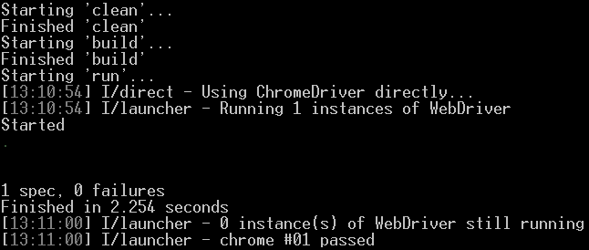

# 第七章：测试所有事物

自动化测试已经成为大多数现代软件开发过程的重要组成部分。敏捷方法论和软件工艺等方法强调自动化测试的重要性，并经常提倡进行全面测试驱动开发（TDD）的实践。

一套良好的自动化测试可以为项目增加巨大价值，因为它确保了任何破坏现有特性的代码更改都不会被忽视。因此，测试建立了信心。多亏了它们，开发者才不怕更改事物，玩转想法，重构，让代码变得更好。他们控制着自己的代码库。

无论你是否实践 TDD，你可能都希望对你的 Aurelia 应用进行一定程度的自动测试。这就是这一章要讲的内容。

为了使测试 Aurelia 项目更容易，Aurelia 团队选择了一组通常用于测试 JavaScript 项目的库**Jasmine**、**Karma**和**Protractor**，并将它们包括在项目骨架和 CLI 项目生成器中，以及它们相应的配置和项目中的测试运行任务。

+   Jasmine 是一个流行的 JS 测试框架，我们将用它来进行单元测试和端到端测试。它的位置在 [`jasmine.github.io/`](http://jasmine.github.io/)。

+   Karma 是一个测试运行器，被测试任务在幕后使用。它的位置在 [`karma-runner.github.io/`](https://karma-runner.github.io/)。

+   Protractor 是一个端到端测试框架，提供了一个丰富的 API 来与浏览器交互。它的位置在 [`www.protractortest.org/`](http://www.protractortest.org/)。

# 单元测试

在下一节中，我们将探讨如何对 Aurelia 应用进行单元测试，主要是通过在我们的联系人管理应用中添加单元测试。

### 注意

如果你不熟悉 Jasmine，你应该将其文档放在手边，因为阅读这一章时你可能需要查阅： [`jasmine.github.io/2.0/introduction.html`](http://jasmine.github.io/2.0/introduction.html)。

## 运行单元测试

使用 CLI 创建的项目包括一个运行单元测试的任务。这个任务定义在`aurelia_project/tasks/test.js`文件中，它只是使用位于项目根目录的配置文件`karma.conf.js`来启动 Karma。

这个任务可以通过在项目目录中打开控制台并运行以下命令来执行：

```js
> au test

```

这个命令将启动单个测试运行，并在控制台输出结果。

与 `run` 任务类似，`test` 任务可以通过添加 `watch` 开关来修改，使其监视测试文件，并在检测到任何更改时重新运行：

```js
> au test --watch

```

这个命令将启动一个测试运行，并监视测试文件，在每次更改后重新运行测试。

## 配置验证

如果你查看了`aurelia-validation`的代码，你可能会注意到这个插件需要在`ValidationRules`类使用之前加载。这是因为`ValidationRules`暴露的方法需要类的静态初始化，用一个`ValidationParser`实例，以便在错误消息中解析字符串插值等。

由于我们的模型类，如`Contact`、`PhoneNumber`、`Address`等，在其构造函数中依赖于`ValidationRules`类，如果我们不首先初始化它，我们将无法在任何一个测试中使用这些模型类。另外，我们的自定义验证规则在使用之前也必须加载。

因此，让我们添加一个设置文件，它将在每次测试运行开始时初始化验证：

`test/unit/setup-validation.js`

```js
import {Container} from 'aurelia-dependency-injection'; 
import {BindingLanguage} from 'aurelia-templating'; 
import {TemplatingBindingLanguage}  
  from 'aurelia-templating-binding'; 
import {ValidationParser, ValidationRules}  
  from 'aurelia-validation'; 
import '../../src/validation/rules'; 

const container = new Container(); 
container.registerSingleton( 
  BindingLanguage, TemplatingBindingLanguage); 
const parser = container.invoke(ValidationParser); 
ValidationRules.initialize(parser); 

```

在这里，我们首先导入`rules`文件，以便我们的自定义验证规则被正确注册。

接下来，我们将创建一个 DI 容器并初始化解析器所需的绑定语言实现，然后使用它来创建一个`ValidationParser`实例，我们用它来初始化`ValidationRules`类。

最后，让我们将此文件添加到单元测试设置中：

`test/aurelia-karma.js`

```js
//Omitted snippet... 
function requireTests() { 
  var TEST_REGEXP = /(spec)\.js$/i; 
  var allTestFiles = [ 
    '/base/test/unit/setup.js', 
    '/base/test/unit/setup-validation.js' 
  ]; 

  Object.keys(window.__karma__.files).forEach(function(file) { 
    if (TEST_REGEXP.test(file)) { 
      allTestFiles.push(file); 
    } 
  }); 

  require(allTestFiles, window.__karma__.start); 
} 
//Omitted snippet... 

```

在这里，我们只需将`setup-validation.js`文件添加到 Karma 在开始测试运行时使用`require`加载的文件列表中。

## 配置 Bluebird 警告

让我们也配置 Bluebird Promise 库的警告，以便我们的控制台不会充斥着警告：

`test/unit/setup.js`

```js
import 'aurelia-polyfills'; 
import {initialize} from 'aurelia-pal-browser'; 
initialize(); 

Promise.config({ 
  warnings: { 
    wForgottenReturn: false 
  } 
}); 

```

在这里，我们只需复制并粘贴`src/main.js`顶部的`Promise`配置。

在这个阶段，我们可以开始舒适地编写单元测试。

### 注意

`test/unit/app.spec.js`文件包含了由 CLI 在初始化项目时创建的`app`组件的示例测试。因为自我们开始以来这个组件已经完全改变了，所以这些测试不再相关并且会失败，所以你应该删除这个文件。

按照约定，包含单元测试的文件具有`.spec.js`扩展名。Aurelia 项目中的默认 Karma 配置期望测试位于遵循此命名约定的文件中，因此在我们联系管理应用程序中我们将遵循这一约定。

## 模型单元测试

我们将首先测试模型类。它们包含一些关键功能，我们想确保它们能正常工作。

然而，让我们首先确保我们的包是最新的，通过打开一个控制台并运行一个构建：

```js
> au build

```

然后，为了让编写测试的过程更加流畅，让我们首先启动一个控制台并开始持续测试过程：

```js
> au test -watch

```

任务应该开始运行，并且应该显示类似这样的内容：

```js
Chrome 53.0.2785 (Windows 10 0.0.0): Executed 0 of 0 ERROR (0.015 secs / 0 secs)

```

测试运行返回一个错误，因为它找不到要运行的任何测试。让我们改变这个。

### 测试静态工厂方法

我们要写的第一个测试将确保用一个空对象调用`fromObject`方法创建一个空的`PhoneNumber`对象：

`test/unit/contacts/models/phone-number.spec.js`

```js
import {PhoneNumber} from '../../../../src/contacts/models/phone-number'; 

describe('the PhoneNumber class', () => { 
  it('should create empty PhoneNumber when creating from empty object',  
  () => { 
    const result = PhoneNumber.fromObject({}); 
    expect(result).toEqual(new PhoneNumber()); 
  }); 
}); 

```

在这里，我们定义了一个测试用例，使用一个空对象调用`fromObject`静态方法，然后确保结果等于一个空`PhoneNumber`对象。

如果你保存文件并查看控制台，你应该会看到类似这样的消息：

```js
Chrome 53.0.2785 (Windows 10 0.0.0): Executed 1 of 1 SUCCESS (0.016 secs / 0.008 secs)

```

让我们再写一个测试，测试`fromObject`方法的另一个角度。它会确保标量属性被正确地复制到新的`PhoneNumber`对象中：

`test/unit/contacts/models/phone-number.spec.js`

```js
import {PhoneNumber} from '../../../../src/contacts/models/phone-number'; 

describe('the PhoneNumber class', () => { 
  //Omitted snippet... 

  it('should map all properties when creating from object', () => { 
    const src = { 
      type: 'Mobile', 
      number: '1234567890' 
    }; 
    const result = PhoneNumber.fromObject(src);
for (let property in src) { 
      expect(result[property]).toEqual(src[property]); 
    } 
  }); 
}); 

```

在这里，我们的新测试使用一个具有预期标量属性的对象调用`fromObject`静态方法：`type`和`number`。然后，我们确保每个属性都被正确地复制到结果的`PhoneNumber`对象中。

这样的测试也应添加到`EmailAddress`、`Address`和`SocialProfile`类中，每个类在自己的文件中：`email-address.spec.js`、`address.spec.js`和`social-profile.spec.js`，遵循相同的模式。我将留下这个作为读者的练习。本章节的示例应用程序可以作为参考。

既然已经测试了列表项类，让我们为`Contact`类写测试。我们从之前写的相同类型的测试开始：

`test/unit/contacts/models/contact.spec.js`

```js
import {Contact} from '../../../../src/contacts/models/contact'; 

describe('the Contact class', () => { 

  it('should create empty Contact when creating from empty object', () => { 
    const result = Contact.fromObject({}); 
    expect(result).toEqual(new Contact()); 
  }); 

  it('should map all properties when creating from object', () => { 
    const src = { 
      firstName: 'Never gonna give you up', 
      lastName: 'Never gonna let you down', 
      company: 'Never gonna run around and desert you', 
      birthDay: '1987-11-16', 
      note: 'Looks like you've been rickrolled' 
    }; 
    const result = Contact.fromObject(src); 

    for (let property in src) { 
      expect(result[property]).toEqual(src[property]); 
    } 
  }); 
}); 

```

然而，`Contact`类的`fromObject`方法不仅仅是复制属性，它还将列表项映射到相应的模型类。让我们添加一些测试来确保这能正常工作：

`test/unit/contacts/models/contact.spec.js`

```js
import {Contact} from '../../../../src/contacts/models/contact'; 
import {Address} from '../../../../src/contacts/models/address'; 
import {EmailAddress} from '../../../../src/contacts/models/email-address'; 
import {PhoneNumber} from '../../../../src/contacts/models/phone-number'; 
import {SocialProfile} from '../../../../src/contacts/models/social-profile'; 

describe('the Contact class', () => { 
  //Omitted snippet... 

  it ('should map phone numbers when creating from object', () => { 
    const result = Contact.fromObject({ phoneNumbers: [{}, {}] }); 
    const expected = [new PhoneNumber(), new PhoneNumber()]; 

    expect(result.phoneNumbers).toEqual(expected); 
  }); 

  it ('should map email addresses when creating from object', () => { 
    const result = Contact.fromObject({ emailAddresses: [{}, {}] }); 
    const expected = [new EmailAddress(), new EmailAddress()]; 

    expect(result.emailAddresses).toEqual(expected); 
  }); 

  it ('should map addresses when creating from object', () => { 
    const result = Contact.fromObject({ addresses: [{}, {}] }); 
    const expected = [new Address(), new Address()]; 

    expect(result.addresses).toEqual(expected); 
  });
it ('should map social profiles when creating from object', () => { 
    const result = Contact.fromObject({ socialProfiles: [{}, {}] }); 
    const expected = [new SocialProfile(), new SocialProfile()];
expect(result.socialProfiles).toEqual(expected); 
  }); 
}); 

```

在这里，我们添加了列表项类的`import`语句。然后我们添加了四个测试用例，每个测试用例对应一个列表项类，确保每个情况下对象数组被正确地映射到相应的类中。

### 测试计算属性

当涉及到单元测试时，计算属性与函数没有什么不同。让我们写一些测试来覆盖`Contact`类的`isPerson`属性：

`test/unit/contacts/models/contact.spec.js`

```js
//Omitted snippet... 
it('should be a person if it has a firstName and no lastName', () => { 
  const sut = Contact.fromObject({ firstName: 'A first name' }); 
  expect(sut.isPerson).toBeTruthy(); 
}); 

it('should be a person if it has a lastName and no firstName', () => { 
  const sut = Contact.fromObject({ lastName: 'A last name' }); 
  expect(sut.isPerson).toBeTruthy(); 
}); 

it('should be a person if it has a firstName and a lastName', () => { 
  const sut = Contact.fromObject({  
    firstName: 'A first name', 
    lastName: 'A last name' 
  }); 
  expect(sut.isPerson).toBeTruthy(); 
}); 

it('should not be a person if it has no firstName and no lastName', () => { 
  const sut = Contact.fromObject({ company: 'A company' }); 
  expect(sut.isPerson).toBeFalsy(); 
}); 
//Omitted snippet... 

```

在这里，我们添加了四个测试用例，以确保`isPerson`属性正确地行为。

### 注意

存储测试将应用的实例的变量名为`sut`，代表被测试的系统。许多自动化测试的作者认为这是一个标准术语。我喜欢使用这个缩写，因为它能清楚地标识测试的对象。

我将留给读者作为练习来编写`fullName`和`firstLetter`属性的测试用例。本章节的示例应用程序可以作为参考。

## 单元测试服务

测试服务也是非常直接的。在我们的联系人管理应用程序中，我们有一个服务：`ContactGateway`。然而目前它并不是非常便于测试，主要问题是它的构造函数，它配置了`HttpClient`实例。

### 从网关构造函数中移除配置

让我们重构我们的网关，使其更容易测试。我们将把`HttpClient`的配置移动到功能的`configure`函数中，这样`ContactGateway`的构造函数就不包含任何配置逻辑：

`src/contacts/index.js`

```js
import {Router} from 'aurelia-router'; 
import {HttpClient} from 'aurelia-fetch-client'; 
import {ContactGateway} from './services/gateway'; 
import environment from 'environment'; 

export function configure(config) { 
  const router = config.container.get(Router); 
  router.addRoute({ route: 'contacts', name: 'contacts',  
    moduleId: 'contacts/main', nav: true, title: 'Contacts' }); 

  const httpClient = config.container.invoke(HttpClient) 
    .configure(config => { config 
      .useStandardConfiguration() 
      .withBaseUrl(environment.contactsUrl); 
    }); 
  config.container.registerInstance(ContactGateway,  
    new ContactGateway(httpClient)); 
} 

```

在这里，我们使用 DI 容器创建一个`HttpClient`实例并对其进行配置，然后创建一个`ContactGateway`实例，我们在 DI 容器中注册它。您可能会注意到我们没有在容器中注册`HttpClient`本身。在大多数应用程序中，这样做是完全没问题的。然而，由于我们希望功能尽可能独立，其他功能可能会使用不同的`HttpClient`实例来调用不同的后端，所以我们不注册这个，因为它可能会与其他功能发生冲突。

接下来，我们可以从`ContactGateway`的构造函数中删除配置代码：

`src/contacts/services/gateway.js`

```js
import {inject} from 'aurelia-framework'; 
import {HttpClient, json} from 'aurelia-fetch-client'; 
import {Contact} from '../models/contact'; 

@inject(HttpClient) 
export class ContactGateway { 

  constructor(httpClient) { 
    this.httpClient = httpClient; 
  } 

  //Omitted snippet... 
} 

```

`ContactGateway`的构造函数现在没有任何配置逻辑。

自从我们在应用程序中更改了代码后，在添加测试之前我们需要重新构建它：

```js
> au build

```

### 测试读方法

让我们先为`ContactGateway`的两个读方法编写一些测试：

`test/unit/contacts/services/gateway.spec.js`

```js
import {ContactGateway}  
  from '../../../../src/contacts/services/gateway';  
import {Contact} from '../../../../src/contacts/models/contact'; 

describe('the ContactGateway class', () => { 

  let httpClient, sut; 

  beforeEach(() => { 
    httpClient = jasmine.createSpyObj('HttpClient', ['fetch']); 
    sut = new ContactGateway(httpClient); 
  }); 

  function createContact() { 
    return Contact.fromObject({ id: 1, company: 'Blue Spire' }); 
  } 

  function createJsonResponseMock(content) { 
    return { json: () => Promise.resolve(content) }; 
  } 

  it('should fetch all contacts', done => { 
    const contacts = [createContact()]; 
    httpClient.fetch.and.returnValue(Promise.resolve( 
      createJsonResponseMock(contacts))); 

    sut.getAll() 
      .then(result => expect(result).toEqual(contacts)) 
      .then(() => expect(httpClient.fetch) 
        .toHaveBeenCalledWith('contacts')) 
      .then(done); 
  }); 

  it('should fetch a contact by its id', done => { 
    const contact = createContact(); 
    httpClient.fetch.and.returnValue(Promise.resolve( 
      createJsonResponseMock(contact))); 

    sut.getById(contact.id) 
      .then(result => expect(result).toEqual(contact)) 
      .then(() => expect(httpClient.fetch) 
        .toHaveBeenCalledWith(`contacts/${contact.id}`)) 
      .then(done); 
  }); 
}); 

```

在这里，我们首先使用 Jasmine 的`beforeEach`函数定义一个测试设置。这个测试设置将在每个测试用例之前执行。在这个设置中，我们首先为`HttpClient`创建一个模拟对象，然后我们创建一个`ContactGateway`实例，我们的测试将对其进行操作。

接下来，我们定义了两个帮助函数：第一个用于创建一个`Contact`对象，第二个用于创建一个具有 JSON 正文的响应对象的模拟。这两个函数将被我们的测试用例使用。

最后，我们编写测试用例以验证`getAll`和`getById`方法是否正常工作。这两个测试用例都是异步测试，所以它们需要一个`done`函数作为参数，当测试完成后它们将调用这个函数。它们都遵循相同的模式：

1.  创建应该由测试方法返回的`Contact`对象。

1.  配置模拟的`HttpClient`的`fetch`方法，使其返回一个`Promise`，该`Promise`解析为一个模拟的响应对象，它暴露出作为 JSON 正文返回的数据。

1.  调用测试方法，当它解析时：

+   检查返回的`Promise`解析为预期的数据

+   检查`HttpClient`的`fetch`方法是否用适当的参数调用

### 测试写方法

测试写方法相当相似。然而，它需要做一些额外的工作，因为目前 HTML5 File API 没有提供一种简单的方法来比较`Blob`对象。所以为了测试我们网关发送的请求的正文，我们需要编写一些帮助函数：

`test/unit/contacts/services/gateway.spec.js`

```js
//Omitted snippet... 

function readBlob(blob) { 
  return new Promise(resolve => { 
    let reader = new FileReader(); 
    reader.addEventListener("loadend", () => {  
      resolve(reader.result); 
    }); 
    reader.readAsText(blob); 
  }); 
} 

function expectBlobsToBeEqual(result, expected) { 
  expect(result.type).toEqual(expected.type); 
  expect(result.size).toEqual(expected.size); 

  return Promise 
    .all([ readBlob(result), readBlob(expected) ]) 
    .then(([c1, c2]) => expect(c1).toEqual(c2)); 
} 

function expectFetchToHaveBeenCalled(expectedPath,  
                                     expectedProperties) { 
  let expectedBody; 
  if (expectedProperties.body) { 
    expectedBody = expectedProperties.body; 
    delete expectedProperties.body; 
  } 

  expect(httpClient.fetch).toHaveBeenCalledWith(expectedPath,    
    jasmine.objectContaining(expectedProperties)); 
  if (expectedBody) { 
    return expectBlobsToBeEqual( 
      httpClient.fetch.calls.mostRecent().args[1].body,  
      expectedBody); 
  } 
} 
//Omitted snippet... 

```

第一个助手函数，名为`readBlob`，简单地接受一个`Blob`对象作为其参数，并返回一个`Promise`，该`Promise`解析为`Blob`内容作为一个字符串。由于读取`Blob`内容的过程是异步的，它只是用一个`Promise`包装这个过程。

第二个助手函数，名为`expectBlobsToBeEqual`，期望两个`Blob`对象作为其参数。它首先比较它们的`type`和`size`属性以确保它们相等，然后使用`readBlob`来检索两个`Blob`对象的内容并比较结果以确保它们也相等，返回结果`Promise`。

最后一个助手函数，名为`expectFetchToHaveBeenCalled`，接收预期的路径和预期的请求属性。它首先从预期的请求属性中提取预期的主体，如果有，从对象中删除它。然后，它确保`HttpClient`的模拟`fetch`方法已经用预期的路径和减去主体的预期请求属性被调用，因为比较`Blob`对象是一个必须单独执行的异步过程。最后，如果提供了预期的主体，它使用传递给最后一个`fetch`调用的主体和预期的主体调用`expectBlobsToBeEqual`函数，并返回结果`Promise`。

这个最后的助手函数将帮助我们编写关于我们的网关如何调用其`HttpClient`的`fetch`方法的断言。让我们从一个`create`方法的测试开始：

`test/unit/contacts/services/gateway.spec.js`

```js
import {json} from 'aurelia-fetch-client'; 
//Omitted snippet... 

it('should create a contact', done => { 
  const contact = createContact(); 
  httpClient.fetch.and.returnValue(Promise.resolve()); 

  sut.create(contact) 
    .then(() => expectFetchToHaveBeenCalled( 
      'contacts',  
      { method: 'POST', body: json(contact) })) 
    .then(done); 
}); 
//Omitted snippet... 

```

在这里，我们首先从 Fetch 客户端导入`json`函数。我们将使用它将预期的请求负载转换为 JSON 编码的`Blob`对象。

这个测试本身相当直接，为接下来的测试设定了路径，这些测试将遵循相同的模式：

1.  创建一个`Contact`对象，将被传递给被测试的方法。

1.  配置`HttpClient`的模拟`fetch`方法，使其返回一个解决的`Promise`。

1.  调用被测试的方法，当它解决时，检查`HttpClient`的`fetch`方法是否用正确的参数被调用。

`update`和`updatePhoto`方法的压力测试非常相似：

`test/unit/contacts/services/gateway.spec.js`

```js
//Omitted snippet... 
it('should update a contact', done => { 
  const contact = createContact(); 
  httpClient.fetch.and.returnValue(Promise.resolve()); 

  sut.update(contact.id, contact) 
    .then(() => expectFetchToHaveBeenCalled( 
      `contacts/${contact.id}`,  
      { method: 'PUT', body: json(contact) })) 
    .then(done); 
}); 

it("should update a contact's photo", done => { 
  const id = 9; 
  const contentType = 'image/png'; 
  const file = new File(['some binary content'], 'img.png', { 
    type: contentType 
  }); 
  httpClient.fetch.and.returnValue(Promise.resolve()); 

  const expectedRequestProperties = { 
    method: 'PUT', 
    headers: { 'Content-Type': contentType }, 
    body: file 
  }; 
  sut.updatePhoto(id, file) 
    .then(() => expectFetchToHaveBeenCalled( 
      `contacts/${id}/photo`,  
      expectedRequestProperties)) 
    .then(done); 
}); 
//Omitted snippet... 

```

这两个测试遵循与之前一个相同的模式。

## 对值转换器进行单元测试

测试值转换器与测试服务并没有太大区别。当然，这取决于你需要测试的转换器的复杂性。在我们的联系人管理应用程序中，值转换器相当简单。

让我们为我们的`orderBy`值转换器写一个或两个测试来了解一下它：

`test/unit/resources/value-converters/order-by.spec.js`

```js
import {OrderByValueConverter}  
  from '../../../../src/resources/value-converters/order-by'; 

describe('the orderBy value converter', () => { 
  let sut; 

  beforeEach(() => { 
    sut = new OrderByValueConverter(); 
  }); 

  it('should sort values using property', () => { 
    const array = [ { v: 3 }, { v: 2 }, { v: 4 }, { v: 1 }, ]; 
    const expectedResult = [ { v: 1 }, { v: 2 },  
      { v: 3 }, { v: 4 }, ]; 

    const result = sut.toView(array, 'v'); 

    expect(result).toEqual(expectedResult); 
  }); 

  it('should sort values in reverse order when direction is "desc"', () => { 
    const array = [ { v: 3 }, { v: 2 }, { v: 4 }, { v: 1 }, ]; 
    const expectedResult = [ { v: 4 }, { v: 3 },  
      { v: 2 }, { v: 1 }, ]; 

    const result = sut.toView(array, 'v', 'desc'); 

    expect(result).toEqual(expectedResult); 
  }); 
}); 

```

在这里，我们首先定义一个简单的测试设置，创建测试主题，然后我们添加两个测试用例。第一个验证传递给`toView`方法的数组是否正确地使用指定的属性进行排序。第二个验证当`"desc"`作为第三个参数传递时，传递给`toView`方法的数组是否按降序排序。

当然，如果测试支持的值转换器支持双向绑定并且有一个`fromView`方法，应该添加额外的测试用例来涵盖这个第二个方法。

我将留给读者一个练习，为`groupBy`和`filterBy`值转换器编写测试。本章的示例应用程序可以作为参考。

## 单元测试自定义元素和属性

到目前为止我们所写的所有测试都与 Aurelia 关系不大。我们测试的代码可以在一个完全不同的 UI 框架中使用，而且很可能不需要做任何改变。这是因为我们还没有测试任何视觉方面。

当测试自定义元素和属性时，我们可能会满足于我们之前编写的测试类型，并且只测试它们的视图模型。这些测试将只涵盖组件的行为方面。然而，能够涵盖组件整体的测试，包括它们的视图对应部分，将会更加强大。

### 组件测试器

幸运的是，Aurelia 提供了`aurelia-testing`库，可以用来全面测试组件。因此，它导出两个重要的类：`StageComponent`和`ComponentTester`。

`StageComponent`类有一个单一的静态方法：

```js
withResources(resources: string | string[]): ComponentTester 

```

这个方法简单地在幕后创建一个`ComponentTester`类的实例，调用它自己的`withResources`方法，然后返回它。`StageComponent`基本上只是对组件测试器的 API 糖。以下两行可以互换而不产生任何效果：

```js
var tester = StageComponent.withResources('some/resources') 
var tester = new ComponentTester().withResources('some/resources') 

```

`ComponentTester`类提供了一个 API 来配置一个短暂存在的、沙盒化的 Aurelia 应用程序，在该应用程序中，被测试的组件将在测试期间运行：

+   `withResources(resources: string | string[]): ComponentTester`: 将提供的资源作为全局资源加载到沙盒应用程序中。

+   `inView(html: string): ComponentTester`: 使用提供的 HTML 作为沙盒应用程序的根视图。

+   `boundTo(bindingContext: any): ComponentTester`: 使用提供的值作为沙盒应用程序的根视图的绑定上下文。

+   `manuallyHandleLifecycle(): ComponentTester`: 告诉组件测试器应用程序的生命周期应该由测试用例手动处理。

+   `bootstrap(configure: (aurelia: Aurelia) => void): void`: 使用提供的函数配置沙盒 Aurelia 应用程序。默认情况下，应用程序使用`aurelia.use.standardConfiguration()`进行配置。这个方法可以用来加载组件所需的额外插件或功能。

+   `create(bootstrap: (aurelia: Aurelia) => Promise<void>): Promise<void>`：使用提供的引导函数创建沙盒应用程序。通常，这里会使用`aurelia-bootstrapper`库的`bootstrap`函数。返回的`Promise`在应用程序加载并启动后解决。

+   `bind(): Promise<void>`：绑定沙盒应用程序。它只能在手动处理应用程序生命周期时使用。

+   `attached(): Promise<void>`：将沙盒应用程序附加到 DOM。它只能在手动处理应用程序生命周期时使用。

+   `detached(): Promise<void>`：将沙盒应用程序从 DOM 中分离。它只能在手动处理应用程序生命周期时使用。

+   `unbind(): Promise<void>`：解绑沙盒应用程序。它只能在手动处理应用程序生命周期时使用。

+   `dispose()`：清理沙盒应用程序的所有资源并完全将其从 DOM 中移除。

在撰写本文时，`aurelia-testing`库仍处于测试阶段，因此在发布之前可能会向其添加一些新功能。

### 测试 file-drop-target 属性

让我们通过编写一个针对我们在第五章，*创建可复用组件*中编写的`file-drop-target`自定义属性的测试套件，看看如何使用组件测试器：

`test/unit/resources/attributes/file-drop-target.spec.js`

```js
import {StageComponent} from 'aurelia-testing'; 
import {bootstrap} from 'aurelia-bootstrapper'; 

describe('the file-drop-target custom attribute', () => { 

  let viewModel, component, element; 

  beforeEach(() => { 
    viewModel = { files: null }; 
    component = StageComponent 
      .withResources('resources/attributes/file-drop-target') 
      .inView('<div file-drop-target.bind="files"></div>') 
      .boundTo(viewModel); 
  }); 

  function create() { 
    return component.create(bootstrap).then(() => { 
      element = document 
        .querySelector('[file-drop-target\\.bind]'); 
    }); 
  } 

  afterEach(() => { 
    component.dispose(); 
  }); 
}); 

```

在这里，我们首先创建一个空的测试套件，它包含使用`beforeEach`函数的测试设置和使用`afterEach`函数的测试清理。在测试设置中，我们首先创建一个具有`files`属性的`viewModel`对象，该属性将绑定到我们的`file-drop-target`属性。其次，我们使用`StageComponent`类创建一个沙盒 Aurelia 应用程序，在该应用程序中，我们的自定义属性将在每次测试中运行。

这个沙盒应用程序将`file-drop-target`属性作为全局资源加载。其根视图将是一个带有`file-drop-target`属性的`div`元素，绑定到根绑定上下文的`files`属性，这将是`viewModel`对象。

我们还定义了一个`create`辅助函数，该函数将创建和引导沙盒应用程序，并在应用程序渲染后检索托管我们的`file-drop-target`属性的`element`。

最后，在测试清理过程中，我们只需`dispose`沙盒。

为了测试`file-drop-target`自定义属性，我们将需要在我们正在测试的属性托管的`element`上触发拖放事件。因此，让我们先编写一个工厂函数来创建此类事件：

`test/unit/resources/attributes/file-drop-target.spec.js`

```js
import {DOM} from 'aurelia-pal'; 
//Omitted snippet...  
function createDragEvent(type, dataTransfer) { 
  const e = DOM.createCustomEvent(type, { bubbles: true }); 
  e.dataTransfer = dataTransfer; 
  return e; 
} 
//Omitted snippet... 

```

这个函数相当直接。它只是使用作为参数传递的事件的`type`创建一个`Event`对象。它还告诉事件在触发时应该在 DOM 上冒泡。最后，它在返回之前将提供的`dataTransfer`对象分配给事件。

我们将在许多其他函数中使用这个函数，这些函数将用于触发拖放过程的各种步骤：

`test/unit/resources/attributes/file-drop-target.spec.js`

```js
//Omitted snippet... 
function dragOver() { 
  element.dispatchEvent(createDragEvent('dragover')); 
  return new Promise(setTimeout); 
} 

function drop(dataTransfer) { 
  element.dispatchEvent(createDragEvent('drop', dataTransfer)); 
  return new Promise(setTimeout); 
} 

function dragEnd(dataTransfer) { 
  element.dispatchEvent(createDragEvent('dragend', dataTransfer)); 
  return new Promise(setTimeout); 
} 
//Omitted snippet... 

```

这三个函数各自创建并派发一个特定的拖放事件。它们还返回一个`Promise`，其解决将在浏览器的事件队列被清空时发生。

更新绑定通常是一个异步过程，取决于绑定类型。Aurelia 的绑定引擎严重依赖于浏览器的事件循环，以使更新绑定的过程尽可能平滑。

因此，返回一个`Promise`，其`resolve`函数被推送到浏览器事件队列的末尾，使用`setTimeout`是一种在测试中使用的技术，以确保需要对属性进行更新或事件派发时，有足够的时间更新绑定。

最后，我们需要创建`File`对象以在我们的测试中使用：

`test/unit/resources/attributes/file-drop-target.spec.js`

```js
//Omitted snippet... 
function createFile() { 
  return new File( 
    ['some binary content'],  
    'test.txt',  
    { type: 'text/plain' }); 
} 
//Omitted snippet... 

```

现在我们有了编写第一个测试用例所需的所有工具：

`test/unit/resources/attributes/file-drop-target.spec.js`

```js
//Omitted snippet... 
it('should assign dropped files to bounded instruction', done => { 
  const files = [createFile()]; 

  create() 
    .then(() => dragOver()) 
    .then(() => drop({ files })) 
    .then(() => expect(viewModel.files).toEqual(files)) 
    .then(done); 
}); 
//Omitted snippet... 

```

这个测试确保，当拖动然后将一个文件列表拖放到承载我们自定义属性的元素上时，事件中的文件被分配给绑定属性的属性。

这个测试首先创建一个`files`列表并派发一个`dragover`事件，本身没有用，但只是为了遵循拖放操作的标准过程。接下来，它使用之前创建的`files`派发一个`drop`事件。最后，它确保`files`被正确分配给`viewModel`的`files`属性。

最后，让我们添加另一个测试用例，以确保事件数据被正确清除：

`test/unit/resources/attributes/file-drop-target.spec.js`

```js
//Omitted snippet... 
it('should clear data when drag ends', done => { 
  const files = [createFile()]; 
  const clearData = jasmine.createSpy('clearData'); 

  create() 
    .then(() => dragOver()) 
    .then(() => drop({ files })) 
    .then(() => dragEnd({ clearData })) 
    .then(() => expect(clearData).toHaveBeenCalled()) 
    .then(done); 
  }); 
//Omitted snippet... 

```

如果你现在运行测试，它们都应该通过。

### 测试 list-editor 元素

对自定义元素进行单元测试非常相似。让我们通过测试我们之前编写的`list-editor`自定义元素来看看它是如何工作的：

`test/unit/resources/elements/list-editor.spec.js`

```js
import {StageComponent} from 'aurelia-testing'; 
import {bootstrap} from 'aurelia-bootstrapper'; 

describe('the list-editor custom element', () => { 

  let items, createItem, component, element; 

  beforeEach(() => { 
    items = []; 
    createItem = jasmine.createSpy('createItem'); 
    component = StageComponent 
      .withResources('resources/elements/list-editor') 
      .inView(`<list-editor items.bind="items"  
          add-item.call="createItem()"></list-editor>`) 
      .boundTo({ items, createItem }); 
  }); 

  function create() { 
    return component.create(bootstrap).then(() => { 
      element = document.querySelector('list-editor'); 
    }); 
  } 

  afterEach(() => { 
    component.dispose(); 
  }); 
}); 

```

在这里，我们首先创建一个测试套件，它有一个创建一个空`items`数组的测试设置，并模拟一个用于创建新项目的函数。它还创建了一个组件测试器，将`list-editor`作为全局资源加载，在其根视图中使用`list-editor`元素，并将包含`items`数组和模拟的`createItem`函数的对象定义为根绑定上下文，该函数将绑定到`list-editor`实例。

我们还定义了一个`create`函数，它将创建并引导沙盒应用程序，在该应用程序中，测试元素将在每次测试期间运行。它在应用程序启动后还会检索`list-editor` DOM 元素。

最后，我们定义了一个测试清理函数，它将简单地`dispose`组件测试器。

当然，我们需要用项目作为对象。让我们创建一个简单的类，我们可以在测试用例中使用：

`test/unit/resources/elements/list-editor.spec.js`

```js
//Omitted snippet... 
class Item { 
  constructor(text) { 
    this.text = text; 
  } 

  toString() { 
    return this.text; 
  } 
} 

```

这个简单的`Item`类在构造函数中期望有一个`text`值，当转换为字符串时返回这个`text`。

在我们的测试中，我们需要检索由`list-editor`渲染的各种元素，以检查某些事情是否正确渲染，或者触发操作。因此，让我们在`list-editor`的视图中添加一些 CSS 类。这些类将帮助我们选择特定的元素，而不依赖于 HTML 结构本身，这会使测试变得脆弱，因为任何对 HTML 结构的更改都可能破坏它们。

`src/resources/elements/list-editor.html`

```js
<template> 
  <div class="form-group le-item" repeat.for="item of items"> 
    <template with.bind="item"> 
      <template replaceable part="item"> 
        <div class="col-sm-2 col-sm-offset-1"> 
          <template replaceable part="label"></template> 
        </div> 
        <div class="col-sm-8"> 
          <template replaceable part="value">${$this}</template> 
        </div> 
        <div class="col-sm-1"> 
          <template replaceable part="remove-btn"> 
            <button type="button"  
                    class="btn btn-danger le-remove-btn"  
                    click.delegate="items.splice($index, 1)"> 
              <i class="fa fa-times"></i> 
            </button> 
          </template> 
        </div> 
      </template> 
    </template> 
  </div> 
  <div class="form-group" show.bind="addItem"> 
    <div class="col-sm-9 col-sm-offset-3"> 
      <button type="button" class="btn btn-primary le-add-btn"  
              click.delegate="addItem()"> 
        <slot name="add-button-content"> 
          <i class="fa fa-plus-square-o"></i> 
          <slot name="add-button-label">Add</slot> 
        </slot> 
      </button> 
    </div> 
  </div> 
</template> 

```

在这里，我们简单地在每个作为每个项目根的元素上添加了一个`le-item` CSS 类。我们还在每个允许我们从列表中删除项目的按钮上添加了一个`le-remove-btn` CSS 类。最后，我们在允许向列表中添加项目的按钮上添加了一个`le-add-btn` CSS 类。

### 注意

`le`前缀代表列表编辑器。这不是尝试写法语卡通。

就像我们之前做的那样，我们必须重新构建应用程序，以便包是更新的，并且包括在`list-editor`模板中的新 CSS 类：

```js
> au build

```

让我们添加一些助手函数，以便在我们的测试元素内检索元素、执行操作或断言渲染 DOM 的结果：

`test/unit/resources/elements/list-editor.spec.js`

```js
//Omitted snippet... 
describe('the list-editor custom element', () => { 
  //Omitted snippet... 

  function getItemsViews() { 
    return Array.from(element.querySelectorAll('.le-item'));   
  }
function clickRemoveButtonAt(index) { 
    const removeBtn = element 
      .querySelectorAll('.le-remove-btn')[index]; 
    removeBtn.click(); 
    return new Promise(setTimeout); 
  }
function clickAddButton() { 
    const addBtn = element.querySelector('.le-add-btn'); 
    addBtn.click(); 
    return new Promise(setTimeout); 
  }
function isItemRendered(item, itemsViews) { 
    return (itemsViews || getItemsViews()) 
      .some(iv => iv.textContent.includes(item.text)); 
  }
function areAllItemsRendered() { 
    const itemsViews = getItemsViews(); 
    return items.every(i => isItemRendered(i, itemsViews)); 
  } 
}); 

```

在这里，我们定义了以下函数：

+   `getItemsViews`：检索元素（每个`items`的根）。

+   `clickRemoveButtonAt`：检索给定索引处的项目的**删除**按钮，并在其上触发一个`click`事件。它返回一个`Promise`，当浏览器的事件队列清空时，它将解决，以确保所有绑定都是最新的。

+   `clickAddButton`：检索**添加**按钮，并在其上触发一个`click`事件。它返回一个`Promise`，当浏览器的事件队列清空时，它将解决，以确保所有绑定都是最新的。

+   `isItemRendered`：如果提供的项目已经在`list-editor`的 DOM 中渲染，则返回`true`，否则返回`false`。

+   `areAllItemsRendered`：如果所有项目已经在`list-editor`的 DOM 中渲染，则返回`true`，否则返回`false`。

此时，我们已经有了编写测试所需的一切。

首先验证所有项目是否正确渲染：

`test/unit/resources/elements/list-editor.spec.js`

```js
//Omitted snippet... 
it('should render one form-group per item', done => { 
  items.push(new Item('test item 1')); 
  items.push(new Item('test item 2')); 

  create() 
    .then(() => expect(areAllItemsRendered()).toBe(true)) 
    .then(done); 
}); 
//Omitted snippet... 

```

接下来，让我们添加一些测试，以确保当点击项目的**删除**按钮时，该项目会被删除：

`test/unit/resources/elements/list-editor.spec.js`

```js
//Omitted snippet... 
it('should remove the item when the remove button is clicked', done => { 
  items.push(new Item('test item 1')); 
  items.push(new Item('test item 2')); 
  items.push(new Item('test item 3')); 

  const indexToRemove = 1; 
  const itemToRemove = items[indexToRemove]; 

  create() 
    .then(() => clickRemoveButtonAt(indexToRemove))  
    .then(() => expect(items.indexOf(itemToRemove)).toBe(-1)) 
    .then(() => expect(isItemRendered(itemToRemove)).toBe(false)) 
    .then(done); 
}); 
//Omitted snippet... 

```

最后，让我们添加一个测试用例，以确保点击**添加**按钮将创建一个新项目，并将其添加到列表中：

`test/unit/resources/elements/list-editor.spec.js`

```js
//Omitted snippet... 
it('should add new item when the add item button is clicked', done => { 
  items.push(new Item('test item 1')); 
  items.push(new Item('test item 2')); 

  const indexOfItemToAdd = items.length; 
  const itemToAdd = new Item('test item 3'); 
  createItem.and.callFake(() => { items.push(itemToAdd); }); 

  create() 
    .then(() => clickAddButton()) 
    .then(() => expect(items.indexOf(itemToAdd)) 
      .toBe(indexOfItemToAdd)) 
    .then(() => expect(isItemRendered(itemToAdd)).toBe(true)) 
    .then(done); 
}); 
//Omitted snippet... 

```

此时，所有测试都应该通过。

## 单元测试路由组件

在撰写本文时，没有一种方法可以利用`ComponentTester`测试路由组件。我们只能在单元测试中测试视图模型的行为，并依赖端到端测试来验证视图。然而，Aurelia 团队计划添加这个功能；你应该查看一下，以防在你阅读这本书时它已经被发布了。

对这类组件的视图模型进行单元测试与我们已经编写的大多数测试并没有太大区别，但让我们通过编写一个联系人创建组件的测试套件来举一个快速的例子：

`test/unit/contacts/components/creation.spec.js`

```js
 import {ValidationError}
  from 'aurelia-validation';
import {ContactCreation}
  from '../../../../src/contacts/components/creation';
import {Contact} from '../../../../src/contacts/models/contact';

describe('the contact creation component', () => {
  let gateway, validationController, router, sut;
  beforeEach(() => {
    gateway = jasmine.createSpyObj('ContactGateway', ['create']);
    validationController = jasmine.createSpyObj(
       'ValidationController', ['validate']);
    router = jasmine.createSpyObj('Router', ['navigateToRoute']);
    sut = new ContactCreation(gateway, validationController,
    router);
   });
});
```

在此，我们首先创建一个测试套件，该套件包含一个测试设置，用于创建一组模拟对象，然后使用这些模拟对象创建被测试系统（SUT）。

我们还需要添加一个帮助函数来创建验证错误：

`test/unit/contacts/components/creation.spec.js`

```js
//Omitted snippet... 
function createValidationError() { 
  return new ValidationError({}, 'Invalid', sut.contact,  
    'firstName'); 
} 
//Omitted snippet... 

```

最后，让我们添加一个测试用例，以确保在尝试保存无效联系人时什么也不会发生，再添加一个测试用例，以确保保存有效联系人时能做正确的事情：

`test/unit/contacts/components/creation.spec.js`

```js
//Omitted snippet... 
it('should do nothing when contact is invalid', done => { 
  const errors = [createValidationError()]; 
  validationController.validate.and 
    .returnValue(Promise.resolve(errors)); 

  sut.save() 
    .then(() => expect(gateway.create).not.toHaveBeenCalled()) 
    .then(() => expect(router.navigateToRoute) 
      .not.toHaveBeenCalled()) 
    .then(done); 
}); 

it('should create and navigate when contact is valid', done => { 
  validationController.validate.and 
    .returnValue(Promise.resolve([])); 
  gateway.create.and.returnValue(Promise.resolve()); 

  sut.save() 
    .then(() => expect(gateway.create) 
      .toHaveBeenCalledWith(sut.contact)) 
    .then(() => expect(router.navigateToRoute) 
      .toHaveBeenCalledWith('contacts')) 
    .then(done); 
}); 
//Omitted snippet... 

```

这给出了一个很好的测试路由组件视图模型的想法。我将留给读者作为练习，为`contacts`特性中的其他路由组件添加测试。本章节的示例应用程序可以作为参考。

# 端到端测试

单元测试的目的是验证代码单元的隔离，而端到端（**E2E**）测试的目的是验证整个应用程序。这些测试可以有不同的深度。它们的范围可能限于客户端应用程序本身。在这种情况下，应用程序所使用的任何远程服务都需要以某种方式被模拟。

它们也可以涵盖整个系统。大多数时候，这意味着支持应用程序的服务必须部署到一个测试位置，并用受控的测试数据进行初始化。

无论你的端到端测试策略是什么，技术上基本保持不变。在本节中，我们将了解如何利用 Protractor 为我们的联系人管理应用程序编写功能测试场景。

## 设置环境

在撰写本文时，CLI 不包括 Protractor 的设置。由于我们是用 CLI 开始项目的，让我们看看如何向我们的应用程序添加端到端测试的支持。

我们首先需要安装 Gulp 的`protractor`插件以及`del`库。在项目的目录中打开一个控制台，并运行以下命令：

```js
> npm install gulp-protractor del --save-dev

```

接下来，我们需要存储一些关于端到端测试过程的配置值。让我们把这些添加到`aurelia.json`文件中：

`aurelia_project/aurelia.json`

```js
{ 
  //Omitted snippet... 
  "unitTestRunner": { 
    "id": "karma", 
    "displayName": "Karma", 
    "source": "test\\unit\\**\\*.js" 
  }, 
 "e2eTestRunner": { 
    "id": "protractor", 
    "displayName": "Protractor", 
    "source": "test/e2e/src/**/*.js", 
    "output": "test/e2e/dist/", 
    "transpiler": { 
      "id": "babel", 
      "displayName": "Babel", 
      "options": { 
        "plugins": [ 
          "transform-es2015-modules-commonjs" 
        ] 
      } 
    } 
  }, 
  //Omitted snippet... 
} 

```

这个新部分包含路径和转换器选项，这些将被我们的端到端任务使用。

这个任务相当直接：它使用 Babel 转换测试套件，因此可以在 Node 上运行，然后启动 Protractor。让我们首先编写任务描述符：

`aurelia_project/tasks/e2e.json`

```js
{ 
  "name": "e2e", 
  "description":  
    "Runs all end-to-end tests and reports the results.", 
  "flags": [] 
} 

```

接下来，让我们编写任务本身：

`aurelia_project/tasks/e2e.js`

```js
import gulp from 'gulp'; 
import del from 'del'; 
import {webdriver_update, protractor} from 'gulp-protractor'; 
import plumber from 'gulp-plumber'; 
import notify from 'gulp-notify'; 
import changedInPlace from 'gulp-changed-in-place'; 
import sourcemaps from 'gulp-sourcemaps'; 
import babel from 'gulp-babel'; 
import project from '../aurelia.json'; 
import {CLIOptions} from 'aurelia-cli'; 

function clean() { 
  return del(project.e2eTestRunner.output + '*'); 
} 

function build() { 
  return gulp.src(project.e2eTestRunner.source) 
    .pipe(plumber({ 
      errorHandler: notify.onError('Error: <%= error.message %>') 
    })) 
    .pipe(changedInPlace({firstPass:true})) 
    .pipe(sourcemaps.init()) 
    .pipe(babel(project.e2eTestRunner.transpiler.options)) 
    .pipe(gulp.dest(project.e2eTestRunner.output)); 
} 

function run() { 
  return gulp.src(project.e2eTestRunner.output + '**/*.js') 
    .pipe(protractor({ 
      configFile: 'protractor.conf.js', 
      args: ['--baseUrl', 'http://127.0.0.1:9000'] 
    })) 
    .on('end', () => { process.exit(); }) 
    .on('error', e => { throw e; }); 
} 

export default gulp.series( 
  webdriver_update, 
  clean, 
  build, 
  run 
); 

```

如果你不熟悉 Gulp，让我快速解释一下这个任务做什么：

+   如有需要，它将更新 WebDriver。

+   它清理输出目录，那里存放着编译后的测试套件。

+   它将测试套件编译到输出目录中。

+   它启动了 Protractor。

    ### 注意

    Protractor 主要是一个 API，它建立在 Selenium 之上，Selenium 是允许我们在浏览器中播放场景的实际引擎。WebDriver 是 Node 绑定，允许我们与 Selenium 通信。

你可能注意到了一个配置文件路径被传递给了 Protractor。让我们编写这个配置：

`protractor.conf.js`

```js
exports.config = { 
  directConnect: true, 

  capabilities: { 
    'browserName': 'chrome' 
  }, 

  specs: ['test/e2e/dist/**/*.js'], 

  plugins: [{ 
    package: 'aurelia-tools/plugins/protractor' 
  }], 

  jasmineNodeOpts: { 
    showColors: true, 
    defaultTimeoutInterval: 30000 
  } 
}; 

```

深入探索 Protractor 超出了本书的范围。然而，从这个配置中，你可能可以理解到它将使用 Google Chrome 来运行测试，它期望测试文件位于`test/e2e/dist`目录中，这是我们配置任务以编译我们的测试套件的地方，并且从`aurelia-tools`包中加载了一个插件。`aurelia-tools`库已经包含在基于 CLI 的项目中，所以不需要安装。

这一部分相当重要，因为这个插件向 Protractor API 添加了一些 Aurelia 特定的方法。我们将在下一节中看到这些方法。

## 模拟后端

我们的联系人管理应用程序并不是独立存在的。它建立在一个基于 HTTP 的 API 之上，该 API 允许应用程序访问数据和执行操作。因此，我们需要一个受控的 API 版本，实际上是一个模拟，它将包含一组预定义的数据，并且我们可以在每次测试之前将其重置为原始状态。

你可以从本书的工件中获取这个模拟的 API。只需将`samples`中的`chapter-7\app\test\e2e\api-mock`目录复制到您自己项目的`test\e2e`目录中。您可能需要先创建`e2e`目录。

一旦完成这个步骤，请确保通过在`api-mock`目录中打开控制台并运行以下命令来恢复 API 模拟器所需的所有依赖项：

```js
> npm install

```

API 模拟器现在准备运行。

为了在每次测试之前重置数据集，我们将需要一个帮助函数：

`test/e2e/src/contacts/api-mock.js`

```js
import http from 'http'; 

export function resetApi() { 
  const deferred = protractor.promise.defer(); 

  const request = http.request({ 
    protocol: 'http:', 
    host: '127.0.0.1', 
    port: 8000, 
    path: '/reset', 
    method: 'POST' 
  }, response => { 
    if (response.statusCode < 200 || response.statusCode >= 300) { 
      deferred.reject(response); 
    } else { 
      deferred.fulfill(); 
    } 
  }); 
  request.end(); 

  return deferred.promise; 
} 

```

如果你不知道，Protractor 是在 Node 上运行的，而不是在浏览器中。因此，我们首先导入 Node 的`http`模块。接下来，我们定义并导出一个`resetApi`函数，该函数简单地向我们 HTTP API 的`/reset`端点发送一个`POST`请求。它还返回一个`Promise`，当 HTTP 请求完成时解析。

这个函数告诉后端将它的数据集重置为其原始状态。我们将在每个测试之前调用它，所以每个测试都可以确信它是在相同的数据集上工作，即使之前的测试创建了一个新的联系人或更新了一个现有的联系人。

## 页面对象模式

一个典型的端到端测试将加载一个给定的 URL，从文档中检索一个或多个 DOM 元素，对这个或这些元素执行一个动作或分发一个事件，然后验证是否达到了预期的结果。

因此，选择元素并在它们上执行操作可以迅速使测试代码膨胀。另外，通常需要在多个测试用例中选择一组给定的元素。在很多地方重复选择代码使得代码变得僵硬且难以更改。测试变得比解放更具有限制性。

为了使我们的测试更具描述性且更容易更改，我们将使用页面对象模式。这个模式描述了我们如何创建一个类来表示给定页面或组件的 UI，以封装选择特定元素并在它们上执行操作的逻辑。

让我们通过为联系人列表组件创建这样的类来说明这一点：

`test/e2e/src/contacts/list.po.js`

```js
export class ContactsListPO { 

  getTitle() { 
    return element(by.tagName('h1')).getText(); 
  } 

  getAllContacts() { 
    return element.all(by.css('.cl-details-link')) 
      .map(link => link.getText()); 
  } 

  clickContactLink(index) { 
    const result = {}; 
    const link = element.all( 
      by.css(`.cl-details-link`)).get(index); 
    link.getText().then(fullName => { 
      result.fullName = fullName; 
    }); 
    link.click(); 
    return browser.waitForRouterComplete().then(() => result); 
  } 

  clickNewButton() { 
    element(by.css('.cl-create-btn')).click(); 
    return browser.waitForRouterComplete(); 
  } 

  setFilter(value) { 
    element(by.valueBind('filter & debounce')) 
      .clear().sendKeys(value); 
    return browser.sleep(200); 
  } 

  clickClearFilter() { 
    element(by.css('.cl-clear-filter-btn')).click(); 
    return browser.sleep(200); 
  } 
} 

```

这个类以一个`getAllContacts`方法开始。这个方法使用 Protractor API 选择所有具有`cl-details-link` CSS 类的元素，然后将它们映射到它们的文本内容。这个方法允许我们获取一个包含所有显示联系人的全名的数组。

接下来，它暴露了一个`clickContactLink`方法，该方法检索具有`cl-details-link` CSS 类的那些元素中的第`index`个元素，然后获取其文本内容，将其分配给`result`对象上的`fullName`属性，在执行元素上的点击操作之前。然后，它使用 Aurelia 的 Protractor 插件提供的扩展方法之一来等待路由完成其导航周期，这将是通过点击链接触发的，并返回结果`Promise`，其结果被改变为`result`对象。

### 注意

如前所述，深入探索 Protractor 超出了本书的范围。然而，如果你不熟悉它，了解所有 Protractor API 中的方法返回`Promise`是很重要的，但通常没有必要使用`then`来链接它们，因为 Protractor 内部会为所有异步操作排队。

我强烈建议你在尝试编写广泛的端到端测试套件之前，先熟悉 Protractor 这一方面。

`clickNewButton`方法相当简单；它选择具有`cl-create-btn` CSS 类的元素并对其执行点击操作，然后等待路由完成其导航周期。

`setFilter`方法使用 Protractor 的 Aurelia 插件提供的另一个扩展方法来选择与`filter`属性绑定且具有`debounce`绑定行为的元素。它然后清除其值并向其发送给定的一系列键盘输入，然后让浏览器休眠 200 毫秒。

最后，`clickClearFilter`方法选择具有`cl-clear-filter-btn` CSS 类的元素并执行点击操作。然后让浏览器休眠 200 毫秒。

### 注意

在撰写本文时，在操作后使用`sleep`指令是必要的，以确保所有可能需要对操作做出反应的绑定都已更新。

页面对象的目的是封装并抽象掉与视图的交互。由于所有与组件 HTML 相关的代码都集中在一个单一的类中，因此修改组件视图的影响将限于这个类。另外，正如我们将在下一节中看到的，测试用例本身只需要处理与视图的高级 API，而不需要处理 HTML 结构本身的复杂性。大多数对 Protractor API 的调用都将隐藏在我们的页面对象内部。

您可能注意到，前面代码片段中的大多数选择器都使用新的 CSS 类来选择元素。让我们将这些添加到联系人列表模板中：

`src/contacts/components/list.html`

```js
<template> 
  <section class="container"> 
    <h1>Contacts</h1> 

    <div class="row"> 
      <div class="col-sm-1"> 
        <a route-href="route: contact-creation"  
           class="btn btn-primary cl-create-btn"> 
          <i class="fa fa-plus-square-o"></i> New 
        </a> 
      </div> 
      <div class="col-sm-2"> 
        <div class="input-group"> 
          <input type="text" class="form-control"  
                 placeholder="Filter"  
                 value.bind="filter & debounce"> 
          <span class="input-group-btn" if.bind="filter"> 
            <button class="btn btn-default cl-clear-filter-btn"  
                    type="button"  
                    click.delegate="filter = ''"> 
              <i class="fa fa-times"></i> 
              <span class="sr-only">Clear</span> 
            </button> 
          </span> 
        </div> 
      </div> 
    </div> 

    <group-list items.bind="contacts  
                  | filterBy:filter:'firstName':'lastName': 
                    'company'" 
                group-by="firstLetter" order-by="fullName"> 
      <template replace-part="item"> 
        <a route-href="route: contact-details;  
                       params.bind: { id: id }"  
           class="cl-details-link"> 
          <span if.bind="isPerson"> 
            ${firstName} <strong>${lastName}</strong> 
          </span> 
          <span if.bind="!isPerson"> 
            <strong>${company}</strong> 
          </span> 
        </a> 
      </template> 
    </group-list> 
  </section> 
</template> 

```

最后，在我们进入第一个测试用例之前，让我们快速添加两个我们将在测试中需要的其他页面对象：

`test/e2e/src/contacts/creation.po.js`

```js
export class ContactCreationPO { 

  getTitle() { 
    return element(by.tagName('h1')).getText(); 
  } 
} 

```

`test/e2e/src/contacts/details.po.js`

```js
export class ContactDetailsPO { 

  getFullName() { 
    return element(by.tagName('h1')).getText(); 
  } 
} 

```

第一个页面对象封装了联系人创建组件。它简单地暴露了一个`getTitle`方法，该方法选择`h1`元素并返回其文本内容。

第二个页面对象是用于联系详情组件的。它有一个`getFullName`方法，该方法允许我们通过选择`h1`元素并返回其文本内容来检索联系人的显示全名。

## 编写第一个测试用例

现在所有我们需要的工具都已经准备好了，让我们为联系人列表组件编写第一个测试用例：

`test/e2e/src/contacts/list.spec.js`

```js
import {resetApi} from './api-mock.js'; 
import {ContactsListPO} from './list.po.js'; 

describe('the contacts list page', () => { 

  let listPo; 

  beforeEach(done => { 
    listPo = new ContactsListPO(); 

    resetApi().then(() => { 
      browser 
        .loadAndWaitForAureliaPage('http://127.0.0.1:9000/') 
        .then(done); 
    }); 
  }); 

  it('should display the list of contacts', () => { 
    expect(listPo.getTitle()).toEqual('Contacts'); 
    listPo.getAllContacts().then(names => { 
      expect(names.length).toBeGreaterThan(0); 
    }); 
  }); 
}); 

```

在这里，我们从测试设置开始，该设置创建了一个联系人列表页面对象的实例，重置了 API，然后使用了 Aurelia 的 Protractor 插件提供的另一个扩展方法来加载给定 URL，然后等待 Aurelia 应用程序完成启动。

接下来，我们定义了一个第一个测试用例，该测试用例使用页面对象的方法来确保某些联系人被显示。

### 注意

尽管使用 Protractor 运行的测试是异步的，但大多数情况下，没有必要使用 Jasmine 的`done`函数来让框架知道测试用例何时完成，因为 Protractor 修改了 Jasmine 的函数，使其自身使用自己的内部任务队列来处理异步性。

这个规则的例外是在执行 Protractor 未处理的异步操作时，比如在`beforeEach`函数中，我们使用异步 HTTP 请求重置 API。

## 运行测试

在此阶段，我们已经准备就绪并运行了我们的 E2E 测试。为此，我们首先需要运行 API 模拟，通过在我们的项目中的`test/e2e/api-mock`目录中打开一个控制台并执行以下命令：

```js
> npm start

```

一旦 API 运行，我们还需要启动应用程序本身，通过在项目的目录中打开一个控制台并运行以下命令来实现：

```js
> au run

```

这两个命令是必要的，因为端到端测试需要在我们应用程序中加载浏览器来执行，并且需要在每次测试前调用 API 来重置其数据。当然，应用程序本身也需要 API 来请求数据和执行操作。

一旦 API 模拟和应用程序都在运行，我们就可以通过在项目目录中打开第三个控制台并运行以下命令来启动端到端测试：

```js
> au e2e

```

你将看到任务开始，在过程中会出现一个 Chrome 实例。你会看到应用程序加载并且测试案例场景在你眼前播放，然后 Chrome 关闭并且任务完成。完整的输出应该类似于这样：



### 注意

`e2e`任务在 WebDriver 需要首先更新自己时，偶尔可能需要一些时间才能启动。

## 测试联系人列表

既然我们知道一切工作正常，让我们为联系人列表组件添加一些测试：

`test/e2e/src/contacts/list.spec.js`

```js
import {resetApi} from './api-mock.js'; 
import {ContactsListPO} from './list.po.js'; 
import {ContactDetailsPO} from './details.po.js'; 
import {ContactCreationPO} from './creation.po.js'; 

describe('the contacts list page', () => { 

  let listPo, detailsPo, creationPo; 

  beforeEach(done => { 
    listPo = new ContactsListPO(); 
    detailsPo = new ContactDetailsPO(); 
    creationPo = new ContactCreationPO(); 

    resetApi().then(() => { 
      browser 
        .loadAndWaitForAureliaPage('http://127.0.0.1:9000/') 
        .then(done); 
    }); 
  }); 

  it('should load the list of contacts', () => { 
    expect(listPo.getTitle()).toEqual('Contacts'); 
    listPo.getAllContacts().then(names => { 
      expect(names.length).toBeGreaterThan(0); 
    }); 
  }); 

  it('should display details when clicking a contact link', () => { 
    listPo.clickContactLink(0).then(clickedContact => { 
      expect(detailsPo.getFullName()) 
        .toEqual(clickedContact.fullName); 
    }); 
  }); 

  it('should display the creation form when clicking New', () => { 
    listPo.clickNewButton(); 

    expect(creationPo.getTitle()).toEqual('New contact'); 
  }); 

  it('should filter the list', () => { 
    const searched = 'Google'; 

    listPo.setFilter(searched); 

    listPo.getAllContacts().then(names => { 
      expect(names.every(n => n.includes(searched))).toBe(true); 
    }); 
  }); 

  it('should reset unfiltered list when clicking clear filter', () =>  
  { 
    let unfilteredNames; 
    listPo.getAllContacts().then(names => { 
      unfilteredNames = names; 
    }); 
    listPo.setFilter('Google'); 

    listPo.clickClearFilter(); 

    listPo.getAllContacts().then(names => { 
      expect(names).toEqual(unfilteredNames); 
    }); 
  }); 
}); 

```

+   这些新测试案例中的第一个确保点击列表中的一个联系人条目时，应用程序导航到联系人的详细信息组件

+   第二个测试确保点击**新建**按钮时，应用程序导航到联系人创建组件

+   第三个确保当在筛选文本框中输入搜索词时，列表使用这个搜索词进行筛选。

+   最后，第四个测试确保在搜索后清除筛选文本框，列表将恢复未筛选状态

这个测试套件现在覆盖了联系人列表组件的所有功能。如果你在这个时候运行端到端测试，你应该看到五个测试案例通过。

## 测试联系人创建

让我们尝试通过为联系人创建组件添加一个测试套件来使事情变得复杂一些，该组件包括一个带有验证规则的复杂表单。

首先，我们将编写一个可重用的类，遵循页面对象模式，该类将封装联系人表单视图。这样，我们就能使用这个类来测试联系人创建，也能最终测试联系人的编辑。

我们将从为列表编辑器编写基本页面对象开始。这个类将封装如何访问并在联系表单组件的`list-editor`元素上执行操作的细节。

`test/e2e/src/contacts/form.po.js`

```js
class ListEditorPO { 

  constructor(property) { 
    this.property = property; 
  }  

  _getContainer() { 
    return element(by.css( 
      `list-editor[items\\.bind=contact\\.${this.property}]`)); 
  } 

  _getItem(index) { 
    return this._getContainer() 
      .all(by.css(`.le-item`)) 
      .get(index); 
  }  

  _selectOption(index, name, value) { 
    this._getItem(index) 
      .element(by.valueBind(`${name} & validate`)) 
      .element(by.css(`option[value=${value}]`)) 
      .click(); 
    return browser.sleep(200); 
  } 

  _setText(index, name, value) { 
    this._getItem(index) 
      .element(by.valueBind(`${name} & validate`)) 
      .clear() 
      .sendKeys(value); 
    return browser.sleep(200); 
  } 

  clickRemove(index) { 
    this._getItem(index) 
      .element(by.css(`.le-remove-btn`)) 
      .click(); 
    return browser.sleep(200); 
  } 

  clickAdd() { 
    this._getContainer() 
      .element(by.css(`.le-add-btn`)) 
      .click(); 
    return browser.sleep(200); 
  } 
} 

```

在这里，我们首先定义一个名为`ListEditorPO`的基本类。这个类封装与联系表单中的单个`list-editor`元素的交互，并知道如何：

1.  在绑定给定属性的列表中给定索引的`select`中选择给定的`option`。

1.  向绑定给给定属性的列表中给定索引的字段发送给定的一系列键。

1.  点击列表中给定索引的**删除**按钮。

1.  点击**添加**按钮。

接下来，我们将通过编写四个特殊化的页面对象来扩展这个类，每个对象对应联系人可以有的每种类型的项目：

`test/e2e/src/contacts/form.po.js`

```js
//Omitted snippet... 

class PhoneNumberListEditorPO extends ListEditorPO { 

  constructor() { 
    super('phoneNumbers'); 
  } 

  setType(index, value) { 
    return this._selectOption(index, 'type', value); 
  } 

  setNumber(index, value) { 
    return this._setText(index, 'number', value); 
  } 
} 

class EmailAddressListEditorPO extends ListEditorPO { 

  constructor() { 
    super('emailAddresses'); 
  } 

  setType(index, value) { 
    return this._selectOption(index, 'type', value); 
  } 

  setAddress(index, value) { 
    return this._setText(index, 'address', value); 
  } 
} 

class AddressListEditorPO extends ListEditorPO { 

  constructor() { 
    super('addresses'); 
  } 

  setType(index, value) { 
    return this._selectOption(index, 'type', value); 
  } 

  setNumber(index, value) { 
    return this._setText(index, 'number', value); 
  } 

  setStreet(index, value) { 
    return this._setText(index, 'street', value); 
  } 

  setPostalCode(index, value) { 
    return this._setText(index, 'postalCode', value); 
  } 

  setState(index, value) { 
    return this._setText(index, 'state', value); 
  } 

  setCountry(index, value) { 
    return this._setText(index, 'country', value); 
  } 
} 

class SocialProfileListEditorPO extends ListEditorPO { 

  constructor() { 
    super('socialProfiles'); 
  } 

  setType(index, value) { 
    return this._selectOption(index, 'type', value); 
  } 

  setUsername(index, value) { 
    return this._setText(index, 'username', value); 
  } 
} 

```

在这里，我们定义了一些扩展基本`ListEditorPO`类的类：`PhoneNumberListEditorPO`、`EmailAddressListEditorPO`、`AddressListEditorPO`和`SocialProfileListEditorPO`。它们都：

+   指定底层`list-editor`元素绑定的属性

+   添加专用方法来设置底层`list-editor`中每个项目的字段值，例如用于电话号码的`setType`和`setNumber`，或用于地址的`setStreet`和`setCity`。

最后，我们将为联系表单本身编写一个页面对象：

`test/e2e/src/contacts/form.po.js`

```js
//Omitted snippet... 

export class ContactFormPO { 

  constructor() { 
    this.phoneNumbers = new PhoneNumberListEditorPO(); 
    this.emailAddresses = new EmailAddressListEditorPO(); 
    this.addresses = new AddressListEditorPO(); 
    this.socialProfiles = new SocialProfileListEditorPO(); 
  } 

  _setText(name, value) { 
    element(by.valueBind(`contact.${name} & validate`)) 
      .clear() 
      .sendKeys(value); 
    return browser.sleep(200); 
  } 

  setFirstName(value) { 
    return this._setText('firstName', value); 
  } 

  setLastName(value) { 
    return this._setText('lastName', value); 
  } 

  setCompany(value) { 
    return this._setText('company', value); 
  } 

  setBirthday(value) { 
    return this._setText('birthday', value); 
  } 

  setNote(value) { 
    return this._setText('note', value); 
  } 

  getValidationErrors() { 
    return element.all(by.css('.validation-message')) 
      .map(x => x.getText()); 
  } 
} 

```

在这里，我们导出一个名为`ContactFormPO`的类，它封装了与联系表单视图的交互。它有每个扩展`ListEditorPO`类的实例，因此测试可以与电话号码、电子邮件地址、地址和社会资料的各个`list-editor`元素交互。它还有允许我们设置名字、姓氏、公司、生日和备注值的方法。最后，它有一个允许我们检索表单上所有验证错误消息的方法。

在能够编写我们的新测试之前，我们需要将此表单页面对象与联系创建组件的页面对象连接。我们还将向其中添加几个方法：

`test/e2e/src/contacts/creation.po.js`

```js
import {ContactFormPO} from './form.po.js'; 

export class ContactCreationPO extends ContactFormPO { 

  getTitle() { 
    return element(by.tagName('h1')).getText(); 
  } 

  clickSave() { 
    element(by.buttonText('Save')).click(); 
    return browser.sleep(200); 
  } 

  clickCancel() { 
    element(by.linkText('Cancel')).click(); 
    return browser.sleep(200);
 } 
} 

```

在这里，我们首先使`ContactCreationPO`类继承`ContactFormPO`类，然后添加一个方法来点击**保存**按钮，另一个方法来点击**取消**链接。

有了这个准备，编写联系创建组件的测试套件就相当直接了：

`test/e2e/src/contacts/creation.spec.js`

```js
import {resetApi} from './api-mock.js'; 
import {ContactsListPO} from './list.po.js'; 
import {ContactCreationPO} from './creation.po.js'; 

describe('the contact creation page', () => { 

  let listPo, creationPo; 

  beforeEach(done => { 
    listPo = new ContactsListPO(); 
    creationPo = new ContactCreationPO(); 

    resetApi().then(() => { 
      browser.loadAndWaitForAureliaPage('http://127.0.0.1:9000/'); 
      listPo.clickNewButton().then(done); 
    }); 
     });   
}); 

```

在这个测试套件的设置中，我们首先创建列表和创建组件的页面对象。我们重置 API 的数据，然后加载应用程序，点击**新建**按钮导航到联系创建组件。

我们现在可以丰富这个测试套件，添加一些验证联系创建组件行为的测试用例：

```js
it('should display errors when clicking save and form is invalid', () => { 
  creationPo.setBirthDay('this is absolutely not a date'); 
  creationPo.phoneNumbers.clickAdd(); 
  creationPo.emailAddresses.clickAdd(); 
  creationPo.addresses.clickAdd(); 
  creationPo.socialProfiles.clickAdd(); 

  creationPo.clickSave(); 

  expect(creationPo.getTitle()).toEqual('New contact'); 
  expect(creationPo.getValidationErrors()).toEqual([ 
    'Birthday must be a valid date.',  
    'Address is required.',      
    'Number is required.',  
    'Street is required.',  
    'Postal Code is required.',  
    'City is required.',  
    'Country is required.',  
    'Username is required.' 
  ]); 
}); 

it('should create contact when clicking save and form is valid', () => { 
  creationPo.setFirstName('Chuck'); 
  creationPo.setLastName('Norris'); 
  creationPo.setBirthDay('1940-03-10'); 

  creationPo.emailAddresses.clickAdd(); 
  creationPo.emailAddresses.setType(0, 'Office'); 
  creationPo.emailAddresses.setAddress(0,  
    'himself@chucknorris.com'); 

  creationPo.clickSave(); 

  expect(listPo.getTitle()).toEqual('Contacts'); 
  expect(listPo.getAllContacts()).toContain('Chuck Norris'); 
}); 

it('should not create contact when clicking cancel', () => { 
  creationPo.setFirstName('Steven'); 
  creationPo.setLastName('Seagal'); 

  creationPo.clickCancel(); 

  expect(listPo.getTitle()).toEqual('Contacts'); 
  expect(listPo.getAllContacts()).not.toContain('Steven Seagal'); 
}); 

```

在这里，我们定义了三个测试用例。第一个确保当表单处于无效状态并且点击**保存**按钮时，不会发生导航并且显示适当的验证消息。第二个确保当表单处于有效状态并且点击**保存**按钮时，应用程序导航回到联系人列表组件。它还确保新联系人在列表中显示。第三个测试用例确保点击**取消**使应用程序导航回到联系人列表组件。它还确保列表中没有显示新联系人。

## 进一步测试

这一章节本可以更长，通过添加我们应用程序中其他功能的测试来扩展，但编写额外的测试对 Aurelia 本身的学习体验增加的价值不大。使用 Protractor 对 Aurelia 应用程序进行端到端测试是一个值得单独成书的话题。然而，当前节点的目标只是让你稍稍了解一下并开始入门。希望，它做到了。

# 总结

能够既使用单元测试在微观层面测试，又使用端到端测试在宏观层面测试，对于一个框架来说是非常有价值的品质。得益于其模块化架构和面向组件的特性，Aurelia 使得编写这类测试相对容易。

事实上，自动化测试是一个广泛的主题。有专门关于这个话题的书籍，因此试图在单个章节中深入探讨它是徒劳的。然而，此时你应该已经拥有开始为你的 Aurelia 应用程序编写自动化测试的最基本知识了。

在这本书的这个阶段，构建使用 Aurelia 的单页应用程序所需的大部分主要工具应该已经掌握在你手中了。你可能还没有完全掌握它们，但你知道它们是什么以及它们的用途是什么。

然而，还有一些主题尚未涉及，其中之一就是国际化。这是我们将在下一章讨论的内容。
