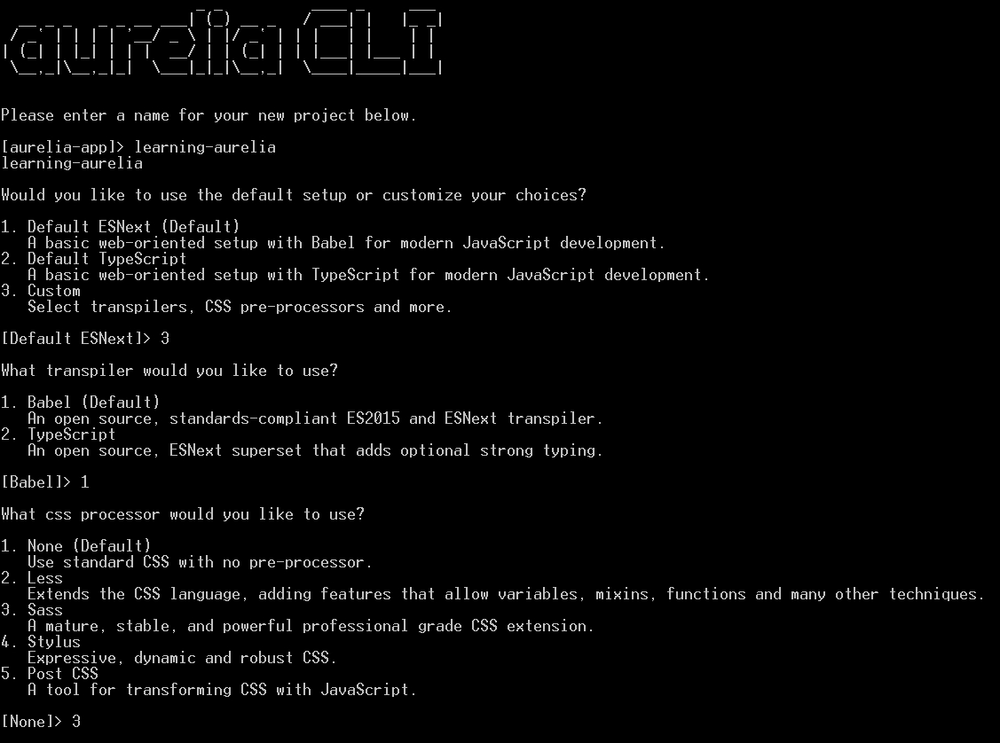

# 第十一章．与其他库集成

UI 框架永远不会独自存在，尤其是 Web 框架。由于 Web 是一个丰富的平台，并且由一个充满活力的社区推动，因此有数千个库、小部件和组件可以在这个平台上无数的场景中 leverage，这大大节省了开发人员的时间。

在本章中，我们将了解如何将各种库集成到我们的联系人管理应用程序中。我们将添加来自 Bootstrap 和 jQuery UI 的 UI 小部件，使用`sortable.js`提供一些拖放支持，以及使用 D3 的图表。我们还将了解如何利用 SASS 而不是 CSS。最后，我们甚至将了解如何集成 Polymer 组件。

# 使用 Bootstrap 小部件

从这本书的开头到现在，我们一直依赖于 Bootstrap 来为我们的应用程序样式和布局。然而，我们还没有使用库的 JS 小部件。让我们看看我们如何可以将此类小部件集成到我们的应用程序中。

## 加载库

由于 Bootstrap 的 JS 小部件使用 jQuery，所以我们首先需要安装它：

```js
> npm install jquery --save

```

接下来，我们需要将 jQuery 和 Bootstrap JS 资源添加到供应商包中：

`aurelia_project/aurelia.json`

```js
{ 
  //Omitted snippet... 
  { 
    "name": "vendor-bundle.js", 
    "prepend": [ 
      "node_modules/bluebird/js/browser/bluebird.core.js", 
      "scripts/require.js" 
    ], 
    "dependencies": [ 
      //Omitted snippet... 
      "jquery", 
      { 
        "name": "bootstrap", 
        "path": "../node_modules/bootstrap/dist", 
        "main": "js/bootstrap.min", 
        "deps": ["jquery"], 
        "exports": "$", 
        "resources": [ 
          "css/bootstrap.min.css" 
        ] 
      }, 
      //Omitted snippet... 
    ] 
    //Omitted snippet... 
  } 
  //Omitted snippet... 
} 

```

在这里，我们在包的依赖项中添加了 jQuery，然后更新了 Bootstrap 的条目，以便在 jQuery 之后加载 JS 小部件。

应用程序中的`bootstrap`模块也配置为导出全局`jQuery`对象。这意味着我们可以在 JS 代码中从`bootstrap`导入`jQuery`对象，并确保 Bootstrap 小部件已经注册到 jQuery 上。

## 创建一个 bs-tooltip 属性

让我们通过一个简单的例子来看看如何使用 Bootstrap JS 小部件与 Aurelia 配合。我们将创建一个自定义属性，它将封装 Bootstrap 的`tooltip`小部件：

`src/resources/attributes/bs-tooltip.js`

```js
import {inject, DOM, dynamicOptions} from 'aurelia-framework'; 
import $ from 'bootstrap'; 

const properties = [ 
  'animation', 'container', 'delay', 'html',  
  'placement', 'title', 'trigger', 'viewport' 
]; 

@dynamicOptions 
@inject(DOM.Element) 
export class BsTooltipCustomAttribute { 

  isAttached = false; 

  constructor(element) { 
    this.element = element; 
  } 

  attached() { 
    const init = {}; 
    for (let property of properties) { 
      init[property] = this[property]; 
    } 
    $(this.element).tooltip(init); 
    this.isAttached = true; 
  } 

  detached() { 
    this.isAttached = false; 
    $(this.element).tooltip('destroy'); 
  } 
} 

```

在这里，我们首先从 Bootstrap 中导入 jQuery 全局对象。这将确保 Bootstrap JS 库已正确加载并注册到 jQuery 命名空间中。我们还声明了`tooltip`小部件支持的属性列表，因此属性可以使用动态选项，并忽略不支持的选项。

我们将使用动态选项而不是显式选项，只是为了少写一些代码。我们接下来会写一些更改处理方法，如果我们使用一个显式的属性列表，在`BsTooltipCustomAttribute`类中全部声明为可绑定的，我们将为每个属性编写一个不同的更改处理器。所有这些更改处理器都会做几乎相同的事情：更新 Bootstrap 小部件的相应选项。相反，由于我们使用动态选项，我们可以为所有选项编写一个单一的更改处理器。

现在我们可以创建一个名为`bs-tooltip`的自定义属性。它作为构造函数参数接收放置它的 DOM 元素。当附加到 DOM 时，它将传递给属性的每个支持属性的值分配给一个`init`对象。然后这个对象被传递到`tooltip`初始化方法，该方法在属性托管的元素上调用。最后一行将创建`tooltip`小部件。

最后，当从 DOM 中分离时，它只是调用`tooltip`小部件的`destroy`方法。

`bs-tooltip`属性的这个第一个版本不支持更新属性。这可以通过使用`propertyChanged`回调方法来更新`tooltip`小部件来实现：

`src/resources/attributes/bs-tooltip.js`

```js
//Omitted snippet... 
export class BsTooltipCustomAttribute { 
  //Omitted snippet... 

  propertyChanged(name) { 
    if (this.isAttached && properties.indexOf(name) >= 0) { 
      $(this.element).data('bs.tooltip').options[name] = this[name]; 
    } 
  } 
} 

```

在这里，当属性值发生变化且属性当前附加到 DOM 时，我们首先确保属性被小部件支持，然后我们简单地更新小部件的属性。

### 使用属性

现在我们可以向任何元素添加 Bootstrap`tooltip`。让我们在`list-editor`组件中将**移除**按钮的`title`属性替换为 Bootstrap`tooltip`：

`src/resources/elements/list-editor.html`

```js
<!-- Omitted snippet... --> 
<button type="button" class="btn btn-danger le-remove-btn"  
        click.delegate="removeItem($index)"  
        bs-tooltip="title.bind: 'resources.actions.remove' & t;  
                    placement: right"> 
    <i class="fa fa-times"></i> 
  </button> 
  <!-- Omitted snippet... --> 

```

在这里，我们只是将**移除**按钮的`t="[title]..."`属性删除，并用`bs-tooltip`属性替换它。在这个属性中，我们定义了一个`title`选项，将其绑定到前面相同的翻译结果。我们使用`.bind`命令和`t`绑定行为，当当前区域发生变化时，将更新工具提示的`title`。我们还指定`tooltip`应该放置在托管元素的`right`侧，使用`placement`选项。

不要忘记加载`bs-tooltip`属性，可以作为`resources`特性中的`configure`函数的全球资源，或者在`list-editor`模板中使用`require`语句来加载。

如果你在这个时候运行应用程序，并用鼠标悬停在一个`list-editor`实例中的**移除**按钮上，应该会出现一个 Bootstrap`tooltip`小部件。

## 创建 bs-datepicker 元素

我们联系人管理应用程序可以极大地受益于的一个小部件是一个日期选择器。这会让大多数用户输入生日变得更加方便。

Bootstrap 本身并不包括日期选择器，但有些作为插件提供。在本节中，我们将安装`bootstrap-datepicker`插件，加载它，并创建一个新的自定义元素，该元素将封装一个包含日期选择器的`input`元素。

### 安装 bootstrap-datepicker 插件

我们首先安装 Bootstrap 插件：

```js
> npm install bootstrap-datepicker --save

```

接下来，我们需要将其添加到供应商包中：

`aurelia_project/aurelia.json`

```js
{ 
  //Omitted snippet... 
  { 
    "name": "vendor-bundle.js", 
    "prepend": [ 
      "node_modules/bluebird/js/browser/bluebird.core.js", 
      "scripts/require.js" 
    ], 
    "dependencies": [ 
      //Omitted snippet... 
      { 
        "name": "bootstrap-datepicker", 
        "path": "../node_modules/bootstrap-datepicker/dist", 
        "main": "js/bootstrap-datepicker.min", 
        "deps": ["jquery"], 
        "resources": [ 
          "css/bootstrap-datepicker3.standalone.css" 
        ] 
      }, 
      //Omitted snippet... 
    ] 
  } 
  //Omitted snippet... 
} 

```

在这里，我们将`bootstrap-datepicker`库添加到供应商包中。与标准的 Bootstrap 小部件一样，这个插件在 jQuery 对象上添加了新的函数，所以它需要有一个对 jQuery 的依赖，这样它才能注册自己。它还作为额外的资源加载自己的样式表。

### 创建自定义元素

现在插件已经准备好使用，我们可以开始构建自定义元素了。我们的`bs-datepicker`元素将暴露一个双向绑定的`date`属性，它将分配选定的日期作为`Date`对象。它还将暴露一个可绑定的`options`属性，我们将用它来提供传递给底层`bootstrap-datepicker`小部件实例的选项。

首先，让我们编写它的模板：

`src/resources/elements/bs-datepicker.html`

```js
<template> 
  <require from="bootstrap-datepicker/css/ 
                 bootstrap-datepicker3.standalone.css"></require> 
  <input ref="input" class="form-control" /> 
</template> 

```

这个模板只需要样式表`bootstrap-datepicker`，然后声明一个`input`元素。这个`input`的引用将被分配给绑定上下文的`input`属性，以便视图模型可以使用它来托管日期选择器。

接下来，让我们编写视图模型类：

`src/resources/elements/bs-datepicker.js`

```js
import {bindable, bindingMode} from 'aurelia-framework'; 
import $ from 'bootstrap'; 
import 'bootstrap-datepicker'; 

export class BsDatepickerCustomElement { 

  static defaultOptions = { autoclose: true, zIndexOffset: 1050 }; 

  @bindable({ defaultBindingMode: bindingMode.twoWay }) date; 
  @bindable options; 

  isAttached = false; 
  isUpdating = false; 

  createDatepicker() { 
    const options = Object.assign({},  
      BsDatepickerCustomElement.defaultOptions,  
      this.options); 
    $(this.input).datepicker(options) 
      .on('clearDate', this.updateDate) 
      .on('changeDate', this.updateDate); 
    if (this.date) { 
      this.updateDatepickerDate(); 
    } 
  } 

  destroyDatepicker() { 
    $(this.input) 
      .datepicker() 
      .off('clearDate', this.updateDate) 
      .off('changeDate', this.updateDate) 
      .datepicker('destroy'); 
  } 

  updateDate = function() { 
    if (!this.isUpdating) { 
      this.date = $(this.input).datepicker('getUTCDate'); 
    } 
  }.bind(this); 

  updateDatepickerDate() { 
    $(this.input).datepicker('setUTCDate', this.date); 
  } 

  optionsChanged() { 
    if (this.isAttached) { 
      this.destroyDatepicker(); 
      this.createDatepicker(); 
    } 
  } 

  dateChanged() { 
    if (this.isAttached) { 
      this.isUpdating = true; 
      this.updateDatepickerDate(); 
      this.isUpdating = false; 
    } 
  } 

  attached() { 
    this.createDatepicker(); 
    this.isAttached = true; 
  } 

  detached() { 
    this.isAttached = false; 
    this.destroyDatepicker(); 
  } 
} 

```

我们首先需要从 Bootstrap 中导入全局 jQuery 对象；记住，我们在将 Bootstrap 库添加到 vendor bundle 中时，它导出了 jQuery 对象，以便我们编写`bs-tooltip`属性。

接下来，我们加载`bootstrap-datepicker`插件，使其正确注册到 jQuery 中，然后创建自定义元素的类。

它首先声明一个静态的`defaultOptions`属性，用于在创建小部件时设置选项的默认值。

当元素附加到 DOM 时，它在`input`上创建一个`datepicker`小部件实例。它还订阅了小部件的`clearDate`和`changeDate`事件，这样当小部件的选定日期发生变化时，它可以更新自己的`date`属性；然后初始化小部件的选定日期。

您可能想知道我们为什么添加这些事件监听器，为什么不直接绑定到`input`的值。那是因为小部件已经处理了`input`值的验证及其作为`Date`对象的解析，所以我们的自定义元素只需依赖于日历的选定日期即可。基本上，我们的自定义元素只是将其`date`可绑定属性与日历的选定日期桥接起来。当小部件的选定日期发生变化时，其中一个事件监听器会被触发，并将小部件的新值分配给元素的`date`属性。同样，由于元素的`date`属性默认使用双向绑定，当`date`属性发生变化时，通常是在模板中使用元素时进行初始化，绑定系统将调用`dateChanged`方法，并更新小部件的选定日期。此外，我们使用一个`isUpdating`属性来防止元素和小部件之间发生无限循环更新。

当元素从 DOM 中分离时，它首先取消订阅小部件的`clearDate`和`changeDate`事件，然后调用其`destroy`方法。

最后，当元素的`options`属性发生变化时，小部件会被销毁然后重新创建。这是因为，在撰写本文时，`bootstrap-datepicker`插件没有提供任何 API 来更新小部件的选项。

### 注意

正如你所看到的，这个元素手动处理了 Aurelia 与 Bootstrap 小部件之间的数据绑定。这里看到的模式，在小部件上注册事件处理程序，以及前后同步数据，都是在 Aurelia 中整合外部 UI 库时相当常见的。

Aurelia 社区中的一群人在这个领域做一些非常有趣的工作。他们开发了一种他们称之为桥梁的东西，允许我们在 Aurelia 应用程序中使用各种 UI 框架。他们已经发布了一个针对 Kendo UI 的桥梁，正在为 Bootstrap 和 Materialize 等开发桥梁。如果你对这个问题感兴趣，我建议你看看他们的工作：[`github.com/aurelia-ui-toolkits`](https://github.com/aurelia-ui-toolkits)。

### 使用元素

现在我们可以轻松地将`form`组件中绑定到联系人生日的`input`替换为我们新的`bs-datepicker`元素：

`src/contacts/components/form.html`

```js
<!-- Omitted snippet... --> 
<div class="form-group"> 
  <label class="col-sm-3 control-label"  
         t="contacts.birthday"></label> 
  <div class="col-sm-9"> 
    <bs-datepicker date.bind="contact.birthday & validate"> 
    </bs-datepicker> 
  </div> 
</div> 
<!-- Omitted snippet... --> 

```

在这里，我们简单地将之前的`input`元素替换为`bs-datepicker`元素。我们将元素的`date`属性绑定到`contact`的`birthday`属性上，用`validate`绑定行为装饰这个绑定，以便属性仍然受到验证。

由于我们新元素的这个`date`属性期待的是一个`Date`对象，而不是一个字符串值，我们需要改变`Contact`模型类，使其在从 JS 对象创建时解析它的`birthday`属性为一个`Date`实例。另外，我们需要将`birthday`的默认值从空字符串改为`null`：

`src/contacts/models/contact.js`

```js
//Omitted snippet... 
export class Contact { 

  static fromObject(src) { 
    const contact = Object.assign(new Contact(), src); 
    if (contact.birthday) { 
      contact.birthday = new Date(contact.birthday); 
    } 
    //Omitted snippet... 
  } 

  //Omitted snippet... 
  birthday = null; 
  //Omitted snippet... 
} 

```

现在，`Contact`实例的`birthday`属性将是`null`值或`Date`对象。

此时，如果你运行应用程序，导航到创建或编辑组件，并将焦点给予生日的`input`，日历选择器应该会出现。你应该能够导航日历并选择一个日期。

不要忘记加载`bs-datepicker`元素，无论是作为`resources`特性中的`configure`函数中的全局资源，还是在`form`模板中使用`require`语句。

## 国际化 bs-datepicker 元素

至此，我们的`bs-datepicker`元素还不支持国际化。在典型的实际应用中，输入中显示的日期的格式，以及日历中的文本和属性，如一周的第一天，应该是本地化的。

幸运的是，`bootstrap-datepicker`包含作为额外 JS 模块的本地化数据。我们只需要在捆绑包中包含我们需要本地化的模块。

### 重新配置 jQuery 和 Bootstrap 的捆绑

然而，在撰写本文时，本地化的模块不支持模块加载机制，而完全依赖于 jQuery 对象处于全局作用域中。因此，我们需要改变使用 jQuery 及 Bootstrap 小部件的方式，不是作为 AMD 模块加载，而是作为全局库加载，利用供应商捆绑包的`prepend`属性：

`aurelia_project/aurelia.json`

```js
//Omitted snippet... 
{ 
  "name": "vendor-bundle.js", 
  "prepend": [ 
    "node_modules/bluebird/js/browser/bluebird.core.js", 
    "node_modules/jquery/dist/jquery.min.js", 
    "node_modules/bootstrap/dist/js/bootstrap.min.js", 
    "node_modules/bootstrap-datepicker/dist/js/bootstrap-datepicker.min.js", 
    "node_modules/bootstrap-datepicker/dist/locales/ 
       bootstrap-datepicker.fr.min.js", 
    "scripts/require.js" 
  ], 
  "dependencies": [ 
    //Omitted snippet... 
  ] 
} 
//Omitted snippet... 

```

在这里，我们向捆绑包的预加载库中添加了 jQuery、Bootstrap 小部件、`bootstrap-datepicker`插件及其法语本地化模块（英语本地化数据已内置在插件本身中，因此我们不需要包含它）。这意味着那些库将简单地合并到捆绑包的开头，而不是作为 AMD 模块加载，而是使用全局`window`作用域。当然，这意味着必须从`dependencies`数组中删除 jQuery、Bootstrap 和日期选择器插件的条目。

由于预加载的库只能是 JS 文件，这也意味着我们必须改变加载 Bootstrap 样式表的方式：

`index.html`

```js
<!-- Omitted snippet... --> 
<head> 
    <title>Learning Aurelia</title> 
    <link href="node_modules/bootstrap/dist/css/bootstrap.min.css"  
          rel="stylesheet"> 
    <link href="node_modules/bootstrap-datepicker/dist/css/ 
                bootstrap-datepicker3.standalone.css"  
          rel="stylesheet"> 
  <!-- Omitted snippet... --> 
<head> 
<!-- Omitted snippet... --> 

```

当然，必须分别从`src/app.html`和`src/resources/elements/bs-datepicker.html`模板中删除对`bootstrap.css`和`bootstrap-datepicker3.standalone.css`的`require`声明。

最后，必须从`bs-tooltip.js`和`bs-datepicker.js`文件中删除对`bootstrap`和`bootstrap-datepicker`的`import`声明，因为 jQuery、Bootstrap 和日期选择器插件将从全局作用域访问。

### 更新元素

要本地化日期选择器小部件，我们只需设置`language`选项：

`src/contacts/components/form.html`

```js
<!-- Omitted snippet... --> 
<bs-datepicker date.bind="contact.birthday & validate" 
               options.bind="{ language: locale }"> 
</bs-datepicker> 
<!-- Omitted snippet... --> 

```

这意味着我们需要将这个`locale`属性添加到`form`的视图模型中。我们还需要订阅适当的事件，这样我们可以在当前语言环境发生变化时更新属性：

`src/contacts/components/form.js`

```js
//Omitted snippet... 
import {I18N} from 'aurelia-i18n'; 
import {EventAggregator} from 'aurelia-event-aggregator'; 

@inject(DOM.Element, Animator, I18N, EventAggregator) 
export class ContactForm { 

@bindable contact; 

constructor(element, animator, i18n, eventAggregator) { 
    this.element = element; 
    this.animator = animator; 
    this.i18n = i18n; 
    this.eventAggregator = eventAggregator; 
  } 

  bind() { 
    this.locale = this.i18n.getLocale(); 
    this._localeChangedSubscription = this.eventAggregator 
      .subscribe('i18n:locale:changed', () => { 
        this.locale = this.i18n.getLocale(); 
      }); 
  } 

  unbind() { 
    this._localeChangedSubscription.dispose(); 
    this._localeChangedSubscription = null; 
  } 

  //Omitted snippet... 
} 

```

在这里，我们首先从`aurelia-i18n`库导入`I18N`类和从`aurelia-event-aggregator`库导入`EventAggregator`类。然后我们向 DIC 暗示它们应该都被注入到视图模型的构造函数中。

当组件进行数据绑定时，我们使用`I18N`实例的`getLocale`方法初始化`locale`属性，并订阅`i18n:locale:changed`事件，这样我们就可以保持`locale`属性的最新。

最后，当组件解绑时，我们取消事件订阅。

在此阶段，如果您运行应用程序并在切换当前语言环境（在法语和英语之间）的同时尝试生日日期选择器，`input`中显示的日期格式以及日历的文本和设置应该相应地更新。

# 使用 jQuery UI 小部件

jQuery UI 小部件库仍然相当受欢迎。将那些小部件集成到 Aurelia 应用程序中与刚刚与 Bootstrap 小部件进行的操作相当相似，尽管不如 Bootstrap 小部件那样无痛，正如我们将在下一节中看到的那样。

让我们使用 jQuery UI 创建一个`tooltip`属性，以便我们可以与 Bootstrap 的属性进行比较。

### 注意

以下代码段是从书籍资源中的`chapter-11/samples/using-jqueryui`示例中摘录的。

## 安装库

我们首先需要通过在项目目录中打开控制台并运行以下命令来安装 jQuery 和 jQuery UI：

```js
> npm install jquery --save
> npm install github:components/jqueryui#1.12.1 --save

```

接下来，我们需要将这些库添加到供应商包中。最简单的方法是将它们放入`prepend`部分：

`aurelia_project/aurelia.json`

```js
//Omitted snippet... 
{ 
  "name": "vendor-bundle.js", 
  "prepend": [ 
    "node_modules/bluebird/js/browser/bluebird.core.js", 
    "node_modules/jquery/dist/jquery.min.js", 
    "node_modules/components-jqueryui/jquery-ui.min.js", 
    "scripts/require.js" 
  ], 
  "dependencies": [ 
    //Omitted snippet... 
  ] 
} 
//Omitted snippet... 

```

由于 CSS 文件不能全局加载到`prepend`部分，所以让我们将它们加载到`index.html`文件中：

`index.html`

```js
<!-- Omitted snippet... --> 
<head> 
<title>Aurelia</title> 
  <link href="node_modules/bootstrap/dist/css/bootstrap.min.css"  
        rel="stylesheet"> 
  <link href="node_modules/components-jqueryui/themes/base/all.css"  
        rel="stylesheet"> 
  <!-- Omitted snippet... --> 
</head> 
<!-- Omitted snippet... --> 

```

此时，我们现在可以创建我们的属性。

## 创建一个 jq-tooltip 属性

一开始，我们的新属性将与使用 Bootstrap 的那个非常相似：

`src/resources/attributes/jq-tooltip.js`

```js
import {inject, DOM, dynamicOptions} from 'aurelia-framework'; 

const properties = [ 
  'classes', 'content', 'disabled', 'hide', 'position', 
  'show', 'track',  
]; 

@dynamicOptions 
@inject(DOM.Element) 
export class JqTooltipCustomAttribute { 

  isAttached = false; 

  constructor(element) { 
    this.element = element; 
  } 

  attached() { 
    const options = {}; 
    for (let property of properties) { 
      options[property] = this[property]; 
    } 
    $(this.element).tooltip(options); 
    this.isAttached = true; 
  }   

  detached() { 
    this.isAttached = false; 
    $(this.element).tooltip('destroy'); 
  } 
} 

```

我们首先定义了`jq-tooltip`组件支持的`options`，这样属性就可以使用动态选项并忽略那些在此不支持的属性；`jq-tooltip`属性表现得与我们在上一节创建的`bs-tooltip`属性一模一样。接下来，我们提示 DI 容器，应该将包含属性的 DOM 元素注入到构造函数中。

当属性附加到 DOM 时，它检索绑定到属性实例的每个支持属性的值，以构建一个`options`对象。然后将这个对象传递给`tooltip`初始化方法，该方法应用于包含属性的元素。

当属性从 DOM 中移除时，在包含属性的元素上调用了小部件的`destroy`方法。

此时，属性不支持属性更改。由于 jQuery 的`tooltip`小部件提供了一个 API 来更新选项，这个实现不需要销毁并重新创建小部件来更新属性，就像`bs-tooltip`属性一样：

`src/resources/attributes/jq-tooltip.js`

```js
//Omitted snippet... 
propertyChanged(name) { 
  if (this.isAttached && properties.indexOf(name) >= 0) { 
    $(this.element).tooltip('option', name, this[name]); 
  } 
} 
//Omitted snippet... 

```

在这里，我们简单地添加了`propertyChanged`回调方法，如果属性附加到 DOM 并且更新后的属性被小部件支持，它将更新小部件实例。

现在我们的属性已经准备好了，让我们在`list-editor`组件中将**移除**按钮的`title`属性替换为`jq-tooltip`自定义属性：

`src/resources/elements/list-editor.html`

```js
<!-- Omitted snippet.. --> 
<button type="button" class="btn btn-danger le-remove-btn"  
        click.delegate="removeItem($index)" 
        jq-tooltip="content.bind: 'resources.actions.remove' & t"> 
  <i class="fa fa-times"></i> 
</button> 
<!-- Omitted snippet.. --> 

```

在这里，我们只是在正确的`button`元素上放置了一个`jq-tooltip`属性。我们将它的`content`属性绑定到正确的翻译，这被`t`绑定行为修饰。

不要忘记加载`jq-tooltip`属性，要么作为`resources`特性中的`configure`函数中的全局资源，要么在`list-editor`模板中使用`require`语句加载。

然而，如果你运行应用程序，并将鼠标悬停在`list-editor`元素的**移除**按钮上，你会发现`tooltip`没有显示。

这是由一个众所周知的长久限制造成的；社区中的一些人会说这是一个 bug（我会同意）在`tooltip`小部件中，它强制宿主元素具有一个`title`属性，即使它没有被使用。

因此，让我们更新属性并添加一个方法，如果宿主元素上不存在`title`属性，则创建一个空的`title`属性：

`src/resources/attributes/jq-tooltip.js`

```js
//Omitted snippet... 
attached() { 
  if (!this.element.hasAttribute('title')) { 
    this.element.setAttribute('title', ''); 
  } 
  //Omitted snippet... 
} 
//Omitted snippet... 

```

现在你可以运行应用程序，`tooltip`应该正确显示。

# 使用 SASS 而不是 CSS

**SASS**，代表 Syntactically Awesome Stylesheets，根据他们的网站，是世界上最为成熟、稳定、强大的专业级 CSS 扩展语言。无论这一说法是否真实，它都是非常受欢迎的，至少我可以肯定地说我使用得很多。

在 Aurelia 应用中使用 SASS 而不是 CSS 相当简单，至少对于基于 CLI 的项目来说是这样。CLI 已经提供了许多 CSS 处理器的支持，比如 SASS、LESS 和 Stylus。

让我们使用 CLI 重新创建我们的联系人管理应用，并在创建过程中启用 SASS 处理器：



你可以为所有其他问题选择默认值。

一旦项目创建完成并且已经获取了依赖项，我们就可以把我们应用的工作副本中的以下目录和文件移动到新创建的项目中：

+   `aurelia_project/environments`

+   `locales`

+   `src`

+   `index.html`

我们还需要从`package.json`文件中复制`dependencies`，并运行另一个`npm install`以获取所有的应用依赖。最后，我们需要复制`aurelia_project/aurelia.json`文件中的 vendor-bundle 配置。

你可以参考书籍资源中的`chapter-11/samples/using-sass`示例。

## 用 SASS 替换 CSS

让我们通过将`.css`扩展名替换为`.scss`扩展名，将应用中的 CSS 文件转换为 SASS 文件：

`src/resources/elements/list-editor.scss`

```js
list-editor .animated .le-item { 
  &.au-enter-active { 
    animation: blindDown 0.2s; 
    overflow: hidden; 
  } 

  &.au-leave-active { 
    animation: blindUp 0.2s; 
    overflow: hidden; 
  } 
} 

@keyframes blindDown { 
  0% { max-height: 0px; } 
  100% { max-height: 80px; } 
} 

@keyframes blindUp { 
  0% { max-height: 80px; } 
  100% { max-height: 0px; } 
} 

```

由于 CLI 创建的构建任务现在包括一个 SASS 处理器，`src`目录中的每个`.scss`文件都将被转换成具有相同路径的`.css`文件，并且会包含在`app-bundle`中该路径下。

例如，`resources/elements/list-editor.scss`文件将被转换成 CSS，结果将被打包成`app-bundle`中的`resources/elements/list-editor.css`。

这意味着`require`语句必须保持使用`.css`扩展名引用样式表：

`src/resources/elements/list-editor.html`

```js
<template> 
  <require from="./list-editor.css"></require> 
  <!-- Omitted snippet... --> 
</template> 

```

如果你在这个时候运行应用程序，一切应该都会像以前一样进行样式设计。

# 拖放与可排序

可排序（Sortable）（[`github.com/RubaXa/Sortable`](https://github.com/RubaXa/Sortable)）是一个知名的拖放库。其简单而强大的 API 使得集成变得非常容易。

我们可以在我们的联系人管理应用中使用它，允许用户使用拖放来重新排序`list-editor`元素的项。

## 安装库

首先，我们需要通过在项目目录中打开控制台并运行以下命令来安装库：

```js
> npm install sortablejs --save

```

接下来，我们需要将其添加到 vendor bundle 中：

`aurelia_project/aurelia.json`

```js
//Omitted snippet... 
{ 
  "name": "vendor-bundle.js", 
  "prepend": [ 
    //Omitted snippet... 
  ], 
  "dependencies": [ 
    "sortablejs", 
    //Omitted snippet... 
  ] 
}, 
//Omitted snippet... 

```

此时，我们可以在我们的应用中使用这个库。

## 给 list-editor 添加拖放

让我们首先给列表项添加一个处理程序。这个处理程序将是用户能够拖动项目上下列表的区域。此外，我们还需要添加一个`div`元素，它将作为可排序项目的容器：

`src/resources/elements/list-editor.html`

```js
<!-- Omitted snippet... --> 
<div ref="container"> 
  <div class="form-group le-item ${animated ? 'au-animate' : ''}"  
       repeat.for="item of items"> 
    <template with.bind="item"> 
      <div class="col-sm-1"> 
        <i class="fa fa-bars fa-2x sort-handle pull-right"></i> 
      </div> 
      <template replaceable part="item"> 
        <div class="col-sm-2"> 
          <template replaceable part="label"></template> 
        </div> 
        <!-- Omitted snippet... --> 
      </template> 
      <!-- Omitted snippet... --> 
    </template> 
  </div> 
</div> 
<!-- Omitted snippet... --> 

```

这里，我们首先在包含列表项的`div`元素上为视图模型的`container`属性分配一个引用。这个`container`将由`sortable` API 用来启用其子元素的拖放。接下来，我们移除了标签列上的`col-sm-offset-1` CSS 类，并添加了一个大小为 1 的列，使用 Bootstrap 的`col-sm-1` CSS 类包含一个`bars` Font Awesome 图标并作为`sort-handle`，使用相同名称的 CSS 类。

让我们也添加一个 CSS 规则来改变拖动处理器的鼠标光标：

`src/resources/elements/list-editor.css`

```js
/* Omitted snippet... */ 
list-editor .sort-handle { 
 cursor: move; 
} 

```

我们现在可以使用`sortable`来添加拖放支持：

`src/resources/elements/list-editor.js`

```js
//Omitted snippet... 
import sortable from 'sortablejs'; 

export class ListEditor { 
  //Omitted snippet... 
 moveItem(oldIndex, newIndex) { 
    const item = this.items[oldIndex]; 
    this.items.splice(oldIndex, 1); 
    this.items.splice(newIndex, 0, item); 
  } 

 attached() { 
    this.sortable = sortable.create(this.container, { 
      sort: true, 
      draggable: '.le-item', 
      handle: '.sort-handle',  
      animation: 150, 
      onUpdate: (e) => { 
        if (e.newIndex != e.oldIndex) { 
          this.animated = false; 
          this.moveItem(e.oldIndex, e.newIndex);  
          setTimeout(() => { this.animated = true; }); 
        } 
      } 
    }); 
    setTimeout(() => { this.animated = true; }); 
  } 

 detached() { 
    this.sortable.destroy(); 
    this.sortable = null; 
  } 
  //Omitted snippet... 
} 

```

这里，我们首先导入了`sortable` API。然后，当元素附着到 DOM 上时，我们在具有`le-item` CSS 类的`container`元素上创建一个`sortable`实例。我们指定`sortable`应该使用具有`sort-handle` CSS 类的项目的子元素作为拖动处理程序。最后，当一个项目在列表的不同位置被放下时，触发`onUpdate`回调，在其中我们从`items`数组中删除被放下项目的前一个位置，然后将其放回新的位置。

我们需要使用`splice`来删除然后添加移动的项目，因为 Aurelia 无法观察数组的索引设置器。它只能通过覆盖`Array.prototype`的方法来反应数组的变化，比如`splice`。

此外，在移动项目之前，我们还需要删除项目上的`animated` CSS 类，这样就不会触发动画的 CSS 规则。我们然后使用`setTimeout`将其加回来，这样只有在模板引擎完成移除旧视图并添加新视图后，它才会被添加。这样，在拖动和放下项目时，不会播放添加或删除项目的动画，这看起来会很奇怪。

最后，当`list-editor`从 DOM 中分离时，我们在`sortable`实例上调用`destroy`方法，以防止内存泄漏。

到此为止，您可以运行应用程序，为联系人列表属性中的一个项目重新排序，并保存表单。在详细视图中，项目应该按照您放置的顺序出现。

# 使用 D3 绘制图表

以图形的形式呈现数据是现代应用程序中另一个常见的需要。当涉及到 Web 时，**D3.js**是一个众所周知的光库，它提供了一个非常强大的 API，用于在 DOM 中显示数据。

在下一节中，我们将向我们的联系人管理应用程序添加一个树视图，该视图将按地址部分显示联系人分组。取所有联系人的所有地址，节点的第一个层次将是国家，然后每个国家将有自己的州作为子节点，然后是每个城市，依此类推。

### 注意

本节我们将要构建的树视图只是用 D3 能够实现功能的一个简单、拙劣的示例。访问[`d3js.org/`](https://d3js.org/)，浏览数百个示例，亲自体验这个库的强大功能。

## 安装库

首先，通过在项目目录中打开控制台并运行以下命令来安装库：

```js
> npm install d3 --save

```

像往常一样，我们需要将其添加到供应商包中：

`aurelia_project/aurelia.json`

```js
//Omitted snippet... 
{ 
  "name": "vendor-bundle.js", 
  "prepend": [ 
    //Omitted snippet... 
  ], 
  "dependencies": [ 
    { 
      "name": "d3", 
      "path": "../node_modules/d3/build", 
      "main": "d3.min" 
    }, 
    //Omitted snippet... 
  ] 
} 
//Omitted snippet... 

```

至此，D3 已准备好使用。

## 准备应用程序

在创建树本身之前，让我们先为它周围的应用程序做好准备。我们将添加一个`route`组件，使用网关加载联系人，在其中显示树。我们还将为这个组件在联系人`main`中添加一个`route`，然后添加允许在列表和树之间导航的链接。

我们先从`route`开始：

`src/contacts/main.js`

```js
//Omitted snippet... 
config.map([ 
  { route: '', name: 'contacts', moduleId: './components/list',  
    title: 'contacts.contacts' }, 
  { route: 'by-address', name: 'contacts-by-address',  
    moduleId: './components/by-address',  
    title: 'contacts.byAddress' }, 
  { route: 'new', name: 'contact-creation',  
    moduleId: './components/creation',  
    title: 'contacts.newContact' }, 
  { route: ':id', name: 'contact-details',  
    moduleId: './components/details' }, 
  { route: ':id/edit', name: 'contact-edition',  
    moduleId: './components/edition' }, 
  { route: ':id/photo', name: 'contact-photo',  
    moduleId: './components/photo' }, 
]); 
//Omitted snippet... 

```

这里，我们简单地添加了一个名为`contacts-by-address`的`route`，匹配`by-address`路径，并指向我们将在一分钟内创建的`by-address`组件。

接下来，让我们在列表组件中添加一个链接，该链接指向尚不存在的树组件：

`src/contacts/components/list.html`

```js
<template> 
  <section class="container au-animate"> 
    <h1 t="contacts.contacts"></h1> 
    <p> 
      <a route-href="route: contacts-by-address"  
         t="contacts.viewByAddress"></a> 
    </p> 
    <!-- Omitted snippet... --> 
  </section> 
</template> 

```

### 注意

你可能注意到新`route`的`title`属性和新链接的文本都使用了新的翻译，增加的内容留给读者作为练习。像往常一样，本章节的示例应用程序可以作为参考。

最后，我们将创建`by-address`组件。为了使事情尽可能解耦，我们将 D3 相关代码隔离在一个名为`contact-address-tree`的自定义元素中。`by-address`组件的唯一责任将是将这个自定义元素与应用程序的其他部分连接起来。

让我们先从视图模型开始：

`src/contacts/components/by-address.js`

```js
import {inject} from 'aurelia-framework'; 
import {Router} from 'aurelia-router'; 
import {ContactGateway} from '../services/gateway'; 

@inject(ContactGateway, Router) 
export class ContactsByAddress { 

  contacts = []; 

  constructor(contactGateway, router) { 
    this.contactGateway = contactGateway; 
    this.router = router; 
  } 

  activate() { 
    return this.contactGateway.getAll().then(contacts => { 
      this.contacts.splice(0); 
      this.contacts.push.apply(this.contacts, contacts);  
    }); 
  } 

  navigateToDetails(contact) { 
    this.router 
      .navigateToRoute('contact-details', { id: contact.id }); 
  } 
} 

```

这个视图模型相当直接。当激活时，它使用注入的网关检索联系人的完整列表。它还暴露了一个触发导航到给定联系人的详细信息组件的方法。当在树中点击一个联系节点时，将调用这个方法。

模板相当简单，正如您所想象的：

`src/contacts/components/by-address.html`

```js
<template>  
  <require from="./by-address.css"></require> 
  <require from="../elements/address-tree"></require> 

  <section class="container au-animate"> 
    <h1 t="contacts.byAddress"></h1> 

    <p> 
      <a route-href="route: contacts" t="contacts.viewByName"></a> 
    </p> 

    <contact-address-tree contacts.bind="contacts"  
                          click.call="navigateToDetails(contact)"> 
    </contact-address-tree> 
  </section> 
</template> 

```

这个模板简单地声明了一个`contact-address-tree`元素，绑定加载的`contacts`，并在点击联系节点时调用`navigateToDetails`。

CSS 文件简单地设置了`contact-address-tree`元素的大小：

`src/contacts/components/by-address.css`

```js
contact-address-tree { 
  display: block; 
  width: 100%; 
  min-height: 400px; 
} 

```

## 创建`contact-address-tree`自定义元素

一切准备就绪，我们可以使用我们新的元素了，现在让我们创建它。

### 注意

由于我们正在添加更多专门针对联系人的自定义元素，我建议我们在`contacts`特性中创建一个新的`elements`目录，将联系人`form`移动到那里，并在其中创建这些新元素。本章完成的应用程序示例可以作为参考。

我们首先通过一些 CSS 规则来布局，这些规则将样式化树的各个部分，如分支节点、叶节点和链接：

`src/contacts/elements/address-tree.css`

```js
contact-address-tree .node circle { 
  fill: #d9edf7; 
  stroke: #337ab7; 
  stroke-width: 1.5px; 
} 

contact-address-tree .node text { 
  font: 15px; 
} 

contact-address-tree .node text { 
  text-shadow: 0 1px 0 #fff, 0 -1px 0 #fff, 1px 0 0 #fff, -1px 0 0 #fff; 
} 

contact-address-tree .leaf { 
  cursor: pointer; 
} 

contact-address-tree .leaf circle { 
  fill: #337ab7; 
} 

contact-address-tree .leaf text { 
  font-weight: bold; 
} 

contact-address-tree .link { 
  fill: none; 
  stroke: #777; 
  stroke-width: 1.5px; 
} 

```

由于树视图的渲染将由 D3 API 处理，自定义元素不需要模板。因此，它将被声明为带有`noView`装饰器，传递 CSS 文件的路径给它，以便作为资源加载：

`src/contacts/elements/address-tree.js`

```js
import {inject, DOM, noView, bindable} from 'aurelia-framework'; 
import * as d3 from 'd3'; 

@inject(DOM.Element) 
@noView(['./address-tree.css']) 
export class ContactAddressTreeCustomElement {      

  @bindable contacts; 
  @bindable click; 

  constructor(element) { 
    this.element = element; 
  } 
} 

```

此外，视图模型的构造函数将被注入到 DOM 元素本身，因此 D3 API 可以用它作为视口来渲染树。它还暴露了一个`contacts`和一个`click`可绑定属性。

这是 Aurelia 部分的内容。现在，我们添加一个`attached`方法，它将在元素内部渲染树。这个方法里面的代码将完全不知道 Aurelia，只是简单地与`d3` API 和 DOM `element`本身一起工作：

`src/contacts/elements/address-tree.js`

```js
//Omitted snippet... 
export class ContactAddressTreeCustomElement { 
  //Omitted snippet... 

 attached() { 
    // Calculate the size of the viewport 
    const margin = { top: 20, right: 200, bottom: 20, left: 12 }; 
    const height = this.element.clientHeight  
      - margin.top - margin.bottom; 
    const width = this.element.clientWidth  
      - margin.right - margin.left; 

    // Create the host elements and the tree factory 
    const tree = d3.tree().size([height, width]); 
    const svg = d3.select(this.element).append('svg') 
        .attr('width', width + margin.right + margin.left) 
        .attr('height', height + margin.top + margin.bottom); 
    const g = svg.append('g') 
        .attr('transform',  
              `translate(${margin.left}, ${margin.top})`); 

    // Create the hierarchy, then initialize the tree from it 
    const rootNode = this.createAddressTree(this.contacts); 
    const hierarchy = d3.hierarchy(rootNode); 
    tree(hierarchy); 

    // Render the nodes and links 
    const link = g.selectAll('.link') 
      .data(hierarchy.descendants().slice(1)) 
      .enter().append('path') 
      .attr('class', 'link') 
      .attr('d', d => `M${d.y},${d.x}C${(d.y + d.parent.y) / 2}, 
                       ${d.x} ${(d.y + d.parent.y) / 2}, 
                       ${d.parent.x} ${d.parent.y}, 
                       ${d.parent.x}`); 

    const node = g.selectAll('.node') 
      .data(hierarchy.descendants()) 
      .enter().append('g') 
      .attr('class', d => 'node ' + (d.children ? 'branch' : 'leaf')) 
      .attr('transform', d => `translate(${d.y}, ${d.x})`) 
      .on('click', e => { this.onNodeClicked(e); }); 

    node.append('title') 
      .text(d => d.data.name); 

    node.append('circle') 
      .attr('r', 10); 

    node.append('text') 
      .attr('dy', 5) 
      .attr('x', d => d.children ? -15 : 15) 
      .style('text-anchor', d => d.children ? 'end' : 'start') 
      .text(d => d.data.name); 
  } 
} 

```

### 注意

这段代码是 Mike Bostock 示例的简化改编，可以在[`bl.ocks.org/mbostock/4339083`](https://bl.ocks.org/mbostock/4339083)找到。

详细解释`d3` API 如何工作超出了本书的范围。然而，前一个代码片段中的内联注释可以让你对它如何工作有一个大致的了解。

你可能注意到了一些缺失的部分：`createAddressTree`和`onNodeClicked`方法还没有存在。

后者相当简单：

`src/contacts/elements/address-tree.js`

```js
//Omitted snippet... 
export class ContactAddressTreeCustomElement { 
  //Omitted snippet... 

 onNodeClicked(node) { 
    if (node.data.contact && this.click) { 
      this.click({ contact: node.data.contact }); 
    } 
  } 
} 

```

这个方法只是确保被点击的节点是联系人节点，并且`click`属性已经被正确绑定，然后用被点击的`contact`对象调用它。这将执行用`.call`命令绑定到`click`属性的表达式，把它作为`contact`参数传递给属性。

前者要稍微复杂一点。它的任务是将联系人列表转换为树数据结构，这将作为`d3` API 的数据源：

`src/contacts/elements/address-tree.js`

```js
//Omitted snippet... 
export class ContactAddressTreeCustomElement { 
  //Omitted snippet... 

 createAddressTree(contacts) { 
    const rootNode = { name: '', children: [] }; 
    for (let contact of contacts) { 
      for (let address of contact.addresses) { 
        const path = this.getOrCreateAddressPath( 
          rootNode, address); 
        const pathTail = path[path.length - 1]; 
        pathTail.children.push({ 
          name: contact.fullName,  
          contact 
        }); 
      } 
    } 
    return rootNode; 
  } 

  getOrCreateAddressPath(rootNode, address) { 
    const countryNode = this.getOrCreateNode( 
      rootNode, address.country); 
    const stateNode = this.getOrCreateNode( 
      countryNode, address.state); 
    const cityNode = this.getOrCreateNode( 
      stateNode, address.city); 
    const streetNode = this.getOrCreateNode( 
      cityNode, address.street); 
    const numberNode = this.getOrCreateNode( 
      streetNode, address.number); 
    return [countryNode, stateNode, cityNode,  
      streetNode, numberNode]; 
  } 

  getOrCreateNode(parentNode, name) { 
    name = name || '?'; 

    const normalizedName = this.normalizeNodeName(name); 
    let node = parentNode.children 
      .find(n => n.normalizedName === normalizedName); 
    if (!node) { 
      node = { name, normalizedName, children: [] }; 
      parentNode.children.push(node); 
    } 
    return node; 
  } 

  normalizeNodeName(name) { 
    return name.toLowerCase().trim().replace(/\s+/, ' '); 
  } 
} 

```

在这里，`createAddressTree`方法首先创建一个带有空`children`列表的根节点。然后，它遍历每个联系人的`addresses`，为每个地址创建一个节点路径，从国家开始，一直深入到街道号码。整个路径或其中一部分如果已经存在，就不会再次创建节点，而是简单地检索。最后，一个代表联系人的叶节点被附加到路径中的最后一个节点，即街道号码节点。

在此阶段，如果你运行应用程序并前往地址树视图，你应该能看到联系人显示出来，以树状布局。

# 使用 Polymer 组件

**Polymer**是一个流行的库，严重倾向于 web 组件。它的社区提供了各种各样的组件，其中包括一个`google-map`元素，它封装了 Google Maps API，以便在 HTML 中声明性地显示地图。

Aurelia 提供了一个名为`aurelia-polymer`的集成库，它允许在 Aurelia 应用程序中使用 Polymer 组件。在下一节中，我们将将其集成到我们的联系人管理应用程序中。在详细信息组件中，我们将显示一个显示联系人地址的小地图。

## 安装库

Polymer 及其库通常使用**Bower**进行安装。Bower 和 NPM 可以毫无问题地并行使用，因此让我们首先安装它，如果你还没有在开发环境中安装它，那么通过打开一个控制台并运行以下命令：

```js
> npm install -g bower

```

Bower 是另一个用于网络库的包管理器，可以在[`bower.io/`](https://bower.io/)找到。

完成这些之后，让我们创建 Bower 的项目文件：

`bower.json`

```js
{ 
  "name": "learning-aurelia", 
  "private": true, 
  "dependencies": { 
    "polymer": "Polymer/polymer#¹.2.0", 
    "google-map": "GoogleWebComponents/google-map#¹.1.13", 
    "webcomponentsjs": "webcomponents/webcomponentsjs#⁰.7.20" 
  } 
} 

```

这个文件与`package.json`非常相似。它描述了由 Bower 管理的项目的依赖关系。在这里，我们包括了 Polymer 和 Google Maps 组件。

我们还包含了`webcomponentjs`，这是各种 web 组件 API 的 polyfill，例如自定义元素 API 和 HTML Imports API。由于这两个 API 是 Polymer 所必需的，如果目标浏览器不支持这些 API，则需要这个 polyfill。

### 注意

你可以在这里检查你最喜欢的浏览器是否支持所需的 API：[`caniuse.com/#feat=custom-elementsv1`](http://caniuse.com/#feat=custom-elementsv1)和[`caniuse.com/#feat=imports`](http://caniuse.com/#feat=imports)。

就像 NPM 一样，项目文件中列出的包必须被安装。因此，在项目目录中打开一个控制台并运行以下命令：

```js
> bower install

```

完成这些之后，我们需要安装的最后一样东西是 Polymer 和 Aurelia 之间的桥梁，通过在项目目录中打开一个控制台并运行以下命令来完成：

```js
> npm install aurelia-polymer --save

```

## 配置应用程序

现在一切都安装好了，我们需要配置我们的应用程序，使其可以加载 Polymer 组件。

首先，我们需要将`aurelia-polymer`库添加到供应商捆绑包中：

`aurelia_project/aurelia.json`

```js
//Omitted snippet... 
{ 
  "name": "vendor-bundle.js", 
  "prepend": [ 
    //Omitted snippet... 
  ], 
  "dependencies": [ 
    { 
      "name": "aurelia-polymer", 
      "path": "../node_modules/aurelia-polymer/dist/amd", 
      "main": "index" 
    }, 
    //Omitted snippet... 
  ] 
} 
//Omitted snippet... 

```

当然，由于这个库是一个 Aurelia 插件，我们需要将其加载到我们应用程序的主要`configure`函数中：

`src/main.js`

```js
//Omitted snippet... 
export function configure(aurelia) { 
  aurelia.use 
    .standardConfiguration() 
    .plugin('aurelia-polymer')  
    .plugin('aurelia-animator-css') 
  //Omitted snippet... 
} 

```

如前所述，Polymer 依赖于 HTML Imports。在撰写本文时，基于 CLI 的 Aurelia 应用程序不支持使用 HTML Imports 加载视图。因此，我们将无法在需要它们的模板中加载组件。我们别无选择，只能将它们加载到`index.html`文件中：

`index.html`

```js
<!-- Omitted snippet... --> 
<head> 
  <!-- Omitted snippet... --> 
  <script src="bower_components/webcomponentsjs/ 
               webcomponents-lite.js"></script> 
  <link rel="import" href="bower_components/polymer/polymer.html"> 
  <link rel="import"  
        href="bower_components/google-map/google-map.html"> 
</head> 
<!-- Omitted snippet... --> 

```

在这里，我们首先加载 Web Components API polyfill。如果不需要 polyfill，可以删除这一行。接下来，我们导入 Polymer 和`google-map`组件。

在一个准备生产的应用程序中，分别导入 Polymer 和每个组件是不理想的。强烈建议将组件进行融合，生成一个单一的包，在`index.html`文件中加载： [`github.com/Polymer/vulcanize`](https://github.com/Polymer/vulcanize)。

至此，与 Polymer 的集成已经运行起来。`google-map`元素已经可以使用。

## 显示 Google 地图

让我们先确保一切都能正常工作，通过创建一个自定义元素来显示一个带有单个地址标记的地图：

`src/contacts/elements/address-map.html`

```js
<template> 
  <button class="btn btn-default"  
          click.delegate="isMapVisible = !isMapVisible"> 
    ${isMapVisible ? 'contacts.hideMap' : 'contacts.showMap' & t} 
  </button> 
  <google-map if.bind="isMapVisible"  
              style="display: block; height: 400px;"  
              api-key="your_key"> 
  </google-map> 
</template> 

```

### 注意

`google-map` Polymer 组件在幕后加载了 Google Maps API。为了使其正确加载，你需要一个 Google Maps API 密钥。你可以通过遵循在 [`developers.google.com/maps/documentation/javascript/get-api-key#key`](https://developers.google.com/maps/documentation/javascript/get-api-key#key) 找到的说明来创建一个。

在这里，我们首先添加一个切换`isMapVisible`属性的按钮。接下来，我们添加一个`google-map` Polymer 元素。其`api-key`属性应该设置为你的 Google Maps API 密钥。

至于视图模型，现在几乎为空：

`src/contacts/elements/address-map.js`

```js
export class AddressMapCustomElement {  
  isMapVisible = false; 
} 

```

最后，我们需要将这个`address-map`元素添加到联系人的`details`组件中：

`src/contacts/components/details.html`

```js
<!-- Omitted snippet... --> 
<div class="form-group" repeat.for="address of contact.addresses"> 
  <label class="col-sm-2 control-label"> 
    ${'contacts.types.' + address.type & t} 
  </label> 
  <div class="col-sm-10"> 
    <p class="form-control-static"> 
      ${address.number} ${address.street}</p> 
    <p class="form-control-static"> 
      ${address.postalCode} ${address.city}</p> 
    <p class="form-control-static"> 
      ${address.state} ${address.country}</p> 
    <address-map address.bind="address"></address-map> 
  </div> 
</div> 
<!-- Omitted snippet... --> 

```

在这个阶段，如果你运行应用程序并导航到一个联系人的详情，你应该看到每个地址下都有一个按钮。如果你点击它，应该会弹出一个地图。

## 地址编码

为了在地图上显示地址作为标记，我们需要获取该地址的地理坐标。因此，我们将创建一个名为`Geocoder`的新服务，它将使用基于`OpenStreetMap`数据的搜索服务**Nominatim**（[`www.openstreetmap.org/`](http://www.openstreetmap.org/)），以找到给定地址的纬度和经度：

`src/contacts/services/geocoder.js`

```js
import {HttpClient} from 'aurelia-fetch-client'; 

export class Geocoder { 

  http = new HttpClient().configure(config => { 
    config 
      .useStandardConfiguration() 
      .withBaseUrl('http://nominatim.openstreetmap.org/'); 
  }); 

  search(address) { 
    const query = { 
      format: 'json', 
      street: `${address.number} ${address.street}`, 
      city: address.city, 
      state: address.state, 
      country: address.country, 
      postalcode: address.postalCode, 
      limit: 1, 
    }; 
    return this.http.fetch(`search?${toQueryString(query)}`) 
      .then(response => response.json()) 
      .then(dto => dto.length === 0 ? null : dtoToResult(dto[0])); 
  } 
} 

function toQueryString(query) { 
  return Object.getOwnPropertyNames(query) 
    .map(name => { 
      const key = encodeURIComponent(name); 
      const value = encodeURIComponent(query[name]); 
      return `${key}=${value}`; 
    }) 
    .join('&'); 
} 

function dtoToResult(dto) { 
  return { 
    latitude: parseFloat(dto.lat), 
    longitude: parseFloat(dto.lon) 
  }; 
} 

```

这个类首先创建一个`HttpClient`实例，使用 Nominatim 的 URL 和标准配置。然后暴露一个`search`方法，该方法期望一个`Address`对象作为参数，向 Nominatim 端点发送请求并返回结果`Promise`。这个`Promise`如果找不到地址就解决为`null`，或者包含匹配位置的`latitude`和`longitude`的对象。

## 显示标记

既然我们现在可以进行地址编码，那就让我们更新一下`address-map`元素，显示一个标记：

`src/contacts/elements/address-map.js`

```js
import {inject, bindable} from 'aurelia-framework'; 
import {Geocoder} from '../services/geocoder'; 

@inject(Geocoder) 
export class AddressMapCustomElement { 

  @bindable address; 

  isAttached = false; 
  isMapVisible = false; 
  isGeocoded = false; 
  latitude = null; 
  longitude = null; 

  constructor(geocoder) { 
    this.geocoder = geocoder; 
  } 

  addressChanged() { 
    if (this.isAttached) { 
      this.geocode(); 
    } 
  } 

  attached() { 
    this.isAttached = true; 
    this.geocode(); 
  } 

  detached() { 
    this.isAttached = false; 
  } 

  geocode() { 
    if (this.address) { 
      this.geocoder.search(this.address).then(position => { 
        if (position) { 
          this.latitude = position.latitude; 
          this.longitude = position.longitude; 
          this.isGeocoded = true; 
        } else { 
          this.isMapVisible = false; 
          this.isGeocoded = false;  
          this.latitude = null; 
          this.longitude = null; 
        } 
      }); 
    } 
  } 
} 

```

在这里，我们首先将一个`Geocoder`实例注入到视图模型中。我们还添加了一个可绑定的`address`属性。当元素附加到 DOM 时，我们进行地理编码，如果找到其坐标，我们设置`latitude`和`longitude`属性的值。我们还设置`isGeocoded`为`true`。这个标志最初设置为`false`，如果地址无法定位，我们将用来禁用切换按钮。如果找不到地址，我们隐藏地图，禁用切换按钮，并将`latitude`和`longitude`重置为`null`。

在元素附加到 DOM 之后，每次`address`发生变化时，我们还进行地理编码，以保持`latitude`和`longitude`属性的最新。

至于模板，我们不需要做太多更改：

`src/contacts/elements/address-map.html`

```js
<template> 
  <button class="btn btn-default"  
          click.delegate="isMapVisible = !isMapVisible"  
          disabled.bind="!isGeocoded"> 
    ${isMapVisible ? 'contacts.hideMap' : 'contacts.showMap' & t} 
  </button> 
  <google-map if.bind="isMapVisible"  
              latitude.bind="latitude"  
              longitude.bind="longitude"  
              zoom="15"  
              style="display: block; height: 400px;" 
             api-key="your_key"> 
    <google-map-marker latitude.bind="latitude"  
                       longitude.bind="longitude"  
                       open="true"> 
      ${address.number} ${address.street}  
      ${address.postalCode} ${address.city}  
      ${address.state} ${address.country} 
    </google-map-marker> 
  </google-map> 
</template> 

```

在这里，我们首先在`isGeocoded`为`false`时禁用切换按钮。接下来，我们将`google-map`元素的`latitude`和`longitude`进行绑定，并将它的`zoom`设置为`15`，以便它显示在地址位置的中心。

最后，我们在`google-map`元素内部添加一个`google-map-marker`元素。我们还绑定这个标记的`latitude`和`longitude`，并将其`open`属性设置为`true`，以便在渲染时打开其信息窗口。在标记内部，我们显示完整的地址作为文本，它将在信息窗口内渲染。

你可能会好奇这个`google-map-marker`元素是从哪里来的。实际上，HTML Imports 机制允许从单个文件中加载多个组件。当我们 在`index.html`中导入`bower_components/google-map/google-map.html`文件时，许多组件被注册到 Polymer 中，其中就包括地图和标记。

如果你在这个时候运行应用程序，导航到联系人的详细信息，然后点击地址的**查看地图**按钮，应该会出现一个带有标记在正确位置的地图，并且一个信息窗口会显示完整的地址。

# 总结

将一个 UI 库集成到 Aurelia 应用程序中几乎总是遵循相同的流程：你围绕它创建一个自定义元素或属性。利用 Aurelia 的双向数据绑定，大多数时候并不太复杂。

这对于遵循良好实践和社区标准库来说尤其如此，比如支持常见模块加载器、暴露数据变更事件，并在其公共 API 中有一个析构器。那些较老，或者不遵循这些标准的库，集成就更痛苦。Aurelia 在这方面尽其所能简化。
