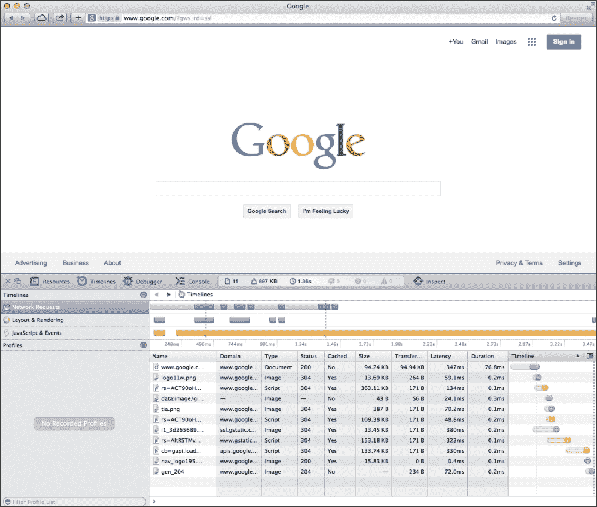
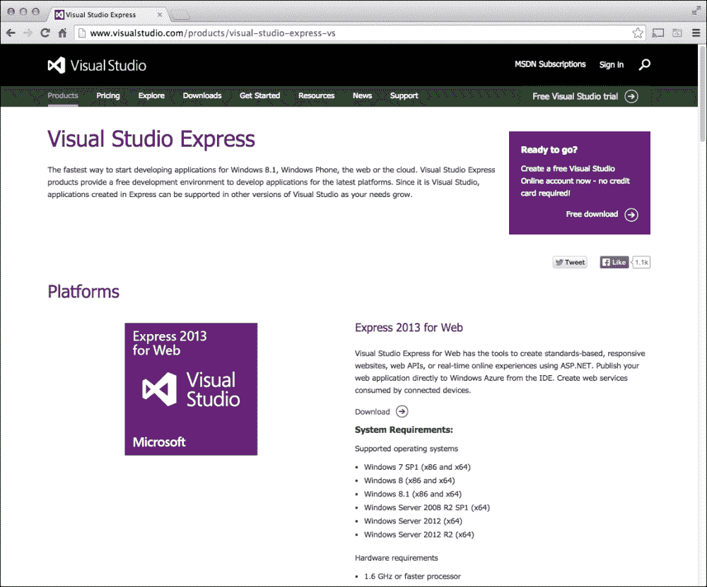
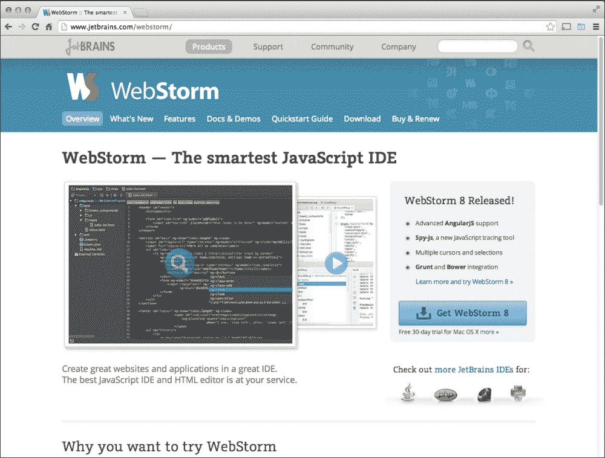
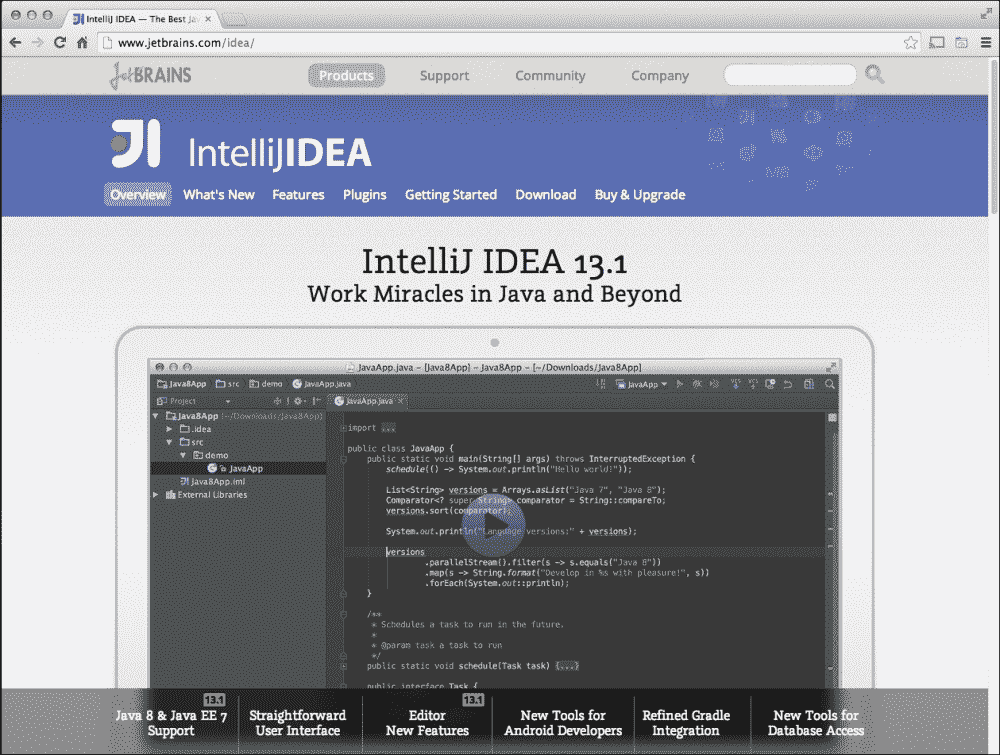
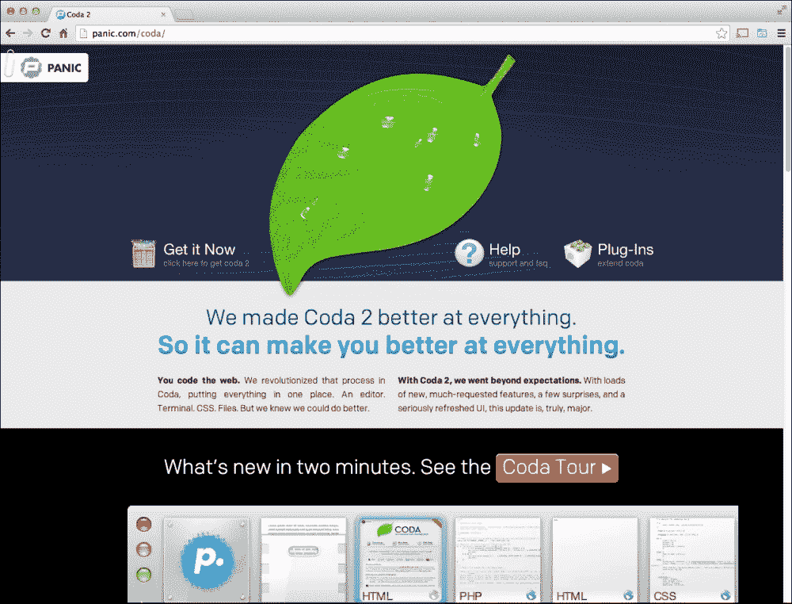
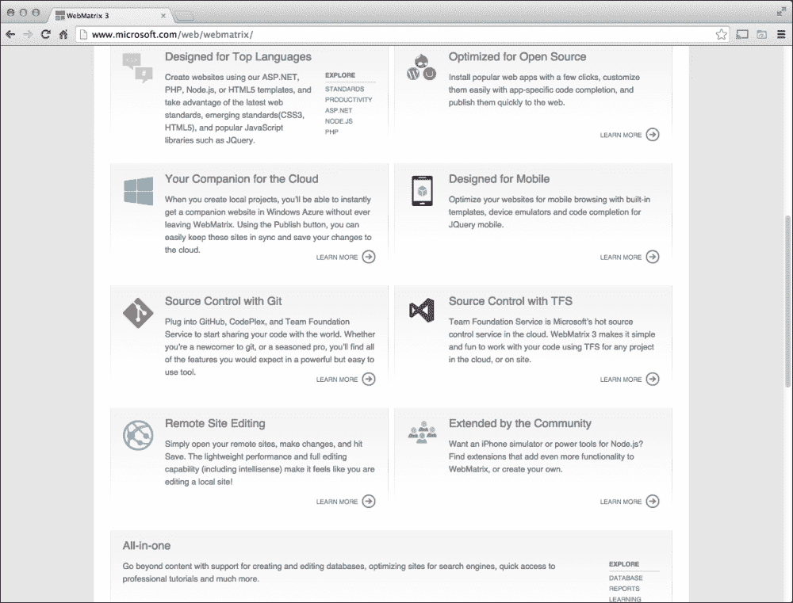
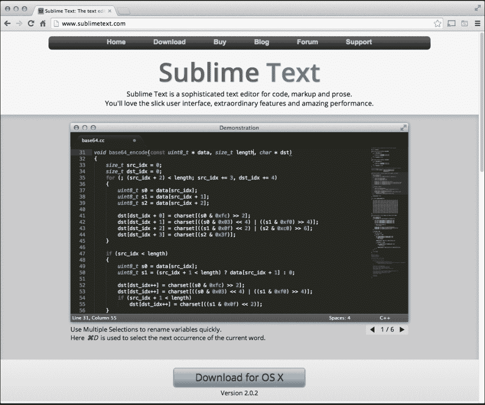
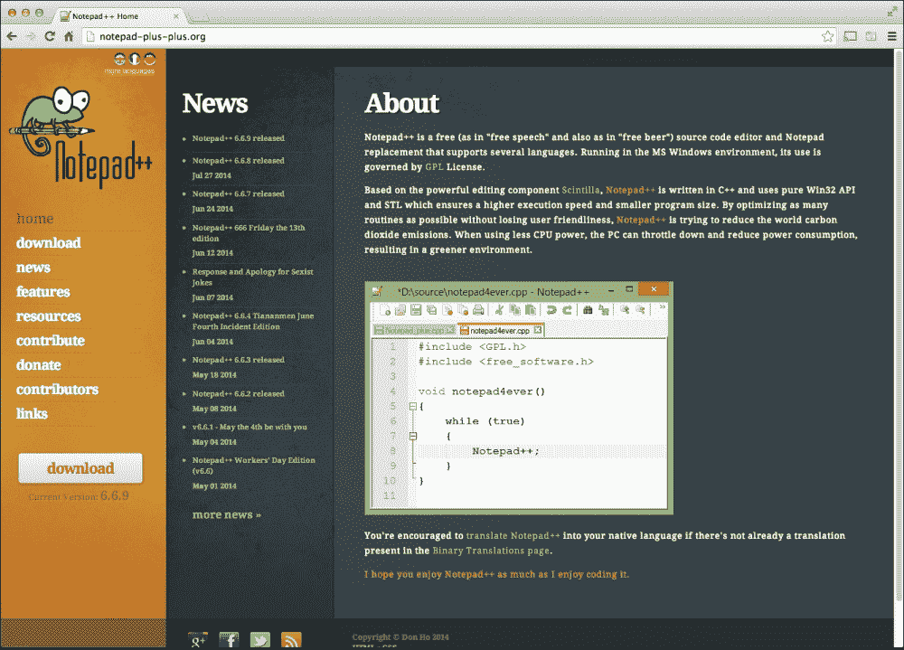
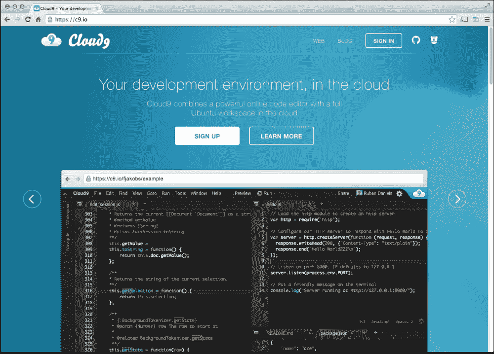
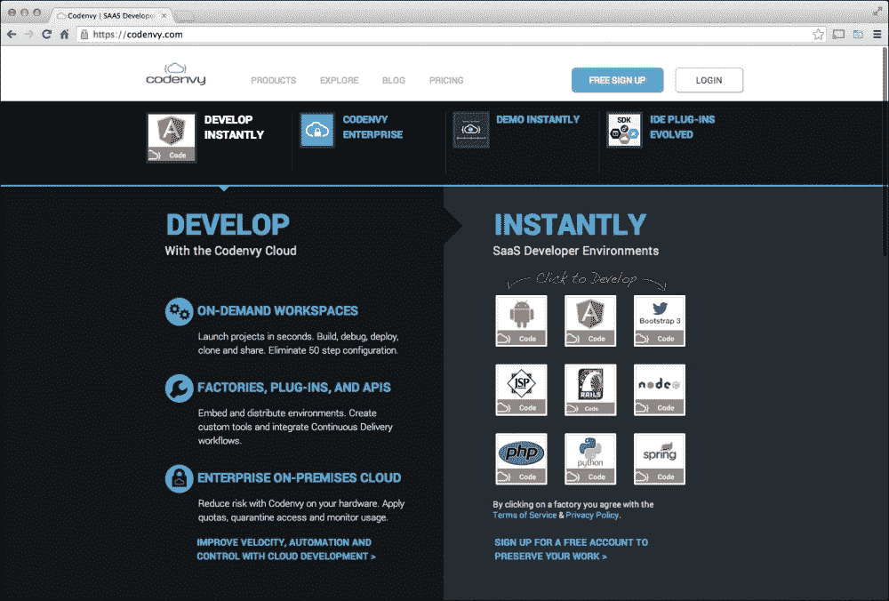

# 第一章：速度的必要性

在本章中，我们将学习为何需要更快地执行 JavaScript，讨论为何 JavaScript 代码传统上较慢，并了解哪些代码编辑器可以让我们在不改变编码风格的情况下编写更快的 JavaScript。

# 网站一直很快吗？

似乎不久前，网站性能虽然重要，但对大多数网站来说并不是必需的。在网络早期，拥有一个真正慢的网站是很常见的——这并不是因为连接速度、服务器位置或所使用的浏览器。在许多情况下，这是因为用于渲染或为页面创建功能的 JavaScript 代码执行得很慢，*非常*慢。这主要是因为当时缺乏 JavaScript 的压缩工具和调试器，以及对今天常用的常见 JavaScript 实践的了解不足。

用户可以接受页面内容总是很慢，这主要是因为大多数用户使用 56K 调制解调器拨号到他们的**互联网服务提供商**（**ISP**）。连接过程中的哔哔声提醒用户。然后，突然间，用户在桌面上收到通知，告知连接已建立，然后根据是 Windows 95 上的 Internet Explorer 4 还是 NeXTStep 机器上的 Netscape Navigator，迅速打开默认的网页浏览器。这个过程是一样的，以及花费 2 分 42 秒做三明治，等待 HotBot 加载的时间。

随着时间的推移，用户开始体验谷歌，突然间，页面速度和加载时间似乎吸引了更多用户的注意力。然而，即便在今天，谷歌主搜索网站的简洁主题也能让整个网站的代码快速下载。无论互联网连接速度如何，根据 Safari 的时间线工具显示，整个过程仅需 1.36 秒，如下面的屏幕截图所示，这清楚地告诉我们哪些资源下载最快，哪些最慢。

这部分原因是，现代浏览器中使用的工具当时并不适用于 Internet Explorer 或 Netscape Navigator。在调试的早期阶段，JavaScript 结果是通过 JavaScript 警告进行调试的，因为当时没有现代工具。此外，今天的开发者工具集比简单的文本编辑器先进得多。

在下面的屏幕截图中，我们将向您展示使用 Safari 的网络检查器测量的网站下载速度：

## 变得更快

JavaScript 本质上是一种相当容易构建的语言。JavaScript 的一个优点是，JavaScript 是一种解释型语言，这意味着即使代码开发完成，仍可以根据项目规格部署和使用代码。

非编译代码既有优点也有缺点。由于无需编译，开发者可以很快地用全栈 web 应用程序构建一个网页，在非常短的时间内完成。这也对新手或中级开发者非常友好，总的来说，这让 web 项目的招聘变得稍微容易一些。

现在，不使用编译型语言的问题在于 JavaScript 是动态解释执行的，常见的错误往往被开发者忽略；即使代码看似运行正常，也可能并非高效运行。在开发工具主要是 Windows 上的记事本和网页浏览器的时代，任何错误都只能由用户发现，而与代码性能相关的问题则被排除在外。

今天，我们在 JavaScript 技能之上拥有各种工具集和构建系统。重要的是要理解，深入掌握 JavaScript 知识可以帮助你编写和审查更好的 JavaScript 代码，但在许多情况下，我们作为开发者毕竟只是凡人，会犯一些常见错误，影响我们的 JavaScript 代码——例如，在函数开始括号后不添加空格，或者忘记在代码语句末尾添加分号。

为给定项目选择一个合适的编辑器，该编辑器包括在编写 JavaScript 的第一行代码之前进行基本错误检查，可以显著提高我们代码库的性能和质量，而无需学习 JavaScript 内部工作原理的任何新知识。

## 选择有效的编辑器

选择一个好的编辑器可以在代码质量和编程效率方面有很大影响，如前文所述，我们开发者是人类，会犯错误，即使开发者的技能水平再高，也容易写出糟糕的 JavaScript 代码。所以，了解何时适合使用一种编辑器而非另一种对我们来说非常重要。为了说明这一点，我将把不同的 JavaScript 代码编辑器分为以下四个类别：

+   集成开发环境

+   中档编辑器

+   轻量级编辑器

+   基于云的编辑器

每种类型的编辑器都有其自身的优点和缺点，我们将讨论在什么情况下使用一种编辑器而不是另一种，从最大的编辑器开始。目的是展示在 JavaScript 开发中，何时适合从大型代码编辑器切换到小型编辑器。

### 集成开发环境

**集成开发环境**（**IDE**）是高级的软件工具，它们不仅提供代码编辑功能，还包括代码组织工具、内置测试工具、代码优化脚本、源代码控制集成，以及通常深度的代码提示和完成支持。

使用 IDE 的缺点是，IDE 被设计成在文件更新时不断检查代码，而在代码被编写时，这会导致编辑器在某些时候变得迟缓和不响应，在较慢的系统上使用起来痛苦不堪。通常，JavaScript 开发者倾向于不喜欢这些 IDE 的迟缓，转而使用其他更快速的编辑器。

当大型项目启动时，这可能会造成问题，用户使用了一个不适合以正确方式结构化 JavaScript 的编辑器。通常建议当项目只需要进行一些小的调整时，你应从 IDE 开始，然后逐步向下。

在接下来的部分，我们将讨论一些流行的 JavaScript IDE。

#### 微软 Visual Studio IDE

如果有一个软件与“IDE”这个术语直接相关，那微软的 Visual Studio 就是其中之一。下面这张截图展示了微软 Visual Studio IDE：

它支持多种语言，包括 HTML、CSS 和 JavaScript，同时还能处理诸如 C#、Visual Basic、Python 等语言。在 JavaScript 方面，Visual Studio 会在项目的 JavaScript 代码流中深入检查，寻找许多轻量级编辑器找不到的小错误。

对于 JavaScript 开发者来说，微软 Visual Studio Express 版对于 Web 项目应该已经足够强大。

#### JetBrain 的 WebStorm IDE

对于那些不喜欢 ASP.NET、寻找专用 JavaScript IDE 的 JavaScript 开发者，以及需要 Mac 或 Linux 解决方案的用户，不妨看看下面截图中 JetBrain 的 WebStorm IDE：

这个 IDE 主要针对 JavaScript 开发，它能处理*任何*你抛给它的 JavaScript 技术：node、AngularJS、jQuery……WebStorm 支持的技术列表长篇累牍。它还提供了完整的代码提示和错误检查支持，与 Visual Studio 类似，并且它具有非常强大的源代码控制支持，包括 Git、SVN，甚至还有微软的 Team Foundation Server。

现在让我们看看 JetBrains 旗下的 WebStorm，与 IntelliJ IDEA 相比，它是一个较低级别的 IDE，而 IntelliJ IDEA 是 JetBrains 针对*每种*语言推出的旗舰编辑器。下面这张截图展示了 IntelliJ IDEA 编辑器的用户界面：

通常，IDEA 以其作为 Java 专用 IDE 而闻名，但它包含了与 WebStorm 相同的工具以及更多其他工具。与 Visual Studio 一样，它能够处理多种语言，但这以牺牲性能为代价。例如，如果我们在一台较慢的系统上同时在这两个环境中工作，我们可能会发现在日常处理 JavaScript 项目时 IDEA 比 WebStorm 有更多的延迟。

同样，这是由于 IDE 需要运行许多后台功能来优化我们的代码，这在 IDEA 上更为明显；因此，再次强调，一开始使用 IDE 建立良好的代码结构是非常好的，但随着时间推移，我们在一个慢速编辑器中反复工作时，我们需要一些更快的、已经设置好的良好基础的东西。

考虑到这一点，许多没有看到 IDE 性能问题的开发者倾向于坚持他们选择的 IDE；然而，其他开发者转向了下一节中提到的编辑器。

### 中档编辑器

中档编辑器非常适合已经度过早期开发阶段的项目，或者是非常小的项目。早期使用集成开发环境（IDE）的一个例外是小型项目。这些通常是基于内容管理系统（如 WordPress、Joomla、Drupal 等）的网站，其中大部分 JavaScript 代码已经为开发者编写并经过测试。

它们还适用于轻量级的代码提示，有些可以连接到源代码库或 FTP，以上传代码。这些与 IDE 真正的区别在于编辑器的速度和缺乏代码质量特性。许多这类编辑器只查找代码中的明显错误，例如在 JavaScript 中遗漏分号。尽管如此，它们是非常有用的全能编辑器。

#### Panic 的 Coda 编辑器

Coda 是一个仅限 Mac 的编辑器，但它支持 HTML、CSS 和 JavaScript 编码。下面的屏幕截图展示了 Coda 的用户界面：

它还支持 Python 和 PHP，但它不是专门用于独立运行非 Web 代码的。它还具有手动验证 JavaScript 的特性，而不是持续的，因此，再次强调，有些支持可以提高你的 JavaScript 和 Web 代码，但在你编写代码时，它并不总是完全检查错误。

#### 微软 WebMatrix 编辑器

WebMatrix 是微软在中档类别中的更轻量级网站编辑器。它支持 Git 和团队基金会服务器，以及 ASP.NET 项目、PHP 和 NodeJS。WebMatrix 的用户界面可以在下面的屏幕截图中看到：

WebMatrix 是中档编辑器的一个例子，在选择要为项目使用的编辑器时，你可能需要考虑编辑器的特性。

例如，如果你需要支持 Python 的 Mac 系统，那么 Coda 是一个不错的选择，而 WebMatrix 则提供了一套不同的特性，包括 ASP.NET 支持。这是中档编辑器中的一个常见主题，其中许多编辑器实际上是设计来完成某些事情，并提供尽可能最小的代码支持，同时使编辑器尽可能快速。

对于这类编辑器，我们可以看到它们允许我们轻松连接到现有项目，并在相对快速的编辑器中进行一些代码检查。

### 轻量级编辑器

有时我们作为 JavaScript 开发者*根本不在乎*项目使用的后端平台，只需要一个简单的文本编辑器来编写一点 JavaScript 代码或更新一个 HTML 文件。这时轻量级编辑器就能派上用场。

#### Sublime Text 编辑器

Sublime Text 是一个非常流行、跨平台的轻量级编辑器。其用户界面如下截图所示：

它因启动和使用的速度以及一些基本编辑功能（如语言高亮提示和多语言支持的基本代码提示）而闻名。

它还有一个自己的包管理器叫做**包控制**，这个功能可以让您扩展 Sublime Text，以自动化一些常见的代码编辑和编译过程。尽管刚下载时非常轻量级，但它允许开发者添加所需的常见插件，以适应他们的开发工作流程。

#### Notepad++编辑器

Notepad++编辑器的用户界面如下截图所示：

在 Windows 平台上，有一个专为 Windows 平台设计的 JavaScript 编辑器——Notepad++。与 Sublime Text 类似，Notepad++主要用作文本编辑器，并支持插件，但它不像 Sublime Text 那样使用包管理器，因此即使支持插件，应用程序的运行速度也非常快。它还支持一些项目文件的代码提示，包括 JavaScript。

在这些编辑器或任何其他轻量级编辑器的情况下，由于它们通常不包含代码验证功能，因此它们在后台运行验证，可以轻松快速地进行代码更新，但存在编写速度慢或损坏代码的风险。

### 基于云的编辑器

最后，基于云或网络的编辑器是网络开发者工具箱中的新工具。它们允许开发者在浏览器中作为网页浏览器的插件或纯粹在线编辑代码库，使开发者能够在任何操作系统平台上工作，包括 Chrome OS、iPad 或 Android 操作系统，而这些系统你可能不会考虑用 JavaScript 来编写！

在浏览器中编写代码的优势在于，项目代码托管在线上，无论是 Git 还是编辑器托管服务。一些插件编辑器允许您像其他任何编辑器一样从计算机的硬盘驱动器上工作，但它们是用 HTML 和 JavaScript 编写的，带有后端（如 Python、PHP 或 ASP.NET），就像其他任何网站一样。

通常，这些编辑器在功能上属于中等水平的编辑器。然而，其中一些在功能上非常有限，除了无需安装编辑器即可在线使用之外，这就是它们属于这个类别的原因。接下来的部分将举几个流行的云编辑器的例子。

#### Cloud9 编辑器

Cloud9 编辑器，可从[`c9.io/`](http://c9.io/)获得，是一个通用的 Web 应用程序 IDE，但也是一个基于云计算的应用程序，支持 HTML5、PHP、Node.js、Rails、Python/Django 和 WordPress。以下屏幕截图显示了 Cloud9 编辑器的用户界面：

它还允许从 Git URL 或 GitHub 项目中克隆，因此你可以选择让您的代码托管在 Cloud9 中，或与您的 Git 仓库同步。

Cloud9 的另一个功能是从浏览器中支持 iOS 模拟器的虚拟机，以及为 Node.js 提供控制台支持——这一切都在浏览器中完成。

#### Codenvy 编辑器

另一个在线集成开发环境（IDE）——Codenvy——可访问[`codenvy.com/`](http://codenvy.com/)。其用户界面可从以下屏幕截图中看到：

这个编辑器与 Cloud9 非常相似，但它托管云服务项目，如谷歌的 App Engine。它还可以为 Android 构建应用程序，同时为 AngularJS 或 jQuery 等流行库提供完整的 JavaScript 支持。

云编辑器的一个问题是，当项目涉及 JavaScript 库时，在线编辑器可能无法识别库特定的 JavaScript 或 HTML 标签约定，因此在选择云编辑器时，考虑功能非常重要。

对于云编辑器，你可以看到它们遵循中等水平的编辑器功能集，但允许快速连接和更新现有项目。

# 总结

在本章中，我们回顾了 JavaScript 性能的历史，并学习了它是如何成为开发者和企业关注焦点的。我们还回顾了四种 JavaScript 代码编辑器的类型，现在我们理解了如何从大型集成开发环境（IDE）迁移到全新项目的轻量级编辑器，以及对于小更新和改动如何使用轻量级编辑器。

在下一章中，我们将探讨在使用轻量级编辑器时如何保持代码的高性能质量。
