# 第二章：使用 JSLint 提高代码性能

在本章中，我们将学习如何确认 JavaScript 中的性能修复，并将学习 JSLint。有两个非常好的 JavaScript 验证和优化工具，我们将学习如何使用这两个工具以及如何设置选项以获得最佳代码性能优化结果。

因此，在本章中，我们将涵盖以下主题：

+   检查 JavaScript 代码性能

+   什么是 JavaScript 代码检查？

+   使用 JSLint

# 检查 JavaScript 代码性能

在我们谈论如何提高 JavaScript 性能之前，我们必须问自己一个关于代码改进实际上如何提高 JavaScript 应用程序速度的难题。在 JavaScript 开发的早期阶段，许多性能改进主要是基于已知的 JavaScript 编码标准实现的，关注未声明变量的全局变量，保持变量范围一致，等等，而没有太多的验证超出网站内部可见性的任何东西。

今天，我们有新的 API 可以利用这个问题，为代码的小部分提供解决方案。

## 关于 console time API

为了解决这个问题，现代浏览器实现了新的控制台函数，称为`console.time`和`console.timeEnd`。这两个函数的作用是允许开发人员为`console.time`和`console.timeEnd`函数指定一个标签，测量`time`和`timeEnd`实例之间的代码块所需的时间，最后，在控制台中显示结果。

让我们看看如何在实际例子中使用`console.time()`和`console.timeEnd()`。在这里，在我们的`02_01.js`示例文件中，我们有一个简单的代码块，使用`new`关键字在`for`循环内部创建 100 个简单的 JavaScript 对象，如下面的屏幕截图所示：

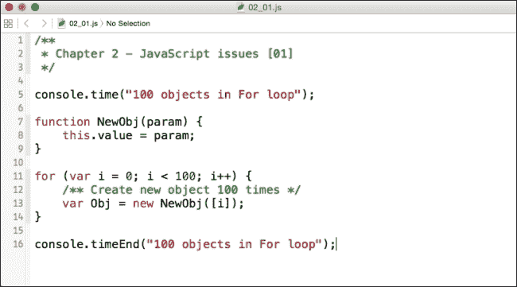

### 提示

**下载示例代码**

您可以从您购买的所有 Packt 书籍的账户中下载这些示例代码文件[`www.packtpub.com`](http://www.packtpub.com)。如果您在其他地方购买了这本书，您可以访问[`www.packtpub.com/support`](http://www.packtpub.com/support)并注册，以便将文件直接通过电子邮件发送给您。

正如我们在第 5 行所看到的，我们调用了`console.time`函数，在其内部作为参数，我们有代码块的`100 objects in For Loop`字符串标签。然后在第 7 行，我们添加了一个`NewObj`对象构造函数。接着，在第 11 行，我们有一个简单的 JavaScript`for`循环，创建了`100`个`NewObj`构造函数的实例，从第 13 行的`for`循环中的每个实例传递值。最后，在第 16 行，我们使用与`time`实例开始时声明的相同标签结束时间块，调用`console.timeEnd`函数。

让我们在浏览器中尝试这个代码；我将使用 Google Chrome，但任何现代浏览器，如最新版本的 Firefox、Internet Explorer 或 Safari，都应该可以。我们将打开浏览器 URL 中的`about:blank`，以便我们可以有一个简单的工作环境，然后我们将打开我们的网络检查器或浏览器调试器，将代码片段粘贴到我们的控制台中，并按下*Enter*。以下是在我的浏览器中显示的结果：

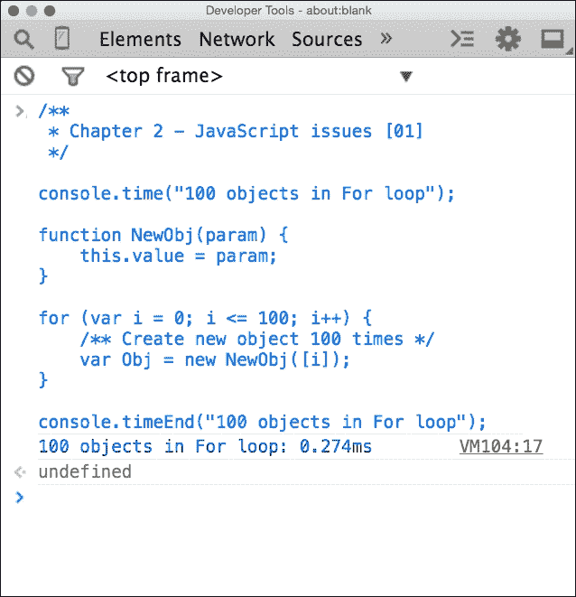

如果我们看输出中`undefined`行之前的部分，我们可以看到在`console.time`函数中定义的标签输出：`100 objects in For loop: 0.274ms`。所以，有了这些确切的数据，我们可以直观地看到我们编写的代码块需要`0.274ms`的 JavaScript 解释器来处理这部分代码。很好，但如果我们调整我们的代码使其更有效率，比如说，将我们的`for`循环改为停止在`10`而不是`100`。那么，这是我们示例文件中`02_02.js`文件的更新代码样本：

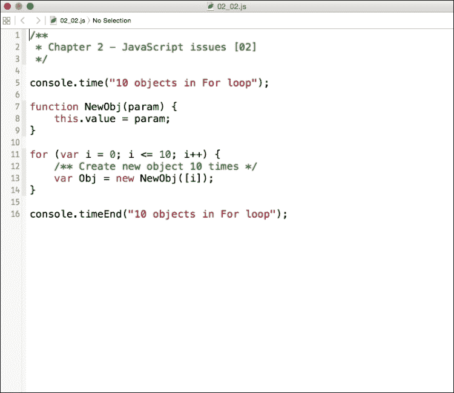

在这里，我们在第 5、11、12 和 16 行改变了`for`循环的迭代次数；让我们运行这段代码，看看会出现什么情况，如下面的屏幕截图所示：

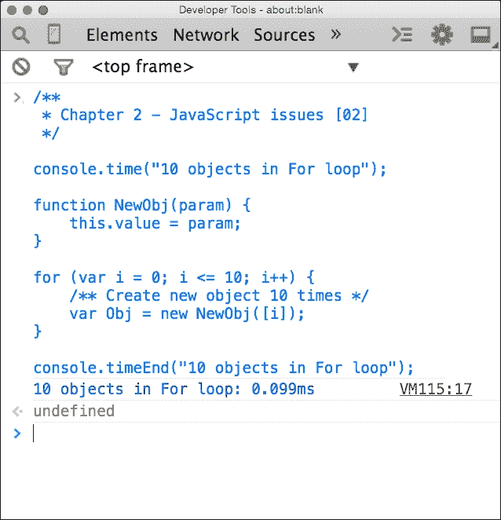

我们现在可以看出，将`for`循环的迭代次数从`100`次减少到`10`次，我们的处理时间从`0.274ms`降低到了`0.099ms`。我们知道这个性能测试 API 在评估我们的 JavaScript 代码性能时非常有帮助，因此我们可以想象将这个方法应用到更大型的应用中。

## 何时使用 console.time

`console.time()`方法允许开发者了解哪些代码会影响性能，哪些不会。`console.time()`方法基于你使用的浏览器、操作系统和系统硬件来提供结果。如果你运行了前面代码片段，它们应该接近于本书中给出的值，但很可能由于小的偏差而不是完全相同。

所以，在使用`console.time()`时，把它当作一个指南而不是一个确切的结果。当我们通过书籍使用`console.time()`方法时，这里列出的结果和你根据你的工作环境得到的结果可能会有所不同。然而，你应该能保持一致地看到使用`console.time()`方法后性能的总体提升。

现在我们已经掌握了性能测试的知识，我们将开始学习 JavaScript 中常见的性能瓶颈，但在深入这些概念之前，我们将先了解有助于评估过程的工具。

# 什么是 JavaScript 代码格式化？

在讨论 JSLint 之前，我们需要讨论一下代码检查器（linters）的一般概念，它们是什么以及它们如何影响 JavaScript 的性能。简单地说，lint 就是一个代码验证检查器。它允许开发者指向一个代码文件，并检查从空格问题到纯粹的代码错误等错误或潜在问题。

代码检查器通常会接收文件的正文并构建一个源树。在 JavaScript 的情况下，这可以是全局变量、函数、原型、数组等对象。创建树后，分析器会取源树的某些部分并报告任何分析器会标记的内容。最后，任何在运行 linter 之前标记的规则读者或参数将寻找任何忽略的选项并生成最终报告。

常见的 JavaScript 选项规则读者可能包括检查 EcmaScript 3、允许空格、允许 `continue` 关键字、允许 `if` 语句的非严格条件等设置。

## 关于 JSLint

JSLint 是一个由 JavaScript 编写的 JavaScript 代码分析工具，由 Douglas Crockford 编写，他还帮助在软件开发中普及了 JSON。正如第一章《速度的必要性》所提到的，JSLint 可以用多种方式使用。许多集成开发环境（IDE）的功能不仅仅是编辑代码，其中一些功能包括错误检查等，在某些情况下，IDE 会使用 JSLint 的一个版本。

在本章中，我们将讨论如何使用官方 JSLint 在线网站 [`www.jslint.com/`](http://www.jslint.com/)，如下面的屏幕截图所示：

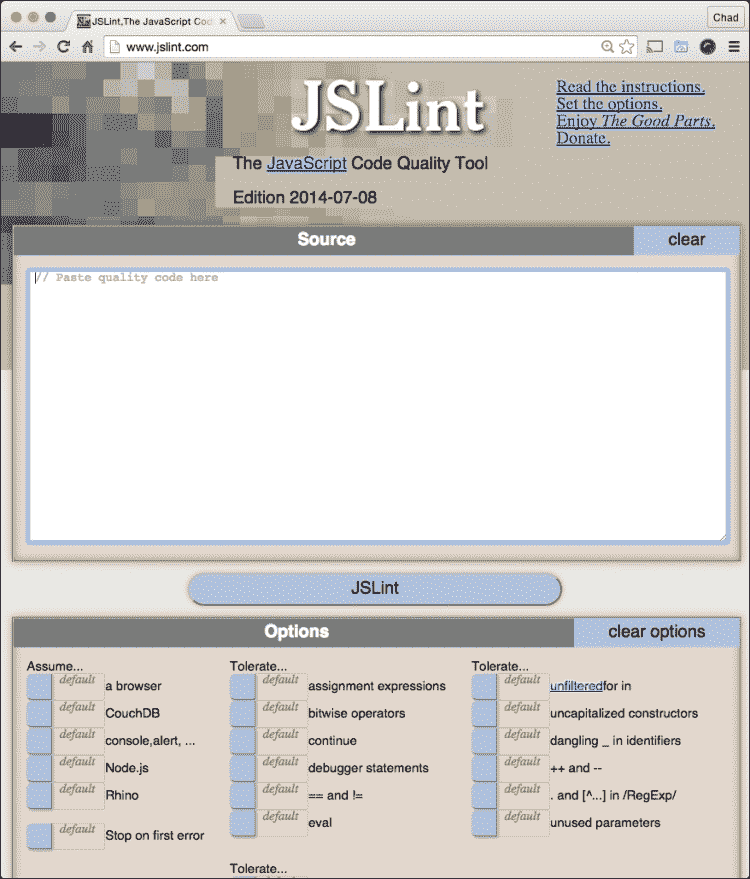

## 使用 JSLint

使用 JSLint 非常简单，你只需要一些 JavaScript 并将你的代码文件粘贴到 JSLint 中。让我们尝试一个小的代码样本，如下面的屏幕截图所示，你可以在示例文件中参考它作为 `02_03.js` 文件：

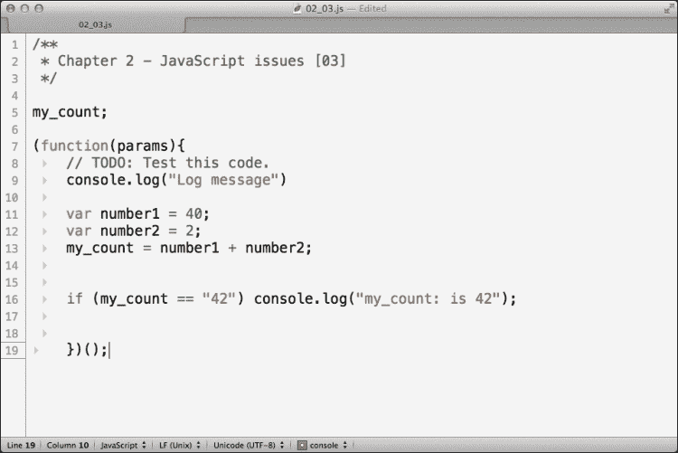

现在，让我们将我们的代码粘贴到 [`www.JSLint.com`](http://www.JSLint.com) 输入框中，并点击**JSLint** 按钮。立即，我们应该在网站上看到底部的**JSLint** 按钮下出现一个错误列表，如下面的屏幕截图所示：

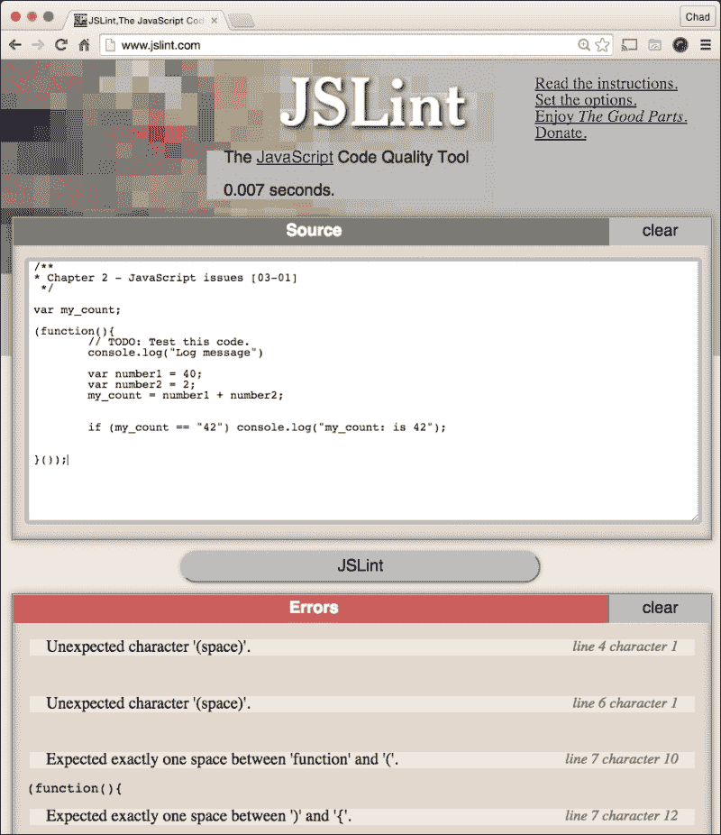

请参阅以下剩余错误：

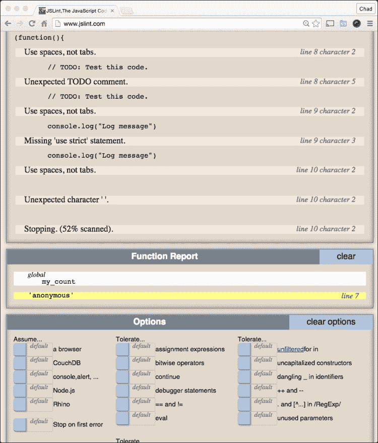

## 审查错误

在查看这些错误之前，让我们看看错误列表的底部；我们会看到一个错误：`Stopping. (52% scanned)`。这是一个警告，JSLint 找到了如此多的错误，以至于 JSLint 的分析工具 simply gave up 审查错误。在审查 JSLint 消息时，记住这个错误很重要；因为只有 52% 的代码被审查，在我们修复它们之后，可能还会出现额外的错误。

好的，现在我们已经理解了 JSLint 的限制，让我们来修正这些错误。在处理 JSLint 时，从上往下处理错误列表，所以错误 1 是`意外字符'(空格)'。`那么这是什么意思呢？为了说明，JSLint 对 JavaScript 文件中的空格方式非常挑剔。JavaScript 解释器假设在某些 JavaScript 对象和变量中具有特定的空格。

这段空白空间出现在代码中的其他错误之前，所以我们可以假设这个错误出现在任何代码出现之前，实际上确实如此。如果我们查看`02_03.js`文件，实际上第 4 行是导致问题的地方，这是注释头和我们的`my_count`全局变量之间的空格。

## 配置杂乱的空格

我们可以通过两种方式解决我们的空格错误：我们可以逐行审查并更正，或者如果我们使用压缩工具，我们可以告诉 JSLint 忽略空行和不必要的行。为此，我们将导航到页面底部的**选项**，并将**杂乱空格**选项设置为**true** *.*这将告诉 JSLint 忽略与代码解释直接关联的任何空格问题，如下面的截图所示：

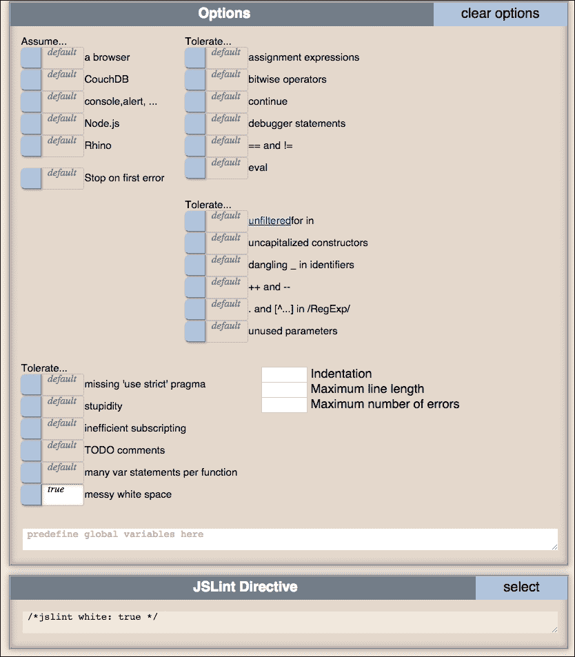

一旦设置为**true**，我们将在选项下面看到一个新的面板出现，叫做**JSLint 指令**。**JSLint 指令**面板提供了一个 JSLint 在审查代码之前将传递的参数的快速列表，在执行验证器之前。在这里看到指令非常有帮助，如果我们试图在其他 JSLint 实例中复制粘贴这个配置，比如说在一个构建系统中……关于这一点稍后会详细说明。

在忽略杂乱空格后，我们可以重新运行 JSLint 并看到错误列表的更新，如下所示：

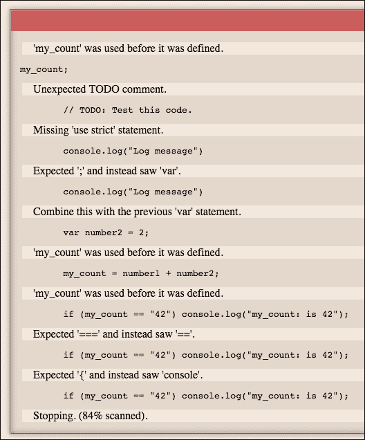

现在，我们检查一下 JSLint 检测到的代码量。这次，如果我们看看最后一个错误，可以看到 JSLint 在`84%`的地方停了下来，这比以前好多了，但我们还有提升的空间。让我们看看第一个新的错误。在错误列表的顶部，我们可以看到错误提示`'my_count'在定义之前就被使用了。`这是在**错误**面板的第 5 行，第 1 个字符。

这表明我们忘记在`my_count`变量之前声明`var`，所以让我们按照下面的截图进行更新，在第 5 行给`my_count`添加`var`，然后让我们重新运行 JSLint。您可以在练习文件中参考更新，文件名为`02_03_01`.js`：

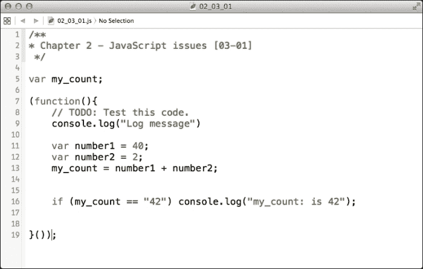

接下来，在我们更新后的代码中重新运行 JSLint 后，让我们看看接下来的两行。第一行显示`Unexpected TODO comment`。这相当直接；在 JSLint 中，我们可以指定允许**TODO comments**在我们的 JavaScript 代码中，这非常方便！让我们允许这个，因为我们现在只是在 JSLint 中改进我们的代码，现在不是完成文件的时候。请查看我突出显示的选项，您可以在其中设置是否允许 TODO：

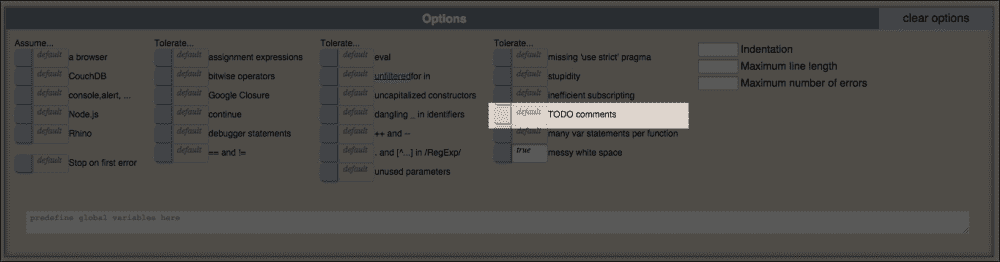

现在，我们在**选项**面板中设置**TODO 注释**为**true**；接下来，让我们看看剩下的错误。

## 了解 use strict 语句

所以，现在留在我们 JSLint 错误列表中的是以下截图所示。接下来我们看到的是`Missing 'use strict' statement.`。现在，如果你之前没有在 JavaScript 中看到过`use strict`语句，我会解释：

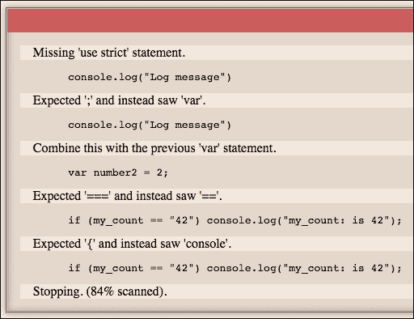

`use strict`语句是提示浏览器在运行时读取 JavaScript 时启用*严格模式*的提示。这允许通常作为警告显示的错误在我们的浏览器中作为错误返回。在代码中使用`use strict`语句的另一个优点是，它允许 JavaScript 解释器运行得更快，因为它假设代码已经过优化和彻底测试。这告诉 JavaScript 解释器这里的代码已经正确编写，解释器在运行时不必对代码进行那么多检查。

使用`use strict`语句并不难实现，我们可以在每个函数内的任何代码前添加它，像这样：

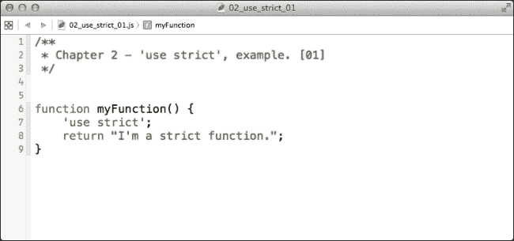

我们也可以在全球范围内在完整的 JavaScript 文件中包含它，通过在代码的第一行上方添加它，如下面的截图所示：

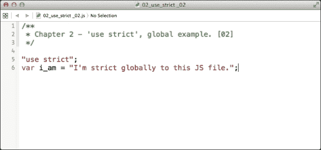

关于`use strict`语句，有一点需要了解的是，JSLint*更倾向于*在函数级别设置`use strict`语句（如第一个`use strict`示例中所示）。这样做的想法是，它正确地为`use strict`语句设置了作用域，以便根据函数更好地进行代码测试和分析，但两种方式在 JavaScript 中都是正确的。

让我们结束这些剩余的问题，在我们的`TODO`注释下；在第 9 行，我们将添加`"use strict"`，然后在我们`console.log`语句之后的第 10 行添加一个分号。完成后，它应该类似于以下截图：

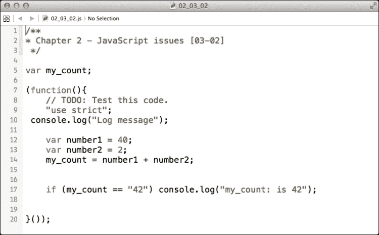

## 在 JSLint 中使用控制台

我们几乎完成了这段代码。然而，在执行它时，我们会得到一个错误列表，其中第一行可能看起来很奇怪，它指出：`'console'在定义之前就被使用了。`在**错误**面板中。JSLint 可以验证可能不为浏览器设计的 JavaScript；这可能是 Node.js 脚本，例如。为了启用浏览器对象，我们需要在我们的 JSLint**选项**面板中启用**控制台，警告，...**和**浏览器**选项；我们可以将这些设置为**真**，如下面的截图所示：

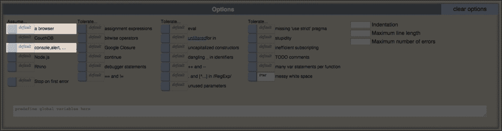

启用这些功能后，让我们重新运行脚本；剩下的错误应该很简单。第一个错误抱怨说我们应该`将这个与之前的'var'语句结合起来。`。我们可以删除`number1`和`number2`变量，简单地赋值`my_count = 42;`。

最后，我们的`if`语句需要做一些工作。首先，JSLint 抱怨我们在`if`语句中使用了一个松散的条件（比较时使用双等号）。如果我们使用三元等号进行比较，我们会同时比较类型。这样做，我们的代码将比以前更快地进行比较。另外，`if`语句没有在条件代码周围包含括号，这可能会减慢解释器的速度，所以让我们添加它们。我们的最终代码应该类似于以下截图：

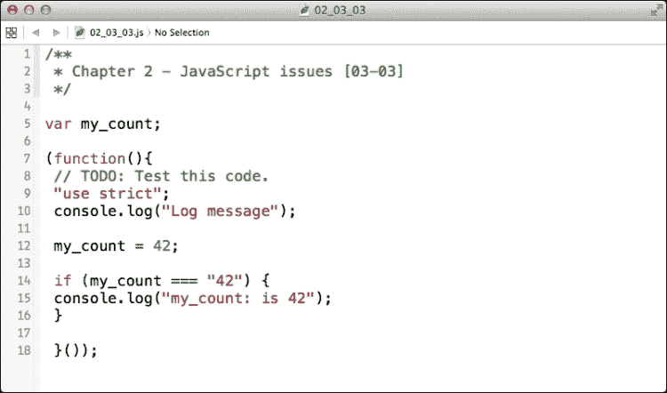

现在让我们通过 JSLint 重新运行我们的最终代码，我们应该看到一个这样的屏幕：

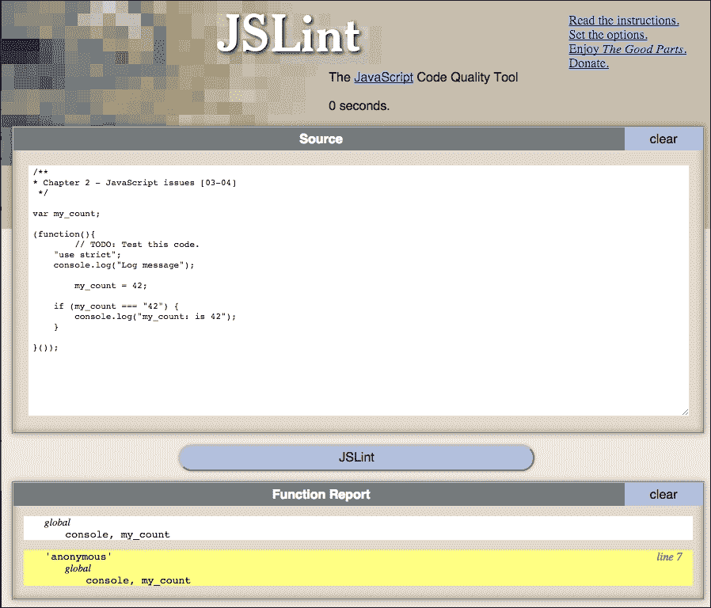

我们可以看到，现在在 JSLint 中没有错误，我们还可以看到一个**函数报告**面板，指示变量作用域作为一个注解，说明哪些变量对文件是全局的，以及哪些变量和函数存在于函数内部，包括我们的匿名函数示例。

在结束本章之前，让我们尝试在`2_03_01.js`和`02_03_03.js`代码文件上使用`console.time`方法，将`console.time`函数包裹起来。我这边前者的时间是`0.441ms`，而使用 JSLint 优化的代码是`0.211ms`! 还不错；*性能翻倍*！

# 摘要

在本章中，我们学习了`console.time`和`console.timeEnd`方法的基本知识，我们还了解了 JSLint 以及它如何提高我们的 JavaScript 性能。在下一章中，我们将快速查看 JSLint，并通过将其集成到构建系统中来亲自动手！
