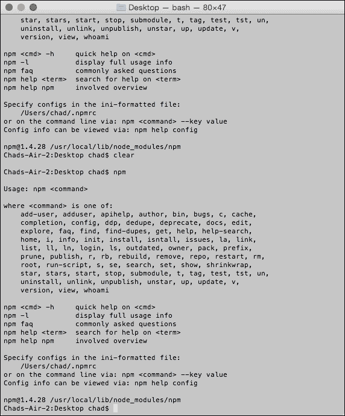

# 第三章：理解 JavaScript 构建系统

在本章中，我们将学习 JavaScript 构建系统及其对 JavaScript 性能测试和部署的优势。我们还将利用上一章中关于 JSLint 的知识，将 JavaScript 代码测试整合到我们的构建系统中。

总之，本章将涵盖以下内容：

+   什么是构建系统？

+   搭建我们的构建系统

+   创建分发

# 什么是构建系统？

通常，**构建系统**是一个自动化过程，它帮助开发者编写干净优化的代码。我们可能会认为这样的事情会在所有编程语言中都是标准的。现在，编译语言通常有一个编译器；**编译器**根据语言规范编写的一个程序，创建与目标机器兼容的输出代码。

## 通过示例编译代码

编译器通常在处理代码文件时通过一个规格。为了防止编译器因坏代码而崩溃，编译器设置了许多错误检查器，在编译器崩溃之前发出警报，从而阻止编译过程。现在一些 IDE 允许你在尝试运行代码之前发现一些错误。下面的屏幕截图显示了一个简单的 Xcode Swift 文件在编辑时进行检查的情况：


在不深入 iOS 开发的技术细节的情况下，我们可以看到，在 Swift 中分配常量变量时，如果尝试像前一张截图那样更改变量，我的代码会标志一个错误。

现在，如果我将`let authors_name`常量更改为动态的`var`变量（就像在 JavaScript 中一样），错误本身会纠正，如下面的屏幕截图所示，并在 IDE 中删除显示的错误：


## 在 JavaScript 构建系统中进行错误检查

在过去，像 Dreamweaver 这样的 JavaScript 和 HTML 内容的 HTML 编辑器，自早期网页代码编辑器创建以来就这样做了。

在 Xcode 中为编译语言所做的与在 JavaScript IDE 中所做的略有不同。对于编译语言，必须修复错误才能运行代码文件；这通常被认为是静态类型检查。然而，JavaScript 即使出错，也可以运行，甚至可以用`try-catch`块覆盖。简单地说，正如第二章《使用 JSLint 提高代码性能》中所述，JavaScript 是一种解释型语言，是唯一真正在运行时测试错误的语言。

考虑到这一点，像 Dreamweaver、WebStorm 或 Visual Studio 这样的编辑器是如何检查错误的呢？嗯，如果你记得在第二章，*使用 JSLint 提高代码性能*，我们看到了如何通过 linting 工具提供有关 JavaScript 代码中潜在或可验证错误的反馈；这返回了一个错误列表。

在集成开发环境（IDE）中，编辑器是按照这个思路编写的，它取每个错误并显示与 JavaScript 文件中的相关行和列关联的错误。

因此，要建立一个构建系统，我们需要像使用[`jslint.com/`](http://jslint.com/)一样加入这种错误检查，但要以更自动化的方式。这使得轻量级编辑器能够使用在更昂贵、更重的集成开发环境（IDE）中使用的相同检查工具。

## 超出编码标准的优化

就像我们章节开头提到的 Xcode 示例一样，我们希望我们的最终输出为我们的项目进行了优化；为此，我们将把最小化添加到我们的构建系统中，允许我们保留一个开发者版本或源项目，保存在一个带有发行版目录的另一个目录中。简单地说，最小化允许我们对 JavaScript 代码进行压缩，使我们的网络应用程序下载更快，运行更高效。

这在我们使用源代码控制来维护项目时会有帮助，它允许我们快速获取一个优化过的、但不易调试的稳定发行版，并使用我们源代码目录中的文件进行调试。

现在作为 JavaScript 开发者，我们甚至可以添加其他可能需要的项目的最小化构建选项，例如为我们的项目图像目录添加一个图像优化器，或者压缩我们的 CSS 文件，并在我们的 JavaScript 文件顶部添加信息注释块。通过压缩我们的 JavaScript，JavaScript 解释器不必猜测我们代码中的空白距离，这产生了更高效、性能更好的代码。

## 使用 Gulp.js 从头开始创建构建系统

现在我们已经介绍了构建系统及其使用原因，让我们创建一个简单的构建系统。我们的目标是创建一个从源目录生成的发行版构建，一个优化后且适用于生产的副本。我们还将整合 JSLint，正如我们从上一章学到的，以便在我们创建构建时检查我们的代码，以发现开发过程中可能遗漏的任何潜在问题。

在本章中，我们将创建一个用于测试我们的 JavaScript 项目的构建系统。我们还将把最小化整合到我们的构建系统中，并将文件复制到我们的构建目录。所以当我们准备部署时，我们的代码库已经准备好部署了。

在开始这个项目之前，我们需要了解一些与 JavaScript 相关的特定技术，特别是我们想要考虑的构建系统；我们将特别处理如 Node.js、NPM、Grunt 和 Gulp 等技术。如果你只是听说过这些，或者可能曾经摆弄过其中的一些但从未深入了解过，不用担心；我们将逐一了解这些技术，并了解它们的优缺点。

### Node.js

**Node.js** 是一个为你的操作系统设计的 JavaScript 解释器。对于 JavaScript 开发者来说，JavaScript 代码像 Java 或 C#这样的后端代码基础这样的概念可能看起来很奇怪，但已经证明以新的创造性的方式工作。例如，Node.js 开发者社区创建了插件，以创建基于 JavaScript 的定制桌面应用程序。

这使得 JavaScript 处于一个全新的位置。当传统的应用程序开发人员抱怨 JavaScript 时，主要抱怨之一就是 JavaScript 无法读取或写入硬盘文件，这对于编程语言来说通常是一个非常基本的功能。Node.js 允许自定义对象与操作系统交互。这些对象包括`FS`或`FileSystem`等，可以读写文件，并且基本上类似于 Web 浏览器中的控制台。

对于这个项目，我们不会深入讨论 Node.js（那是另一本书的内容），但我们将在我们的操作系统中安装 Node.js，这样我们就可以运行和测试我们的构建系统。所以让我们下载 Node.js 并开始吧。首先，导航到[`nodejs.org/`](http://nodejs.org/)，并点击下面的绿色**INSTALL**按钮，如图所示：


Node.js 是跨平台的，所以这些指令大部分对你应该是有用的。我将使用一个带有 OS X 的 Mac 来进行这个安装介绍。对于大多数平台，Node.js 将带有`.pkg`或`.exe`安装向导，如图所示：


从这里开始，跟随向导操作，接受用户许可并安装给所有用户。通过为所有用户安装，我们允许 Node.js 拥有完整的系统访问权限，这是我们所希望的，因为 Node.js 的一些插件可能需要某些单个用户或非管理员无法访问的功能。

当你完成 Node.js 的安装后，请注意安装程序设置的路径；如果你将来想要删除 Node.js，请查看以下屏幕截图，以查看安装程序将 Node.js 添加到了哪里：


#### 测试 Node.js 安装

为了确保 Node.js 被正确安装，我们希望检查两件事。第一件事是检查 Node.js 在终端中是否可以正常工作。为了验证安装，我们将检查已安装的 Node.js 的当前版本。

首先，让我们打开终端（或者如果使用 Windows 的话，打开命令提示符），并插入如下截图所示的`node --version`命令，然后按*Enter*键：


如果成功，我们应该在终端的下一行看到版本号（在我的情况下，它是`v0.10.32`；当你尝试这个时，你的版本可能比我版本号还要新），如下面的截图所示：


#### 测试 Node 包管理器的安装

太棒了！现在，要检查完整安装的下一个事项是 Node 包管理器是否也已安装。在测试之前，让我解释一下 Node 包管理器是什么，特别是对于那些可能不知道它是什么以及我们为什么需要它的那些人。

##### 关于 Node 包管理器

**Node 包管理器**（NPM）连接到 NPM 注册表，这是 Node.js 的在线软件库存储库。通过使用 NPM，我们可以快速设置 JavaScript 构建系统，并自动为我们的基于 HTML 的 JavaScript 项目安装库，这使我们能够确保我们的 JavaScript 库与每个库的最新版本保持更新。

NPM 还有一个网站，你可以使用它在[`www.npmjs.org`](https://www.npmjs.org)上研究各种 JavaScript 库。下面的截图也显示了这一点：


##### 在终端中检查 NPM 安装

现在，为了检查我们的 NPM 安装，我们将直接调用 NPM，这应该会返回已安装的 NPM 模块的`help`目录。要做到这一点，只需打开终端并插入`npm`命令。现在，我们应该看到我们的终端窗口充满了 NPM 帮助文档和示例终端命令，如下面的截图所示：



##### 使用 NPM 的基础知识

学习使用 NPM 是一个相对简单的过程。在我们为项目设置 NPM 之前，我们需要做的第一件事是创建一个项目根目录；我将这个作为第一个项目的`npm_01`，但你可以给你的根目录命名你喜欢的任何名字。现在，我们将打开终端并将我们的`bash`目录更改为我创建的目录的路径。

在终端中更改工作目录的命令是`Change Directory`或`cd`。使用`cd`非常简单；只需输入以下命令：

```js
cd [~/path/to/project_dir]

```

在这里需要注意的是，终端在 Mac 和 Linux 上总是指向你的用户主目录，并且`~`键是一个快速指向你路径的快捷方式。例如，如果你的文件夹在你的用户名下的文档目录中，使用 cd 的示例路径可能是`cd ~/Documents/[你的项目路径]`。

### 提示

如果终端信息过于杂乱，你可以使用“clear”命令来清除终端内容，而不改变你的目录。

#### 使用 NPM 安装 jQuery

一个常见的 JavaScript 库是 jQuery，NPM 上一个非常受欢迎的库。我们甚至可以在 [npmjs.org](http://npmjs.org) 上查看它的仓库信息，地址为 [`www.npmjs.org/package/jquery`](https://www.npmjs.org/package/jquery)。


如果我们查看这个页面，可以看到一个命令，用于我们的终端，`npm install jQuery`。那么，让我们在终端中输入这个命令，并按*Enter*键看看会发生什么。

### 提示

如果你是 Mac 或 Linux 用户，你可以将一个文件夹拖放到终端中，它会在你输入`cd`命令后自动为你写入该文件夹的路径。

在终端中，看起来有些文件已经被下载了，如下面的截图所示：


现在，如果我们打开我们的项目目录，我们可以看到一个新的名为`node_modules`的文件夹已经创建。在这个文件夹中，又创建了一个名为`jquery`的文件夹。下面是`jquery`文件夹内容的截图：


在`jquery`文件夹中，有一些有趣的文件。我们有一个`README.md`（`.md`是 markdown 的缩写，一种文本格式）文件，解释了 jQuery。

这个文件夹中有两个 JSON 文件，一个叫做`bower.json`，另一个叫做`package.json`。`package.json`文件处理 NPM 包的信息，而`bower.json`文件处理任何依赖包，并在安装请求时通知 NPM 也包含这些依赖包。

如果你想知道`bower.json`文件的作用，它本质上是一种从仓库更新源代码的另一种方式。与 NPM 注册表类似，`bower.json`文件使用它自己的注册表；不同的是，它可以使用项目中的 JSON 文件，并根据存储在 JSON 文件中的设置进行更新。

最后，最重要的两个文件夹是`src`文件夹（或源文件夹）和`dist`文件夹（或分发文件夹）。这种文件结构是 NPM 的一种常见约定，其中项目的源代码和调试信息保存在`src`文件夹中，而最终的测试输出保存在`dist`文件夹中。

由于我们不调试 jQuery 的源代码，我们真正需要担心的是`dist`文件夹，我们可以在其中找到`jquery.js`文件和`jquery.min.js`文件——这些通常在 jQuery 项目中使用的库文件。了解这一点对于我们的构建系统很重要，因为我们将需要将这些文件复制到我们的构建系统的分发文件夹中。

# 设置我们的构建系统

既然我们已经了解了 Node.js 和 NPM 的基础知识，那么让我们实际构建一个构建系统。我们需要将我们的终端指向项目的根目录，然后我们需要安装我们的构建系统（也称为任务运行器）。

## 关于 Grunt.js 和 Gulp.js

Node.js 构建系统属于两个主要的构建系统库：Grunt 和 Gulp。在很多情况下，Grunt 是 Node.js 项目的默认构建系统。

### Grunt 任务运行器

最初，Grunt 是为了自动化 JavaScript 和 Web 开发中的任务而设计的，由于它的可用性，许多开发者都创建了插件；您可以在下面屏幕截图中查看 Grunt 的插件存储库：


### 关于 Gulp

Gulp 是另一个 Node.js 的构建系统；使用 Gulp 的优势在于它是异步的，通常比 Grunt 更快地运行自动化任务。由于这本书都是关于性能的，我们将用 Gulp 作为我们的构建系统的示例。这并不意味着 Grunt 不好；它可以创建与 Gulp.js 一样的构建系统，但它可能没有 Gulp 快。

像 Grunt 一样，Gulp 也有一个插件参考页面，可以在[`gulpjs.com/plugins/`](http://gulpjs.com/plugins/)找到，并在下面的屏幕截图中显示：


#### 安装 Gulp

要安装 Gulp，我们将打开我们的终端，并在提示符中输入以下内容：

```js
sudo npm install --global gulp

```

这将全局安装 Gulp 到我们的 Node.js 和 NPM 资源路径。如果我们正在运行 Windows 系统，`sudo`不在 Windows Shell 中，因此我们需要以管理员身份运行命令提示符。现在，如果一切顺利，我们应该看到一大堆文件的网络请求，并且我们的终端应该返回到下面屏幕截图中显示的提示符：


在我们系统的所有文件夹中安装了全局（“全局”意味着安装在系统中的所有文件夹中）的 Gulp 依赖之后，我们可以安装我们的开发依赖，这些依赖使得我们的构建系统在上传到源代码控制时更加便携。本质上，这些依赖必须存在于我们项目的根文件中，以使我们的构建系统能够在项目目录中运行。

我们可以通过在终端中输入以下代码来完成此操作（再次说明，对于 Mac/Linux 用户是`sudo`，对于 Windows 用户是**以管理员身份运行**）：

```js
sudo npm install --save-dev gulp

```

如果成功，你的`bash`提示符应该再次出现，拉取许多 URL 源并安装到你的项目`gulp`下的`node_modules`目录中，如下面的屏幕截图所示：


#### 创建一个 gulpfile

`gulpfile`是 Gulp 检查以在项目目录的根目录运行一系列任务的文件。要创建一个，我们将创建一个简单的名为`gulpfile.js`的 JavaScript 文件（注意文件名的大小写）。在文件中，我们将将 Gulp 作为一个变量引用，并创建一个名为`Default`的默认任务。

这是我们每个`gulpfile.js`都需要运行的主要任务；在内部，我们可以包含其他任务或输出日志消息，就像在网页浏览器中一样。作为一个简单的 Gulp 任务的代码示例，如下面的屏幕截图所示：


#### 运行一个 Gulp 项目

运行一个 Gulp 项目很简单。在你的项目根目录中，在终端中输入`gulp`并按*Enter*。你应该看到你的终端中的输出，如下面的屏幕截图所示：


这很好。如果我们查看终端输出的第四行，我们应该会看到我们的输出信息为**默认任务运行**。干得好！这和我们为`Default`任务在`gulpfile.js`中创建的`console.log`信息是一样的。

所以你可能会问，这一切都是如何帮助优化 JavaScript 代码的？嗯，如果你记得第二章，*使用 JSLint 提高代码性能*，我们使用 JSLint 来审查 JavaScript 代码，进行改进，并优化文件。如果我们能在复制文件并通过 JSLint 进行压缩（甚至测试压缩后的代码）的同时运行这个测试工具呢？嗯，我们可以，这就是使用构建系统的目的。

使用构建系统，我们在修改代码之前会对其进行改进和优化，甚至在我们将其部署为网络应用程序之前。

## 将 JSLint 集成到 Gulp 中

之前，我们谈到了 Gulp 的插件页面；其中一个插件就是 JSLint 插件，安装过程相当简单。首先，查看位于[`www.npmjs.org/package/gulp-jslint/`](https://www.npmjs.org/package/gulp-jslint/)的 JSLint 插件页面，如下所示：


所以，以安装 Gulp 同样的方式，我们将运行页面上的`npm`命令，但会包括`sudo`以获取管理员权限和`-g`命令。这是一个全局标志，以将 JSLint 安装到整个系统，如下所示：

```js
sudo npm install -g gulp-jslint

```

接下来，我们将安装我们项目的开发依赖，所以我们再次在终端中指向我们项目的根目录，然后输入我们的`npm`命令，但这次加上`-save-dev`标志，如下所示：

```js
sudo npm install -save-dev gulp-jslint

```

为了验证安装，我们可以检查我们项目目录中的`node_modules`文件夹，并看到`gulp-jslint`文件夹，如下所示：


## 测试我们的示例文件

现在，我们的构建系统需要一个源文件，我在添加到新创建的`src`项目目录时编写了一个示例。我还没有测试这个，如下所示：


我们有一个简单的儿童 JavaScript 类，它根据调用原型函数来显示消息；相当基础，并且确实有一些预期的错误，让我们找出来。让我们回到`gulpfile.js`；我用一些 JSLint 示例对其进行了更新，使用了我们在第二章中提到的相同的常用选项。看看下面更新的`gulpfile.js`文件：


在第 6 行和第 7 行，我们可以看到诸如`gulp.src()`和`pipe()`这样的约定。`src`函数是一个 Gulp 特定的函数，它使用 JavaScript 数组设置源文件或文件；`pipe`函数，也是与 Gulp 相关的，允许我们创建一个任务列表，该列表将源文件从`gulp.src()`通过我们的构建系统进行*管道*。这里的第 5 行到第 19 行展示了一个新的`gulp.task`，称为 JSLint。如果我们看第 9 行到第 12 行，我们可以看到与[JSLint.com](http://JSLint.com)相同的选项；选项名称可以在页面上选择不同选项时页面的底部找到 JSLint 指令。

在第 22 行，我们在我们的*默认*任务之后添加了一个数组，将我们的*JSLint*任务名称添加到数组中。我们可以在這裡添加多个任务，但现在我们只需要 lint 任务。现在让我们运行脚本并检查我们的终端。


太好了！终端中显示的红色线条报告了脚本中的错误，给我们提供了终端中的 lint 反馈，正如我们所看到的，我们忘记了一些常见的事情，比如使用*use strict*，漏掉分号等等。因此，我们可以看到如何使用 Node.js 和 Gulp 在构建过程中自动化测试我们的代码。

## 创建分发

把最好的部分留到最后，让 Gulp 处理 JavaScript 源代码的压缩，将输出复制到`dist`文件夹，然后对输出进行测试*校验*。我已经修改了`ExampleScript.js`文件，修复了之前发现的大部分问题。

现在我们需要为 Gulp 下载一个名为**Uglify**的压缩工具，可在[`www.npmjs.org/package/gulp-uglify`](https://www.npmjs.org/package/gulp-uglify)找到。这是 Gulp 项目常用的 JavaScript 压缩器；它的安装很容易，遵循与安装 Gulp 本身和为 Gulp 安装 JSLint 相同的程序。安装此工具的以下命令：

```js
sudo npm install --save-dev gulp-uglify

```

现在我已经用一个新的压缩任务更新了我们的`gulpfile.js`，并将其添加到数组中，如下面的屏幕截图所示：


现在，在终端窗口中运行 Gulp，注意输出（如下面的屏幕截图所示）；在 finder 文件夹中，你将在你的根项目文件夹的`dist`目录中看到一个全新的压缩文件，同时保留你的开发者源文件，并获得性能 linting！


# 总结

在本章中，我们学习了如何使用 Node.js 和 Gulp 创建一个简单的 JavaScript 构建系统。我们还探索了其他插件，并查看了 Grunt 任务运行器，它与 Gulp 类似，但包含更多用于你工作的插件。

构建系统能极大地提高你的性能，而不需要太多的努力；请记住 gulp 文件可以被重新用于其他项目，因此尝试并找出最适合你项目的工具。

在下一章，我们将学习如何使用 Chrome 的**开发者工具**选项来更好地优化我们的 Web 应用程序代码的技巧和窍门。
