# 第四章：检测性能

在本章中，我们将介绍我们的工作环境以及所需的工具；我们还将介绍 Google Chrome Web 检查器中的功能和 JavaScript 优化工具，并创建一些测试样本，展示如何使用和测试 JavaScript 和 HTML 页面代码。

我们将在本章涵盖以下主题：

+   一般的 Web 检查器

+   元素面板

+   网络面板

+   时间线面板

+   配置文件面板

+   资源面板

+   审计面板

+   控制台面板

# 一般的 Web 检查器

在深入探索 Chrome 的 Web 检查器之前，重要的是要注意，有许多不同的 Web 检查器用于不同的网络浏览器，通常由浏览器的供应商开发，用于调试网页的应用内容和性能。

重要的是要理解，为了使开发者能够正确地调试 Web 应用程序，他们应该使用检测到问题的浏览器的检查器。

## Safari Web 检查器

Apple 的 Web 检查器是基于 WebKit 的检查器，为 Safari 而建。Web 检查器与 Chrome 的 Web 检查器非常相似。我们将在第九章，*为 iOS 混合应用优化 JavaScript*中更详细地介绍 Safari **Web 检查器**，主要是因为 Safari 的**Web 检查器**可以在 iOS 开发中调试 Web 内容。

Apple 对其工具的文档相当全面，网址为[`developer.apple.com/safari/tools/`](https://developer.apple.com/safari/tools/)，如下次截图所示：

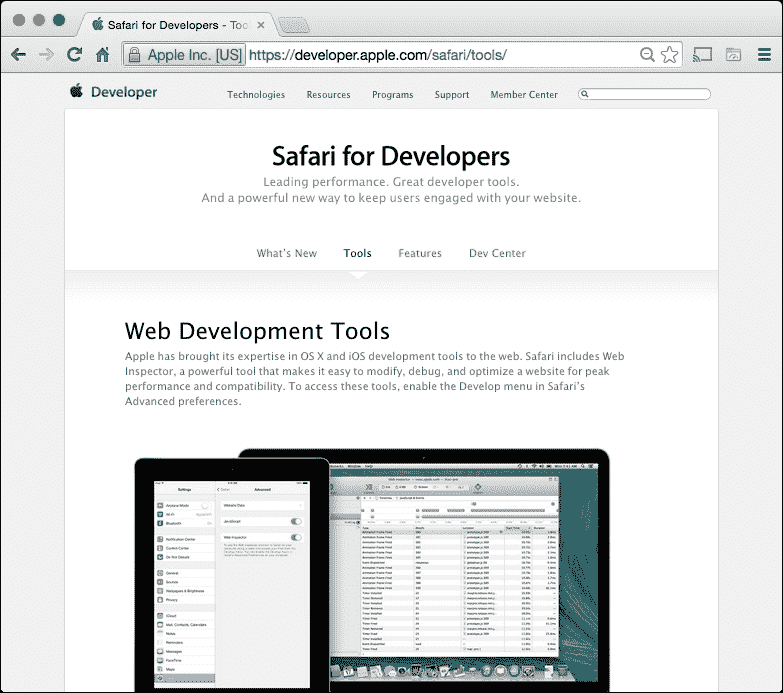

## Firefox 开发者工具

Mozilla 的 Firefox 网络浏览器也有自己的检查器。最初，Firefox 是唯一带有检查器的浏览器；它被称为 Firebug，作为插件开发，并未包含在主浏览器中。

自从 Firefox 3 问世以来，Mozilla 不仅为其自己的浏览器开发了浏览器检查器，而且还作为 Firefox OS 的调试工具，Firefox OS 是 Mozilla 的移动操作系统，使用 HTML5 进行应用程序开发。Firefox **开发者**工具还允许对相对较新甚至实验性的 HTML5 和 JavaScript 开发进行调试。

我们可以在 Mozilla 的开发者网络[`developer.mozilla.org/en-US/docs/Tools`](https://developer.mozilla.org/en-US/docs/Tools)上找到更多关于 Firefox **开发者**工具允许的开发者类型的信息，如下次截图所示：

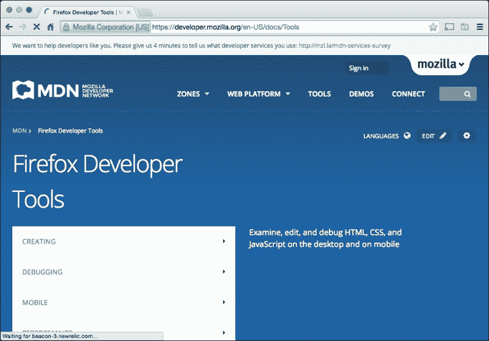

## Internet Explorer 开发者工具

在过去，Internet Explorer 被认为是网络开发者工具箱中的黑羊。在 Internet Explorer 11 问世之前，微软为 Internet Explorer 6 及以上版本提供了一个简单的 DOM 检查器插件；虽然它对 Internet Explorer 的浏览器问题非常有帮助，但其功能集落后于其他供应商的检查工具。

自从 Internet Explorer 11 发布以来，微软正定位自己支持 HTML 开发超过过去的力度，其新的**F12 开发者工具**正是如此。**F12 开发者工具**中的大多数功能与 Chrome 的**开发者工具**和 Safari 的**网络检查器**一样好，随着更多的发布，预计未来会有更多的功能。我们可以阅读更多关于如何使用这些工具的信息在[`msdn.microsoft.com/en-us/library/ie/bg182326(v=vs.85).aspx`](http://msdn.microsoft.com/en-us/library/ie/bg182326(v=vs.85).aspx)，如图下一个屏幕截图所示：

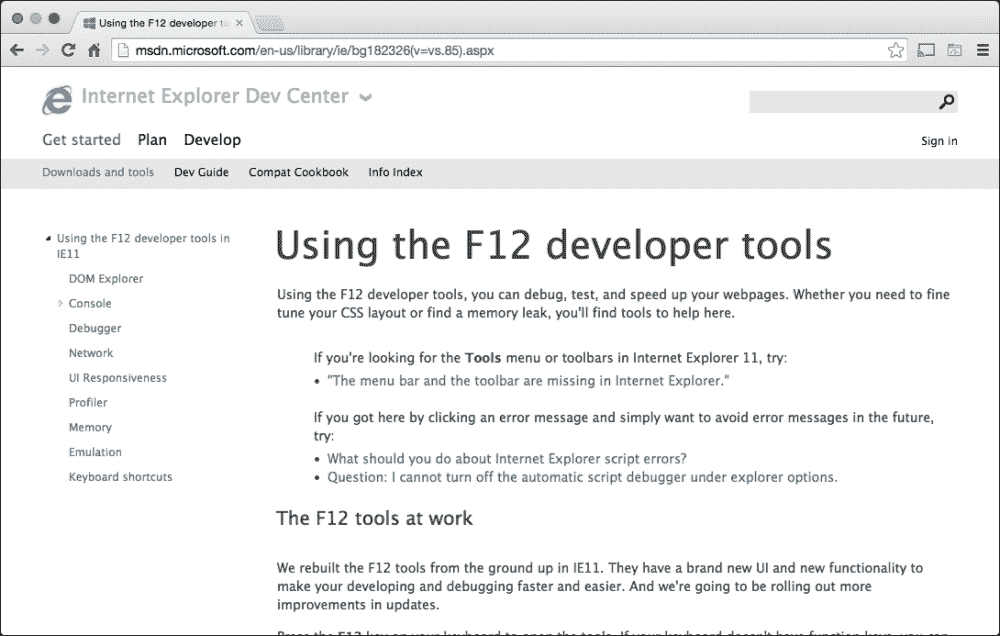

## Chrome 的开发者工具

Chrome 的检查器最初是使用开源 WebKit 浏览器的 Web 检查器开发的，该检查器在某个时候也被苹果的 Safari 使用。后来，当 Chrome 决定将 WebKit 分叉为称为 Blink 的自家浏览器运行时，Google 从零开始为 Blink 重建了检查器，优化了用户界面并添加了在开源 Webkit 检查器中找不到的功能。

重建检查器的另一个原因是 Chrome for Android 和 Chrome OS 应用的引入。这允许开发人员访问特定于那些平台上的 JavaScript 基础控制台对象。它还提供优化响应式内容的功能，以及在设备上不存在的移动内容调试工具。

由于这里提到的丰富功能，我们将介绍如何为 Chrome 使用网络检查器。如果你关心了解另一个检查器的功能，请参考前面提到的链接并研究本章列出的主题。

最后，Chrome 的新功能更新周期相当频繁，尤其是其名为 Chrome Canary 的 Chrome 测试版本，它本质上启用了任何早期速度提升的实验性功能的 Chrome。您可以在[`www.google.com/intl/en/chrome/browser/canary.html`](https://www.google.com/intl/en/chrome/browser/canary.html)下载 Canary，如图下一个屏幕截图所示：

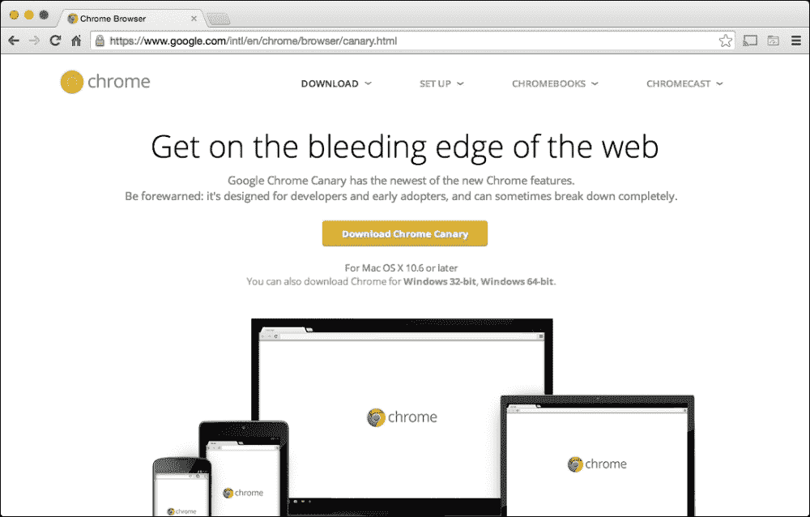

**Chromium 的开发者工具**包含了许多更高级的功能，这些功能通常在 Firefox 的**开发者工具**中可以找到。在本章中，我将使用 Chrome 的默认**开发者工具**，但请也查看 Chromium 的**开发者工具**，以了解未来将提供哪些功能。

查看[`developer.chrome.com/devtools`](https://developer.chrome.com/devtools)了解**Chrome 开发者工具概览**，如图下一个屏幕截图所示：

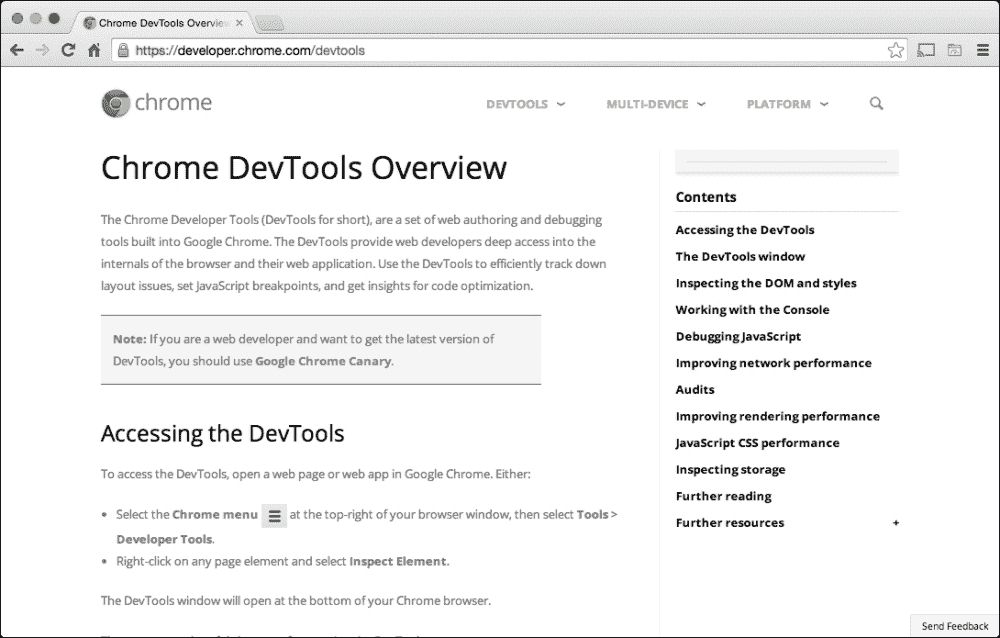

### 熟悉 Chrome 的开发者工具

要安装 Chrome 的**开发者工具**，从[`www.chrome.com/`](http://www.chrome.com/)下载 Chrome，就这样！Chrome 的**开发者工具**随 Chrome 一起提供，无需额外的安装。

首先，在 Chrome 中打开一个新窗口并输入`about:blank`在 Omnibox（或地址栏）中。接下来，使用快捷键*Ctrl* + *Shift* + *I*（或在 Mac 上的*Command* + *Option* + *I*）打开**开发者工具**。我们应该看到一个空白屏幕，**开发者工具**显示在上方，如下面的屏幕截图所示：

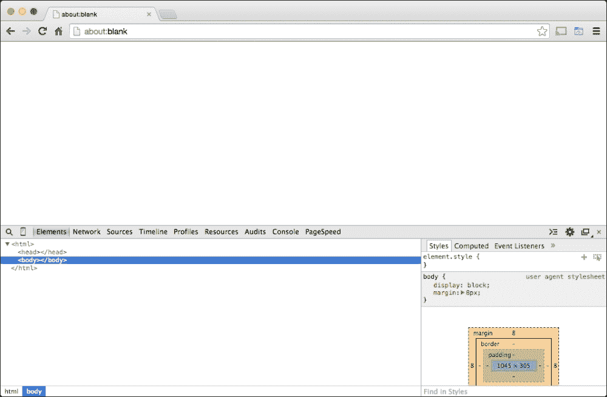

默认情况下，Chrome 的**开发者工具**将以工具栏模式显示，如前所示，或者在自己的窗口中；如果你想要解挂或重新挂起**开发者工具**，选择工具栏按钮。

按下工具栏按钮可以让我们将**开发者工具**挂接到浏览器窗口的侧面。你可以找到以下屏幕截图中标志的工具栏按钮：

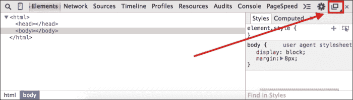

**开发者工具**分为不同的面板，显示在窗口顶部，每个面板包含不同的功能和 Web 应用程序的调试选项。我们将重点关注 JavaScript 特定的面板，但我们会简要介绍每个面板，以便不熟悉它们的人了解。

#### 元素面板

**元素**面板显示 HTML 页面的源代码和 DOM 浏览器，允许开发人员检查 DOM 的变化。我们可以通过将鼠标悬停在 DOM 树上，或者按照以下屏幕截图中指示使用放大镜来高亮显示元素：

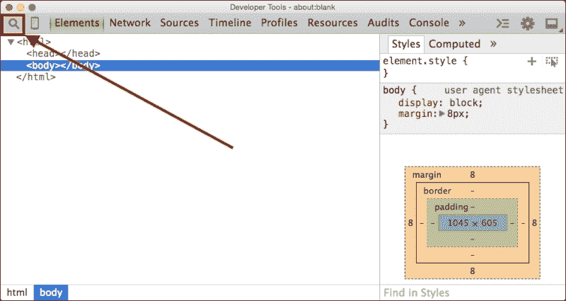

#### 网络面板

**网络**面板显示页面下载速度的所有资源及其包含的代码。让我们通过访问[`www.packtpub.com/`](http://www.packtpub.com/)并打开**网络**面板（位于**元素**旁边）来测试一下。按照以下屏幕截图所示，点击面板左上角的录制按钮：

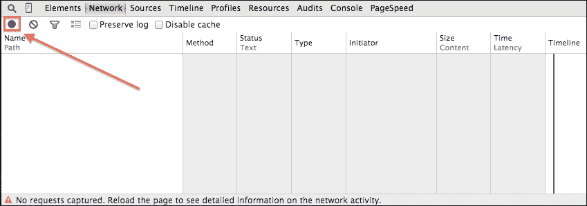

现在，让我们刷新页面并按记录按钮。我们可以看到网页上的哪些页面资源需要更长时间来加载。在考虑用 JavaScript 加载资源时，这是很重要的。如果我们针对 DOM 中尚不存在的元素或脚本，可能会发生错误。

如果我们看下面的屏幕，我们可以看到在[`www.packtpub.com/`](http://www.packtpub.com/)上，`blog-banner.png`图像的加载时间最长。

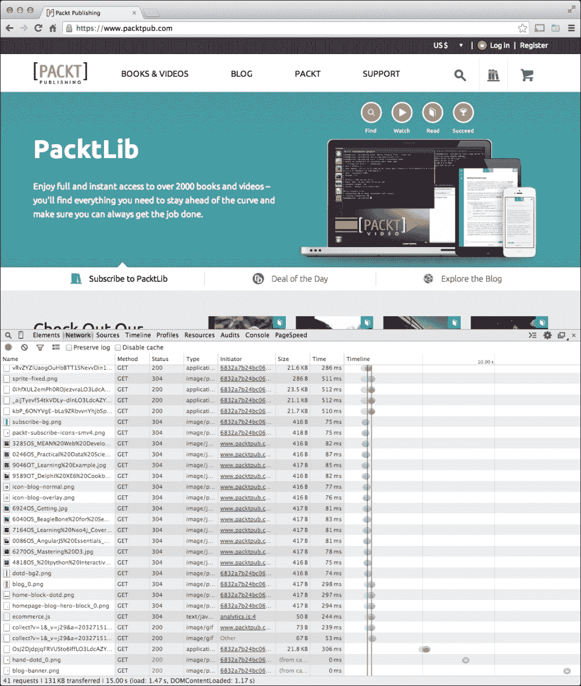

我们也可以选择一个资源；让我们点击其中一个图像资源。（我会选择`blog-banner.png`，这可能在你的页面上存在也可能不存在。如果你在首次加载时测试，给网站几秒钟加载的时间）。当我们选择它时，我们可以看到一个新的子面板出现，如果它是一个图形，则显示图像预览；如果它是一个 JavaScript 或 JSON 文件，则显示源代码。

我们在子面板中也有标签页，其中一个叫做**响应**。这提供了由 DevTools 找到的 POST 事件资源的信息。我们还有一个叫做**头信息**的标签页。**头信息**标签页显示对该文件的请求信息，包括（更重要的是）图像是否使用任何服务器端缓存。在此例中，我们的`blog-banner.png`文件有一个`Cache-control: max-age`值，表示最大缓存年龄为`3153600000`秒，即十年。我们还可以看到完整的`请求 URL`，注意到它使用了一个`cloudfront.net` URL，因此我们可以推断出图像使用亚马逊 S3 进行缓存和分发，如下所示的两个截图所示：

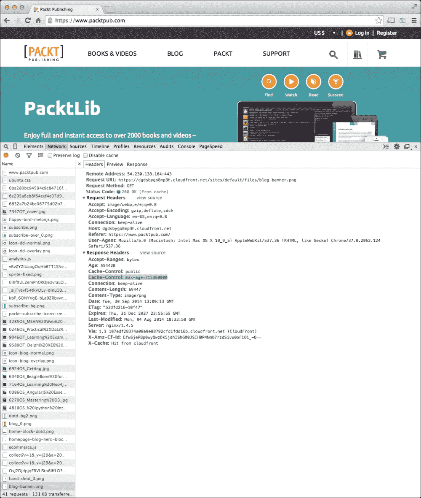

#### 源代码面板

在此我们将学习关于**源代码**面板的内容，通过以下几个方面来帮助理解：

##### 调试器基本用法

**源代码**面板是大多数 JavaScript 开发者的家园；这是我们调试 JavaScript 应用程序的地方。使用它相当简单；点击左上角附近**监视表达式**选项的上暂停按钮，如下所示的截图：

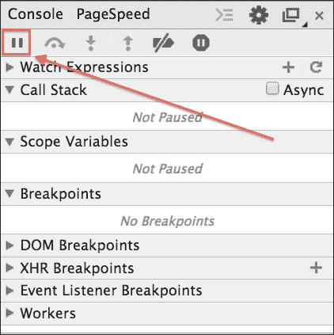

###### 测试调试器

让我们尝试使用调试器。打开我们代码包中 Packt Publishing 网站提供的`Chapter_4`文件夹内的`01`文件夹。在其中，我们可以看到一个非常简单的代码示例，我们还有一个 HTML5 的`index.html`页面，如下所示的源代码视图：

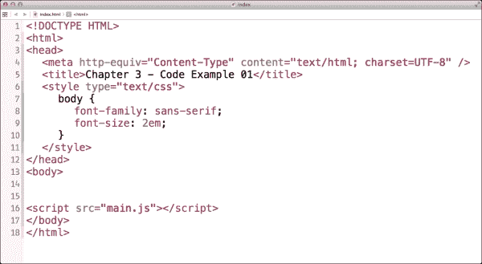

我们可以看到，我们有一个非常空的网页，给`body`标签添加了一些样式；我们还添加了一个`main.js`外部 JavaScript 文件，处理我们页面的所有逻辑。我们接下来要做的就是检查一个包含`while`循环的函数。

循环将在`document.body`标签中添加`paragraphTag`变量，每个变量都有一个名为全局变量`my_integer`的索引变量，该变量位于`while`循环外的`loopingTo5k()`函数中。这在第 14 行被调用，由一个`window.onload`事件触发，如下所示的下一个截图显示了`main.js`的源代码视图：

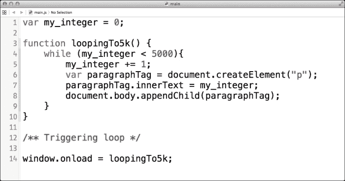

有了我们的源代码，让我们在 Chrome 中打开**源代码**面板运行我们的页面。如果我们看屏幕，我们可以看到一串数字按顺序向下移动，最后在文档的最后一行结束于**5000**。

让我们在我们的**源代码**面板上选择`main.js`文件，为我们的源代码第 8 行添加一个断点，看看**源代码**面板能做什么。现在我们设置了断点，让我们刷新页面。当我们这样做时，我们可以看到页面变灰，顶部有一个黄色注释，表示我们在调试器中暂停，我们`main.js`文件中的第#8 行用蓝色高亮，表示调试器暂停的位置。

我们还可以看到**作用域变量**选项，它显示了给定作用域在执行时的所有属性和对象；在这个例子中，作用域在`loopingTo5k()`函数内部。为了获取更多信息，我们可以参考**源代码**面板的右侧部分，查看局部树以获取信息，或者我们可以在我们的代码文件中悬停鼠标以获取更多信息。如以下所示，我在我的函数作用域中突出了`document.body`对象，在 JavaScript 中创建了一个新的段落对象。

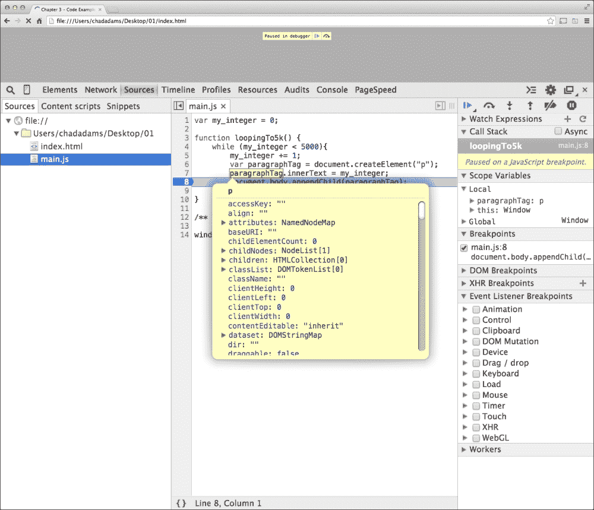

当我们完成调试时，我们可以按下**源代码**面板中突出显示的蓝色播放按钮，或者我们可以通过播放按钮旁边的控件**单步跳过**我们的函数，然后继续下一个函数。请记住，如果我们有进一步的断点，它们将会在我们网页中的源文件中更远的地方断开。要删除断点，我们可以将它们拖离我们的行号列，然后按下播放按钮，继续不进行调试。

###### 使用调试器关键字

在 JavaScript 编程中，一个鲜为人知的特性是**调试器**关键字；它是一个非常简单的助手函数。当运行代码时，它会触发**源代码**面板或其他连接的 JavaScript 调试器自动断开；这在审查大量代码库或在特定行上遇到问题时非常有帮助。

假设在我们的示例代码中，有一个 while 循环，导致在`my_integer`的`555`次迭代时我们的代码出现问题。如果我们不得不逐步执行这个，这将需要按下 555 次播放按钮才能到达那里。然而，有一个解决办法。

为了演示这一点，我在代码包中保存了一个这些源文件的副本，并将其保存在 Packt Publishing 网站提供的`02`文件夹中，在`第三章`文件夹中的`练习文件`文件夹中。我在这里的代码中只做了一个改动：在 12 至 14 行中添加了一个条件`if`语句，确保`my_integer`等于`555`。如果应用此更改，我可以通过简单地写一个带有分号的`debugger`来调用调试器，如下所示：

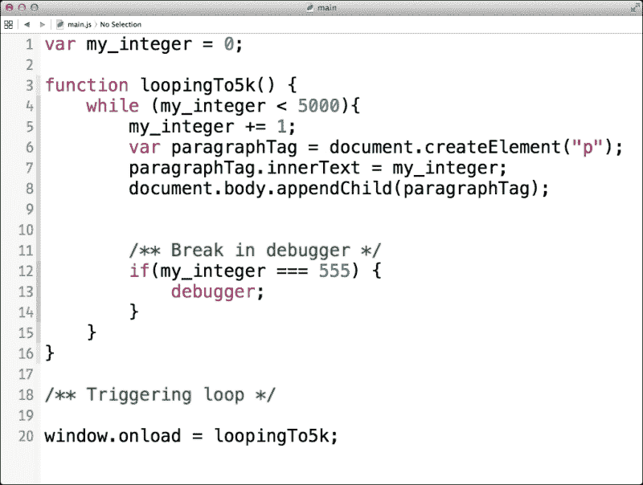

现在调用`debugger`变得简单了。让我们再次加载带有调试器代码的我们的`index.html`文件，这里我们可以看到，在不设置断点的情况下，我们的**源代码**面板自动检测到行并设置了断点，而没有遍历每个循环（如下所示）：

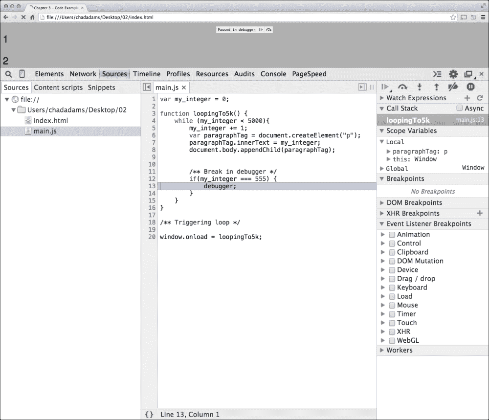

#### 时间线面板

在这里，我们将通过以下方面来学习**时间线**面板：

##### 使用时间线面板

**时间线**面板允许我们检测与 JavaScript 相关的整个网页性能；它还允许我们检查浏览器渲染事件。要使用**时间线**面板，我们只需要点击录制按钮，然后在 Chrome 中重新加载页面。

在**时间线**检查器中，**时间线**面板显示了四种类型的事件。这些是**加载**、**脚本**、**渲染**和**绘制**事件。我已经加载了前面章节中讨论的示例文件（`02`），展示了事件如何通过**时间线**面板运行，如下面的屏幕截图所示：

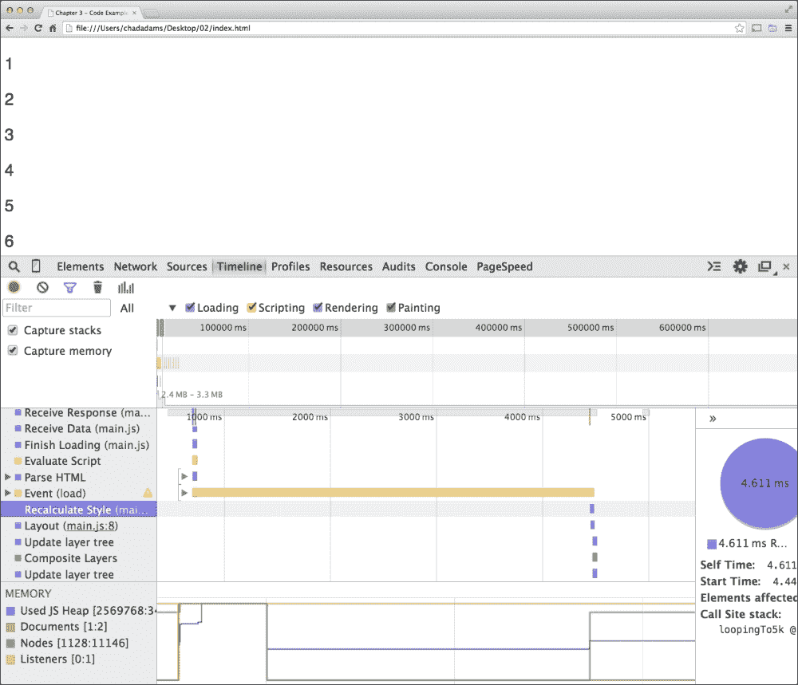

##### 加载事件

**加载**事件处理请求和响应；通常这些事件包括加载外部脚本和文件以及页面数据离开时的`POST`请求。加载事件还包括 HTML 代码的初始解析。在 Google Chrome 的**时间线**中，这些事件显示为蓝色。

##### **脚本**事件

**脚本**事件发生在浏览器读取和解释 JavaScript 代码时。在**时间线**面板中，您可以展开一个**脚本**事件，并查看函数在浏览器中接收的时间点。在 Google Chrome 中，**脚本**事件显示为黄色线条。

##### 渲染事件

**渲染**事件发生在图像文件和脚本影响 DOM 时；这可以是在`image`标签中没有指定大小的图像被加载时，或者在页面加载后 JavaScript 文件更新页面 CSS 时。

##### 绘制事件

**绘制**事件是最后一种类型的事件，通常用于更新 UI。与**渲染**事件不同，**绘制**事件发生在浏览器在屏幕上重新绘制图像时。对于桌面 JavaScript 开发来说，**绘制**事件通常不是问题，但在我们开始关注移动网页浏览器时，这个问题就变得非常严重了。

通常，当元素的显示从原始状态更新时，会强制执行**绘制**事件。它们也可以由元素更新触发，例如元素的`top`或`left`定位。

#### **配置文件**面板

**配置文件**面板帮助开发者分析网页的 CPU 配置文件，并拍摄 JavaScript 使用的堆快照。CPU 配置文件快照在检查大型复杂应用程序时很有帮助，可以查看哪些文件可能会在对象大小方面引起问题。

JavaScript 堆快照是一份编译的页面整体 JavaScript 中找到的对象清单。这不仅包括我们编写的代码，还包括浏览器内置的代码，如文档或控制台对象，给出了应用程序中所有可能的对象的总体列表。

使用**配置文件**面板与**时间线**面板类似；选择**拍摄堆快照**或**收集 JavaScript CPU 配置文件**选项，然后点击**开始**，接着重新加载页面。在下面的屏幕截图中，我选择了**收集 JavaScript CPU 配置文件**选项：

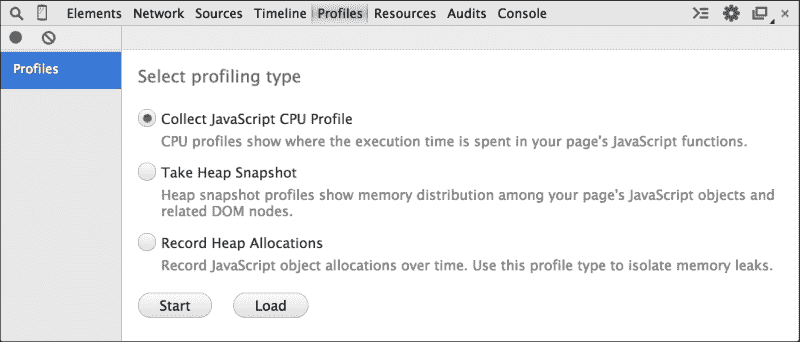

#### 资源面板

**资源**面板列出了与正在查看的网页相关的所有文件，这些文件可以通过**开发者工具**选项进行排序；开发者可以单独查看每个文件。它还显示页面上的图像以及它们的属性，如**尺寸**、**文件大小**、**MIME 类型**和源**URL**。

更重要的是，**资源**面板是浏览器数据存储的所有内容的家，包括**Web SQL**、**IndexedDB**、**本地存储**、**会话存储**和**Cookies**。用户可以在浏览器的存储数据中查看页面的**键**-**值**对值。这对于测试存储状态和在 JavaScript 代码中存储值非常有帮助。

查看键值对很容易；在**资源**面板中，选择存储类型并查看键值表，如下所示 screenshot using Packt Publishing's website while viewing local storage:

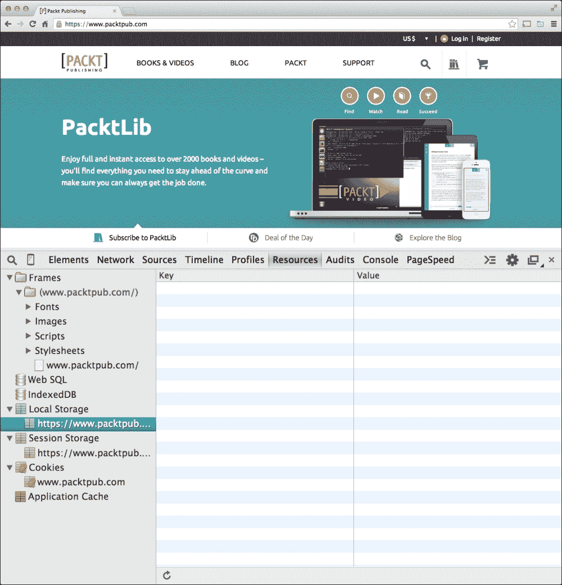

#### 审计面板

在这里，我们将通过以下方面了解**审计**面板。

##### 与 Audits 面板交互

**审计**面板*审计*整个网页的应用程序**网络利用率**和整体**网页性能**；这是浏览器提供的**开发者工具**选项中更容易使用和更直观的面板之一。使用**审计**面板也很简单。首先，再次打开 Packt 出版社的网站，使用**开发者工具**选项选择**审计**面板，然后检查**选择所有**选项；这将测试网络速度和整体网页性能。最后，确保在点击**运行**按钮之前将单选按钮设置为**重新加载页面并在加载时进行审计**。这将确保审计测试正确地检查网络使用情况，而不是缓存状态，正如以下屏幕截图所示：

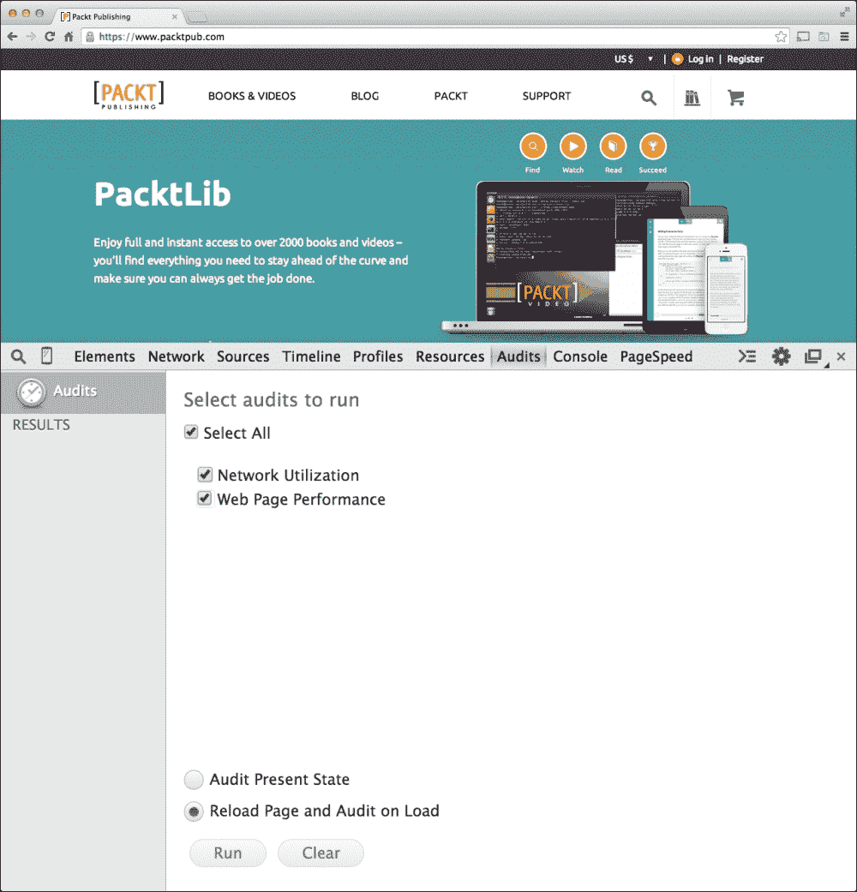

##### 获取 JavaScript 质量建议

如果我们只检查 JavaScript 性能，请取消选中**网络利用率**选项并运行测试；如果我们正在为应用程序的特定点进行测试，我们需要记住这一点。我们需要将单选按钮切换到**审计当前状态**，然后点击**运行**以获取 Web 应用程序当前状态的建议。让我们在[`www.packtpub.com/`](https://www.packtpub.com/)上运行测试，然后在**结果**下选择文件。让我们查看以下屏幕截图中显示的性能改进建议：


如果我们仔细观察，可以看到非常易读的建议，这些建议与我们页面的 JavaScript 代码有关，影响整个页面的性能。在这种情况下，审核检测到 3 个内联脚本，并建议将内联脚本移动以提高性能。还提供了有关页面中包含的 CSS 规则中有多少未使用（至少在这个页面上）的反馈。它还告诉我们 CSS 中是否使用了供应商前缀，而没有使用网络标准属性。所有这些建议都非常有帮助。

#### 控制台面板

最后一个开箱即用的面板是**控制台**面板。这是这里最简单的面板，但也是 JavaScript 开发者花费最多时间的面板。现在我的假设是我们对这个面板已经相当熟悉了，所以我不会深入讲解这个面板。我们可以在控制台中测试代码，并在页面中搜索对象、DOM 元素和属性。例如，假设我在 Packt Publishing 的网站上输入以下内容到控制台：

```js
document.body.classList
```

这应该在下一行返回一个 JavaScript 数组，显示我们可以使用的所有类名，并且它确实显示了一个名为`with-logo`的类名，如下面的屏幕截图所示：


**控制台**面板和 Chrome 中的**控制台**API 在 Chrome 的**开发者工具**中功能不断进化。为了跟上一些新工具的步伐，请查看 Chrome 的 DevTools 控制台 API 页面，该页面位于[`developer.chrome.com/devtools/docs/console`](https://developer.chrome.com/devtools/docs/console)，展示了如何使用控制台进行自定义输出，例如`console.table()`和`console.profile()`，使在控制台中的开发变得更加容易。

# 总结

在本章中，我们探索了随 Google Chrome**开发者工具**消费者版本提供的基面板；许多这些工具也适用于其他检查器和其他开发者工具（本章前面也已涵盖）。我鼓励您阅读有关每个工具的内容，并看看在其他检查器以及在 Chrome 的**开发者工具**中代码是如何被检查的。

在下一章中，我们将进入没有任何帮助的 JavaScript 性能编程。
