# 第五章：操作符、循环和定时器

在前面的章节中，我们回顾了 JavaScript 开发中使用的基本工具。我们查看了 IDE、代码编辑器以及*JSLint*，这是一个不仅显示我们代码存在问题的 JavaScript 代码验证器，而且它还给出了警告和建议，帮助我们改进代码。

我们还学习了`console.time`和`console.timeEnd`方法，这些方法允许我们快速测试代码执行性能。最后，我们学习了创建一个基本构建系统，以确保我们的最终代码库经过优化且无错误。

需要说明的是，所有这些工具和技术都是编写高性能代码的关键，这不是因为你知道 JavaScript，而是因为你不了解 JavaScript。JavaScript 是一种任何人都可以上手并开始编写代码而无需了解面向对象编程或了解如**模型-视图-控制器**（**MVC**）这样的模式的语言；然而，多年来，它已经被修改以适应这些更高级的编程概念（无论是以哪种方式）。

一个易于使用的语言的副作用是，很容易编写错误或者甚至非优化代码；如果我们编写复杂的 JavaScript，这种效应会翻倍甚至翻三倍。正如前面章节中提到的，JavaScript 开发人员的一个普遍特征是我们*是人类，会犯错误*。这很大程度上只是开发者意识不足，这就是为什么使用构建系统和代码检查器（如 JSLint）如此重要，在我们编写完美的、高性能的 JavaScript 之前，这些工具可以帮我们解决问题。

在本章中，我们将抛开工具和构建系统，直接深入研究 JavaScript 性能概念，将主题内容分布在两章中，从以下主题开始：

+   操作符

+   循环

+   定时器

# 操作符

在本节中，我们将学习使用比较操作符高效地创建`for`循环的方法。

## 比较操作符

比较操作符`==`是 JavaScript 开发中常见的操作符（通常在`if`语句中）；它将一个对象与另一个对象相等，并返回一个布尔值，（`true`或`false`）。这个操作符相当直接，在 C 语言基础的编程语言中非常普遍。

正因为如此，很容易利用这个操作符并在大型代码库中使用它。这个现实的真相是，等于操作符与使用`===`严格比较操作符相比，速度较慢，后者还比较对象类型以及对象的值。由于 JavaScript 解释器不需要在检查相等性之前确认类型，所以它的运行速度比双等号操作符要快。

### 严格比较更快吗？

让我们用`console.time`方法来测试一下。在下面的截图中有一个`05_01.js`代码示例；我们也可以在这本书的示例文件中看到这个示例，这些文件由 Packt Publishing 提供，可以在其网站上找到：

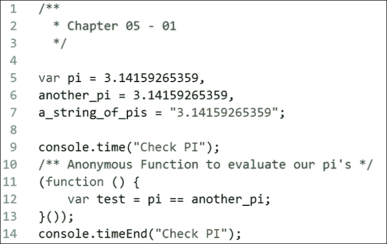

在这里，我们有 5 行、6 行和 7 行上的三个变量；其中两个变量是浮点数，引用π值，最后一个变量是具有相同π值的字符串。然后我们在第 12 行的匿名函数中有一个`test`变量，该变量使用双等号运算符将我们的浮点数相等。在第 9 行和第 14 行，我们分别包围了函数的`console.time`和`console.timeEnd`函数。

让我们在 Chrome 浏览器中运行这个；首先打开 Chrome，然后从**更多工具**选项中的`about:blank`标签中打开**开发者工具**，接着在**源**面板右侧的**代码片段**选项卡中打开。**代码片段**选项卡就像一个用于测试 JavaScript 代码的画纸；在选项卡内容区域右键点击，选择**新建**。给你的片段起个名字，并复制示例中的代码，如下所示：

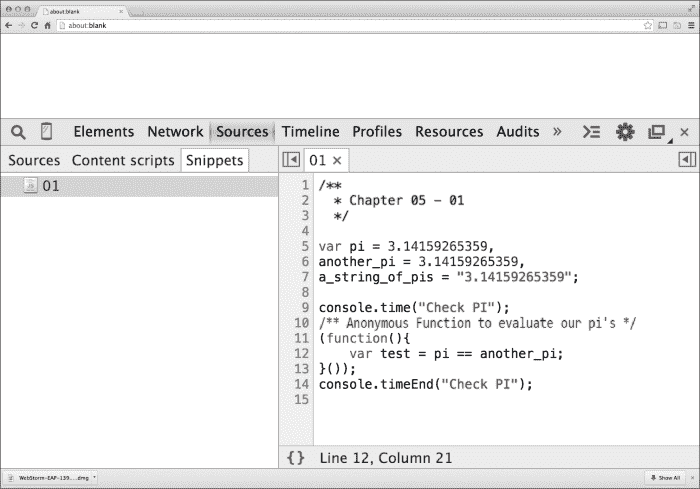

接下来，在左侧边栏中点击代码片段，然后点击**运行**。你会注意到控制台出现在**开发者工具**窗口的底部。我们还可以看到一个`Check PI: 0.016ms`的控制台消息。这告诉我们，在这个简单评估上运行比较运算符需要 0.016 毫秒来完成。如果我们更改比较运算符，用严格比较运算符来看看结果会怎样呢？

在更改运算符后，我们可以看到我们的第二个`console.time`消息是`Check PI: 0.007ms`。这个例子很简单，当然，但它证明了使用严格类型检查和严格比较运算符可以使代码运行得更快。

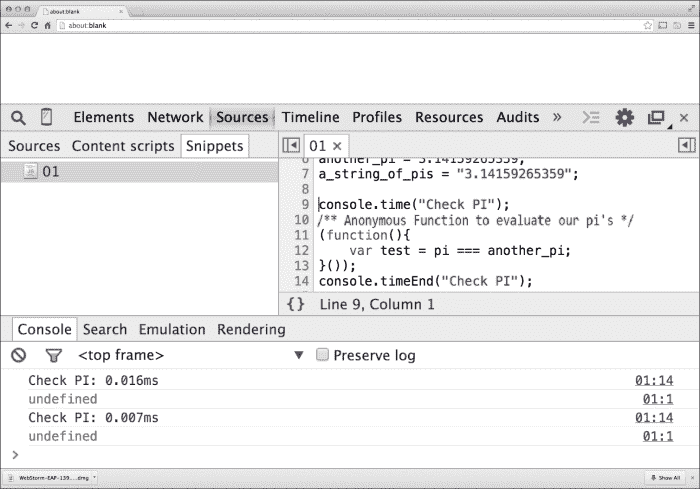

# 循环

在本节中，我们将详细学习创建`for`循环的有效方法。

## 循环如何影响性能

循环是遍历大量数据块或对象的一种非常常见方式，或者遍历 DOM 对象或数据片的每个实例。比如说我们有一个简单的循环，它生成一个`p`段落标签，并在页面内部以`i`整数循环的文本值，最大限制为`9000`。让我们来看一下下面的代码样本，了解一下是如何实现的。我创建了一个简单的 HTML5 页面，其中包含一个`script`标签，包含了第 10 行的代码，如下所示：

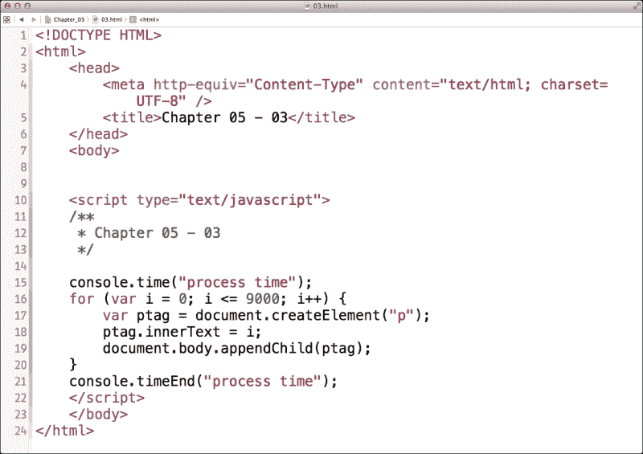

那么，这段代码处理起来为什么这么费劲呢？首先，如果我们看第 17 行，可以看到一个名为`ptag`的变量，它被创建用来在我们的 DOM 中创建一个空段落标签。然后，我们在循环中应用整数的当前值到`ptag`变量的`innerText`属性；最后，我们用循环中指定的那个点的值创建新的段落标签，并将其应用到 DOM 中。为了进行性能测试，我们还用`console.time`包装方法将`for`循环包裹起来，以检查性能速度。如果我们用 Chrome 运行这个，我们应该能得到一个包含`for`循环中创建的每个数字的页面以及一个带有`process time`标签的`console.time`方法，如下面的屏幕截图所示：

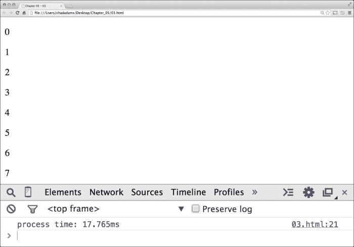

查看我们的`process time`标签，我们可以看到处理这段代码大约需要 18 毫秒才能完成。这并不好，但我们可以让它变得更好；让我们更新我们的代码，将`ptag`变量和我们的`i`整数变量移出`for`循环，这样它们就不会在每次`for`循环迭代时重新创建。让我们通过更新我们的代码来看看这样做会是什么样子，如下面的屏幕截图所示：

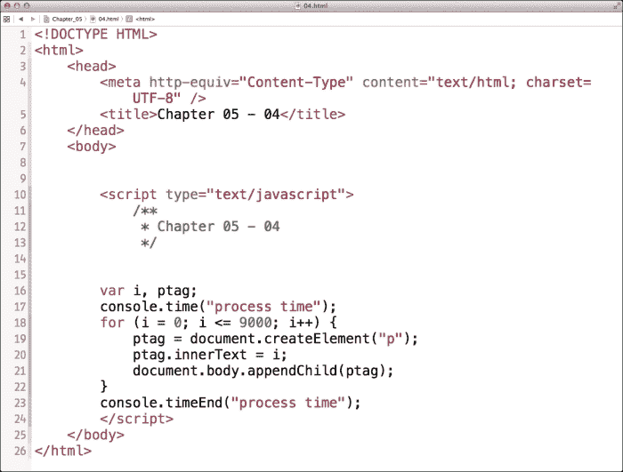

请注意，在第 16 行，我们将`i`和`ptag`变量移出了循环，我们正在循环中重新分配创建的值和对象，而不是为每次循环迭代创建一个独特的范围。如果我们重新运行我们的页面，我们应该看到相同的`body`标签用比以前稍小的性能数字更新；在以下情况下，它应该在 15-17 毫秒的范围内运行：

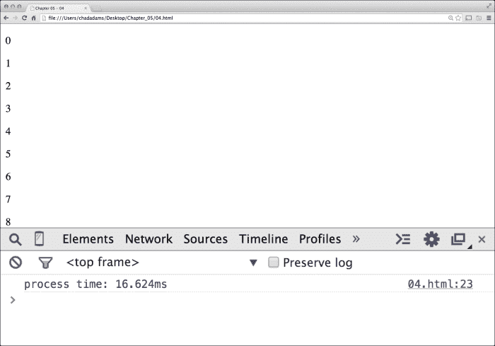

## 逆向循环性能神话

在 JavaScript 开发者圈中似乎出现了一个新想法，即逆向`for`循环的概念。逆向`for`循环就像一个循环，但循环是倒计时的，而不是正向计数的。

逆向循环背后的想法是，通过倒计数，一些 JavaScript 解释器可以更快地运行循环。让我们测试一下这个想法，看看它是否能实际上提高`for`循环的速度。首先，让我们创建一个`for`循环，从`9000`开始正向计数；我们不会在`for`循环中包含任何逻辑，除了添加一个名为`result`的外部变量。

使用我们的`result`变量进行递增，我们可以确定我们是否正在按应有的方式计数，并在`9000`末端触发一行代码，无论是*逆向*循环还是标准的`for`循环都是如此。在我们这个案例中，一个`console.timeEnd`函数，如以下代码所示，位于其自己的 HTML 页面中，页面底部有一个`script`标签。

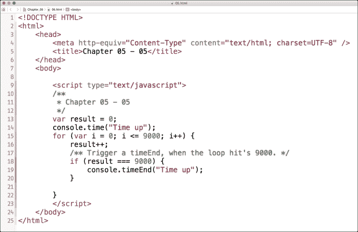

让我们看看代码示例。在第 13 行，我们可以看到我们在开始`for`循环之前声明了我们的`result`变量，而在第 14 行，我们开始了带有名为`Time Up`的标签的`console.time`包装方法。在第 15 行，我们开始`for`循环并在第 16 行增加`result`。最后，在第 18 行，我们有一个条件，我们询问结果是否等于 9000，并在第 19 行执行我们的`timeEnd`函数。

如果我们把我们的`for`循环脚本放在`body`标签内加载页面，我们的**开发者工具**中的控制台应该输出以下信息：

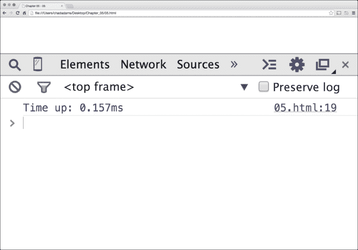

所以，我们的`console.time`对象告诉我们，在 Google Chrome 中，最大值为`9000`的标准`for`循环大约需要 0.15 毫秒来处理。HTML 页面上没有其他内容，这确保了网络延迟不是因素。这是我们比较逆序循环的好基准。

现在，让我们测试一个逆序的`for`循环；在这里，我们创建了`for`循环的更新版本，包括我们的`result`变量。这与前面的过程类似，但让我们看看下一张截图中的代码示例：

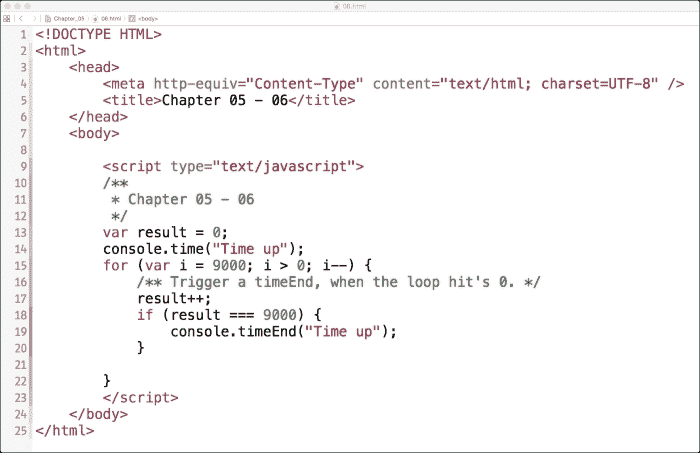

如果我们看这个代码示例的第 15 行，我们可以看到我们稍微修改了这一行，使得循环是倒数而不是正数。我们首先将增量变量`i`（在这个例子中）设置为 9000 的值，然后我们测试`i`是否大于 0。如果是，我们将`i`的值减一。

在第 17 行，我们仍然像以前一样增加我们的`result`变量。这样，而不是使用`for`循环的递减变量`i`，`result`变量在循环外作为我们的计数器存在，是递增的。这被称为*逆序*循环。当`result`在第 18 行等于 9000 时，然后在第 19 行执行`console.timeEnd`函数。

让我们在 Chrome 浏览器的**开发者工具**选项中测试一下，看看我们得到什么值，如下所示：

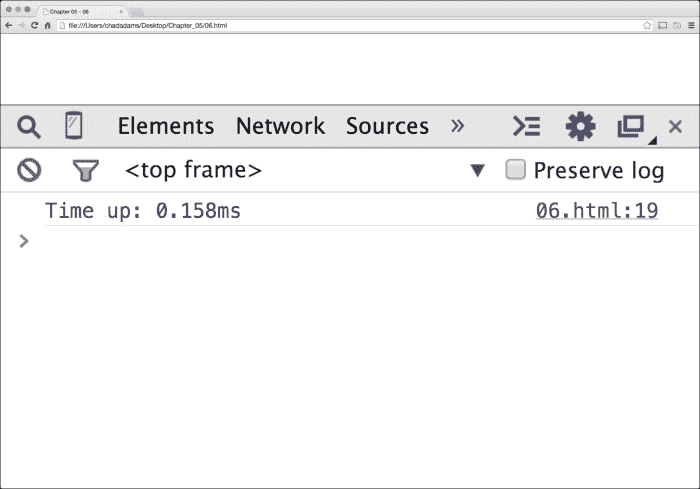

所以，我们可以在**开发者工具**中看到我们的结果，我们的逆序循环处理时间大约是 0.16 毫秒，与`for`循环相比并没有太大差异。在许多情况下，除非我们需要为一个项目倒数，否则大多数 JavaScript 项目中不需要逆序`for`循环。

# 定时器

在这里，我们将详细学习如何优化 JavaScript 定时器。

## 定时器是什么，它们如何影响性能？

定时器是 JavaScript 的内置函数，它允许执行内联 JavaScript 代码，或者在 JavaScript 应用程序的生命周期的某个特定时间点之后调用函数，或者在应用程序的生命周期内重复调用。

定时器是 JavaScript 开发者工具箱中一个非常好的工具，但它们在性能方面也有自己的问题。考虑一下这样的事实：JavaScript 语言是单线程的，这意味着我们应用程序中的每一行代码都不能与应用程序中的另一行代码同时执行。为了解决这个问题，我们使用一个内置函数`setTimeout`。

`setTimeout`方法有两个参数来延迟代码块的执行；第一个参数要么是我们代码的函数名或者独立的 JavaScript 代码行，后面跟着一个整数，指定我们想要延迟代码执行的程度，单位是毫秒。

从表面上看，`setTimeout`函数可能看起来无害，但考虑一下这个。假设我们有两个函数，每个函数都由一个`setTimeout`函数触发，每个函数都有一个`for`循环，该循环将`for`循环的递增值输出到控制台窗口。每个函数将有一个不同的最大值，较低计数的函数将在第一个较大函数的`for`循环稍微之后调用。让我们来看看这里的代码示例：

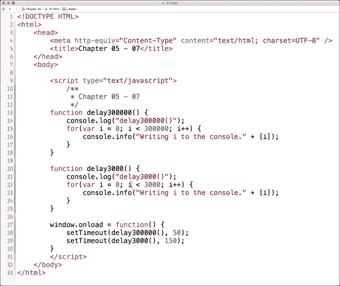

我们可以看到这是一个带有我们代码的 script 标签的空的 HTML5 页面，在第 9 行。在第 13 行和第 20 行，我们有两个相似函数的开始：一个叫`delay300000()`，另一个叫`delay3000()`，每个函数都包含一个`for`循环，该循环使用`console.info`语句将循环的每一步输出到控制台。`console.info`语句是一种控制台打印类型，它简单地将控制台行格式化为表示信息的样式。

现在，在第 27 行，我们在一个`window.onload`函数内触发这两个函数，较大的延迟函数在页面加载后 50 毫秒调用，较短的函数稍后在第 150 毫秒调用。我们试试在 Chrome 中运行这个，并看看在 Dev Tools 中会发生什么，如下图所示：

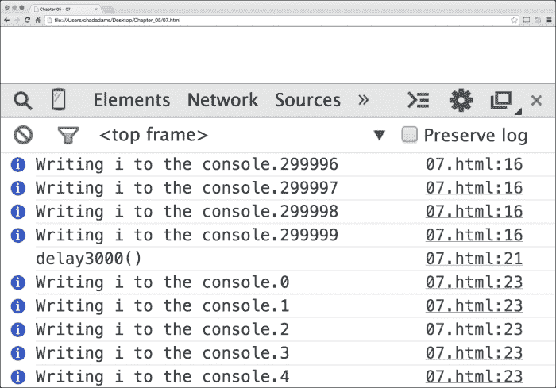

在这里，我们可以注意到当我们把这些行输出到控制台时会有明显的延迟。我们也可以看到我们在给定的超时时间内触发了这两个函数。在前面的截图中，我们可以看到我们的`delay3000()`直到我们的较大函数`delay300000()`完成后才被触发。

### 处理单线程

遗憾的是，用纯 JavaScript，我们根本无法“多线程”同时运行这两个函数，但我们可以在我们的代码中加入类似`回调`的方法。`回调`方法就是一个当函数完成时触发的 JavaScript 函数。让我们设置我们的`delay300000()`函数，一旦它完成，就调用我们的`delay3000()`方法。下面就是这样做的样子：

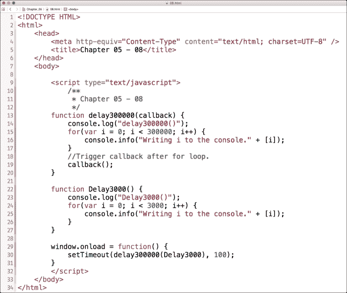

查看我们的代码示例，我们可以在第 13 行看到我们添加了一个名为`callback`的参数。重要的是要知道，在这里，我们`callback`方法的命名并不重要，但包含一个函数占位符参数是重要的。我们的占位函数，将作为我们的回调函数，是`Delay3000()`。

注意我们如何在第 22 行将`Delay3000`大写。这样做的目的是指示 JavaScript 解释器这是一个**构造函数**，一个需要在内存中初始化的函数。这是通过将函数名称的第一个字母大写来实现的。您可能还记得从第二章，*使用 JSLint 提高代码性能*，如果我们使用大写函数名，JSLint 将返回警告，它认为使用了构造函数，即使它是一个普通函数。为了不让我们的解释器猜疑，我们希望确保我们正在编写我们意图中的函数和对象。

最后，我们通过移除`delay3000`的额外`setTimeout`，更新了我们的`onload`函数的逻辑，并在`delay300000()`函数中的`setTimeout`函数里添加了重新命名的`Delay3000`（没有括号）作为参数。让我们再次在浏览器中运行这个，并查看我们的控制台的输出。

如果我们滚动到控制台日志的底部（在处理初始`delay300000()`函数调用之后），我们可以看到我们的`Delay3000`日志消息在完成初始函数后出现。使用回调是高效管理应用程序线程并确保重负载应用程序正确加载堆叠的好方法，让你在初始函数完成后传递参数。

### 关闭循环

最后，正如我们在`callback`方法示例中看到的，出于性能原因，通常不建议使用大规模的循环。总是寻找更好的、更有效的方法来分解大循环，并调用其他函数来帮助平衡工作负载。

此外，我鼓励大家去了解一下 JavaScript **promises**，这是 EcmaScript 6 的一个特性。虽然在这个书的写作时期，它还不足以讨论，因为承诺仍然处于实验阶段。我鼓励你，亲爱的读者，继续跟进，了解当它最终定型时，将取代 JavaScript 中回调的继任者。您可以在 Mozilla 开发者网络网站上了解更多关于承诺的信息：[`developer.mozilla.org/en-US/`](https://developer.mozilla.org/en-US/)。

# 总结

在本章中，我们学习了条件语句以及严格的比较如何帮助我们的 JavaScript 在运行时表现更好。我们还学习了循环以及如何优化循环，防止在`for`循环中重复不需要的对象，从而使我们的代码尽可能高效。

最后，我们还学习了在 JavaScript 应用程序中关于定时器和单线程的知识，以及如何使用回调来使我们的代码在过度加载的情况下也能尽可能流畅地运行。接下来，我们将讨论数组和原型创建的性能，并找出如何在 JavaScript 中最佳地使用它们。
