# 第六章：构造函数、原型和数组

既然我们已经熟悉了在没有 linter 或 IDE 测试代码的情况下优化 JavaScript，是时候深入研究更复杂的优化了，特别是当涉及到内存和对象创建时。在本章中，我们将探讨使用构造函数、原型和数组来优化大型 JavaScript 代码库。

我们计划在本书中覆盖以下主题：

+   使用构造函数和实例函数构建

+   使用原型实现替代构造函数

+   数组性能

# 使用构造函数和实例函数构建

在这里，我们将通过以下方式学习使用构造函数和实例函数：

## 闲言碎语

根据技能水平，跟随本书的我们中的一些人可能知道 JavaScript 中的原型，也可能不知道。如果你是那些听说过 JavaScript 中的原型但不是每天都在使用它们的读者，你不必担心，因为我们很快就会覆盖基本概念以及如何将它们应用于 JavaScript 性能。

如果你是那些知道闭包、继承、父子关系等概念的人，觉得自己属于后一种情况，因此想跳过这一章，我会鼓励你继续阅读，至少要浏览一下这一章，因为，作为 JavaScript 开发者，我们在使用 JavaScript 多年的时间里，往往会忘记一些常见的概念，而只是专注于影响我们性能的因素。

## 函数名称的维护

仔细观察下面这个简单的函数，看看你是否发现了这个函数的什么异常之处。

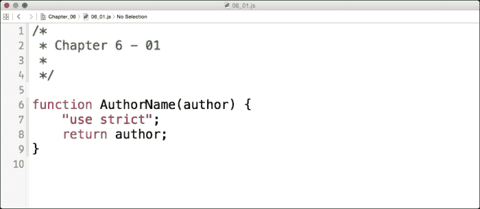

现在，当我们查看代码时，我们可以看到一个名为`AuthorName`的简单函数，它包含`author`参数。该函数使用了一个在第二章，*使用 JSLint 提高代码性能*中讨论的`use strict`语句，该语句强制**开发者工具**或其他类似检查器将该作用域中的任何警告视为错误。然后我们使用`return`关键字返回`author`参数。

这看起来相当正常；然而，让许多 JavaScript 开发者困惑的是函数名称的结构。注意`AuthorName`以大写字母*A*开头。在 JavaScript 中，当我们用大写字母声明一个函数名时，我们实际上是在告诉 JavaScript 解释器我们正在声明一个构造函数。

构造函数就是一个 JavaScript 函数，它的工作方式与其他任何函数都一样。我们甚至可以使用简单的`console.log`函数将作者的姓名打印到控制台，如下所示，使用**开发者工具**:

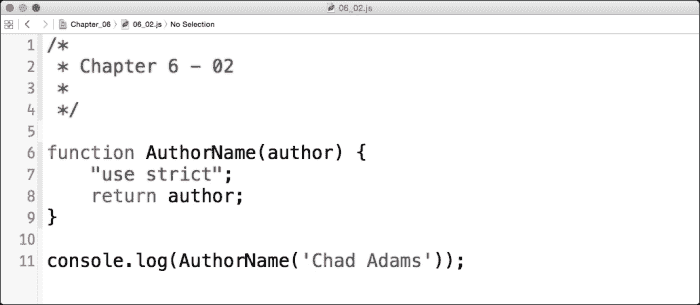

如果我们在这个`about:blank` **开发者工具**控制台或者带有以下代码的空白 HTML 页面中运行这个，我们会看到与预期一样的控制台输出，正如我们期望的那样。问题是，为了有效地使用构造函数，我们需要使用`new`关键字。

现在你可能会问，我们如何确定我们现有的 JavaScript 代码是否使用了构造函数。想象一个非常大的代码库，到处都是函数；如果连**开发者工具**选项都没有告诉我们需要使用`new`关键字而不是`static`函数调用的实例，我们如何检查这一点呢？

幸运的是，有一个方法。如果我们回忆在第二章*使用 JSLint 提高代码性能*中，JSLint 可以告诉我们是否需要使用`new`关键字。我已经添加了前面的代码示例，并在 JSLint 中启用了`console`和`browser`对象。查看 JSLint 在下述屏幕快照中呈现的错误：

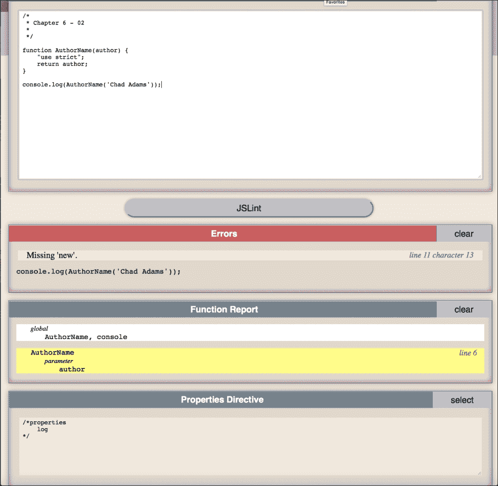

正如我们从 JSLint 看到的，在第 11 行我们得到了一个错误，`Missing 'new'`作为唯一的错误，这表明我们有一个构造函数，我们需要像这样使用它。

## 理解实例

现在解决这个问题的简单方法是将`AuthorName`函数的名称更改为驼峰命名法；也就是说，我们将`A`更改为小写（`a`）。但在这里我们要将其表示为一个实例，你可能要问为什么？嗯，在 JavaScript 中，每当我们编写一个对象、变量、函数、数组等时，我们都在创建对象。

通过使用实例，我们可以降低对象的使用。在 JavaScript 中，实例在内存中只计算一次。例如，假设我们使用一个`document.getElementById()`方法。每个用该对象保存的变量都只有一次内存计数，但如果它在用`new`关键字声明的对象中，这个计数只计算一次，而不是为每次`getElementById()`的出现重复使用。使用`new`关键字，我们可以创建我们构造函数（在这个例子中是`AuthorName`）的一个实例，允许我们以通常的方式重用那个函数。

### 使用'new'创建实例

创建一个新的实例相当简单；我们只需调用一个新的实例来运行一个函数，如以下屏幕快照所示，在我们的`console.log`函数第 11 行使用`new`关键字：

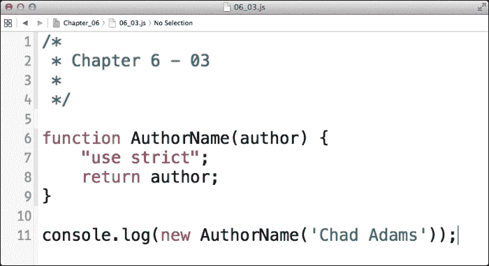

如果我们在一个空白页面或一个简单的 HTML 页面中运行这段代码，我们会发现我们的日志输出方式并不如我们所期望。但在**开发者工具**的**控制台**面板中，我们可以看到一个对象返回`AuthorName {}`。这告诉我们，我们实际上是在记录一个新对象实例，而不是作者的名字。

为了正确显示这个名字，我们需要一个关键字来声明对构造函数实例的引用。为此，我们将使用`this`关键字；在 JavaScript 中，`this`是对执行作用域中确切点的引用。

在 JavaScript 中，`this`关键字指的是在脚本执行时使用时的作用域和变量。例如，当在函数中使用`this`关键字时，它可以引用与它处于同一作用域（或嵌套在函数中）的变量。通过使用`this`关键字，我们可以指向代码执行中某个点的变量和对象。

一个**作用域**就是一个拥有它自己变量和属性的 JavaScript 代码块。作用域可以包括单个 JavaScript 对象的全球化作用域，也就是说，一个完整的 JavaScript 文件，一个函数级作用域，其中变量和属性是在函数内部设置的，或者，如前面讨论的，一个构造函数，因为构造函数是一个函数。

让我们用`this`关键字重写我们的`AuthorName`构造函数，以便我们可以引用我们的作用域并在**控制台**面板中打印我们的值。我们需要在构造函数内部创建一个初始化器，以便返回我们的作用域变量。初始化器（有时称为`init`函数）在我们的构造函数内部指定某些变量并在创建时分配属性。

在这里，我们使用`this`关键字前缀来创建一个变量，以表示我们正在引用我们构造函数内的实例，后跟我们称为`init`的函数，这等于一个函数，就像我们使用变量来声明一个函数一样。让我们在下一张截图中看看这段代码：

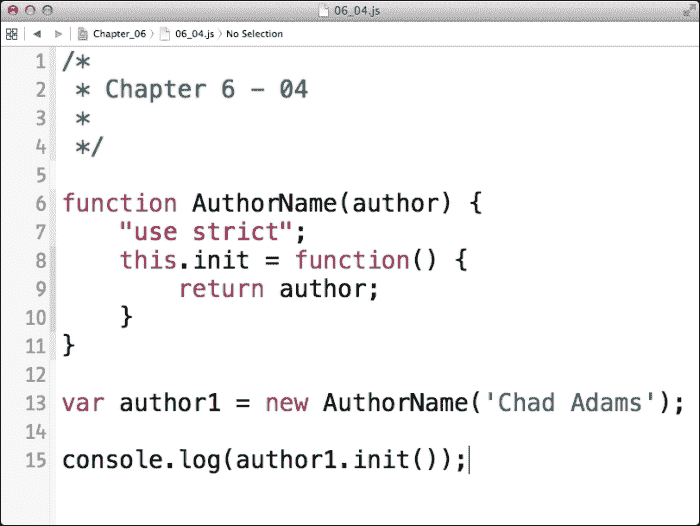

看看第 13 行和第 15 行；在第 13 行，我们声明了一个名为`author1`的变量，它使用`new AuthorName`构造函数并带有`Chad Adams`字符串参数。在这个例子中，`author1`是`AuthorName`构造函数的一个实例，其唯一参数是`Chad Adams`。

还请注意，在第 15 行我们的`console.log`中，有一个名为`init()`的函数，它是我们的构造函数的一个内部函数。我们也可以在我们的构造函数中创建其他函数，例如像下面所示打印自定义日志消息：

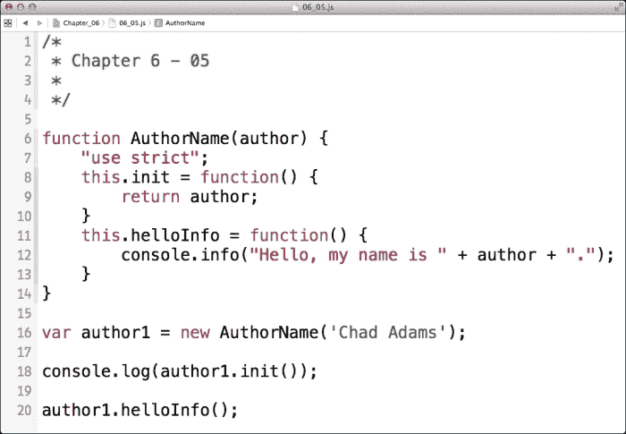

正如我们在第 11 行所看到的，我们现在添加了一个`helloInfo()`函数，它属于我们的`AuthorName`构造函数，该函数使用`author`参数打印出一条自定义消息。然后，在第 20 行，我们通过简单地调用构造函数来调用这个函数，而没有使用`console.log`，这个构造函数有自己的`console.info`函数。

这有助于我们将逻辑局限于我们代码库中的一个单一对象，并使我们的代码井然有序。这称为面向对象；它在代码复用方面非常出色，但可能会在 JavaScript 的性能方面引起问题。让我们试一个例子。在这里，我们有两个相同的代码示例，每个都包裹在一个`console.time`和`console.timeEnd`函数中。下面的截图显示了我们的审查代码和渲染代码的结果时间：

所以，我们在这里的总时间大约是 2.5 毫秒。这还不算太坏，但现在让我们看看如果我们使用简单的非构造函数会发生什么，以及渲染相同输出的速度会是怎样的。如图所示，我把我们的构造函数拆分开来，创建了两个独立的函数。

我还以与我们的`console.log`函数完全相同的方式在次要函数中调用主要的`authorName`函数来打印作者的姓名。让我们运行下面截图中显示的更新后的代码，看看这比我们的构造函数方法是运行得更快还是更慢。然而，要记住，根据我们的系统速度和浏览器，结果可能会有所不同。

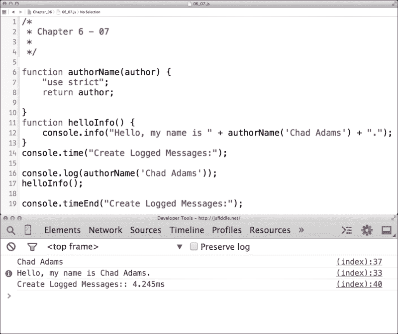

所以，使用静态函数我们的结果一直在 4 毫秒左右，这比我们用实例构建的对象要长。所以，在 JavaScript 中使用静态函数而不是原型函数是一个很好的用法！

# 使用原型实现替代构造函数

在这里，我们将学习关于使用原型实现替代构造函数的概念。

## 从内存的角度理解原型

我们介绍了如何在构造函数内部创建实例函数，也学习了使用`this`关键字在内部使用作用域。但是，还有一件事要介绍：在构造函数外部为构造函数添加另一个实例方法的能力，这在很多方面都有帮助。首先，它允许我们作为开发者，在需要时在预写的构造函数外部创建函数。接下来，它还保持了我们的内存使用量小。在深入这个话题之前，让我们重新调整我们的构造函数代码以使用原型，如图所示：

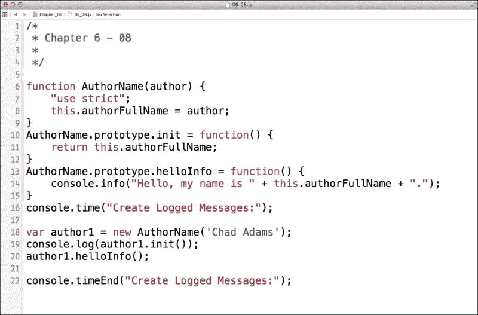

现在看看这个更新后的代码，我们可以看到构造函数已经被移除，但被拉出构造函数：它们然后被移动到`AuthorName`函数的原型中，使用的是之前用过的同一个函数名。现在，您可以看到，在 10 行和 13 行，我们可以在我们的原型函数中使用`this`，因为我们正在引用我们构造函数的实例来打印那个实例的特定变量。

## 原型和构造函数哪个更快？

你可能会再次注意到，我在第 16 行到第 22 行再次添加了`console.time`和`console.timeEnd`函数到我们的函数调用中。那么你觉得原型相比于标准的构造函数会更快还是更慢呢？嗯，接下来我们可以在下一个屏幕截图中查看结果：

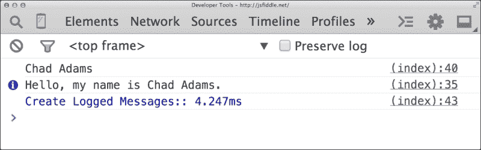

哇，与使用构造方法的 2.1 毫秒相比，原型在触发时需要 4.2 毫秒；这里发生了什么？我们本质上是在构造器之后创建了函数。输出很慢，但这是可以预料到的，因为原型的意图是与构造器一起使用。

在这个时候，我们可能会想：“哇，我从来不知道这些，我再也不会编写原型了！”现在，在我们开始从项目文件中删除原型之前，我想解释一下原型的可扩展性。确实，当为构造函数调用原型时，它们可能会更慢……“在小规模上”。我说的“在小规模上”是什么意思？嗯，像这个特定例子这样的小规模原型使用，我们可以看到原型的运行速度比传统的构造方法慢。

现在这里有个问题；对于更大的项目，大规模应用中的构造器可能有 50 个函数、200 个函数等等。当我们一次又一次地调用这些大的构造器时，仅调用构造器的实例在内存方面就会变得相当昂贵，因为它必须准备包含在内的所有函数。

通过使用原型方法，最初的构造器调用只会在内存中存储一次。对于小规模的原型使用，由于我们像使用简单的静态函数一样原地使用内存，所以性能提升并不明显，但是一旦设置好，它就会保存在内存中，不需要像静态 JavaScript 函数那样被重新召回或重新处理。

关于原型继承还有一点，虽然其使用可能会导致性能问题，但对于大型代码库来说，它可能非常有帮助。如果一个项目有范围担忧或使用可能引起冲突的库，可以考虑使用命名空间。这与原型类类似，但函数像简单的静态函数一样，以命名空间前缀来防止冲突。

# 数组性能

我们通常在处理性能问题时不会考虑数组，但在这里值得一提。首先，大型数组在处理大量数据时可能会很乱，并且是性能的消耗者。通常在数组方面，我们只需要担心两件事：搜索和数组大小。

## 优化数组搜索

让我们创建一个包含很多值的数组；在这里，我创建了一个名为`myArray`的数组，其中包含 1001 个值，以及数组的键和索引的字符串值。你可以在上面的网站的`Chapter_6`文件夹中的`06_09.js`文件中找到完整的版本。以下是整个数组的代码样本的一部分：

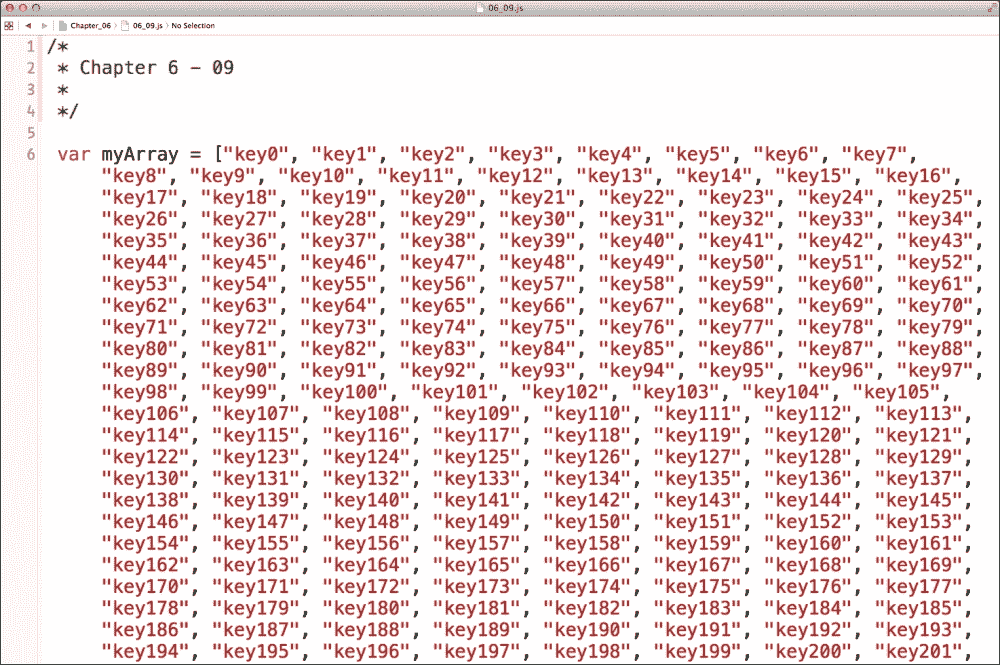

在数组中查找值有两种方法；第一种使用`indexOf()`函数，这是一个数组特定的函数，查找每个值并返回搜索到的值的索引。另一种方法是直接指定索引值，返回该值（假设我们知道需要值的索引）。

让我们尝试一个实验，我们将使用一个预制的`myArray`，包含 1001 个值，并使用`indexOf()`函数遍历它们，然后再用一个数组遍历。我们在`myArray`后面附上了代码，并用`console.time`和`console.timeEnd`函数包围了此代码块，如下所示，在 Chrome **开发者工具**中呈现时间：

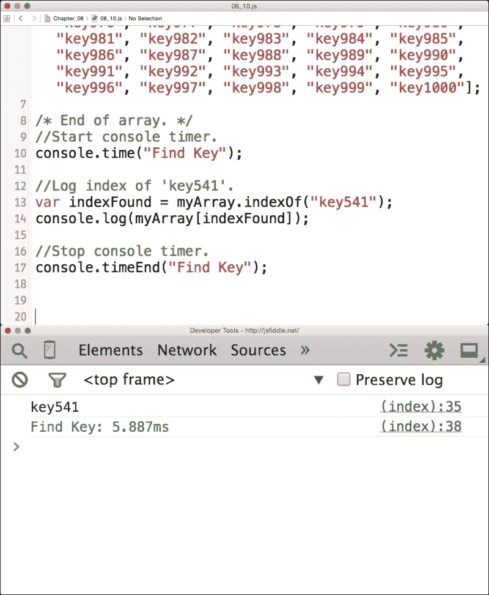

这表明我们搜索这个大型数组的结果大约是 5.9 毫秒。现在，为了我们的比较，我将保留我们的`indexFound`变量，尽管我们可以简单地指定我们需要的数组值的索引。我们还将使用相同的索引值搜索，即`541`。让我们像这样更新我们的代码，并在 Chrome **开发者工具**中查看我们的结果：

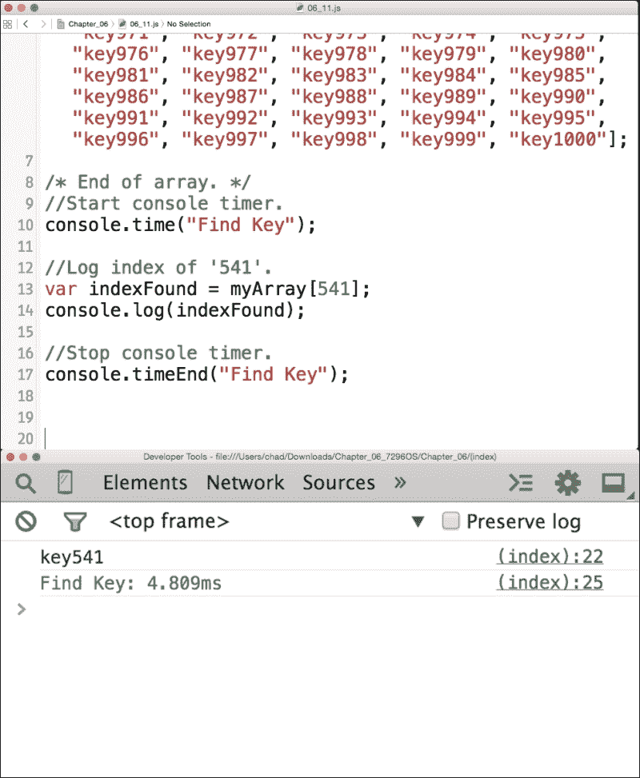

看起来我们的结果大大缩短了我们的索引搜索性能时间。所以，当你在 JavaScript 中构建数组时，只有在你需要的时候才使用`indexOf`，并且尽可能直接调用索引。那么时间输出为什么会有这么大的差异呢？很简单；在第二个例子中，我们手动指定了数组的位置，而不是让 JavaScript 自己查找键。这加快了 JavaScript 解释器遍历我们的数组并提供值的速度。

# 总结

在本章中，我们学习了构造函数的正确使用方法。我们学习了使用`new`关键字在 JavaScript 中创建实例，并发现我们可以在同时作用域我们的代码时通过构造函数加速静态代码。

我们学习了原型以及它们在大应用程序中扩展得很好，而在小项目中添加的价值很少。最后，我们还学习了数组搜索以及使用`indexOf`函数时的性能损失。

在下一章中，我们将学习如何编写我们的 JavaScript 代码来优化我们的文档对象模型（DOM）以适应我们的项目。
