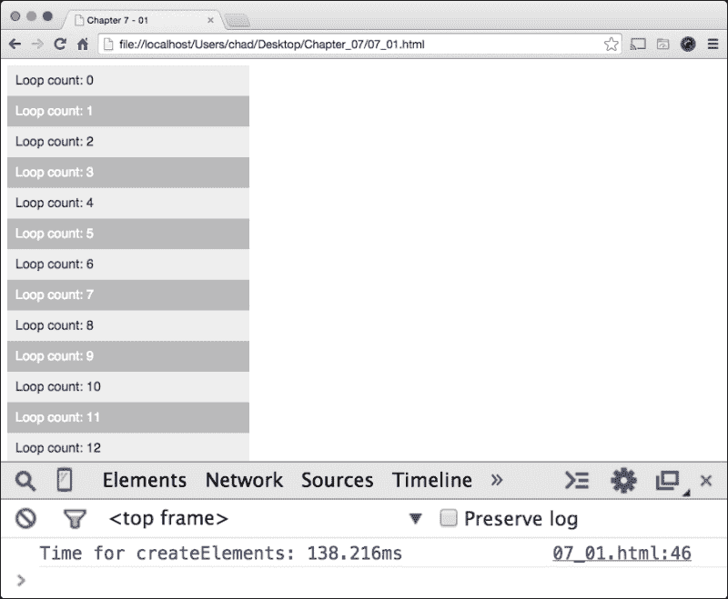

# 第七章：不要碰 DOM

在本章中，我们将回顾与编写高性能 JavaScript 相关的 DOM，并了解如何优化我们的 JavaScript 以使我们的网络应用程序可见地更快渲染。

我们还将查看 JavaScript 动画，并测试它们与现代 CSS3 动画的性能；我们还将测试与页面关联的绘制重绘事件在 DOM 中，并快速测试可能影响性能的滚动事件。

我们将在本章中涵盖以下主题：

+   为什么担心 DOM？

+   我们需要一个 MV- whatever 库吗？

+   使用 `createElement` 函数创建新对象

+   动画元素

+   理解绘制事件

+   讨厌的鼠标滚动事件

# 为什么担心 DOM？

**文档对象模型**（**DOM**）是我们 HTML 内容在网络浏览器中的呈现方式。这并不完全相同于源代码；DOM 是我们源代码的实时更新版本，当我们在大纲浏览器中对网络应用程序的页面进行更新时。

我们可以说，优化快速的 JavaScript 肯定有助于我们的应用程序运行和表现更好，正如我们在之前的章节中学到的。但重要的是要理解，DOM 对 JavaScript 性能的重要性不亚于理解如何优化一个 `for` 循环。

在 Web 的早期时代，我们作为网络开发者并没有过多考虑 DOM。如果我们思考一下 JavaScript 的发展历程，我们可以看到网络开发世界发生了许多变化。如果我们回忆起谷歌之前的网络时代，我们知道网站相当简单，用户交互主要限于超链接标签和一个偶尔的 JavaScript `window.alert()` 函数以显示某种应用程序交互。

随着时间的推移，我们遇到了 Web 2.0，或者说，**异步 JavaScript 和 XML**（**AJAX**）诞生的时刻。如果你不熟悉 AJAX，我想总结一下：AJAX 网络应用程序允许开发人员从外部源拉取内容，通常是 XML 文件，（这是 AJAX 中的 X）。

使用 AJAX，网站内容突然变得动态，这意味着开发人员不必依赖后端技术来刷新带有更新数据的网络页面。突然之间，对更强大的 JavaScript 需求应运而生。企业和他们的客户不再希望网站以页面闪烁（或使用后端技术通过 `POST` 提交方法更新页面）的方式响应，尤其是像 Google Maps 和 Gmail 这样的网站，它们似乎在推动网络作为软件平台而非桌面操作系统平台的想法。

# 我们需要一个 MV- whatever 库吗？

如今，我们有框架可以帮助处理这类应用程序的繁重工作；AngularJS、Backbone.js、Knockout.js 和 jQuery 是几个想到的库。

然而，对于这本书，我们将坚持使用原生的 JavaScript，原因有两点。第一个原因是，许多这样的库都有自己的书籍，讨论性能和各种经验级别，这些都是很好的，但超出了本书的范围。第二个原因是，大多数开发者通常不需要这些库来构建项目。

请记住，这里提到的所有 JavaScript 库，以及网络上找到的所有库，都是 JavaScript！对于大多数项目，我们不应该需要一个库来使项目按照我们想要的方式构建；此外，这些库中有很多额外的代码。

我的意思是，这些库带有可能不需要的特性和功能，除非库是模块化的，否则很难在不删除不需要的功能的情况下使用它。如果你在一个团队环境中工作，其他人可能正在为应用程序的某些区域使用共享库，这些区域可能使用一些功能，但不是全部。

我们将在第九章*为 iOS 混合应用优化 JavaScript*中探讨移动 JavaScript 性能。我们会发现这些库变得更加沉重。现在话说回来，让我们看看一些常见的 DOM 破坏方式，以及如何使其表现更好。

# 使用`createElement`函数创建新对象

在这里，我们将学习如何使用`createElement`函数以及以下三个主题来创建新对象：

+   绕过`createElement`函数

+   使用`createElement`函数工作

+   何时使用`createElement`函数

## 绕过`createElement`函数

在 JavaScript 中，我们可以使用`document.createElement()`函数创建新的页面元素，并使用`document.createTextNode()`函数在生成的元素内部放置文本对象。通常，创建新元素以将其注入我们的 DOM 可能会消耗一些渲染资源，以及如果生成了多个元素，交互性能也会受到影响。

## 使用`createElement`函数工作

让我们测试一下`createElement`函数将内容渲染到屏幕上的效果。这是我们的测试：我们将使用`for`循环创建一个包含大量数据的表格。我们将使用文本对象填充表格单元格，该文本对象包含`for`循环迭代的计数。然后，我们将查看一个使用不同代码实现的创建相同效果的替代版本，并比较两者。让我们看看使用`createElement`函数的第一个选项，如下所示：

在这里，我们有一个简单的 HTML5 页面，在`head`部分有一些格式化的 CSS 样式，在第 21 行有一个空的占位符`div`元素，其`id`设置为`datainsert`。在第 25 行，我们有一个`匿名函数`，在加载到浏览器后立即运行；在第 26 行，我们开始一个`console.time`函数，以开始计算我们的 JavaScript 执行时间。然后我们在第 27 行创建一个表格元素变量`tableElem`；在第 28 到 31 行，我们设置一些属性，以帮助格式化我们的表格。

然后在第 33 行，我们开始我们的`for`循环；在`for`循环的作用域内，我们创建一个表格行元素、一个表格单元元素和一个文本节点，以将文本插入到我们生成的表格单元中，从第 35 行的`cellContent`变量开始，第 36 行的`tableTr`变量，第 37 行的`tableTd`变量。在第 39-41 行，我们将生成的单元格添加到表格中，并继续循环`10000`次。最后，我们将表格元素添加到页面上的`datainsert` div 元素中，以渲染我们的内容。让我们在浏览器中运行这个，并看看使用 Chrome **开发者工具**选项渲染内容需要多长时间。

如我们所见，这需要相当多的处理时间，在大约 140 毫秒的 Chrome 中，这是一个相当长的渲染时间。你可以在构建消息客户端或显示 JSON 数据时考虑这样做。无论什么情况，使用`createElement`函数的成本是相当大的，应该只在小范围内使用。

生成这种表格数据的其他方法，但不使用`createElement`函数，是使用`innerHTML`属性。这个属性提供了一种简单的方法，可以完全替换元素的 contents，并且赋值的方式与给变量赋值相同。当使用`innerHTML`属性时，你可以不刷新页面就改变页面的内容。这可以使你的网站感觉更快、对用户输入更有响应性。这个属性也可以使用`+=`附加运算符进行追加。知道了这个，我们可以以稍微不同的方式构建我们的代码基础。我们所做的是在下面的屏幕截图中显示：

这个布局应该与我们的`createElement`函数示例非常相似。在第 21 行，我们有一个相同的`datainsert` div；在第 25 行，我们的`匿名函数`开始执行。现在在第 28 行，我们看到有些不同；在这里，我们可以看到一个名为`tableContents`的字符串变量的开始，它是一个带有与前一个示例相同属性的 HTML 表格的开始。这就像我们之前使用`createElement`函数一样，只不过这次我们使用了一个 JavaScript 字符串形式的 HTML 标记，而不是一个 DOM 对象。

接下来，在第 30 行，我们开始我们的`for`循环，并将`tableContents`字符串与添加了表格行和表格单元格的新字符串一起附加，将 for 循环的迭代次数插入到单元格中，再次计数为 10,000 次。

当循环在第 35 行完成时，我们将我们的字符串附加以表格的闭合括号。最后，在第 37 行和 38 行，我们使用`innerHTML`属性，将我们的表格写入`datainsert` div 元素的`innerHTML`属性中。让我们在浏览器中运行这个例子并查看其处理时间。

这次我们的表格渲染时间大约为 40 毫秒，这比我们使用`createElement`函数的速度快了近四倍。这是一个巨大的速度提升！在 Chrome 中视觉效果也更快。

## 何时使用 createElement 函数？

尽管`createElement`函数速度较慢，但在生成复杂布局的 HTML 时，有时它会更 helpful，复杂的应用程序会生成比`innerHTML`属性可以样式化容纳的更多元素。

如果确实如此，这更多的是为了方便开发团队在修改元素类型时的可用性和易用性，而不是为了更新满足应用程序需求的完整字符串。无论如何，如果您需要创建 HTML 元素，`innerHTML`属性总是更快的。

# 动画化元素

在*Web 2.0*时代，JavaScript 的一个更加令人印象深刻的使用方式出现了，当时 AJAX 正在变得越来越受欢迎；另一种有趣的想法以 JavaScript 动画的形式出现。这些动画是通过简单地反复迭代一个元素的样式来创建的，该元素使用`setInterval`函数设置左上角位置，然后在元素达到终点后撤销它。这使得 div 似乎在页面上进行了微调或动画化。

## 以传统方式动画化

大多数 JavaScript 开发者都熟悉使用流行的 DOM 操作库 jQuery 进行动画制作，使用`animate`函数创建 DOM 动画。但是，由于我们在这本书中讨论的是纯 JavaScript，让我们来看一个从零开始构建的例子。查看以下屏幕截图中的代码：

在这个例子中，我仅仅使用 JavaScript 创建了一个 WebKit 友好的动画（这意味着这只能在 Google Chrome 和 Apple Safari 浏览器中正确显示）。在第 7 行，我们设置了一些基本样式，包括一个带有`id`为`dot`的黑点 div 元素。

现在在第 27 行和 28 行，我们分别声明了`dot`和`i`变量。然后，在第 31 行，我们创建了一个名为`interval`的变量，这实际上是一个传递给`setInterval`函数的参数。在此代码中，它是每毫秒一次，这在第 38 行显示。在`setInterval`函数内部，我们将`i`变量的计数增加`1`，并更新`dot`元素的位置。最后，当`i`变量的值严格等于`450`时，我们使用`clearInterval`函数清除我们的`interval`变量，从而停止`setInterval`函数进一步处理。如果我们看看这个，我们可以在浏览器中使用纯 JavaScript 看到一个简单的动画淡入淡出。这在下方的屏幕截图中显示：

现在，你可能会认为以这种方式创建`setInterval`函数可能是个问题，你可能是对的。幸运的是，我们现在作为开发者在创建这类动画时，为我们的 HTML5 应用程序有了另一种选择！

## 使用 CSS3 动画

让我们用仅 CSS3 和 JavaScript 来重建这个例子，以触发动画。再次，我们仅仅为 WebKit 内核浏览器进行样式设计，仅为简化。下面屏幕截图所示的是更新后的代码样本：

通过这个例子，我们可以看到我们的 JavaScript 代码行要少得多，这是件好事；它使我们的内容样式纯粹基于 CSS，而不是使用 JavaScript 逻辑来样式化内容。

现在，在 JavaScript 方面，我们可以看到我们在第 39 行使用了相同类型的`匿名函数`，不同的是，我们设置了一个超时时间，以触发`dot`元素添加一个激活类属性，从而在 CSS3 中触发动画。这在我们示例的第 19 至 30 行中显示。

## 不公平的性能优势

在这本书中的许多代码示例中，我使用了`console.time`和`console.timeEnd`来回顾性能，这个例子也不例外。你可能注意到了，我将每个动画示例都包裹在一个`time`和`timeEnd`函数中，以测量处理时间正如下面的屏幕截图所示，它有点片面：

正如我们在之前的屏幕截图中所看到的，JavaScript 处理时间大约是 1900 毫秒，而 CSS3 动画大约是 0.03 毫秒。现在，在得出 CSS3 方法更好的结论之前，我们必须记住，我们仅用 CSS3 来渲染页面，而 JavaScript 只处理动画的触发。这仍然更有效率，但应注意 JavaScript 处理的是更少的代码。

现在对于新浏览器，这是构建内容动画的推荐方式，因为迄今为止已经看到了性能改进，无论是由 JavaScript 还是其他方式实现的。然而，一些项目需要支持旧浏览器，这些项目可能无法访问 CSS3 转换和动画，或者我们在升级应用程序的动画部分的同时仍然保持兼容性。以下是在使用与之前相同的基于 JavaScript 的动画时实现这一点的一种方法：

在这里，我们修改了最初的 JavaScript 示例，通过更新`dot`元素的位置；然而，我们在第 17 行和第 18 行添加了两条 CSS。第一个是一个`-webkit-transform`和`translate3d`属性，它只设置元素不改变位置；在旧浏览器或非 webkit 重点浏览器上，这个属性将被忽略。但在这里，它只是将元素的位置设置为初始位置，这听起来很傻，实际上也确实如此！

这实际上告诉 DOM 运行时，这需要作为一个独特的图形进程运行；它还告诉浏览器设备上的**图形处理单元**（**GPU**）快速绘制这个元素！同样的可以说对于`will-change`，这是一个类似的属性，它做的和`translate3d`属性一样的事情，不同的是它不是更新位置，而是告诉 GPU 以非常高的频率重新绘制这个元素，并期待它在 DOM 中发生变化。现在，这种做法被称为将元素添加到合成层。我们将在第九章，*为 iOS 混合应用优化 JavaScript*中更深入地介绍合成层。但现在，这就是我们在这里做的事情；这样，新浏览器仍然可以使用遗留的 JavaScript 动画获得一些视觉速度提升。

# 理解绘制事件

绘制事件是 DOM 事件，它会导致 Web 浏览器在 DOM 用 JavaScript 更新时绘制网页。对于内存较低的浏览器来说，这可能是一个问题，因为绘制事件需要大量的处理和图形渲染才能在大规模显示更新。

## 如何检查绘制事件？

通常，您可以在 Web Inspector 的时间线视图中找到绘制事件。由于绘制事件在 Web 浏览器中执行页面的过程中按时间顺序显示，因此在 Chrome 的**开发者工具**选项中这些显示略有不同。

打开 Chrome 的**开发者工具**选项，点击抽屉图标（它在**开发者工具**选项上方的右侧齿轮图标旁边）。接下来，在抽屉中打开**渲染**标签，然后点击**显示绘制矩形**选项。完成后，刷新页面。页面加载时，我们会看到页面的不同区域被绿色突出显示。这些是正在加载屏幕上的绘制事件。以下是一个使用我们的动画并显示在 Chrome 的**开发者工具**选项中启用绘制矩形的示例：

注意绿色正方形在页面加载时出现，以及在动画完成时再次出现。这是因为 DOM 仅在页面加载或动画结束时重绘浏览器窗口。

偶尔，项目可以仅使用 JavaScript 创建相当复杂的动画。为了找出我们的 JavaScript 逻辑错误，并确保绘制事件没有造成问题，我们可以在 Chrome 的**开发者工具**中使用连续页面重绘功能。

## 测试绘制事件

为了测试这个，我们设置了一个带有内置错误的 JavaScript 动画，如图所示：

这应该与我们在本章中构建的早期动画看起来非常相似。但如果我们查看第 35 至 38 行，我们可以看到有一个条件`else if`语句，检查我们的递增变量`i`是否在 250-258 范围内；如果是，`dot`元素的`left``style`将被移除。

当我们运行这个测试时，动画达到这个点时我们应该会遇到一个闪烁。我们可以通过在 Chrome 的**开发者工具**中启用连续页面重绘来验证这是否真的是一个 JavaScript 问题。

为此，打开**开发者工具**选项，打开抽屉，点击抽屉中的**渲染**标签。然后我们可以检查**启用连续页面重绘**和**显示绘制矩形**选项。当我们这样做时，我们的网页应该显示一个绿色覆盖层，并在浏览器窗口的右上角显示一个信息框。以下屏幕截图显示了这一点：

现在，当我们重新加载页面，动画再次播放时，我们的`dot`元素应该在整个动画期间显示一个绿色的矩形框。这是 Chrome 强制页面不断重绘以更新动画。正如我们所看到的，即使在我们的预设错误发生时，矩形框仍然在点上，这表明了一个 JavaScript 问题。如果这是一个真正的绘制问题，当重绘出现问题时，矩形框会消失。

# 讨厌的鼠标滚动事件

绘制事件（或缺乏 thereof）并不是当你使用 JavaScript 工作时影响网络应用程序性能的唯一问题。对浏览器窗口或文档应用的滚动事件可能会对应用程序造成混乱；不断通过滚动鼠标触发事件，更不用说触发多个事件，永远都不是一个好主意。

如果我们正在编写一个应用程序，我们知道我们的应用程序是否有多个事件添加。但如果我们被交了一个需要更新的网络应用程序，Chrome 的**开发者工具**中有一个工具，可以让我们 visually check for scroll events。

让我们创建一个简单的示例来展示这个功能是如何工作的，以及它在尝试优化 DOM 界面时在寻找什么。为此，我创建了一个`mousewheel`事件，它将捕获鼠标指针相对于页面的*X*和*Y*坐标，并在具有`id`为`txtfield`的输入字段中打印出来；每当 I 移动鼠标滚轮时，它都会触发。让我们看看以下代码示例：

从这里我们可以看到页面本身相当轻，但在第 23 行，我们可以看到`mousewheel`事件监听器在起作用，使用`getMouseLocation`函数在第 26 行添加了一个持续的事件。然后在第 27 行，我们的具有`id`为`txtfield`的输入字段被分配了一个字符串，其中包含鼠标事件信息，抓取鼠标指针的`X`和`Y`坐标并将其应用于`txtfield`的值。现在让我们看看**开发者工具**如何突出显示滚动性能问题。

打开抽屉，打开**渲染**标签，然后点击**显示潜在的滚动瓶颈**。这将突出显示在 JavaScript 中分配了滚动事件的块区域；下面是我们示例在启用过滤器时的样子：

现在，这本身在性能方面并不是太糟糕，但是具有多个鼠标移动事件的应用程序可能会潜在地引起问题，如果移动区域重叠，问题会更严重。如果我们将在文本区域中添加相同的事件监听器并从文档中删除监听器，我们会在**开发者工具**过滤器中看到多个滚动监听器的实例吗？让我们通过查看本章最终示例文件`07_08.html`的输出来找到答案：

当然不是！正如我们所看到的，即使在一个元素上启用了`mousewheel`事件，整个页面也会被突出显示。由于`mousewheel`事件可以在 DOM 的顶部进行检查，即使一个应用程序只关注一个`mousewheel`事件的很小元素，整个页面也会受到影响。

因此，记住`mousewheel`事件是很重要的，因为它们可能会潜在地减慢您页面的性能。

# 总结

在本章中，我们介绍了 JavaScript 如何影响 DOM 的性能；我们回顾了`createElement`函数，并学习了如何更好地编写我们的 JavaScript 以优化从代码生成元素。

我们还回顾了 JavaScript 动画，并将其性能与现代 CSS3 动画进行了比较。我们还学习了如何优化现有或遗留的 JavaScript 动画。

最后，我们回顾了在 DOM 中处理绘图事件，并了解了当 JavaScript 对其进行操作后，DOM 是如何重新绘制其内容的；我们还介绍了 `mousewheel` 事件，并看到了它们如何可能导致 DOM 的性能下降。

在下一章中，我们将探讨 JavaScript 性能提升的新伙伴：*web 工作者*，以及如何让 JavaScript 表现得像一个多线程应用程序。
