# 第八章：Web 工作者和承诺

在之前的章节中，我们解决了一些在通用 JavaScript 开发中常见性能问题。现在，我们来到了一个假设我们的项目可以支持新 JavaScript 特性的点，我们可以使代码比以前表现得更好。

这就是 Web 工作者和承诺发挥作用的地方。在本章中，我们将探讨两者并了解如何以及何时使用它们。我们还将发现它们的局限性，并理解它们在提高高性能 JavaScript 方面的优势。

# 首先理解局限性

在深入探讨 Web 工作者和承诺之前，我们需要了解与 JavaScript 语言本身有关的一个问题。如前几章所述，JavaScript 是单线程的，无法支持同时运行两个或更多方法。

多年来，作为 JavaScript 开发者，我们实际上从未真正关心过线程，更不用说本书中介绍的 JavaScript 内存问题了。我们的代码大部分存在于浏览器中，在同一页面内以内联方式运行，或者与同一服务器上的文件外部链接，以实现基本网页功能。

随着 Web 的发展，原本的前端编码对于高性能应用程序变得越来越必要，处理更大 JavaScript 应用程序的新方法也应运而生。今天，我们将这些新特性视为 ECMAScript 5 特性集的一部分。

在 ECMAScript 5 中，许多这些特性被整合到许多人认为的 HTML5 堆栈中。这个堆栈包括 HTML5（`DOCTYPE`和`HTML`标签）、CSS 3.0 版本和 ECMAScript 5。

这些技术使得 Web 比 AJAX 和 XHTML 开发时代强大得多。局限性在于这些特性是尖端技术，可能与所有浏览器都兼容，也可能不兼容。因此，在项目实施之前，使用这些新特性通常需要仔细思考。

我们从第二章*使用 JSLint 提高代码性能*开始就已经讨论过这些特性，包括`use strict`声明，它强制浏览器在 JavaScript 代码有严格书写或编码错误时抛出错误。也许你会问，既然`use strict`在所有浏览器中都得不到支持，我们为什么还要使用它。`use strict`声明的技巧在于，当为老浏览器编写时，它显示为一个字符串并被忽略。

这是一件好事，因为即使它在老浏览器中被忽略，我们仍然可以使用这个新特性并编写更高效的代码。不幸的是，这并不能推广到 ECMAScript 5 的所有特性；这包括 Web 工作者和承诺。

因此，在本章中，让我们记住，从现在开始，在处理代码示例时，我们需要将测试和编码集中在像 Google Chrome、Opera、Firefox 或苹果的 Safari 这样的较新浏览器上，甚至包括遵循相同标准的 Internet Explorer 的新版本。

# 网页工作者

网页工作者为我们这些 JavaScript 开发者提供了一种构建多线程 JavaScript 应用程序的方法；这项技术在较新的浏览器中可行，因为我们有一个名为**工作者**的对象。工作者对象本质上是一个外部的 JavaScript 文件，我们向其传递逻辑。

现在，这可能看起来有点奇怪。自从 JavaScript 诞生以来，我们不是一直在使用外部 JavaScript 文件吗？这个观点是正确的，但是网页工作者在浏览器处理 DOM 中文件执行的方式上有点新。让我们看看以下示例图表，了解浏览器如何读取文件：

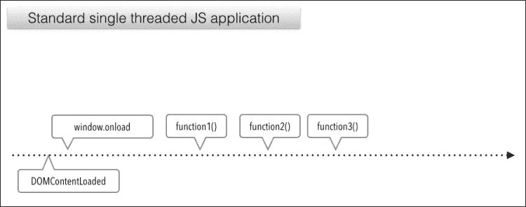

所以，这里我们有一个单线程 JavaScript 应用程序，一个`DOMContentLoaded`事件，紧接着是`window.onload`事件，然后是简单命名的函数：`function1`、`function2`、`function3`分别触发。现在，如果我们的`function2()`函数执行一些复杂的`for`循环，比如计算 500 万次π，而`console.log(Shakespeare)`正在检查时间呢？好的，我们可以从以下图表中看到：

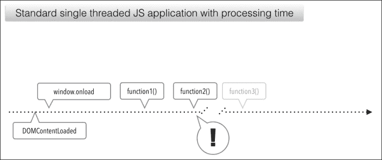

正如我们所看到的，一旦浏览器调用`function2()`，它会锁定并挂起，直到它能完成其执行，（假设运行代码的系统有足够的内存来执行）。现在要修复这个问题的一个简单方法可能是说：“嘿，也许我们不需要检查时间，或者也许我们只想计算一次π以提高性能。”。但是，如果我们别无选择，只能以这种方式编写代码呢？也许我们的应用程序必须那样工作，因此我们被迫编写一个复杂、性能缓慢的函数，这个函数执行缓慢；为了应用程序的成功，具有这种逻辑的函数必须触发。

好吧，如果我们必须要构建这样的应用程序，我们的解决方案就是网页工作者。让我们看看这与我们的单线程图表相比是如何工作的：

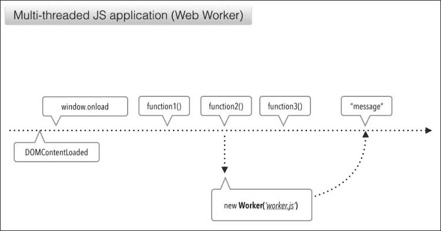

在我们的示例中，我们可以看到在图表中创建了一个新的工作者，它指向一个名为`worker.js`的外部 JavaScript 工作者文件。那个工作者以消息的形式发送一个响应。使用网页工作者，消息是我们在宿主脚本和工作者数据之间传递数据的方式。它的工作方式与 JavaScript 中的任何其他事件类似，都使用`onmessage`事件。

那么，在编码应用程序中这是怎样的呢？嗯，让我们找出答案！

以下屏幕快照中的代码示例以与前面图表类似的方式构建：

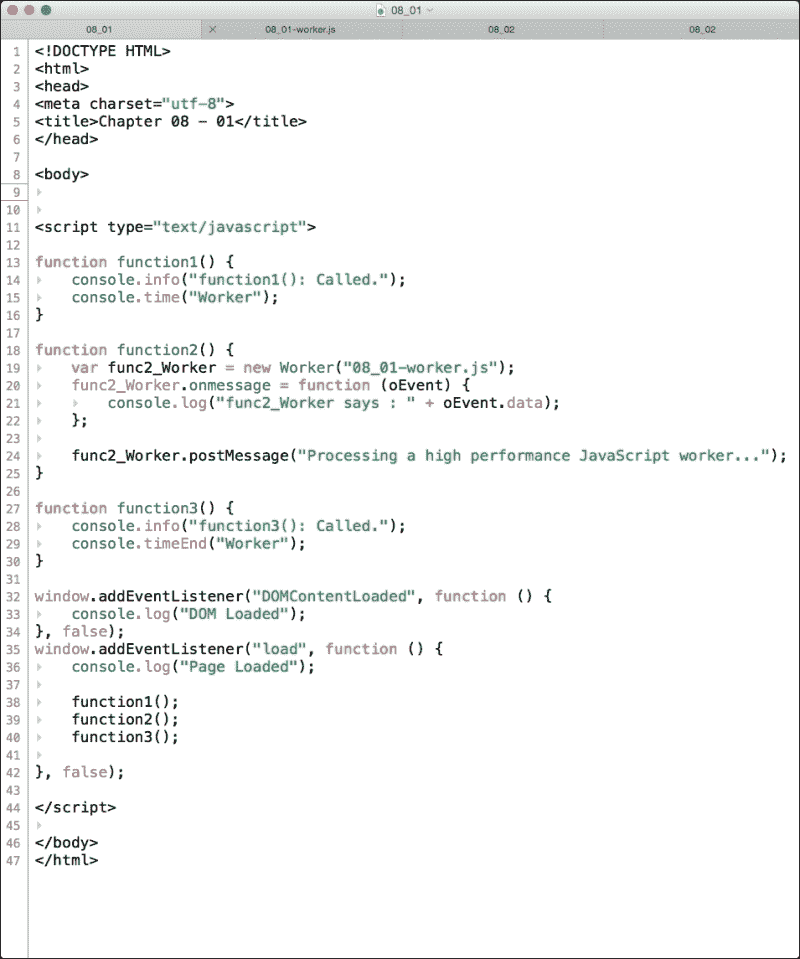

正如我们所看到的，这是一个简单的 HTML5 页面，在第 11 行有一个`script`标签。在第 13 行，我们首先声明了一个名为`function1()`的函数，它将信息消息打印到控制台；在第 15 行，我们开始一个新的定时器，以查看我们的工作者有多快。它被恰当地称为一个`Worker`。

接下来，在第 18 行我们声明了`function2()`；现在事情变得有趣了。首先，在第 19 行，我们声明了一个名为`func2_Worker`的变量；这个变量的命名并不重要，但最好是指明你的变量实际上是什么。在这个例子中，我在变量后添加了`_Worker`后缀，然后使用大写的`Worker`关键词创建一个新的网络工作者。

在括号内，我们添加了一个字符串，文件名，使用我们工作者文件的相对路径，名为`08_01-worker.js`。让我们来看看工作者文件内部。

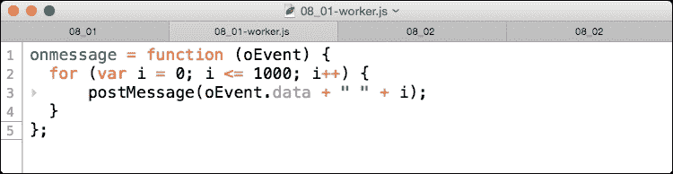

正如我们所看到的，工作者文件非常简单。在第 1 行声明了一个全局对象叫做`onmessage`，并将其赋值为一个带有`for`循环的函数。值得注意的是，我们还可以通过`self`和`this`关键词来引用这个上下文（例如：`self.onmessage`）。您可能注意到了我们还有一个名为`oEvent`的参数，它是任何通过`data`属性传递给工作者的数据的占位符。我们可以在第 3 行的`postMessage`函数中看到这一点。

`postMessage`函数是 ECMAScript 的内置函数，它要么向指定的工作者发送数据，要么如果没有分配工作者，它就会向任何可能监听的父级 JavaScript 工作者发送消息。现在让我们回到我们的根 HTML 页面脚本，看看第 20 行；这在下面的屏幕截图中显示：

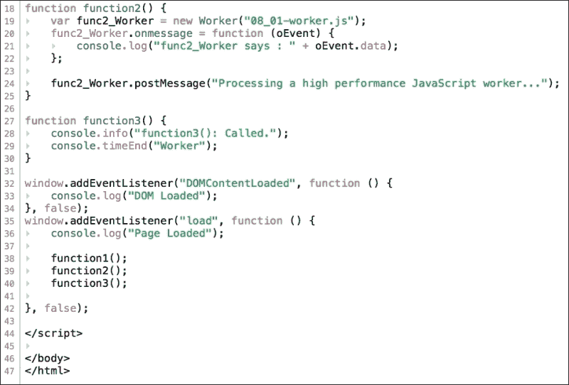

我们可以看到，通过调用我们的`func2_Worker`工作者变量，我们可以使用该工作者的`onmessage`属性，并在我们的根页面上调用一个函数；在这个例子中，您需要使用在工作者中使用的`oEvent`参数将消息记录到控制台。

这是很好的。但是我们是如何传递数据的呢？嗯，这很简单。第 24 行使用了`func2_Worker`变量，但利用了之前提到的`postMessage`函数。因为我们已经将工作者变量分配给了这个`postMessage`函数，这将把数据参数传递给我们的`oEvent`参数，在我们的`worker.js`文件中使用；在这个例子中，它是一个字符串，写着，“处理高性能的 JavaScript 工作者...”。

最后，在第 32 行和第 35 行，我们有两个事件监听器。一个是用于`DOMContentLoaded`事件，如我们图表中所示，是我们在执行线程中首先调用的函数，它只是输出一个日志消息，表明 DOM 已加载；这之后是我们的`window.onload`函数，它也打印一个日志消息，但它还会在页面加载时按顺序触发函数 1、2 和 3。让我们在浏览器中加载这个，并使用 Chrome 的**开发者工具**选项来看看会发生什么。查看控制台面板中的输出，它将类似于以下屏幕截图：

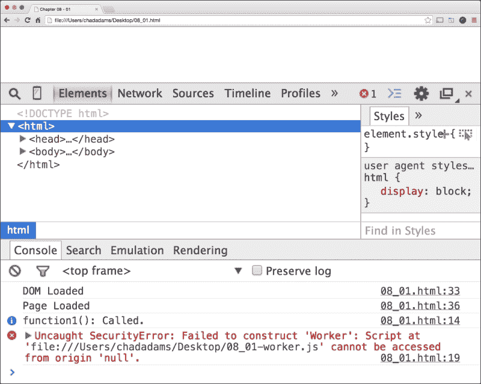

嗯，这可不是个好迹象，因为我们可以看到控制台出现一个错误。`DOM Loaded`和`Page Loaded`日志消息出现，以及`function1(): Called.`之后，我们得到`Uncaught SecurityError: Failed to construct 'Worker': Script at (file:url) cannot be accessed from origin 'null'`错误消息。

那么这意味着什么呢？首先，我们必须明白使用 web 工作者类似于使用 AJAX。如果你的代码不在服务器上，那么在系统之间共享或收集数据时存在安全风险。现在这并不是错误的，但在测试我们的代码时，我们需要在本地服务器上测试，如 Apache 或 IIS，这样可以使用 HTTP 保护我们的内容。在 Chrome 中，还有另一种禁用此警告的方法，但这只适用于有限的测试。

## 使用本地服务器测试工作者

可以在 OS X 和 Linux 上快速使用 Python 创建本地服务器；如果你不是 Python*大师*，不要担心，因为这只是一个在几秒钟内启动服务器的终端代码片段。

首先，打开终端并设置其路径；这应该是你的文件所在的路径。你可以通过使用更改目录命令或`cd`来实现。以下是一个将路径设置为活动用户桌面路径的示例，使用*tilde*键：

```js
cd ~/Desktop

```

一旦完成，我们可以使用以下简单的单行 Python 命令来启动服务器，该命令调用一个内置的简单服务器方法：

```js
python -m SimpleHTTPServer

```

一旦我们按下*Enter*键，我们就可以启动服务器了。我们可以在 Chrome 中输入`http://127.0.0.1:8000`来查看服务器根目录；我们应该 then 看到一个可以访问的文件列表。另外，如果你需要关闭服务器，你可以退出终端，或者使用*CTRL* + *Z*手动杀死服务器。

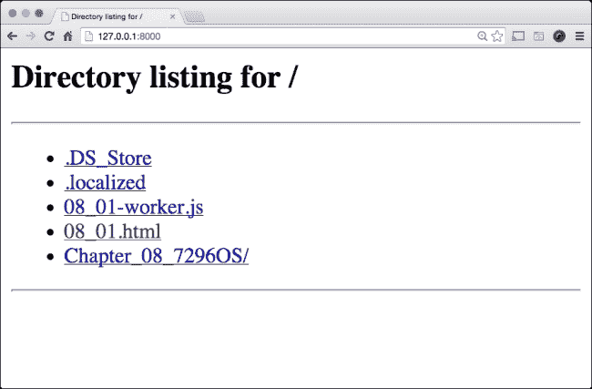

现在去打开 HTML 文件，从`worker.js`文件中调用工作者脚本。我们应该然后在 Chrome 的**开发者工具**中的控制台面板看到一千行代码迭代我们的"for 循环"从我们的工作者 JavaScript 文件中。

我们还可以看到，在第五行控制台中，`console.timeEnd`函数停止了约 0.5 毫秒，说明它在处理循环之前被调用。这显示在以下屏幕截图中：

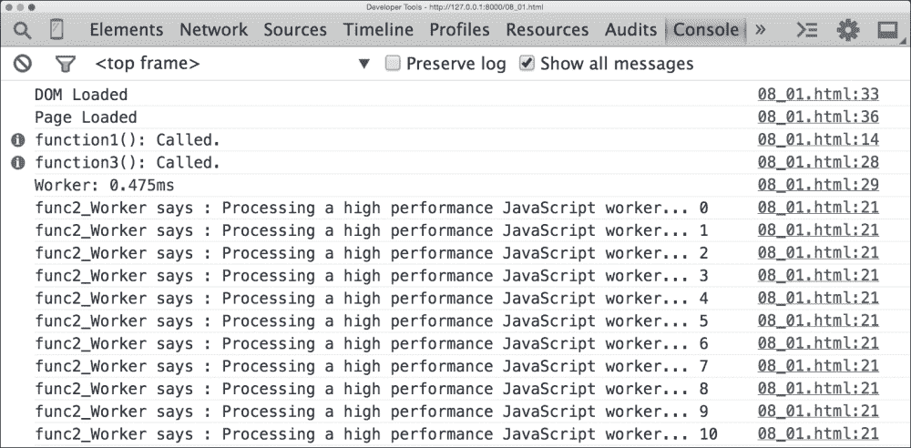

在继续之前，让我们检查一下在下一个代码示例中，这个流程在工作者外部会运行多长时间。我们在页面本身重新创建了循环的逻辑，而没有使用网页工作者。我们仍然使用`console.time`函数来测试线程运行到`function3()`被触发的时间。让我们看一下下面的代码并进行复习：

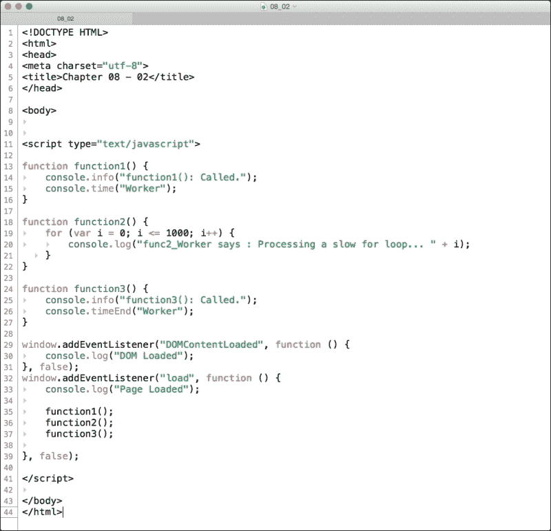

所以，在第 19 行，我们移除了对工作者文件的引用，这是一个`.js`文件，并将`for`循环移到了页面中。在这里，它会循环一千次并在控制台打印。现在在第 32 行，我们有一个`window.load`事件监听器，我们按顺序调用我们的函数，分别是 1、2 和 3。

然后我们再次使用`console.time`函数来跟踪一个过程持续的时间。由于这个代码示例现在是单线程的，我们应该看到`timeEnd`函数触发的时间更长。让我们运行我们的代码并查看下一个屏幕截图：

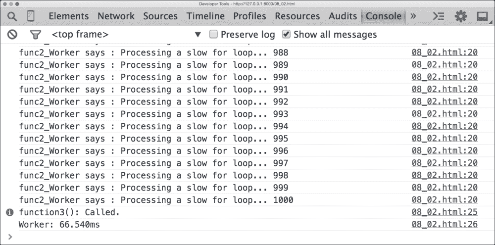

不错啊！在这里，我们的时间比我们的多线程工作者示例要长得多，比我们的网页工作者大约慢 70 毫秒。这并不是一个坏的提升，虽然很小，但仍然有帮助。现在，工作者的一个问题是在主线程上触发下一个函数需要花费很长时间。我们需要有一种方式在函数异步完成时调用一个函数，为此我们有了 JavaScript 承诺。

# 承诺

JavaScript 承诺也是优化我们 JavaScript 代码的一种新方法；承诺的理念是你有一个函数被链接到主函数，并且按照编写顺序依次执行。这是它的结构。首先，我们使用`Promise`对象创建一个新的对象，在括号内写入主函数，并将新的承诺对象赋值给一个变量。

在继续之前需要注意的一点是，JavaScript 承诺是 EcmaScript 6 特定的。因此，在这个部分，我们需要在我们的代码中测试一个准备好 EcmaScript 6 的浏览器，比如 Google Chrome。

接下来，在我们的`promise`变量中，我们使用`then`关键字，实际上它的工作方式就像一个函数。但它只在我们的根承诺函数完成时才会触发。此外，我们可以将`then`关键字一个接一个地链接起来，并依次异步执行 JavaScript，以确保我们承诺中的作用域变量，当然会承诺传递给下一个`then`函数这些变量将具有设置的值。让我们看一个示例承诺，看看这是如何工作的：

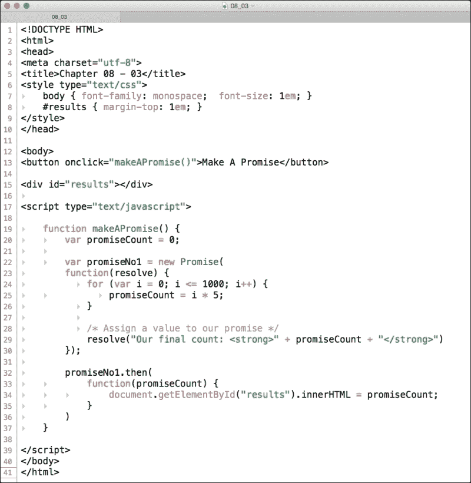

在我们的代码示例中，有一个 HTML5 页面带有内嵌的`script`标签。我们页面上有两个元素，我们通过`button`标签的`makeAPromise()`函数附加的`onclick`事件进行交互或查看，在第 13 行。在第 15 行，我们有一个带有`id`为`results`的`div`标签，其内部 HTML 保持为空。

接下来，在第 19 行我们创建了`makeAPromise`函数，并在第 20 行设置了一个名为`promiseCount`的`count`变量。现在，就在这里创建我们的 promise。在第 22 行，我们创建了一个名为`promiseNo1`的变量，并将其赋值为一个新的`Promise`对象。在这里，你可以注意到我们是如何开始用一个`function`作为参数来打开括号的，这从第 23 行开始，我们在该函数内部有一个`resolve`参数。我们稍后再讨论这个问题。

在我们的`Promise`函数中，有一个简单的`for`循环，将`for`循环的值乘以`5`，然后`then`函数将其赋值给我们的`promiseCount`变量。为了完成我们的`Promise`对象的函数，注意一个新的关键字，`resolve`！`resolve`关键字是一种专门用于 promise 的返回类型；它设置了 promise 的返回值。还有其他一些 promise 返回类型，如`reject`，如果我们想要的话，它可以让我们返回一个失败值。然而，在这个例子中，我们保持简单，只使用`resolve`。

现在，如果你记得第 23 行，我们的`Promise`函数有一个内部函数，带有`resolve`参数。虽然这看起来可能有点奇怪，但它是我们使 promise 工作所必需的；通过在函数中添加`resolve`，我们告诉我们的 promise 我们需要在`Promise`函数内部使用`resolve`函数。例如，如果我们需要`resolve`和`reject`，我们会写成`function (resolve, revoke) {}`。

回到第 29 行，我们将我们的`resolve`赋值为一个字符串，输出我们的值并填充我们的`div`，但我们这里不赋值`innerHTML`属性；这是通过我们的`promiseNo1.then`函数来完成的。这个像是一个跟随 promise 的`resolve`函数的函数。

最后，在第 32 行，我们调用了我们`promiseNo1`变量的实例，使用了`then`函数，并再次用它自己的内部函数包装了括号。我们可能会注意到，在第 33 行，我们传递了一个名为`promiseCount`的参数。这是我们第 22 行声明的`Promise`函数中的`resolve`值。我们然后在第 33 行再次使用它，在那里我们将我们的`results div`元素赋值给它的`innerHTML`属性。

## 测试一个真正的异步 promise

对于这个简单的例子，我们可以看到 promise 的结构以及当链式调用时每个触发是如何需要的；当我们链式调用 promise 时，我们可以看到即使我们创建了一些导致执行延迟的单线程 JavaScript 代码，promise 仍然可以触发链式函数。在这个例子中，是一个`setTimeout`函数；让我们来看看下面屏幕截图中显示的新代码样本：

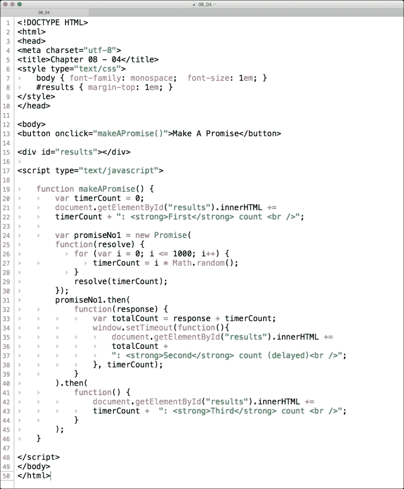

在这个简单的例子中，我们可以看到承诺链如何在不断线的情况下工作。在这里，我们在第 20 行设置了一个`timerCount`变量；然后我们将打印出在第 15 行找到的空的`results` `div`元素。接下来，通过重用我们的`promiseNo1`变量及其自己的承诺实例，我们创建了一个`for`循环，使用`Math.random()`随机化`timerCount`，当循环完成时，它允许生成一个随机数，然后乘以 10000。

最后，我们使用解决函数返回我们的承诺，它链式地连接到第 31 行的`then`函数；在这里，我们有一个名为 response 的参数作为我们的`resolve`函数的值。现在在第 33 行，我们有一个名为`totalCount`的变量，其中我们有 response 参数和`timerCount`函数相加。

接下来，我们创建了一个`setTimeout`函数，它使用我们声明的`totalCountvariable`变量设置的时间将`results` `div`元素附加第二行，同时仍然将`timerCount`函数作为我们的超时值。现在，我们链的最后一部分是第 40 行的另一个`then`函数。在这里，我们再次附加`results` `div`元素，但请注意，我们是从我们的第二个链式`then`函数打印的。让我们看看在 Chrome 中这是如何工作的，如下面的屏幕截图所示：

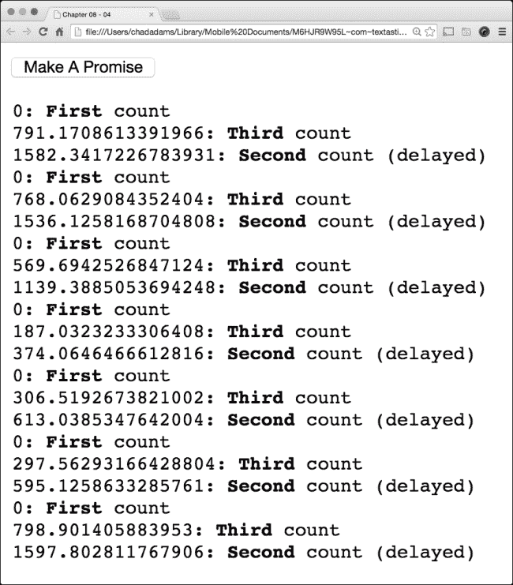

看看输出。在这里，我们可以看到，每次点击按钮，我们都会为承诺链的每个点得到一个数字计数。我们有`First count`上的值为`0`，`Third count`上有随机较大的数字。等等！那是第三次计数吗？是的，请注意第三次计数在第一次之后；这表明，即使我们在等待 for 循环处理时，第三个承诺也在继续。

在下一行，我们看到一个更大的数字值，在我们的行中注明了`Second count`；如果我们继续点击按钮，我们应该看到一个一致的模式。使用承诺可以帮助我们在不需要在链中立即获得特定值的情况下多线程代码。我们还可以通过使用承诺将一些代码从我们的主 JavaScript 线程中移除，从而获得性能上的好处。

# 总结

在本章中，我们回顾了如何使用网络工人，以及网络工人在实际应用中在技术和概念上的局限性。我们还使用了 JavaScript 承诺，在这里我们学习了与承诺相关的常见关键词，如`respond`和`revoke`。我们看到了如何使用`then`函数将我们的承诺与主应用程序线程同步，以创建一个多线程的 JavaScript 函数。

在下一章中，我们将了解从像 iOS 和 Android 这样的移动设备工作如何影响我们的性能以及如何在设备上调试性能。
