# 第九章：优化 iOS 混合应用中的 JavaScript

在本章中，我们将探讨优化 iOS 网络应用（也称为混合应用）中 JavaScript 的过程。我们将查看一些常见的调试和优化 JavaScript 及页面性能的方法，无论是在设备的网络浏览器中，还是在独立应用的网络视图中。

此外，我们将查看 Apple Web Inspector，并了解如何将其用于 iOS 开发。最后，我们还将对建立混合应用有所了解，并学习帮助更好地为 iOS 构建以 JavaScript 为重点的应用的工具。此外，我们还将了解一个类，它可能有助于我们进一步学习。

我们将在本章中学习以下主题：

+   准备进行 iOS 开发

+   iOS 混合开发

# 准备进行 iOS 开发

在用 Xcode 示例开始本章并使用 iOS 模拟器在 JavaScript 性能书籍中之前，我将展示一些本地代码，并使用尚未在本课程中介绍的工具。无论平台如何，移动应用开发都是各自的书籍。在覆盖 iOS 项目的构建时，我将简要概述设置项目和编写*非 JavaScript*代码以将我们的 JavaScript 文件引入混合 iOS WebView 进行开发的过程。这是必要的，因为 iOS 对其基于 HTML5 的应用进行安全保护的方式。使用 HTML5 的 iOS 应用可以进行调试，要么从服务器上，要么直接从应用上，只要该应用的项目在主机系统（意味着开发者的机器）上以调试设置进行构建和部署。

本书的读者不需要从一开始就了解如何构建本地应用。这是完全可以接受的，因为你可以复制粘贴，并跟随我一起进行。但我将展示代码，让我们达到测试 JavaScript 代码的阶段，所使用的代码将是渲染您内容的最小和最快可能的代码。

所有这些代码示例都将在 Packt Publishing 的网站上以某种类型的 Xcode 项目解决方案的形式托管，但它们也将在此处展示，如果您想要跟随，而不依赖代码示例。现在说到这里，让我们开始…

# iOS 混合开发

Xcode 是苹果公司提供的用于开发 iOS 设备和 Macintosh 系统桌面设备的 IDE。作为一个 JavaScript 编辑器，它的功能相当基础，但 Xcode 应该主要用作项目工具集之外，针对 JavaScript 开发者的工具。它为 JavaScript、HTML 和 CSS 提供基本的代码提示，但不止这些。

要安装 Xcode，我们需要从 Mac App Store 开始安装过程。近年来，苹果公司将它的 IDE 移到了 Mac App Store，以便为开发者更快地更新，进而为 iOS 和 Mac 应用程序提供更新。安装过程很简单；只需用你的 Apple ID 登录 Mac App Store 并下载 Xcode；你可以在顶部搜索它，或者如果你在右侧栏查看流行免费下载，你可以找到一个到 Xcode Mac App Store 页面的链接。一旦你到达这个页面，点击**安装**，如下图所示：

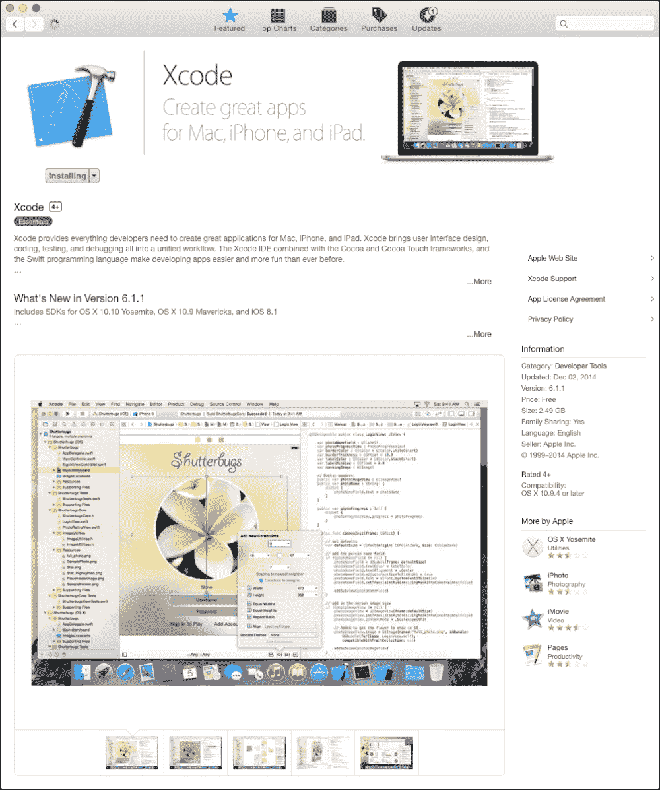

重要的是要知道，为了本章节的简单起见，我们将不会将应用程序部署到设备上；所以如果你对此感到好奇，你需要积极参与苹果的开发者计划。该计划的费用为每年 99 美元，或者 299 美元的企业许可，允许将应用程序部署在 iOS 应用商店之外。

如果你好奇想了解更多关于部署到设备的信息，本章节的代码将在设备上运行，前提是你的证书已经设置好。

关于这方面的更多信息，请查看苹果公司在线的 iOS 开发者中心文档：[`developer.apple.com/library/ios/documentation/IDEs/Conceptual/AppDistributionGuide/Introduction/Introduction.html#//apple_ref/doc/uid/TP40012582`](https://developer.apple.com/library/ios/documentation/IDEs/Conceptual/AppDistributionGuide/Introduction/Introduction.html#//apple_ref/doc/uid/TP40012582)。

安装完成后，我们可以打开 Xcode 并查看 iOS 模拟器；我们可以通过点击**XCode**，然后点击**打开开发者工具**，然后点击**iOS 模拟器**来实现。第一次打开 iOS 模拟器时，我们将看到一个 iOS 设备的模拟，如下图所示。注意这是一个模拟，*不是*一个真实的 iOS 设备（即使它感觉非常接近）。

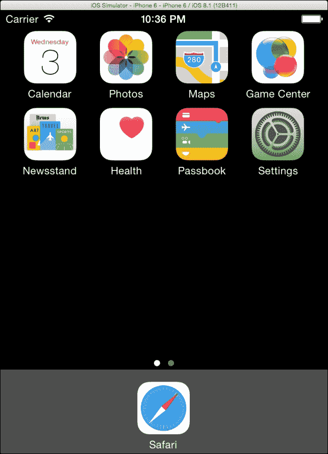

对于在外部应用程序中工作的 JavaScript 开发者来说，一个很酷的技巧是，他们可以快速地拖放 HTML 文件。由于这个原因，模拟器将打开移动版 Safari，iPhone 和 iPad 的内置浏览器，并像在 iOS 设备上一样渲染页面；这在测试页面并在将其部署到 Web 服务器之前非常有帮助。

## 设置简单的 iOS 混合应用程序

内置混合应用程序上的 JavaScript 性能可能会比在移动版 Safari 上的相同页面慢得多。为了测试这一点，我们将使用苹果公司的新编程语言**Swift** 构建一个非常简单的网络浏览器。Swift 是一种准备好的 iOS 语言，JavaScript 开发者应该会感到很熟悉。

Swift 本身遵循类似于 JavaScript 的语法，但与 JavaScript 不同，变量和对象可以赋予类型，从而实现更强大，更精确的编码。在这方面，Swift 遵循类似于可以在*ECMAScript 6*和*TypeScript*编码实践风格中看到的语法。如果您正在查看这些新语言，我鼓励您也查看 Swift。

现在让我们创建一个简单的网页视图，也称为**UIWebView**，这是在 iOS 应用中创建网页视图的类。首先，让我们创建一个新的 iPhone 项目；我们使用 iPhone 来保持我们的应用程序简单。打开 Xcode 并选择**创建新的 XCode 项目**项目；然后，如以下屏幕截图所示，选择**单视图应用程序**选项并点击**下一步**按钮。

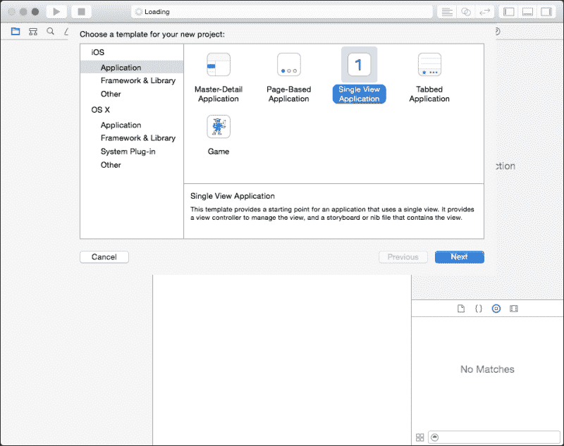

在向导的下一页中，将产品名设置为`JS_Performance`，语言设置为**Swift**，设备设置为**iPhone**；组织名称应该会根据您在 OS 中的账户名称自动填充。组织标识符是用于我们应用程序的反向域名唯一标识符；这可以是您认为合适的任何内容。为了说明目的，以下是我的设置：

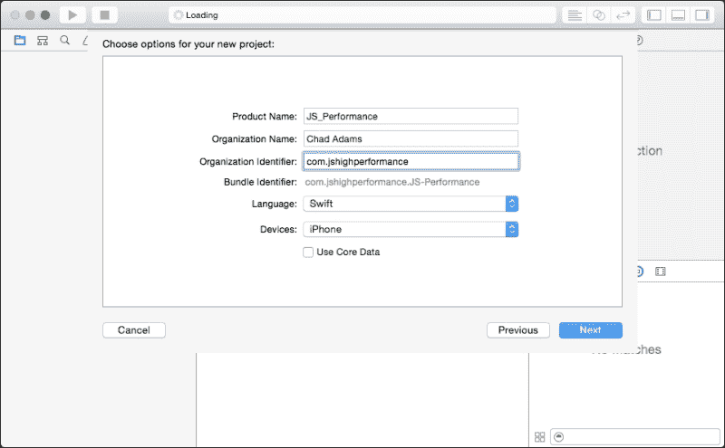

一旦您的项目名称设置完成，点击**下一步**按钮，并将其保存在您选择的文件夹中，**Git 仓库**保持未选中状态。完成后，在**项目导航器**中选择**Main.storyboard**，您可以在左侧面板中找到它。现在我们应该处于故事板视图中。让我们打开**对象库**，它可以在右下角的子标签中找到，该子标签中有一个圆形内的方形图标。

在右下角的搜索栏中在**对象库**中搜索`Web View`，然后将其拖动到代表我们 iOS 视图的方形视图中。

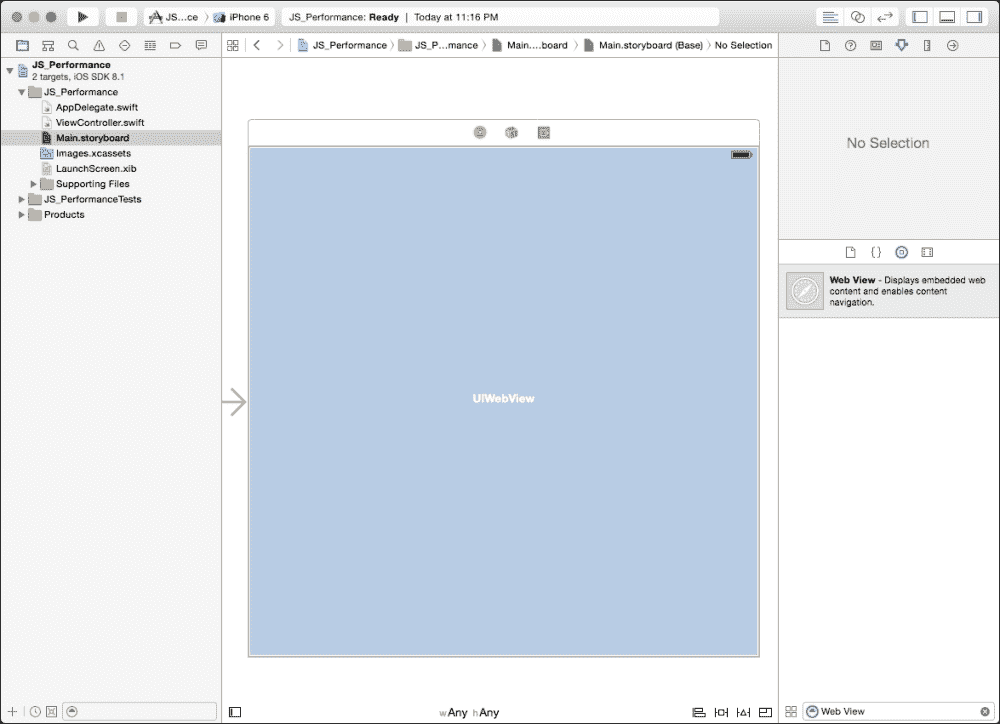

在使用 Swift 链接 HTML 页面之前，我们需要考虑另外两件事；我们需要设置约束条件，因为本地 iOS 对象将被拉伸以适应各种 iOS 设备窗口。要填充空间，您可以通过在 Mac 键盘上选择**UIWebView**对象并按*Command* + *Option* + *Shift* + *=* 来添加约束。现在您应该看到一个蓝色的边框短暂地出现在您的 UIWebView 周围。

最后，我们需要将我们的**UIWebView**连接到我们的 Swift 代码；为此，我们需要打开**助手编辑器**通过按*Command* + *Option* + *Return*在键盘上。我们应该看到**ViewController.swift**在**Storyboard**旁边的侧边栏中打开。要作为代码变量链接此内容，请右键点击（或选项点击**UIWebView**对象），然后按住鼠标左键拖动**UIWebView**到**ViewController.swift**代码中的第 12 行在**助手编辑器**中。以下图表显示了这一点：

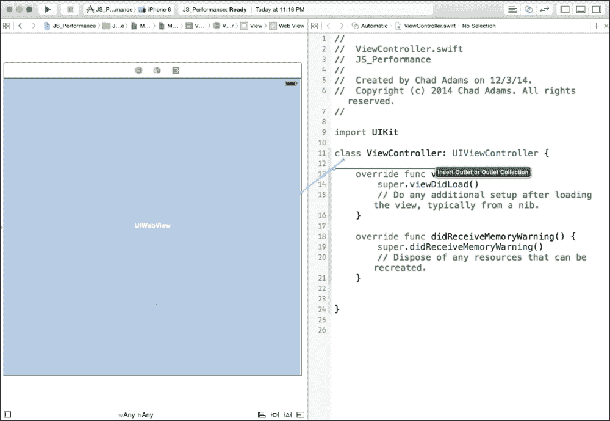

完成这些步骤后，会出现一个弹窗。现在保持所有内容与默认设置相同，但将名称设置为`webview`；这将是我们 UIWebView 的变量引用。完成后，保存你的`Main.storyboard`文件，然后导航到你的`ViewController.swift`文件。

现在查看下面的截图中显示的 Swift 代码，并将其复制到项目中；重要的是第 19 行的文件名和类型被加载到网络视图中；在这个例子中，这是`index.html`。

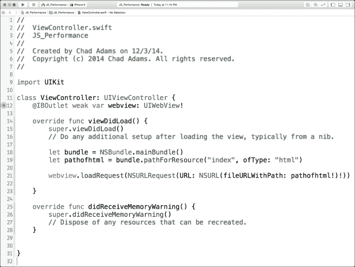

显然，我们没有`index.html`文件，所以让我们创建一个。点击**文件**，然后选择**新建**，接着选择**新建文件**选项。接下来，在**iOS**下选择**空应用程序**，然后点击**下一步**完成向导。将文件保存为`index.html`，然后点击**创建**。现在打开`index.html`文件，并将以下代码输入到 HTML 页面中：

```js
<br />Hello <strong>iOS</strong>
```

现在点击**运行**（主 iOS 任务栏中的播放按钮），我们应该能在我们自己的应用中看到我们的 HTML 页面，如下所示：

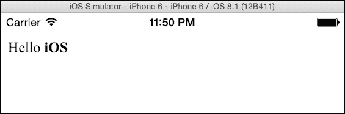

太棒了！我们用 Swift 构建了一个 iOS 应用（即使它是一个简单的应用）。让我们创建一个结构化的 HTML 页面；我们将用下面的截图中显示的 HTML 覆盖我们的`Hello iOS`文本：

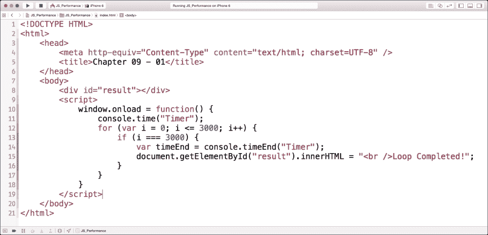

在这里，我们使用标准的`console.time`函数，在完成后向我们的 UIWebView 页面打印一条消息；如果我们点击 Xcode 中的**运行**，我们将在加载时看到`循环完成`的消息。但我们如何获取我们的性能信息呢？我们如何在 HTML 页面中的第 14 行的`console.timeEnd`函数代码？

## 使用 Safari 网络检查器进行 JavaScript 性能

苹果为 UIWebView 提供了网络检查器，而且这个检查器与桌面 Safari 的检查器相同。它很容易使用，但有一个问题：检查器只适用于从 Xcode 项目中启动的 iOS 模拟器和设备。这个限制是由于对混合应用可能包含的敏感 JavaScript 代码的安全担忧，如果可见可能会被利用。

让我们检查一下我们项目的内嵌 HTML 页面控制台。首先，在您的 Mac 上打开桌面 Safari 并启用开发者模式。启动**偏好设置**选项。在**高级**标签下，确保已选中**在菜单栏中显示开发菜单**选项，如下面的截图所示：

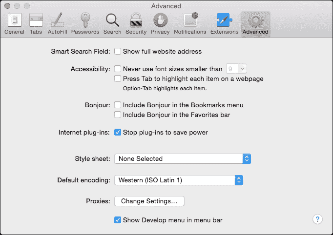

接下来，让我们重新运行我们的 Xcode 项目，启动 iOS 模拟器，然后重新运行我们的页面。一旦我们的应用在显示**循环完成**结果时运行，打开桌面 Safari 并点击**开发**，然后**iOS 模拟器**，接着点击**index.html**。

如果你仔细看，当你将鼠标悬停在`index.html`上时，iOS 模拟器的 UIWebView 会以蓝色高亮显示；如下的截图显示了一个可见的页面：

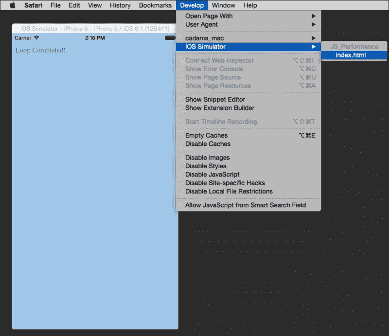

在**index.html**上释放鼠标后，Safari 的**网络检查器**窗口会出现，显示我们混合型 iOS 应用的 DOM 和控制台信息。Safari 的**网络检查器**在功能集上与 Chrome 的**开发者工具**相当相似；在**开发者工具**中使用的面板在**网络检查器**中也是以图标的形式存在的。

现在让我们在**网络检查器**中选择**控制台**面板。在这里，我们可以看到完整的控制台窗口，包括我们在`for`循环中包含的`Timer` `console.time`函数测试。正如我们在以下截图中看到的，循环在 iOS 中处理了 0.081 毫秒。

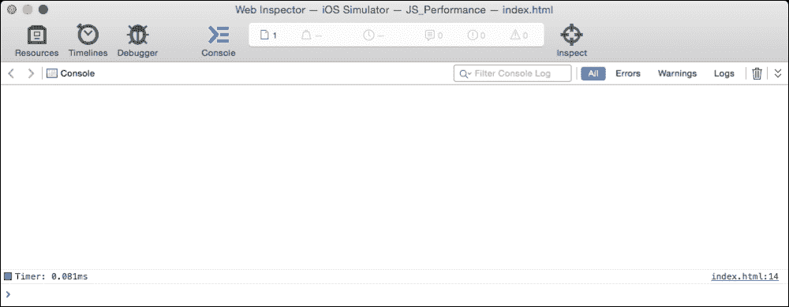

## UIWebView 与 Mobile Safari 比较

如果我们想将我们的代码移动到 Mobile Safari 进行测试呢？这很容易；如前所述，我们可以将`index.html`文件拖放到我们的 iOS 模拟器中，然后操作系统将打开移动版 Safari 并为我们加载页面。

准备好之后，我们需要重新连接 Safari**网络检查器**到**iOS 模拟器**并重新加载页面。完成后，我们可以看到我们的`console.time`函数要快一些；这次大约是 0.07 毫秒，比 UIWebView 快了 0.01 毫秒左右，如图所示：

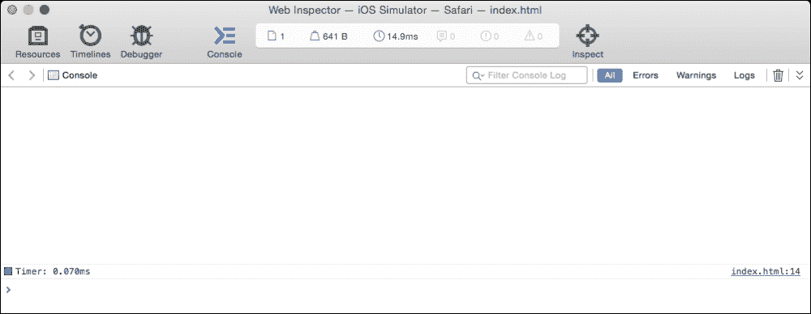

对于一个小应用来说，这在性能上的差别很小。但是，随着应用越来越大，这些 JavaScript 处理过程的延迟会越来越长。

我们还可以使用 Safari 的**网络检查器**工具中的调试检查器来调试应用。在 Safari 的**网络检查器**顶部菜单栏中点击**调试器**。我们可以通过点击行号来在我们的嵌入式脚本中添加一个断点，然后使用*Command* + *R*刷新页面。在下面的截图中，我们可以看到在页面加载时断点发生，我们可以在右侧面板中看到我们的作用域变量：

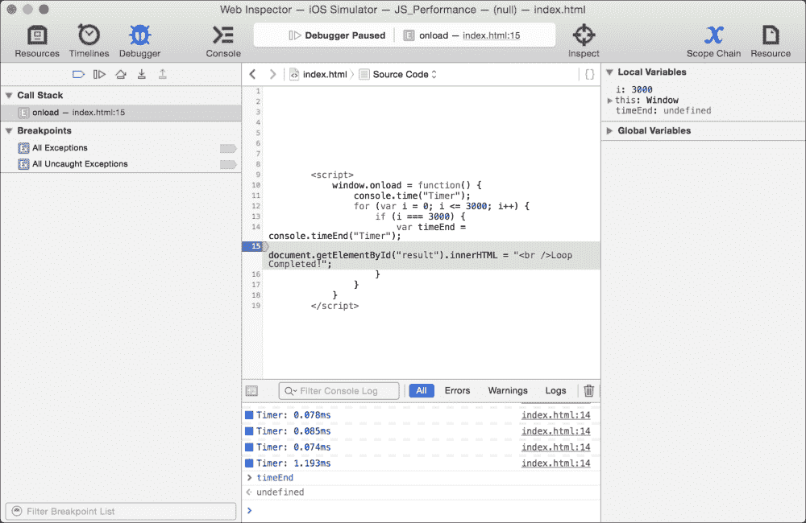

我们还可以使用时间线检查器来检查页面加载时间。在**网络检查器**顶部点击**时间线**，现在我们将看到一个类似于 Chrome 的**开发者工具**中的**资源**标签页的时间线。让我们用键盘上的*Command* + *R*刷新我们的页面；时间线然后处理页面。

注意，在几秒钟后，**网络检查器**中的时间线在页面完全加载时停止，所有 JavaScript 处理过程也停止。这是当你使用 Safari 的网络检查器而不是 Chrome 的开发者工具时的一个很好的功能。

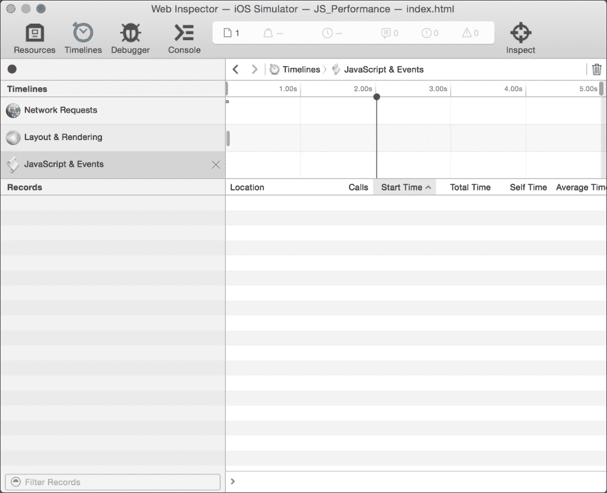

## 提高混合性能的常见方法

使用混合应用程序，我们可以使用我们在前面的章节中学到的所有提高性能的技术：使用像 Grunt.js 或 Gulp.js 这样的构建系统，使用 JSLint 更好地优化我们的代码，在 IDE 中编写代码以创建我们应用程序更好的结构，并帮助检查我们代码中的任何多余代码或未使用的变量。

我们可以使用最佳性能实践，例如使用字符串来应用 HTML 页面（如`innerHTML`属性），而不是创建对象并以此方式将它们应用到页面上，等等。

不幸的是，混合应用程序的性能不如原生应用程序的事实仍然成立。现在，不要让这使您沮丧，因为混合应用程序确实有很多优点！其中一些如下：

+   它们（通常）比使用原生代码更快地构建

+   它们更容易定制

+   它们允许快速为应用程序制作原型

+   它们比找到一个原生开发者更容易地交接给其他 JavaScript 开发者

+   它们是便携式的；它们可以针对其他平台（需要一些修改）重新用于 Android 设备、Windows 现代应用、Windows Phone 应用、Chrome OS，甚至是 Firefox OS。

+   他们可以使用像*Cordova*这样的辅助库与原生代码交互

然而，在某个时刻，应用程序的性能将受到设备硬件的限制，建议您转向原生代码。但是，我们如何知道何时转移呢？嗯，这可以通过使用**颜色混合层**来实现。**颜色混合层**选项在设备显示上应用一个覆盖层，突出显示性能较慢的区域，例如，用绿色表示良好性能，用红色表示性能较差；颜色越深，性能影响就越大。

使用 Xcode 重新运行您的应用程序，然后在 iOS 模拟器的 Mac OS 工具栏中选择**调试**，然后选择**颜色混合层**。一旦我们这样做，我们就可以看到 iOS 模拟器显示了一个绿色覆盖层；这显示了 iOS 处理我们的渲染视图所使用的内存量，包括本地和非本地代码，如下图所示：

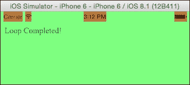

目前，我们可以看到大部分都是绿色覆盖层，除了状态栏元素，这些元素占用更多的渲染内存，因为它们覆盖了网页视图，并且必须反复在这些对象上重新绘制。

让我们将我们的项目复制一份，命名为`JS_Performance_CBL`，然后用下面的代码样本更新我们的`index.html`代码，如下图所示：

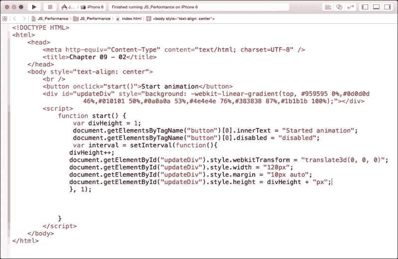

在这里，我们有一个简单的页面，里面有一个空的 div；我们还有一个带有`onclick`函数的按钮，该函数名为`start`。我们的`start`函数将使用`setInterval`函数不断更新高度，每毫秒增加一次高度。我们的空 div 还使用内联`style`标签分配了一个背景渐变。

移动设备上 CSS 背景渐变通常是一个巨大的性能负担，因为它们可能会在 DOM 更新自己时反复重新渲染。其他一些问题包括监听事件；一些较早或较低端的设备没有足够的 RAM 来为页面应用事件监听器。通常，为 HTML 应用`onclick`属性是一个好习惯，无论是内联还是通过 JavaScript。

回到渐变示例，让我们在 iOS 模拟器中运行此操作，在点击我们的 HTML 按钮触发 JavaScript 动画后启用**颜色混合层**。

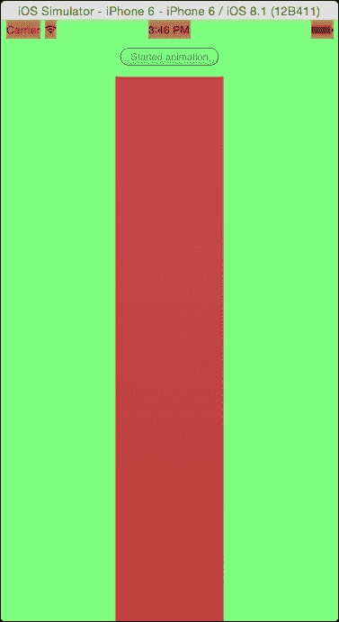

不出所料，我们现在看到我们扩展的 div 元素有一个红色覆盖层，这表明这是一个确认的性能问题，这是无法避免的。为了解决这个问题，我们需要移除 CSS 渐变背景，它将再次显示为绿色。然而，如果我们必须包括一个渐变，以符合设计规范，那么就需要一个本地版本。

面对这些问题之类的 UI 问题，了解正常开发工具和 Web 检查器之外的工具非常重要，并利用提供更好分析代码的移动平台工具。现在，在我们结束这一章之前，请注意 iOS 网络视图的某些具体事项。

## WKWebView 框架

在撰写本文时，苹果公司宣布了 WebKit 框架，这是一个旨在用更先进、性能更好的网络视图替换 UIWebView 的第一方 iOS 库；这是为了用整体性能更优的应用程序替换依赖 HTML5 和 JavaScript 的应用程序。

被称为**WKWebView**的 WebKit 框架，是开发者圈子里的新一代网络视图，可以添加到项目中。WKWebView 也是这个框架的基础类名。这个框架包括许多功能，使原生 iOS 开发者能够利用这些功能。这包括监听可以触发原生 Objective-C 或 Swift 代码的函数调用。对于我们这样的 JavaScript 开发者来说，它还包括一个更快的 JavaScript 运行时*Nitro*，自 iOS6 的 Mobile Safari 以来一直包含在内。

混合应用程序一直运行得比本地代码差。但是，借助 Nitro JavaScript 运行时，HTML5 在性能上与本地应用程序平起平坐，前提是我们视图不会像我们颜色混合层示例中那样消耗太多渲染内存。

然而，WKWebView 确实存在局限性；它只能用于 iOS8 或更高版本，并且不像 UIWebView 那样内置 Storyboard 或 XIB 支持。因此，如果你是 iOS 开发新手，使用这个框架可能会遇到问题。**Storyboards** 仅仅是特定方式编写的 XML 文件，用于渲染 iOS 用户界面，而**XIB**文件是 Storyboard 的前身。XIB 文件只允许一个视图，而 Storyboards 允许多个视图，并且可以链接它们。

如果你正在开发一个 iOS 应用，我鼓励你联系你的 iOS 开发负责人，并鼓励在项目中使用 WKWebView。

更多信息，请查看 Apple 网站上关于 WKWebView 的文档：[`developer.apple.com/library/IOs/documentation/WebKit/Reference/WKWebView_Ref/index.html`](https://developer.apple.com/library/IOs/documentation/WebKit/Reference/WKWebView_Ref/index.html)。

# 总结

在本章中，我们学习了如何使用 HTML5 和 JavaScript 为 iOS 创建混合应用的基本知识；我们学习了如何在运行应用的 iOS 模拟器中连接 Safari 网络检查器到我们的 HTML 页面。我们还查看了 iOS 模拟器的颜色混合层，并了解了如何从我们的 JavaScript 代码中测试性能，以解决设备渲染性能问题。

现在我们到了最后关头。就像所有上线到生产环境的 JavaScript web 应用一样，我们需要对我们的 JavaScript 和 web 应用代码进行烟雾测试，看看在最终部署之前是否需要进行任何最后的优化。这将在下一章讨论。
