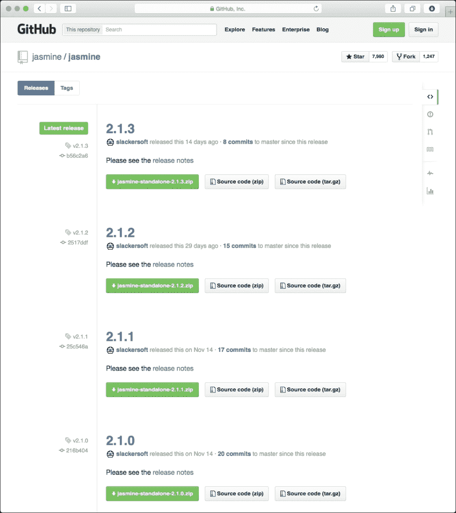
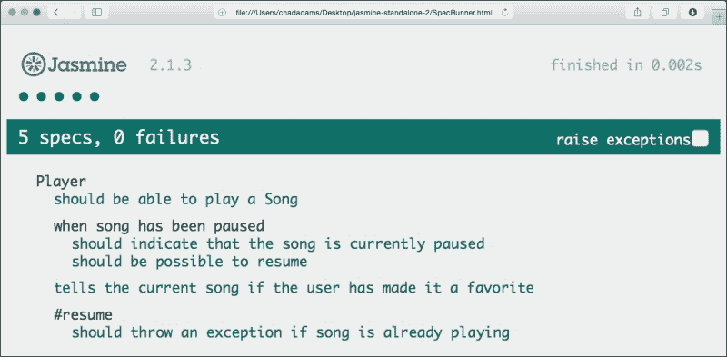
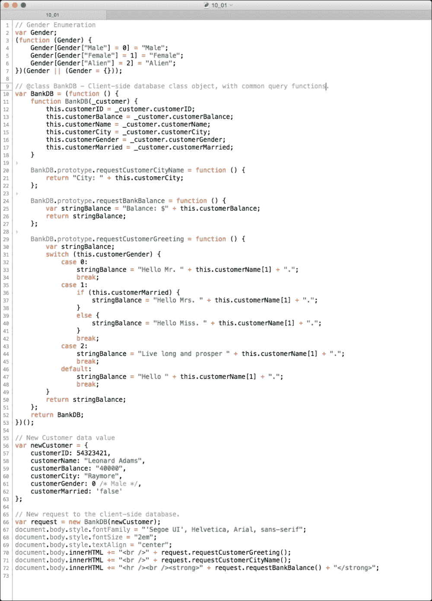
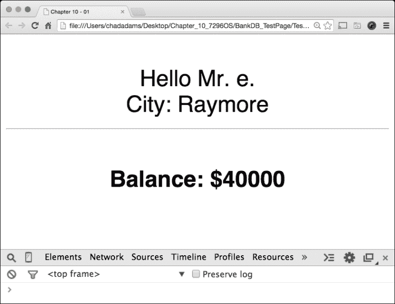
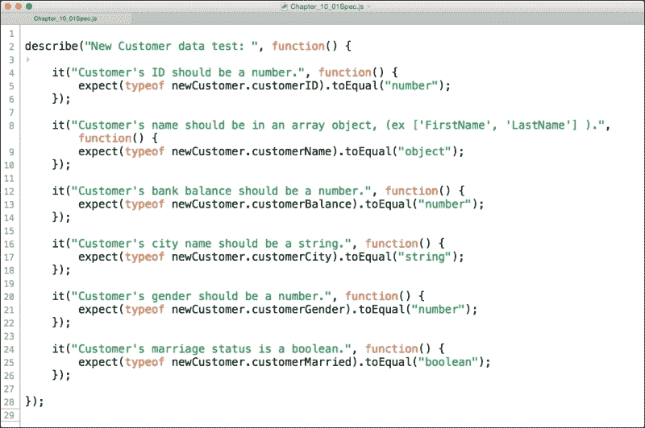
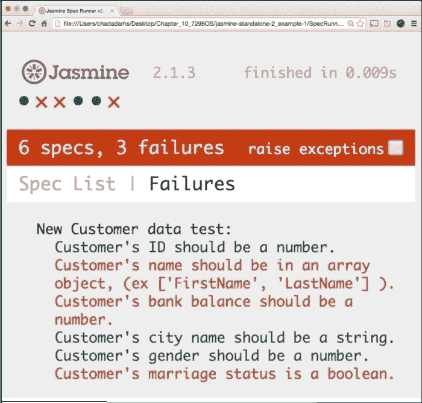
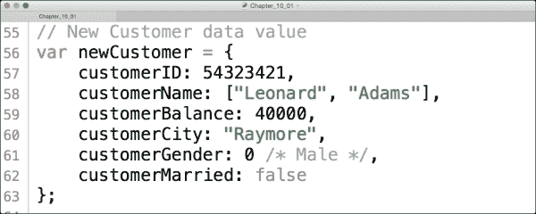
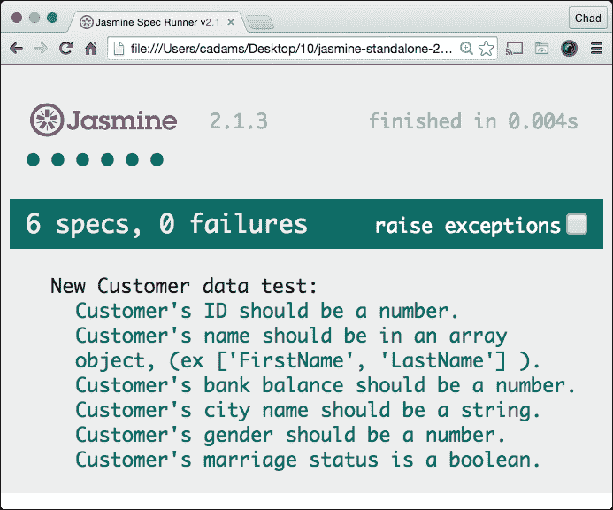
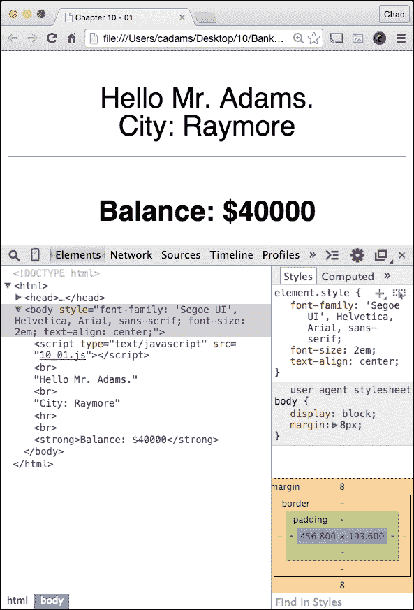

# 第十章：应用性能测试

在这本书中，我们已经介绍了各种增加 JavaScript 应用程序性能的方法，这些方法贯穿于项目生命周期的不同阶段。这包括从在项目生命周期的各个阶段选择合适的编辑器，将 JavaScript 检测器整合到帮助我们证明在部署前 JavaScript 的活动中，使用构建系统，以及创建部署包或构建，将最终代码与开发者友好的代码库分离。

编写高性能 JavaScript 的真正秘诀不在于我们头脑中的 JavaScript 知识量，而在于了解语言本身的“痛点”；其中一些痛点包括`for`循环、对象创建、不包含严格操作符、定时器等。此外，这一类别还包括将这些工具整合到我们的代码中，以便在部署之前更好地检查代码。

与所有主要网络应用程序项目一样，这里总是有一些形式的预飞检查，即一个最终的待办事项列表，在一个网络应用程序上线之前。如果我们到目前为止已经涵盖了本书中介绍的工具，我们的 JavaScript 应该足够稳定以供部署。但是在这里，我们将再进一步。

在本章中，我们将探讨**Jasmine**，一个允许我们以我们还未意识到的方式测试代码的 JavaScript 测试框架。与过去的线性检测工具（如 JSLint）不同，这些测试将依赖于应用程序的属性类型，也依赖于我们尚未介绍的概念：JavaScript 中的单元测试。

简而言之，我们将涵盖以下主题：

+   什么是 JavaScript 中的单元测试？

+   使用 Jasmine 进行单元测试

# 什么是 JavaScript 中的单元测试？

单元测试，简单来说，是一种应用程序框架或工具集，旨在以独特的方式测试 JavaScript 或其他任何编程语言的代码。单元测试通常涵盖标准线性检测器中不存在的错误检查。它们被设计用来检查特定于应用程序的错误。在其他编程语言中，单元测试通常被设计用来检查项目的类和模型，以确保应用程序运行高效且正确。

现在，JavaScript 和单元测试实践从未被很好地联系在一起，这主要是由于 JavaScript 的动态性质。阻碍它们联系的因素包括开发人员无意中创建的许多错误，将错误的值传递给不应该有特定变量类型的变量，当应用程序的对象属性需要数字时分配一个字符串，等等。

然而，对于使用 JavaScript 的客户端应用程序，无论它们是在网页浏览器中的网页上，还是在移动应用程序的网页视图中托管，测试变得越来越必要。现在有数十个针对 JavaScript 测试设计的框架，但在这里，我将介绍一个特别名为 Jasmine 的框架。请记住，还有其他测试框架，如 Mocha 或 QUnit，但我们将介绍 Jasmine，因为它不需要第三方框架即可运行。

# Jasmine 的单元测试

Jasmine 是一个 JavaScript 单元测试框架；它允许我们编写不依赖于外部库（如 jQuery）的 JavaScript。这对于需要非常小的内存占用的应用程序很有帮助，例如我们在第九章中讨论的 iOS 上的 JavaScript 应用程序，*为 iOS 混合应用程序优化 JavaScript*. 它还限制了代码仅限于我们编写的代码，并且由于当前构建的另一个供应商库中的框架而没有错误。

## 安装和配置

Jasmine 可以通过多种方式安装；我们可以使用 node 包管理器或 NPM，这与我们在第三章中构建我们的 Gulp.js 构建系统的结构类似，*理解 JavaScript 构建系统*. 但是我们首先需要下载该框架的独立版本。我将使用版本 2.1.3，这是框架的最新稳定版本，可以在 [`github.com/jasmine/jasmine/releases`](https://github.com/jasmine/jasmine/releases) 找到。要下载，请点击 Jasmine 框架 GitHub 页面上的绿色 `.zip` 文件按钮，如下所示：



一旦我们下载了 Jasmine 的独立版本，我们可以检查它是否可以正常工作；独立版本包含一些已经设置好单元测试的示例 JavaScript。要运行 Jasmine 中的单元测试集，我们需要构建一个 `SpecRunner` 页面。`SpecRunner` 是一个显示单元测试结果的 Jasmine 特定 HTML 页面。如果我们打开独立版本的 `SpecRunner.html` 文件在浏览器中，我们应该看到以下屏幕截图所示的示例测试结果，演示了所有已通过的测试：



在设置测试之前，我们需要测试一些代码。我创建了一些面向对象的 JavaScript，它严重依赖于特定的 JavaScript 类型，例如数字和布尔值，这些类型在整个应用程序中都有使用。该应用程序是一个非常简单的银行应用程序，它将客户数据返回给一个简单的 HTML 页面，但它结构足够复杂，类似于大型应用程序。我们将使用 Jasmine 来检查类型，确保传递的数据有效，并验证应用程序正在按照预期输出客户数据。

## 审查项目代码库

我们将使用以下代码样本进行项目。花点时间看看这里展示的代码。像往常一样，本书中所有的代码样本都可以在 Packt Publishing 的网站上找到。



我们这里有很多代码要测试，但不必担心！在我们开始使用 Jasmine 之前，让我们慢慢回顾一下。在第 1 至 7 行，我们有一个 JavaScript 枚举类型，用于性别类型，允许我们预定义客户类型的值。在这个例子中，值可以是`Male`、`Female`或`Alien`。从第 10 行开始是我们的`BankDB`对象（也被认为是 JavaScript 类）；这实际上不是一个数据库，但在实际应用程序中它可能与一个数据库相连。

`BankDB`函数是一个基于实例的对象，意味着它需要特定类型的参数才能正常工作，我们可以在第 56 行的`newCustomer`中找到该参数。这个 JavaScript 对象包含了一个 JavaScript 对象表示法，为新的客户条目分配值。可以把这个看作是收银员在使用系统时返回的一小部分 JSON。

最后，在第 66 至 72 行，我们使用该用户的数据创建请求，然后将数据附加到内嵌网页的`document.body`语句中，并进行了一些轻微的样式和格式化。

在我们开始编写测试之前，让我们在一个自我包含的页面中查看这个。我在关闭`body`标签之前的空 HTML 页面中添加这个。打开页面并查看结果，如下屏幕快照所示：



正如我们所看到的，我们的应用程序显示了所有正确信息，除了客户名显示为`Mr. e`，而不是在`10_01.js`文件的 58 行指示的`Mr. Leonard Adams`。同时，注意在我们的 Chrome**开发者工具**选项中，我们没有收到任何错误，也没有真正的性能延迟。尽管如此，通过客户名的输出我们知道有些问题。为纠正此问题，我们将对应用程序进行单元测试。

## 审查应用程序的规格以编写测试

编写单元测试时，需要有明确的指导方针来编写测试；在前一个屏幕快照中显示的代码样本的情况下，我们想要确保我们的测试遵循几条规则，为了帮助我们编写这些测试，我们将使用下面表格中列出的规则和我们的代码。

考虑以下列表作为应用程序规格，或基于此构建应用程序的文档。让我们看看表格和我们的代码应该如何处理使用中的数据：

| 测试编号 | 测试描述 |
| --- | --- |
|  |
| 第二测试 | 新客户数据测试：`客户名应位于数组对象中，（例如['FirstName', 'LastName']）。` |
| ``` |
| ``` |
| ``` |
| ``` |

根据这个列表，我们需要我们的数据值通过这六个测试，以确保 JavaScript 应用程序正常工作。为此，我们将使用 Jasmine 编写一个**spec**。在 Jasmine 框架中，spec 文件就是一个加载了待测试 JavaScript 的 JavaScript 文件，该文件被加载到一个包含 Jasmine 测试框架和待测试文件的 HTML 页面中。在这里，我们可以看到这个组合页面的样子；在基于 Jasmine 的测试中，通常称之为`SpecRunner`页面：

```js
<!DOCTYPE html>
<html>
  <head>
    <meta charset="utf-8">
    <title>Jasmine Spec Runner v2.1.3</title>

    <link rel="shortcut icon" type="image/png" href="lib/jasmine-2.1.3/jasmine_favicon.png">
    <link rel="stylesheet" href="lib/jasmine-2.1.3/jasmine.css">

    <script src="img/jasmine.js"></script>
    <script src="img/jasmine-html.js"></script>
    <script src="img/boot.js"></script>

    <!-- include source files here... -->
    <script src="img/Chapter_10_01.js"></script>

    <!-- include spec files here... -->
    <script src="img/Chapter_10_01Spec.js"></script>

  </head>

  <body>
  </body>
</html>
```

在这里，我们可以看到`SpecRunner.html`页面，并注意到我们在头部标签中首先加载了 Jasmine 框架，然后是我们在前一章节中提到的名为`Chapter_10_01.js`的测试脚本，其后是我们命名为`Chapter_10_01_Spec.js`的 spec 文件，以保持一致性。

注意，如果我们打开 Chrome 的**开发者工具**在我们的`SpecRunner.html`页面中，我们可以看到来自我们的`10_01.js`文件的几个错误，我们在其中使用`document.body`语句附上客户数据。使用 DOM 的 JavaScript 可能会对 Jasmine 和其他 JavaScript 测试框架造成问题，因此请确保使用特定于应用程序的代码进行测试，而不是用户界面代码。

## 使用 Jasmine 编写测试

在 Jasmine 中，有三个特定于测试框架的关键词我们需要知道。第一个是`describe`；`describe`在测试中就像一个类。它将我们的测试组织在一个容器中，以便稍后引用。在我们的应用程序规范的前一个列表中，我们可以将`New Customer data test`作为我们的`describe`值。

第二个关键词是`it`；`it`是一个 Jasmine 函数，它接受两个参数，一个我们用作测试描述的字符串。例如，一个`it`测试可能包含一个描述，如`Customer's ID should be a number`。这告诉审查测试的用户我们到底在测试什么。另一个参数是一个函数，如果需要，我们可以在其中注入代码或设置代码。请记住，所有这些都在同一个页面中运行，所以如果我们想更改任何变量，或者为测试更改原型，我们可以在运行测试之前在这个函数中完成。请注意，在编写测试时，我们不需要修改代码以正确测试；这只有在没有代码样本供审查时才这样做。

需要记住的最后一个关键字是`expect`；`expect`是 Jasmine 特有的函数，它接受一个值并与另一个值进行比较。在 Jasmine 中，这是通过`expect`函数的一部分，即`toEqual`函数来完成的。可以这样想每个测试：`我们期望 newCustomer.customerID 的 typeof 等于一个数字`。如果我们考虑一下，这实际上很简单，但是在规格文件中它会是什么样子呢？如果我们看下面的屏幕快照，我们可以看到我们的`Chapter_10_01Spec.js`文件，每个测试都为 Jasmine 而写：



在这里，我们可以看到我们的测试是如何编写的；在第 2 行，我们有我们的`describe`关键字，它将我们的测试包裹在一个容器中，如果我们有一个更大的测试文件。我们所有的测试，从我们的文档规格，都可以在每一个`it`关键字中找到；测试 1 在第 4 行，第 5 行我们有第一个测试的`expect`关键字检查`newCustomers.CustomerID`的类型，我们期望的是一个`number`。

请注意，被比较的类型使用的是字符串而不是数字，正如你会在控制台中所期望的那样。这是因为`typeof`，JavaScript 关键字，用于返回变量的类型，它返回的是使用字符串的类型名；所以，为了与之匹配，我们在这里也使用带有类型名的字符串。

我们可以在随后的行中看到，我们使用相同的比较方式为其他每个测试添加了剩余的测试。完成后，让我们打开`SpecRunner.html`页面；我们可以在以下屏幕快照中查看我们的测试在**规格列表**视图中的表现：



哎呀！这里有三处错误，这可不是什么好事。在这里，我们期望只有一个错误，即客户名称显示不正确。但是，我们的单元测试发现我们的应用程序规格并没有按照它被写的那样执行。在 Jasmine 框架中，这个页面布局相当常见；在初始加载时，你会看到完整的错误列表。如果你想要看到所有通过和失败的测试列表，我们可以点击顶部的**规格列表**，我们将看到如前屏幕快照所示的完整列表。

在这里失败的测试在浏览器中会显示为红色，成功的显示为绿色。你也可以看到绿色圆圈和红色 X 标记，这表明在**失败**视图和**规格列表**视图中通过了多少测试和失败了多少。

## 修复我们的代码

现在我们的测试代码可以正常工作，我们可以修改它以确保它正常工作。为此，我们需要更新`10_01.js`文件和`newCustomer`数据，这在`10_01.js`文件的第 56 到 63 行。让我们回顾一下我们的示例客户数据出了什么问题：

+   第一个失败的测试是 2，它要求将客户的名字创建为对象数组，第一个名字作为数组项，第二个名字作为对象数组的第二个项

+   第二个失败的是测试 3，它要求`customerBalance`是一个数字类型。

+   第三个错误是测试 6，它要求客户的婚姻状况是一个布尔值而不是一个字符串。

让我们更新一下我们的`newCustomer`数据；你可以看到我在下面的截图中已经那样做了：



一旦我们在`10_01.js`文件中更新了`newCustomer`信息，我们应该能够重新运行 Jasmine 并重新测试我们的代码样本。如果所有测试都通过，我们将看到默认的**规格列表**显示所有结果为绿色；让我们像下面截图中一样重新打开我们的页面，看看我们的测试是否通过：



不错，所有的六个规格都通过了！工作做得很好！通过确保我们应用程序中的所有数据都使用了正确的类型，我们不仅可以确保我们的 JavaScript 应用程序运行良好，而且可以确保其运行具有高度的准确性，正如它被预期那样使用。

当应用程序偏离开发者的设计时，它们可能会导致性能问题并影响应用程序的整体稳定性。在 Jasmine 中，我们可以看到测试的完成时间；注意最后测试的性能比出错的那次要快得多。在下面的截图中，我们有最终的应用程序页面，没有错误，正如 Chrome 中的**开发者工具**选项所显示的那样：



在这里要注意的最后一个事实是 JavaScript 开发者可以使用的不同方法。一种方法是**测试驱动开发**（**TDD**）方法，我们在编写应用程序代码之前先编写我们的测试。许多 JavaScript 开发者测试应用程序的另一种方法称为**行为驱动开发**（**BDD**）方法。这种方法通过先编写应用程序代码然后与应用程序互动来工作，这包括打开一个弹出窗口并确认代码如预期那样工作。

这两种方法都是构建应用程序的有效方法，但对于必须准确的数据的 JavaScript 应用程序，TDD 是最佳选择！

# 总结

在本书中，我们介绍了 JavaScript 应用程序单元测试的基础知识。我们介绍了 Jasmine，一个针对 JavaScript 的行为驱动单元测试框架。我们一起创建了一个现实世界的应用程序，它没有技术错误，但却导致了应用程序问题。

我们回顾了如何阅读和编写应用程序规格，以及如何使用应用程序规格编写 Jasmine 测试。然后我们将我们的测试代码与我们的代码运行，并迅速更新了我们的客户数据以反映规格，使我们的单元测试通过。最后，我们了解到对代码进行单元测试可以提高我们的 JavaScript 性能，同时也将应用程序的风险降到最低。
