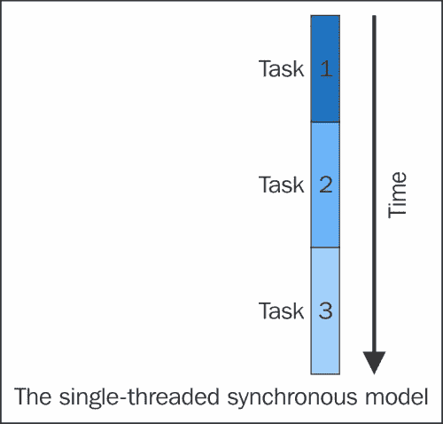
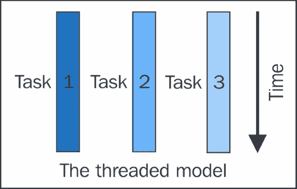
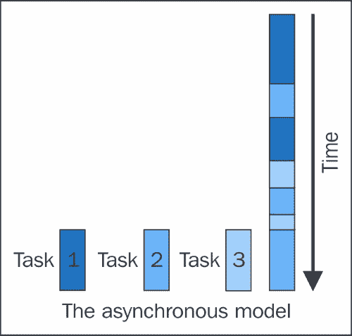
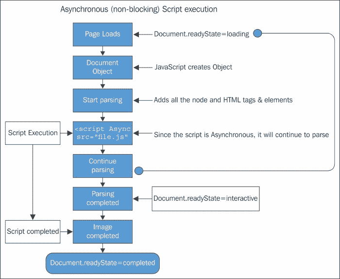

# 第二章：JavaScript 异步模型

在本章中，我们将探讨异步编程背后的模型，为什么需要它，以及如何在 JavaScript 中实现它。

我们还将学习编程模型及其重要性，从简单的编程模型到同步模型，再到异步模型。由于我们主要关注的是 JavaScript，它采用了一种异步编程模型，因此我们将比其他模型更详细地讨论它。

让我们从模型及其重要性开始。

模型基本上是在编程语言的编译器/解释器中设计和管理逻辑的模板，以便软件工程师可以在编写软件时使用这些逻辑。我们使用的每种编程语言都是基于某种编程模型设计的。由于软件工程师被要求解决一个特定问题或自动化任何特定服务，他们根据需要采用编程语言。

没有固定的规则将特定的语言分配给创建产品。工程师根据需要采用任何语言。

# 编程模型

理想情况下，我们将关注三种主要的编程模型，如下所述：

+   首先是单线程同步模型

+   第二种是多线程模型

+   第三种是异步编程模型

由于 JavaScript 采用异步模型，我们将更详细地讨论它。然而，让我们先解释一下这些编程模型是什么，以及它们如何为最终用户提供便利。

## 单线程同步模型

单线程同步模型是一种简单的编程模型或单线程同步编程模型，其中一个任务接着另一个任务。如果有任务队列，首先优先考虑第一个任务，依此类推。如下所示，这是完成事情的最简单方式：



单线程同步编程模型是`Queue`数据结构的一个最佳示例，遵循**先进先出**（**FIFO**）规则。该模型假设如果当前正在执行**任务 2**，那么必须在**任务 1**顺利完成且所有输出如预测或所需后才能进行。这种编程模型仍然支持为简单设备编写简单的程序。

## 多线程同步模型

与单线程编程不同，在多线程编程中，每个任务都在一个单独的线程中执行，因此多个任务需要多个线程。线程由操作系统管理，可能在具有多个进程或多个核心的系统上并发运行。

似乎很简单的多线程是由操作系统或在其上执行的程序管理的；它是一个复杂且耗时的工作，需要线程之间进行多级通信，以无死锁和错误地完成任务，正如下面的图表所示：



一些程序使用多个进程而不是多个线程来实现并行，尽管编程细节不同。

## 异步编程模型

在异步编程模型中，任务在单一控制线程中相互交织。

这个单一的线程可能包含多个嵌入线程，每个线程可能包含几个连续链接的任务。与线程情况相比，这个模型更简单，因为程序员总是知道在内存中给定时间槽执行任务的优先级。

考虑一个任务，在这个任务中，操作系统（或操作系统中的应用程序）使用某种场景来决定分配给一个任务多少时间，然后再给其他任务同样的机会。操作系统从一项任务中夺取控制并传递给另一项任务的行为称为**抢占**。

### 注意

多线程同步模型也被称为**抢占式多任务处理**。当它是异步的时候，它被称为**协作式多任务处理**。



在线程系统中，优先挂起一个线程并把另一个线程放到执行上的优先权不在程序员手中；这是基础程序控制的。通常，它是由操作系统本身控制的，但异步系统并非如此。

在异步系统中，线程的执行和挂起控制完全由程序员决定，线程除非被明确要求改变状态，否则不会改变其状态。

### 具有异步编程模型的密度

具有异步编程模型的所有特性，它也有其需要处理的密度。

由于执行控制和优先级分配掌握在程序员手中，他/她必须将每个任务组织成一系列更小的立即执行的步骤。如果一个任务使用了另一个任务的输出，那么依赖任务必须被设计成能够将其输入作为一系列不连续的位来接受；程序员就是这样在自己的任务中编织并设定优先级的。异步系统的灵魂在于，当任务被迫等待或被阻塞时，它能够远远超越同步系统。

### 为什么我们需要阻塞任务？

一个任务被强制阻塞的更常见原因是因为它正在等待执行 I/O 或与外部设备进行数据传输。普通的 CPU 处理数据传输的速度比任何网络链接都要快，这使得在 I/O 上花费了大量时间的同步程序被阻塞。因此，这样的程序也被称为**阻塞程序**。

异步模型的整个理念是避免浪费 CPU 时间并避免阻塞数据。当一个异步程序遇到一个在同步程序中通常会被阻塞的任务时，它将执行其他仍能取得进展的任务。因此，异步程序也被称为**非阻塞程序**。

Since the asynchronous program spends less time waiting and roughly giving an equal amount of time to every task, it supersedes synchronous programs.

与同步模型相比，异步模型在以下场景中表现最佳：

+   There are a large number of tasks, so it's likely that there is always at least one task that can make progress

+   The tasks perform lots of I/O, causing a synchronous program to waste lots of time blocking, when other tasks are running

+   The tasks are largely independent from one another, so there is little need for intertask communication (and thus for one task to wait for another)

keeping all the preceding points in mind, it will almost perfectly highlight a typical busy network, say a web server in a client-server environment, where each task represents a client requesting some information from the server. In such cases, an asynchronous model will not only increase the overall response time, but also add value to the performance by serving more clients (requests) at a time.

### Why not use some more threads?

At this point, you may ask why not add another thread by not relying on a single thread. Well, the answer is quite simple. The more the threads, the more memory it will consume, which in turn will create low performance and a higher turnaround time. Using more threads doesn't only come with a cost of memory, but also with effects on performance. With each thread, a certain overhead is linked to maintain the state of that particular thread, but multiple threads will be used when there is an absolute need of them, not for each and every other thing.

# Learning the JavaScript asynchronous model

keeping this knowledge in mind, if we see what the JavaScript asynchronous model is, we can now clearly relate to an asynchronous model in JavaScript and understand how it's implemented.

In non-web languages, most of the code we write is synchronous, that is, blocking. JavaScript does its stuff in a different way.

JavaScript 是一种单线程语言。我们已经知道单线程的真正含义，为了简单起见——同一个脚本的两部分不能同时运行。在浏览器中，JavaScript 与许多其他进程共享一个线程。这些“内联进程”可能因浏览器而异，但通常，**JavaScript**（**JS**）与绘制、更新样式和处理用户操作（这些进程中的一个活动会延迟其他进程）处于同一个队列中。

如图片所示，每当在浏览器中执行异步（非阻塞）脚本时，它会按照执行模式从上到下进行。从页面加载开始，脚本会进入文档对象，在那里创建 JavaScript 对象。然后脚本进入解析阶段，在这个阶段所有的节点和 HTML 标签都被添加。解析完成后，整个脚本作为异步（非阻塞）脚本加载到内存中。



## 如何用 JavaScript 实现异步模型

JavaScript 使用一个循环事件，其周期被称为“滴答声”（类似于时钟），因为它在 CPU 规定的 时间片段内运行。解释器负责检查每个滴答声是否需要执行异步回调。所有其他的同步操作都在同一个滴答声内进行。传递的时间值没有保证——无法知道下一次滴答声将会在什么时候，所以我们通常说回调会“尽快”运行；尽管如此，一些调用甚至可能会被放弃。

在 JavaScript 中，实现异步模型的核心方式有四种。这四种方法不仅有助于提高程序的性能，还有助于代码的更容易维护。这四种方法如下：

+   回调函数

+   事件监听器

+   发布/订阅模式

+   承诺对象

## JavaScript 中的回调

在 JavaScript 中，函数是一等公民，这意味着它们可以被当作对象对待，由于它们本身就是对象，所以它们可以做普通对象能做的一切，比如这些：

+   存储在变量中

+   作为其他函数的参数传递

+   在函数内创建

+   在处理了一些数据机制的负载后作为函数的返回值

回调函数，也称为高阶函数，是一个被传递到另一个函数（让我们称这个其他函数为`otherFunction`）作为参数的函数，回调函数在`otherFunction`内部被调用（执行）。

本质上，回调函数是一种模式（一个解决常见问题的既定方案），因此使用回调函数也称为回调模式。因为函数是一等对象，所以我们可以在 JavaScript 中使用回调函数。

由于函数是一等对象，我们可以在 JavaScript 中使用回调函数，但回调函数是什么呢？回调函数背后的想法来源于函数式编程，它使用函数作为参数来实现回调函数，就像把普通变量作为参数传递给函数一样简单。

一个常见的回调函数用法可以在以下代码行中看到：

```js
$("#btn_1).click().click.function() {
alert ("Button one was clicked");
});
```

以下代码解释了自身：

+   我们把一个函数作为`click`函数的参数

+   `click`函数将会调用（或执行）我们传递给它的回调函数

这是 JavaScript 中回调函数的典型用法，实际上，它在 jQuery 中得到了广泛应用。我们将在第八章*jQuery 中的 Promise*中更详细地研究 jQuery 中的 promise。

### 阻塞函数

当我们讨论 JavaScript 中的阻塞函数是什么以及应该如何实现它时，我们中的许多人实际上并不清楚地理解我们所说的 JavaScript 中的阻塞函数是什么意思。

作为人类，我们的头脑被设计成可以同时做很多事情，比如在读这本书的时候，你意识到了你周围的环境，你可以在思考和打字的同时进行，你可以在开车的时候和人交谈。

这些例子是为多线程模型准备的，但在我们的人体中有没有任何阻塞函数呢？答案是有的。我们有一个阻塞函数，正因为如此，我们的头脑和体内都有其他活动；它会在纳米秒级的短暂瞬间停止。这个阻塞函数叫做打喷嚏。当任何人类打喷嚏时，与头脑和身体相关的所有函数都会在纳米秒级的短暂瞬间被阻塞。人们很少注意到这一点。JavaScript 的阻塞函数也是如此。

# JavaScript 中的回调函数机制

这里的问题是，回调函数究竟是如何工作的？

众所周知，在 JS 中函数就像是一等对象，我们可以像变量一样传递它们，将它们作为函数返回，并在其他函数中使用它们。

当我们把一个回调函数作为参数传递给另一个函数时，我们只传递了函数定义。我们并没有在参数中执行函数。我们也没有用执行括号`()`来传递函数，因为我们在执行函数时才会这样做。

由于包含函数在其参数中有回调函数作为函数定义，它可以在任何时候执行回调。

需要注意的是，回调函数并不会立即执行。它是“回调”的，仍然可以通过参数对象在包含函数中稍后访问。

## 实现回调函数的基本规则

在实现回调函数时，有一些基本规则你需要记住。

回调通常很简单，但如果你正在编写自己的回调函数，你应该熟悉这条规则。以下是你在处理回调函数时必须考虑的一些关键要点：

+   使用命名或匿名函数作为回调

+   将参数传递给回调函数

+   在执行回调之前确保它是一个函数

## 处理回调地狱

由于 JavaScript 使用回调函数来处理异步控制流，嵌套回调的工作可能会变得混乱，而且大多数时候，会变得无法控制。

在编写回调或从任何其他库使用它时，需要非常小心。

如果不正确处理回调，会发生以下情况：

```js
func1(param, function (err, res)) {
    func1(param, function (err, res)) {
        func1(param, function (err, res)) {
            func1(param, function (err, res)) {
                func1(param, function (err, res)) {
                    func1(param, function (err, res)) {
                        //do something
                    });
                });
            });
        });
    });
});
```

前一种情况通常被称为**回调地狱**。这在 JavaScript 中很常见，这让工程师们痛苦不堪。这也使得代码对于其他团队成员来说难以理解，对于后续使用来说难以维护。最糟糕的是，它让工程师混淆，难以记住在哪里传递控制权。

以下是回调地狱的快速提醒：

+   永远不要让你的函数没有名字。给你的函数一个可理解且有意义的名字。这个名字必须表明它是一个执行某些操作的回调函数，而不是在主函数的参数中定义一个匿名函数。

+   让你的代码看起来不那么可怕，更容易编辑、重构和以后黑客攻击。大多数工程师在思考流程中编写代码，对代码的美观性关注较少，这使得代码的后期维护变得困难。使用在线工具，如[`www.jspretty.com`](http://www.jspretty.com)，为你的代码添加可读性。

+   将你的代码分成模块；不要在一个模块中编写所有的逻辑。相反，编写简短有意义的模块，这样你可以导出一个执行特定工作的代码段。然后，你可以将该模块导入到你的大型应用程序中。这种方法还可以帮助你在类似的应用程序中重用代码，从而使你的模块形成一个完整的库。

### 提示

**下载示例代码**

您可以从[`www.packtpub.com`](http://www.packtpub.com)下载您购买的所有 Pact Publishing 书籍的示例代码文件。如果您在其他地方购买了这本书，您可以访问[`www.packtpub.com/support`](http://www.packtpub.com/support)并注册，以便将文件直接通过电子邮件发送给您。

# 事件

事件是在执行特定操作时产生的信号。JavaScript 能够意识到这些信号并做出相应响应。

事件是在用户进行操作时以恒定流发出的消息。事件通常基于用户行为，如果编程得当，它们会按照指导行动。如果没有处理事件的处理程序，那么任何事件都是无用的。

由于 JavaScript 为程序员/工程师提供了漂亮的控制，它们处理事件、监控和响应事件的能力。你处理事件的能力越强，你的应用程序将越交互式。

## 事件处理机制

JavaScript 中实现事件有两大传统方式。第一种是通过 HTML 使用属性，第二种是通过脚本。

为了让你的应用程序响应用户的动作，你需要做以下的事情：

1.  决定应该监控哪个事件。

1.  设置在事件发生时触发函数的事件处理程序。

1.  编写为事件提供适当响应的函数。

事件处理程序总是由 on 感知的事件名称，例如，由事件处理程序处理的点击事件，`onClick()`。这个事件处理程序导致一个函数运行，而该函数为事件提供响应。

### DOM – 事件捕获和事件冒泡

**文档对象模型**（**DOM**）使得检测事件和为它们分配相关事件处理程序变得容易得多。这使用事件捕获和事件冒泡这两个概念来实现这一目的。让我们看看每个如何帮助检测和为正确的事件分配正确的处理程序。

捕获事件指的是事件在到达目的地文档的过程中的通信。同时，它具有捕获或拦截此事件的能力。

这使得整个往返过程逐渐向下到其树包含的元素，直到它达到自身。

相反，事件冒泡是事件捕获的逆过程。在冒泡中，事件首先被最内层的元素捕获和处理，然后传播到外层元素。

### 最常见的事件处理程序列表

有一系列事件处理程序需要根据不同的需求和情况进行使用，但让我们添加一些更常见和常规的事件处理程序。

### 注意

请记住，一些事件处理程序可能因浏览器而异，当涉及到 Microsoft 的 Internet Explorer 或 Mac 的 Safari 时，这个规范变得更加有限。

以下列表非常方便且自解释。为了更有效地使用这个列表，我建议程序员/工程师将其记下来以供参考。

| 事件类别 | 事件将何时被触发 | 事件处理程序 |
| --- | --- | --- |
| 浏览器事件 | 页面完成加载 | `Onload` |
|  | 页面从浏览器窗口中移除 | `Onunload` |
|  | JavaScript 抛出错误 | `Onerror` |
| 鼠标事件 | 用户点击某个元素 | `onclick` |
|  | 用户双击元素 | `ondblclick` |
|  | 鼠标按钮在元素上按下 | `onmousedown` |
|  | 鼠标按钮在元素上释放 | `onmouseup` |
|  | 鼠标指针移动到元素上 | `onmouseover` |
|  | 鼠标指针离开一个元素 | `Onmouseout` |
| 键盘事件 | 一个键被按下 | `onkeydown` |
|   | 释放一个键 | `onkeyup` |
|   | 按下并释放一个键 | `Onkeypress` |
| 表单事件 | 元素从指针或通过标签导航获得焦点 | `onfocus` |
|   | 元素失去焦点 | `onblur` |
|   | 用户在文本或文本区域字段中选择类型 | `onselect` |
|   | 用户提交表单 | `onsubmit` |
|   | 用户重置表单 | `onreset` |
|   | 元素失去焦点且自获得焦点以来内容已更改 | `onchange` |

如前所述，这些都是最常见的事件处理列表。有一个单独的规格列表是为微软的 Internet Explorer 准备的，可以在[`msdn.microsoft.com/en-us/library/ie/ms533051(v=vs.85).aspx`](http://msdn.microsoft.com/en-us/library/ie/ms533051(v=vs.85).aspx)找到。

事件兼容性的完整列表可以在以下链接找到：

可以在[`www.quirksmode.org/dom/events/index.html`](http://www.quirksmode.org/dom/events/index.html)找到兼容性信息。

## 事件响应中触发函数

JavaScript 事件需要触发以获得响应。事件处理程序负责响应此类事件，但正确触发事件有四种常用方法：

+   JavaScript 伪协议

+   内联事件处理程序

+   作为对象属性的处理程序

+   事件监听器

## JavaScript 中的事件类型

在 JavaScript 中有很多不同类型的事件，其中一些如下：

+   接口事件

+   鼠标事件

+   表单事件

+   万维网联盟（W3C）事件

+   微软事件

+   火狐事件

### 接口事件

接口事件是由用户的动作触发的。当用户点击任何元素时，他/她总是触发一个点击事件。当点击元素有特定的目的时，会引发一个额外的事件接口。

### 鼠标事件

当用户将鼠标移动到链接区域时，会触发 mouseover 事件。当他/她点击它时，会触发 click 事件。

### 表单事件

表单识别提交和重置事件，当用户提交或重置表单时会预测性地触发这些事件。提交事件是任何表单验证脚本的关键。

### 万维网联盟（W3C）事件

当文档的 DOM 结构发生变化时触发 W3C 事件。最通用的是`DOMSubtreeModified`事件，该事件在 HTML 元素以下的 DOM 树被触发时触发。

[DOM 2 事件规格](http://www.w3.org/TR/2000/REC-DOM-Level-2-Events-20001113/events.html#Events-eventgroupings-mutationevents)可以在[`www.w3.org/TR/2000/REC-DOM-Level-2-Events-20001113/events.html#Events-eventgroupings-mutationevents`](http://www.w3.org/TR/2000/REC-DOM-Level-2-Events-20001113/events.html#Events-eventgroupings-mutationevents)找到。

### 微软事件

微软创建了许多自定义事件处理规格，这些规格（当然）只能在它的平台上运行。这可以在[`msdn.microsoft.com/en-us/library/ie/ms533051(v=vs.85).aspx`](http://msdn.microsoft.com/en-us/library/ie/ms533051(v=vs.85).aspx)找到。

### 火狐事件

火狐有自己的规格，可以在[`developer.mozilla.org/en/docs/Web/API/Event`](https://developer.mozilla.org/en/docs/Web/API/Event)找到。

# 发布者/订阅者

事件是另一种异步回调执行完成时进行通信的解决方案。一个对象可以成为发射器并发布其他对象可以监听的事件。这是观察者模式的绝佳例子。

这种方法的本质与“事件监听器”相似，但比后者更好，因为我们可以通过查看“消息中心”来找出有多少信号存在以及每个信号的订阅者数量，从而运行监控程序。

## 观察者模式的简要描述

观察者提供了对象之间非常松散的耦合。这提供了向收听它的人广播更改的能力。这种广播可能是针对单个观察者，也可能是一群等待收听的观察者。主题维护一个观察者的列表，以便广播更新。主题还提供了一个接口，供对象注册自己。如果它们不在列表中，主题不在乎谁或什么在听它。这是主题与观察者解耦的方式，允许轻松替换一个观察者另一个观察者，甚至是主题，只要它保持相同的事件序列。

### 观察者的正式定义

以下是对观察者的定义：

|   | *定义对象之间的一对多依赖关系，以便当一个对象改变状态时，所有依赖的对象都会自动通知并更新。* |   |
| --- | --- | --- |
|   | --*四人帮* |

这个定义来源于*设计模式：可重用对象导向软件的元素*，*Addison-Wesley 专业出版社*第 20 页。

### 拉模型和推模型

当你创建一个主题/观察者关系时，你希望向主题发送信息；有时，这些信息可能很简单，或者有时，可能是附加信息。这也可能发生，即你的观察者发送了一小部分信息，作为回应，你的主题查询更多的信息。

当你发送大量信息时，这被称为**推**模型，而当观察者查询更多信息时，这被称为**拉**模型。

|   | *拉模型强调主题对其观察者的无知，而推模型则假设主题了解其观察者需求的某些方面。推模型可能导致观察者更难以复用，因为主题类对观察者类做出了假设，这些假设可能并不总是正确的。另一方面，拉模型可能因为观察者类必须在没有主题帮助的情况下确定发生了什么变化而不够高效。* |   |
| --- | --- | --- |
|   | --*四人帮* |

这个定义来源于*设计模式：可重用对象导向软件的元素*，*Addison-Wesley 专业出版社*第 320 页。

#### 观察者/推-发布模式的诞生

这种观察者/推送发布模式提供了一种思考如何维持应用程序不同部分之间关系的方式。这也让我们知道我们应用程序的哪个部分应该用观察者和主题来替换，以实现最大性能和可维护性。在使用此模式特别是在 JavaScript 中时，以及其他语言一般要注意以下几点：

+   使用这种模式，可以将应用程序分解为更小、耦合度更低的部分，以改善代码管理和提高可重用性。

+   观察者模式最适合在需要保持相关对象之间一致性，而不使类紧密耦合的情况下使用。

+   由于观察者和主题之间的动态关系，它提供了极大的灵活性，当应用程序的不同部分紧密耦合时，可能不容易实现。

#### 观察者/推送发布模式的缺点

由于每个模式都有其代价，这个模式也是如此。最常见的是，由于其松耦合性质，有时难以维护对象的状态和追踪信息流路径，导致未订阅此信息的人员向主题接收不相关信息。

以下是一些常见的缺点：

+   通过将发布者与订阅者解耦，有时可能难以获得保证，我们的应用程序的特定部分可能如我们期望的那样运行。

+   此模式的另一个缺点是，订阅者不知道彼此的存在，并且对在发布者之间切换的成本视而不见。

+   由于订阅者和发布者之间的动态关系，更新依赖关系可能难以追踪。

# Promise 对象

Promise 对象是实现异步编程模型的最后一个主要概念。我们将研究 Promise 作为一种设计模式。

Promise 是 JavaScript 中相对较新的概念，但它已经存在很长时间，并在其他语言中得到实现。

Promise 是一个包含两个主要属性的抽象，这使得它们更易于使用：

+   您可以为一个 Promise 附加多个回调。

+   值和状态（错误）被传递下去

+   由于这些属性，Promise 使使用回调的常见异步模式变得容易。

可以将 Promise 定义为：

> *Promise 是由一个对象传递给另一个对象的可观察令牌。Promise 包装了一个操作，并在操作成功或失败时通知它们的观察者。*

此定义的来源是 *设计模式：可重用对象导向软件的元素*，*Addison-Wesley 专业出版社*。

由于本书的范围围绕 Promise 以及它的实现方式，我们将在第三章*Promise 范式*中详细讨论它。

# 总结 – 异步编程模型

到目前为止，我们已经看到了 JavaScript 中异步模型是如何实现的。这是理解 JavaScript 有自己的异步编程模型实现的一个核心方面，并且它在异步编程模型中使用了大量的核心概念。

+   异步模式非常重要。在浏览器中，应该异步执行非常耗时的操作，以避免浏览器无响应的时间；最好的例子就是 Ajax 操作。

+   在服务器端，由于环境是单线程的，所以执行异步模式。因此，如果你允许同步执行所有的 HTTP 请求，服务器性能将急剧下降，很快就会失去响应性。

+   这些都是简单的理由，说明了为什么在现代应用程序的各个方面都广泛接受 JavaScript 的实现。像 MongoDB 这样的数据库，Node.js 作为服务器端 JavaScript，Angular.js 和 Express.js 作为前端，以及逻辑构建工具，都是 JavaScript 在整个行业中如何被大量实施的一个例子。它们的堆栈通常被称为 MEAN 堆栈（MongoDB、Angular.js、Express.js 和 Node.js）。

# 总结

在这一章中，我们学习了编程模型是什么以及它们在不同语言中是如何实现的，从简单的编程模型到同步模型，再到异步模型。

我们还看到了任务是如何在内存中组织的，以及它们是如何根据它们的顺序和优先级来服务的，以及编程模型是如何决定要服务哪个任务的。

我们已经了解了在 JavaScript 中异步编程模型是如何工作的，以及为什么学习异步模型的动态对于编写更好的、可维护的、健壮的代码是必要的。

这一章还解释了 JavaScript 的主要概念是如何实现的，以及它们在应用程序开发中从不同角度扮演的角色。

我们还将看到回调、事件和观察者在 JavaScript 中的应用，以及这些核心概念如何推动当今的应用程序开发场景。

在下一章第三章，*承诺范式*，我们将深入学习承诺以及它是如何帮助使应用程序更加健壮和可扩展的。
