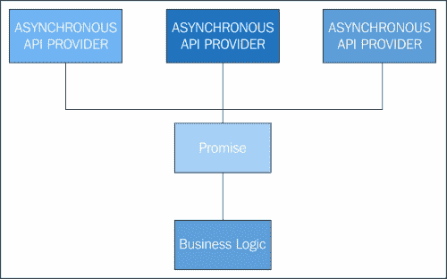
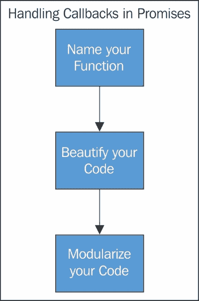

# 第三章．承诺范式

在这一章中，我们将重点关注承诺范式是什么，它起源于何处，语言如何实现它，以及它能为我们的生活解决哪些问题。

我们已经在第一章，*Promises.js*中简要讨论了承诺模式的起源。在这一章中，我们将更详细地探讨这个主题，以一种通用的方式，以便阐明不同语言中采用承诺的逻辑和理论，特别是它如何帮助我们今天在现代编程中。

# 回调，重新审视

在之前的章节中，你已经学习了 JavaScript 机制是如何工作的。JavaScript 的单线程模型有其局限性，可以通过更好地使用回调来控制。然而，像回调地狱这样的场景真的推动工程师去寻找并实现一种更好的回调控制方法，以最大化程序的性能，同时仍保持在单线程内。回调是一个可以作为另一个函数的参数传递给它的函数，当它被调用时执行。

使用回调绝对没有错，但处理异步事件还有许多其他选项。承诺是处理异步事件的一种方式，其效率要高于其家族中的许多其他异步工具。

为了更清楚地了解为什么我们在异步编程中需要实现 Promises.js，我们需要了解承诺和延迟对象背后的概念。

# 承诺

与 JavaScript 的异步事件一起工作的好处是，即使程序没有正在进行它需要工作的值，它也会继续执行。这种情况被称为未完成工作中的已知值。这可能会使得在 JavaScript 中处理异步事件具有挑战性。

承诺是一种编程结构，表示一个尚不可知的值。JavaScript 中的承诺让我们能够以并行的方式编写异步代码，就像同步代码一样。

# 延迟

延迟是一个代表尚未执行的工作的对象，而承诺是一个代表尚未知晓的值的对象。

这些对象提供了一种方式，用于照顾注册多个回调到一个自管理的回调队列中，调用回调队列，以及传递任何同步函数的成功或失败状态。

# 承诺和延迟之间有什么关系？

直到现在，在第二章，*JavaScript 异步模型*中，我们讨论了承诺及其工作原理。让我们看看承诺和延迟是如何工作的：

1.  每个延迟对象都有一个承诺作为未来结果的代理。

1.  延迟对象可以通过其调用者解决或拒绝，这使得承诺与解决器分离，而承诺是异步函数返回的值。

1.  承诺可以被多个消费者接收，每个消费者都会不断地观察到解决结果，而解决器/延迟器可以被任何数量的用户接收，第一个解决它的用户将解决承诺。

# 承诺 API 的标准行为

关于承诺/提案的规范很少，必须实现概念的真正实现。这些规范是实现承诺的关键，任何库/语言都必须遵守它以实现真正的实现。

一个承诺如下：

+   当一个操作完成时，承诺返回一个最终的值。

+   一个承诺有三种状态：未完成（当一个承诺等待被处理时），已完成（当一个承诺已完成并获得了所需的结果），最后，失败（当承诺的结果已获得，但不是所期望的）。

+   承诺有一个`then`属性，必须是一个函数，并且必须返回一个承诺。为了完成一个承诺，必须调用`fulfilledHandler`，`errorHandler`和`progressHandler`。

+   通过承诺，回调处理程序返回履行值从返回的承诺。

+   承诺值必须是持久的。这应该保持一个状态，在该状态下，值必须被保留。

本 API 不定义承诺是如何创建的。它只提供了一个必要的接口，承诺提供给承诺消费者与之交互。实现者可以自由定义承诺是如何生成的。一些承诺可能提供它们自己的函数来履行承诺，其他承诺可能通过对承诺消费者不可见的机制来履行。承诺本身可能还包括其他一些方便的方法。

# 交互式承诺

交互式承诺是通过向其武器库中添加两个更多函数`get`和`call`来扩展承诺，从而为范式添加更多价值：

+   `get(propertyName)`：这个函数请求从承诺的目标中获得给定的属性。它还返回一个承诺，提供从承诺的目标中声明的属性的值。

+   `call(functionName, arg1, arg2…)`：这个函数请求在承诺的目标上调用给定的方法/函数。它还返回一个承诺，提供所请求函数调用的返回值。

# 承诺的状态和返回值

从第一章，*Promises.js*，我们已经知道承诺基于三种状态。让我们根据承诺范式复习这些状态。

承诺有三种状态：

+   未完成的承诺

+   已完成的承诺

+   失败的承诺

承诺存在于这三个状态之一。

承诺的开始是从一个未完成的状态。这是由于承诺是一个未知值的代理。

当承诺充满它等待的值时，它处于已完成的 state。如果它返回一个异常，承诺将被标记为失败。

承诺可能从未满足状态转移到满足或失败状态。观察者（或等待的对象/事件）在承诺被拒绝或满足时收到通知。一旦承诺被拒绝或解决，其输出（值或状态）就不能被修改。

下面的代码片段可以帮助你比理论更容易地理解：

```js
// Promise to be filled with future value
var futureValue = new Promise();

// .then() will return a new promise
var anotherFutureValue = futureValue.then();

// Promise state handlers (must be a function ).
// The returned value of the fulfilled / failed handler will be the value of the promise.
futureValue.then({

    // Called if/when the promise is fulfilled
    fulfilledHandler: function() {},

    // Called if/when the promise fails
    errorHandler: function() {},

    // Called for progress events (not all implementations of promises have this)
    progressHandler: function() {}
});
```

# 常见的序列模式

承诺和延迟对象使我们能够将简单任务与复杂任务结合在一起，从而实现对它们序列的精细控制。

如前所述，延迟对象代表尚未执行的工作，而承诺对象代表当前未知的值。这个概念帮助我们编写类似同步代码的异步 JavaScript。

承诺使相对容易地将小功能抽象化，这些功能跨多个异步任务共享。让我们看看承诺使更容易的常见序列模式：

+   堆叠

+   并行

+   顺序

## 堆叠

堆叠在任何应用程序中将多个处理程序绑定到同一个承诺事件。这有助于以更简洁的方式绑定多个处理程序，以便在代码中给出顺序控制。以下是堆叠和绑定处理器的示例：

```js
var req = $.ajax(url);
  req.done(function () {
      console.log('your assigned Request has been completed');
  });

  //Somewhere in the application
  req.done(function (retrievedData) {
      $('#contentPlaceholder').html(retrievedData);
  });
```

## 并行

并行简单地要求多个承诺返回单个承诺，该承诺通知它们多个完成。

使用并行序列，你可以编写多个承诺以返回单个承诺。在并行序列中，一组异步任务并发执行并返回一个承诺，当所有任务成功或失败时返回一个承诺（在失败的情况下）。

下面是一个显示并行序列返回单个承诺的一般代码片段：

```js
$.when(task01, task02).done(function () {
      console.log('taskOne and taskTwo were finished');
});
```

为了更清楚地理解，这里有一个处理并行序列的示例函数：

```js
function testPromiseParallelSequence(tasks)
{

    var results = [];  //an array of async tasks 

    //tasks.map() will map all the return call was made.

    taskPromises = tasks.map(function(task) 
    {
        return task();
    }); //returning all the promise
```

## 顺序

如果一个动作的输出是另一个动作的输入，则需要按顺序执行动作。HTTP 请求就是这样一个例子，其中一个动作是另一个动作的输入。顺序还允许您将代码的一部分控制权传递给另一部分。

它按照应用程序的需求或需要排队以供服务的任务范围执行任务。

以下是一个通用示例，其中一个序列处理并将控制权传递给另一个序列作为输入：

```js
// seq1 and seq2 represents sequence one and two respectively
var seq1, seq2, url; 
url = 'http://sampleurl.com;
seq1 = $.ajax(url);
   seq2 = seq1.then(

    function (data) {
        var def = new $.Deferred();

        setTimeout(function () {
            console.log('Request completed');
            def.resolve();
        },1000);

      return def.promise();
  },

    function (err) {
        console.log('sequence 1 failed: Ajax request');
    }
  );
  seq2.done(function () {
      console.log('Sequence completed')
      setTimeout("console.log('end')",500);
  });
```

# 解耦事件和应用程序逻辑

承诺提供了一种有效的方法来解耦事件和应用程序逻辑。这使得事件的实现和应用程序逻辑更容易构建，维护也更可销售。



一种简单的方法，展示承诺如何解耦事件和业务逻辑

承诺的持久性重要性在于它不是一个“EventEmitter”，但可以通过智能实现转换为一个。但话说回来，它将是一个残废的。

## 承诺作为事件发射器

使用 promises 作为事件发射器的问题在于它的组合。它是 promises 中的事件进展无法与 EventEmitter 很好地组合。而 promises 链和事件进展，另一方面，无法做到这一点。Q 库的实现放弃了进展，以估计为代价在 v2 中。这就是为什么进展从未包含在 ECMAScript 6 中的原因。我们将在第九章，*JavaScript – The Future Is Now*中学习关于这些新兴技术的许多内容。

回到我们的话题，即如何通过 promises 解耦事件和应用程序逻辑，我们可以通过同时传递值来使用事件触发 promises 的解析/失败，从而使我们能够解耦。以下是代码：

```js
var def, getData, updateUI, resolvePromise;
// The Promise and handler
def = new $.Deferred();

updateUI = function (data) {
    $('p').html('I got the data!');
    $('div').html(data);
};
getData = $.ajax({
          url: '/echo/html/', 
          data: {
              html: 'testhtml', 
              delay: 3
          }, 
          type: 'post'
    })
    .done(function(resp) {
        return resp;
    })
    .fail(function (error) {
        throw new Error("Error getting the data");
    });

// Event Handler
resolvePromise = function (ev) {
    ev.preventDefault();
    def.resolve(ev.type, this);
    return def.promise();
};

// Bind the Event
$(document).on('click', 'button', resolvePromise);

def.then(function() {
    return getData;   
})
.then(function(data) {
    updateUI(data);
})
.done(function(promiseValue, el) {
    console.log('The promise was resolved by: ', promiseValue, ' on ', el);
});
// Console output: The promise was resolved by: click on <button> </button>
```

以下代码的参考资料可在[`jsfiddle.net/cwebbdesign/NEssP/2`](http://jsfiddle.net/cwebbdesign/NEssP/2)找到。

# promises 规定不要做什么

Promises 明确指出在实现 promises 范式时不要做什么。我们在第二章，《JavaScript 异步模型》中看到了大部分这些规则。让我们从 promises 范式中看看这些，以刷新我们的记忆。

在实现 promises 时，无论您使用哪种实现，都必须考虑以下两种做法：

+   避免进入回调地狱

+   避免使用未命名的 promises

## 避免进入回调地狱

我们已经了解到回调是什么以及如何处理它们。回调是实现异步模型的绝佳方式，但它们也有自己的代价。在某些时候，回调变得难以管理，这个时刻在你开始深入回调时到来。你越深入，处理起来就越困难，从而导致你陷入回调地狱的场景。

所有 promises 实现都简单而明智地解决了这个问题。



解决回调地狱的便捷方法

## 避免使用未命名的 promises

正如我们在第二章，《JavaScript 异步模型》中所见，使用未命名的 promises 可能造成巨大问题，并且会花费比编写和测试普通函数更多的时间。在某些情况下，不给出函数名称是好的，也是推荐的，但留下未命名的 promise 并不是一个好的实践。

如果有人认为匿名函数难以处理，那么不合理命名的函数难以理解和支持。我建议您在实际编写代码之前制定一个合适的、预先决定的命名约定，并且应该做得很好。我更喜欢使用微软风格的驼峰命名法，其中函数的起始名是小写的，而连接名是大写的。

# Promises 和异常

考虑一个在承诺范式内抛出异常的函数。如果您试图查看异常抛出函数发生了什么，您将找不到任何踪迹或日志。您在屏幕或控制台上看不到任何输出。为什么？原因隐藏在承诺的基本知识中。

承诺被设计成产生两种类型的输出-承诺要么被实现，要么被拒绝。因此，自然地，它不会在任何输出流中出现，因为承诺没有被设计成产生除了这两个预定义状态之外的任何其他输出。然而，并不是承诺没有提供任何处理异常的设施。实际上，它通过实现适当的处理程序来捕获异常并在任何所需的输出流中显示原因，提供了一种健壮的方法来显示和处理此类异常。

在大多数承诺范式中，异常是通过`fail`和`then`处理的。处理程序因库而异，也因语言而异。在许多高级高级语言中，错误和异常处理是自动管理的，不会增加太多代码，也无需明确告诉编译器/解释器，但在那些没有自动处理的库和语言中，您必须编写显式的代码来手动处理异常。

在这一点上，值得注意的是我们使用了 Q 中的一些代码，只是为了让您理解异常处理也是承诺实现的一部分，以及如果发生异常，如何处理异常。在我们下一章中，我们将重点介绍如何在其他库和语言中实现承诺。

回到主题，像许多其他实现一样，Q 有自己的承诺处理机制。

考虑这段代码即将抛出异常：

```js
function imException()
{
throw "imException";

}//end of code
```

由于这不是使用 Q 处理承诺异常的正确实现，将根本没有任何输出，如果我们想要根据 Q 中承诺范式的实现来处理它，我们将想要添加一个拒绝处理程序。

让我们以 Q 为例，看看我们是否可以使用其`fcall()`方法添加相同的函数：

```js
Q.fcall(imException);
```

这个方法调用不是用来处理异常的，所以它不会显示任何东西。要处理它，我们需要添加一个拒绝处理程序，以帮助我们跟踪和监视异常。

## 失败方法

处理异常的最简单方法是使用`fail`。让我们重构我们的代码以实现`fail`方法：

```js
// code view before exception handler
Q.fcall(imException);

//code after exception handler
Q.fcall(imException) .fail(function(err) { console.log(err); });
```

## 然后方法

通常，我们会使用`then`来处理承诺链。这将接收两个参数，并根据这些处理器的返回承诺执行之一：

```js
Q.fcall(imException)
.then(
    // first handler-fulfill
    function() { }, 

    // second handler -reject
    function(err) {
        console.log(err);
    }
);
```

第一个参数是一个完成方法，第二个是拒绝处理程序，如前所示的代码。使用这些简单技术，Q 实现了异常处理。

# 处理承诺异常的最佳实践

承诺提供了一种令人印象深刻的方式来处理异常。承诺中的异常处理相当简单且易于实现，几乎所有库和实现都支持一种通用的实现方式。以下是一些处理异常的最佳实践：

## 使您的异常有意义

为了最大化性能和可维护性，抛出可理解的错误。最佳实践是拒绝一个承诺，并用错误实例来拒绝它。养成不拒绝错误对象或原始值的习惯。

## 监视、预期并处理异常

关注错误对执行流程的影响。最佳实践是预料你处理程序中的失败。你越擅长预见，你对执行流程的控制就会越好。总是考虑您的拒绝处理程序是否应该由解析处理程序中的失败调用，或者是否应该有不同的行为。

## 保持干净

当你处理完异常后， error occurs as soon as possible. When the chain of promises is processed and a result has been delivered in either rejected or fulfilled state, terminate the chain and clean up the unused thread. This will help not only in optimizing the throughput of code but also in creating manageable outputs.

Mozilla 为其承诺中的错误处理有自己的实现，这可以在[`developer.mozilla.org/en-US/docs/Mozilla/JavaScript_code_modules/Promise.jsm/Promise`](https://developer.mozilla.org/en-US/docs/Mozilla/JavaScript_code_modules/Promise.jsm/Promise)中看到。

# 选择承诺时的考虑

在开始使用承诺库之前，有许多因素你应该记住。并不是所有的承诺实现都是一样的。它们在提供的 API 实用程序、性能以及有时行为方面都各不相同。

承诺/提案只是概述了承诺的拟议行为，而不是实现规范。这导致不同的库提供不同的功能集。它们之间的区别如下：

+   所有的承诺/赞美都有`then()`；函数，并且它们 API 中还有各种不同的功能。此外，它们仍然能够与其他承诺进行交换。

+   在承诺/兼容库中，抛出的异常被翻译为一个拒绝，并且`errorHandler()`方法用异常调用。

由于不同的实现，当使用返回或期望承诺/兼容的库时，存在互操作性问题。

选择承诺库可能会有所权衡。每个库都有自己的优点和缺点，完全取决于您根据特定用例和项目需求决定使用什么。

# 摘要

在本章中，我们介绍了承诺（promise）的范式及其背后的概念。我们讲解了承诺、延迟（deferred）、常见的承诺链以及承诺如何帮助解耦业务逻辑和应用逻辑的概念性知识。我们还讲解了承诺与事件发射器（event emitters）之间的关系及其背后的理念。

由于本章的性质，我们现在可以根据所获得的知识选择我们应该使用的承诺库。

在我们下一章中，我们将探讨不同编程语言中承诺（promise）的实现，并检查它们为开发人员和最终用户带来的便利。
