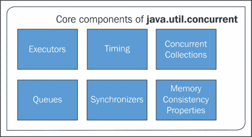

# 第四章：实现承诺

在上一章中，第三章，*承诺范式*，我们看到了承诺及其理论是如何结合在一起，形成软件工程范式的一个全新的惊人的图片，尤其是在当今现代异步应用开发生命周期中。

在本章中，我们将开始实验如何通过实现承诺来形成这个概念。为什么我们需要了解它的实现？这个问题的答案很简单；我们需要了解我们迄今为止开发的这个概念是否真实，以及这个概念有多少是真正适用的。另外，通过这些承诺的小实现，我们将绘制我们基础的基石，以便在后面的章节中在其他技术中使用承诺。那么，让我们来看看我们将如何进行这个实现阶段。

# 如何实现承诺

到目前为止，我们已经了解了承诺的概念、它的基本组成部分以及它在几乎所有实现中提供的一些基本功能，但是这些实现是如何使用它的呢？嗯，其实很简单。每种实现，无论是作为一种语言还是一种库，都会映射承诺的基本概念。然后，它将其映射到一个编译器/解释器或代码中。这使得编写的代码或函数以承诺的范式行为，最终呈现出它的实现。

承诺现在已经成为了许多语言的标准包的一部分。显而易见的是，它们根据自己的需求以自己的方式实现了它。我们将在本章中详细探讨这些语言是如何实现承诺的概念。

# 在 Java 中的实现

Java 是世界上最受欢迎和最受尊敬的编程语言之一，并在全球各地的数百万设备上使用。除了 Java 之外，无需再说什么，它是工程师在创建使用多线程和受控异步模式和行为的应用程序软件时的首选。Java 是少数几种默认在编译器中实现异步行为的语言之一，这有助于程序员编写健壮、可扩展和可维护的软件。

## Java 的 util 包

自然地，Java 对承诺的概念及其实现有更广泛的接受。在 `java.util.concurrent` 包中，关于承诺及其实现有很多实现。我们挑选了一些有助于实现承诺或与该概念相匹配的接口和类。

### Java 实现承诺的机制

在 `java.util.concurrent` 包中，有许多接口和类可以帮助我们编写并发和异步代码，但有一些特定的接口和库是专门用于这个承诺/未来的实现。

`java.util.concurrent` 包是并发编程（正如其名）的家园，也是几个小型标准化扩展框架的家园。它还帮助实现一些在正常情况下难以工作的核心类。

### `java.util.concurrent` 核心组件

`java.util.concurrent` 包中包含许多类和组件，但使其特别适合于并发工作的核心组件包括：



`java.util.concurrent` 包的核心组件

#### Executor

`Executor` 是一个简单的标准化接口，通常用于定义自定义线程子系统。这些子系统包括线程池、异步 I/O 和基于任务的轻量级框架。

在线程中创建的任务可以在线程中执行“相同的任务执行线程”或在新线程中执行；这也可以在调用执行的线程中顺序或并发执行。无论执行模式任务采用哪个线程，都完全取决于使用的具体 `Executor` 类。

`ExecutiveService` 接口提供了一个完全堆叠的异步任务框架。这个接口是为了处理池中的多个任务，包括控制 `Executor` 的关闭、管理不同池中的队列以及任务的调度。还有一些与 `ExecutiveService` 一起工作以添加对延迟和周期性任务执行支持的关联。其中之一是 `ScheduledExecutorService`，它是一个子接口，与 `ExecutiveService` 接口一起管理延迟和周期性任务的执行。

另一个接口称为 `ExecutorService` 接口，它提供方法来安排任何表示为可调用函数的执行。

#### 队列

当谈到队列时，首先浮现的想法是**先进先出**（**FIFO**）模式。就像其他语言以自己的方式应用这种数据结构一样，Java 通过使用来自其 `java.util.concurrent` 包的 `ConcurrentLinkedQueue` 类，将其视为一个高效、可扩展的线程安全、非阻塞的 FIFO 队列。在同一包中，五种实现支持 `BlockingQueue` 接口。

`BlockingQueue` 接口是一个队列，具有高级的等待机制。在所有之前的处理完成之前，它保持队列不进入进一步处理。在存储元素时，它也等待空间使队列可用。

以下是 `BlockingQueue` 接口的五种实现：

+   `LinkedBlockingQueue`

+   `ArrayBlockingQueue`

+   `SynchronousQueue`

+   `PriorityBlockingQueue`

+   `DelayQueue`

我们将在下一节讨论一些这些相关实现。

### Timing

由于`util`是工具包，它有以类和接口形式存在的控制，帮助工程师使用他们日常例行的事情。这样一个包就是方法或接口的时间。这是为了执行某些指令操作，最终，当操作完成时，它们会自己超时。

我们中的大多数人已经意识到会话创建和会话超时的重要性，特别是那些从事 Web 编程的程序员。会话跟踪是一个独立的主题，与本章的结构并没有太大关系，因此我们将把重点回到时间话题上。

这个打包就像是 Java 程序的定时带。在任何引擎中，定时带的作用是确保某些机械操作在指定时间内完成；这个包也是如此。它控制函数的时效性和非确定性等待。需要记住的是，所有这些方法在每种情况下都使用超时。这有助于线程定义方法在线程池中花费的时间，并节省实际程序以实现可伸缩性。

### 同步器

Java 提供了一个低级别的线程创建和执行，以便程序员可以轻松地处理和修改线程级控制。在早期版本中，线程的控制被认为是处理最困难的话题，因为与线程的自动控制相比，有很多线程和它们同步的手动控制。在这个时候，Java 在控制多个线程方面比它的竞争语言先进得多，但线程的操作对于 Java 工程师来说仍然是一项相当艰巨的任务。

在 Java 的后续版本中，这个问题被认为是寻找规律的最重要问题，最终，在版本 7 的出现时，编译器已经解决了工程师面临的大部分问题。

在当前版本，即版本 8 中，有五个类帮助实现同步：

+   `Semaphore`类是一个经典的并发工具，已经存在很长时间了（[`docs.oracle.com/javase/7/docs/api/java/util/concurrent/Semaphore.html`](http://docs.oracle.com/javase/7/docs/api/java/util/concurrent/Semaphore.html)）

+   `CountDownLatch`类是一个非常简单但又常见的工具，用于阻塞直到给定的信号、事件或其他线程中执行的操作被处理（[`docs.oracle.com/javase/7/docs/api/java/util/concurrent/CountDownLatch.html`](http://docs.oracle.com/javase/7/docs/api/java/util/concurrent/CountDownLatch.html)）

+   `CyclicBarrier`类是一个可重置的多路同步点，这在某些并行编程风格中非常有用（[`docs.oracle.com/javase/7/docs/api/java/util/concurrent/CyclicBarrier.html`](http://docs.oracle.com/javase/7/docs/api/java/util/concurrent/CyclicBarrier.html)）

+   `Phaser`类提供了一种更灵活的屏障形式，可用于控制多个线程之间的分阶段计算([`docs.oracle.com/javase/7/docs/api/java/util/concurrent/Phaser.html`](http://docs.oracle.com/javase/7/docs/api/java/util/concurrent/Phaser.html))

+   `Exchanger`类允许两个线程在汇合点交换对象，在许多流水线设计中很有用([`docs.oracle.com/javase/7/docs/api/java/util/concurrent/Exchanger.html`](http://docs.oracle.com/javase/7/docs/api/java/util/concurrent/Exchanger.html))

### 并发集合

`Concurrent`包为多线程环境提供了实现，并具有以下实现。

由于它具有更具体的同步设施，其中一些类使用前缀`Concurrent`来强调它提供的额外设施。还有一些更为突出的例子：

+   `ConcurrentHashMap`

+   `ConcurrentSkipListMap`

+   `ConcurrentSkipListSet`

+   `CopyOnWriteArrayList`

+   写入后复制数组集（CopyOnWriteArraySet）

并发集合的优点是其安全的线程，而不是被单一的锁定机制忽视。只有在`ConcurrentHashMap`的情况下，它才允许任何数量的并发读取以及并发写入。那么，我们为什么还要使用同步类呢？答案是它们在防止使用单个锁对集合的所有访问方面非常有用，但这有代价，并且可扩展性较差。

在其他情况下，如果有多个线程排队访问一个公共集合，建议使用当前版本的类，而当集合是不共享的或者在持有其他锁时可以访问时，则使用未同步的锁。

## Java 实现承诺的方式

Java 通过其承诺类和接口实现承诺范式。尽管它的异步行为是 Java 的核心和旗舰特性之一，但以下是 Java 中承诺实现的成分：

+   接口：

    +   完成服务（CompletionService）

    +   `ExecutorService`

    +   `Future`

+   类：

    +   `Delayed`

    +   延迟队列（DelayQueue）

    +   `FutureTask`

### 完成服务（CompletionService）

`CompletionService`接口作为一项服务，用于区分新异步任务与已完成任务的结果。这个过程很简单：生产者添加执行的任务。对于消费者来说，这个接口接收完成的任务并按它们被标记为完成时的顺序处理它们的结果。这个服务可用于许多并发操作，如管理异步 I/O。异步 I/O 的机制是任务提交在程序的一部分或程序集或系统中，然后在不同程序的部分执行。提交顺序可能与最初请求的顺序不同。

异步 I/O 的机制是，它在程序的一部分，如缓冲区中读取任务并存储起来。

这可以是一个单一的程序（如浏览器），或者是一组程序（如操作系统线程池）。线程处理者决定哪个线程需要首先执行。

这个接口依赖于一个单独的执行器，或者实际上执行任务，因此`CompletionService`接口只管理一个内部的完成队列。接口实现时，需要一个类来完成这个功能，`ExecutorCompletionService`类提供了这样的功能。

### `ExecutorService`

`ExecutorService`接口有两个主要角色要执行——一个是提供管理异步任务终止的方法，另一个是提供可以产生跟踪未来值的方法。这种跟踪可以针对一个或多个异步任务进行。

使用`Executor`管理`ExecutorService`：

+   `ExecutorService`继承了`Executor`，提供了管理终止和生成未来值的方法，以跟踪进度。

+   当`ExecutorService`关闭时，它会拒绝所有新任务。它们已经通过两种不同的方法加载：

    +   `shutdown()`

    +   `shutdownNow()`

`shutdown()`方法允许内存中的任务完成它们的状态，然后终止它们。同时，它防止内存进入并处理任何即将到来的任务。另一方面，`shutdownnow()`并不提供这样的自由；它只是立即终止内存中的所有内容。这也完全拒绝了新任务在内存中的进入，通过使现有线程无效来实现。

这两种方法各有其重要性，但由于它们都与现有任务的终止有关，因此在使用时必须非常小心，并充分理解潜在的后果。

以下代码片段来自原始的 Java 文档，具体内容可在[`docs.oracle.com/javase/7/docs/api/java/util/concurrent/ExecutorService.html`](http://docs.oracle.com/javase/7/docs/api/java/util/concurrent/ExecutorService.html)找到：

```js
class NetworkService implements Runnable {
  private final ServerSocket serverSocket;
  private final ExecutorService pool;

  public NetworkService(int port, int poolSize)throws IOException {
    serverSocket = new ServerSocket(port);
    pool = Executors.newFixedThreadPool(poolSize);
  }

  public void run() { // run the service
    try {
      for (;;) {
        pool.execute(new Handler(serverSocket.accept()));
      }
    } catch (IOException ex) {
      pool.shutdown();
    }
  }
}

class Handler implements Runnable {
  private final Socket socket;
  Handler(Socket socket) { this.socket = socket; }
  public void run() {
    // read and service request on socket
  }
}
```

以下方法通过两个阶段关闭`ExecutorService`接口：首先，通过调用 shutdown 来拒绝新任务，然后如有必要，调用`shutdownNow()`来取消任何挂起的任务：

```js
void shutdownAndAwaitTermination(ExecutorService pool) {
  pool.shutdown(); // Disable new tasks from being submitted
  try {
    // Wait a while for existing tasks to terminate
    if (!pool.awaitTermination(60, TimeUnit.SECONDS)) {
      pool.shutdownNow(); // Cancel currently executing tasks
      // Wait a while for tasks to respond to being cancelled
      if (!pool.awaitTermination(60, TimeUnit.SECONDS))
        System.err.println("Pool did not terminate");
    }
  } catch (InterruptedException ie) {
    // (Re-)Cancel if current thread also interrupted
    pool.shutdownNow();
    // Preserve interrupt status
    Thread.currentThread().interrupt();
  }
}
```

### `Future`

在 Java 中，`future`代表了异步计算结果的值。提供了跟踪结果状态的方法。这些方法表明当前状态是等待还是其他状态。

问题是，你只能通过`get`或者计算完成时才能获取结果。

取消可以通过 cancel 方法完成；这非常容易记住。使用取消方法可以取消`Future`值。

你也可以通过调用该方法检查任务是否正常完成或被取消。一旦计算完成，就不能取消了；这让我们觉得很有希望，就像承诺的概念一样。

你也可以使用`Future`来取消任务。尽管这并不是一个很好的方法，如果你想要这么做，那么你可以声明许多类型的`Future`对象，并要求方法返回 null；就这样！你的任务再次被取消了。这必须在任务最终计算之前完成。

以下是代码片段：

```js
interface ArchiveSearcher { String search(String target); }

class App { 

  ExecutorService executor = ...ArchiveSearcher searcher = ...
  void showSearch(final String target)throws InterruptedException {
    Future<String> future
    = executor.submit(new Callable<String>() {
      public String call() {
        return searcher.search(target);
      }});
    displayOtherThings(); // do other things while searching
    try {
      displayText(future.get()); // use future
    } catch (ExecutionException ex) { cleanup(); return; }
  }
}
```

`FutureTask`类是实现`Future`并实现`Runnable`的`Future`的实现，因此可以由`Executor`执行。例如，使用 submit 的先前构造可以替换为以下内容：

```js
FutureTask<String> future =
  new FutureTask<String>(new Callable<String>() {
    public String call() {
    return searcher.search(target);
  }});
executor.execute(future);
```

### 延迟和 DelayedQueue

`Delay`是一个使用标记来标记在延迟之后进行操作的对象的接口。

`DelayedQueue`是一个用于收集所有延迟/过期的对象的无限队列。由于它是一个队列，必须有一个延迟已经很久很久的头元素。

由于它是一个队列，并且与`queue`数据结构相似，它有一个称为头部的起始点和一个称为脚部的结束点。当说到未来时，我们在这里提到的队列有一个值，它已经由于失败的承诺或未实现的承诺而过期。

如果没有找到这样的元素，在过期发生时，轮询会返回 null 吗？嗯，当方法`getDelay(TimeUnit.NANOSECONDS)`返回的值小于或等于零时，它就会发生。以这种方式过期的元素不能被移除，所以它们被视为正常元素。

### `FutureTask`

`FutureTask`是可取消的异步计算。这是`Future`的基本提供者，它从开始一个方法到取消它都加载了方法。这也有助于检索计算的结果，因为它是实现，当计算完成时可以提取结果。不用说，一旦计算出结果，它就不能被拉回或更改，因为这是一个承诺。

### 总结 Java 和 Promises.js

如果我们总结一下前面的讨论，很清楚 Java 在处理 Promises.js 方面有更清晰的方法和实现。它是一种处理异步行为成熟的方式，特别是，它在处理多线程方面的表现远胜于其他语言。然而，每种实现都有它的缺点，Java 也是如此，这是可以接受的，因为你不能简单地复制和粘贴理论，就像任何编译器/解释器一样。开源社区贡献了少数更多支持的框架/库来补充它的实现。

# 向 JDeferred 打个招呼

受到 jQuery 中承诺实现的启发，一些 Java 工程师开始开发一个名为`JDeferred`的库。它通过留下`java.util.concurrent`包中的巨大漏洞，实现了承诺的概念。这是`JDeferred`工作的简要介绍。让我们深入了解它是什么以及与其他市场上可用的实现相比的独特优势。

就像 jQuery 有一个延迟对象一样，`JDeferred`也是设计成与 Java 编译器的行为和联系相似。`JDeferred`不仅与 jQuery 的承诺实现相似，而且还将其支持扩展到了 Android Deferred Object。第八章，*jQuery 中的承诺*是专门讨论 jQuery 及其机制和承诺工作的章节，所以我们现在可以跳过这部分，看看 Android Deferred Object 是什么，以及它如何融入承诺的实现。

## 关于 Android Deferred Object 说几句

当我们讨论`JDeferred`时，如果不展示 Android Deferred Object 及其属性的存在，那是不公平的。Android Deferred Object 是一个工具，或者更简单地说，它是一个可链式的工具对象，实际上可以为 Android 领域做所有相同的事情。它可以在单个回调队列中注册多个回调；它可以调用回调队列并在处理后执行。它还可以将成功或失败的状态传达给等待的任何函数；无论它是一个同步函数还是一个异步函数都不重要。

其工作相当直接。你从一个异步执行的函数中得到一个承诺。由于我们可以围绕承诺进行操作，因此你可以附加回调以获取关于成功或失败的通知。无论这部分程序是同步执行还是异步执行，当它如预期般完成时，承诺会被调用以解决任何错误，它调用`rejected`参数。

### 用例 1——任务的对象成功和失败回调

比如说你需要一个异步的 HTTP 请求。使用 Android Deferred Object 的一个简单方法是将请求包装到`DeferredAsyncTask`中，并将回调附加到你的操作上。以下是这种场景的代码：

```js
new DeferredAsyncTask<HttpResponse,HttpResponse,Void>() {
  protected abstract Resolved doInBackground() throws Exception {
    //do your async code here
  }
}
.done( new ResolveCallback<HttpResponse> {
  public void onResolve(HttpResponse resolved) {
    //your success code here
  }
})
.fail ( new RejectCallback<HttpResponse> {
  public void onReject(HttpResponse rejected) {
     //your failure code here
  }
});
```

前述代码的参考可以在[`github.com/CodeAndMagic/android-deferred-object`](https://github.com/CodeAndMagic/android-deferred-object)找到。

### 用例 2——合并多个承诺

此用例最适合当你需要将多个已执行的承诺合并成一个单一的承诺，通过将它们作为一个单一的承诺来合并。一个方便的方法是调用`DeferredObject.when`方法：

```js
Promise<A1,B1,C1> p1 = new DeferredAsyncTask<A1,B1,C1>() { ... }; 
Promise<A2,B2,C2> p1 = new DeferredAsyncTask<A2,B2,C2>() { ... };
Promise<A3,B3,C3> p3 = new DeferredAsyncTask<A3,B3,C3>() { ... };
//when gives you a new promise that gets triggered when all the merged promises are resolved or one of them fails
DeferredObject.when(p1,p2,p3)
.done(new ResolveCallback<MergedPromiseResult3<A1,A2,A3>() {
  public void onResolve(MergedPromiseResult3<A1,A2,A3> resolved){
    Log.i(TAG, "got: " + resolved.first() + resolved.second() + resolved.third());
  }
})
.fail(new RejectCallback<MergedPromiseReject>() {
  public void onReject(MergedPromiseReject rejected) {
    //failure handling here
  }
})
.progress(new ProgressCallback<MergedPromiseProgress>() {
  public void onProgress(final MergedPromiseProgress progress){
    //you get notified as the merged promises keep coming in
  }
});
//Merging doesn't stop you do add individual callbacks for promises that are in the merge
p1.done(...).fail(...)
//Or even merging them in another way
DeferredObject.when(p1,p2).done(...).fail(...)
```

# JDeferred 的机制

回到我们 JDeferred 的核心讨论，这个实现几乎采纳了来自承诺的所有特性，并被认为比其他任何库都更符合承诺。我们将看看它提供哪些特性，以及它们是如何在内部实现的。

## JDeferred 的特性

`JDeferred`的实现提供了展示 Java 中承诺范式的所有必要方法。它具有诸如延迟对象和承诺、承诺回调、多个承诺、可调用和可运行方法以及 Java 的泛型支持等特性。

以下表格总结了特性及其可用的实现：

| 特性 | 可用的实现 |
| --- | --- |
| 延迟对象和承诺 | N/A |
| 承诺回调 | `.then(…)``.done(…)``.fail(…)``.progress(…)``.always(…)` |
| 多个承诺 | `.when(p1, p2, p3, …).then(…)` |
| 可调用和可运行包装器 | `.when(new Runnable() {…})` |
| Java 泛型支持 | `Deferred<Integer, Exception, Double> deferred;``deferred.resolve(10);``deferred.reject(new Exception());``deferred.progress(0.80);` |

## 使用 JDeferred 玩转代码

现在我们将探讨一些这个实现的常见示例，这些示例最常被使用。我们将讨论以下主题：

+   延迟对象和承诺

+   延迟管理器

+   可运行和可调用

+   `wait()`和`waitSafely()`

+   过滤器

+   管道

### 延迟对象和承诺

以下代码将帮助你理解`JDeferred`如何实现延迟对象和承诺。这段代码附有注释，以便更好地理解：

```js
//creating new deferred object by calling method DeferredObject();

Deferred deferredObj = new DeferredObject();

//now its time to make some promise
Promise promise = deferredObj.promise();

promise.done(new DoneCallback() {

  public void onDone(Object result) {
    //some code here
  }

}).fail(new FailCallback() {
  public void onFail(Object rejection) {
    //some more code
  }
}).progress(new ProgressCallback() {
  public void onProgress(Object progress) {
    //some code here

  }
}).always(new AlwaysCallback() {
  public void onAlways(State state, Object result, Object rejection) {
    //some code here

  }
});
```

### 延迟管理器

延迟管理器是一种简单的方式来管理你的延迟对象。调用延迟管理器的默认方法，然后添加你想要的承诺数量：

```js
//create Deferred Manager's object
DeferredManager theDeferredManager = new DefaultDeferredManager();

// uncomment this to specify Executor

// DeferredManager theDeferredManager = new DefaultDeferredManager(myExecutorService);

//add and initialize number of promises

Promise pm1, pm2, pm3;
theDeferredManager.when(p1, p2, p3)

// or you can add here .done(…)
//or you can add the fail here using   .fail(…)
```

### 可运行和可调用

可运行和可调用，与承诺一样好，可以用如下方式使用：

```js
DeferredManager theDeferredManager = new DefaultDeferredManager();

theDeferredManager.when(new Callable<Integer>()

{
  public Integer call() {
    // return something
    // or throw a new exception
  }

}).done(new DoneCallback<Integer>() {
  public void onDone(Integer result) {
    ...
  }

}).fail(new FailCallback<Throwable>() {
  public void onFail(Throwable e) {
    ...
  }

});
```

如果你想要做以下事情，你可以使用`DeferredCallable`和`DeferredRunnable`：

+   通知关于可调用或可运行的进度

+   你想让你的`Deferred`对象

以下是一个示例代码：

```js
final Deferred deferred = ...
Promise ThePromise = deferred.promise();
ThePromise.then(…);

Runnable runable = new Runnable() {

  public void run() {
    while (…) {
      deferred.notify(myProgress);
    }
    deferred.resolve("done");
  }
}
```

扩展`DeferredRunnable`：

```js
DeferredManager theDeferredManager = …;
theDeferredManager.when(new DeferredRunnable<Double>(){
  public void run() {
    while (…) {
      notify(myProgress);
    }
  }
}).then(…);
```

### `wait()`和`waitSafely()`

`wait()`和`waitSafely()`函数是`JDeferred`想要控制所有异步任务的部分。这并不推荐，但在某些情况下非常有用：

```js
Promise promise = theDeferredManager.when(...)
  .done(...) //when done
  .fail(...) // when fail

synchronized (p)
  while (promise.isPending()) {
    try {
      promise.wait();
    } catch (InterruptedException e) { ... }
  }
}
```

上述代码的快捷方式如下：

```js
Promise promise = theDeferredManager.when(...)
  .done(...)
  .fail(...)

try {
  promise.waitSafely(); //replaced waitSafely(); 
} catch (InterruptedException e) {
  ... 
}
```

### 过滤器

以下是我们将用于过滤承诺和延迟对象的代码：

```js
Deferred d = …;
Promise promise = d.promise();
Promise filtered = promise.then(new DoneFilter<Integer, Integer>() {
  public Integer filterDone(Integer result)
    return result * 10;
  }
});

filtered.done(new DoneCallback<Integer>{
  public void onDone(Integer result) {
    // result would be original * 10
```

### 管道

`JDeferred`中的管道也是按顺序进行异步任务计算的：

```js
Deferred d = ...;
Promise promise = d.promise();

promise.then(new DonePipe<Integer, Integer, Exception, Void>() {
  public Deferred<Integer, Exception, Void> pipeDone(Integer result) {
    if (result < 100) {
      return new DeferredObject<Integer, Void, Void>().resolve(result);
    } else {
    return new DeferredObject<Integer, Void, Void>().reject(new Exception(...));
    }
  }
}).done(...).fail(...);

d.resolve(80) -> done!
d.resolve(100) -> fail!
```

# Ultimate JDeferred

正如你所看到的，这是使用承诺的 Java 的一个更强大的实现。当谈到实现承诺范式时，Java 非常强大。

实际上，Java 本身就有很多强大的功能，但当谈到适当的实现时，这样的框架可以帮助我们。因为它们是社区维护的，所以在质量方面存在问题，你可能会找到未测试和未经验证的代码，这可能会浪费你的时间。然而，与 jQuery 相比，`JDeferred`的实现几乎相同。

# 摘要

在本书的这一章节中，我们实际上已经开始掌握 Promise 的旅程了。这一章节涵盖了为什么我们要实现 Promise 以及为什么我们选择 Java 作为本章节的核心。Java 的功能比任何其他编程语言都要丰富，并且它也非常努力地使其与异步行为的自动化保持更多或 less 相似。我们详细探讨了 Java 的`util.concurrent`类的核心组件，并通过这些组件我们看到了来自 Java 在线文档的许多实际例子。由于 Java 由于我们所看到的限制而不能完全实现承诺范式，因此有一个开源库，其行为与承诺范式完全一样。`JDeferred`通过充分利用实现承诺的核心价值观（如`future`、`deferred`等）消除了我们心中的其他疑虑。

在下一章中，我们将通过一个更实用的例子来加深对 WinRT 中 Promise 的理解。
